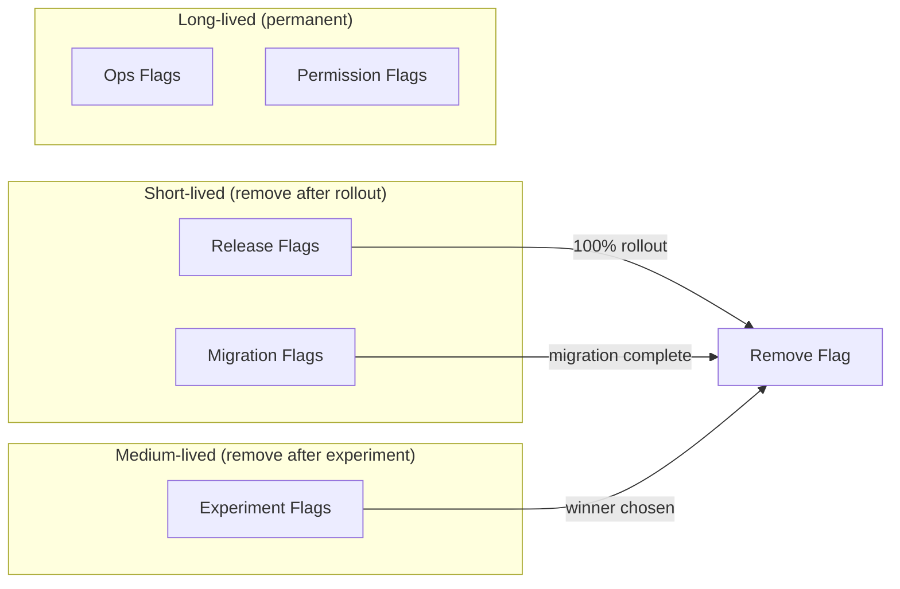
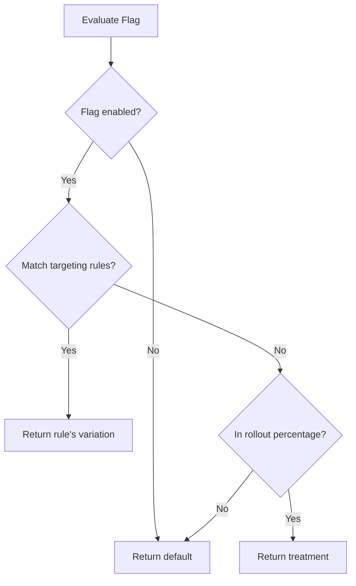
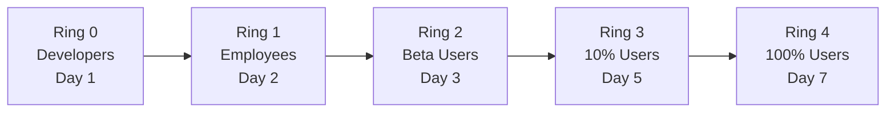
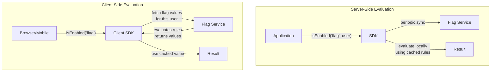
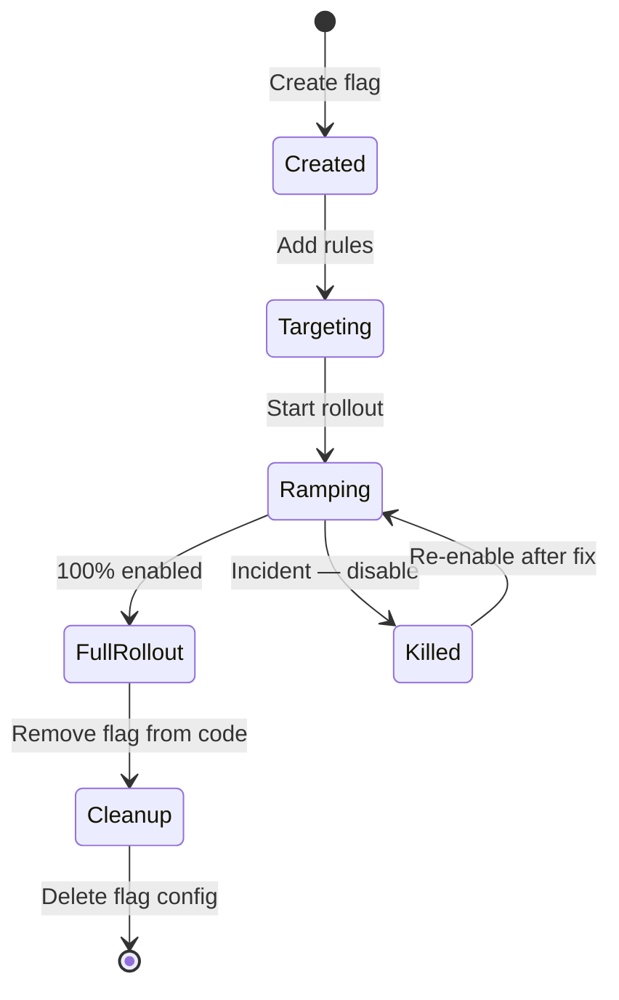

# Feature Flags Deep Dive

Feature flags (also called feature toggles, feature switches, or feature gates) decouple **deployment** from **release**. You deploy code that is invisible to users, then reveal it gradually — by percentage, by user segment, by geography — with a configuration change instead of a code change. If something goes wrong, you flip the flag off. No rollback, no deploy, no downtime.

This sounds simple. In practice, feature flags introduce a combinatorial explosion of code paths, create testing nightmares, accumulate as technical debt, and require careful lifecycle management. This page covers the full depth: flag types, evaluation strategies, progressive rollout patterns, platform comparison, and the critical topic of flag debt.

**Related**: [Feature Flags Deployment](/devops/deployment-strategies/feature-flags-deployment) | [A/B Testing](/production-blueprints/ab-testing/) | [Feature Flag Service Blueprint](/production-blueprints/feature-flag-service/)

---

## Flag Types

Not all flags serve the same purpose. Understanding the type determines the flag's lifecycle and ownership.

| Type | Purpose | Lifetime | Owner | Example |
|------|---------|----------|-------|---------|
| **Release flag** | Hide incomplete features | Days to weeks | Engineering | `new-checkout-flow` |
| **Experiment flag** | A/B test variants | Weeks to months | Product | `pricing-page-variant-b` |
| **Ops flag** | Kill switches, circuit breakers | Permanent | SRE/Ops | `disable-recommendations` |
| **Permission flag** | Feature gating by plan/role | Permanent | Product | `enterprise-sso` |
| **Migration flag** | Gradual data/code migration | Weeks | Engineering | `use-new-payment-processor` |



::: warning The Most Common Mistake
Treating all flags as permanent. Release flags and experiment flags must have a **sunset date**. If you don't remove them, you accumulate flag debt — dead code paths that no one dares to remove because no one knows if the flag is still evaluated somewhere.
:::

---

## Evaluation Logic

### Basic Boolean Evaluation

```typescript
// Simplest flag: on/off for everyone
if (featureFlags.isEnabled('new-dashboard')) {
  renderNewDashboard();
} else {
  renderOldDashboard();
}
```

### Percentage Rollout

Roll out to a percentage of users. The key: the assignment must be **sticky** — the same user always gets the same result.

```typescript
class FlagEvaluator {
  isEnabled(flagKey: string, userId: string): boolean {
    const flag = this.getFlag(flagKey);
    if (!flag.enabled) return false;

    // Sticky assignment via deterministic hash
    const hash = this.murmurHash(`${flagKey}:${userId}`);
    const bucket = hash % 100; // 0-99

    return bucket < flag.rolloutPercentage;
  }

  private murmurHash(key: string): number {
    let hash = 0;
    for (let i = 0; i < key.length; i++) {
      hash = (hash * 31 + key.charCodeAt(i)) | 0;
    }
    return Math.abs(hash);
  }
}
```

::: tip Why Hash, Not Random?
Using `Math.random()` means a user might see the new feature on one request and the old feature on the next. A deterministic hash of `flagKey + userId` ensures the same user always lands in the same bucket, even across multiple servers with no shared state.
:::

### Targeting Rules

```typescript
interface FlagRule {
  attribute: string;         // 'country', 'plan', 'email', 'percentage'
  operator: 'eq' | 'neq' | 'in' | 'contains' | 'gte' | 'lte' | 'matches';
  value: string | string[] | number;
  variation: string;         // Which variant to serve
}

interface FlagConfig {
  key: string;
  enabled: boolean;
  defaultVariation: string;
  rules: FlagRule[];
  rolloutPercentage: number;
}

// Example flag configuration:
// {
//   key: "new-checkout",
//   enabled: true,
//   defaultVariation: "control",
//   rules: [
//     { attribute: "email", operator: "contains", value: "@example.com", variation: "treatment" },
//     { attribute: "country", operator: "in", value: ["US", "CA"], variation: "treatment" },
//     { attribute: "plan", operator: "eq", value: "enterprise", variation: "treatment" }
//   ],
//   rolloutPercentage: 25
// }
```

### Evaluation Order



---

## Progressive Rollout Strategies

### Canary Rollout

```
Day 1:  1% (internal employees)     → Monitor errors, latency
Day 2:  5% (beta users)             → Monitor feature metrics
Day 3:  25% (random users)          → Monitor business KPIs
Day 5:  50%                         → Watch for edge cases
Day 7:  100%                        → Full rollout
Day 14: Remove flag                 → Clean up code
```

### Ring-Based Rollout



### Geography-Based Rollout

```typescript
// Roll out to smaller markets first
const geoRollout = {
  'new-payment-flow': {
    phase1: { countries: ['NZ', 'IE'], percentage: 100 },  // Small markets
    phase2: { countries: ['AU', 'CA'], percentage: 100 },   // Medium markets
    phase3: { countries: ['US', 'GB'], percentage: 25 },    // Large markets (gradual)
    phase4: { countries: ['*'], percentage: 100 },           // Global
  }
};
```

### Kill Switch Pattern

Ops flags that let you instantly disable expensive features during incidents:

```typescript
class RecommendationService {
  async getRecommendations(userId: string): Promise<Product[]> {
    // Kill switch: disable during high load
    if (!featureFlags.isEnabled('enable-recommendations')) {
      return []; // Return empty, don't call the expensive ML service
    }

    return this.mlService.getRecommendations(userId);
  }
}
```

---

## Platform Comparison

| Feature | LaunchDarkly | Unleash | Flagsmith | Flipt | PostHog |
|---------|-------------|---------|-----------|-------|---------|
| **Pricing** | $$$$ | Open source + paid | Open source + paid | Open source | Open source + paid |
| **Self-hosted** | No | Yes | Yes | Yes | Yes |
| **Streaming updates** | SSE | SSE / Webhook | Polling / SSE | gRPC / Polling | Polling |
| **SDKs** | 25+ languages | 15+ languages | 12+ languages | Go, Node, Python, Ruby | JS, Python, Go |
| **A/B testing** | Via Experimentation | External only | Built-in | No | Built-in |
| **Audit log** | Yes | Yes | Yes | Yes | Yes |
| **Segments/targeting** | Advanced | Good | Good | Basic | Good |
| **Edge evaluation** | Yes (Relay Proxy) | Yes (Edge) | Yes | Yes (Hybrid) | No |
| **Flag lifecycle** | Stale detection | Manual | Manual | Manual | Manual |

### Architecture: Server-Side vs. Client-Side Evaluation



::: warning Client-Side Security
Client-side SDKs receive the **evaluated flag value** for the current user, not the raw rules. This prevents users from seeing targeting rules, percentages, or other users' segments. Never send server-side flag configurations to the client.
:::

---

## Implementation Patterns

### Feature Flag SDK Design

```typescript
class FeatureFlagClient {
  private flags: Map<string, FlagConfig> = new Map();
  private refreshInterval: NodeJS.Timeout;

  constructor(private config: { apiKey: string; serverUrl: string }) {}

  async initialize(): Promise<void> {
    await this.fetchFlags();
    // Poll for updates every 30 seconds
    this.refreshInterval = setInterval(() => this.fetchFlags(), 30_000);
  }

  isEnabled(key: string, context?: EvaluationContext): boolean {
    const flag = this.flags.get(key);
    if (!flag || !flag.enabled) return false;

    if (!context) return flag.defaultVariation === 'treatment';

    // Evaluate targeting rules
    for (const rule of flag.rules) {
      if (this.matchesRule(rule, context)) {
        return rule.variation === 'treatment';
      }
    }

    // Fall through to percentage rollout
    if (context.userId) {
      const bucket = this.hash(`${key}:${context.userId}`) % 100;
      return bucket < flag.rolloutPercentage;
    }

    return false;
  }

  getVariation(key: string, context: EvaluationContext): string {
    const flag = this.flags.get(key);
    if (!flag || !flag.enabled) return flag?.defaultVariation ?? 'control';

    for (const rule of flag.rules) {
      if (this.matchesRule(rule, context)) {
        return rule.variation;
      }
    }

    if (context.userId) {
      const bucket = this.hash(`${key}:${context.userId}`) % 100;
      return bucket < flag.rolloutPercentage ? 'treatment' : 'control';
    }

    return flag.defaultVariation;
  }

  private matchesRule(rule: FlagRule, context: EvaluationContext): boolean {
    const value = context[rule.attribute as keyof EvaluationContext];
    if (value === undefined) return false;

    switch (rule.operator) {
      case 'eq': return value === rule.value;
      case 'neq': return value !== rule.value;
      case 'in': return Array.isArray(rule.value) && rule.value.includes(String(value));
      case 'contains': return String(value).includes(String(rule.value));
      default: return false;
    }
  }

  private hash(input: string): number {
    let h = 0;
    for (let i = 0; i < input.length; i++) {
      h = (h * 31 + input.charCodeAt(i)) | 0;
    }
    return Math.abs(h);
  }

  private async fetchFlags(): Promise<void> {
    const res = await fetch(`${this.config.serverUrl}/api/flags`, {
      headers: { Authorization: `Bearer ${this.config.apiKey}` },
    });
    const data = await res.json();
    this.flags = new Map(data.flags.map((f: FlagConfig) => [f.key, f]));
  }

  destroy(): void {
    clearInterval(this.refreshInterval);
  }
}

interface EvaluationContext {
  userId?: string;
  email?: string;
  country?: string;
  plan?: string;
  [key: string]: string | number | boolean | undefined;
}
```

### Testing with Feature Flags

```typescript
// Testing: override flags in tests
class TestFlagClient extends FeatureFlagClient {
  private overrides: Map<string, boolean> = new Map();

  withFlag(key: string, enabled: boolean): TestFlagClient {
    this.overrides.set(key, enabled);
    return this;
  }

  isEnabled(key: string): boolean {
    return this.overrides.get(key) ?? false;
  }
}

// Usage in tests:
const flags = new TestFlagClient()
  .withFlag('new-checkout', true)
  .withFlag('dark-mode', false);
```

::: warning Test Combinatorial Explosion
With N flags, you have $2^N$ possible code paths. You cannot test all combinations. Focus on:
1. All flags OFF (baseline)
2. Each flag ON individually
3. All flags ON (full integration)
4. Known risky combinations
:::

---

## Flag Debt Management

Flag debt is the technical debt created by feature flags that outlive their purpose. Unused flags pollute the codebase with dead code paths.

### The Flag Lifecycle



### Stale Flag Detection

```typescript
class FlagAuditor {
  async findStaleFlags(maxAgeDays: number = 30): Promise<StaleFlag[]> {
    const flags = await this.getAllFlags();
    const stale: StaleFlag[] = [];

    for (const flag of flags) {
      const daysSinceCreated = this.daysSince(flag.createdAt);
      const daysSinceModified = this.daysSince(flag.updatedAt);

      if (flag.rolloutPercentage === 100 && daysSinceModified > maxAgeDays) {
        stale.push({
          key: flag.key,
          reason: 'Fully rolled out for 30+ days — remove flag and dead code path',
          age: daysSinceCreated,
          owner: flag.createdBy,
        });
      }

      if (flag.rolloutPercentage === 0 && daysSinceModified > maxAgeDays) {
        stale.push({
          key: flag.key,
          reason: 'Disabled for 30+ days — remove flag and feature code',
          age: daysSinceCreated,
          owner: flag.createdBy,
        });
      }
    }

    return stale;
  }

  private daysSince(date: Date): number {
    return Math.floor((Date.now() - date.getTime()) / 86_400_000);
  }
}
```

### Flag Hygiene Rules

| Rule | Rationale |
|------|-----------|
| Every release flag must have a sunset date | Prevents indefinite accumulation |
| Flag owner is responsible for removal | Clear accountability |
| Monthly stale flag review | Catch forgotten flags |
| Max 50 active flags per service | Prevent combinatorial explosion |
| Flag naming convention: `{type}-{feature}-{date}` | `release-new-checkout-2026-03` |
| Remove flag code within 2 sprints of 100% rollout | Before context is lost |

---

## Summary

| Aspect | Detail |
|--------|--------|
| Purpose | Decouple deployment from release |
| Flag types | Release, experiment, ops, permission, migration |
| Evaluation | Targeting rules + sticky percentage rollout (deterministic hash) |
| Rollout strategies | Canary, ring-based, geography-based, percentage ramp |
| Kill switches | Permanent ops flags for incident response |
| Platforms | LaunchDarkly (SaaS), Unleash/Flagsmith/Flipt (self-hosted) |
| Key risk | Flag debt — unused flags accumulating dead code paths |
| Mitigation | Sunset dates, stale flag detection, monthly audits |

**Related**: [Feature Flags Deployment](/devops/deployment-strategies/feature-flags-deployment) | [A/B Testing](/production-blueprints/ab-testing/) | [Canary Deployments](/devops/deployment-strategies/canary) | [Release Engineering](/devops/release-engineering)
