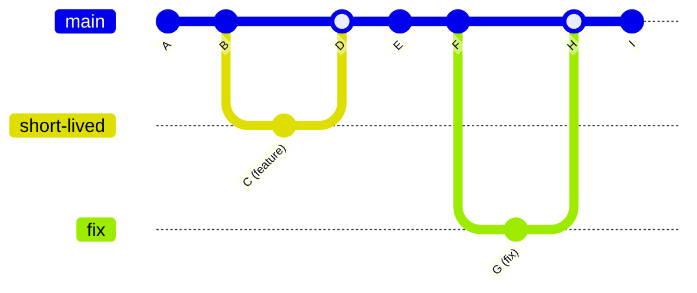
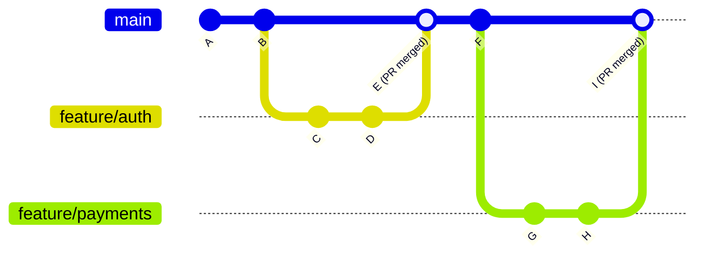
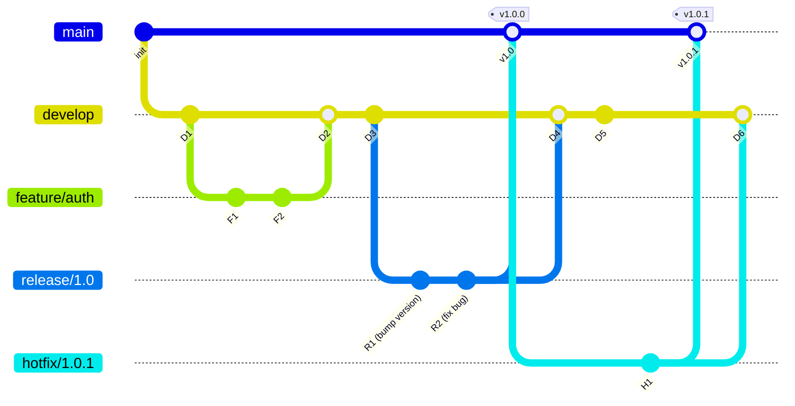
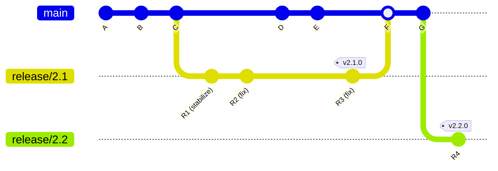

# Branching Strategies

A branching strategy is a contract between team members about how code flows from an idea to production. The wrong strategy creates merge hell, slow release cycles, and integration bugs that only appear in staging. The right strategy makes continuous delivery natural and conflict-free.

There is no universally "best" strategy — the right choice depends on your team size, release cadence, customer expectations, and the maturity of your testing and deployment infrastructure. This page covers every major strategy, explains the tradeoffs, and gives you a decision framework.

## Trunk-Based Development

Trunk-based development (TBD) is the simplest and most demanding strategy. All developers commit directly to a single branch (`main` or `trunk`). There are no long-lived feature branches. If feature branches exist at all, they live for no more than 1-2 days before being merged.

### How It Works



Rules:
1. **Main is always releasable.** Every commit on main must pass all tests and be deployable to production.
2. **Branches live < 2 days.** If a feature takes longer, use feature flags to merge incomplete work behind a toggle.
3. **Small, frequent commits.** Each commit is a small, self-contained change. Avoid large PRs.
4. **Comprehensive automated tests.** CI runs on every commit to main. Failures are fixed immediately.

### Prerequisites for Trunk-Based Development

| Prerequisite | Why It's Required |
|---|---|
| Fast, reliable CI pipeline (< 10 minutes) | Every commit to main must be validated quickly |
| High test coverage (> 80% meaningful coverage) | Incomplete changes merged behind flags must not break tests |
| Feature flag infrastructure | Needed to merge incomplete features safely |
| Experienced, disciplined team | Small commits, continuous integration, and trunk discipline require skill |
| Automated deployment pipeline | Main is always releasable, so deploying should be push-button |

### Advantages

- **No merge hell.** Branches are never more than a day old, so conflicts are trivial.
- **Continuous integration is real.** Code is integrated into the shared codebase multiple times per day, not once per sprint.
- **Faster feedback loops.** Integration bugs are caught immediately, not two weeks later during a "merge party."
- **Simpler mental model.** One branch. That is it.

### Disadvantages

- **Requires engineering maturity.** Without fast CI, good tests, and feature flags, trunk-based development becomes trunk-based chaos.
- **Incomplete features are in main.** Feature flags add complexity and must be cleaned up.
- **Not suitable for open-source projects** where contributors cannot commit directly to main.

::: tip Who Uses Trunk-Based Development?
Google, Meta (for most services), LinkedIn, Netflix, and Spotify all practice trunk-based development. Google has a single monolithic repository with 25,000+ developers committing to one trunk. The scale is possible because of world-class CI, automated testing, and feature flags.
:::

## GitHub Flow

GitHub Flow is a lightweight strategy built around pull requests. It is the default workflow for most GitHub-hosted projects and is the most popular strategy for small to medium teams.

### How It Works



Rules:
1. **Main is always deployable.** Protected branch — no direct pushes.
2. **Create a branch for every change.** Name it descriptively: `feature/auth`, `fix/login-timeout`, `chore/update-deps`.
3. **Open a pull request early.** PRs are the unit of code review and discussion.
4. **Merge to main via PR** after CI passes and code review approves.
5. **Deploy immediately** after merging to main (or have CI deploy automatically).

### Pull Request Best Practices

| Practice | Guideline |
|----------|-----------|
| PR size | < 400 lines changed. Larger PRs get worse reviews. |
| PR lifetime | < 3 days. Long-lived PRs rot. |
| Review turnaround | < 4 hours. Slow reviews block the team. |
| CI checks | Required to pass before merge. Non-negotiable. |
| Merge method | Squash merge (clean history) or merge commit (preserves branch history) |

### Advantages

- **Familiar to most developers.** GitHub Flow is the default mental model.
- **Pull requests enable code review.** Every change is reviewed before it reaches main.
- **Simple enough for small teams.** No complex branch hierarchy.
- **Works for open source.** Contributors fork and create PRs without direct repo access.

### Disadvantages

- **Feature branches can live too long.** Without discipline, branches diverge and merge conflicts accumulate.
- **No built-in release management.** Every merge to main is a release candidate. If you need staged releases, you need additional process.
- **Merge commits clutter history.** Without squash merging, the history becomes a tangle of merge commits.

## GitFlow

GitFlow is a structured branching model published by Vincent Driessen in 2010. It was designed for projects with scheduled releases — traditional software products with version numbers and release cycles.

### Branch Structure



| Branch | Lifetime | Purpose |
|--------|----------|---------|
| `main` | Permanent | Production code. Every commit is a release. Tagged with version numbers. |
| `develop` | Permanent | Integration branch. Features are merged here. |
| `feature/*` | Temporary | One branch per feature. Branched from `develop`, merged back to `develop`. |
| `release/*` | Temporary | Release preparation. Branched from `develop`, merged to both `main` and `develop`. |
| `hotfix/*` | Temporary | Emergency production fixes. Branched from `main`, merged to both `main` and `develop`. |

### Advantages

- **Clear release management.** Release branches allow stabilization without freezing development.
- **Supports multiple versions.** Can maintain and patch older releases.
- **Structured for large teams.** Roles and responsibilities are clear.

### Disadvantages

- **Complex.** Five branch types, strict merging rules, and easy to make mistakes.
- **Slow integration.** Features may live for weeks before reaching `develop`, and weeks more before reaching `main`.
- **Merge conflicts are common.** Long-lived branches diverge significantly.
- **Discourages continuous delivery.** The model assumes releases are events, not a continuous flow.

::: warning GitFlow Is Declining
Vincent Driessen himself added a note to the original GitFlow post in 2020, recommending GitHub Flow or trunk-based development for teams doing continuous delivery. GitFlow remains appropriate for teams that ship versioned products (mobile apps, desktop software, libraries), but it is overkill for web services deployed continuously.
:::

## Release Branches

Release branches are a middle ground between GitHub Flow and GitFlow. They add release management to GitHub Flow without the full complexity of GitFlow.

### How It Works



1. Development happens on `main` (with feature branches and PRs, like GitHub Flow)
2. When it is time to release, cut a `release/X.Y` branch from main
3. Only bug fixes go into the release branch (cherry-picked or directly committed)
4. Tag the release branch when stable, deploy from the tag
5. Merge the release branch back to main to capture fixes

This model is common for mobile apps (where App Store review takes days), libraries (where users are on specific versions), and any product where "release" is a distinct event.

## Feature Flags vs. Feature Branches

The tension in all branching strategies is: how do you develop features that take longer than one day without creating long-lived branches? The answer is **feature flags**.

### Feature Flags

A feature flag (or feature toggle) is a runtime conditional that controls whether a feature is visible to users:

```typescript
// Feature flag check
if (featureFlags.isEnabled('new-checkout-flow', user)) {
  return <NewCheckoutFlow />;
} else {
  return <LegacyCheckoutFlow />;
}
```

This allows you to:
- **Merge incomplete code to main** behind a disabled flag
- **Gradually roll out** by enabling the flag for 1%, then 10%, then 50%, then 100% of users
- **Instantly roll back** by disabling the flag (no deployment needed)
- **Run A/B tests** by enabling the flag for a random percentage

### Comparison

| Dimension | Feature Branches | Feature Flags |
|-----------|-----------------|---------------|
| Integration frequency | At branch merge (days/weeks) | Every commit (continuous) |
| Merge conflicts | Proportional to branch age | Minimal (short-lived branches) |
| Rollback speed | Requires revert commit + deploy | Instant (toggle off) |
| Partial rollout | Not possible | Percentage-based, per-user |
| Code complexity | Branch is isolated | Flag conditionals in code |
| Cleanup required | Branch deleted after merge | Flags must be removed after full rollout |
| Testing | Integration testing at merge time | Production testing via canary/% rollout |

::: tip Combine Both
The best teams use feature branches for code review (short-lived, < 2 days) AND feature flags for rollout control. The branch is merged to main quickly, but the feature is invisible to users until the flag is enabled. This gives you code review benefits without long-lived branch drawbacks.
:::

### Feature Flag Tooling

| Tool | Type | Highlights |
|------|------|-----------|
| LaunchDarkly | SaaS | Industry leader, per-user targeting, analytics |
| Unleash | Open source | Self-hosted, audit trail, strategy plugins |
| Flagsmith | Open source / SaaS | Remote config + flags, multi-platform SDKs |
| Split | SaaS | Experimentation platform built on feature flags |
| ConfigCat | SaaS | Simple, percentage rollouts |
| Custom (DB/Redis) | Self-built | Full control, no vendor dependency |

## Comparison Matrix

| Dimension | Trunk-Based | GitHub Flow | GitFlow | Release Branches |
|-----------|-------------|-------------|---------|-----------------|
| **Complexity** | Low | Low | High | Medium |
| **Branch count** | 1 (+ ephemeral) | 1 + feature | 5 types | 1 + feature + release |
| **Merge conflicts** | Rare | Moderate | Common | Moderate |
| **Release cadence** | Continuous | Continuous | Scheduled | Scheduled or continuous |
| **Team size** | Any (with maturity) | 1-30 | 10-100+ | 5-50 |
| **CI requirements** | Fast, comprehensive | Standard | Standard | Standard |
| **Feature flags needed?** | Yes | Optional | No | Optional |
| **Multiple versions?** | No | No | Yes | Yes |
| **Open source friendly?** | No | Yes | Yes (overkill) | Yes |
| **Best for** | Web services, SaaS, mature teams | Most teams, open source | Versioned products, large orgs | Mobile apps, libraries |

## Recommendations by Context

### Startup / Small Team (1-10 Engineers)

**Use GitHub Flow.** Simple, well-understood, PR-based code review. Do not add complexity you do not need. Ship to production on every merge to main.

### Growing SaaS Company (10-50 Engineers)

**Evolve toward trunk-based development.** Invest in CI speed, test coverage, and feature flag infrastructure. Use short-lived branches (< 2 days) for code review, feature flags for rollout control.

### Mobile App / Desktop Software

**Use release branches.** You need to support multiple versions simultaneously (users on v2.1 while v2.2 is in development). GitHub Flow + release branches gives you continuous development with structured releases.

### Open-Source Library

**Use GitHub Flow.** Contributors create forks and PRs. Maintainers merge to main. Cut release branches or tags for versions. GitHub Flow is the lingua franca of open source.

### Enterprise / Regulated Industry

**Use release branches with mandatory review.** Compliance often requires traceable release processes, audit trails, and approval gates. Release branches provide clear cut points for audit. GitFlow is an option but adds complexity that may not be necessary.

## Branch Naming Conventions

| Convention | Pattern | Example |
|-----------|---------|---------|
| Feature | `feature/<ticket-id>-<description>` | `feature/AUTH-123-add-oauth` |
| Bug fix | `fix/<ticket-id>-<description>` | `fix/PAY-456-stripe-timeout` |
| Chore | `chore/<description>` | `chore/update-dependencies` |
| Release | `release/<version>` | `release/2.1` |
| Hotfix | `hotfix/<version>-<description>` | `hotfix/2.0.1-critical-fix` |

```bash
# Enforce branch naming with a pre-push hook
# .git/hooks/pre-push
#!/bin/bash
branch=$(git symbolic-ref --short HEAD)
pattern="^(feature|fix|chore|release|hotfix)/"
if [[ ! $branch =~ $pattern ]] && [[ $branch != "main" ]]; then
  echo "Branch name '$branch' does not match pattern: $pattern"
  exit 1
fi
```

## Merge Strategies for PRs

| Strategy | History | When to Use |
|----------|---------|-------------|
| **Merge commit** (`--no-ff`) | Preserves branch history, creates merge commit | When individual commits in the branch are meaningful |
| **Squash merge** | Collapses branch into single commit on main | When branch has "WIP" or fixup commits |
| **Rebase merge** | Replays commits on top of main (linear history) | When commits are clean and you want linear history |

::: tip Team Convention
Pick one merge strategy and enforce it. Mixed strategies create an inconsistent, hard-to-read history. Most teams benefit from **squash merge** — it keeps main's history clean regardless of how messy the branch commits are.
:::

## Further Reading

- [Git Internals](/devops/git/internals) — how merge and rebase work at the object level
- [Monorepo Management](/devops/git/monorepo) — branching strategies for monorepos
- [Feature Flags Deployment](/devops/deployment-strategies/feature-flags-deployment) — feature flags as a deployment strategy
- [GitHub Actions Deep Dive](/infrastructure/ci-cd/github-actions-deep-dive) — CI/CD workflows that enforce branching rules
- [Canary Deployments](/devops/deployment-strategies/canary) — progressive rollout strategies that complement feature flags
