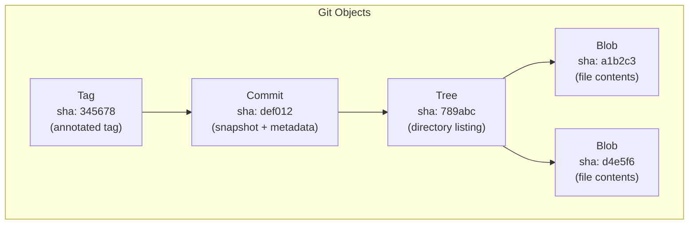
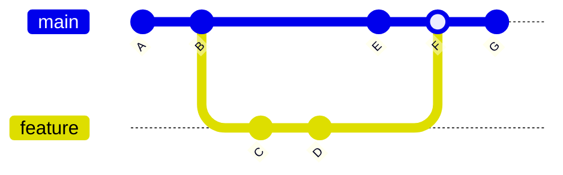

# Git Internals & Workflows

Git is the most widely used version control system in the world. Every software company, every open-source project, every developer uses it daily. Yet most engineers treat Git as a black box — they memorize a handful of commands (`commit`, `push`, `pull`, `merge`) and panic when anything goes wrong. A merge conflict becomes a crisis. A detached HEAD becomes a mystery. A rebase gone wrong becomes a "just clone it again" moment.

This happens because most people learn Git's commands without learning Git's data model. And Git's data model is beautiful in its simplicity: it is a content-addressable filesystem with a graph of commits layered on top. Once you understand the data model, every Git command becomes a logical operation on a well-defined data structure, and "recovering" from mistakes becomes trivial.

## Why Understanding Git Internals Matters

| Scenario | Surface-Level Knowledge | Internal Knowledge |
|----------|------------------------|-------------------|
| Merge conflict | Panic, start over | Understand why it happened, resolve confidently |
| Accidentally committed secrets | `git revert` (still in history) | `git filter-repo` to rewrite history |
| Need to undo a rebase | "Just clone again" | `git reflog` to find the pre-rebase commit |
| Branch diverged from main | Confused about merge vs. rebase | Understand the commit graph and choose deliberately |
| CI build is slow | No idea why | Understand packfiles, shallow clones, sparse checkout |
| Monorepo gets slow | "Git doesn't scale" | Understand pack-objects, partial clones, and git maintenance |

## Git's Data Model: Content-Addressable Storage

At its core, Git is a **content-addressable key-value store**. Every piece of data — file contents, directory structures, commits, tags — is stored as an **object** identified by a SHA-1 hash of its contents.



There are four types of Git objects:

1. **Blob** — Raw file contents. No filename, no permissions — just bytes. Two files with identical contents share the same blob, regardless of filename or location.

2. **Tree** — A directory listing. Maps filenames to blob hashes (for files) or other tree hashes (for subdirectories), plus file permissions.

3. **Commit** — A snapshot in time. Points to a tree (the root directory at that moment), one or more parent commits, and metadata (author, committer, timestamp, message).

4. **Tag** — A named pointer to a specific object (usually a commit), with optional metadata and a GPG signature.

This content-addressing has profound implications:

- **Deduplication is automatic.** If 100 commits include the same file, only one blob is stored.
- **Integrity is guaranteed.** If any byte changes, the hash changes, and all parent objects' hashes change too. Tampering is detectable.
- **Branching is cheap.** A branch is just a 41-byte file containing a commit hash. Creating 1,000 branches costs ~40 KB of disk space.

## How Git Differs from Other VCS

| Feature | Git | SVN (Subversion) | Perforce |
|---------|-----|-------------------|----------|
| Architecture | Distributed — every clone is a full repo | Centralized — single server | Centralized — single server |
| Branching cost | O(1) — pointer to a commit | O(n) — server-side copy | O(1) for streams |
| Offline work | Full capability | Read-only | Read-only |
| History storage | Snapshots (full tree per commit) | Deltas (changes per commit) | Deltas |
| Data integrity | SHA-1 hash chain | Revision numbers | Change numbers |
| Scale (files) | ~1M files (struggles beyond) | Millions of files | Millions of files |
| Scale (repo size) | ~5 GB (struggles beyond without LFS) | Hundreds of GB | Terabytes |

## What This Section Covers

### [Git Internals](/devops/git/internals)

The object model in depth — blobs, trees, commits, and tags. How references (branches, HEAD, tags) work. Packfiles and delta compression. The reflog. How merge and rebase work at the object level. After this page, you will be able to recover from any Git mistake.

### [Branching Strategies](/devops/git/branching-strategies)

Trunk-based development, GitHub Flow, GitFlow, and release branches. When to use feature branches vs. feature flags. A comparison table to help you choose the right strategy for your team.

### [Monorepo Management](/devops/git/monorepo)

Why companies like Google, Meta, and Microsoft use monorepos. Tooling comparison (Nx, Turborepo, Bazel, Rush). Task orchestration, caching, affected/changed detection, and the challenges that emerge at scale.

## The Git Mental Model

The single most important mental model for Git: **a commit is a snapshot, not a diff.** Every commit contains a complete picture of your entire repository at that moment (via the tree object). Diffs are computed on the fly by comparing two snapshots.

This means:

- Checking out a branch is fast — Git just swaps the working directory to match the commit's tree
- Merging compares two snapshots and a common ancestor — it does not replay changes
- History is a directed acyclic graph (DAG) of snapshots, not a sequence of patches



Every node in this graph is a full snapshot. The edges represent parent-child relationships. A merge commit (F) has two parents — it records the fact that two lines of development were combined, and its tree is the merged result.

## Essential Git Configuration

Before diving into internals, ensure your Git is configured for a professional workflow:

```bash
# Identity
git config --global user.name "Your Name"
git config --global user.email "you@company.com"

# Default branch name
git config --global init.defaultBranch main

# Rebase by default on pull (avoid merge commits for remote sync)
git config --global pull.rebase true

# Auto-stash before rebase (avoid "dirty tree" errors)
git config --global rebase.autoStash true

# Sign commits with SSH key (modern, simpler than GPG)
git config --global gpg.format ssh
git config --global user.signingkey ~/.ssh/id_ed25519.pub
git config --global commit.gpgsign true

# Better diff algorithm
git config --global diff.algorithm histogram

# Global gitignore
git config --global core.excludesfile ~/.gitignore_global

# Credential caching
git config --global credential.helper cache --timeout=3600

# Enable rerere (reuse recorded resolution) — remembers how you
# resolved merge conflicts and applies the same resolution automatically
git config --global rerere.enabled true
```

## Quick Command Reference

| Task | Command | Notes |
|------|---------|-------|
| See what changed | `git status`, `git diff` | `diff --staged` for staged changes |
| Undo last commit (keep changes) | `git reset --soft HEAD~1` | Changes go back to staging |
| Undo last commit (discard) | `git reset --hard HEAD~1` | Permanent — changes lost |
| Find a lost commit | `git reflog` | Shows all HEAD movements |
| See commit graph | `git log --oneline --graph --all` | Visual branch topology |
| Stash changes temporarily | `git stash push -m "description"` | `git stash pop` to restore |
| Cherry-pick a commit | `git cherry-pick <sha>` | Copies commit to current branch |
| Blame a line | `git blame <file>` | Shows who last changed each line |
| Search history for text | `git log -S "search term"` | Finds commits that added/removed term |
| Bisect a bug | `git bisect start`, `git bisect bad/good` | Binary search for the breaking commit |
| Clean untracked files | `git clean -fd` | `-n` for dry run first |

## Further Reading

- [Git Internals](/devops/git/internals) — the object model, references, packfiles, reflog
- [Branching Strategies](/devops/git/branching-strategies) — trunk-based, GitHub Flow, GitFlow
- [Monorepo Management](/devops/git/monorepo) — Nx, Turborepo, Bazel, and scaling challenges
- [GitHub Actions Deep Dive](/infrastructure/ci-cd/github-actions-deep-dive) — CI/CD workflows built on Git events
- [Deployment Strategies](/devops/deployment-strategies/) — how branching connects to deployment
