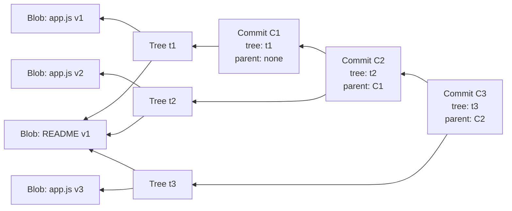
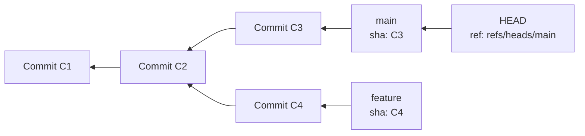
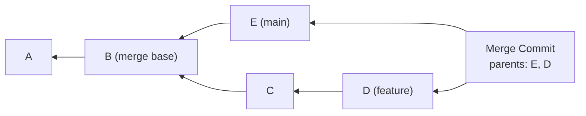

# Git Internals

Git's command-line interface has over 150 commands. Most developers use about 10 of them and treat the rest as arcane incantations. But every one of those commands performs a simple, well-defined operation on Git's internal data structures. Once you understand the data model, you understand every command — including the ones you have never used.

This page takes you inside the `.git` directory and explains every data structure from first principles. By the end, you will be able to manually construct a Git commit using only hash functions and file writes, recover from any mistake using the reflog, and understand exactly what merge and rebase do to the commit graph.

## The .git Directory

Every Git repository is a directory containing a `.git` subdirectory. The `.git` directory IS the repository — the working directory is just a checkout of one particular snapshot.

```
.git/
├── HEAD                 # Points to the current branch
├── config               # Repository-specific configuration
├── description          # Used by GitWeb (rarely important)
├── hooks/               # Client-side and server-side hooks
├── index                # Staging area (binary file)
├── info/
│   └── exclude          # Local gitignore (not committed)
├── objects/             # All Git objects (blobs, trees, commits, tags)
│   ├── 2a/              # First 2 hex chars of SHA = directory
│   │   └── b3c4d5...   # Remaining 38 hex chars = filename
│   ├── info/
│   └── pack/            # Packfiles (compressed object storage)
│       ├── pack-abc.idx # Pack index
│       └── pack-abc.pack # Pack data
└── refs/                # References (branches, tags, remotes)
    ├── heads/           # Local branches
    │   └── main         # File containing commit SHA
    ├── remotes/
    │   └── origin/
    │       └── main
    └── tags/
```

## The Object Model

### Blobs

A blob stores the raw contents of a file. Nothing else — no filename, no permissions, no metadata. Git computes the blob's SHA-1 hash from a header (`blob <size>\0`) plus the content.

```bash
# Create a blob manually
echo "Hello, World!" | git hash-object -w --stdin
# Output: 8ab686eafeb1f44702738c8b0f24f2567c36da6d

# Read a blob
git cat-file -p 8ab686ea
# Output: Hello, World!

# Check the type
git cat-file -t 8ab686ea
# Output: blob
```

Key insight: if two files have identical contents, they produce the same hash and share the same blob object. Rename a file? Same blob, different tree entry. Copy a file? Same blob referenced twice.

### Trees

A tree represents a directory. Each entry in a tree maps a name and permission mode to either a blob (file) or another tree (subdirectory).

```bash
# View a tree object
git cat-file -p main^{tree}
# Output:
# 100644 blob a1b2c3d4...  README.md
# 100644 blob e5f6a7b8...  package.json
# 040000 tree c9d0e1f2...  src
```

| Mode | Meaning |
|------|---------|
| `100644` | Regular file (not executable) |
| `100755` | Executable file |
| `120000` | Symbolic link |
| `040000` | Subdirectory (tree) |
| `160000` | Git submodule (commit reference) |

### Commits

A commit object contains:

```bash
git cat-file -p HEAD
# Output:
# tree 789abcdef0123456789abcdef0123456789abcdef
# parent 456789abcdef0123456789abcdef0123456789ab
# author Alice <alice@example.com> 1711000000 +0000
# committer Alice <alice@example.com> 1711000000 +0000
#
# Add user authentication module
```

| Field | Description |
|-------|-------------|
| `tree` | SHA of the root tree object (the complete snapshot) |
| `parent` | SHA of the parent commit(s). None for initial commit, one for normal commits, two+ for merges. |
| `author` | Who wrote the change (name, email, timestamp) |
| `committer` | Who committed the change (may differ from author, e.g., after cherry-pick) |
| Message | The commit message (after the blank line) |



Notice that `README v1` (blob B1) is shared across all three commits because it was not modified. Git does not store redundant copies.

### Tags

Annotated tags are full Git objects (unlike lightweight tags, which are just references):

```bash
git cat-file -p v1.0.0
# Output:
# object 123456789abcdef0123456789abcdef01234567
# type commit
# tag v1.0.0
# tagger Alice <alice@example.com> 1711000000 +0000
#
# Release 1.0.0 - Initial stable release
```

## References

References are human-readable pointers to commits. Instead of remembering `a1b2c3d4e5f6...`, you use `main`, `feature/auth`, or `v1.0.0`.

### Branches

A branch is a file in `.git/refs/heads/` containing a 40-character commit SHA:

```bash
cat .git/refs/heads/main
# a1b2c3d4e5f6a7b8c9d0e1f2a3b4c5d6e7f8a9b0
```

When you make a commit on a branch, Git:
1. Creates the new commit object (pointing to the current commit as parent)
2. Updates the branch reference to point to the new commit

That is it. "Creating a branch" is writing a 41-byte file. "Switching branches" is updating HEAD and changing the working directory.

### HEAD

HEAD answers the question "what am I working on?" It is usually a **symbolic reference** — a pointer to a branch:

```bash
cat .git/HEAD
# ref: refs/heads/main
```

When HEAD points to a branch, new commits advance that branch. When HEAD points directly to a commit (not a branch), you are in **detached HEAD** state — commits will not advance any branch.



### Remote-Tracking References

Remote-tracking branches (e.g., `origin/main`) are stored in `.git/refs/remotes/`. They are updated by `git fetch` and represent the last known state of the remote branch. You cannot directly commit to a remote-tracking branch.

## The Staging Area (Index)

The staging area (also called the index) is a binary file at `.git/index`. It holds a flattened list of all files that will go into the next commit — their names, SHA hashes, timestamps, and permissions.

```bash
# View the index
git ls-files --stage
# 100644 a1b2c3d4... 0    README.md
# 100644 e5f6a7b8... 0    src/app.js
# 100644 c9d0e1f2... 0    src/utils.js
```

The three-way relationship between the working directory, the index, and HEAD is the key to understanding `add`, `commit`, `diff`, and `reset`:

| Command | Operation |
|---------|-----------|
| `git add file` | Copy file from working directory to index |
| `git commit` | Create tree from index, create commit pointing to tree |
| `git diff` | Compare working directory to index |
| `git diff --staged` | Compare index to HEAD |
| `git reset HEAD file` | Copy file from HEAD to index (unstage) |
| `git checkout -- file` | Copy file from index to working directory (discard changes) |

## Packfiles and Delta Compression

### Loose Objects

Initially, every Git object is stored as a separate file in `.git/objects/`, compressed with zlib. Each file is named by its SHA-1 hash. This is simple but wasteful — a 1 MB file modified slightly produces two 1 MB blobs that differ by a few bytes.

### Packfiles

Git periodically packs loose objects into **packfiles** — a single file (`.git/objects/pack/pack-*.pack`) containing many objects, with an index file (`.pack-*.idx`) for fast lookups.

Inside a packfile, Git uses **delta compression**: similar objects are stored as a base object plus a delta (the minimal set of changes to reconstruct the target from the base). This is not related to the commit model — it is purely a storage optimization.

```
Packfile layout:
┌─────────────────────────────────┐
│ Header (PACK, version, count)   │
├─────────────────────────────────┤
│ Object 1: blob (undeltified)    │  ← base object
│ Object 2: blob (OFS_DELTA)     │  ← delta against object 1
│ Object 3: tree (undeltified)    │
│ Object 4: commit (undeltified)  │
│ Object 5: blob (REF_DELTA)     │  ← delta against object by SHA
│ ...                             │
└─────────────────────────────────┘
```

Packing typically reduces repository size by 5-20x. Git triggers packing automatically (`git gc`) or you can run it manually:

```bash
# Pack loose objects
git gc

# Aggressive packing (slower, better compression)
git gc --aggressive

# Check object storage stats
git count-objects -vH
# count: 0          (loose objects)
# size: 0 bytes
# in-pack: 45321    (packed objects)
# packs: 1
# size-pack: 12.5 MiB
```

::: tip Shallow Clones for CI
If your CI pipeline does not need full history, use `git clone --depth 1` (shallow clone). This downloads only the latest commit and its tree — no history, no packfile delta chains to resolve. For large repositories, this can reduce clone time from minutes to seconds.
:::

## The Reflog

The reflog records every change to HEAD and branch references. It is your safety net — the reflog lets you recover from almost any mistake, including hard resets, bad rebases, and accidental branch deletions.

```bash
# View the reflog
git reflog
# a1b2c3d HEAD@{0}: commit: Add authentication
# d4e5f6a HEAD@{1}: rebase (finish): returning to refs/heads/main
# 789abcd HEAD@{2}: rebase (start): checkout origin/main
# b0c1d2e HEAD@{3}: commit: Fix login bug
# ...

# Recover a commit after a bad reset
git reset --hard HEAD~3    # Oops, went too far back
git reflog                 # Find the commit you want
git reset --hard HEAD@{1}  # Go back to where you were
```

::: warning Reflog Expires
Reflog entries have a default expiry of 90 days (30 days for unreachable commits). After expiry, the entries are removed and the referenced commits may be garbage-collected. If you need to recover something, do it promptly.
:::

```bash
# Configure reflog retention
git config gc.reflogExpire "180 days"
git config gc.reflogExpireUnreachable "90 days"
```

## How Merge Works Internally

### Three-Way Merge

When you run `git merge feature`:

1. Git finds the **merge base** — the most recent common ancestor of the two branches
2. Git computes two diffs: (merge base → current branch) and (merge base → feature branch)
3. Git applies both diffs to the merge base



If the same region of the same file was modified in both diffs, Git declares a **merge conflict** and asks you to resolve it manually.

### Fast-Forward Merge

If the current branch has not diverged from the branch being merged (i.e., the current branch IS the merge base), Git performs a **fast-forward** — it simply moves the branch pointer forward. No merge commit is created.

```
Before:                    After fast-forward merge:
main: A → B                main: A → B → C → D
feature: A → B → C → D    feature: A → B → C → D
```

```bash
# Force a merge commit even when fast-forward is possible
git merge --no-ff feature

# Only allow fast-forward (fail if not possible)
git merge --ff-only feature
```

### Merge Strategies

| Strategy | When Used | Behavior |
|----------|----------|----------|
| `ort` (default) | Two branches | Optimized three-way merge (replaced `recursive` in Git 2.33+) |
| `recursive` | Two branches (legacy) | Three-way merge with recursive ancestor resolution |
| `octopus` | Three+ branches | Merges multiple branches simultaneously (no conflict resolution) |
| `ours` | Any | Creates merge commit but keeps only our changes |
| `subtree` | Subtree merges | Adjusts tree to match a subdirectory |

## How Rebase Works Internally

Rebase replays commits from one branch on top of another. It creates **new commits** with different parents (and therefore different SHA hashes) but the same diffs.

```
Before rebase:
main:    A → B → E → F
feature: A → B → C → D

After `git rebase main` (on feature branch):
main:    A → B → E → F
feature: A → B → E → F → C' → D'
```

C' and D' are new commits. They have the same diffs (patches) as C and D, but different parents and different SHAs. The original C and D still exist in the object store (and in the reflog) but are unreachable from any branch.

### Interactive Rebase

`git rebase -i` lets you rewrite history by reordering, squashing, editing, or dropping commits:

```bash
git rebase -i HEAD~4
# Opens editor with:
# pick a1b2c3d Add user model
# pick d4e5f6a Add user controller
# pick 789abcd Fix typo in user model
# pick b0c1d2e Add user tests

# Reorder, squash, or edit:
# pick a1b2c3d Add user model
# fixup 789abcd Fix typo in user model       ← squash into previous, discard message
# pick d4e5f6a Add user controller
# pick b0c1d2e Add user tests
```

::: danger Never Rebase Published Commits
Rebase creates new commits with different SHAs. If you rebase commits that others have already pulled, their branches will diverge from yours, causing confusion and duplicate commits. The golden rule: **only rebase commits that exist solely on your local branch.**
:::

## Recovering from Mistakes

### Recovery Playbook

| Mistake | Recovery |
|---------|----------|
| Committed to wrong branch | `git cherry-pick <sha>` on correct branch, `git reset --hard HEAD~1` on wrong branch |
| Committed secret/credential | `git filter-repo --path <file> --invert-paths` to remove from all history |
| Hard reset too far | `git reflog` → `git reset --hard <sha>` |
| Bad rebase | `git reflog` → `git reset --hard <pre-rebase-sha>` |
| Deleted a branch | `git reflog` → `git branch <name> <sha>` |
| Accidentally amended wrong commit | `git reflog` → `git reset --soft <pre-amend-sha>` |
| Need to undo a merge | `git revert -m 1 <merge-commit-sha>` |

### Using git fsck

`git fsck` (filesystem check) finds dangling objects — commits, blobs, and trees that are unreachable from any reference:

```bash
git fsck --unreachable --no-reflogs
# unreachable commit a1b2c3d4...
# unreachable blob e5f6a7b8...

# Inspect the dangling commit
git show a1b2c3d4
```

## Performance at Scale

### Large Repositories

For repositories with millions of files or GB of history:

| Technique | What It Does | When to Use |
|-----------|-------------|-------------|
| Shallow clone | `--depth N` — only N commits | CI pipelines that don't need history |
| Partial clone | `--filter=blob:none` — download blobs on demand | Large repos with rarely-accessed files |
| Sparse checkout | Only check out specific directories | Monorepo — only need your team's code |
| Git LFS | Store large files (binaries, assets) outside the repo | Repos with large non-text files |
| `git maintenance` | Background optimization tasks | Any repo that gets slower over time |
| Commit graph | Pre-computed commit ancestry graph | Speeds up `log`, `merge-base`, `branch --contains` |

```bash
# Enable background maintenance (Git 2.29+)
git maintenance start
# Runs: prefetch, gc, commit-graph, loose-objects, incremental-repack

# Sparse checkout (only check out docs/ directory)
git clone --filter=blob:none --sparse https://github.com/org/monorepo.git
cd monorepo
git sparse-checkout set docs/
```

## Further Reading

- [Branching Strategies](/devops/git/branching-strategies) — how to organize branches for your team
- [Monorepo Management](/devops/git/monorepo) — scaling Git for large codebases
- [GitHub Actions Deep Dive](/infrastructure/ci-cd/github-actions-deep-dive) — CI/CD built on Git events
- [Deployment Strategies](/devops/deployment-strategies/) — connecting branches to deployments
