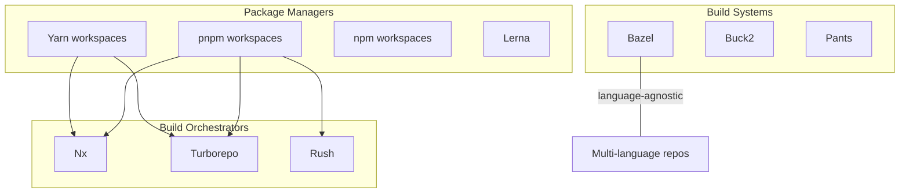
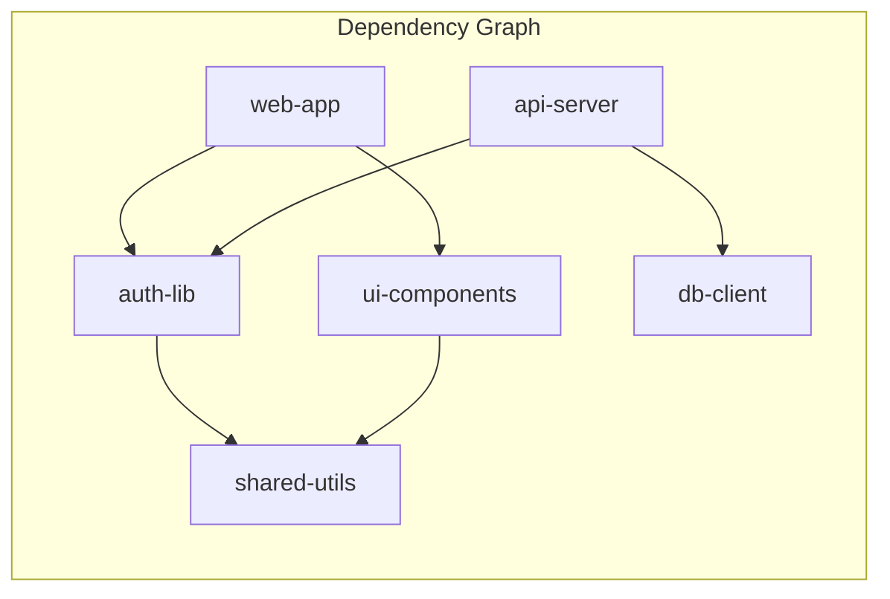

# Monorepo Management

A monorepo is a single version control repository that contains multiple projects, applications, and libraries. Google keeps its entire codebase — billions of lines of code, 25,000+ developers — in a single repository. Meta, Microsoft, Twitter, Uber, and Airbnb do the same (to varying degrees). This is not an accident. Monorepos solve real coordination problems that polyrepos (one repo per project) create.

But monorepos are not free. Without proper tooling, a monorepo becomes a slow, tangled mess where every change triggers every CI pipeline, every developer downloads every file, and nobody knows what depends on what. This page covers the "why," the tooling, and the practices that make monorepos work at scale.

## Why Monorepos?

### The Coordination Problem

In a polyrepo world, shared code lives in separate repositories, published as packages. Updating a shared library looks like this:

```
1. Make change in shared-utils repo
2. Bump version, publish to npm/artifactory
3. Update dependency in service-A repo
4. Update dependency in service-B repo
5. Update dependency in service-C repo
6. Discover that service-C breaks with the new version
7. Fix service-C or revert shared-utils
8. Re-publish, re-update everything
```

In a monorepo, this becomes:

```
1. Make change in shared-utils/
2. Run tests for everything that depends on shared-utils
3. Fix service-C in the same PR
4. Ship one atomic change
```

### Monorepo Advantages

| Advantage | Explanation |
|-----------|-------------|
| **Atomic changes** | A single commit can update a library and all its consumers. No version coordination. |
| **Single source of truth** | One version of every dependency. No "which version of shared-utils is service-A using?" |
| **Code visibility** | Every developer can see, search, and learn from every project. Cross-team collaboration is natural. |
| **Consistent tooling** | One linting config, one CI pipeline, one set of coding standards. |
| **Simplified dependency management** | Internal dependencies are source references, not versioned packages. |
| **Easier large-scale refactoring** | Rename a function in a shared library and update every caller in one PR. |

### Monorepo Disadvantages

| Disadvantage | Explanation |
|-------------|-------------|
| **Tooling investment** | Without specialized tools, builds and tests are slow. |
| **Git performance** | Large repos push Git's limits (slow clone, status, checkout). |
| **Code ownership ambiguity** | Without CODEOWNERS, unclear who reviews what. |
| **CI complexity** | Must determine which projects are affected by a change. |
| **Access control** | Hard to restrict access to a subdirectory in Git (unlike separate repos). |
| **Intimidation factor** | A new developer sees thousands of projects and doesn't know where to start. |

## The Monorepo Landscape



## Tooling Deep Dive

### Nx

Nx is the most feature-rich monorepo orchestrator for the JavaScript/TypeScript ecosystem. Created by ex-Google engineers who built Angular, Nx brings Google-style monorepo practices to the broader ecosystem.

**Key features:**
- **Computation caching** — local and remote (Nx Cloud)
- **Affected detection** — only runs tasks for projects affected by the current change
- **Dependency graph** — auto-detected from source code imports
- **Code generators** — scaffold new projects, libraries, components
- **Plugin ecosystem** — React, Angular, Node, Nest, Next.js, Storybook, Cypress, Jest
- **Module boundaries** — enforce dependency rules between projects via lint rules

```bash
# Create an Nx workspace
npx create-nx-workspace@latest myorg --preset=ts

# Project structure
myorg/
├── apps/
│   ├── web/           # React frontend
│   ├── api/           # Node.js backend
│   └── mobile/        # React Native app
├── libs/
│   ├── shared/
│   │   ├── utils/     # Shared utilities
│   │   └── types/     # Shared TypeScript types
│   ├── feature/
│   │   ├── auth/      # Auth feature library
│   │   └── payments/  # Payments feature library
│   └── ui/
│       └── components/# Shared UI components
├── nx.json            # Nx configuration
├── package.json
└── tsconfig.base.json
```

```bash
# Run tests only for projects affected by current changes
nx affected --target=test

# Build with caching (skips if nothing changed)
nx run-many --target=build --all

# Visualize the dependency graph
nx graph
```

#### Nx Module Boundaries

```json
// .eslintrc.json
{
  "rules": {
    "@nx/enforce-module-boundaries": [
      "error",
      {
        "depConstraints": [
          { "sourceTag": "scope:web", "onlyDependOnLibsWithTags": ["scope:shared", "scope:web"] },
          { "sourceTag": "scope:api", "onlyDependOnLibsWithTags": ["scope:shared", "scope:api"] },
          { "sourceTag": "type:feature", "onlyDependOnLibsWithTags": ["type:ui", "type:util", "type:data-access"] },
          { "sourceTag": "type:ui", "onlyDependOnLibsWithTags": ["type:util"] }
        ]
      }
    ]
  }
}
```

This enforces architectural boundaries: a feature library cannot depend on another feature, UI libraries cannot depend on features, and app-specific code cannot leak into shared libraries.

### Turborepo

Turborepo (acquired by Vercel in 2021) is a simpler, faster alternative to Nx. It focuses on task orchestration and caching, without code generation or plugin systems.

**Key features:**
- **Parallel task execution** — runs independent tasks in parallel
- **Computation caching** — local and remote (Vercel Remote Cache)
- **Topological task ordering** — respects dependency graph for task execution order
- **Incremental builds** — only rebuilds what changed

```json
// turbo.json
{
  "$schema": "https://turbo.build/schema.json",
  "tasks": {
    "build": {
      "dependsOn": ["^build"],
      "outputs": ["dist/**", ".next/**"]
    },
    "test": {
      "dependsOn": ["build"],
      "inputs": ["src/**/*.ts", "src/**/*.tsx", "test/**/*.ts"]
    },
    "lint": {},
    "dev": {
      "cache": false,
      "persistent": true
    }
  }
}
```

```bash
# Run build for all packages (with caching)
turbo build

# Run tests only for packages affected by changes
turbo test --filter='...[HEAD~1]'

# Run dev server for a specific app and its dependencies
turbo dev --filter=web
```

### Bazel

Bazel (open-sourced by Google) is a language-agnostic build system designed for massive monorepos. It is the most powerful tool on this list and also the most complex.

**Key features:**
- **Language agnostic** — Java, C++, Go, Python, TypeScript, Rust, and more
- **Hermetic builds** — builds are sandboxed and reproducible (same inputs = same outputs)
- **Remote execution** — distribute builds across a cluster of machines
- **Remote caching** — share build artifacts across the entire team
- **Fine-grained dependency graph** — file-level dependencies, not package-level

```python
# BUILD file (Bazel's configuration)
load("@rules_nodejs//nodejs:defs.bzl", "nodejs_binary")
load("@rules_nodejs//typescript:defs.bzl", "ts_library")

ts_library(
    name = "auth-lib",
    srcs = glob(["src/**/*.ts"]),
    deps = [
        "//libs/shared/utils",
        "@npm//jsonwebtoken",
    ],
)

nodejs_binary(
    name = "api",
    data = [":auth-lib"],
    entry_point = "src/main.ts",
)
```

::: warning Bazel's Learning Curve
Bazel requires writing explicit BUILD files for every package, declaring every dependency and every output. There is no automatic dependency detection — you must declare everything. The reward is deterministic, reproducible builds. The cost is significant up-front investment and ongoing maintenance of BUILD files. For JavaScript/TypeScript-only repos, Nx or Turborepo are usually better choices.
:::

### Rush

Rush (by Microsoft) is a monorepo manager for large-scale JavaScript/TypeScript projects. It emphasizes correctness and enterprise features.

**Key features:**
- **Phantom dependency prevention** — ensures projects only use dependencies they explicitly declare
- **Incremental builds** — only builds affected projects
- **Changelog automation** — generates changelogs from structured change files
- **Publishing workflow** — coordinated npm publishing for multiple packages
- **PNPM-based** — strict dependency isolation

```bash
# Install dependencies
rush install

# Build affected projects
rush build --changed-projects-only

# Add a change file (for changelog generation)
rush change
```

### Comparison Table

| Feature | Nx | Turborepo | Bazel | Rush |
|---------|-----|-----------|-------|------|
| **Language support** | JS/TS-first, plugins for others | JS/TS | Any language | JS/TS |
| **Learning curve** | Moderate | Low | High | Moderate |
| **Local caching** | Yes | Yes | Yes | Yes |
| **Remote caching** | Nx Cloud (paid/free tier) | Vercel Remote Cache | Custom backend | Custom |
| **Affected detection** | Git-based | Git-based (filter) | File-level | Git-based |
| **Code generation** | Yes (generators) | No | No | No |
| **Module boundaries** | Yes (lint rules) | No | Enforced (BUILD files) | Phantom dep prevention |
| **Dependency graph** | Auto-detected | Auto-detected | Explicit (BUILD files) | Auto-detected |
| **Remote execution** | No | No | Yes | No |
| **Best for** | JS/TS monorepos of any size | Simple JS/TS monorepos | Multi-language, massive scale | Enterprise JS/TS |

## Core Monorepo Concepts

### Task Orchestration

A monorepo contains many projects with interdependencies. Building project A may require building its dependency, project B, first. Task orchestration runs tasks in the correct **topological order** and maximizes parallelism for independent tasks.



Build execution order (4 workers):

```
Time →
Worker 1: [shared-utils] → [auth-lib]    → [web-app]
Worker 2: [db-client]    → [api-server]
Worker 3:                → [ui-components]
Worker 4: (idle)
```

`shared-utils` builds first (no dependencies). Then `auth-lib`, `ui-components`, and `db-client` build in parallel. Finally, `web-app` and `api-server` build once their dependencies are ready.

### Computation Caching

The most impactful monorepo optimization. Before running a task, the tool computes a **hash** of the task's inputs:

```
Hash inputs for "build auth-lib":
- Source files (src/**/*.ts) content hashes
- Dependency outputs (shared-utils build output hash)
- Build configuration (tsconfig.json hash)
- Environment variables (NODE_ENV)
- Runtime version (Node 20.11.0)

Hash = sha256(all inputs) = "a1b2c3d4..."
```

If the cache contains an entry for this hash, the tool **skips the task entirely** and restores the cached output. Build times drop from minutes to seconds for unchanged projects.

**Remote caching** shares the cache across the entire team and CI. When a developer builds `auth-lib` locally, the cache entry is uploaded to a remote store. When CI builds the same code, it downloads the cached output instead of rebuilding. This can reduce CI times by 50-80%.

### Affected / Changed Detection

Instead of running all tasks for all projects on every change, monorepo tools detect which projects are **affected** by the current changes and only run tasks for those.

```bash
# Developer changes libs/shared/utils/src/format.ts

# Affected detection:
# 1. shared-utils directly changed
# 2. auth-lib depends on shared-utils
# 3. ui-components depends on shared-utils
# 4. web-app depends on auth-lib AND ui-components
# 5. api-server depends on auth-lib
# 6. db-client NOT affected

# Result: test/build runs for 5 out of 6 projects
```

In CI, affected detection is typically based on the Git diff between the PR branch and the base branch:

```bash
# Nx
nx affected --target=test --base=origin/main --head=HEAD

# Turborepo
turbo test --filter='...[origin/main]'
```

### Dependency Graph Visualization

Understanding the dependency graph is critical for maintaining a healthy monorepo. Circular dependencies, God libraries (depended on by everything), and tangled feature boundaries are all visible in the graph.

```bash
# Nx: interactive dependency graph in browser
nx graph

# Nx: JSON output for CI analysis
nx graph --file=output.json
```

::: tip Dependency Graph as Architecture Documentation
The dependency graph IS your architecture diagram, automatically generated and always up to date. Review it regularly. If a "shared" library is only used by one app, move it into that app. If a feature library depends on another feature library, you may have a boundary violation.
:::

## Challenges at Scale

### Git Performance

Git was designed for repositories of thousands of files. Monorepos can have millions. Several Git features degrade:

| Operation | Problem | Solution |
|-----------|---------|----------|
| `git clone` | Downloads entire history (~GB) | Shallow clone (`--depth 1`), partial clone (`--filter=blob:none`) |
| `git status` | Scans all files for changes | `fsmonitor` (Watchman integration), sparse checkout |
| `git checkout` | Writes all files to disk | Sparse checkout (only check out your team's code) |
| `git blame` | Traverses full history | `--first-parent` flag, commit-graph file |
| `git log` | Traverses full history | Commit-graph file (`git maintenance start`) |

```bash
# Enable filesystem monitor (dramatically speeds up status/diff)
git config core.fsmonitor true

# Sparse checkout (only check out apps/web and libs/shared)
git sparse-checkout init --cone
git sparse-checkout set apps/web libs/shared

# Enable commit-graph (speeds up log, merge-base, etc.)
git maintenance start
```

::: warning Beyond Git's Limits
Google, Meta, and Microsoft do NOT use stock Git for their monorepos. Google uses Piper (a custom VCS). Meta uses a heavily modified Mercurial (Sapling). Microsoft uses VFS for Git (a virtual filesystem that downloads files on demand). If your monorepo exceeds ~10 million files or ~50 GB, you may need to look beyond stock Git.
:::

### CI Pipeline Design

CI in a monorepo must be **selective** — running all tests for all projects on every PR is wasteful and slow.

```yaml
# GitHub Actions: CI only for affected projects
name: CI
on: pull_request

jobs:
  affected:
    runs-on: ubuntu-latest
    outputs:
      projects: $&#123;&#123; steps.affected.outputs.projects &#125;&#125;
    steps:
      - uses: actions/checkout@v4
        with:
          fetch-depth: 0  # Need full history for affected detection
      - run: npm ci
      - id: affected
        run: echo "projects=$(npx nx show projects --affected --base=origin/main --json)" >> $GITHUB_OUTPUT

  test:
    needs: affected
    if: needs.affected.outputs.projects != '[]'
    strategy:
      matrix:
        project: $&#123;&#123; fromJson(needs.affected.outputs.projects) &#125;&#125;
    runs-on: ubuntu-latest
    steps:
      - uses: actions/checkout@v4
      - run: npm ci
      - run: npx nx test $&#123;&#123; matrix.project &#125;&#125;
```

### Code Ownership

Without clear ownership, PRs languish without reviewers, shared code degrades, and dependencies become tangled. Use `CODEOWNERS`:

```
# CODEOWNERS
/apps/web/                @team-frontend
/apps/api/                @team-backend
/libs/shared/             @team-platform
/libs/feature/auth/       @team-auth
/libs/feature/payments/   @team-payments
*.tf                      @team-infra
```

### Versioning and Publishing

When libraries in a monorepo are published to npm, versioning becomes complex. Two approaches:

| Approach | How It Works | Tool Support |
|----------|-------------|--------------|
| **Fixed versioning** | All packages share the same version number. Any change bumps all. | Lerna (fixed mode) |
| **Independent versioning** | Each package has its own version. Only changed packages are bumped. | Nx release, Changesets, Lerna (independent mode), Rush |

```bash
# Nx release (independent versioning)
npx nx release --projects=shared-utils

# Changesets (popular for open-source monorepos)
npx changeset add     # Create a changeset describing the change
npx changeset version # Bump versions based on changesets
npx changeset publish # Publish to npm
```

## Monorepo vs. Polyrepo Decision Framework

| Signal | Monorepo | Polyrepo |
|--------|----------|----------|
| Teams share code frequently | Yes | No |
| Atomic changes across projects needed | Yes | No |
| CI/CD infrastructure investment available | Yes | Limited |
| Projects use the same language/framework | Yes | Different languages |
| Independent deployment cadences | Less suitable | More suitable |
| Strict access control per project | Difficult (Git limitation) | Natural |
| Team size | Any (with tooling) | Any |
| External contributors need access | Consider polyrepo | Natural |

::: tip Start Monorepo, Split If Needed
It is easier to split a monorepo into polyrepos than to combine polyrepos into a monorepo. If your projects are related and your team is small, start with a monorepo. You can always extract a project into its own repo later when the coordination overhead is justified.
:::

## Further Reading

- [Git Internals](/devops/git/internals) — packfiles, partial clones, and performance at scale
- [Branching Strategies](/devops/git/branching-strategies) — trunk-based development works best with monorepos
- [GitHub Actions Deep Dive](/infrastructure/ci-cd/github-actions-deep-dive) — CI pipelines for monorepos
- [Pipeline Patterns](/infrastructure/ci-cd/pipeline-patterns) — advanced CI patterns for affected detection
