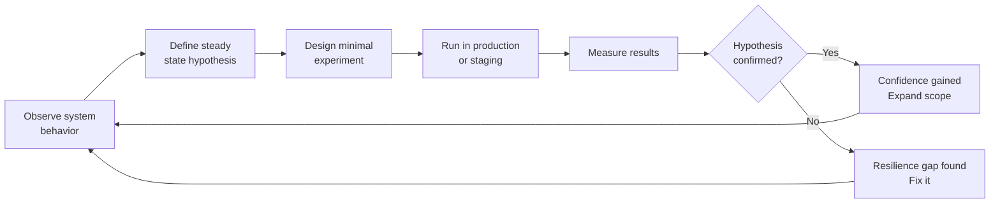
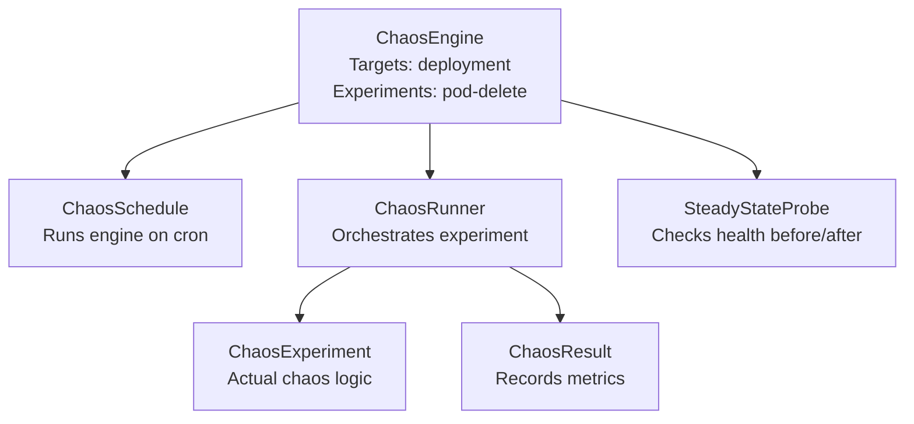
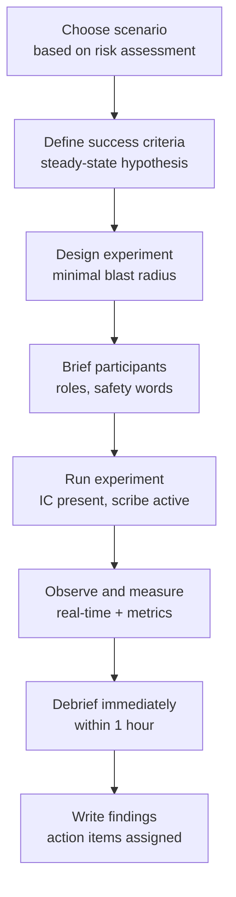

# Chaos Engineering: Chaos Monkey, Litmus, GameDay Design, and Maturity Model

## Why Chaos Engineering Exists

Traditional testing verifies that systems work under expected conditions. Chaos engineering verifies that systems **continue working** — or fail gracefully — under unexpected conditions. It answers the question: "How will this system actually behave when things go wrong in production?"

The gap between "this should work" and "this does work under failure conditions" is where incidents live. Chaos engineering converts unknown weaknesses into known quantities before they become production incidents.

### The Origin Story

Netflix coined "Chaos Engineering" and built Chaos Monkey in 2011. The context: Netflix was migrating from physical datacenters to AWS. Cloud infrastructure is fundamentally unreliable (instances terminate, availability zones fail), and they needed to know their system would handle it.

Rather than building for a mythical "reliable cloud," Netflix built for a reliably unreliable cloud. Chaos Monkey randomly terminated production EC2 instances during business hours. If engineers feared Chaos Monkey, they'd fix the reliability gap. If they didn't fear it, the system was already resilient.

The insight: the most expensive way to discover a resilience gap is during an actual incident. The cheapest is in a controlled experiment.

## First Principles

### Chaos Engineering vs. Testing

| Traditional Testing | Chaos Engineering |
|--------------------|------------------|
| Verify known scenarios | Discover unknown weaknesses |
| Controlled environment | Production or production-like |
| Binary pass/fail | Graduated response measurement |
| Before deployment | Ongoing in production |
| Prevents bugs | Builds confidence |

### The Scientific Method Applied

Chaos engineering is an empirical discipline, not a "let's break things" exercise:



### Principles of Chaos Engineering

1. **Define steady state first**: Know what "healthy" looks like before introducing chaos
2. **Hypothesize steady state will hold**: The experiment tests this hypothesis
3. **Vary real-world events**: Terminate instances, inject latency, corrupt packets — things that actually happen
4. **Run in production**: Staging behavior often differs from production; only production data is fully valid
5. **Automate and run continuously**: Ad-hoc experiments become stale; continuous experiments catch regressions
6. **Minimize blast radius**: Start small, expand scope as confidence grows
7. **Stop when steady state breaks**: If you're causing real harm, stop

## Steady-State Hypothesis

The steady-state hypothesis is the formal specification of what "the system is healthy" means. It must be:
- **Measurable**: Expressed in concrete metrics, not "users are happy"
- **Specific**: Threshold values, not ranges
- **Observable**: Instrumentable via existing or new monitoring

### Examples of Steady-State Hypotheses

```yaml
# API Service Steady State
steadyStateHypothesis:
  title: "API responds normally"
  probes:
    - type: http
      name: "P99 latency under 200ms"
      target:
        url: "https://api.example.com/health"
        method: GET
        expectedStatus: 200
        timeout: 200  # ms — if takes longer, hypothesis fails
    - type: metric
      name: "Error rate under 1%"
      query: "rate(http_requests_total{status=~'5..'}[5m]) / rate(http_requests_total[5m])"
      expectedValue: "< 0.01"
    - type: metric
      name: "Success rate above 99%"
      query: "rate(http_requests_total{status='200'}[5m]) / rate(http_requests_total[5m])"
      expectedValue: "> 0.99"
```

### Measuring Steady State Before and After

The experiment validates that steady state holds during and after failure injection:

$$\text{Experiment result} = \begin{cases} \text{Confirmed} & \text{if steady state holds throughout} \\ \text{Refuted} & \text{if steady state deviates during injection} \end{cases}$$

## Chaos Monkey and the Simian Army

Netflix open-sourced the Simian Army — a collection of chaos tools each targeting different failure modes:

| Tool | What It Does |
|------|-------------|
| Chaos Monkey | Randomly terminates VM instances |
| Chaos Gorilla | Terminates entire availability zones |
| Chaos Kong | Simulates regional failure |
| Latency Monkey | Injects artificial latency into service calls |
| Doctor Monkey | Detects unhealthy instances (health checks) |
| Janitor Monkey | Cleans up unused resources |
| Conformity Monkey | Enforces best practices |
| Security Monkey | Finds security policy violations |

### Modern Chaos Monkey

The original Chaos Monkey has been reimplemented as a standalone Spinnaker plugin. For teams not using Spinnaker, equivalent behavior can be achieved with simpler tooling:

```typescript
// Simple Chaos Monkey for Kubernetes — terminates random pods
import { KubeConfig, CoreV1Api } from '@kubernetes/client-node';

interface ChaosMonkeyConfig {
  namespaces: string[];
  excludedLabels: Record<string, string>;
  killProbability: number; // 0-1
  schedules: string[]; // Cron expressions for when to run
  dryRun: boolean;
}

async function chaosMonkeyRun(
  config: ChaosMonkeyConfig,
  kubeApi: CoreV1Api
): Promise<{ terminated: string[]; skipped: string[] }> {
  const terminated: string[] = [];
  const skipped: string[] = [];

  for (const namespace of config.namespaces) {
    const podList = await kubeApi.listNamespacedPod(namespace);

    for (const pod of podList.body.items) {
      const podName = pod.metadata?.name ?? 'unknown';

      // Skip pods with excluded labels
      const hasExcludedLabel = Object.entries(config.excludedLabels).some(
        ([key, value]) => pod.metadata?.labels?.[key] === value
      );

      if (hasExcludedLabel) {
        skipped.push(podName);
        continue;
      }

      // Skip pods not in Running state
      if (pod.status?.phase !== 'Running') {
        skipped.push(podName);
        continue;
      }

      // Randomly select for termination
      if (Math.random() > config.killProbability) {
        skipped.push(podName);
        continue;
      }

      if (config.dryRun) {
        console.log(`[DRY RUN] Would terminate pod: ${namespace}/${podName}`);
        terminated.push(podName);
        continue;
      }

      try {
        await kubeApi.deleteNamespacedPod(podName, namespace);
        console.log(`[CHAOS] Terminated pod: ${namespace}/${podName}`);
        terminated.push(podName);

        // Wait between terminations to avoid cascading
        await sleep(10_000);
      } catch (err: any) {
        console.error(`Failed to terminate ${podName}: ${err.message}`);
      }
    }
  }

  return { terminated, skipped };
}

function sleep(ms: number): Promise<void> {
  return new Promise(resolve => setTimeout(resolve, ms));
}
```

## Litmus Chaos on Kubernetes

LitmusChaos is a CNCF project providing a framework for chaos experiments on Kubernetes. It uses Custom Resource Definitions (CRDs) to define experiments declaratively.

### Core Concepts



### ChaosEngine Definition

```yaml
apiVersion: litmuschaos.io/v1alpha1
kind: ChaosEngine
metadata:
  name: api-pod-delete-experiment
  namespace: production
spec:
  # Target workload
  appinfo:
    appns: production
    applabel: "app=api-service"
    appkind: deployment

  # Service account with chaos permissions
  chaosServiceAccount: litmus-admin

  # Monitoring
  monitoring: true

  # Don't run if probes fail
  jobCleanUpPolicy: retain

  # Steady state probes (run before and after)
  experiments:
    - name: pod-delete
      spec:
        components:
          env:
            - name: TOTAL_CHAOS_DURATION
              value: "60"  # seconds
            - name: CHAOS_INTERVAL
              value: "10"  # seconds between terminations
            - name: FORCE
              value: "false"  # graceful termination
            - name: PODS_AFFECTED_PERC
              value: "33"  # terminate 33% of pods

        probe:
          # HTTP probe — verify service remains available
          - name: "api-health-check"
            type: httpProbe
            httpProbe/inputs:
              url: "http://api-service.production.svc.cluster.local/health"
              insecureSkipVerify: false
              expectedResponseCode: "200"
              method:
                get:
                  criteria: "=="
                  responseCode: "200"
            mode: Continuous
            runProperties:
              probeTimeout: 5
              interval: 5
              retry: 3
              probePollingInterval: 2

          # Prometheus probe — verify error rate stays low
          - name: "error-rate-probe"
            type: promProbe
            promProbe/inputs:
              endpoint: "http://prometheus.monitoring.svc.cluster.local:9090"
              query: >
                rate(http_requests_total{
                  namespace="production",
                  service="api-service",
                  status=~"5.."
                }[1m])
                /
                rate(http_requests_total{
                  namespace="production",
                  service="api-service"
                }[1m])
              comparator:
                type: float
                criteria: "<="
                value: "0.01"
            mode: Edge
            runProperties:
              probeTimeout: 10
              interval: 10
              retry: 2
```

### Network Chaos Experiments

```yaml
apiVersion: litmuschaos.io/v1alpha1
kind: ChaosEngine
metadata:
  name: network-latency-experiment
  namespace: production
spec:
  appinfo:
    appns: production
    applabel: "app=api-service"
    appkind: deployment

  chaosServiceAccount: litmus-admin

  experiments:
    - name: pod-network-latency
      spec:
        components:
          env:
            - name: TOTAL_CHAOS_DURATION
              value: "120"
            - name: NETWORK_INTERFACE
              value: "eth0"
            - name: NETWORK_LATENCY
              value: "2000"  # 2 seconds added latency
            - name: JITTER
              value: "500"   # +/- 500ms jitter
            - name: CONTAINER_RUNTIME
              value: "containerd"
            - name: DESTINATION_IPS
              # Only inject latency for calls to the database
              value: "10.0.0.100"

        probe:
          - name: "circuit-breaker-probe"
            type: httpProbe
            httpProbe/inputs:
              # Verify circuit breaker opens and returns 503 (not hanging)
              url: "http://api-service.production.svc.cluster.local/orders"
              expectedResponseCode: "503"
              method:
                get:
                  criteria: "=="
                  responseCode: "503"
            mode: Continuous
            runProperties:
              probeTimeout: 5
              interval: 10
              retry: 3
```

## GameDay Design

A GameDay is a planned chaos experiment involving cross-functional teams. Unlike automated chaos, GameDays test the full sociotechnical system — the people, procedures, and tooling, not just the technical components.

### GameDay Planning Framework



### GameDay Scenario Catalog

**Tier 1: Infrastructure (High frequency, low drama)**
- Single pod termination (10% of pods)
- Single availability zone failure
- External DNS resolution failure
- CDN origin timeout
- Config service unavailable

**Tier 2: Dependency Failures (Medium frequency, significant impact)**
- Database primary failure (test replica promotion)
- Cache cluster failure (test cache-miss handling)
- Message queue consumer group failure
- Third-party API timeout (payment, email, SMS)
- Authentication service unavailable

**Tier 3: Cascading Failures (Low frequency, high impact)**
- Combined: DB slow + cache miss + high traffic
- Thundering herd after cache flush
- Deployment of breaking change
- Data corruption in event stream
- Regional failure (multi-region failover)

### GameDay Runbook Template

```markdown
# GameDay Runbook: [Scenario Name]

**Date**: [Date]
**Scenario**: Database Primary Failover
**Hypothesis**: "When the database primary fails, the application
  automatically reconnects to the promoted replica within 30 seconds
  with no more than 5% of in-flight requests failing."

## Participants
- Incident Commander: [Name]
- Technical Lead: [Name]
- Scribe: [Name]
- Chaos Engineer (experiment operator): [Name]
- Observer: [Name] (postmortem team)

## Safety Controls
- STOP WORD: If anyone says "ABORT", the experiment stops immediately
- Rollback: Re-start primary and point connection pool back
- Monitoring URL: [Grafana dashboard link]
- Error budget remaining: X% (if <20%, abort)

## Pre-Experiment Checks
- [ ] Confirm error rate < 0.1% (baseline)
- [ ] Confirm P99 latency < 100ms (baseline)
- [ ] Confirm deployment is not in progress
- [ ] Notify on-call that experiment is starting
- [ ] Confirm scribe is ready

## Experiment Steps
1. T+0:00 — Chaos engineer initiates primary DB failure
2. T+0:30 — First checkpoint: has replica been promoted?
3. T+1:00 — Second checkpoint: has application reconnected?
4. T+2:00 — Measure impact: error rate, latency, request failures
5. T+5:00 — End experiment, restore primary if needed

## Success Criteria (Steady-State Probes)
- Primary probe: error rate < 5% during failover window
- Secondary probe: 100% recovery within 30 seconds
- Tertiary probe: No data loss (transaction count reconciliation)

## Failure Criteria (ABORT conditions)
- Error rate exceeds 20%
- Replica promotion fails
- Data loss detected
- Experiment running > 10 minutes without stabilization

## Expected Findings
- Hypothesis confirmed: Our RDS Multi-AZ setup should auto-failover
- Hypothesis refuted: Application connection pools don't handle failover

## Post-Experiment
- Restore database primary
- Verify application is fully healthy
- Debrief immediately
- Write findings within 24 hours
```

## Chaos Engineering Maturity Model

Organizations progress through maturity levels as they build confidence and tooling:

### Level 0: No Chaos Engineering

- All resilience testing is manual (if any)
- Unknown weaknesses in production
- Incidents are the primary source of resilience learning
- **Indicators**: Repeated incidents of the same type, unknown failure modes

### Level 1: Dark Launch / Feature Flags

- New features are deployed but invisible (dark launch)
- Traffic can be shifted incrementally
- Basic ability to control blast radius
- **Indicators**: Feature flags in use, canary deployments possible

### Level 2: Ad-Hoc Chaos Experiments

- Teams run occasional chaos experiments
- No formal framework
- Experiments documented informally
- **Indicators**: Some experiments run, but irregular

### Level 3: GameDays

- Scheduled, cross-functional GameDays
- Defined scenarios, runbooks, safety controls
- IC-style incident command for GameDays
- **Indicators**: Monthly GameDays, findings drive action items

### Level 4: Automated Chaos in CI/CD

- Chaos experiments run in staging as part of CI/CD
- Experiments tied to specific services and failure modes
- Deployment gates on chaos test results
- **Indicators**: Chaos experiments in pipeline, gates block deploy on failure

### Level 5: Continuous Production Chaos

- Chaos runs continuously in production at low amplitude
- Auto-tuning based on system health
- Full observability of experiment results
- **Indicators**: Chaos Monkey style continuous operation, no human oversight needed

### Maturity Assessment Matrix

```typescript
interface MaturityDimension {
  scope: 'infrastructure' | 'application' | 'organizational';
  frequency: 'never' | 'quarterly' | 'monthly' | 'weekly' | 'continuous';
  environment: 'never' | 'development' | 'staging' | 'production';
  automation: 'none' | 'partial' | 'full';
  blast_radius_control: 'none' | 'manual' | 'automated';
}

function assessMaturityLevel(dims: MaturityDimension): 0 | 1 | 2 | 3 | 4 | 5 {
  if (dims.frequency === 'never') return 0;
  if (dims.environment === 'development' || dims.environment === 'never') return 1;
  if (dims.frequency === 'quarterly' && dims.automation === 'none') return 2;
  if (dims.frequency === 'monthly' && dims.blast_radius_control !== 'none') return 3;
  if (dims.automation === 'full' && dims.environment === 'staging') return 4;
  if (dims.frequency === 'continuous' && dims.environment === 'production') return 5;
  return 2; // Default
}
```

## Implementation — Full Chaos Framework

### Chaos Orchestrator (TypeScript)

```typescript
import { EventEmitter } from 'events';

export interface ChaosExperiment {
  id: string;
  name: string;
  description: string;
  steadyStateProbes: Probe[];
  chaosActions: ChaosAction[];
  rollbackActions: ChaosAction[];
  durationSeconds: number;
  abortOnSteadyStateFailure: boolean;
}

export interface Probe {
  name: string;
  type: 'http' | 'metric' | 'command';
  execute(): Promise<ProbeResult>;
}

export interface ProbeResult {
  passed: boolean;
  value: string | number;
  message: string;
}

export interface ChaosAction {
  name: string;
  execute(): Promise<void>;
  rollback(): Promise<void>;
}

export type ExperimentStatus =
  | 'steady-state-check'
  | 'running-chaos'
  | 'steady-state-monitoring'
  | 'rolling-back'
  | 'completed'
  | 'aborted';

export class ChaosRunner extends EventEmitter {
  async run(experiment: ChaosExperiment): Promise<ExperimentReport> {
    const report: ExperimentReport = {
      experimentId: experiment.id,
      startTime: new Date(),
      endTime: null,
      status: 'running',
      steadyStateResults: [],
      chaosPhaseResults: [],
      conclusion: null,
    };

    this.emit('status', 'steady-state-check' as ExperimentStatus);

    // Phase 1: Verify steady state before chaos
    const baselineResults = await this.runProbes(experiment.steadyStateProbes);
    report.steadyStateResults.push(...baselineResults);

    if (baselineResults.some(r => !r.passed)) {
      this.emit('abort', 'Steady state not met before experiment start');
      report.status = 'aborted';
      report.conclusion = 'Aborted: baseline steady state not met';
      report.endTime = new Date();
      return report;
    }

    this.emit('status', 'running-chaos' as ExperimentStatus);

    // Phase 2: Inject chaos
    const executedActions: ChaosAction[] = [];
    try {
      for (const action of experiment.chaosActions) {
        this.emit('action', action.name);
        await action.execute();
        executedActions.push(action);
      }
    } catch (err: any) {
      this.emit('error', `Chaos action failed: ${err.message}`);
      await this.rollback(executedActions);
      report.status = 'aborted';
      report.conclusion = `Aborted: chaos action failed: ${err.message}`;
      report.endTime = new Date();
      return report;
    }

    // Phase 3: Monitor steady state during chaos
    this.emit('status', 'steady-state-monitoring' as ExperimentStatus);
    const duringChaosResults = await this.monitorSteadyState(
      experiment.steadyStateProbes,
      experiment.durationSeconds,
      experiment.abortOnSteadyStateFailure
    );
    report.chaosPhaseResults.push(...duringChaosResults);

    const steadyStateHeld = duringChaosResults.every(r => r.passed);

    // Phase 4: Rollback chaos
    this.emit('status', 'rolling-back' as ExperimentStatus);
    await this.rollback(executedActions);

    // Phase 5: Verify recovery
    const recoveryResults = await this.runProbes(experiment.steadyStateProbes);
    report.steadyStateResults.push(...recoveryResults);
    const fullyRecovered = recoveryResults.every(r => r.passed);

    report.status = 'completed';
    report.endTime = new Date();
    report.conclusion = steadyStateHeld
      ? `Hypothesis CONFIRMED: System maintained steady state throughout ${experiment.durationSeconds}s chaos`
      : `Hypothesis REFUTED: Steady state deviated during chaos — resilience gap found`;

    if (!fullyRecovered) {
      report.conclusion += ' | WARNING: System did not fully recover after chaos';
    }

    this.emit('status', 'completed' as ExperimentStatus);
    return report;
  }

  private async runProbes(probes: Probe[]): Promise<ProbeResult[]> {
    return Promise.all(probes.map(p => p.execute()));
  }

  private async monitorSteadyState(
    probes: Probe[],
    durationSeconds: number,
    abortOnFailure: boolean
  ): Promise<ProbeResult[]> {
    const results: ProbeResult[] = [];
    const endTime = Date.now() + durationSeconds * 1000;

    while (Date.now() < endTime) {
      const current = await this.runProbes(probes);
      results.push(...current);

      if (abortOnFailure && current.some(r => !r.passed)) {
        this.emit('abort', 'Steady state failed during chaos');
        break;
      }

      await new Promise(resolve => setTimeout(resolve, 5000));
    }

    return results;
  }

  private async rollback(actions: ChaosAction[]): Promise<void> {
    for (const action of [...actions].reverse()) {
      try {
        await action.rollback();
      } catch (err: any) {
        this.emit('error', `Rollback failed for ${action.name}: ${err.message}`);
      }
    }
  }
}

interface ExperimentReport {
  experimentId: string;
  startTime: Date;
  endTime: Date | null;
  status: 'running' | 'completed' | 'aborted';
  steadyStateResults: ProbeResult[];
  chaosPhaseResults: ProbeResult[];
  conclusion: string | null;
}
```

### HTTP Probe Implementation

```typescript
export class HttpProbe implements Probe {
  constructor(
    public readonly name: string,
    private readonly url: string,
    private readonly expectedStatus: number,
    private readonly maxLatencyMs: number
  ) {}

  async execute(): Promise<ProbeResult> {
    const start = Date.now();
    try {
      const response = await fetch(this.url, {
        signal: AbortSignal.timeout(this.maxLatencyMs),
      });
      const latency = Date.now() - start;

      if (response.status !== this.expectedStatus) {
        return {
          passed: false,
          value: response.status,
          message: `Expected status ${this.expectedStatus}, got ${response.status}`,
        };
      }

      if (latency > this.maxLatencyMs) {
        return {
          passed: false,
          value: latency,
          message: `Latency ${latency}ms exceeded threshold ${this.maxLatencyMs}ms`,
        };
      }

      return {
        passed: true,
        value: latency,
        message: `${this.expectedStatus} OK in ${latency}ms`,
      };
    } catch (err: any) {
      return {
        passed: false,
        value: 0,
        message: `Probe failed: ${err.message}`,
      };
    }
  }
}
```

## Edge Cases and Failure Modes

### 1. Chaos Causing Real Incidents

The greatest risk in chaos engineering is causing the very incidents you're trying to prevent. Mitigations:
- Start in non-production environments
- Use feature flags to limit blast radius
- Always have a rollback plan before starting
- Run during low-traffic periods initially
- Define STOP criteria before starting
- Have IC-style coordination for significant experiments

### 2. Chaos Desensitization

Teams that run chaos continuously can become desensitized — alarms start going off during experiments and nobody notices when they don't stop. Mitigations:
- Tag experiment-generated alerts with the experiment ID
- Maintain separate dashboards for "chaos-aware" views
- Periodically run experiments without telling on-call to test detection

### 3. Observer Effect

The act of monitoring an experiment changes behavior. Detailed metrics collection during chaos can mask real-world failure modes where monitoring itself is degraded. Plan experiments where monitoring is partially degraded too.

### 4. Staging ≠ Production

Experiments that pass in staging often fail in production because:
- Traffic volume is different
- Data characteristics differ
- External dependencies are mocked in staging
- Infrastructure topology differs

This is why progressive experiments toward production are essential.

## Performance Characteristics

### Chaos Engineering Overhead

| Activity | Engineering time/month | Infrastructure cost |
|----------|------------------------|-------------------|
| Running basic chaos experiments | 2-4 hours | Minimal |
| GameDay planning and execution | 8-16 hours | None |
| Building chaos platform | 20-80 hours | Low |
| Continuous chaos automation | 4-8 hours ongoing | Low |

### Business Value Metrics

| Metric | Baseline | After 1 Year of Chaos Eng. | Source |
|--------|----------|-----------------------------|--------|
| MTTR | 2.5 hours | 45 minutes | Verica 2022 |
| Incident frequency | Stable | -30% | Netflix internal |
| Recovery confidence | Low | High | Qualitative |
| Error budget consumption | High | -40% | Case studies |

## Mathematical Foundations

### Reliability Improvement from Chaos Engineering

Let $P_f$ be the probability of a given failure mode occurring in production. Without chaos engineering, failures are unknown until they happen. With chaos engineering at cadence $c$ per year, the probability of discovering a failure before it causes a production incident:

$$P(\text{discover before incident}) = 1 - (1 - P_{\text{chaos-discover}})^{c}$$

For a failure mode with 80% detection probability per experiment, running monthly ($c=12$):

$$P(\text{discover}) = 1 - (1 - 0.8)^{12} = 1 - 0.2^{12} \approx 1 - 4 \times 10^{-9} \approx 1$$

Essentially certain to discover the failure in 12 months of monthly experiments.

### Expected Incident Cost Reduction

$$\Delta\text{Cost} = P_f \times \text{MTTR} \times \text{Cost/hour} - \text{Chaos experiment cost}$$

For $P_f = 0.1$ per month, $\text{MTTR} = 2h$, $\text{Cost/hour} = \$50{,}000$:

$$\Delta\text{Cost} = 0.1 \times 2 \times 50{,}000 - \text{experiment cost} = \$10{,}000/\text{month} - \text{experiment cost}$$

Chaos experiments costing a few thousand dollars per month have clear positive ROI.

## Real-World War Stories

::: info War Story: Chaos Monkey Finds the Multi-Region Gap

Netflix ran Chaos Monkey for 18 months, consistently finding single-instance failures handled gracefully. Confident in their resilience, they ran "Chaos Kong" — a full availability zone failure. The application handled it. Then they ran a regional failure.

It failed. The DNS failover worked, but a critical microservice had a hard-coded database hostname pointing to the primary region. During failover, that service became completely unavailable, cascading to 40% of other services.

The hard-coded hostname had been in the code for 2 years. No tests had caught it because tests mocked the database connection. The regional chaos test found it in 10 minutes.

Without chaos engineering, they would have discovered this during a real regional failure — possibly during the holiday shopping season. The chaos experiment led to a 6-week project to externalize all infrastructure endpoints, dramatically improving multi-region resilience.
:::

::: info War Story: The GameDay That Found the On-Call Problem

A company ran a GameDay simulating database failure. The technical outcome was fine — the replica promoted automatically and the application recovered in 40 seconds. But the GameDay revealed an organizational problem.

The on-call engineer was paged. They acknowledged but were in the middle of an unrelated production deploy. They didn't join the war room for 8 minutes. Another engineer, not on-call, joined immediately and started investigating — creating confusion about who was leading.

The GameDay debrief focused entirely on the human response, not the technical system. Results: (1) On-call engineers may not have concurrent deploys without IC approval, (2) War room leadership transfer protocol was documented, (3) On-call rotation now includes a "free from other work" expectation.

The technical test passed. The organizational test revealed critical gaps. This is why GameDays test the full sociotechnical system.
:::

## Decision Framework

### What Chaos Experiments to Run First

**Prioritize by**:
1. **Historical incidents**: What has failed before? Test those exact conditions.
2. **Known weaknesses**: What do engineers say "I'm not sure will work in failure"?
3. **Critical paths**: What failures would cause the most business impact?
4. **Dependencies**: What external services are you most dependent on?

**Start with**:
- Pod/instance termination (simplest, most common)
- Network partition (common in distributed systems)
- Dependency failure (most realistic)

**Work toward**:
- Cascading failures (hardest to predict)
- Operational failures (deploys, config changes)
- Data corruption (highest risk, needs most care)

### Chaos Engineering Tool Selection

| Tool | Best For | Requires | Learning Curve |
|------|---------|---------|---------------|
| Chaos Monkey | EC2/Spinnaker | AWS + Spinnaker | Medium |
| Litmus | Kubernetes | K8s | Medium |
| Chaos Toolkit | Any, Python extensible | Python | Low |
| Gremlin | Enterprise managed | SaaS subscription | Low |
| AWS FIS | AWS services | AWS | Low |
| Fault | AWS native Go | AWS | Medium |

For Kubernetes-native: start with Litmus Chaos. For managed experience: Gremlin. For AWS specifically: AWS Fault Injection Simulator (FIS).

::: tip
The best chaos tool is the one your team will actually use. Start with the simplest option that covers your primary failure modes, and only invest in more sophisticated tooling once you've built the experimental discipline to use it effectively.
:::
