# Communication Templates

## Why It Exists

During a production incident, communication failures cause more damage than the technical issue itself. Customers who don't know what's happening assume the worst. Internal stakeholders make uninformed decisions. Engineers duplicate investigation work because they're not sharing findings. Support teams give inconsistent answers.

Good incident communication does three things: it reduces anxiety (people know what's happening), coordinates action (people know what to do), and builds trust (even when things are broken, transparency maintains confidence).

The problem is that writing clear, accurate, empathetic communications under the stress of an active incident is nearly impossible. This is why templates exist: they provide the structure so the communicator only needs to fill in the specifics, not craft the entire message from scratch.

### The Communication Gap

```mermaid
flowchart TD
    subgraph Without Templates
        A1[Incident starts] --> A2[30 min: first internal update]
        A2 --> A3[45 min: someone asks about customers]
        A3 --> A4[60 min: first status page update]
        A4 --> A5[90 min: support starts getting customer emails]
    end

    subgraph With Templates
        B1[Incident starts] --> B2[5 min: auto-generated internal update]
        B2 --> B3[10 min: status page updated]
        B3 --> B4[15 min: customer email sent]
        B4 --> B5[Every 15 min: automated update cycle]
    end
```



## First Principles

### The Three Audiences

Every incident has three communication audiences with different needs:

| Audience | What They Need | Update Frequency | Channel |
|----------|---------------|-----------------|---------|
| **Engineering** | Technical details, root cause, what's being tried | Every 5-15 min | Slack war room, incident channel |
| **Internal stakeholders** | Business impact, ETA, customer communication plan | Every 15-30 min | Slack, email |
| **Customers** | What's affected, workarounds, ETA | Every 15-30 min | Status page, email, in-app |

### The Communication Principles

1. **Speed over perfection**: A slightly imprecise update sent in 5 minutes is better than a perfect update sent in 30 minutes
2. **Acknowledge before you diagnose**: "We are aware of the issue and investigating" is a valid first message
3. **Under-promise, over-deliver**: Say "within the next 2 hours" and fix in 1 hour, not the reverse
4. **Be honest about uncertainty**: "We don't yet know the cause" is better than making something up
5. **Never blame**: "The database experienced a failure" not "John's bad query caused the outage"

### What to Include in Every Update

Every incident communication should answer these questions:

- **What** is happening? (Symptoms, not root cause unless confirmed)
- **Who** is affected? (Users, regions, features)
- **When** did it start? (Timeline anchor)
- **What** are we doing about it? (Current actions)
- **When** will we update next? (Commitment to follow-up)

## Core Mechanics

### Update Cadence by Severity

```mermaid
gantt
    title Communication Cadence During Incident
    dateFormat HH:mm
    axisFormat %H:%M

    section SEV-0
    Internal update :a1, 00:00, 15min
    Status page :a2, 00:05, 15min
    Customer email :a3, 00:10, 15min
    Update cycle :a4, 00:15, 15min
    Update cycle :a5, 00:30, 15min
    Update cycle :a6, 00:45, 15min

    section SEV-1
    Internal update :b1, 00:00, 30min
    Status page :b2, 00:10, 30min
    Update cycle :b3, 00:30, 30min
    Update cycle :b4, 01:00, 30min

    section SEV-2
    Internal update :c1, 00:00, 60min
    Status page :c2, 00:30, 60min
    Update cycle :c3, 01:00, 60min
```



## Implementation

### Communication Template Engine

```typescript
interface IncidentContext {
  id: string;
  title: string;
  severity: string;
  status: 'investigating' | 'identified' | 'monitoring' | 'resolved';
  affectedServices: string[];
  affectedRegions: string[];
  customerImpact: string;
  startTime: Date;
  currentTime: Date;
  rootCause?: string;
  mitigation?: string;
  eta?: string;
  workaround?: string;
  nextUpdateMinutes: number;
  commander: string;
  updateNumber: number;
}

class CommunicationTemplateEngine {
  generateStatusPageUpdate(ctx: IncidentContext): string {
    const duration = this.formatDuration(ctx.startTime, ctx.currentTime);

    switch (ctx.status) {
      case 'investigating':
        return this.statusPageInvestigating(ctx, duration);
      case 'identified':
        return this.statusPageIdentified(ctx, duration);
      case 'monitoring':
        return this.statusPageMonitoring(ctx, duration);
      case 'resolved':
        return this.statusPageResolved(ctx, duration);
    }
  }

  private statusPageInvestigating(ctx: IncidentContext, duration: string): string {
    return [
      `**Investigating** - ${ctx.title}`,
      '',
      `We are currently investigating reports of ${ctx.customerImpact.toLowerCase()}.`,
      '',
      `**Impact:** ${ctx.customerImpact}`,
      ctx.affectedServices.length > 0
        ? `**Affected services:** ${ctx.affectedServices.join(', ')}`
        : '',
      ctx.affectedRegions.length > 0
        ? `**Affected regions:** ${ctx.affectedRegions.join(', ')}`
        : '',
      ctx.workaround
        ? `**Workaround:** ${ctx.workaround}`
        : '',
      '',
      `Our engineering team is actively investigating. We will provide an update within ${ctx.nextUpdateMinutes} minutes.`,
      '',
      `*Started: ${ctx.startTime.toISOString()} | Duration: ${duration}*`,
    ].filter(Boolean).join('\n');
  }

  private statusPageIdentified(ctx: IncidentContext, duration: string): string {
    return [
      `**Identified** - ${ctx.title}`,
      '',
      `We have identified the cause of ${ctx.customerImpact.toLowerCase()}.`,
      '',
      ctx.rootCause
        ? `**Root cause:** ${ctx.rootCause}`
        : '',
      ctx.mitigation
        ? `**Current action:** ${ctx.mitigation}`
        : '',
      ctx.eta
        ? `**Estimated resolution:** ${ctx.eta}`
        : '',
      ctx.workaround
        ? `**Workaround:** ${ctx.workaround}`
        : '',
      '',
      `We will continue to monitor and provide updates every ${ctx.nextUpdateMinutes} minutes.`,
      '',
      `*Started: ${ctx.startTime.toISOString()} | Duration: ${duration}*`,
    ].filter(Boolean).join('\n');
  }

  private statusPageMonitoring(ctx: IncidentContext, duration: string): string {
    return [
      `**Monitoring** - ${ctx.title}`,
      '',
      `A fix has been applied and we are monitoring the results. Service is recovering.`,
      '',
      `**What happened:** ${ctx.rootCause ?? 'Under investigation'}`,
      `**What we did:** ${ctx.mitigation ?? 'Applied fix'}`,
      '',
      'We are monitoring service health to ensure full recovery. We will provide a final update once we are confident the issue is fully resolved.',
      '',
      `*Started: ${ctx.startTime.toISOString()} | Duration: ${duration}*`,
    ].filter(Boolean).join('\n');
  }

  private statusPageResolved(ctx: IncidentContext, duration: string): string {
    return [
      `**Resolved** - ${ctx.title}`,
      '',
      `This incident has been resolved. All services are operating normally.`,
      '',
      `**What happened:** ${ctx.rootCause ?? 'Root cause under investigation'}`,
      `**What we did:** ${ctx.mitigation ?? 'Applied remediation'}`,
      `**Duration:** ${duration}`,
      '',
      'We will be conducting a thorough post-incident review and will take steps to prevent this type of issue from recurring.',
      '',
      'We apologize for any inconvenience caused.',
    ].filter(Boolean).join('\n');
  }

  generateInternalUpdate(ctx: IncidentContext): string {
    const duration = this.formatDuration(ctx.startTime, ctx.currentTime);

    return [
      `--- INCIDENT UPDATE #${ctx.updateNumber} ---`,
      `Incident: ${ctx.id} - ${ctx.title}`,
      `Severity: ${ctx.severity} | Status: ${ctx.status.toUpperCase()}`,
      `Duration: ${duration} | IC: ${ctx.commander}`,
      '',
      `IMPACT:`,
      `  ${ctx.customerImpact}`,
      ctx.affectedServices.length > 0
        ? `  Services: ${ctx.affectedServices.join(', ')}`
        : '',
      ctx.affectedRegions.length > 0
        ? `  Regions: ${ctx.affectedRegions.join(', ')}`
        : '',
      '',
      'CURRENT STATUS:',
      ctx.rootCause
        ? `  Root cause: ${ctx.rootCause}`
        : '  Root cause: Under investigation',
      ctx.mitigation
        ? `  Action: ${ctx.mitigation}`
        : '  Action: Investigating',
      ctx.eta
        ? `  ETA: ${ctx.eta}`
        : '',
      '',
      `Next update: ${ctx.nextUpdateMinutes} minutes`,
      '---',
    ].filter(Boolean).join('\n');
  }

  generateCustomerEmail(ctx: IncidentContext): {
    subject: string;
    body: string;
  } {
    const duration = this.formatDuration(ctx.startTime, ctx.currentTime);

    let subject: string;
    let body: string;

    switch (ctx.status) {
      case 'investigating':
        subject = `[Service Alert] We're investigating an issue with ${ctx.affectedServices[0] ?? 'our service'}`;
        body = [
          'Dear Customer,',
          '',
          `We are currently investigating an issue that may be affecting your experience with our service.`,
          '',
          `**What we know:**`,
          `${ctx.customerImpact}`,
          '',
          ctx.workaround
            ? `**Workaround:** ${ctx.workaround}\n`
            : '',
          `Our engineering team is actively working to resolve this. We will send you an update within ${ctx.nextUpdateMinutes} minutes.`,
          '',
          `You can also follow real-time updates on our status page: https://status.example.com`,
          '',
          'We sincerely apologize for the inconvenience.',
          '',
          'The Engineering Team',
        ].filter(Boolean).join('\n');
        break;

      case 'resolved':
        subject = `[Resolved] ${ctx.title}`;
        body = [
          'Dear Customer,',
          '',
          `The incident affecting our service has been resolved. All services are now operating normally.`,
          '',
          `**What happened:** ${ctx.rootCause ?? 'We experienced a service disruption.'}`,
          `**Duration:** ${duration}`,
          `**What we did:** ${ctx.mitigation ?? 'Our engineering team identified and resolved the issue.'}`,
          '',
          'We are conducting a thorough review of this incident to prevent it from happening again.',
          '',
          'If you continue to experience any issues, please contact our support team.',
          '',
          'We apologize for any inconvenience this may have caused.',
          '',
          'The Engineering Team',
        ].filter(Boolean).join('\n');
        break;

      default:
        subject = `[Update] ${ctx.title}`;
        body = [
          'Dear Customer,',
          '',
          `This is an update on the ongoing incident affecting our service.`,
          '',
          `**Status:** ${ctx.status}`,
          ctx.rootCause ? `**Cause:** ${ctx.rootCause}` : '',
          ctx.eta ? `**Expected resolution:** ${ctx.eta}` : '',
          ctx.workaround ? `**Workaround:** ${ctx.workaround}` : '',
          '',
          `We will continue to keep you updated. Our next update will be in ${ctx.nextUpdateMinutes} minutes.`,
          '',
          'The Engineering Team',
        ].filter(Boolean).join('\n');
    }

    return { subject, body };
  }

  generateSlackMessage(ctx: IncidentContext): {
    channel: string;
    blocks: Array<Record<string, unknown>>;
  } {
    const duration = this.formatDuration(ctx.startTime, ctx.currentTime);
    const severityColor =
      ctx.severity === 'SEV-0' ? '#FF0000' :
      ctx.severity === 'SEV-1' ? '#FF6600' :
      ctx.severity === 'SEV-2' ? '#FFCC00' : '#00CC00';

    return {
      channel: ctx.severity <= 'SEV-1' ? '#incident-critical' : '#incidents',
      blocks: [
        {
          type: 'header',
          text: {
            type: 'plain_text',
            text: `${ctx.severity} | ${ctx.title}`,
          },
        },
        {
          type: 'section',
          fields: [
            { type: 'mrkdwn', text: `*Status:* ${ctx.status}` },
            { type: 'mrkdwn', text: `*Duration:* ${duration}` },
            { type: 'mrkdwn', text: `*IC:* ${ctx.commander}` },
            { type: 'mrkdwn', text: `*Update:* #${ctx.updateNumber}` },
          ],
        },
        {
          type: 'section',
          text: {
            type: 'mrkdwn',
            text: `*Impact:* ${ctx.customerImpact}`,
          },
        },
        ctx.rootCause ? {
          type: 'section',
          text: {
            type: 'mrkdwn',
            text: `*Root Cause:* ${ctx.rootCause}`,
          },
        } : null,
        ctx.mitigation ? {
          type: 'section',
          text: {
            type: 'mrkdwn',
            text: `*Current Action:* ${ctx.mitigation}`,
          },
        } : null,
        {
          type: 'context',
          elements: [
            {
              type: 'mrkdwn',
              text: `Next update in ${ctx.nextUpdateMinutes} minutes | Started: ${ctx.startTime.toISOString()}`,
            },
          ],
        },
      ].filter(Boolean),
    };
  }

  private formatDuration(start: Date, end: Date): string {
    const ms = end.getTime() - start.getTime();
    const minutes = Math.floor(ms / 60_000);
    const hours = Math.floor(minutes / 60);

    if (hours > 0) {
      return `${hours}h ${minutes % 60}m`;
    }
    return `${minutes}m`;
  }
}
```

### Automated Communication Scheduler

```typescript
interface CommunicationSchedule {
  severity: string;
  statusPageIntervalMinutes: number;
  internalUpdateIntervalMinutes: number;
  customerEmailTriggers: string[];
  escalationThresholds: Array<{
    durationMinutes: number;
    action: string;
  }>;
}

const communicationSchedules: Record<string, CommunicationSchedule> = {
  'SEV-0': {
    severity: 'SEV-0',
    statusPageIntervalMinutes: 15,
    internalUpdateIntervalMinutes: 10,
    customerEmailTriggers: ['investigating', 'identified', 'resolved'],
    escalationThresholds: [
      { durationMinutes: 15, action: 'Notify VP of Engineering' },
      { durationMinutes: 30, action: 'Notify CTO' },
      { durationMinutes: 60, action: 'Notify CEO' },
      { durationMinutes: 120, action: 'External PR team standby' },
    ],
  },
  'SEV-1': {
    severity: 'SEV-1',
    statusPageIntervalMinutes: 30,
    internalUpdateIntervalMinutes: 15,
    customerEmailTriggers: ['identified', 'resolved'],
    escalationThresholds: [
      { durationMinutes: 30, action: 'Notify Engineering Manager' },
      { durationMinutes: 60, action: 'Notify VP of Engineering' },
      { durationMinutes: 180, action: 'Notify CTO' },
    ],
  },
  'SEV-2': {
    severity: 'SEV-2',
    statusPageIntervalMinutes: 60,
    internalUpdateIntervalMinutes: 30,
    customerEmailTriggers: ['resolved'],
    escalationThresholds: [
      { durationMinutes: 240, action: 'Notify Engineering Manager' },
    ],
  },
};

class CommunicationScheduler {
  private schedule: CommunicationSchedule;
  private lastStatusPageUpdate = 0;
  private lastInternalUpdate = 0;
  private templateEngine: CommunicationTemplateEngine;

  constructor(severity: string) {
    this.schedule = communicationSchedules[severity] ?? communicationSchedules['SEV-2'];
    this.templateEngine = new CommunicationTemplateEngine();
  }

  async checkAndSend(ctx: IncidentContext): Promise<string[]> {
    const now = Date.now();
    const sentMessages: string[] = [];

    // Check status page
    if (now - this.lastStatusPageUpdate >= this.schedule.statusPageIntervalMinutes * 60_000) {
      const update = this.templateEngine.generateStatusPageUpdate(ctx);
      await this.postToStatusPage(update);
      this.lastStatusPageUpdate = now;
      sentMessages.push('status_page');
    }

    // Check internal update
    if (now - this.lastInternalUpdate >= this.schedule.internalUpdateIntervalMinutes * 60_000) {
      const update = this.templateEngine.generateInternalUpdate(ctx);
      await this.postToSlack(update);
      this.lastInternalUpdate = now;
      sentMessages.push('internal_update');
    }

    // Check customer email triggers
    if (this.schedule.customerEmailTriggers.includes(ctx.status)) {
      const email = this.templateEngine.generateCustomerEmail(ctx);
      await this.sendCustomerEmail(email);
      sentMessages.push('customer_email');
    }

    // Check escalation thresholds
    const durationMinutes = (now - ctx.startTime.getTime()) / 60_000;
    for (const threshold of this.schedule.escalationThresholds) {
      if (durationMinutes >= threshold.durationMinutes) {
        sentMessages.push(`escalation: ${threshold.action}`);
      }
    }

    return sentMessages;
  }

  private async postToStatusPage(update: string): Promise<void> {
    console.log('Posted to status page');
  }

  private async postToSlack(update: string): Promise<void> {
    console.log('Posted to Slack');
  }

  private async sendCustomerEmail(email: { subject: string; body: string }): Promise<void> {
    console.log(`Sent customer email: ${email.subject}`);
  }
}
```

## Edge Cases and Failure Modes

### 1. The Premature "All Clear"

Status page says "resolved." 5 minutes later, the issue recurs. Now you have to re-open the incident with a new update explaining it wasn't actually fixed. Customer trust erodes.

**Solution**: After mitigation, wait at least 15 minutes of clean metrics before declaring resolved. Use "monitoring" status as a buffer.

### 2. Conflicting Information

The engineer posting to the war room says "the database is fine." The status page says "investigating database issues." External customers see contradictory information on Twitter vs. the status page.

**Solution**: All external communication goes through the Communications Lead. Nobody else posts to the status page or customer channels during an active incident.

### 3. Over-Communication

A SEV-3 incident generates 47 Slack messages in the incident channel, making it impossible to follow the actual investigation. Signal drowns in noise.

**Solution**: Use threaded replies for investigation details. Top-level messages in the incident channel are reserved for official updates and decisions.

::: warning Communication Anti-Patterns
1. **Technical jargon in customer messages**: "Our PostgreSQL primary experienced WAL segment accumulation causing checkpoint delays" means nothing to customers.
2. **Passive voice to avoid accountability**: "Errors were observed" instead of "We experienced an issue." Own it.
3. **Inconsistent timing**: Promising "update in 15 minutes" and updating in 45 minutes.
4. **Copy-paste without context**: Reusing the same template text without updating the specifics.
5. **No resolution summary**: Closing the incident without explaining what happened and what you'll do to prevent recurrence.
:::

## Performance Characteristics

### Communication Speed Benchmarks

| Metric | Target | Top Quartile | Median |
|--------|--------|-------------|--------|
| First status page update | 10 min | 8 min | 25 min |
| First customer notification | 15 min | 12 min | 45 min |
| First internal update | 5 min | 4 min | 15 min |
| Update cadence adherence | 100% | 90% | 60% |
| Resolution notification | Within 30 min of resolution | 15 min | 60 min |

## Mathematical Foundations

### Communication as Information Theory

The value of a status update decreases with delay:

$$
V(t) = V_0 \cdot e^{-\lambda t}
$$

Where $V_0$ is the value at time of the event, $t$ is the delay, and $\lambda$ is the decay rate.

For a customer-facing update about a payment outage, $\lambda$ is high (customers need to know immediately). For an internal documentation update, $\lambda$ is low.

The optimal update frequency $f^*$ minimizes the total cost:

$$
f^* = \arg\min_f \left[ C_{communication} \cdot f + C_{uncertainty} \cdot \frac{1}{f} \right]
$$

Where $C_{communication}$ is the cost per update (engineer time to write it) and $C_{uncertainty}$ is the cost of customer uncertainty between updates.

## Real-World War Stories

::: info War Story
**The Status Page Nobody Updated (2022)**

A company experienced a 4-hour P0 outage. Their status page showed "All systems operational" for the entire duration. Customers discovered the outage through their own monitoring, reported it to support, and found support was already overwhelmed. The company's Twitter mentions exploded, with customers posting screenshots of the green status page next to their error messages.

The aftermath: 15% of enterprise customers cited "lack of transparency during incidents" in their contract renewal negotiations. Two customers churned, representing $800K ARR.

**Fix**: Automated status page updates triggered by alert severity. If a P0 alert fires and is not resolved within 5 minutes, the status page automatically moves to "investigating" for the affected component.
:::

::: info War Story
**The Over-Sharing Postmortem (2021)**

A company published a detailed public postmortem that included the exact SQL query that caused the outage, the internal architecture diagram, and a timeline that named individual engineers. Security researchers used the SQL injection pattern described in the postmortem to test other endpoints. One of the named engineers was harassed on social media.

**Lesson**: Public communications should describe the class of issue, not the specific exploit. Internal postmortems can be detailed; external ones should be general. Never name individuals in external communications.
:::

## Decision Framework

### What to Say When

| Scenario | Say | Don't Say |
|----------|-----|-----------|
| Root cause unknown | "We are actively investigating" | "We have no idea what's wrong" |
| ETA uncertain | "We are working to resolve this as quickly as possible" | "It should be fixed in 5 minutes" (unless certain) |
| Third-party cause | "We are experiencing issues with a third-party service" | "Our vendor screwed up" |
| Human error | "A configuration change caused the issue" | "An engineer accidentally deleted the database" |
| Data loss | "Some data may have been affected" (if uncertain) | "Your data is fine" (if you're not sure) |
| Recurring issue | "We are implementing additional safeguards" | "This won't happen again" (it might) |

## Advanced Topics

### Multi-Language Communication

For global companies, incident communications need localization:

```typescript
interface LocalizedTemplate {
  locale: string;
  investigating: string;
  identified: string;
  monitoring: string;
  resolved: string;
  apology: string;
  nextUpdate: string;
}

const templates: Record<string, LocalizedTemplate> = {
  'en-US': {
    locale: 'en-US',
    investigating: 'We are currently investigating',
    identified: 'We have identified the cause',
    monitoring: 'A fix has been applied and we are monitoring',
    resolved: 'This incident has been resolved',
    apology: 'We apologize for any inconvenience',
    nextUpdate: 'We will provide an update within',
  },
  'ja-JP': {
    locale: 'ja-JP',
    investigating: '現在調査中です',
    identified: '原因を特定しました',
    monitoring: '修正を適用し、監視中です',
    resolved: 'この障害は解決されました',
    apology: 'ご不便をおかけして申し訳ございません',
    nextUpdate: '次回の更新は',
  },
  'de-DE': {
    locale: 'de-DE',
    investigating: 'Wir untersuchen derzeit',
    identified: 'Wir haben die Ursache identifiziert',
    monitoring: 'Eine Korrektur wurde angewendet und wir beobachten',
    resolved: 'Dieser Vorfall wurde behoben',
    apology: 'Wir entschuldigen uns fuer etwaige Unannehmlichkeiten',
    nextUpdate: 'Wir werden innerhalb von',
  },
};
```

## Cross-References

- [Incident Response Overview](./index.md) - Overall framework that includes communication
- [Incident Classification](./incident-classification.md) - Severity determines communication cadence
- [War Room Procedures](./war-room-procedures.md) - Communications Lead role definition
- [Postmortem Framework](./postmortem-framework.md) - Post-incident communication
- [Severity Levels](../alerting/severity-levels.md) - Severity drives communication requirements
