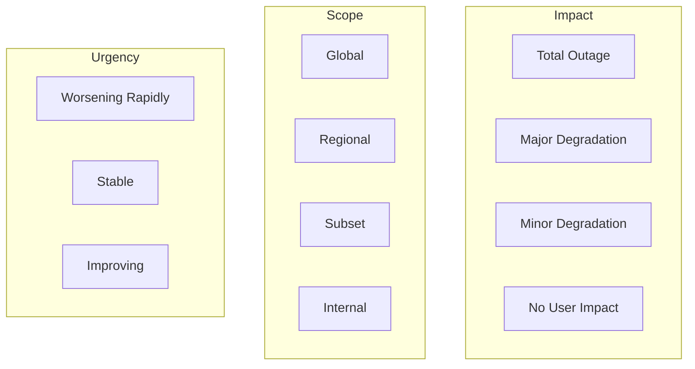
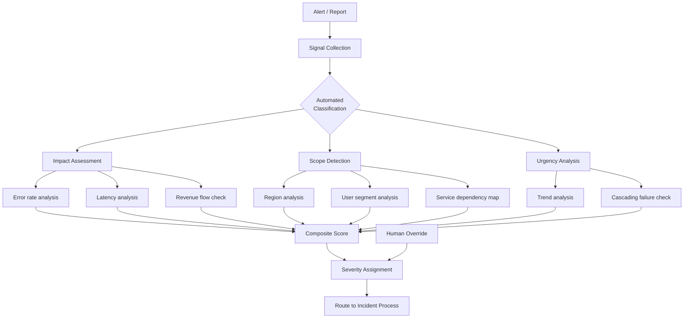
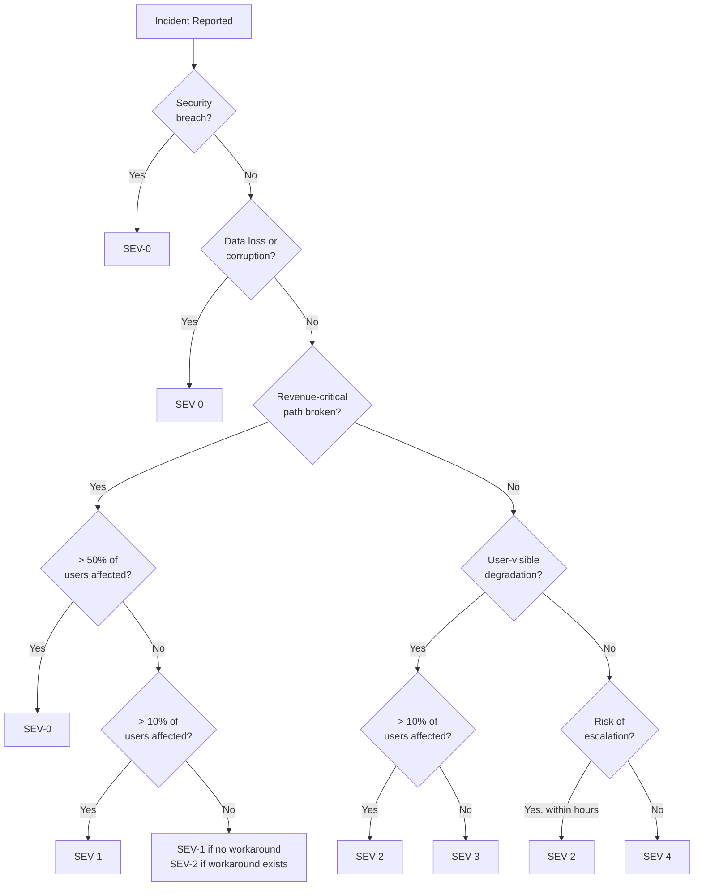

# Incident Classification

## Why It Exists

When an incident occurs, the first critical decision is classification: how severe is this? Classification determines everything that follows - who gets paged, how fast they respond, what communication happens, and what process activates. Misclassification in either direction is costly: under-classifying delays response and extends impact; over-classifying wastes resources and contributes to alert fatigue.

The challenge is that classification happens under uncertainty. At the moment an incident is detected, you often do not know the full scope, root cause, or trajectory. You must make a classification decision with incomplete information, and update it as more data arrives.

### The Classification Paradox

You need to classify quickly (to trigger the right response), but you need information to classify accurately (which takes time to gather). The resolution: **classify based on observable impact, not root cause**. You don't need to know why the database is slow to know that 40% of API requests are failing.

## First Principles

### The Impact-Urgency-Scope Framework

Incident classification evaluates three dimensions:

$$
\text{Severity} = f(\text{Impact}, \text{Urgency}, \text{Scope})
$$

**Impact**: What is the effect on users right now?
- Service completely unavailable
- Service degraded (slow, partial failures)
- Minor functionality broken
- No user-visible effect

**Urgency**: How quickly is the situation deteriorating?
- Rapidly worsening (cascading failure)
- Stable but significant
- Slowly degrading
- Static, not changing

**Scope**: How many users/systems are affected?
- All users globally
- One region or segment
- Small subset of users
- Internal only

### Multi-Dimensional Severity Matrix



| Impact | Scope: Global | Scope: Regional | Scope: Subset | Scope: Internal |
|--------|-------------|----------------|--------------|----------------|
| **Total outage + worsening** | SEV-0 | SEV-0 | SEV-1 | SEV-2 |
| **Total outage + stable** | SEV-0 | SEV-1 | SEV-1 | SEV-2 |
| **Major degradation + worsening** | SEV-0 | SEV-1 | SEV-2 | SEV-3 |
| **Major degradation + stable** | SEV-1 | SEV-1 | SEV-2 | SEV-3 |
| **Minor degradation** | SEV-2 | SEV-2 | SEV-3 | SEV-4 |
| **No user impact** | SEV-3 | SEV-3 | SEV-4 | SEV-4 |

## Core Mechanics

### Automated Classification Pipeline



### Classification Decision Tree



## Implementation

### Automated Incident Classifier

```typescript
interface IncidentSignals {
  // Metric-based signals
  errorRate: number;                    // 0-1
  errorRateBaseline: number;            // Normal error rate
  latencyP99Ms: number;                 // Current P99 latency
  latencyP99BaselineMs: number;         // Normal P99 latency
  requestRate: number;                  // Current rps
  requestRateBaseline: number;          // Normal rps

  // Impact signals
  affectedEndpoints: string[];          // List of affected API endpoints
  revenueEndpointsAffected: boolean;    // Is checkout/payment affected?
  totalActiveUsers: number;             // Current active users
  estimatedAffectedUsers: number;       // Estimated impacted users

  // Scope signals
  affectedRegions: string[];            // Regions with issues
  totalRegions: number;                 // Total regions
  affectedServices: string[];           // Services with issues
  totalServices: number;                // Total services

  // Context signals
  recentDeployment: boolean;            // Deploy in last 30 min
  recentConfigChange: boolean;          // Config change in last 30 min
  relatedActiveIncidents: number;       // Other active incidents
  isBusinessHours: boolean;             // Business hours flag
  isHighTrafficPeriod: boolean;         // Peak traffic flag

  // Security signals
  securityAlertActive: boolean;         // Security system alert
  unusualTrafficPattern: boolean;       // DDoS-like pattern
  dataExfiltrationRisk: boolean;        // Data leaving the system
}

type SeverityLevel = 'SEV-0' | 'SEV-1' | 'SEV-2' | 'SEV-3' | 'SEV-4';

interface ClassificationResult {
  severity: SeverityLevel;
  confidence: number;          // 0-1
  primaryReasons: string[];
  impactScore: number;         // 0-100
  scopeScore: number;          // 0-100
  urgencyScore: number;        // 0-100
  recommendedActions: string[];
  needsHumanReview: boolean;
}

class IncidentClassifier {
  classify(signals: IncidentSignals): ClassificationResult {
    // Security incidents are always SEV-0
    if (signals.securityAlertActive || signals.dataExfiltrationRisk) {
      return {
        severity: 'SEV-0',
        confidence: 0.95,
        primaryReasons: ['Security incident detected'],
        impactScore: 100,
        scopeScore: 100,
        urgencyScore: 100,
        recommendedActions: [
          'Activate security incident response',
          'Isolate affected systems',
          'Preserve forensic evidence',
        ],
        needsHumanReview: false,
      };
    }

    // Calculate component scores
    const impactScore = this.calculateImpactScore(signals);
    const scopeScore = this.calculateScopeScore(signals);
    const urgencyScore = this.calculateUrgencyScore(signals);

    // Composite score
    const compositeScore =
      impactScore * 0.5 + scopeScore * 0.3 + urgencyScore * 0.2;

    // Map to severity
    let severity: SeverityLevel;
    let confidence: number;

    if (compositeScore >= 80) {
      severity = 'SEV-0';
      confidence = Math.min(0.95, compositeScore / 100);
    } else if (compositeScore >= 60) {
      severity = 'SEV-1';
      confidence = 0.8;
    } else if (compositeScore >= 40) {
      severity = 'SEV-2';
      confidence = 0.75;
    } else if (compositeScore >= 20) {
      severity = 'SEV-3';
      confidence = 0.7;
    } else {
      severity = 'SEV-4';
      confidence = 0.7;
    }

    // Context adjustments
    if (signals.isHighTrafficPeriod && severity > 'SEV-1') {
      severity = this.upgradeSeverity(severity);
      confidence *= 0.9;
    }

    const reasons = this.generateReasons(signals, impactScore, scopeScore, urgencyScore);
    const actions = this.generateActions(severity, signals);

    return {
      severity,
      confidence,
      primaryReasons: reasons,
      impactScore,
      scopeScore,
      urgencyScore,
      recommendedActions: actions,
      needsHumanReview: confidence < 0.7,
    };
  }

  private calculateImpactScore(signals: IncidentSignals): number {
    let score = 0;

    // Error rate impact
    const errorRateRatio = signals.errorRate / Math.max(signals.errorRateBaseline, 0.001);
    if (errorRateRatio > 50) score += 40;
    else if (errorRateRatio > 10) score += 30;
    else if (errorRateRatio > 5) score += 20;
    else if (errorRateRatio > 2) score += 10;

    // Latency impact
    const latencyRatio = signals.latencyP99Ms / Math.max(signals.latencyP99BaselineMs, 1);
    if (latencyRatio > 20) score += 20;
    else if (latencyRatio > 10) score += 15;
    else if (latencyRatio > 5) score += 10;
    else if (latencyRatio > 2) score += 5;

    // Revenue flow impact
    if (signals.revenueEndpointsAffected) {
      score += 30;
    }

    // Traffic drop (service may be completely down)
    const trafficRatio = signals.requestRate / Math.max(signals.requestRateBaseline, 1);
    if (trafficRatio < 0.1) score += 30; // 90%+ traffic drop
    else if (trafficRatio < 0.5) score += 15; // 50%+ traffic drop

    return Math.min(100, score);
  }

  private calculateScopeScore(signals: IncidentSignals): number {
    let score = 0;

    // User impact percentage
    const userImpactPct =
      (signals.estimatedAffectedUsers / Math.max(signals.totalActiveUsers, 1)) * 100;
    if (userImpactPct > 80) score += 40;
    else if (userImpactPct > 50) score += 30;
    else if (userImpactPct > 20) score += 20;
    else if (userImpactPct > 5) score += 10;

    // Regional impact
    const regionImpactPct =
      (signals.affectedRegions.length / Math.max(signals.totalRegions, 1)) * 100;
    if (regionImpactPct >= 100) score += 30;
    else if (regionImpactPct >= 50) score += 20;
    else if (regionImpactPct >= 25) score += 10;

    // Service impact
    const serviceImpactPct =
      (signals.affectedServices.length / Math.max(signals.totalServices, 1)) * 100;
    if (serviceImpactPct > 50) score += 30;
    else if (serviceImpactPct > 25) score += 15;

    return Math.min(100, score);
  }

  private calculateUrgencyScore(signals: IncidentSignals): number {
    let score = 0;

    // Recent changes increase urgency (likely cause, can be rolled back)
    if (signals.recentDeployment) score += 20;
    if (signals.recentConfigChange) score += 15;

    // Multiple active incidents suggest systemic issue
    if (signals.relatedActiveIncidents > 2) score += 25;
    else if (signals.relatedActiveIncidents > 0) score += 10;

    // DDoS-like patterns
    if (signals.unusualTrafficPattern) score += 20;

    // Business hours impact is more urgent (more users affected)
    if (signals.isBusinessHours) score += 10;
    if (signals.isHighTrafficPeriod) score += 15;

    return Math.min(100, score);
  }

  private upgradeSeverity(severity: SeverityLevel): SeverityLevel {
    const levels: SeverityLevel[] = ['SEV-4', 'SEV-3', 'SEV-2', 'SEV-1', 'SEV-0'];
    const idx = levels.indexOf(severity);
    return idx < levels.length - 1 ? levels[idx + 1] : severity;
  }

  private generateReasons(
    signals: IncidentSignals,
    impact: number,
    scope: number,
    urgency: number
  ): string[] {
    const reasons: string[] = [];

    if (signals.revenueEndpointsAffected) {
      reasons.push('Revenue-critical endpoints affected');
    }
    if (signals.errorRate > signals.errorRateBaseline * 10) {
      reasons.push(`Error rate ${(signals.errorRate * 100).toFixed(1)}% (${Math.round(signals.errorRate / signals.errorRateBaseline)}x baseline)`);
    }
    if (signals.estimatedAffectedUsers > signals.totalActiveUsers * 0.3) {
      reasons.push(`${signals.estimatedAffectedUsers.toLocaleString()} users affected (${((signals.estimatedAffectedUsers / signals.totalActiveUsers) * 100).toFixed(0)}%)`);
    }
    if (signals.affectedRegions.length > 1) {
      reasons.push(`Multiple regions affected: ${signals.affectedRegions.join(', ')}`);
    }
    if (signals.recentDeployment) {
      reasons.push('Recent deployment may be the cause');
    }

    return reasons;
  }

  private generateActions(severity: SeverityLevel, signals: IncidentSignals): string[] {
    const actions: string[] = [];

    if (severity === 'SEV-0' || severity === 'SEV-1') {
      actions.push('Open war room immediately');
      actions.push('Update status page');
      actions.push('Notify customer success team');
    }

    if (signals.recentDeployment) {
      actions.push('Consider rollback of recent deployment');
    }

    if (signals.recentConfigChange) {
      actions.push('Review and potentially revert recent config change');
    }

    if (signals.affectedRegions.length > 0 && signals.affectedRegions.length < signals.totalRegions) {
      actions.push(`Investigate region-specific issue in: ${signals.affectedRegions.join(', ')}`);
    }

    return actions;
  }
}
```

### Severity Reclassification

```typescript
interface ReclassificationEvent {
  incidentId: string;
  previousSeverity: SeverityLevel;
  newSeverity: SeverityLevel;
  reason: string;
  reclassifiedBy: string;
  timestamp: Date;
}

class SeverityManager {
  private history: Map<string, ReclassificationEvent[]> = new Map();

  reclassify(
    incidentId: string,
    currentSeverity: SeverityLevel,
    newSeverity: SeverityLevel,
    reason: string,
    reclassifiedBy: string
  ): ReclassificationEvent {
    const event: ReclassificationEvent = {
      incidentId,
      previousSeverity: currentSeverity,
      newSeverity,
      reason,
      reclassifiedBy,
      timestamp: new Date(),
    };

    const events = this.history.get(incidentId) ?? [];
    events.push(event);
    this.history.set(incidentId, events);

    // Trigger process changes based on new severity
    if (this.isUpgrade(currentSeverity, newSeverity)) {
      console.log(`SEVERITY UPGRADE: ${incidentId} from ${currentSeverity} to ${newSeverity}`);
      // Activate additional processes for higher severity
    } else {
      console.log(`SEVERITY DOWNGRADE: ${incidentId} from ${currentSeverity} to ${newSeverity}`);
      // May deactivate some processes
    }

    return event;
  }

  private isUpgrade(from: SeverityLevel, to: SeverityLevel): boolean {
    const order = ['SEV-4', 'SEV-3', 'SEV-2', 'SEV-1', 'SEV-0'];
    return order.indexOf(to) > order.indexOf(from);
  }
}
```

## Edge Cases and Failure Modes

### 1. The Slow Escalation

Impact starts small (SEV-3) but grows over hours. Nobody reclassifies because each incremental change is small. By the time it is clearly SEV-1, 3 hours have passed.

**Solution**: Automated severity reassessment every 15 minutes. Compare current metrics to the original classification threshold.

### 2. The Multi-Service Incident

Each service team sees a minor issue (SEV-3). But 8 services are affected simultaneously because they share a dependency. No single team escalates.

**Solution**: Correlation engine that detects when multiple low-severity incidents are likely related:

```typescript
function detectCorrelatedIncidents(
  activeIncidents: Array<{ id: string; severity: SeverityLevel; services: string[]; startTime: Date }>
): { correlated: boolean; suggestedSeverity: SeverityLevel; incidentIds: string[] } {
  // Find incidents that started within 10 minutes of each other
  const window = 10 * 60 * 1000; // 10 minutes

  for (let i = 0; i < activeIncidents.length; i++) {
    const cluster: string[] = [activeIncidents[i].id];

    for (let j = i + 1; j < activeIncidents.length; j++) {
      const timeDiff = Math.abs(
        activeIncidents[i].startTime.getTime() - activeIncidents[j].startTime.getTime()
      );
      if (timeDiff < window) {
        cluster.push(activeIncidents[j].id);
      }
    }

    if (cluster.length >= 3) {
      return {
        correlated: true,
        suggestedSeverity: 'SEV-1',
        incidentIds: cluster,
      };
    }
  }

  return { correlated: false, suggestedSeverity: 'SEV-4', incidentIds: [] };
}
```

### 3. The False SEV-0

A monitoring system glitch reports 100% error rate. Automated classification triggers SEV-0. War room is opened. VP is paged. 10 minutes later, the monitoring system recovers and the "incident" disappears.

**Solution**: Require corroboration from at least 2 independent signals before auto-classifying SEV-0. A single metric crossing a threshold should trigger SEV-1 at most; SEV-0 should require confirmation.

::: danger Classification Anti-Patterns
1. **Severity by seniority**: The VP says it's SEV-0, so it's SEV-0. Classification should be based on objective criteria.
2. **Severity negotiation**: Teams argue about classification to avoid postmortem obligations. Remove the punishment, keep the process.
3. **All incidents are SEV-3**: If everything is low severity, your classification criteria are wrong or teams are gaming the system.
4. **Classification paralysis**: Spending 15 minutes debating severity while customers are affected. Classify fast, reclassify later.
5. **Ignoring near-misses**: Events that almost became incidents (SEV-5?) deserve attention but are often dismissed.
:::

## Performance Characteristics

### Classification Accuracy

| Method | Accuracy | Speed | Consistency |
|--------|----------|-------|-------------|
| Manual (individual engineer) | 60-75% | 2-5 min | Low |
| Manual (with decision tree) | 75-85% | 1-2 min | Medium |
| Automated (rule-based) | 80-90% | < 1 sec | High |
| Automated (ML-assisted) | 85-92% | < 1 sec | High |
| Hybrid (auto + human review) | 90-95% | 30 sec | High |

## Mathematical Foundations

### Bayesian Classification

Given observed signals $X$, the probability of each severity level:

$$
P(S_i | X) = \frac{P(X | S_i) \cdot P(S_i)}{\sum_j P(X | S_j) \cdot P(S_j)}
$$

Where:
- $P(S_i)$ = prior probability of severity $i$ (from historical data)
- $P(X | S_i)$ = likelihood of observing signals $X$ given severity $i$

Historical priors (typical distribution):

$$
P(\text{SEV-0}) \approx 0.02, \quad P(\text{SEV-1}) \approx 0.08, \quad P(\text{SEV-2}) \approx 0.25
$$

$$
P(\text{SEV-3}) \approx 0.40, \quad P(\text{SEV-4}) \approx 0.25
$$

## Real-World War Stories

::: info War Story
**The SEV-3 That Was Actually a SEV-0 (2023)**

A logging service started dropping 5% of log entries. Classified as SEV-3 (minor degradation, internal tool). Nobody rushed to fix it. Over the next 48 hours, the root cause (disk filling up on the log aggregator) progressed. When the disk hit 100%, the log aggregator crashed, taking down the log pipeline. Without logs, engineers could not diagnose a separate, unrelated issue that occurred simultaneously. That issue (a misconfigured load balancer) escalated to a full SEV-0 outage because nobody could see what was happening.

**Lesson**: Classification should consider second-order effects. A SEV-3 in a critical support system (logging, monitoring, alerting) should be treated as SEV-2 minimum, because its failure degrades the ability to respond to other incidents.
:::

## Decision Framework

### Quick Classification Guide

| Signal | SEV-0 | SEV-1 | SEV-2 | SEV-3 |
|--------|-------|-------|-------|-------|
| Error rate | > 50% | > 10% | > 1% | > 0.1% |
| Users affected | > 50% | > 10% | > 1% | < 1% |
| Latency | > 30x | > 10x | > 3x | > 1.5x |
| Regions down | All | 1+ | - | - |
| Revenue impact | > $10K/hr | > $1K/hr | > $100/hr | Negligible |
| Data risk | Loss/corruption | Integrity risk | Minor | None |

## Advanced Topics

### ML-Based Classification

Training a severity classifier on historical incidents:

```typescript
interface TrainingExample {
  signals: IncidentSignals;
  actualSeverity: SeverityLevel;
  wasReclassified: boolean;
  finalSeverity: SeverityLevel;
}

function featureEngineering(signals: IncidentSignals): number[] {
  return [
    signals.errorRate / Math.max(signals.errorRateBaseline, 0.0001),
    signals.latencyP99Ms / Math.max(signals.latencyP99BaselineMs, 1),
    signals.estimatedAffectedUsers / Math.max(signals.totalActiveUsers, 1),
    signals.affectedRegions.length / Math.max(signals.totalRegions, 1),
    signals.affectedServices.length / Math.max(signals.totalServices, 1),
    signals.revenueEndpointsAffected ? 1 : 0,
    signals.recentDeployment ? 1 : 0,
    signals.recentConfigChange ? 1 : 0,
    signals.isBusinessHours ? 1 : 0,
    signals.isHighTrafficPeriod ? 1 : 0,
    signals.relatedActiveIncidents,
    signals.securityAlertActive ? 1 : 0,
    signals.requestRate / Math.max(signals.requestRateBaseline, 1),
  ];
}
```

The model is trained on historical incidents using the **final** severity (after reclassification) as the target, not the initial classification. This teaches the model to classify correctly from the start.

## Cross-References

- [Incident Response Overview](./index.md) - Overall incident response framework
- [Severity Levels](../alerting/severity-levels.md) - Alert severity that feeds incident classification
- [Communication Templates](./communication-templates.md) - Severity-appropriate communications
- [War Room Procedures](./war-room-procedures.md) - When classification triggers a war room
- [Postmortem Framework](./postmortem-framework.md) - Severity determines postmortem requirements
