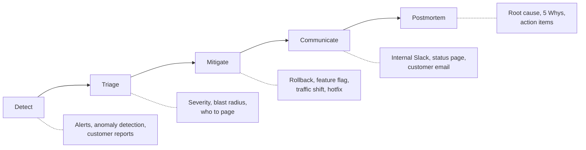
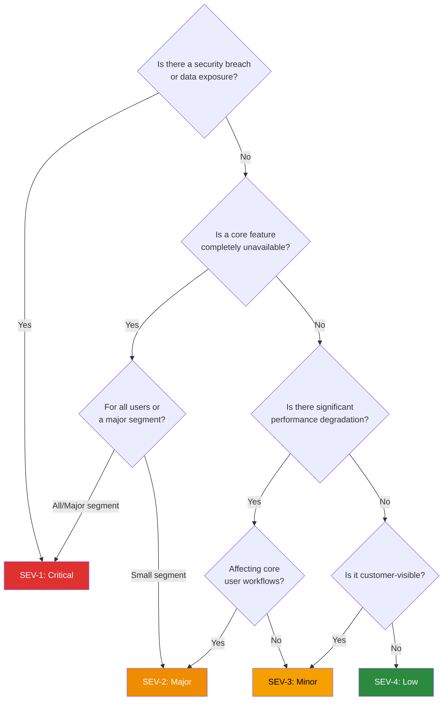
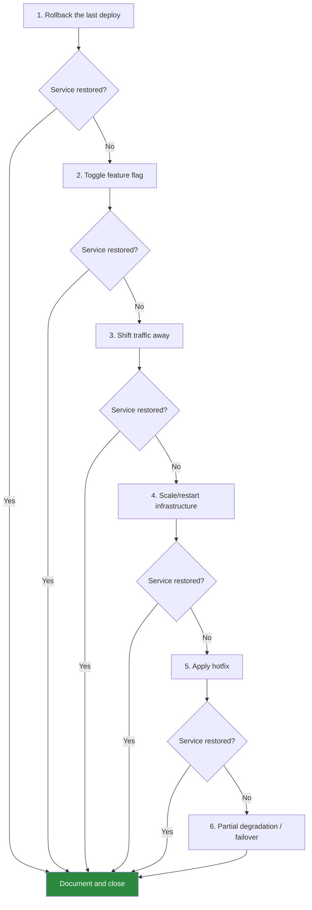
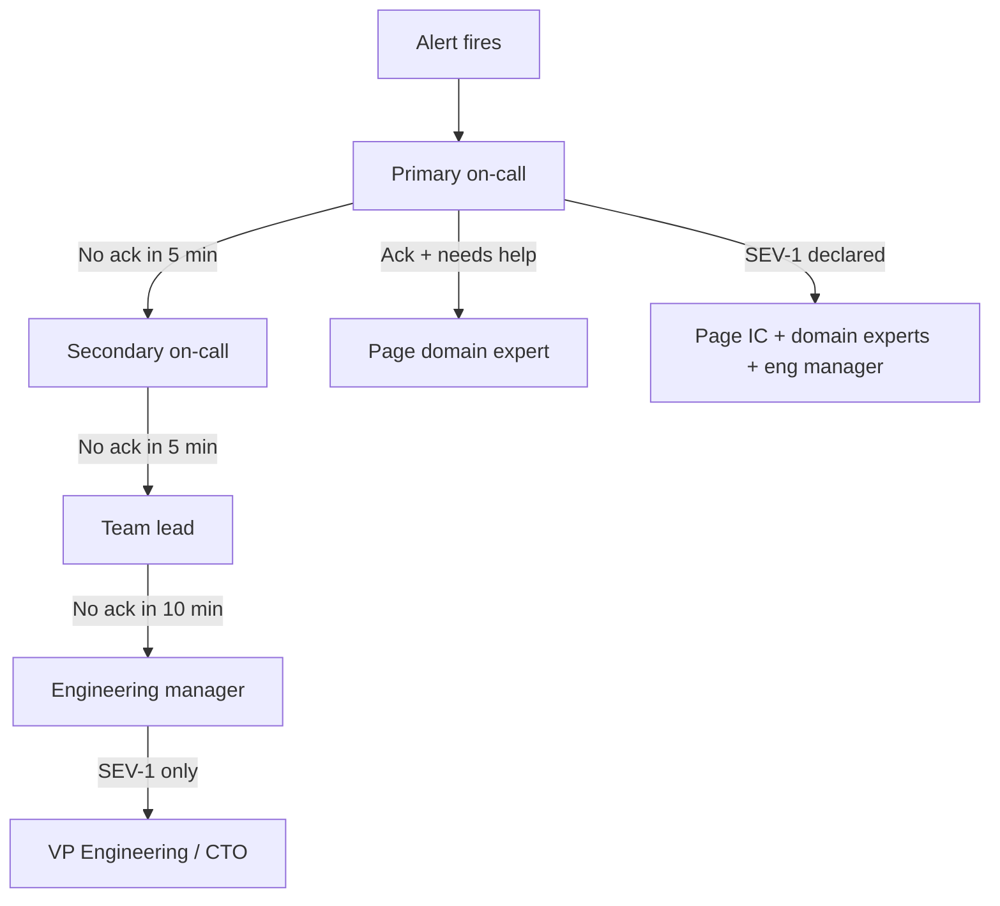

# Incident Response Playbook

An incident is an unplanned event that disrupts or degrades service for customers. Every engineering organization will have incidents — the difference between mature and immature teams is not the number of incidents but how quickly and effectively they respond.

This playbook is a complete, executable guide for the entire incident lifecycle: detection through postmortem. It is designed to be read once for learning and referenced during actual incidents. Every template, escalation path, and communication script is written to be copy-pasted under pressure — because during an incident, you do not have the cognitive bandwidth to compose prose from scratch.

## The Incident Lifecycle

Every incident, regardless of severity, follows the same five-phase lifecycle:



The phases overlap in practice — you communicate while mitigating, and detection continues as you triage — but the mental model of five phases keeps the incident response structured. Teams that skip phases (especially communication and postmortem) accumulate organizational debt that makes future incidents worse.

### Phase Durations by Severity

| Phase | SEV-1 | SEV-2 | SEV-3 | SEV-4 |
|-------|-------|-------|-------|-------|
| Detect → Triage | < 5 min | < 15 min | < 30 min | < 2 hr |
| Triage → Mitigation started | < 15 min | < 30 min | < 1 hr | < 4 hr |
| Mitigation → Customer comms | < 5 min | < 15 min | < 1 hr | Best effort |
| Incident → Postmortem draft | < 48 hr | < 72 hr | < 1 week | Optional |

## Severity Levels

Severity classification is the first and most consequential decision during an incident. It determines who gets paged, how fast you need to act, what communication channels activate, and whether leadership is informed.

### SEV-1: Critical

**Definition:** Complete service outage, data loss, security breach, or revenue-blocking failure affecting all or a majority of users.

**Examples:**
- Production database is down — no reads or writes
- Payment processing is entirely broken — zero transactions completing
- Customer data is exposed to unauthorized parties
- Authentication system is unavailable — no user can log in
- Primary data center unreachable

**Response requirements:**
- On-call engineer responds within **5 minutes**
- Incident commander assigned within **10 minutes**
- War room opened immediately
- Engineering leadership notified within **15 minutes**
- External status page updated within **20 minutes**
- Customer communications within **30 minutes**
- All-hands-on-deck if initial responders cannot mitigate within 30 minutes

### SEV-2: Major

**Definition:** Significant degradation of a core feature affecting a large subset of users. The service is up but meaningfully impaired.

**Examples:**
- Search is returning errors for 40% of queries
- Mobile app API is responding with 5-second latency (normal: 200ms)
- Image uploads are failing but all other features work
- A specific geographic region cannot access the service
- Email delivery is delayed by 2+ hours

**Response requirements:**
- On-call engineer responds within **15 minutes**
- Incident commander assigned within **30 minutes**
- Dedicated Slack channel created
- Engineering manager notified within **30 minutes**
- External status page updated within **1 hour**
- Customer communications for affected segment within **2 hours**

### SEV-3: Minor

**Definition:** Minor feature degradation affecting a small subset of users. Core functionality is unaffected.

**Examples:**
- Dashboard analytics are showing stale data (last updated 6 hours ago)
- Dark mode CSS is broken on one browser
- Export to CSV times out for reports over 10,000 rows
- Webhook deliveries are delayed by 10 minutes
- Admin panel is slow but functional

**Response requirements:**
- On-call engineer acknowledges within **30 minutes** during business hours
- No war room required — Slack channel is sufficient
- Fix during normal working hours
- Status page update only if customer-visible
- Internal comms only

### SEV-4: Low

**Definition:** Cosmetic issue, minor inconvenience, or internal tooling problem with no customer impact.

**Examples:**
- Internal monitoring dashboard has a broken graph
- Staging environment CI is flaky
- Log aggregation is 5 minutes behind
- Internal wiki search is slow
- Non-critical cron job failed on a single run

**Response requirements:**
- Ticket created, addressed in next sprint
- No escalation, no war room, no comms
- On-call may defer to next business day

### Severity Decision Tree



::: warning
When in doubt, escalate to a higher severity. You can always downgrade. Upgrading severity mid-incident is slow (pages need to go out, war rooms need to form) — downgrading is instant (just announce it). The cost of over-classifying is a few unnecessary pages; the cost of under-classifying is a prolonged outage.
:::

## Phase 1: Detection

You cannot respond to what you do not know about. Detection is the phase where you first learn that something is wrong.

### Detection Sources (Ordered by Speed)

| Source | Typical Latency | Reliability | Example |
|--------|----------------|-------------|---------|
| Automated alerts (metrics) | 1-5 min | High | Error rate > 5% for 2 min |
| Synthetic monitoring | 1-5 min | High | Canary transaction failed |
| Anomaly detection | 3-10 min | Medium | Request latency 3 sigma above baseline |
| Internal report (engineer notices) | 5-30 min | Medium | "Something looks weird in Grafana" |
| Customer support tickets | 15-60 min | Low | Multiple tickets about same issue |
| Social media | 30-120 min | Low | Twitter thread about your outage |
| Customer email to exec | 1-24 hr | Low | "Your service has been down all day" |

**Goal:** Detect 90%+ of incidents through automated alerts before any human notices. Every incident detected via customer report or social media is a detection failure worth a postmortem action item.

### Alert Design for Incident Detection

Effective alerting requires balancing sensitivity (catching real incidents) against specificity (not generating false alarms that erode on-call trust).

```yaml
# Good alert — symptom-based, high signal
- alert: HighErrorRate
  expr: |
    sum(rate(http_requests_total{status=~"5.."}[5m]))
    /
    sum(rate(http_requests_total[5m]))
    > 0.05
  for: 2m
  labels:
    severity: page
  annotations:
    summary: "Error rate above 5% for 2 minutes"
    runbook: "https://wiki.internal/runbooks/high-error-rate"
    dashboard: "https://grafana.internal/d/api-health"
```

```yaml
# Bad alert — cause-based, low signal
- alert: HighCpuUsage
  expr: node_cpu_usage > 0.90
  for: 1m
  labels:
    severity: page
  annotations:
    summary: "CPU above 90%"
    # High CPU might not cause any user impact
    # This will page on-call for non-incidents
```

::: tip
**Alert on symptoms, not causes.** Users care about error rates, latency, and availability — not CPU usage, disk I/O, or memory pressure. Cause-based alerts generate noise. Symptom-based alerts are actionable.
:::

### The Detection Checklist

When an alert fires or someone reports an issue, the on-call engineer runs this checklist:

1. **Verify the signal is real** — Check the dashboard linked in the alert annotation. Is the metric actually elevated, or was it a blip that auto-resolved?
2. **Check for known causes** — Is there an active deploy? A scheduled maintenance window? A known upstream dependency issue?
3. **Reproduce if possible** — Can you trigger the error yourself? Does a synthetic transaction fail?
4. **Assess scope** — Is this affecting one endpoint, one region, one user segment, or everything?
5. **Move to Triage** — If the issue is real and ongoing, immediately move to triage.

## Phase 2: Triage

Triage is the phase where you assess the impact, classify severity, and decide who needs to be involved. The goal is to spend **under 5 minutes** on triage for SEV-1 and **under 15 minutes** for SEV-2.

### The Triage Framework

Answer these four questions in order:

**1. What is broken?**
Identify the specific symptom. "API errors are elevated" is better than "something is wrong." "POST /api/orders returns 500 with `connection refused` from payment service" is best.

**2. Who is affected?**
- All users vs. a subset (geographic region, plan tier, specific feature)
- Internal vs. external users
- Revenue-generating flows vs. non-critical flows

**3. What is the blast radius?**
```
Blast Radius Assessment:

Single user        → SEV-3/4, low urgency
Single feature     → SEV-3, moderate urgency
Single region      → SEV-2, high urgency
Core workflow       → SEV-2, high urgency
All users          → SEV-1, maximum urgency
Data integrity     → SEV-1, maximum urgency
Security breach    → SEV-1, maximum urgency
```

**4. Who needs to be paged?**

| Blast Radius | Page |
|-------------|------|
| Single feature, non-critical | On-call for owning team |
| Core workflow degraded | On-call + team lead |
| Full outage or data loss | On-call + team lead + incident commander + eng management |
| Security breach | On-call + security team + CISO + incident commander + eng management + legal |

### Triage Anti-Patterns

::: danger
**Anti-pattern: Solo debugging.** The on-call engineer spends 45 minutes trying to figure out the root cause alone before telling anyone. Meanwhile, the outage is growing. **Fix:** If you cannot mitigate within 10 minutes, escalate immediately.

**Anti-pattern: Severity denial.** "It's probably fine, let's wait and see." By the time you confirm it's not fine, you've wasted 30 minutes. **Fix:** Assume the worst, downgrade later.

**Anti-pattern: Wrong responders.** Paging the backend team for a CDN issue. **Fix:** Maintain a clear service ownership map and page the right team from the start.
:::

## Phase 3: Mitigation

Mitigation is about restoring service as fast as possible. It is explicitly **not** about finding the root cause. You can investigate the root cause in the postmortem — right now the goal is to stop the bleeding.

### The Mitigation Hierarchy

Try these strategies in order. Each subsequent strategy takes longer and carries more risk:



### Strategy 1: Rollback

The fastest and safest mitigation. If the incident started after a deploy, roll it back first, ask questions later.

```bash
# Kubernetes rollback
kubectl rollout undo deployment/api-server -n production

# Verify rollback
kubectl rollout status deployment/api-server -n production

# Check the previous revision it rolled back to
kubectl rollout history deployment/api-server -n production
```

```bash
# AWS ECS — update to previous task definition
aws ecs update-service \
  --cluster production \
  --service api-server \
  --task-definition api-server:$PREVIOUS_REVISION

# Argo Rollouts — abort and rollback
kubectl argo rollouts abort api-server -n production
kubectl argo rollouts undo api-server -n production
```

**When rollback fails:** The deploy is not the cause, or the database schema changed and the old code is incompatible with the new schema. Move to the next strategy.

### Strategy 2: Feature Flag Toggle

If you can identify the specific feature causing the issue, disable it without a full rollback.

```typescript
// LaunchDarkly / Unleash / custom feature flag
if (featureFlags.isEnabled('new-search-algorithm', user)) {
  return newSearchAlgorithm(query);
} else {
  return legacySearchAlgorithm(query); // fallback
}

// During incident: disable 'new-search-algorithm' in flag dashboard
// Effect: instant, no deploy required, blast radius = zero
```

::: tip
Feature flags are the single best investment for incident mitigation speed. If every new feature ships behind a flag, 80%+ of feature-related incidents can be mitigated in under 60 seconds by flipping a toggle.
:::

### Strategy 3: Traffic Shift

If the problem is localized to a specific region, availability zone, or backend instance, shift traffic away.

```bash
# Remove unhealthy backend from load balancer pool
aws elbv2 deregister-targets \
  --target-group-arn $TG_ARN \
  --targets Id=$UNHEALTHY_INSTANCE

# Route53 failover — disable unhealthy region
aws route53 change-resource-record-sets \
  --hosted-zone-id $ZONE_ID \
  --change-batch '{
    "Changes": [{
      "Action": "UPSERT",
      "ResourceRecordSet": {
        "Name": "api.example.com",
        "Type": "A",
        "SetIdentifier": "us-east-1",
        "Failover": "PRIMARY",
        "TTL": 60,
        "ResourceRecords": [{"Value": "0.0.0.0"}]
      }
    }]
  }'
```

### Strategy 4: Scale / Restart

Sometimes the mitigation is simply restarting pods or scaling up to handle unexpected load.

```bash
# Kubernetes — restart all pods in a deployment
kubectl rollout restart deployment/api-server -n production

# Scale up to handle load
kubectl scale deployment/api-server --replicas=20 -n production

# If a specific pod is in a bad state
kubectl delete pod api-server-abc123 -n production
```

### Strategy 5: Hotfix

A targeted code change deployed directly to production. This is the riskiest mitigation because you're deploying under pressure with minimal testing.

```bash
# Hotfix workflow
git checkout main
git pull origin main
git checkout -b hotfix/payment-null-check

# Make the minimal possible change
# ONE line fix, no refactoring, no "while I'm here" changes

git add src/payment/processor.ts
git commit -m "hotfix: null check on payment response"
git push origin hotfix/payment-null-check

# Fast-track through CI — skip non-essential checks
# Deploy via expedited pipeline
```

::: danger
Hotfixes under pressure are the most common source of "the fix made it worse" incidents. Every hotfix should be reviewed by at least one other engineer, even if the review takes only 60 seconds. A second pair of eyes catches the typo that turns a 1-hour outage into a 4-hour outage.
:::

### Strategy 6: Partial Degradation / Graceful Failover

If you cannot fully restore service, degrade gracefully. Serve stale data, disable non-essential features, or switch to a read-only mode.

```typescript
// Circuit breaker pattern — degrade to cached response
async function getProductRecommendations(userId: string) {
  try {
    return await recommendationService.getPersonalized(userId);
  } catch (error) {
    // Service is down — return cached/static recommendations
    logger.warn('Recommendation service unavailable, serving fallback');
    return getCachedRecommendations();
  }
}
```

## Phase 4: Communication

Communication is not optional and it is not secondary to mitigation. Silence during an outage is worse than bad news — it signals that either you do not know about the problem or you do not care.

### The Communication Timeline

| Time Since Detection | Action | Channel |
|---------------------|--------|---------|
| 0-5 min | Internal alert — "We're aware and investigating" | Incident Slack channel |
| 5-15 min | Severity classified, IC assigned | Incident Slack channel |
| 15-30 min | External status page updated | Statuspage / Instatus |
| 30-60 min | First customer email (if SEV-1/2) | Email, in-app banner |
| Every 30 min | Internal status update | Incident Slack channel |
| Every 60 min | External status update | Statuspage, Twitter/X |
| Resolution | "Resolved" update on all channels | All channels |
| +24-72 hr | Postmortem shared | Internal wiki, customer blog (if major) |

### Internal Communication Templates

#### Incident Declaration (Slack)

```
:rotating_light: INCIDENT DECLARED — SEV-[1/2/3]

What: [One sentence describing the symptom]
Impact: [Who is affected and how]
Started: [Time in UTC] ([X minutes ago])
IC: @[incident-commander]
Channel: #inc-[YYYY-MM-DD]-[short-description]
Status: Investigating

War room: [Zoom/Meet link]
Dashboard: [Grafana link]
Runbook: [Link]
```

#### Status Update (Every 30 min)

```
:mag: INCIDENT UPDATE — SEV-[1/2/3] — [HH:MM] UTC

Current status: [Investigating / Identified / Mitigating / Monitoring]
What we know: [2-3 sentences on current understanding]
What we're doing: [Current mitigation actions]
Next update: [Time] UTC

Impact: [Updated impact assessment]
Duration so far: [X hours Y minutes]
```

#### Resolution (Slack)

```
:white_check_mark: INCIDENT RESOLVED — SEV-[1/2/3]

Duration: [X hours Y minutes]
What happened: [2-3 sentence summary]
Mitigation: [What fixed it]
Customer impact: [Brief impact summary]

Postmortem will be scheduled within [48/72] hours.
Channel will be archived in 24 hours — add any notes before then.
```

### External Communication Templates

#### Status Page — Investigating

```
Title: Elevated error rates on [Service Name]

We are currently investigating elevated error rates affecting
[description of affected functionality]. Some users may experience
[specific symptom — e.g., slow page loads, failed API requests,
inability to log in].

Our engineering team is actively working to resolve this issue.
We will provide updates every 30 minutes.

Posted: [Time] UTC
```

#### Status Page — Identified

```
Title: Elevated error rates on [Service Name] — Cause Identified

We have identified the cause of the elevated error rates affecting
[Service Name]. The issue is related to [general category — e.g.,
a configuration change, increased load, a dependency failure].

Our team is implementing a fix and we expect service to be restored
within [estimated timeframe].

Updated: [Time] UTC
```

#### Status Page — Resolved

```
Title: Elevated error rates on [Service Name] — Resolved

The issue affecting [Service Name] has been resolved. Service has
been restored to normal operation as of [Time] UTC.

The incident lasted approximately [duration]. During this time,
[brief impact summary — e.g., approximately X% of API requests
returned errors].

We will publish a detailed incident report within [timeframe].
We apologize for the disruption.

Updated: [Time] UTC
```

#### Customer Email (SEV-1, Major Outage)

```
Subject: [Service Name] Service Disruption — [Date]

Dear [Customer Name],

We want to inform you about a service disruption that affected
[Service Name] today.

WHAT HAPPENED
Starting at [time] UTC, [brief description of the symptom from the
customer's perspective — e.g., users were unable to access their
dashboards / API requests returned errors / data processing was
delayed].

IMPACT
The disruption lasted [duration] and affected [scope of impact].
[If applicable: Your account was / was not directly affected.]

RESOLUTION
Our engineering team identified the issue at [time] and implemented
a fix at [time]. Service was fully restored at [time] UTC.

WHAT WE'RE DOING TO PREVENT RECURRENCE
We are conducting a thorough incident review and will implement
[brief description of preventive measures]. We take reliability
seriously and are committed to preventing similar disruptions.

[If applicable: SLA CREDITS
If this disruption affected your service level agreement, credits
will be applied automatically to your next invoice.]

If you have questions, please contact your account manager or
our support team at support@example.com.

Sincerely,
[VP Engineering / CTO Name]
[Company Name]
```

::: warning
Never lie in external communications. Do not say "a small number of users" when 80% were affected. Do not say "briefly" when the outage lasted 3 hours. Customers who experienced the outage will read your status update and lose trust if the description does not match their experience.
:::

## Incident Commander Role

The Incident Commander (IC) is the single point of authority during an incident. They do not debug — they coordinate.

### IC Responsibilities

1. **Declare the incident** and set the initial severity
2. **Open the war room** (Slack channel, video call)
3. **Assign roles** (communications lead, technical lead, scribe)
4. **Drive the triage** — ensure the right people are investigating the right things
5. **Make decisions** — when responders disagree on mitigation approach, the IC decides
6. **Authorize risky actions** — rollbacks, hotfixes, data migrations during the incident
7. **Manage communication cadence** — ensure status updates go out on schedule
8. **Call for escalation** — page additional responders, notify leadership
9. **Declare resolution** — confirm the incident is over
10. **Ensure postmortem is scheduled**

### IC Anti-Patterns

| Anti-Pattern | Impact | Correct Behavior |
|-------------|--------|-----------------|
| IC debugs the issue themselves | Coordination stops, response slows | Delegate debugging, focus on coordination |
| IC makes all technical decisions | Bottleneck, slower response | Let domain experts decide; IC breaks ties |
| IC skips communication updates | Stakeholders escalate, chaos | Set a timer, delegate to comms lead |
| IC never escalates | Team drowns in a SEV-1 | Escalate early and often |
| IC assigns blame during incident | People stop sharing information | Focus on facts and actions, never blame |

### War Room Etiquette

```
WAR ROOM RULES (Pin this in every incident channel)

1. IC runs the room. Follow their instructions.
2. One conversation at a time. Raise hand to speak.
3. State facts, not theories. "Error rate is 47%" not "I think the DB is slow."
4. Prefix messages with your role: "[DB] Replication lag is 30 seconds"
5. If you're not actively contributing, mute and observe.
6. No blame. No "who deployed this?" — focus on "what is the state now?"
7. Keep a timeline. Scribe records every significant action with timestamp.
8. Announce before making changes: "I'm going to restart pod X" → wait for IC OK.
9. No side-channel debugging. All findings reported in the war room.
10. Take breaks. Fatigue causes mistakes. IC rotates responders on long incidents.
```

## Timeline Documentation

Every incident must have a written timeline. The scribe (or the IC if no scribe is assigned) records every significant event with a UTC timestamp.

### Timeline Template

```markdown
## Incident Timeline

| Time (UTC) | Event | Actor |
|------------|-------|-------|
| 14:02 | Alert fires: API error rate > 5% | PagerDuty |
| 14:04 | On-call acknowledges alert | @alice |
| 14:06 | Confirms error rate is real, 12% and climbing | @alice |
| 14:08 | Incident declared SEV-2, channel #inc-2026-04-05-api-errors created | @alice |
| 14:10 | IC assigned: @bob | @alice |
| 14:12 | War room opened, @carol paged for database expertise | @bob (IC) |
| 14:15 | Identified: errors are all "connection refused" to payment service | @alice |
| 14:17 | Payment service pods are in CrashLoopBackOff | @carol |
| 14:19 | IC decision: rollback payment service to previous version | @bob (IC) |
| 14:21 | Rollback initiated | @alice |
| 14:24 | Payment service pods healthy, error rate dropping | @alice |
| 14:28 | Error rate at 0.1% (normal), monitoring for 15 min | @alice |
| 14:30 | Status page updated: "Identified and mitigating" | @dave (comms) |
| 14:43 | 15 min stable at normal levels, incident resolved | @bob (IC) |
| 14:45 | Status page updated: "Resolved" | @dave (comms) |
| 14:47 | Postmortem scheduled for 2026-04-07 | @bob (IC) |
```

::: tip
Write the timeline as events happen, not after the incident. Memory is unreliable under stress, and chat logs are hard to reconstruct into a coherent timeline after the fact. A dedicated scribe who records events in real-time is the single highest-value role during a long incident.
:::

## Phase 5: Postmortem

The postmortem converts the incident from a crisis into a permanent improvement. It is the most important phase of the incident lifecycle because it is the only phase that prevents future incidents.

### Postmortem Scheduling

| Severity | Postmortem Required? | Due Date |
|----------|---------------------|----------|
| SEV-1 | Required | Within 48 hours |
| SEV-2 | Required | Within 72 hours |
| SEV-3 | Recommended | Within 1 week |
| SEV-4 | Optional | Best effort |

### The 5 Whys Technique

The 5 Whys is a simple root cause analysis technique. You ask "why" iteratively until you reach a systemic root cause that can be fixed.

```
Incident: Payment processing was down for 40 minutes.

Why 1: Why was payment processing down?
  → The payment service pods were in CrashLoopBackOff.

Why 2: Why were the pods crashing?
  → The new deployment had a null pointer exception when
    the payment gateway returned an unexpected response format.

Why 3: Why did the code not handle the unexpected response?
  → The integration test mocked the payment gateway response
    and never tested the real response format.

Why 4: Why didn't the test cover the real response format?
  → There is no contract test or integration test that validates
    against the actual payment gateway API.

Why 5: Why is there no contract test?
  → Contract testing was never added to the testing standards,
    and there is no linting rule or CI check that requires it for
    external API integrations.

Root Cause: Missing contract testing standard for external integrations.

Action Items:
1. Add contract tests for payment gateway (P0 — @alice, due next sprint)
2. Add CI check requiring contract tests for all external API clients (P1 — @bob)
3. Audit other external integrations for contract test coverage (P1 — @carol)
```

::: warning
The 5 Whys technique has a known limitation: it tends to converge on a single linear causal chain. Real incidents have multiple contributing causes. Use 5 Whys as a starting point, then explicitly ask "what other factors contributed?" to surface systemic issues that a single chain misses.
:::

### Postmortem Template

```markdown
# Postmortem: [Incident Title]

**Date:** YYYY-MM-DD
**Duration:** HH:MM (detection to resolution)
**Severity:** SEV-X
**Incident Commander:** [Name]
**Authors:** [Names]
**Status:** Draft / In Review / Final

---

## Impact

- **Users affected:** ~N
- **Revenue impact:** $X (estimated)
- **SLO budget consumed:** X% of monthly budget
- **Services affected:** [list]
- **Error rate peak:** X%
- **Duration of customer impact:** X minutes

## Summary

[2-3 paragraph narrative of what happened, written for someone who
was not in the war room. Describe the timeline at a high level.]

## Timeline

[Detailed timeline table — see template above]

## Root Cause Analysis

### 5 Whys

[Walk through the chain]

### Contributing Factors

[List all systemic factors that enabled the incident]

## What Went Well

- [Things that worked during the response]
- [Detection was fast, rollback worked, communication was clear]

## What Went Poorly

- [Things that slowed down or hampered the response]
- [Detection was slow, wrong team paged, rollback failed]

## Action Items

| Priority | Action | Owner | Due Date | Status |
|----------|--------|-------|----------|--------|
| P0 | [Must-do to prevent recurrence] | @name | Date | Open |
| P1 | [Should-do to improve resilience] | @name | Date | Open |
| P2 | [Nice-to-have improvement] | @name | Date | Open |

## Lessons Learned

[Key insights for the broader engineering organization]
```

### Blameless Culture

Blameless does not mean consequence-free. It means:

- **Focus on systems, not individuals.** "The deploy pipeline has no canary analysis" — not "Alice deployed without testing."
- **Assume good intent.** Engineers made reasonable decisions given the information they had at the time.
- **Avoid counterfactual blame.** "If only Bob had checked the logs" is unhelpful because it does not prevent recurrence. "The monitoring did not surface the relevant logs" is actionable.
- **Psychological safety.** If engineers fear punishment, they will hide information, avoid on-call, and under-report incidents. This makes the organization less reliable, not more.

## Recurring Incident Patterns

Over time, certain patterns emerge that cause the same classes of incidents repeatedly. Recognizing these patterns accelerates both triage and mitigation.

### The Twelve Recurring Patterns

| Pattern | Description | Mitigation Strategy |
|---------|-------------|-------------------|
| **Deploy-and-pray** | No canary, no staged rollout | Canary deployments, automated rollback on error spike |
| **Config as code bomb** | Config change bypasses CI/CD safety | Config changes through same pipeline as code |
| **Dependency roulette** | Upstream service fails, takes you down | Circuit breakers, timeouts, fallback responses |
| **Thundering herd** | All caches expire simultaneously | Staggered TTLs, cache stampede protection |
| **DNS time bomb** | TTL too high, failover is slow | Low TTL for critical records, pre-warm DNS |
| **Certificate expiry** | TLS cert expires, HTTPS breaks | Automated cert renewal (Let's Encrypt), expiry alerting |
| **Disk full** | Logs or data fill disk, service crashes | Log rotation, disk usage alerts at 80% |
| **Connection pool exhaustion** | Slow queries hold connections, pool drains | Connection timeouts, pool size monitoring |
| **Memory leak** | Gradual OOM over days/weeks | Memory usage trending alerts, periodic restarts |
| **Schema drift** | DB migration breaks backward compatibility | Expand/contract pattern, zero-downtime migrations |
| **Secret rotation failure** | Rotated secret, forgot a service | Centralized secret management, automated rotation |
| **Region failover untested** | DR plan exists but was never tested | Regular failover drills (GameDay) |

### Pattern Recognition During Triage

```
Quick diagnostic questions:

1. Did a deploy happen in the last 2 hours?          → Deploy-and-pray
2. Did a config change happen in the last 2 hours?   → Config bomb
3. Is an upstream dependency having issues?           → Dependency roulette
4. Did the issue start at a round time (top of hour)? → Thundering herd / cron collision
5. Has the issue been getting gradually worse?        → Memory leak / disk full
6. Is a certificate or secret near expiry?            → Cert/secret rotation
7. Are connection pools at capacity?                  → Connection pool exhaustion
```

## On-Call Handbook

### On-Call Responsibilities

You are on-call to **detect, triage, and mitigate** — not to fix root causes, refactor code, or implement permanent solutions during the on-call shift.

### On-Call Checklist (Start of Rotation)

```markdown
- [ ] Verify PagerDuty/OpsGenie is configured and you receive test pages
- [ ] Verify VPN access works
- [ ] Verify you can access production dashboards (Grafana, Datadog, etc.)
- [ ] Verify you can deploy and rollback
- [ ] Review recent deploys and changes from the previous on-call shift
- [ ] Review open incidents or known issues
- [ ] Confirm you have the on-call phone/laptop charged and nearby
- [ ] Know who to escalate to (secondary on-call, team lead, IC roster)
```

### On-Call Escalation Path



### On-Call Handoff Template

```markdown
## On-Call Handoff — [Date]

### Open Issues
- [Issue 1]: [Brief status, what to watch for]
- [Issue 2]: [Brief status, what to watch for]

### Recent Changes
- [Deploy X]: Shipped at [time], monitoring [metric]
- [Config change Y]: Applied at [time], watch for [symptom]

### Alerts That Fired
- [Alert A]: [Was it real? What was done?]
- [Alert B]: [Known flaky, ignore unless sustained > 10 min]

### Known Risks
- [Upcoming deploy of feature Z on Tuesday]
- [Upstream provider maintenance window Thursday 2-4am UTC]

### Notes for Next On-Call
- [Anything the next person should know]
```

## Incident Response Tools

### Alerting and Paging

| Tool | Best For | Key Feature |
|------|----------|-------------|
| **PagerDuty** | Enterprise on-call management | Intelligent routing, escalation policies, analytics |
| **OpsGenie** | Atlassian-native teams | Deep Jira/Confluence integration |
| **Grafana OnCall** | Open-source, Grafana-native | Free, integrates with Grafana alerting |
| **incident.io** | Slack-native incident management | Incident lifecycle in Slack, auto-documentation |
| **FireHydrant** | Full incident lifecycle | Runbooks, status pages, retrospectives |

### Status Pages

| Tool | Best For | Key Feature |
|------|----------|-------------|
| **Atlassian Statuspage** | Enterprise, established | Widely recognized format, component status |
| **Instatus** | Modern, fast setup | Beautiful UI, fast, affordable |
| **Cachet** | Self-hosted | Open-source, full control |
| **incident.io** | Integrated workflow | Status page as part of incident management |

### Incident Documentation

| Tool | Best For | Key Feature |
|------|----------|-------------|
| **incident.io** | Automated timeline | Pulls Slack messages into timeline automatically |
| **Jeli** | Deep postmortem analysis | Narrative-focused, learning-oriented |
| **Blameless** | SRE-focused teams | SLO integration, error budget tracking |
| **Google Docs** | Simplicity | Free, everyone knows how to use it |

### Runbook Automation

| Tool | Best For | Key Feature |
|------|----------|-------------|
| **Rundeck** | Self-hosted automation | Job scheduling, access control |
| **PagerDuty Automation** | PagerDuty customers | Event-driven automation |
| **Shoreline** | Real-time remediation | Op scripts run on fleet in seconds |

## Metrics to Track

Measure your incident response to improve it over time:

| Metric | Definition | Target |
|--------|-----------|--------|
| **MTTD** (Mean Time to Detect) | Time from incident start to first alert | < 5 min |
| **MTTA** (Mean Time to Acknowledge) | Time from alert to human acknowledgment | < 5 min (SEV-1) |
| **MTTM** (Mean Time to Mitigate) | Time from detection to customer impact stops | < 30 min (SEV-1) |
| **MTTR** (Mean Time to Resolve) | Time from detection to root cause fix deployed | Varies by severity |
| **Postmortem completion rate** | % of required postmortems completed on time | > 95% |
| **Action item completion rate** | % of P0/P1 action items completed by due date | > 90% |
| **Incidents per month** | Total incident count by severity | Trending downward |
| **Customer-detected rate** | % of incidents first reported by customers | < 10% |

---

## Key Takeaway

::: tip Key Takeaway
Incident response is a practiced skill, not an improvised reaction. The difference between a 15-minute mitigation and a 4-hour outage is almost never technical ability — it is having pre-built playbooks, clear escalation paths, communication templates ready to paste, and a team that has practiced the process before the real incident hits. Invest in the boring operational infrastructure (severity definitions, on-call handoffs, status page templates) and the exciting emergencies become routine.
:::

---

## Misconceptions

::: danger 7 Incident Response Misconceptions

**1. "The best incident responders are the ones who fix things fastest."**
The best incident responders are the ones who restore service fastest — which usually means rollback, not debugging. An engineer who rolls back in 2 minutes and investigates later is more effective than one who spends 45 minutes finding the root cause while the outage continues.

**2. "We need to find the root cause before we can mitigate."**
Root cause analysis happens in the postmortem, not during the incident. Mitigation is about stopping customer impact, which can usually be done without understanding why the failure occurred. Roll back, toggle the flag, shift traffic — then investigate.

**3. "More people in the war room means faster resolution."**
Beyond 5-7 active responders, additional people create coordination overhead that slows response. The IC should page specific domain experts, not broadcast for volunteers. Observers should mute and watch.

**4. "SEV-1 means the incident is our fault."**
Severity classification is about customer impact, not blame. A SEV-1 caused by an upstream provider failure is still SEV-1 for your customers. Classify by impact, not by root cause.

**5. "If we communicate the outage, customers will panic."**
Customers are already experiencing the outage. Silence does not prevent panic — it creates it. Proactive, honest communication builds trust even during failures. Companies that communicate well during incidents (Cloudflare, GitHub, Stripe) are trusted more because of their transparency.

**6. "Blameless means no one is accountable."**
Blameless means not punishing honest mistakes made in good faith. It does not mean ignoring systemic accountability. Action items have owners, due dates, and are tracked to completion. Teams are accountable for their service reliability. Individuals are not punished for being human.

**7. "We'll set up incident response when we're bigger."**
Incident response practices scale down to teams of 2-3. A startup with clear severity definitions, a Slack channel convention, and a postmortem template handles incidents better than a 200-person company with no process. Start simple and grow the process with the team.
:::

---

## When NOT to Use This Playbook

| Scenario | Why Not | What to Do Instead |
|----------|---------|-------------------|
| Planned maintenance windows | Maintenance is expected downtime, not an incident | Use a maintenance runbook and pre-notify customers |
| Bug reports with no current customer impact | Not an active incident — it is a bug | File a ticket, prioritize normally |
| Performance issue with no degradation | Proactive optimization, not incident response | Track in sprint planning, use performance budgets |
| Internal tooling issues with no customer impact | SEV-4 at most, does not need war rooms | Handle during business hours, file a ticket |
| Third-party outage with no impact on your service | Not your incident | Monitor, but do not declare an incident |
| Security vulnerability discovered (no active exploit) | This is a security response process, not incident response | Follow vulnerability management process |

---

## In Production

::: warning Production Considerations

**Start with severity definitions.** Before anything else, get your team to agree on what SEV-1 through SEV-4 mean for your specific product. A payment processing company and a social media app have very different SEV-1 thresholds. Write it down, share it, and reference it during every incident.

**Practice before you need it.** Run tabletop exercises (scenario walkthroughs) quarterly. Simulate a SEV-1 without touching production. Have the on-call declare an incident, open a war room, and practice the communication flow. Teams that have never practiced will fumble during real incidents.

**Automate the ceremony.** Use incident.io, PagerDuty, or even a Slack bot to automate channel creation, role assignment, timeline recording, and status page updates. The less cognitive overhead during an incident, the more brainpower is available for mitigation.

**Track completion religiously.** The most common failure mode is writing great postmortems with action items that never get done. P0 action items should become JIRA/Linear tickets with due dates, and completion rates should be reviewed in engineering meetings.

**Review on-call health.** Track pages per on-call shift, off-hours pages, and false alarm rate. If on-call is miserable (woken up 5 times for false alarms), engineers will dread it, morale drops, and response quality degrades. Invest in alert quality.
:::

---

## Quiz

::: details Quiz — 7 Questions

**Q1: What is the correct order of the incident lifecycle phases?**
Detect, Triage, Mitigate, Communicate, Postmortem. Communication actually overlaps with Mitigate in practice (you communicate while mitigating), but the mental model sequence starts with detection and ends with postmortem.

**Q2: Why should you rollback before debugging during a SEV-1?**
The goal of mitigation is to restore service as fast as possible, not to understand why the failure occurred. A rollback takes 1-2 minutes and immediately restores service if the deploy was the cause. Debugging can take 30+ minutes. Root cause analysis belongs in the postmortem, not during the active incident.

**Q3: What is the difference between MTTD and MTTR?**
MTTD (Mean Time to Detect) measures the time from when the incident starts to when you first know about it (alert fires, human notices). MTTR (Mean Time to Resolve) measures the time from detection to the root cause fix being deployed. MTTM (Mean Time to Mitigate) is the metric in between — from detection to customer impact stopping.

**Q4: When should you escalate severity during an incident?**
When in doubt, escalate immediately. If you initially classified as SEV-3 but the blast radius is growing, upgrade to SEV-2 or SEV-1 right away. The cost of over-classifying (a few extra pages) is much lower than the cost of under-classifying (delayed response to a major outage).

**Q5: What does "blameless" mean in a postmortem context?**
Blameless means focusing on systemic factors rather than individual blame. It assumes engineers acted reasonably given the information they had. It does not mean no accountability — action items have owners and due dates. It means not punishing honest mistakes, so that engineers freely share what happened without fear of retribution.

**Q6: Why are status page updates important even when you do not have full information?**
Customers who experience the outage will check your status page. If it says "All Systems Operational" while they cannot log in, they lose trust in your communication. An honest "Investigating" update within 20 minutes signals awareness and responsibility, even before you know the cause.

**Q7: What is the most common failure mode of postmortem action items?**
They are written but never completed. Action items live in a postmortem document that no one revisits, they are never converted to tracked tickets, and there is no regular review of completion. The fix is to automatically create tickets from P0/P1 action items and review completion rates in recurring engineering meetings.
:::

---

## Exercise

::: details Incident Response Tabletop Exercise

**Scenario:** It is 2:30 AM on a Saturday. Your monitoring system fires an alert: the API error rate has spiked to 35% (normal baseline: 0.5%). The errors are all HTTP 503 (Service Unavailable). Your service handles financial transactions.

**Part 1 — Triage (5 minutes)**
1. What severity level do you assign? Justify your decision.
2. Who do you page? What roles do you need?
3. What are the first three questions you ask to assess blast radius?

**Part 2 — Mitigation (10 minutes)**
4. You check the deploy log — a deploy went out 45 minutes ago (before the error spike). The deploy added a new payment validation step. What is your first mitigation action?
5. You roll back, but the error rate does not improve. What is your second mitigation action?
6. You discover the error is "connection refused" from an upstream payment gateway. What mitigation strategy do you use when the problem is an external dependency?

**Part 3 — Communication (10 minutes)**
7. Write the initial internal Slack message declaring the incident (use the template).
8. Write the status page update for "Investigating" status.
9. The outage is now 90 minutes long. A major customer's CTO emails your CEO asking what is going on. Draft a brief, honest response.

**Part 4 — Postmortem (15 minutes)**
10. The incident is resolved after 2 hours — the payment gateway had a regional outage, and you mitigated by failing over to their secondary endpoint. Write the 5 Whys analysis.
11. Identify at least 3 action items (with priority, owner, and due date).
12. What went well and what went poorly in your response?

**Evaluation criteria:**
- Severity classification matches the impact (financial transactions, 35% error rate = SEV-1)
- Mitigation attempts are ordered correctly (rollback first, then investigate)
- Communication is honest, timely, and uses the templates
- Postmortem identifies systemic factors, not individual blame
- Action items are specific, actionable, and assigned
:::

---

## One-Liner Summary

Incident response is five phases practiced in advance — detect fast, triage accurately, mitigate before debugging, communicate honestly, and postmortem relentlessly — because the team that rehearses the boring playbook handles the terrifying outage.

---

## Further Reading

- [Incident Classification](/devops/incident-response/incident-classification) — detailed severity level definitions and classification criteria
- [War Room Procedures](/devops/incident-response/war-room-procedures) — deep dive into running effective war rooms
- [Postmortem Framework](/devops/incident-response/postmortem-framework) — blameless postmortems, 5 Whys, and action item tracking
- [Communication Templates](/devops/incident-response/communication-templates) — extended template library for all stakeholders
- [Chaos Engineering](/devops/incident-response/chaos-engineering) — proactively finding weaknesses before incidents find them
- [Monitoring & Alerting](/devops/monitoring/) — building the detection layer that feeds incident response
