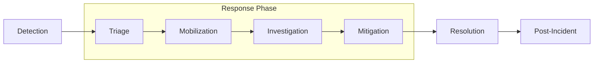
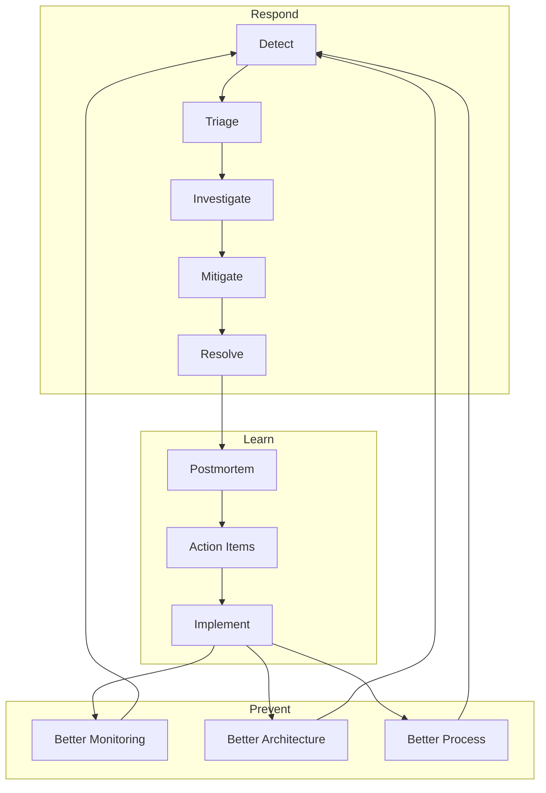
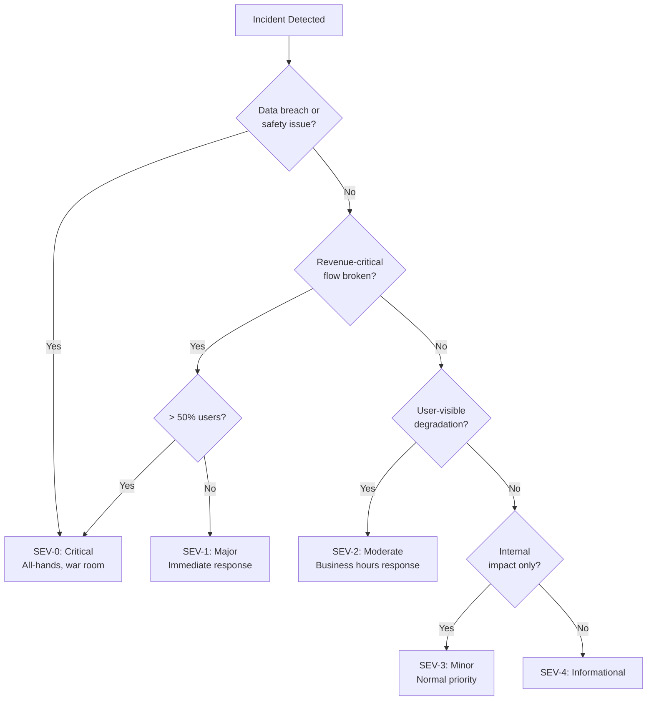
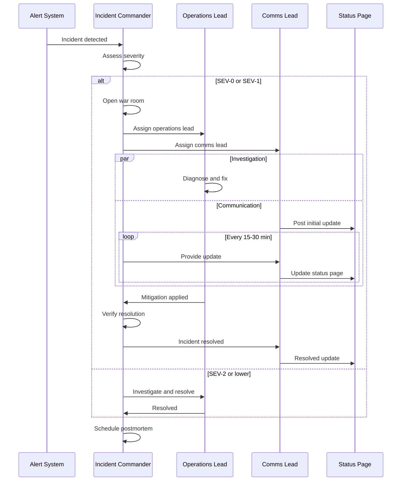

# Incident Response

## Why It Exists

Production incidents are inevitable. Every system, no matter how well-designed, will eventually fail in unexpected ways. The question is not whether you will have incidents, but how effectively you respond to them. Companies with mature incident response processes resolve incidents 3-5x faster, experience 60% less customer impact, and learn more from each failure than companies that treat incidents as chaotic, ad-hoc events.

Incident response is a discipline borrowed from emergency management (firefighting, disaster response, military operations) and adapted for software systems. The core insight is that under the stress of an active incident, people make poor decisions, communication breaks down, and actions are uncoordinated unless there is a well-practiced process to follow.

### The Incident Timeline

Every incident follows a predictable lifecycle:



| Phase | Key Activity | Success Metric |
|-------|-------------|---------------|
| **Detection** | Alert fires or customer reports | MTTD (Mean Time to Detect) |
| **Triage** | Classify severity, assess impact | Time to severity assignment |
| **Mobilization** | Assemble the right people | Time to first responder |
| **Investigation** | Diagnose root cause | Time to root cause identification |
| **Mitigation** | Stop the bleeding | MTTM (Mean Time to Mitigate) |
| **Resolution** | Fully resolve and verify | MTTR (Mean Time to Resolve) |
| **Post-Incident** | Learn and improve | Postmortem quality score |

### The Cost of Incidents

$$
\text{Incident Cost} = \text{Revenue Impact} + \text{Engineering Cost} + \text{Customer Cost} + \text{Reputation Cost}
$$

For a $100M ARR SaaS company:

| Component | P0 (1 hour) | P1 (4 hours) | P2 (8 hours) |
|-----------|------------|-------------|-------------|
| Revenue loss | $11,400/hr | $11,400/hr | $2,850/hr |
| Engineering (5 people) | $750/hr | $500/hr | $250/hr |
| Customer compensation | $5,000 | $2,000 | $500 |
| Reputation/churn | $50,000 | $10,000 | $2,000 |
| **Total** | **$67,150** | **$57,600** | **$25,400** |

Investing $200K/year in incident response maturity (tooling, training, practice) can save $500K-2M in incident costs.

## First Principles

### The Three Priorities of Incident Response

In order of importance:

1. **Protect people**: Safety of employees, users, and the public
2. **Preserve the system**: Minimize damage, prevent cascading failures
3. **Restore service**: Return to normal operation

This ordering matters. You never sacrifice safety for speed. You never make the system worse to appear to be doing something.

### Incident Response as a Feedback Loop



Each incident should make the system more resilient. If you're having the same type of incident repeatedly, the feedback loop is broken.

### The Incident Command System (ICS)

Adapted from emergency management, the Incident Command System defines clear roles during an incident:

| Role | Responsibility | Who |
|------|---------------|-----|
| **Incident Commander (IC)** | Coordinates response, makes decisions, controls communication | Senior engineer or SRE |
| **Operations Lead** | Executes technical investigation and remediation | Subject matter expert |
| **Communications Lead** | Internal updates, customer comms, status page | Product or ops person |
| **Scribe** | Documents timeline, actions, decisions | Anyone available |

The IC does NOT debug the issue. They coordinate people who debug the issue. This is the most common mistake: the most senior engineer becomes IC and then gets sucked into debugging, losing oversight of the overall response.

## Core Mechanics

### Incident Severity Classification



### Incident Response Workflow



## Implementation

### Incident Management System

```typescript
interface Incident {
  id: string;
  title: string;
  severity: 'SEV-0' | 'SEV-1' | 'SEV-2' | 'SEV-3' | 'SEV-4';
  status: 'detected' | 'investigating' | 'mitigating' | 'monitoring' | 'resolved';
  commander: string;
  operationsLead?: string;
  communicationsLead?: string;
  affectedServices: string[];
  detectedAt: Date;
  acknowledgedAt?: Date;
  mitigatedAt?: Date;
  resolvedAt?: Date;
  timeline: TimelineEntry[];
  customerImpact: string;
  internalImpact: string;
  postmortemUrl?: string;
}

interface TimelineEntry {
  timestamp: Date;
  author: string;
  type: 'detection' | 'action' | 'decision' | 'communication' | 'escalation' | 'resolution';
  content: string;
}

class IncidentManager {
  private incidents: Map<string, Incident> = new Map();

  createIncident(params: {
    title: string;
    severity: Incident['severity'];
    commander: string;
    affectedServices: string[];
    customerImpact: string;
  }): Incident {
    const id = `INC-${Date.now().toString(36).toUpperCase()}`;

    const incident: Incident = {
      id,
      title: params.title,
      severity: params.severity,
      status: 'detected',
      commander: params.commander,
      affectedServices: params.affectedServices,
      detectedAt: new Date(),
      timeline: [
        {
          timestamp: new Date(),
          author: 'system',
          type: 'detection',
          content: `Incident created: ${params.title}`,
        },
      ],
      customerImpact: params.customerImpact,
      internalImpact: '',
    };

    this.incidents.set(id, incident);

    // Auto-escalation based on severity
    if (params.severity === 'SEV-0' || params.severity === 'SEV-1') {
      this.openWarRoom(incident);
      this.notifyStakeholders(incident);
    }

    return incident;
  }

  addTimelineEntry(
    incidentId: string,
    entry: Omit<TimelineEntry, 'timestamp'>
  ): void {
    const incident = this.incidents.get(incidentId);
    if (!incident) throw new Error(`Incident ${incidentId} not found`);

    incident.timeline.push({
      ...entry,
      timestamp: new Date(),
    });
  }

  updateStatus(
    incidentId: string,
    status: Incident['status'],
    updatedBy: string
  ): void {
    const incident = this.incidents.get(incidentId);
    if (!incident) throw new Error(`Incident ${incidentId} not found`);

    incident.status = status;

    if (status === 'mitigating' && !incident.mitigatedAt) {
      incident.mitigatedAt = new Date();
    }
    if (status === 'resolved' && !incident.resolvedAt) {
      incident.resolvedAt = new Date();
    }

    this.addTimelineEntry(incidentId, {
      author: updatedBy,
      type: 'action',
      content: `Status changed to ${status}`,
    });
  }

  getMetrics(incidentId: string): {
    mttd: number;
    mtta: number;
    mttm: number;
    mttr: number;
  } {
    const incident = this.incidents.get(incidentId);
    if (!incident) throw new Error(`Incident ${incidentId} not found`);

    const detected = incident.detectedAt.getTime();
    const acknowledged = incident.acknowledgedAt?.getTime() ?? detected;
    const mitigated = incident.mitigatedAt?.getTime() ?? Date.now();
    const resolved = incident.resolvedAt?.getTime() ?? Date.now();

    return {
      mttd: 0, // Time from actual failure to detection - requires external signal
      mtta: (acknowledged - detected) / 60_000,
      mttm: (mitigated - detected) / 60_000,
      mttr: (resolved - detected) / 60_000,
    };
  }

  private openWarRoom(incident: Incident): void {
    console.log(`Opening war room for ${incident.id}: ${incident.title}`);
    // Create Slack channel, Zoom bridge, etc.
  }

  private notifyStakeholders(incident: Incident): void {
    console.log(`Notifying stakeholders for ${incident.severity} incident`);
    // Page on-call, notify management, update status page
  }
}
```

## Edge Cases and Failure Modes

::: warning Common Incident Response Failures
1. **Everyone debugs, nobody coordinates**: Without an IC, five engineers investigate independently, duplicate work, and conflict.
2. **Communication blackout**: Internal stakeholders and customers are left in the dark, escalating anxiety and pressure.
3. **Premature root cause declaration**: "It's the database!" - team spends 30 minutes on the database while the real cause is a config change.
4. **Hero culture**: One senior engineer fixes everything, creating a single point of failure and preventing others from learning.
5. **Blame culture**: Fear of blame prevents honest postmortems, which prevents systemic improvements.
:::

## Performance Characteristics

### Industry Benchmarks

| Metric | Top Quartile | Median | Bottom Quartile |
|--------|-------------|--------|----------------|
| MTTD | 2 min | 15 min | 60+ min |
| MTTA | 3 min | 10 min | 30+ min |
| MTTM | 15 min | 60 min | 4+ hours |
| MTTR | 30 min | 4 hours | 24+ hours |
| Postmortem completion | 100% for SEV-0/1 | 60% | < 20% |
| Action item completion | 90% | 50% | < 25% |

## Mathematical Foundations

### Incident Frequency Model

Incidents arrive as a Poisson process with rate $\lambda$:

$$
P(k \text{ incidents in time } t) = \frac{(\lambda t)^k e^{-\lambda t}}{k!}
$$

For a service with an average of 2 incidents per month:

$$
P(0 \text{ incidents in a month}) = e^{-2} \approx 13.5\%
$$

$$
P(\geq 5 \text{ incidents in a month}) = 1 - \sum_{k=0}^{4} \frac{2^k e^{-2}}{k!} \approx 5.3\%
$$

### MTTR Decomposition

$$
\text{MTTR} = \text{MTTD} + \text{MTTE} + \text{MTTF} + \text{MTTV}
$$

Where:
- MTTD = Mean Time to Detect
- MTTE = Mean Time to Engage (triage + mobilize)
- MTTF = Mean Time to Fix (investigate + mitigate)
- MTTV = Mean Time to Verify (confirm resolution)

Each component is an independent optimization target.

## Real-World War Stories

::: info War Story
**The Incident With No Incident Commander (2022)**

A SaaS company had a SEV-1 outage affecting 30% of users. Six engineers joined the war room simultaneously. Everyone started investigating their own theory. Three people ran queries against the production database simultaneously, causing additional load. Nobody was communicating with customers. After 45 minutes, someone noticed that two engineers had found the same root cause independently but hadn't shared it. The fix took 5 minutes once they coordinated.

Total incident duration: 55 minutes. Estimated duration with an IC: 20 minutes. The 35-minute difference cost $40,000 in revenue.

**Lesson**: Always designate an IC, even for "small" incidents. The IC's job is to prevent exactly this kind of uncoordinated chaos.
:::

## Decision Framework

### Incident Response Maturity Model

| Level | Characteristics | MTTR (P0) | Postmortem Rate |
|-------|----------------|-----------|----------------|
| **1 - Ad Hoc** | No process, heroic individuals | 4+ hours | < 10% |
| **2 - Defined** | Written process, basic roles | 2-4 hours | 50% |
| **3 - Practiced** | Regular drills, clear roles, runbooks | 1-2 hours | 80% |
| **4 - Measured** | SLOs, metrics dashboards, feedback loops | 30-60 min | 95% |
| **5 - Optimized** | Automated detection/mitigation, chaos engineering | < 30 min | 100% |

## Section Overview

This section covers the complete incident response lifecycle:

- [Incident Classification](./incident-classification.md) - SEV levels, impact matrices, and triage
- [Communication Templates](./communication-templates.md) - Internal updates, customer communications, status pages
- [Postmortem Framework](./postmortem-framework.md) - Blameless postmortems, five whys, and action items
- [War Room Procedures](./war-room-procedures.md) - IC, communications lead, roles, and status cadence
- [Chaos Engineering](./chaos-engineering.md) - Chaos Monkey, Litmus, GameDay, and maturity models

## Cross-References

- [Alerting Overview](../alerting/index.md) - Detection layer that triggers incident response
- [Severity Levels](../alerting/severity-levels.md) - Classification that feeds incident severity
- [Escalation Policies](../alerting/escalation-policies.md) - How alerts escalate to incidents
- [On-Call Best Practices](../alerting/on-call-best-practices.md) - The people who respond to incidents
- [Runbook Templates](../alerting/runbook-templates.md) - Procedures for common incident types
