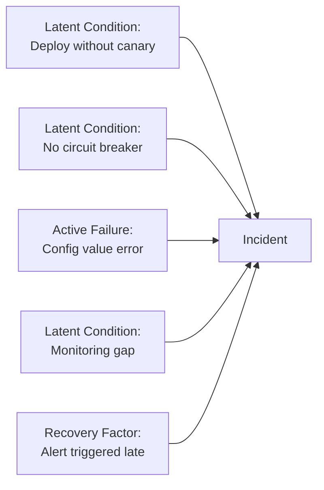
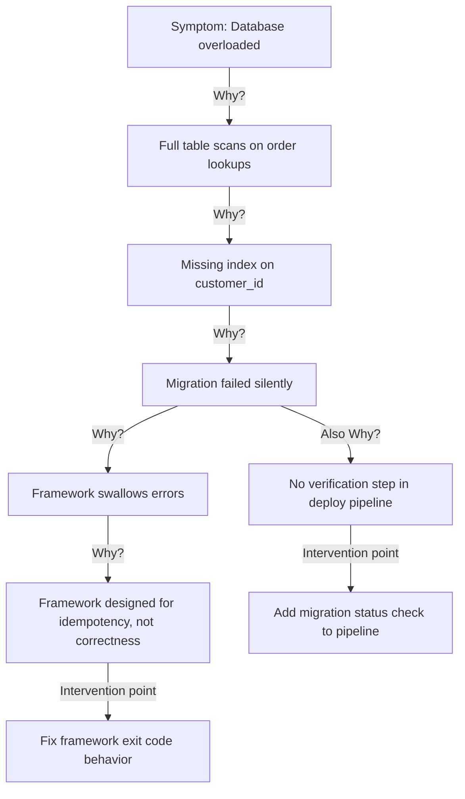

# Postmortem Framework: Blameless Culture, Five Whys, and Action Items

## Why Postmortems Exist

Every significant incident is a gift — a window into system weaknesses that passed all your other defenses. The question is whether you extract the maximum learning value from that gift or waste it by focusing on blame instead of root causes.

Postmortems exist to convert incidents into permanent improvements. Without them, the same classes of failures recur because the underlying conditions were never changed. With them, engineering organizations systematically build resilience over time.

### The Blameless Revolution

Traditional incident analysis focused on who made the mistake. This approach fails because:

1. **People act reasonably given their context**: No engineer intends to cause an outage. They make decisions based on incomplete information, time pressure, and the tools available to them.
2. **Blame suppresses reporting**: If incidents lead to punishment, engineers avoid reporting near-misses and minimize acknowledged mistakes. You lose the weak signal that would prevent the major failure.
3. **Individual blame doesn't fix systems**: Even if you fire the person who "caused" the incident, the system conditions that made the error possible remain. The next engineer will make the same mistake.

The blameless postmortem — pioneered by Google's SRE team and subsequently adopted by Netflix, Amazon, and most high-reliability organizations — focuses on **system factors** rather than individual blame. People are viewed as having behaved sensibly given their circumstances; the question is what circumstances can be changed.

::: warning
"Blameless" does not mean "consequence-free for all behavior." Gross negligence, dishonesty, or violating explicitly established procedures that cause harm may warrant individual accountability. Blameless means not punishing people for honest mistakes made in good faith.
:::

## First Principles

### The Swiss Cheese Model of Accidents

No major incident has a single cause. Incidents occur when multiple defenses (the "holes" in swiss cheese slices) align simultaneously, creating a path for failure to propagate:



Effective postmortems identify all the contributing factors — not just the proximate cause (the config value error) but the systemic conditions that allowed it to propagate (no canary, no circuit breaker, monitoring gap).

### Contributory vs. Root Causes

A **root cause** is a system state that, if changed, would have prevented the incident. There are usually multiple. A **contributory factor** made the incident worse or longer but wasn't necessary for it to occur.

The goal is not to find THE root cause (a harmful oversimplification) but to identify all significant root causes and the highest-leverage places to intervene.

## Postmortem Document Structure

### Standard Template

```markdown
# Postmortem: [Incident Title]

**Date**: YYYY-MM-DD
**Duration**: HH:MM (detection to resolution)
**Severity**: SEV-1 / SEV-2 / SEV-3
**Incident Commander**: [Name]
**Authors**: [Names]
**Review Date**: [Date of postmortem meeting]
**Status**: In Review | Reviewed | Action Items Assigned

---

## Impact Summary

**Users Affected**: ~N (estimated from metrics)
**Revenue Impact**: $X (if measurable)
**SLO Impact**: X.X% of monthly error budget consumed
**Services Affected**: [service-a, service-b, service-c]

---

## Timeline

All times UTC.

| Time | Event |
|------|-------|
| 14:23 | Deployment of v2.4.1 begins |
| 14:31 | Database CPU exceeds 95% threshold |
| 14:33 | Alert fires: "db-primary: high CPU" |
| 14:35 | On-call engineer acknowledges alert |
| ... | ... |
| 15:47 | Service fully restored |

---

## Root Cause Analysis

### Contributing Factors

1. **Primary**: Missing database index on `orders.customer_id` column — added in v2.4.0 migration but migration failed silently in production
2. **Secondary**: No query performance monitoring — no alerts on slow query count
3. **Tertiary**: Deployment proceeded without checking migration status

### Five Whys

**Why did the database become overloaded?**
→ A table scan was running on every order lookup (O(n) instead of O(log n))

**Why was a table scan running?**
→ The index on `orders.customer_id` was missing

**Why was the index missing?**
→ The migration that creates it failed silently

**Why did the migration fail silently?**
→ The migration framework exits 0 even when a migration fails if the failure is a duplicate key error (index already existed in staging but not production)

**Why was this not caught before production?**
→ Migration success verification was not part of the deployment checklist; staging had the index from a previous manual operation

---

## What Went Well

- On-call engineer was paged within 2 minutes of threshold breach
- Incident commander assumed coordination immediately
- War room assembled within 10 minutes
- Rollback decision was made quickly (within 20 minutes)

## What Went Poorly

- Migration failure was not detected during deployment
- No slow query alerting meant we only learned of the problem from user reports
- Root cause identification took 45 minutes due to unfamiliar migration framework behavior

---

## Action Items

| ID | Action | Owner | Priority | Due Date |
|----|--------|-------|---------|---------|
| AI-001 | Add migration verification step to deploy checklist | Platform team | P0 | 2026-04-01 |
| AI-002 | Add slow query count alert (>10 queries >1s per minute) | Observability team | P0 | 2026-03-25 |
| AI-003 | Fix migration framework to exit non-zero on failure | Platform team | P1 | 2026-04-15 |
| AI-004 | Add database index coverage check to staging smoke tests | QA team | P1 | 2026-04-15 |
| AI-005 | Document migration failure modes in runbook | On-call rotation | P2 | 2026-04-30 |
```

## Five Whys — Technique Deep Dive

### The Causal Chain Method

The Five Whys is a technique for tracing a causal chain from symptom to root cause. Each "why" answer becomes the subject of the next question:



Notice that the fifth "why" branches — there are often multiple independent intervention points. Fix ALL of them for defense in depth.

### Common Pitfalls in Five Whys

**Stopping too early**:
```
Why did the database fail? → High CPU
Why high CPU? → Missing index
Why missing index? → Migration failed
[Stop here] Action item: "Be more careful with migrations"
```

This misses the systemic factors. Continue:
```
Why did migration fail? → Framework silent failure
Why no detection? → No verification in pipeline
```

**Blame as an answer**:
```
Why did the deployment proceed? → Engineer didn't check migration status
[Stop here] Action item: "Train engineers to check migration status"
```

The Five Whys should never bottom out at "human error" — that's a symptom, not a root cause. Continue:
```
Why didn't engineer check? → Migration status check is not part of deploy process
Why is it not part of deploy process? → Process was never updated when migrations were added to deployments
```

**Single-path thinking**: Most incidents have multiple contributing root causes. Run Five Whys along different causal paths.

### Implementation in Practice

```typescript
interface WhyNode {
  question: string;
  answer: string;
  isRootCause: boolean;
  actionItems?: string[];
  childWhys?: WhyNode[];
}

interface FiveWhysAnalysis {
  initialSymptom: string;
  causalChain: WhyNode[];
  rootCauses: string[];
  actionItems: ActionItem[];
}

interface ActionItem {
  id: string;
  description: string;
  addresses: string; // Which root cause
  owner: string;
  priority: 'P0' | 'P1' | 'P2' | 'P3';
  dueDate: string;
  successCriteria: string;
}
```

## Timeline Reconstruction

### Collecting the Timeline

Accurate timeline reconstruction is critical for understanding:
- The sequence of events that led to the incident
- The detection gap (incident start to first alert)
- The diagnosis gap (alert to root cause identified)
- The mitigation gap (root cause identified to mitigation applied)

```mermaid
gantt
    title Incident Timeline Reconstruction
    dateFormat HH:mm
    axisFormat %H:%M

    section Incident
    Failure begins    :milestone, 14:23, 0d
    Service degraded  :14:23, 10m
    Full outage       :14:33, 74m
    Service restored  :milestone, 15:47, 0d

    section Detection
    Alert threshold   :14:31, 2m
    Alert fires       :14:33, 2m
    Engineer paged    :14:33, 2m

    section Response
    Acknowledgment    :14:35, 12m
    War room assembled:14:47, 60m
    Rollback decided  :14:53, 54m
    Rollback executed :14:55, 52m
```



**Data sources for timeline**:
1. Log aggregation (timestamps on log events)
2. Metrics systems (anomaly start time from graphs)
3. Alert manager history (when alerts fired)
4. PagerDuty/OpsGenie logs (when engineers were paged/acked)
5. Slack/Teams channel history (when war room started, key discussions)
6. Deployment system logs (when deployments occurred)
7. Status page history (when incidents were posted)

### Timeline Best Practices

- Use UTC timestamps throughout — local time causes confusion when team members span time zones
- Include BOTH discovery time AND actual start time (often different)
- Record the time when engineers knew key facts, not just when events happened
- Include "counter-events" — things that were tried and failed

## Postmortem Meeting Facilitation

### Meeting Structure (60 minutes)

```
00:00 - 05:00  Context setting
               - Facilitator reviews ground rules (blameless, system focus)
               - Brief summary for anyone not involved in incident

05:00 - 20:00  Timeline walkthrough
               - Authors walk through the timeline
               - Attendees add missing context
               - Focus on facts, not interpretations

20:00 - 40:00  Root cause analysis
               - Facilitator guides Five Whys discussion
               - Capture multiple causal paths
               - Identify all contributing factors

40:00 - 55:00  Action items
               - Generate candidate action items
               - Prioritize by impact and feasibility
               - Assign owners and due dates

55:00 - 60:00  Wrap-up
               - Confirm action item assignments
               - Set review date for completion
               - Decide if document is ready for final review
```

### Facilitation Techniques

**Redirect blame to systems**:
- Instead of: "Why did you deploy on Friday?"
- Ask: "What did our deployment policy say at the time?"

**Separate observation from interpretation**:
- Instead of: "The engineer made a poor decision"
- Ask: "What information was available to the engineer at that point?"

**Explore the decision context**:
- "What would you need to have known to make a different decision?"
- "What did the monitoring show at that point?"
- "Was there any indication that this might fail?"

## Action Item Quality

### The Anatomy of a Good Action Item

Bad action item: "Be more careful with database migrations"

This is not actionable — it doesn't specify what to do, who does it, or how to verify it.

Good action item:
```
ID: AI-002
Description: Add database migration verification step to deployment pipeline
             that checks all pending migrations have run successfully before
             marking deployment as complete
Owner: Platform team (Alice)
Priority: P0
Due: 2026-03-25
Success Criteria: Deploy pipeline fails (and rolls back) if any migration
                  exits with non-zero status. Verified by running failing
                  migration in staging and observing deploy failure.
Tracking: JIRA-4521
```

### Action Item Priority Framework

| Priority | SLA | Meaning |
|---------|-----|---------|
| P0 | 2 weeks | Prevents recurrence of exact incident, high severity |
| P1 | 4 weeks | Significantly reduces likelihood or impact |
| P2 | 8 weeks | Improves resilience, detection, or recovery |
| P3 | Quarter | Nice-to-have improvements |

### Action Item Failure Modes

Action items that don't get done are worse than not writing them — they create false assurance that the problem is "being handled."

Common failure modes:
1. **No owner**: "The team will..." → assign to specific person
2. **No due date**: Open-ended → set explicit date
3. **No success criteria**: How do you know it's done?
4. **Too vague**: "Improve monitoring" → what metric, what threshold?
5. **No tracking**: Not in issue tracker → falls off radar

## Performance Characteristics

### Incident Analysis Metrics

Track these metrics for your postmortem program:

| Metric | Target | Measurement |
|--------|--------|-------------|
| Time to postmortem | < 5 business days | Incident end → meeting held |
| Action item completion rate | > 80% by due date | P0/P1 items |
| Repeat incident rate | < 20% | Incidents with identical root causes |
| Mean Time Between Incidents | Trending up | For each service/team |
| Postmortem quality score | > 3.5/5 | Peer review rubric |

## Mathematical Foundations

### Error Budget Accounting in Postmortems

SLO error budgets provide a quantitative framework for incident severity and urgency of remediation:

$$\text{Error Budget} = (1 - \text{SLO target}) \times \text{Window duration}$$

For a 99.9% monthly SLO:
$$\text{Error Budget} = (1 - 0.999) \times 43{,}200\text{ min} = 43.2\text{ minutes/month}$$

An incident consuming 90 minutes represents:
$$\text{Budget consumed} = \frac{90}{43.2} = 208\% \text{ of monthly budget}$$

This frames action item urgency: consuming 2x the monthly budget in one incident makes P0 action items non-negotiable.

### Poisson Model for Incident Frequency

Incident frequency often follows a Poisson process. If you have $\lambda$ incidents per month on average, the probability of $k$ incidents in a month:

$$P(X = k) = \frac{\lambda^k e^{-\lambda}}{k!}$$

For $\lambda = 3$ incidents/month, probability of zero incidents:
$$P(X = 0) = \frac{3^0 e^{-3}}{0!} = e^{-3} \approx 0.050$$

Only 5% chance of a perfect month. Reliability improvement requires reducing $\lambda$ through systemic changes identified in postmortems.

## Real-World War Stories

::: info War Story: The Postmortem That Saved the Company

In 2012, GitHub experienced a major database failure that took the site offline for hours. Rather than minimizing the incident report, they published a detailed public postmortem explaining exactly what failed, why it failed, what they did to recover, and what they were changing to prevent it.

The reaction was the opposite of what feared: engineers wrote in calling the postmortem exemplary, trust in GitHub as a professional organization increased, and the detailed technical writing attracted senior engineering candidates. The blameless, transparent approach became part of GitHub's brand.

The postmortem documented that the root cause was not "human error" but a series of systemic factors: insufficient testing of failover procedures, lack of automated recovery, and monitoring that was insufficient to distinguish the failure mode quickly.
:::

::: info War Story: When Action Items Gather Dust

A company had a diligent postmortem practice but a poor follow-through culture. After a major CDN failure, the postmortem identified 12 action items. Six months later, only 2 were completed — both low-priority ones. When an almost identical CDN configuration issue caused another outage, the team ran the same postmortem and wrote almost the same action items.

The root cause of the follow-through failure: action items lived in the postmortem document (a Google Doc) that no one revisited, and they were never added to project management tools. There was no review meeting, no ownership escalation, and no retrospective on whether P0 items were completed.

The fix was operational: P0 action items automatically create JIRA tickets with the incident commander as DRI (directly responsible individual), weekly engineering meetings include a "postmortem action item" standing agenda item, and completion rates are tracked and reported to engineering leadership monthly.
:::

## Decision Framework

### When to Write a Full Postmortem

| Incident Type | Recommendation |
|--------------|----------------|
| SEV-1 (major outage, revenue impact) | Required |
| SEV-2 (significant degradation, many users affected) | Required |
| SEV-3 (minor degradation, few users affected) | Recommended |
| SEV-4 (no user impact, caught early) | Optional |
| Near-miss (caught before customer impact) | Highly recommended |
| Process failure (no system impact) | Optional |

**Near-misses are underrated**: A near-miss is a system in a state that would cause an incident with slight variation. They're cheaper to learn from than actual incidents.

### Postmortem vs. Learning Review vs. RCA

| Format | When | Depth | Audience |
|--------|------|-------|---------|
| Postmortem | Post-incident, blameless | Deep | Engineering team |
| Learning Review | Ongoing, broader themes | Moderate | Engineering org |
| Root Cause Analysis | Compliance-required | Deep, formal | Regulators, leadership |
| Incident Report | Customer-facing | Shallow | Customers, stakeholders |

## Advanced Topics

### Normalization of Deviance

Sociologist Diane Vaughan coined this term studying the Challenger disaster: over time, organizations accept gradually increasing levels of risk because warnings are repeatedly not followed by disaster. "We got away with it before."

Postmortems must actively watch for normalized deviance signals:
- "We've done this before and it was fine"
- "That's just how our system works"
- "We always run with that configuration"

If a contributing factor in a postmortem was a known risk that was accepted, the real action item is revisiting the risk acceptance decision — not just the immediate technical fix.

### Cognitive Biases in Postmortems

**Hindsight bias**: After knowing the outcome, engineers report they "should have known" the failure was coming. This is false — counterfactual reasoning is much easier than prospective reasoning. Facilitate postmortems to describe what was known at each point in time, not what we know now.

**Outcome bias**: A risky procedure that happened to work is rated as a good decision; the same procedure that caused an outage is rated as a bad decision. The quality of a decision should be judged by the information available when made, not by the outcome.

**Attribution error**: Individual behavior is attributed to character ("he's careless") rather than situation ("the deploy process has no safety checks"). Redirect attribution to system factors.

::: tip
Reading Sidney Dekker's "The Field Guide to Understanding 'Human Error'" is the single best investment for postmortem facilitators. It reframes error causation in ways that dramatically improve postmortem quality.
:::
