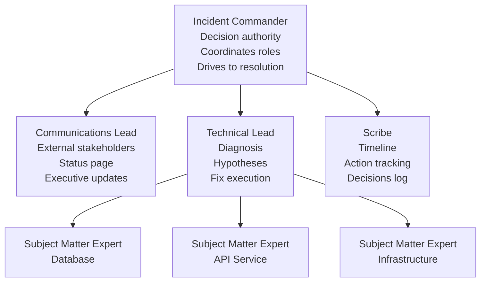

# War Room Procedures: IC Role, Comms Lead, and Status Cadence

## Why War Rooms Exist

When an incident exceeds the capacity of a single on-call engineer to diagnose and resolve, you need coordinated multi-person response. Without structure, this devolves into chaos: multiple engineers investigating the same thing, nobody updating stakeholders, engineers talking over each other, and no clear decision-making authority.

The war room (or incident bridge) provides structure. It assigns clear roles with defined responsibilities, creates a single source of truth for incident state, and ensures that management, communication, and technical investigation proceed in parallel rather than one blocking another.

The term "war room" comes from military command centers. The parallel is apt: high stakes, time pressure, incomplete information, multiple experts, and the need for rapid coordinated action.

### Incident Response vs. Normal Engineering

| Normal Engineering | Incident Response |
|-------------------|------------------|
| Consensus decisions | IC makes final calls |
| Deliberate, reviewed changes | Rapid changes with verbal approval |
| Asynchronous communication | Synchronous, real-time |
| Comprehensive documentation | Minimal, real-time scribe notes |
| Optimize for correctness | Optimize for speed of recovery |

## The Role Structure



## Incident Commander (IC) Role

### Responsibilities

The IC is the **decision authority** for the incident. They are not necessarily the most technical person in the room — they are the person responsible for coordinating the response effectively.

**Core IC responsibilities**:
1. **Declare and scope the incident**: What is the severity? What is affected? What is the impact?
2. **Assign roles**: Who is TL, comms lead, scribe?
3. **Drive diagnosis**: Ensure hypotheses are being generated and tested, not random poking
4. **Make decisions**: Rollback or fix forward? Call in more help? Take the service down for maintenance?
5. **Manage the room**: Keep conversations focused, cut off rabbit holes, summarize regularly
6. **Authorize risky changes**: No significant production change during an incident without IC approval
7. **Declare resolution**: Confirm the incident is over and specify the post-incident steps

### IC Script Templates

**Opening the war room**:
```
"Okay, we have a [SEV-X] incident. [Name] is Technical Lead,
[Name] is Communications Lead, [Name] is Scribe. Everyone else
is here in SME capacity.

Current situation: [1-2 sentence summary of what's broken and impact]

What we know: [known facts]
What we don't know: [key unknowns]

[TL name], what's your current read on the most likely cause?
What hypotheses are you testing?"
```

**Summarizing every 15 minutes**:
```
"Quick checkpoint — it's [time].

Status: [what's still broken / what's been mitigated]
Most likely cause: [current working theory]
Current action: [what's being investigated/executed right now]
Next decision point: [what determines what we do next]

[Comms lead]: when is the next external update due?"
```

**Authorizing a risky change**:
```
"Before we proceed — [name], confirm: you're proposing [specific action].
What's the expected outcome? What's the rollback plan if it makes things worse?
Anyone see a risk we haven't discussed?

[After responses] Okay, proceed. [Scribe]: log this as a change at [time]."
```

**Declaring resolution**:
```
"I'm calling the incident resolved at [time UTC].
The service is returning normal metrics.

Immediate follow-up: [monitoring period, any pending actions]
Postmortem: [name] will organize within [timeframe]

Thanks everyone. [Comms lead]: send the resolution update.
I'll post the final status page update."
```

### IC Decision Framework

When the IC needs to make a key decision (rollback vs. fix forward, escalation, bringing services down), use a structured approach:

```
1. State the options explicitly
   "We have two choices: rollback to v2.3 (15 minutes) or patch forward (unknown time)"

2. Gather input (30-60 seconds maximum)
   "TL: what does rollback risk? What's your confidence in the patch?"

3. State your decision and reasoning
   "We're rolling back. The patch path has too many unknowns and we've been down 45 minutes."

4. Log it
   "[Scribe]: at 15:22, IC decision to rollback to v2.3 due to high uncertainty in fix path"
```

### IC Anti-Patterns

**Becoming the TL**: ICs who start debugging lose situational awareness and coordination. If you're the most qualified person to debug AND to command, you may need to debug and ask someone else to command.

**Death by committee**: "Let's discuss whether we should rollback..." for 20 minutes. The IC makes decisions. Consult, then decide.

**Losing the thread**: 30 minutes of deep investigation without a status summary. The room loses context of what's been tried and what the current theory is.

**Invisible decisions**: A significant change is made without IC authorization and without logging. This creates timeline gaps in the postmortem and misses the opportunity to catch mistakes before execution.

## Communications Lead (Comms Lead) Role

### Responsibilities

The Comms Lead is the **voice of the incident to the outside world**. This shields the technical team from interruptions while keeping stakeholders informed.

**Core Comms Lead responsibilities**:
1. **Monitor communication channels**: Watch Slack, email, support tickets for stakeholder questions
2. **Draft and post status page updates**: Timely, accurate, and calibrated to what's known
3. **Send internal escalation notices**: Brief executives and customer success teams
4. **Gate inbound communication**: Forward important context to IC, block noise
5. **Track external commitments**: If IC says "we'll have an update in 20 minutes," Comms Lead ensures it happens
6. **Prepare customer communications**: Draft emails for affected customers

### Status Page Update Templates

**Initial acknowledgment** (post within 5 minutes of declaring SEV-1/2):
```
Investigating - [Service Name] Degraded Performance
[Time UTC]

We are aware of an issue affecting [brief description of impact].
Our team is investigating and we will provide an update within 30 minutes.
```

**Progress update** (every 30 minutes for SEV-1, every hour for SEV-2):
```
Identified - [Service Name] [Impact Type]
[Time UTC]

We have identified the root cause of the issue affecting [description].
Our team is working to implement a fix. We expect to have an update
within [timeframe].

Current impact: [brief description]
```

**Resolution**:
```
Resolved - [Service Name] Fully Operational
[Time UTC]

The issue affecting [service] has been resolved as of [time UTC].
All systems are operating normally.

We will post a detailed incident report within [5 business days].

We apologize for the impact this incident had on your workflows.
```

### Internal Escalation Template

For SEV-1 incidents, notify VP/CTO/CEO within 15 minutes:

```
Subject: [P1 INCIDENT] [Service] - [Impact Summary] - [Time UTC]

SEVERITY: P1 (Major)
STARTED: [Time UTC]
CURRENT STATUS: Investigating / Mitigating / Resolved

IMPACT:
- [User-facing impact]
- [Revenue/business impact if known]

ROOT CAUSE (if known): [Brief description]

WHAT WE'RE DOING: [Current action]

NEXT UPDATE: [Time]

IC: [Name] | Bridge: [Link] | Status Page: [Link]
```

## Technical Lead (TL) Role

### Responsibilities

The TL is responsible for technical diagnosis and fix execution. Unlike the IC, the TL goes deep.

**Core TL responsibilities**:
1. **Generate and prioritize hypotheses**: What are the most likely root causes?
2. **Assign investigation tasks**: Direct SMEs to test specific hypotheses
3. **Synthesize findings**: Track what's been ruled out and what's being tested
4. **Present options to IC**: When a fix is ready, present the plan, risks, and rollback procedure
5. **Execute approved changes**: With IC authorization and verbal confirmation

### Hypothesis-Driven Debugging

Random investigation during incidents wastes critical time. The TL should always be testing a specific hypothesis:

```
Current hypothesis: Database is slow because a query changed behavior
Test: Run EXPLAIN ANALYZE on the most recent slow queries
Expected finding: Full table scan where index scan was expected
Time to test: 3 minutes
```

**Hypothesis prioritization order**:
1. Recent changes (deployments, config changes, infra changes in last 24h)
2. External dependencies (third-party APIs, CDN, cloud provider)
3. Traffic anomalies (spike, unusual patterns)
4. Infrastructure (disk, memory, CPU, network)
5. Application bugs (less likely if nothing changed)

### Investigation Coordination

For complex incidents with multiple SMEs, the TL manages investigation lanes:

```
TL: "Okay, three parallel tracks:

[Alice]: investigate the database — check slow query log, EXPLAIN on
  order queries, compare query plans from yesterday vs now.
  Report back in 10 minutes.

[Bob]: look at the deployment at 14:23 — diff the config changes,
  check if any query hints or timeout settings changed.
  Report back in 10 minutes.

[Charlie]: check external dependencies — is the payment gateway
  responding normally? Any upstream issues from our CDN?
  Report back in 5 minutes.

I'll watch the metrics dashboard and synthesize."
```

## Scribe Role

### Responsibilities

The Scribe maintains the incident timeline in real-time. This is less glamorous than debugging but critically important: the timeline becomes the foundation for the postmortem.

**What to log**:
- Every significant event (alert fired, service started degrading, engineer joined)
- Every hypothesis proposed and result of testing it
- Every change made to production, with timestamp and who authorized
- Every IC decision with brief rationale
- Key facts discovered during investigation
- Times and who said things

**What not to log**:
- Every message in the channel (too much noise)
- Speculative comments that aren't turned into tested hypotheses
- Small talk and logistics

### Scribe Template (Live Incident Doc)

```markdown
# Incident [ID]: [Brief Title]
Live document — IC: [Name] | TL: [Name] | Scribe: [Name]

## Current Status (updated every 15 min)
Status: INVESTIGATING
Working theory: Database index missing on orders table
Last update: 15:03 UTC

## Definitive Facts
- 14:23: v2.4.1 deployed to production (Alice)
- 14:31: Database CPU exceeded 95% (metrics)
- 14:35: First alert acknowledged by Bob

## Ruled Out
- External CDN issues (checked at 14:48, all green)
- Traffic spike (traffic is normal at 14:50)

## Timeline
14:23 - Deployment v2.4.1 begins
14:31 - db-primary CPU: 95%+
14:33 - Alert "db-primary: high CPU" fires
14:35 - Bob acknowledges alert, joins bridge
...
15:03 - IC authorizes rollback to v2.3

## Changes Made to Production
| Time | Change | Who | IC Authorization |
|------|--------|-----|-----------------|
| 15:05 | Rollback to v2.3 | Bob | Alice (IC) |

## Open Questions
- Why did the index not exist in production? (Investigating: Bob)
- Was migration status visible before deploy? (investigate in postmortem)
```

## Bridge Etiquette

### Core Rules

1. **One voice at a time**: The IC controls the floor. Don't talk over others.
2. **State your name when speaking**: "This is Charlie — I checked the CDN, all green."
3. **Label observations vs. hypotheses**: "I see X" vs. "I think this might mean Y"
4. **Speak in specifics**: "Database CPU is at 97%" not "the database seems stressed"
5. **Report to the TL/IC**: Direct findings upward, not to the group
6. **Acknowledge time**: "I'll have results in 5 minutes" — then deliver on it
7. **Ask before acting**: "I want to try X — is that authorized?" Don't make production changes unilaterally
8. **No blame during incident**: Focus on finding and fixing, not assigning fault

### Managing Interruptions

**Executives joining the bridge**: Brief them in a sidebar, not on the main bridge. The IC or Comms Lead gives a 2-minute verbal summary and guides them to watch the status doc. Executive questions during active investigation are disruptive.

**SMEs who talk too much**: "Thanks [name], log that in the doc and let's hold discussion until we have more data."

**Parallel conversations**: "Let's take that offline — [name] and [name], discuss that and bring findings back."

**Handoff mid-incident**: If the incident crosses shift boundaries, the IC must explicitly hand off: "I'm handing IC to [new IC]. Current status is [summary]. Open actions are [list]. You have authority."

## Status Cadence

### Update Frequency by Severity

| Severity | External Status Page | Internal Escalation | Bridge Summary |
|---------|---------------------|--------------------|----|
| SEV-1 | Every 30 min | Every 30 min | Every 15 min |
| SEV-2 | Every 60 min | Every 60 min | Every 20 min |
| SEV-3 | Initial + resolved | Initial + resolved | Every 30 min |
| SEV-4 | None required | None required | As needed |

### Clock-Driven vs. Event-Driven Updates

**Clock-driven**: Post an update every 30 minutes regardless of new information. This maintains stakeholder trust even when there's no progress. "We continue investigating, no new findings, next update at [time]."

**Event-driven**: Post immediately when significant developments occur (root cause identified, mitigation achieved, severity changes).

Use both: maintain clock cadence as a baseline, add event-driven updates on top.

## Severity Classification

### Severity Levels

| Level | Definition | Example | Response SLA |
|-------|-----------|---------|-------------|
| SEV-1 | Complete service outage or data loss risk | API down for all users | Page immediately, war room <15 min |
| SEV-2 | Major feature unavailable or >20% users affected | Checkout failing | Page immediately, bridge <30 min |
| SEV-3 | Minor feature unavailable or <20% users affected | Search degraded | Page on-call, response <1 hour |
| SEV-4 | No user impact, monitoring anomaly | Error rate slightly elevated | Ticket, business hours |

### Severity Escalation/De-escalation

The IC can escalate or de-escalate severity based on new information. Escalation criteria:
- Impact is larger than initially understood
- Resolution will take longer than initially estimated
- New information suggests data loss or security impact
- SLO breach is certain

De-escalation criteria:
- Mitigation achieved (even if root cause unknown)
- Impact significantly smaller than classified
- Fix in progress and ETA is short

## Post-Incident Checklist

```typescript
interface PostIncidentChecklist {
  immediate: string[]; // Within 1 hour of resolution
  sameDay: string[];   // Within 24 hours
  thisWeek: string[];  // Within 5 business days
}

const POST_INCIDENT_CHECKLIST: PostIncidentChecklist = {
  immediate: [
    'Post resolution to status page',
    'Send resolution notification to affected customers (SEV-1/2)',
    'Notify executive stakeholders',
    'Set monitoring period (usually 30-60 min watching metrics)',
    'Archive bridge recording if applicable',
  ],
  sameDay: [
    'Export and save all chat logs from incident channel',
    'Complete rough timeline in incident document',
    'Identify postmortem facilitator and schedule meeting within 5 days',
    'Check if any temporary mitigations need to be tracked as tech debt',
    'Update runbook if gaps were found',
  ],
  thisWeek: [
    'Hold postmortem meeting',
    'Complete postmortem document',
    'Assign all action items to owners with due dates',
    'Add action items to project tracking system',
    'Update incident metrics/dashboard',
    'Determine if customer-facing incident report is needed',
  ],
};
```

## Performance Characteristics

### Response Time Benchmarks

High-performing incident response organizations target:

| Metric | Elite | High | Medium | Low |
|--------|-------|------|--------|-----|
| Time to detect (MTTD) | < 2 min | < 5 min | < 15 min | > 30 min |
| Time to acknowledge | < 2 min | < 5 min | < 15 min | > 30 min |
| Time to first status update | < 5 min | < 10 min | < 20 min | > 30 min |
| Time to resolve SEV-1 (MTTR) | < 30 min | < 60 min | < 120 min | > 4 hours |

Source: DORA State of DevOps Research 2023 benchmarks.

### Cognitive Load Management

The biggest failure mode in incident response is cognitive overload. Techniques to manage it:

1. **Role segregation**: Don't have the IC debug. Don't have the TL update stakeholders. Role clarity prevents task switching.
2. **Written status**: Keep a shared doc updated. Human working memory is limited under stress — external memory via docs is reliable.
3. **Time-boxing investigations**: "You have 10 minutes on that hypothesis. Report back regardless of findings."
4. **Explicit handoffs**: When someone leaves the bridge, explicit verbal handoff of any open tasks.

## Mathematical Foundations

### Amdahl's Law Applied to Incident Response

If the incident can be worked on by $N$ people, and fraction $P$ of the work is parallelizable:

$$\text{Speedup}(N) = \frac{1}{(1-P) + \frac{P}{N}}$$

For typical incident investigation: $P \approx 0.6$ (diagnosis is partially parallelizable, execution is not).

With $N = 5$ engineers:
$$\text{Speedup}(5) = \frac{1}{0.4 + \frac{0.6}{5}} = \frac{1}{0.52} \approx 1.9\times$$

More than 5-6 engineers provides diminishing returns. After 8+, coordination overhead dominates and the incident actually takes longer.

### Queuing Theory and Escalation

If incidents arrive at rate $\lambda$ and are resolved at rate $\mu$ by $c$ on-call engineers:

$$\rho = \frac{\lambda}{c\mu}$$

For stable queues (no backlog accumulation), $\rho < 1$ is required. If $\rho > 0.7$, on-call engineers spend 70%+ of their time on incidents, leaving no time for postmortems or preventive work — a death spiral.

## Real-World War Stories

::: info War Story: The IC Who Coded

A major cloud provider had an incident where the designated IC was their best distributed systems engineer. Twenty minutes into the incident, she couldn't resist — she started debugging directly, diving into traces and writing kubectl commands.

The result: nobody was updating stakeholders (executives started calling engineers directly), two other engineers were investigating the same component without knowing it (duplicate work), and a junior engineer's key finding went unheard because there was no TL to synthesize inputs.

The incident took 3 hours instead of the estimated 45 minutes. The IC's debugging contributed one insight; the coordination failures cost 2+ hours.

The lesson institutionalized: ICs are explicitly barred from executing technical changes. A separate "deputy IC" role was created for technical experts who need to both debug and coordinate in small teams.
:::

::: info War Story: The Status Update That Prevented a Board Meeting

A fintech company had a SEV-1 incident on the last day of the quarter. The VP of Sales was watching the trading system go down, with a major customer presentation in 2 hours. No status updates had been posted for 40 minutes.

She called the CTO directly. The CTO called the engineering director. Now the engineering director was on the incident bridge asking for updates, pulling the IC's attention away from driving resolution.

The fix: a dedicated Comms Lead role was implemented, with explicit responsibility for posting an update every 30 minutes even if it just said "investigation ongoing." The rule was: if the status page hasn't been updated in 30 minutes during a P1, the Comms Lead has failed at their job.

Six months later, the same VP was in a customer meeting during a P1 incident. She noticed the status page had three updates in the last hour, forwarded it to the customer, and the meeting continued with minimal disruption.
:::

## Decision Framework

### When to Declare a War Room

| Condition | Action |
|-----------|--------|
| SEV-1 or SEV-2 incident | Immediately declare war room |
| Single engineer overwhelmed | Ask for help, declare war room |
| Investigation lasting > 20 min | Consider war room |
| Multiple services affected | Declare war room |
| Revenue/customer impact | Declare war room |
| Data loss risk | Declare war room immediately |

### When to Stand Down / De-escalate

| Condition | Action |
|-----------|--------|
| Root cause identified and fix deployed | Monitor 15-30 min, then declare resolved |
| Mitigation in place, fix ongoing | De-escalate to lower severity, maintain tracking |
| External issue (cloud provider incident) | Reduce bridge, maintain monitoring, update customers |
| No user impact detected | De-escalate to SEV-3, track as monitoring-only |

## Advanced Topics

### Gameday Integration

War room procedures should be tested before incidents happen. Gamedays (scheduled practice incidents) let teams identify procedure gaps in a low-pressure environment. See the chaos engineering page for gameday design.

### Remote-First War Rooms

With distributed teams:
- Video on mandatory for active participants (voice-only loses context)
- Dedicated incident Slack channel, not general engineering channel
- Screen sharing for key dashboards, always visible
- Explicit "I'm muted" convention to prevent accidental interruptions
- Time zone awareness in all time references (always UTC + local for majority TZ)

### Handoff Protocols

For incidents spanning multiple shifts (overnight, weekend):

```
INCIDENT HANDOFF BRIEF [Time UTC]
From: [Outgoing IC Name]
To: [Incoming IC Name]

STATUS: [One sentence]

WHAT WE KNOW:
- [Fact 1]
- [Fact 2]

WHAT WE DON'T KNOW:
- [Unknown 1]
- [Unknown 2]

OPEN ACTIONS:
- [Name] investigating [X], expected back by [time]
- [Name] monitoring [Y]

CURRENT THEORY: [Most likely root cause]

NEXT DECISION POINT: [What event triggers the next decision]

AUTHORITY: You have full IC authority as of [time UTC].
Do you have any questions before I hand off?
```

The incoming IC verbally confirms receipt: "Confirmed, I have authority as of [time]. I understand the situation as [brief restatement]."

::: tip
The handoff brief should be read into the bridge verbally AND posted in the incident document. Verbal alone is lost; written alone may not be acknowledged.
:::
