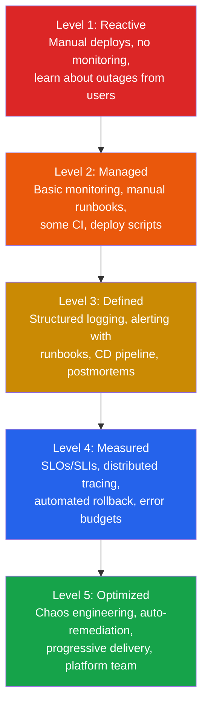

# DevOps

DevOps is not a job title. It is a set of practices that determine whether your software is a joy to operate or a nightmare that wakes people up at 3 AM. The difference between a team that ships confidently ten times a day and a team that dreads every release comes down to the operational foundations covered in this section.

The hard truth: most teams are stuck at maturity level 1 or 2. They have basic monitoring but no structured alerts. They have logs but can't correlate them across services. They deploy manually or with fragile scripts and cross their fingers. Incidents get resolved through heroics, not process. This section gives you the playbook to systematically level up.

## DevOps Maturity Model

Use this model to assess where your team is and where to focus next. Each level builds on the previous one — skip a level and you build on sand.

| Level | Key Indicator | What to Implement Next |
|---|---|---|
| **Level 1: Reactive** | You learn about outages from users | Basic uptime monitoring, central log aggregation |
| **Level 2: Managed** | You know when things break but respond ad-hoc | Structured logging, alert routing, CI pipeline |
| **Level 3: Defined** | You have process but limited visibility into why things break | Distributed tracing, SLOs, CD pipeline, blameless postmortems |
| **Level 4: Measured** | You make data-driven decisions about reliability | Chaos experiments, progressive delivery, auto-rollback |
| **Level 5: Optimized** | Reliability is a competitive advantage | Platform engineering, self-service infrastructure, auto-remediation |

Most teams should aim to reach Level 3 within their first year and Level 4 within two years. Level 5 is for organizations where engineering velocity and reliability are core business differentiators.

## Section Map

| Subsection | What You'll Learn | Maturity Level Impact |
|---|---|---|
| [Monitoring](/devops/monitoring) | Prometheus setup, PromQL queries, Grafana dashboards (with importable JSON), the USE and RED methods, custom metrics | Level 1 to Level 2 |
| [Logging](/devops/logging) | Structured logging with correlation IDs, ELK/Loki stack, log levels that mean something, log-based alerting | Level 2 to Level 3 |
| [Alerting](/devops/alerting) | Alert design philosophy, routing with PagerDuty/OpsGenie, SLOs and error budgets, alert fatigue prevention | Level 2 to Level 4 |
| [Deployment Strategies](/devops/deployment-strategies) | Rolling updates, blue-green, canary, feature flags, progressive delivery, automated rollback triggers | Level 2 to Level 4 |
| [Incident Response](/devops/incident-response) | Incident commander framework, communication templates, blameless postmortem process, runbook structure, on-call practices | Level 2 to Level 3 |

## The Three Pillars of Observability

Everything in this section connects back to the three pillars:

- **Metrics** tell you *what* is happening. Request rate is spiking. Error rate is climbing. Latency is increasing. Metrics are cheap to store and fast to query, making them the first line of defense.
- **Logs** tell you *why* it is happening. The database connection pool is exhausted. A downstream API is returning 503s. A deploy introduced a nil pointer dereference. Logs are expensive but indispensable for diagnosis.
- **Traces** tell you *where* it is happening. In a distributed system, a single user request might touch fifteen services. Traces let you follow that request end to end and identify exactly which service is the bottleneck.

Metrics tell you there is a fire. Logs tell you what is burning. Traces tell you where the fire started. You need all three.

## How to Use This Section

Start by honestly assessing your team against the maturity model above. Then read the subsections that correspond to your next level. Each page includes real configuration files, actual Prometheus queries, importable Grafana dashboard JSON, and runbook templates you can adopt directly. This is not theory — it is the operational playbook.
