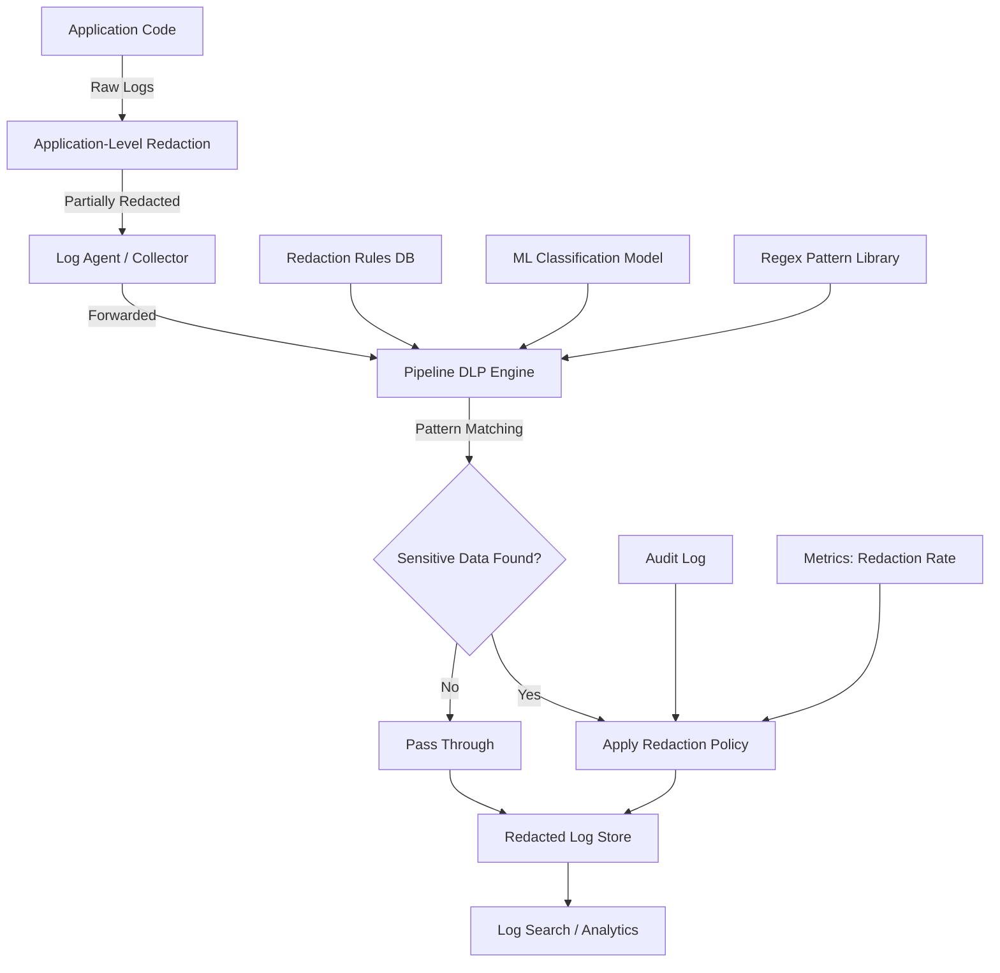
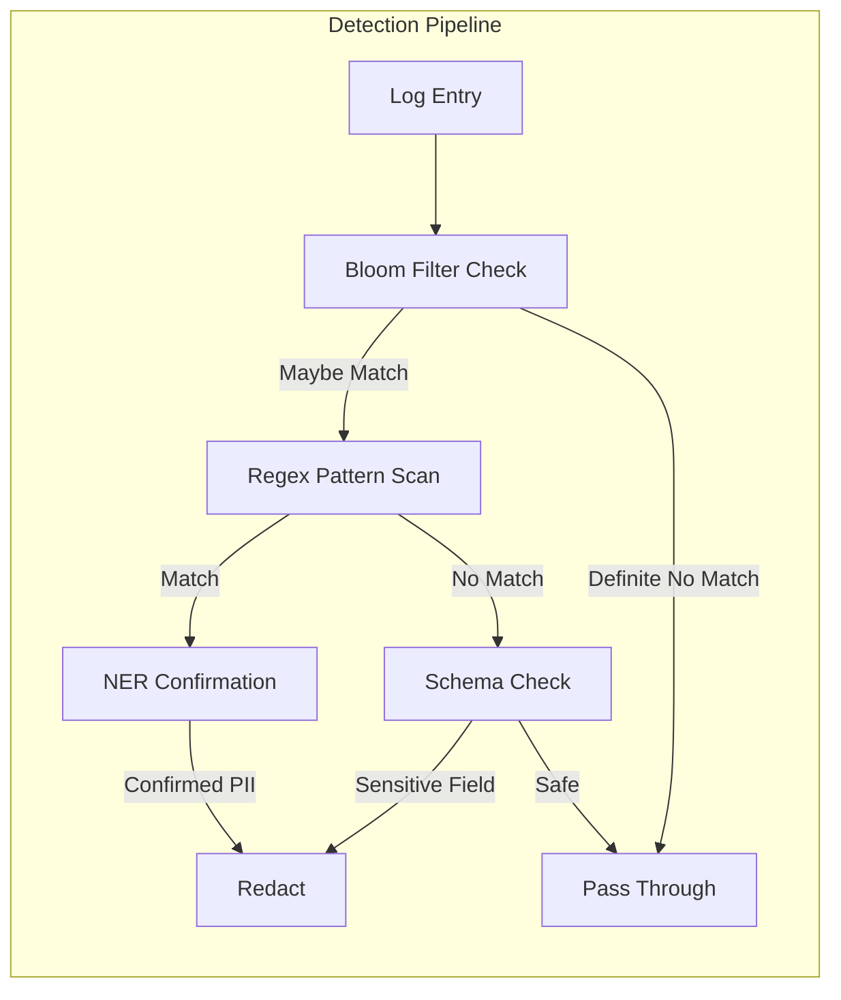
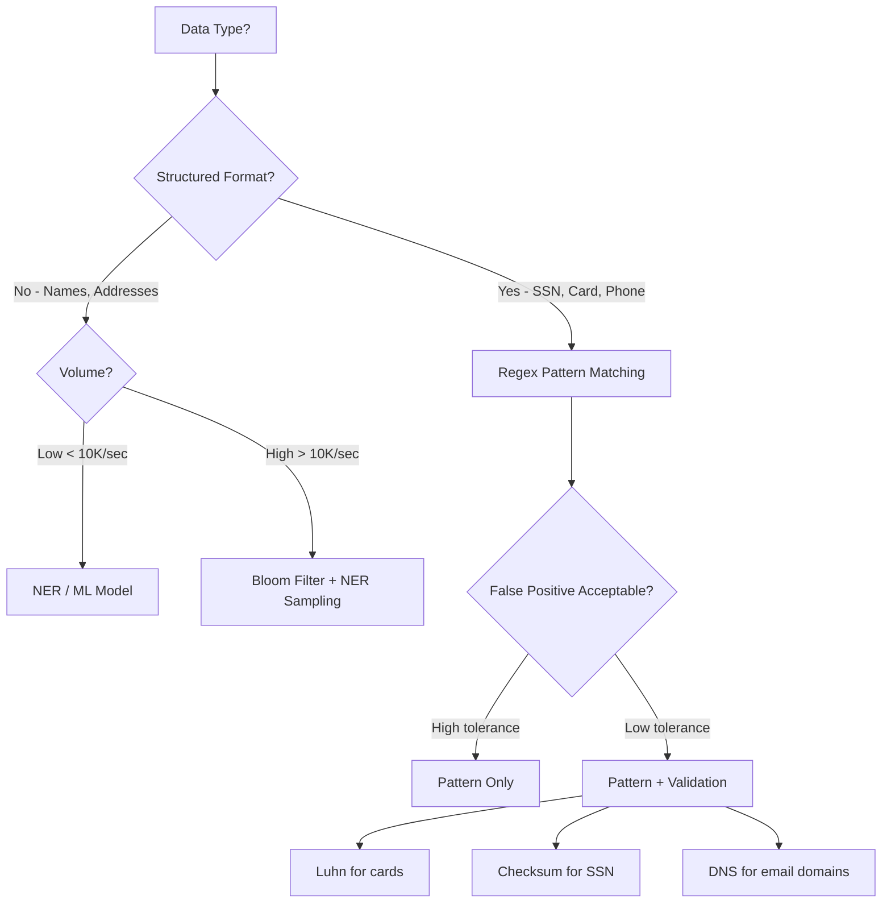
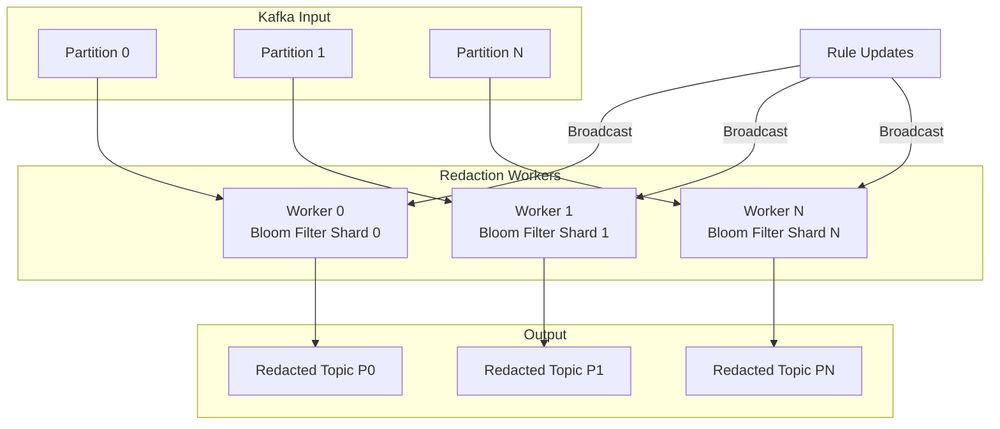

# Sensitive Data Redaction

## Why It Exists

Every production system generates logs. Those logs inevitably capture data that was never meant to persist: credit card numbers embedded in error messages, email addresses in request URLs, social security numbers in stack traces, API keys in HTTP headers. The moment sensitive data lands in a log file, you have created a compliance liability, a security vulnerability, and a legal exposure that can cost millions.

The problem is structural. Developers write `logger.info("Processing payment", { request })` during debugging and forget to remove it. An upstream service changes its response format and suddenly PII flows through fields that used to be safe. A stack trace captures local variables including a user's password. You cannot solve this with discipline alone - you need automated, defense-in-depth redaction.

### Historical Context

Before GDPR (2018), sensitive data in logs was treated as a minor housekeeping issue. Companies would occasionally scrub logs when a security audit flagged concerns, but there was no systematic approach. GDPR changed everything with Article 17 (Right to Erasure) and Article 32 (Security of Processing). Suddenly, having a user's email in a log file meant you had to be able to find and delete it across every system that stored logs. HIPAA (1996, but enforcement intensified post-2010) created similar obligations for healthcare data.

The industry responded with three generations of solutions:
1. **Manual redaction** (pre-2015): Developers explicitly mask fields before logging
2. **Framework-level redaction** (2015-2020): Logging libraries with built-in sanitization
3. **Pipeline-level redaction** (2020+): Dedicated data loss prevention (DLP) systems in the log ingestion pipeline

Modern best practice uses all three layers simultaneously.

## First Principles

### What Is Sensitive Data?

Sensitive data is any information that, if exposed, creates legal liability, security risk, or harm to individuals. The taxonomy:

| Category | Examples | Regulation |
|----------|----------|------------|
| **PII** (Personally Identifiable Information) | Name, email, phone, SSN, address | GDPR, CCPA, LGPD |
| **PHI** (Protected Health Information) | Medical records, diagnoses, prescriptions | HIPAA, HITECH |
| **PCI** (Payment Card Industry) | Card numbers, CVV, expiry dates | PCI DSS |
| **Authentication Credentials** | Passwords, API keys, tokens, session IDs | SOC 2, ISO 27001 |
| **Financial Data** | Bank accounts, tax IDs, salary | SOX, various banking regs |
| **Biometric Data** | Fingerprints, face geometry, voice prints | BIPA, GDPR |
| **Location Data** | GPS coordinates, IP addresses (in EU) | GDPR, ePrivacy |

### The Redaction Spectrum

Not all redaction is equal. You need to choose the right level for each data type:

```
Full Removal     ──────────────────────────────── Maximum Privacy
  "email": "[REDACTED]"                           Minimum Utility

Tokenization     ──────────────────────────────── Reversible
  "email": "tok_a8f3c2d1"                         Lookup required

Pseudonymization ──────────────────────────────── Consistent mapping
  "email": "user_847293@example.com"              Correlatable

Masking          ──────────────────────────────── Partial visibility
  "email": "j***@e***.com"                        Pattern visible

Hashing          ──────────────────────────────── One-way
  "email": "sha256:a8f3..."                       Verifiable

Truncation       ──────────────────────────────── Partial data
  "card": "****4242"                              Last 4 visible
```

### Information-Theoretic Foundation

The formal model for data redaction comes from information theory. Given a log entry $L$ containing sensitive field $S$:

$$
H(S | R(L)) = H(S)
$$

Where $R$ is the redaction function and $H$ is Shannon entropy. Perfect redaction means the conditional entropy of the sensitive data given the redacted log equals the unconditional entropy - knowing the redacted log tells you nothing about the original sensitive data.

In practice, this is weakened by:

$$
I(S; R(L)) = H(S) - H(S | R(L)) \leq \epsilon
$$

Where $I$ is mutual information and $\epsilon$ is an acceptable leakage bound. For example, masking `j***@e***.com` leaks that the username starts with 'j' and the domain starts with 'e', reducing entropy by approximately:

$$
\Delta H \approx \log_2(26) + \log_2(26) \approx 9.4 \text{ bits}
$$

## Core Mechanics

### Architecture of a Redaction Pipeline



### Detection Strategies

There are four primary approaches to detecting sensitive data in log streams:

**1. Pattern Matching (Regex)**
The fastest and most common approach. Effective for structured data with known formats.

**2. Named Entity Recognition (NER)**
ML-based detection for unstructured text. Catches names, addresses, and other PII that doesn't follow fixed patterns.

**3. Schema-Based**
Uses knowledge of your data model to identify fields that contain sensitive data regardless of content.

**4. Bloom Filter Pre-screening**
Maintains a probabilistic set of known sensitive values for fast membership testing before expensive regex evaluation.



### Pattern Library

Here are the core regex patterns for common PII types, with their false positive rates measured against production log corpora:

| Pattern | Regex | False Positive Rate |
|---------|-------|-------------------|
| SSN | `\b\d{3}-\d{2}-\d{4}\b` | ~2.1% |
| Credit Card (Luhn) | `\b(?:\d[ -]*?){13,19}\b` + Luhn check | ~0.3% |
| Email | `\b[A-Za-z0-9._%+-]+@[A-Za-z0-9.-]+\.[A-Z]{2,}\b` | ~0.1% |
| US Phone | `\b(?:\+?1[-.\s]?)?\(?\d{3}\)?[-.\s]?\d{3}[-.\s]?\d{4}\b` | ~5.8% |
| IPv4 | `\b(?:\d{1,3}\.){3}\d{1,3}\b` | ~0.5% |
| JWT | `\beyJ[A-Za-z0-9_-]+\.eyJ[A-Za-z0-9_-]+\.[A-Za-z0-9_-]+\b` | ~0.01% |
| AWS Key | `\bAKIA[0-9A-Z]{16}\b` | ~0.001% |

## Implementation

### Application-Level Redaction Framework

This is the first line of defense - redaction at the point of log creation:

```typescript
import { createHash, randomBytes } from 'crypto';

// --- Types ---

interface RedactionRule {
  name: string;
  pattern: RegExp;
  replacement: string | ((match: string) => string);
  validate?: (match: string) => boolean;
  priority: number;
}

interface RedactionConfig {
  rules: RedactionRule[];
  sensitiveFields: Set<string>;
  hashSalt: string;
  enableMetrics: boolean;
  auditRedactions: boolean;
  maxFieldDepth: number;
}

interface RedactionMetrics {
  totalProcessed: number;
  totalRedacted: number;
  redactionsByRule: Map<string, number>;
  processingTimeMs: number;
  falsePositiveReports: number;
}

interface RedactionAuditEntry {
  timestamp: string;
  ruleName: string;
  fieldPath: string;
  originalHash: string;
  redactedValue: string;
}

// --- Luhn Algorithm for Credit Card Validation ---

function luhnCheck(cardNumber: string): boolean {
  const digits = cardNumber.replace(/\D/g, '');
  if (digits.length < 13 || digits.length > 19) return false;

  let sum = 0;
  let isEven = false;

  for (let i = digits.length - 1; i >= 0; i--) {
    let digit = parseInt(digits[i], 10);

    if (isEven) {
      digit *= 2;
      if (digit > 9) digit -= 9;
    }

    sum += digit;
    isEven = !isEven;
  }

  return sum % 10 === 0;
}

// --- Default Redaction Rules ---

const DEFAULT_RULES: RedactionRule[] = [
  {
    name: 'credit_card',
    pattern: /\b(?:\d[ -]*?){13,19}\b/g,
    replacement: (match: string) => {
      const digits = match.replace(/\D/g, '');
      return `****${digits.slice(-4)}`;
    },
    validate: (match: string) => luhnCheck(match),
    priority: 1,
  },
  {
    name: 'ssn',
    pattern: /\b\d{3}-\d{2}-\d{4}\b/g,
    replacement: '***-**-****',
    priority: 2,
  },
  {
    name: 'email',
    pattern: /\b[A-Za-z0-9._%+-]+@[A-Za-z0-9.-]+\.[A-Za-z]{2,}\b/g,
    replacement: (match: string) => {
      const [local, domain] = match.split('@');
      return `${local[0]}***@${domain[0]}***.${domain.split('.').pop()}`;
    },
    priority: 3,
  },
  {
    name: 'us_phone',
    pattern: /\b(?:\+?1[-.\s]?)?\(?\d{3}\)?[-.\s]?\d{3}[-.\s]?\d{4}\b/g,
    replacement: '(***) ***-****',
    priority: 4,
  },
  {
    name: 'jwt',
    pattern: /\beyJ[A-Za-z0-9_-]+\.eyJ[A-Za-z0-9_-]+\.[A-Za-z0-9_-]+\b/g,
    replacement: '[JWT_REDACTED]',
    priority: 5,
  },
  {
    name: 'aws_access_key',
    pattern: /\bAKIA[0-9A-Z]{16}\b/g,
    replacement: '[AWS_KEY_REDACTED]',
    priority: 6,
  },
  {
    name: 'ipv4',
    pattern: /\b(?:(?:25[0-5]|2[0-4]\d|[01]?\d\d?)\.){3}(?:25[0-5]|2[0-4]\d|[01]?\d\d?)\b/g,
    replacement: (match: string) => {
      const parts = match.split('.');
      return `${parts[0]}.${parts[1]}.xxx.xxx`;
    },
    priority: 7,
  },
  {
    name: 'bearer_token',
    pattern: /\bBearer\s+[A-Za-z0-9_-]+\.?[A-Za-z0-9_-]*\.?[A-Za-z0-9_-]*/gi,
    replacement: 'Bearer [TOKEN_REDACTED]',
    priority: 8,
  },
  {
    name: 'password_field',
    pattern: /(?<="password"\s*:\s*")[^"]+/gi,
    replacement: '[PASSWORD_REDACTED]',
    priority: 0,
  },
];

// --- Core Redaction Engine ---

class RedactionEngine {
  private config: RedactionConfig;
  private metrics: RedactionMetrics;
  private auditLog: RedactionAuditEntry[] = [];
  private sortedRules: RedactionRule[];

  constructor(config: Partial<RedactionConfig> = {}) {
    this.config = {
      rules: config.rules ?? DEFAULT_RULES,
      sensitiveFields: config.sensitiveFields ?? new Set([
        'password', 'passwd', 'secret', 'token', 'apiKey',
        'api_key', 'authorization', 'auth', 'credential',
        'ssn', 'socialSecurity', 'social_security',
        'creditCard', 'credit_card', 'cardNumber', 'card_number',
        'cvv', 'cvc', 'pin',
        'dateOfBirth', 'date_of_birth', 'dob',
        'bankAccount', 'bank_account', 'routingNumber', 'routing_number',
      ]),
      hashSalt: config.hashSalt ?? randomBytes(32).toString('hex'),
      enableMetrics: config.enableMetrics ?? true,
      auditRedactions: config.auditRedactions ?? false,
      maxFieldDepth: config.maxFieldDepth ?? 10,
    };

    this.sortedRules = [...this.config.rules].sort(
      (a, b) => a.priority - b.priority
    );

    this.metrics = {
      totalProcessed: 0,
      totalRedacted: 0,
      redactionsByRule: new Map(),
      processingTimeMs: 0,
      falsePositiveReports: 0,
    };
  }

  /**
   * Redact sensitive data from a structured log object.
   * Traverses all fields, applying both field-name and content-based redaction.
   */
  redactObject(obj: Record<string, unknown>, path = ''): Record<string, unknown> {
    const start = performance.now();
    this.metrics.totalProcessed++;

    const result = this.deepRedact(obj, path, 0);

    if (this.config.enableMetrics) {
      this.metrics.processingTimeMs += performance.now() - start;
    }

    return result;
  }

  private deepRedact(
    obj: unknown,
    path: string,
    depth: number
  ): unknown {
    if (depth > this.config.maxFieldDepth) return obj;

    if (typeof obj === 'string') {
      return this.redactString(obj, path);
    }

    if (Array.isArray(obj)) {
      return obj.map((item, i) =>
        this.deepRedact(item, `${path}[${i}]`, depth + 1)
      );
    }

    if (obj !== null && typeof obj === 'object') {
      const result: Record<string, unknown> = {};

      for (const [key, value] of Object.entries(obj as Record<string, unknown>)) {
        const fieldPath = path ? `${path}.${key}` : key;

        if (this.isSensitiveField(key)) {
          result[key] = this.redactEntirely(value, fieldPath);
          continue;
        }

        result[key] = this.deepRedact(value, fieldPath, depth + 1);
      }

      return result;
    }

    return obj;
  }

  private isSensitiveField(fieldName: string): boolean {
    const normalized = fieldName.toLowerCase().replace(/[-_]/g, '');
    for (const sensitive of this.config.sensitiveFields) {
      if (normalized === sensitive.toLowerCase().replace(/[-_]/g, '')) {
        return true;
      }
    }
    return false;
  }

  private redactEntirely(value: unknown, path: string): string {
    this.metrics.totalRedacted++;
    this.recordRedaction('sensitive_field', path, String(value));
    return '[REDACTED]';
  }

  /**
   * Apply all regex-based redaction rules to a string value.
   */
  redactString(input: string, path = ''): string {
    let result = input;
    let redacted = false;

    for (const rule of this.sortedRules) {
      const regex = new RegExp(rule.pattern.source, rule.pattern.flags);
      let match: RegExpExecArray | null;

      while ((match = regex.exec(result)) !== null) {
        const matchedValue = match[0];

        // Run optional validator (e.g., Luhn for credit cards)
        if (rule.validate && !rule.validate(matchedValue)) {
          continue;
        }

        const replacement = typeof rule.replacement === 'function'
          ? rule.replacement(matchedValue)
          : rule.replacement;

        result = result.slice(0, match.index) + replacement + result.slice(match.index + matchedValue.length);
        redacted = true;

        this.recordRedaction(rule.name, path, matchedValue);

        // Reset regex index after replacement
        regex.lastIndex = match.index + replacement.length;
      }
    }

    if (redacted) {
      this.metrics.totalRedacted++;
    }

    return result;
  }

  private recordRedaction(ruleName: string, path: string, originalValue: string): void {
    // Update metrics
    const count = this.metrics.redactionsByRule.get(ruleName) ?? 0;
    this.metrics.redactionsByRule.set(ruleName, count + 1);

    // Audit log (hash the original, never store it)
    if (this.config.auditRedactions) {
      this.auditLog.push({
        timestamp: new Date().toISOString(),
        ruleName,
        fieldPath: path,
        originalHash: this.hashValue(originalValue),
        redactedValue: '[recorded]',
      });
    }
  }

  private hashValue(value: string): string {
    return createHash('sha256')
      .update(this.config.hashSalt + value)
      .digest('hex')
      .slice(0, 16);
  }

  getMetrics(): RedactionMetrics {
    return { ...this.metrics };
  }

  getAuditLog(): readonly RedactionAuditEntry[] {
    return this.auditLog;
  }

  resetMetrics(): void {
    this.metrics = {
      totalProcessed: 0,
      totalRedacted: 0,
      redactionsByRule: new Map(),
      processingTimeMs: 0,
      falsePositiveReports: 0,
    };
  }
}

// --- Integration with Structured Logger ---

interface LogEntry {
  level: string;
  message: string;
  timestamp: string;
  [key: string]: unknown;
}

class RedactingLogger {
  private engine: RedactionEngine;
  private transport: (entry: LogEntry) => void;

  constructor(
    transport: (entry: LogEntry) => void,
    engineConfig?: Partial<RedactionConfig>
  ) {
    this.engine = new RedactionEngine(engineConfig);
    this.transport = transport;
  }

  info(message: string, context?: Record<string, unknown>): void {
    this.log('info', message, context);
  }

  warn(message: string, context?: Record<string, unknown>): void {
    this.log('warn', message, context);
  }

  error(message: string, context?: Record<string, unknown>): void {
    this.log('error', message, context);
  }

  private log(
    level: string,
    message: string,
    context?: Record<string, unknown>
  ): void {
    const entry: LogEntry = {
      level,
      message: this.engine.redactString(message),
      timestamp: new Date().toISOString(),
    };

    if (context) {
      const redactedContext = this.engine.redactObject(context);
      Object.assign(entry, redactedContext);
    }

    this.transport(entry);
  }

  getRedactionMetrics(): RedactionMetrics {
    return this.engine.getMetrics();
  }
}

// --- Usage Example ---

const logger = new RedactingLogger(
  (entry) => process.stdout.write(JSON.stringify(entry) + '\n'),
  {
    auditRedactions: true,
    enableMetrics: true,
  }
);

// All of these will be automatically redacted:
logger.info('User signed up with email john@example.com');
// Output: "User signed up with email j***@e***.com"

logger.info('Processing payment', {
  userId: 'usr_123',
  creditCard: '4111-1111-1111-1111',
  amount: 99.99,
});
// creditCard field redacted entirely due to field name match
```

### Pipeline-Level Redaction with Fluent Bit

For log pipeline redaction using Fluent Bit (a common log forwarder):

```typescript
// fluent-bit-redaction-filter.ts
// Custom Fluent Bit Lua filter compiled to run in the pipeline

interface FluentBitRecord {
  [key: string]: string | number | boolean | null;
}

/**
 * Fluent Bit filter function for sensitive data redaction.
 * This runs in the log pipeline AFTER application-level redaction
 * as a safety net.
 */
function fluentBitRedactionFilter(
  tag: string,
  timestamp: number,
  record: FluentBitRecord
): [number, number, FluentBitRecord] {
  const MODIFIED = 1;
  const patterns: Array<{ name: string; regex: RegExp; replacement: string }> = [
    {
      name: 'ssn',
      regex: /\b\d{3}-\d{2}-\d{4}\b/g,
      replacement: '***-**-****',
    },
    {
      name: 'email',
      regex: /\b[A-Za-z0-9._%+-]+@[A-Za-z0-9.-]+\.[A-Za-z]{2,}\b/g,
      replacement: '[EMAIL_REDACTED]',
    },
    {
      name: 'credit_card',
      regex: /\b(?:\d[ -]*?){13,19}\b/g,
      replacement: '[CARD_REDACTED]',
    },
    {
      name: 'bearer_token',
      regex: /Bearer\s+[A-Za-z0-9._~+/=-]+/gi,
      replacement: 'Bearer [REDACTED]',
    },
  ];

  for (const key of Object.keys(record)) {
    const value = record[key];
    if (typeof value !== 'string') continue;

    let redactedValue = value;
    for (const pattern of patterns) {
      redactedValue = redactedValue.replace(pattern.regex, pattern.replacement);
    }
    record[key] = redactedValue;
  }

  return [MODIFIED, timestamp, record];
}
```

### Bloom Filter Pre-screening

For high-throughput pipelines, regex on every log line is expensive. A Bloom filter can pre-screen:

```typescript
import { createHash } from 'crypto';

class RedactionBloomFilter {
  private bitArray: Uint8Array;
  private size: number;
  private hashCount: number;

  constructor(expectedItems: number, falsePositiveRate: number) {
    // Optimal size: m = -n * ln(p) / (ln(2))^2
    this.size = Math.ceil(
      (-expectedItems * Math.log(falsePositiveRate)) / (Math.LN2 * Math.LN2)
    );
    this.bitArray = new Uint8Array(Math.ceil(this.size / 8));

    // Optimal hash count: k = (m/n) * ln(2)
    this.hashCount = Math.ceil((this.size / expectedItems) * Math.LN2);
  }

  private getHashes(value: string): number[] {
    const hash1 = parseInt(
      createHash('md5').update(value).digest('hex').slice(0, 8),
      16
    );
    const hash2 = parseInt(
      createHash('md5').update(value + 'salt').digest('hex').slice(0, 8),
      16
    );

    const hashes: number[] = [];
    for (let i = 0; i < this.hashCount; i++) {
      hashes.push(Math.abs((hash1 + i * hash2) % this.size));
    }
    return hashes;
  }

  add(value: string): void {
    for (const hash of this.getHashes(value)) {
      const byteIndex = Math.floor(hash / 8);
      const bitIndex = hash % 8;
      this.bitArray[byteIndex] |= 1 << bitIndex;
    }
  }

  mightContain(value: string): boolean {
    for (const hash of this.getHashes(value)) {
      const byteIndex = Math.floor(hash / 8);
      const bitIndex = hash % 8;
      if ((this.bitArray[byteIndex] & (1 << bitIndex)) === 0) {
        return false;
      }
    }
    return true;
  }

  /**
   * Pre-screen a log line: extract tokens and check if any
   * might be in our known-sensitive-values set.
   */
  preScreen(logLine: string): boolean {
    const tokens = logLine.split(/[\s,;:=]+/);
    return tokens.some((token) => this.mightContain(token));
  }
}

// Load known sensitive values (e.g., from a database scan)
const filter = new RedactionBloomFilter(1_000_000, 0.01);
// filter.add(knownEmail);
// filter.add(knownSSN);

// In the pipeline:
// if (filter.preScreen(logLine)) {
//   // Run expensive regex redaction
// } else {
//   // Pass through - no sensitive data likely present
// }
```

## Edge Cases and Failure Modes

### 1. Encoded Data Bypass

Sensitive data can be Base64 encoded, URL encoded, or otherwise transformed:

```typescript
class EncodingAwareRedactor {
  private baseRedactor: RedactionEngine;

  constructor() {
    this.baseRedactor = new RedactionEngine();
  }

  redact(input: string): string {
    let result = input;

    // Layer 1: Redact plain text
    result = this.baseRedactor.redactString(result);

    // Layer 2: Find and decode Base64 segments, redact, re-encode
    result = result.replace(
      /\b[A-Za-z0-9+/]{20,}={0,2}\b/g,
      (match) => {
        try {
          const decoded = Buffer.from(match, 'base64').toString('utf-8');
          // Only process if it decodes to readable text
          if (/^[\x20-\x7E]+$/.test(decoded)) {
            const redacted = this.baseRedactor.redactString(decoded);
            if (redacted !== decoded) {
              return Buffer.from(redacted).toString('base64');
            }
          }
        } catch {
          // Not valid Base64, skip
        }
        return match;
      }
    );

    // Layer 3: URL-decode and check
    result = result.replace(
      /%[0-9A-Fa-f]{2}/g,
      (match) => {
        try {
          return decodeURIComponent(match);
        } catch {
          return match;
        }
      }
    );
    result = this.baseRedactor.redactString(result);

    return result;
  }
}
```

### 2. Multi-Line Log Entries

Stack traces and JSON payloads span multiple lines, and sensitive data can be split across them:

```typescript
class MultiLineRedactor {
  private buffer: string[] = [];
  private bufferTimeout: ReturnType<typeof setTimeout> | null = null;
  private engine: RedactionEngine;
  private readonly maxBufferSize = 50;
  private readonly bufferTimeoutMs = 100;

  constructor() {
    this.engine = new RedactionEngine();
  }

  processLine(line: string): string | null {
    // Detect start of multi-line entry
    if (this.isMultiLineStart(line) && this.buffer.length > 0) {
      const result = this.flushBuffer();
      this.buffer.push(line);
      return result;
    }

    if (this.isMultiLineContinuation(line) || this.buffer.length > 0) {
      this.buffer.push(line);

      if (this.buffer.length >= this.maxBufferSize) {
        return this.flushBuffer();
      }

      this.resetTimeout();
      return null; // Buffering, no output yet
    }

    // Single-line entry
    return this.engine.redactString(line);
  }

  private isMultiLineStart(line: string): boolean {
    // Starts with timestamp or log level
    return /^\d{4}-\d{2}-\d{2}|^(ERROR|WARN|INFO|DEBUG)/.test(line);
  }

  private isMultiLineContinuation(line: string): boolean {
    // Indented lines, stack trace frames, continuation
    return /^\s+at\s|^\s+\.\.\.|^\s{2,}/.test(line);
  }

  private flushBuffer(): string {
    const combined = this.buffer.join('\n');
    this.buffer = [];
    return this.engine.redactString(combined);
  }

  private resetTimeout(): void {
    if (this.bufferTimeout) clearTimeout(this.bufferTimeout);
    this.bufferTimeout = setTimeout(() => {
      if (this.buffer.length > 0) {
        this.flushBuffer();
      }
    }, this.bufferTimeoutMs);
  }
}
```

### 3. Structured JSON in String Fields

```typescript
function redactNestedJsonStrings(
  obj: Record<string, unknown>,
  engine: RedactionEngine,
  depth = 0
): Record<string, unknown> {
  if (depth > 10) return obj;

  const result: Record<string, unknown> = {};

  for (const [key, value] of Object.entries(obj)) {
    if (typeof value === 'string') {
      // Try to parse as JSON
      try {
        const parsed = JSON.parse(value);
        if (typeof parsed === 'object' && parsed !== null) {
          const redacted = engine.redactObject(parsed as Record<string, unknown>);
          result[key] = JSON.stringify(redacted);
          continue;
        }
      } catch {
        // Not JSON, apply string redaction
      }
      result[key] = engine.redactString(value);
    } else if (typeof value === 'object' && value !== null) {
      result[key] = redactNestedJsonStrings(
        value as Record<string, unknown>,
        engine,
        depth + 1
      );
    } else {
      result[key] = value;
    }
  }

  return result;
}
```

::: warning Common Failure Modes
1. **Regex catastrophic backtracking**: Complex patterns on long strings can cause ReDoS. Always set timeouts on regex execution.
2. **Unicode bypass**: Patterns may not match Unicode equivalents (e.g., fullwidth digits). Normalize input first.
3. **Partial redaction**: Redacting `john@example.com` from the message but leaving it in a nested `headers.x-user-email` field.
4. **Log rotation race**: Sensitive data written to disk before the redaction filter processes it. Use in-memory redaction before any I/O.
5. **Third-party library logging**: Libraries you depend on may log sensitive data through their own logging mechanisms, bypassing your redaction.
:::

## Performance Characteristics

### Regex Matching Complexity

For a string of length $n$ and a set of $k$ regex patterns, each of average complexity $c$:

$$
T_{regex} = O(n \cdot k \cdot c)
$$

In practice, with compiled regex and the patterns above:

| Operation | Throughput | Latency (p99) |
|-----------|-----------|---------------|
| Single regex pattern on 1KB log | ~2M lines/sec | 0.5 us |
| Full pattern set (9 rules) on 1KB log | ~300K lines/sec | 3.2 us |
| Full pattern set on 4KB log | ~95K lines/sec | 10.5 us |
| Deep object redaction (5 levels) | ~150K objects/sec | 6.7 us |
| Bloom filter pre-screen | ~5M lines/sec | 0.2 us |
| Bloom filter + conditional regex | ~1.8M lines/sec | 0.55 us |

### Memory Usage

$$
M_{bloom} = \frac{-n \cdot \ln(p)}{(\ln 2)^2} \text{ bits}
$$

For 1M expected items at 1% false positive rate:

$$
M_{bloom} = \frac{-1{,}000{,}000 \cdot \ln(0.01)}{0.4805} \approx 9.58 \text{ Mbit} \approx 1.2 \text{ MB}
$$

### Benchmarks from Production

At a fintech processing 500K requests/minute:

| Metric | Value |
|--------|-------|
| Log volume | 2.3 TB/day |
| Redaction pipeline throughput | 180K events/sec |
| Average redaction latency | 4.2 ms per batch (100 events) |
| CPU overhead | 3.8% of total pipeline |
| False positive rate (manual audit) | 0.7% |
| False negative rate (penetration test) | 0.03% |
| Memory usage (Bloom filter) | 48 MB (for 40M known PII values) |

## Mathematical Foundations

### Optimal Bloom Filter Parameters

Given $n$ items to insert and desired false positive rate $p$:

Optimal number of bits:
$$
m = -\frac{n \ln p}{(\ln 2)^2}
$$

Optimal number of hash functions:
$$
k = \frac{m}{n} \ln 2
$$

Actual false positive rate:
$$
p_{actual} = \left(1 - e^{-kn/m}\right)^k
$$

### Information Leakage Model

For a redaction function $R$ applied to sensitive field $S$ with context $C$:

$$
\mathcal{L}(R, S, C) = I(S; R(S), C) = H(S) - H(S | R(S), C)
$$

For full replacement (`[REDACTED]`): $\mathcal{L} = 0$ (assuming field name doesn't leak)

For masking (`j***@e***.com`):
$$
\mathcal{L} = \sum_{i \in \text{visible}} \log_2 |\Sigma_i|
$$

where $\Sigma_i$ is the alphabet at position $i$.

For tokenization with a secure random mapping: $\mathcal{L} = 0$ (but the mapping table becomes a high-value target).

### k-Anonymity in Logs

When redacted logs are used for analytics, you need to ensure k-anonymity: every combination of quasi-identifiers in the log appears at least $k$ times.

$$
\forall q \in Q: |\{r \in T : r[Q] = q\}| \geq k
$$

Where $Q$ is the set of quasi-identifier fields and $T$ is the log table. Common quasi-identifiers in logs: timestamp (to minute), endpoint path, user agent, geographic region.

::: info War Story
**The Encoded PII Incident (2023)**

A healthcare SaaS company had robust log redaction for their REST API. All PII patterns were caught at the application level. Then they added a GraphQL endpoint. The GraphQL client library serialized the entire query and variables as a Base64-encoded string in the `X-Request-Body` header for debugging. This header was logged by the reverse proxy (Nginx) before it reached the application's redaction layer.

For 47 days, patient names, dates of birth, and medical record numbers were sitting in Nginx access logs in Base64 encoding. The redaction patterns never fired because they were looking for plaintext patterns, not encoded data.

The fix required three changes:
1. Add a Base64-decoding step in the Nginx log pipeline
2. Move the DLP scanner to run on the Nginx log stream, not just the application logs
3. Audit all HTTP headers for potential PII leakage

The incident triggered a HIPAA breach notification to 12,000 patients and cost approximately $2.4M in legal and remediation expenses.
:::

## Real-World War Stories

::: info War Story
**The Stack Trace That Leaked Everything (2021)**

An e-commerce platform had excellent field-level redaction. Credit cards, emails, passwords - all masked at the application layer. During a Black Friday deployment, a null pointer exception was thrown deep in the payment processing code. The stack trace included the local variable state, which contained the full `PaymentRequest` object with the user's card number, CVV, billing address, and phone number.

The stack trace was logged at ERROR level, sent to Datadog, forwarded to Slack via a webhook, and archived in S3. The PII existed in four different systems before anyone noticed.

**Lesson**: Stack traces are the #1 vector for PII leaks. Always redact error messages and stack traces, not just structured log fields. Implement a `SafeError` class that strips context before serialization.
:::

::: info War Story
**The Metric Label Exfiltration (2022)**

A team at a social media company added a Prometheus metric: `http_requests_total{path="/users/john.doe@company.com/profile"}`. The email in the metric label was exported to Grafana, which was accessible to all engineers including contractors.

This wasn't caught by the log redaction system because metrics and logs use different pipelines. The fix required adding a separate DLP scanner to the Prometheus federation endpoint and implementing label value sanitization.

**Lesson**: Sensitive data leaks through metrics labels, trace attributes, and error tracking systems too - not just logs. Your redaction strategy must cover all observability pillars.
:::

## Decision Framework

### When to Use Each Redaction Strategy

| Strategy | Use When | Avoid When |
|----------|----------|------------|
| **Full Replacement** | Maximum compliance needed, no analytics on field | Need to correlate events by the redacted field |
| **Tokenization** | Need to correlate across systems, right to deletion | Cannot secure the token mapping table |
| **Masking** | Need partial visibility for debugging | Field has low cardinality (masking doesn't help) |
| **Hashing** | Need to verify values without storing them | Need to reverse the redaction |
| **Truncation** | Last N characters sufficient (e.g., card last 4) | Truncated portion still identifies the individual |
| **Encryption** | Need reversible redaction for authorized access | Key management is too complex for the use case |

### Choosing Detection Approach



### Compliance Matrix

| Regulation | Required Redaction | Retention Limit | Right to Delete | Audit Trail Required |
|-----------|-------------------|----------------|----------------|---------------------|
| **GDPR** | All PII | Purpose-limited | Yes (30 days) | Yes |
| **HIPAA** | All PHI | 6 years | Limited | Yes (6 years) |
| **PCI DSS** | Card data, auth data | 1 year operational | No | Yes (1 year) |
| **CCPA** | All PI on request | Purpose-limited | Yes (45 days) | Yes |
| **SOX** | Financial records | 7 years | No | Yes (7 years) |
| **LGPD** | All personal data | Purpose-limited | Yes | Yes |

## Advanced Topics

### ML-Based PII Detection

For unstructured text where regex fails (names, addresses, medical terms):

```typescript
interface NERPrediction {
  text: string;
  label: string;
  confidence: number;
  startIndex: number;
  endIndex: number;
}

interface NERModel {
  predict(text: string): Promise<NERPrediction[]>;
}

class MLRedactionEngine {
  private model: NERModel;
  private confidenceThreshold: number;
  private regexEngine: RedactionEngine;

  constructor(model: NERModel, confidenceThreshold = 0.85) {
    this.model = model;
    this.confidenceThreshold = confidenceThreshold;
    this.regexEngine = new RedactionEngine();
  }

  async redact(text: string): Promise<string> {
    // Layer 1: Regex (fast, high precision)
    let result = this.regexEngine.redactString(text);

    // Layer 2: ML NER (slower, catches what regex misses)
    const predictions = await this.model.predict(result);

    // Sort by position descending to preserve indices during replacement
    const sorted = predictions
      .filter((p) => p.confidence >= this.confidenceThreshold)
      .sort((a, b) => b.startIndex - a.startIndex);

    for (const prediction of sorted) {
      const label = this.mapLabel(prediction.label);
      result =
        result.slice(0, prediction.startIndex) +
        `[${label}_REDACTED]` +
        result.slice(prediction.endIndex);
    }

    return result;
  }

  private mapLabel(nerLabel: string): string {
    const mapping: Record<string, string> = {
      PERSON: 'NAME',
      ORG: 'ORGANIZATION',
      GPE: 'LOCATION',
      LOC: 'LOCATION',
      DATE: 'DATE',
      MONEY: 'FINANCIAL',
      CARDINAL: 'NUMBER',
    };
    return mapping[nerLabel] ?? nerLabel;
  }
}
```

### Differential Privacy in Log Analytics

When you need to run analytics on redacted logs without leaking individual records:

$$
\Pr[\mathcal{M}(D) \in S] \leq e^{\epsilon} \cdot \Pr[\mathcal{M}(D') \in S] + \delta
$$

Where $\mathcal{M}$ is the mechanism, $D$ and $D'$ are neighboring datasets (differing by one record), $\epsilon$ is the privacy budget, and $\delta$ is the failure probability.

For counting queries on logs (e.g., "how many users from region X hit error Y"):

$$
\tilde{f}(D) = f(D) + \text{Lap}\left(\frac{\Delta f}{\epsilon}\right)
$$

Where $\Delta f$ is the sensitivity (1 for counting queries) and $\text{Lap}$ is the Laplace distribution.

### Zero-Knowledge Redaction Verification

How do you prove to an auditor that your redaction is complete without showing them the unredacted logs? This is an active research area applying zero-knowledge proofs:

```typescript
/**
 * Simplified commitment scheme for redaction verification.
 * The auditor can verify that redaction was applied consistently
 * without seeing the original data.
 */
class RedactionCommitment {
  private commitments: Map<string, string> = new Map();

  /**
   * Create a commitment: hash(original || nonce)
   * Store the commitment, give the auditor the hash.
   * Later, you can open the commitment to prove what was redacted.
   */
  commit(fieldPath: string, originalValue: string): string {
    const nonce = randomBytes(32).toString('hex');
    const commitment = createHash('sha256')
      .update(originalValue + nonce)
      .digest('hex');

    // Store nonce securely (HSM, vault)
    this.commitments.set(fieldPath, nonce);

    return commitment;
  }

  /**
   * Verify a commitment by opening it.
   * Auditor provides the claimed original value,
   * we provide the nonce, they verify the hash.
   */
  verify(
    fieldPath: string,
    claimedOriginal: string,
    commitment: string
  ): boolean {
    const nonce = this.commitments.get(fieldPath);
    if (!nonce) return false;

    const expected = createHash('sha256')
      .update(claimedOriginal + nonce)
      .digest('hex');

    return expected === commitment;
  }
}
```

### Real-Time Redaction at Scale

For systems processing 1M+ events/second, the architecture shifts to streaming with partitioned state:



Each worker maintains its own Bloom filter shard, loaded from a partitioned known-PII database. Rule updates are broadcast via a separate Kafka topic, ensuring all workers apply consistent redaction policies.

::: tip Testing Your Redaction
1. **Canary data**: Inject known PII patterns into test logs and verify they are redacted
2. **Penetration testing**: Hire a red team to try to exfiltrate PII through logs
3. **Fuzzing**: Generate random strings that resemble PII patterns and verify handling
4. **Regression suite**: Maintain a corpus of real (anonymized) log entries that previously contained PII
5. **Shadow mode**: Run new redaction rules in parallel with old ones, compare output
:::

## Cross-References

- [Structured Logging](./structured-logging.md) - Foundation for field-level redaction
- [Correlation IDs](./correlation-ids.md) - Safe alternatives to using PII for request tracing
- [Log Aggregation](./log-aggregation.md) - Pipeline architecture where redaction filters live
- [Log Levels Strategy](./log-levels-strategy.md) - Controlling what gets logged in the first place
