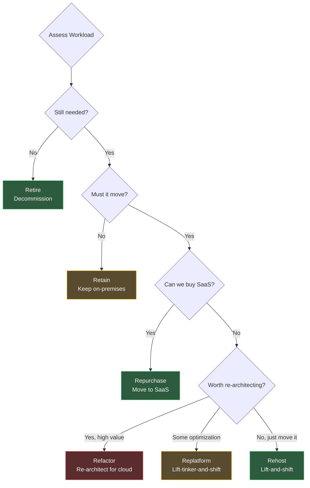
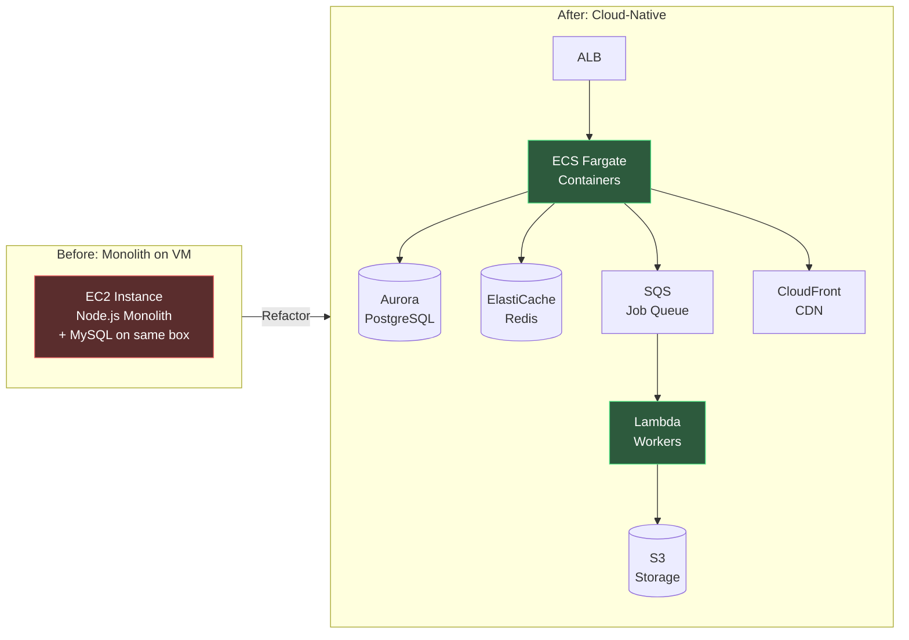
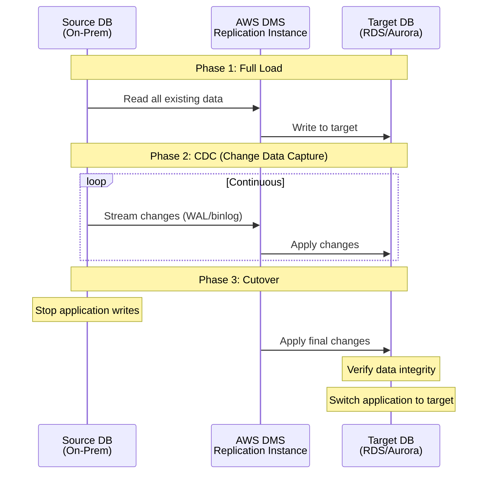
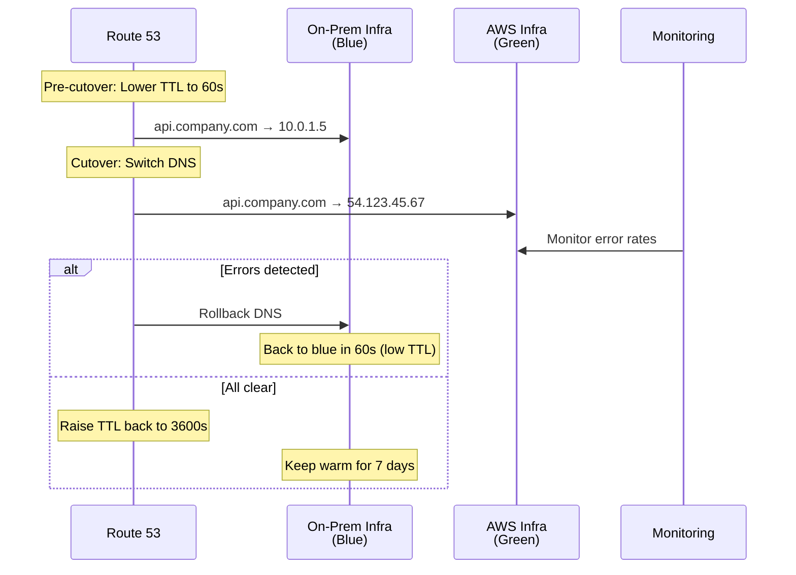
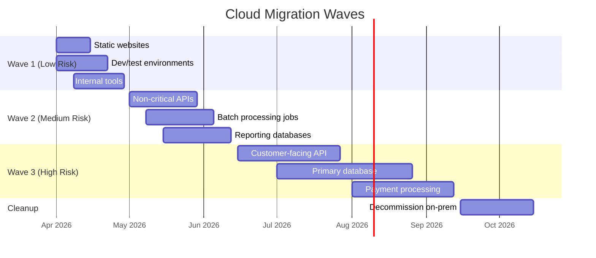

# Cloud Migration Playbook

## Why Companies Migrate to the Cloud

Cloud migration is not about technology — it is about business agility. The on-premises data center that served your company for a decade becomes a liability when competitors ship features weekly because they can provision infrastructure in minutes instead of months.

But the decision is nuanced. Not every workload benefits from cloud migration. The total cost of ownership (TCO) for a stable, predictable workload is often lower on-premises. Cloud wins when:

1. **Demand is variable** — auto-scaling eliminates the need to provision for peak capacity
2. **Speed to market matters** — managed services eliminate undifferentiated operational work
3. **Global presence is required** — multi-region deployment in hours vs. months
4. **Capital expenditure must become operational** — shift from CapEx to OpEx
5. **Talent acquisition** — engineers increasingly expect cloud-native tooling

### The Migration Cost Reality

| Cost Category | Often Underestimated? | Typical Surprise Factor |
|---------------|----------------------|-------------------------|
| Compute | No | 1x (well-understood) |
| Data transfer (egress) | Yes | 3-5x initial estimate |
| Managed service premiums | Yes | 2x vs. self-hosted equivalent |
| Migration labor | Yes | 2-3x initial estimate |
| Dual-running costs | Yes | 3-6 months of running both environments |
| Training and reskilling | Yes | $5-15k per engineer |
| Licensing changes | Sometimes | Cloud licenses can differ from on-prem |

::: warning The Egress Trap
Cloud providers charge for data leaving their network (egress) but not for data entering (ingress). This asymmetry means that once your data is in the cloud, moving it out is expensive. A company with 100TB of data transferring 10TB/month to on-prem systems pays approximately $870/month in AWS egress alone. Factor egress into your TCO analysis.
:::

---

## The 6 R's Framework

AWS coined the "6 R's" framework to classify migration strategies. Each workload should be assessed individually — a single organization will typically use multiple strategies across its portfolio.



### 1. Rehost (Lift-and-Shift)

Move the application as-is to cloud infrastructure. VMs become EC2 instances. On-prem load balancers become ALBs. No code changes.

**When to use**: Legacy applications that cannot be modified, workloads that need to move quickly, regulatory deadlines.

**Pros**: Fastest migration path (weeks). No code changes. Lowest migration risk.
**Cons**: No cloud-native benefits. Often more expensive than on-prem. Technical debt moves with you.

```bash
# AWS Application Migration Service (MGN) rehost workflow
# 1. Install the replication agent on source servers
sudo wget -O ./installer \
  https://aws-application-migration-service-us-east-1.s3.amazonaws.com/latest/linux/aws-replication-installer-init
sudo chmod +x ./installer
sudo ./installer --region us-east-1

# 2. Replication begins automatically — continuous block-level sync
# 3. Launch test instances to validate
aws mgn start-test \
  --source-server-id s-abc123def456 \
  --region us-east-1

# 4. Cutover when ready
aws mgn start-cutover \
  --source-server-id s-abc123def456 \
  --region us-east-1
```

### 2. Replatform (Lift-Tinker-and-Shift)

Make targeted optimizations during migration without re-architecting the entire application:

| On-Premises | Replatform To | Benefit |
|-------------|---------------|---------|
| Self-managed MySQL | Amazon RDS MySQL | Automated backups, patching, failover |
| Self-managed Redis | Amazon ElastiCache | Managed clustering, automatic failover |
| Cron jobs on a VM | AWS Lambda + EventBridge | No server to manage, pay-per-execution |
| NFS file shares | Amazon EFS or S3 | Unlimited storage, 11 9's durability |
| HAProxy | Application Load Balancer | Managed SSL, WAF integration |
| Nagios | CloudWatch + Grafana Cloud | Managed monitoring, no infrastructure |

```typescript
// Replatforming example: move from file system to S3
// Before (on-prem)
import { writeFileSync, readFileSync } from 'fs';

function saveReport(id: string, data: Buffer): void {
  writeFileSync(`/mnt/reports/${id}.pdf`, data);
}

function getReport(id: string): Buffer {
  return readFileSync(`/mnt/reports/${id}.pdf`);
}

// After (replatformed to S3)
import { S3Client, PutObjectCommand, GetObjectCommand } from '@aws-sdk/client-s3';

const s3 = new S3Client({ region: 'us-east-1' });

async function saveReport(id: string, data: Buffer): Promise<void> {
  await s3.send(new PutObjectCommand({
    Bucket: process.env.REPORTS_BUCKET,
    Key: `reports/${id}.pdf`,
    Body: data,
    ContentType: 'application/pdf',
  }));
}

async function getReport(id: string): Promise<Buffer> {
  const response = await s3.send(new GetObjectCommand({
    Bucket: process.env.REPORTS_BUCKET,
    Key: `reports/${id}.pdf`,
  }));
  return Buffer.from(await response.Body!.transformToByteArray());
}
```

### 3. Refactor (Re-Architect)

Redesign the application to be cloud-native. This is the most expensive and time-consuming strategy but yields the greatest long-term benefits.

**When to use**: The application is strategic, will grow significantly, and the team has the skills and time.



### 4. Repurchase (Drop and Shop)

Replace custom-built software with a SaaS equivalent:

| Custom-Built | SaaS Replacement | Annual Saving |
|-------------|------------------|---------------|
| Custom CRM | Salesforce / HubSpot | Engineering time |
| Custom email system | SendGrid / SES | Deliverability, compliance |
| Custom monitoring | Datadog / New Relic | Operational burden |
| Custom CI/CD | GitHub Actions / CircleCI | Maintenance overhead |
| Custom identity | Auth0 / Clerk | Security risk reduction |

### 5. Retire

Identify applications that are no longer needed and decommission them. Typical findings during portfolio assessment:

- 10-20% of applications have zero active users
- 5-10% are duplicates of other applications
- Some exist only because "we might need it someday"

### 6. Retain

Some workloads should stay on-premises:

- **Latency-sensitive** systems that must be physically close to hardware (factory automation, trading)
- **Regulatory** requirements that mandate on-premises data storage
- **Cost** — stable, predictable workloads with fully depreciated hardware
- **Dependency** — tightly coupled to other on-premises systems not yet migrated

---

## Data Migration Strategies

Data migration is the highest-risk phase of any cloud migration. You are moving the source of truth.

### Strategy Comparison

| Strategy | Downtime | Data Size | Complexity | Use When |
|----------|----------|-----------|------------|----------|
| Database dump & restore | Hours | < 100GB | Low | Small databases, maintenance window available |
| AWS DMS (continuous replication) | Minutes | Any | Medium | MySQL/PostgreSQL to RDS/Aurora |
| Logical replication | Minutes | Any | Medium | PostgreSQL to Aurora PostgreSQL |
| Physical shipping (Snowball) | Days | > 10TB | Low | Massive datasets, limited bandwidth |
| Dual-write | Zero | Any | High | Zero-downtime requirement |

### AWS Database Migration Service (DMS)

DMS provides continuous replication from on-premises databases to AWS:



```bash
# Create DMS replication instance
aws dms create-replication-instance \
  --replication-instance-identifier prod-migration \
  --replication-instance-class dms.r5.xlarge \
  --allocated-storage 100 \
  --vpc-security-group-ids sg-abc123 \
  --availability-zone us-east-1a

# Create source endpoint (on-prem MySQL)
aws dms create-endpoint \
  --endpoint-identifier source-mysql \
  --endpoint-type source \
  --engine-name mysql \
  --server-name db.internal.company.com \
  --port 3306 \
  --username dms_user \
  --password "$DB_PASSWORD" \
  --database-name production

# Create target endpoint (Aurora)
aws dms create-endpoint \
  --endpoint-identifier target-aurora \
  --endpoint-type target \
  --engine-name aurora-postgresql \
  --server-name prod.cluster-abc123.us-east-1.rds.amazonaws.com \
  --port 5432 \
  --username dms_user \
  --password "$DB_PASSWORD" \
  --database-name production

# Create and start replication task
aws dms create-replication-task \
  --replication-task-identifier full-load-and-cdc \
  --source-endpoint-arn arn:aws:dms:...:endpoint:source-mysql \
  --target-endpoint-arn arn:aws:dms:...:endpoint:target-aurora \
  --replication-instance-arn arn:aws:dms:...:rep:prod-migration \
  --migration-type full-load-and-cdc \
  --table-mappings file://table-mappings.json
```

::: tip Validate Data After Migration
Never trust "rows copied" counts alone. Run checksum comparisons between source and target:

```sql
-- Source (MySQL)
SELECT COUNT(*), SUM(CRC32(CONCAT_WS(',', id, email, name))) AS checksum
FROM users;

-- Target (PostgreSQL equivalent)
SELECT COUNT(*), SUM(hashtext(CONCAT(id::text, email, name))) AS checksum
FROM users;
```
:::

### Physical Data Transfer

For datasets exceeding 10TB, network transfer is impractical. AWS Snowball and Snowball Edge provide physical devices:

| Device | Capacity | Transfer Speed | Use Case |
|--------|----------|---------------|----------|
| Snowball Edge Storage | 80TB | Ship in days | Large dataset migration |
| Snowball Edge Compute | 80TB + GPU | Ship in days | Pre-processing during transfer |
| Snowmobile | 100PB | Weeks | Exabyte-scale data center migration |

```
Transfer time comparison for 100TB:
- 1 Gbps internet: ~10 days (continuous)
- 10 Gbps internet: ~1 day (continuous)
- Snowball Edge: ~1 week (including shipping)
- Snowmobile: ~2 weeks (truck arrives at your data center)
```

---

## DNS Cutover Strategies

DNS cutover is the moment of truth — when you switch traffic from the old infrastructure to the new.

### Blue-Green DNS Cutover



### Weighted DNS Cutover

Gradually shift traffic using weighted routing:

```bash
# Route 53 weighted routing — start with 5% to new infra
aws route53 change-resource-record-sets \
  --hosted-zone-id Z1234567890 \
  --change-batch '{
    "Changes": [
      {
        "Action": "UPSERT",
        "ResourceRecordSet": {
          "Name": "api.company.com",
          "Type": "A",
          "SetIdentifier": "on-prem",
          "Weight": 95,
          "TTL": 60,
          "ResourceRecords": [{"Value": "10.0.1.5"}]
        }
      },
      {
        "Action": "UPSERT",
        "ResourceRecordSet": {
          "Name": "api.company.com",
          "Type": "A",
          "SetIdentifier": "aws",
          "Weight": 5,
          "TTL": 60,
          "ResourceRecords": [{"Value": "54.123.45.67"}]
        }
      }
    ]
  }'
```

::: danger Lower TTL Before Cutover
DNS records are cached by resolvers worldwide. If your TTL is 3600 seconds (1 hour), a rollback takes up to 1 hour to propagate. Lower the TTL to 60 seconds at least 48 hours before the cutover. This ensures all caches have the low TTL when you make the switch.
:::

---

## Migration Phases

### Phase 1: Assessment (4-8 weeks)

| Activity | Output |
|----------|--------|
| Portfolio discovery | List of all applications, databases, dependencies |
| Dependency mapping | Network flow diagrams, database connections |
| TCO analysis | Cost comparison: on-prem vs. cloud (3-year) |
| Compliance review | Data residency requirements, regulatory constraints |
| Skill gap analysis | Training plan for engineering team |
| 6 R's classification | Migration strategy per workload |

### Phase 2: Foundation (4-6 weeks)

Build the cloud landing zone before migrating any workloads:

| Category | Component | Purpose |
|----------|-----------|---------|
| **Networking** | Multi-AZ VPC | Public/private subnets, NAT gateways |
| | Transit Gateway | Hub-spoke for multi-account |
| | Direct Connect | Dedicated connection to on-prem |
| | Route 53 | Private hosted zones + on-prem forwarding |
| **Security** | IAM + SSO | Federation with corporate AD |
| | GuardDuty | Threat detection |
| | WAF | Firewall on all public endpoints |
| **Observability** | CloudWatch + Grafana | Metrics, logs, dashboards |
| | X-Ray / OpenTelemetry | Distributed tracing |
| | PagerDuty | Alert routing |
| **Governance** | Organizations | Multi-account structure |
| | SCPs | Restrict regions and services |
| | Budgets | Cost alerts per account |
| | Tagging policy | Mandatory: team, env, cost-center |

### Phase 3: Migration Waves (Ongoing)

Group workloads into migration waves. Each wave should include a mix of complexity levels:



### Phase 4: Optimization (Ongoing)

After migration, optimize for cloud-native cost and performance:

| Optimization | Typical Savings | Effort |
|-------------|----------------|--------|
| Right-sizing instances | 30-40% compute cost | Low |
| Reserved instances / Savings Plans | 30-60% compute cost | Low |
| Spot instances for batch workloads | 60-90% compute cost | Medium |
| S3 lifecycle policies (IA, Glacier) | 50-80% storage cost | Low |
| Auto-scaling (scale to zero when idle) | 40-70% compute cost | Medium |
| Graviton (ARM) instances | 20-40% compute cost | Low-Medium |

---

## Rollback Strategy

### The Dual-Running Period

Never decommission on-premises infrastructure immediately after cutover. Maintain a dual-running period:

```typescript
interface CutoverConfig {
  /** Minimum days to keep old infra running after cutover */
  dualRunDays: number;
  /** Criteria to exit dual-running */
  exitCriteria: {
    errorRateBelowBaseline: boolean;
    latencyBelowBaseline: boolean;
    dataIntegrityVerified: boolean;
    noRollbackTriggered: boolean;
    stakeholderSignoff: boolean;
  };
}

const defaultCutoverConfig: CutoverConfig = {
  dualRunDays: 30,
  exitCriteria: {
    errorRateBelowBaseline: true,
    latencyBelowBaseline: true,
    dataIntegrityVerified: true,
    noRollbackTriggered: true,
    stakeholderSignoff: true,
  },
};
```

::: tip Budget for Dual-Running Costs
Most cloud migration budgets underestimate the cost of running both environments simultaneously. For a 6-month migration with 3 waves, you may be dual-running for 9-12 months total. Budget for this explicitly — it is not waste, it is insurance.
:::

---

## Common Pitfalls

### Pitfall 1: Forklift Migration Without Modernization

Rehosting every workload as-is ("forklift migration") is fast but leaves you paying cloud prices for on-prem architecture. A VM that costs $200/month on-prem can cost $600/month as an EC2 instance with the same specs. Without right-sizing and using managed services, cloud costs can exceed on-prem costs within 12 months.

### Pitfall 2: Ignoring Network Latency

On-premises applications communicate over a LAN with sub-millisecond latency. After migration, services may need to cross availability zones (1-2ms) or regions (50-200ms). Applications that make hundreds of sequential inter-service calls can see dramatic performance degradation.

### Pitfall 3: Security Model Differences

On-premises security relies heavily on network perimeter (firewalls). Cloud security requires identity-based access (IAM roles, security groups, NACLs). Teams accustomed to "everything inside the firewall is trusted" must adopt zero-trust networking.

### Pitfall 4: Underestimating Data Transfer Time

At 1 Gbps, transferring 10TB takes approximately 22 hours of continuous transfer. Real-world speeds are lower due to protocol overhead, encryption, and network congestion. Plan data transfer timelines with a 2x buffer.

See also: [Migration Playbooks Overview](/devops/migrations/) for the risk assessment framework, [Deployment Strategies](/devops/deployment-strategies/) for deploying to cloud infrastructure, and [Disaster Recovery](/devops/disaster-recovery/) for cloud-native DR strategies.
