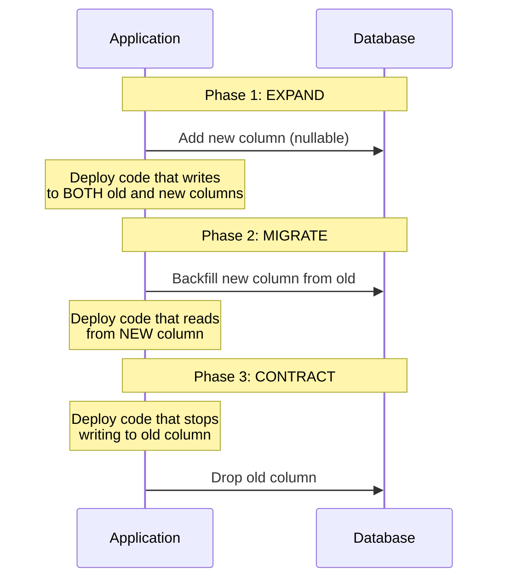
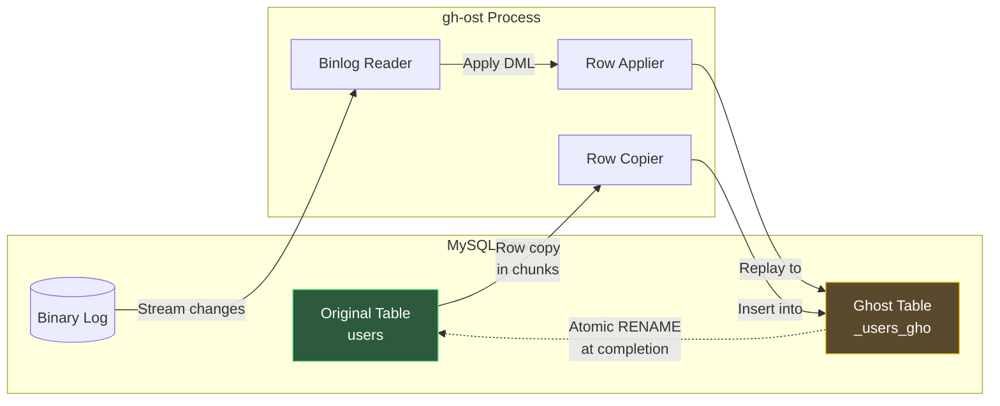
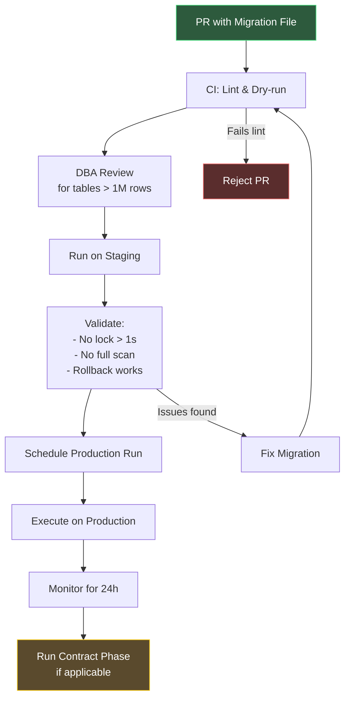

# Zero-Downtime Database Migrations

## Why Normal Migrations Break Production

A naive `ALTER TABLE` in MySQL or PostgreSQL acquires a lock on the entire table. While that lock is held, every query that touches the table blocks. For a table with 100 million rows, an `ALTER TABLE ADD COLUMN` can hold that lock for minutes to hours. During that time, your application returns 500 errors to every user attempting to read or write that data.

This is not a theoretical concern. GitHub experienced a 2-hour outage in 2012 because a schema migration locked their `repositories` table. Shopify's engineering team has documented cases where a seemingly innocent `ALTER TABLE` on a 500M-row table caused a 45-minute cascading failure across their entire checkout flow.

The fundamental problem is that traditional DDL (Data Definition Language) operations were designed for maintenance windows, not for systems that must serve traffic 24/7/365. Zero-downtime migrations solve this by decomposing dangerous atomic operations into a sequence of safe, incremental steps.

### The Lock Hierarchy Problem

To understand why schema changes are dangerous, you need to understand database lock hierarchies:

PostgreSQL has 8 lock levels, from `ACCESS SHARE` (used by `SELECT`) to `ACCESS EXCLUSIVE` (used by `ALTER TABLE`, `DROP TABLE`). `ALTER TABLE` acquires `ACCESS EXCLUSIVE` -- the most restrictive level. It conflicts with every other lock type, including `SELECT`. This means even read queries are blocked while the schema change executes.

Worse, PostgreSQL's lock queue makes this catastrophic. If `ALTER TABLE` is waiting for a long-running query to finish, every subsequent query queues behind it. A single long-running analytics query can turn a schema change into a complete table lockout.

---

## The Expand-Contract Pattern

The expand-contract pattern (also called parallel change) is the foundational technique for zero-downtime migrations. Every other technique in this page is a variation or optimization of this core pattern.

### How It Works

Instead of making a breaking change in one step, you decompose it into three phases:



### Example: Renaming a Column

Renaming a column from `user_name` to `display_name` without downtime:

**Phase 1 — Expand (add new column):**

```sql
-- Safe: adding a nullable column does not lock the table
-- (PostgreSQL acquires ACCESS EXCLUSIVE lock briefly, but no table rewrite)
ALTER TABLE users ADD COLUMN display_name VARCHAR(255);
```

```typescript
// Deploy code that writes to both columns
class UserRepository {
  async updateName(userId: string, name: string): Promise<void> {
    await db.query(
      `UPDATE users
       SET user_name = $1, display_name = $1
       WHERE id = $2`,
      [name, userId]
    );
  }

  // Still reading from old column
  async getUser(userId: string): Promise<User> {
    const result = await db.query(
      `SELECT id, user_name AS name FROM users WHERE id = $1`,
      [userId]
    );
    return result.rows[0];
  }
}
```

**Phase 2 — Migrate (backfill):**

```sql
-- Backfill in batches to avoid long-running transactions
DO $$
DECLARE
  batch_size INT := 10000;
  rows_updated INT;
BEGIN
  LOOP
    UPDATE users
    SET display_name = user_name
    WHERE display_name IS NULL
      AND id IN (
        SELECT id FROM users
        WHERE display_name IS NULL
        LIMIT batch_size
        FOR UPDATE SKIP LOCKED
      );

    GET DIAGNOSTICS rows_updated = ROW_COUNT;
    RAISE NOTICE 'Updated % rows', rows_updated;

    EXIT WHEN rows_updated = 0;

    -- Small delay to reduce replication lag
    PERFORM pg_sleep(0.1);
  END LOOP;
END $$;
```

```typescript
// Switch reads to the new column
async getUser(userId: string): Promise<User> {
  const result = await db.query(
    `SELECT id, COALESCE(display_name, user_name) AS name
     FROM users WHERE id = $1`,
    [userId]
  );
  return result.rows[0];
}
```

**Phase 3 — Contract (remove old column):**

```typescript
// Deploy code that only uses the new column
async getUser(userId: string): Promise<User> {
  const result = await db.query(
    `SELECT id, display_name AS name FROM users WHERE id = $1`,
    [userId]
  );
  return result.rows[0];
}
```

```sql
-- After confirming no code reads the old column
ALTER TABLE users DROP COLUMN user_name;
```

::: warning Timing Between Phases
Each phase must be a separate deployment with monitoring in between. Do not combine phases into a single deployment. The monitoring gap between phases is what makes zero-downtime migrations safe — if Phase 2 reveals data inconsistencies, you can roll back before Phase 3 makes the change irreversible.
:::

---

## Safe Operations Reference

Not all schema changes are equally dangerous. This reference table tells you which operations are safe and which require special handling:

### PostgreSQL

| Operation | Locks Table? | Rewrites Table? | Safe Online? | Notes |
|-----------|-------------|-----------------|-------------|-------|
| `ADD COLUMN` (nullable, no default) | Brief | No | Yes | The safest schema change |
| `ADD COLUMN` (with volatile default) | Yes | Yes (pre-11) | PG 11+ only | PG 11+ stores default in catalog, no rewrite |
| `DROP COLUMN` | Brief | No | Yes | Column is marked as dropped, not physically removed |
| `ADD INDEX` | Yes | N/A | No | Use `CREATE INDEX CONCURRENTLY` instead |
| `CREATE INDEX CONCURRENTLY` | No | N/A | Yes | Two-pass scan, no lock on writes |
| `ALTER COLUMN TYPE` | Yes | Yes | No | Requires expand-contract |
| `ADD NOT NULL CONSTRAINT` | Yes | Scans table | PG 12+ | PG 12+ skips scan if valid CHECK exists |
| `ADD FOREIGN KEY` | Yes | Scans table | No | Use `NOT VALID` + `VALIDATE` pattern |
| `RENAME COLUMN` | Brief | No | Technically | But breaks application code instantly |

::: tip PostgreSQL 11+ Changed the Game
Before PostgreSQL 11, `ADD COLUMN ... DEFAULT x` rewrote the entire table. In PG 11+, the default value is stored in the system catalog and applied lazily during reads. This made one of the most common operations effectively instant, regardless of table size.
:::

---

## Online Schema Change Tools

When built-in DDL cannot perform a change safely, external tools create a shadow copy of the table, apply the change to the copy, then atomically swap.

### gh-ost (GitHub Online Schema Transmogrifier)

gh-ost is GitHub's tool for online schema changes in MySQL. Unlike `pt-online-schema-change`, it does not use triggers — it reads the binary log to capture changes.



**Running a gh-ost migration:**

```bash
gh-ost \
  --host=replica.db.internal \
  --database=production \
  --table=users \
  --alter="ADD COLUMN display_name VARCHAR(255)" \
  --execute \
  --allow-on-master \
  --chunk-size=1000 \
  --max-load=Threads_running=25 \
  --critical-load=Threads_running=50 \
  --throttle-control-replicas=replica1.db.internal \
  --max-lag-millis=1500 \
  --verbose
```

Key gh-ost flags explained:

| Flag | Purpose |
|------|---------|
| `--max-load` | Pauses migration when server load exceeds threshold |
| `--critical-load` | Aborts migration entirely if load exceeds this |
| `--max-lag-millis` | Throttles when replica lag exceeds this value |
| `--chunk-size` | Number of rows copied per iteration (tune for your hardware) |
| `--throttle-control-replicas` | Monitors specific replicas for lag |
| `--postpone-cut-over-flag-file` | Creates a file to prevent the final swap — gives you manual control |
| `--panic-flag-file` | Touch this file to immediately abort the migration |

::: danger gh-ost Cut-Over is Not Truly Atomic
The table rename in gh-ost involves a brief moment where the table is unavailable (typically < 1 second). For extremely high-QPS tables, coordinate the cut-over during a low-traffic window. Use `--postpone-cut-over-flag-file` to control timing.
:::

### pt-online-schema-change (Percona Toolkit)

`pt-online-schema-change` uses triggers to capture changes to the original table and replay them onto a shadow copy:

```bash
pt-online-schema-change \
  --execute \
  --alter "ADD COLUMN display_name VARCHAR(255)" \
  D=production,t=users \
  --chunk-size=1000 \
  --max-lag=1 \
  --check-interval=1 \
  --recurse=1 \
  --progress=percentage,10 \
  --no-drop-old-table
```

**gh-ost vs pt-online-schema-change:**

| Feature | gh-ost | pt-online-schema-change |
|---------|--------|------------------------|
| Change capture | Binary log | Triggers |
| Server load impact | Lower (no triggers) | Higher (3 triggers per table) |
| Foreign key support | No | Yes (with limitations) |
| Pausable | Yes (flag file) | Limited |
| Testable | Yes (`--test-on-replica`) | No |
| Cleanup on failure | Good | Can leave artifacts |
| MySQL version support | 5.6+ | 5.1+ |

### pgroll (PostgreSQL)

pgroll is a newer tool from Xata that brings online schema changes to PostgreSQL with automatic expand-contract. You define migrations in JSON, specifying `up` and `down` transformations. pgroll creates versioned views -- old application code sees the old schema, new code sees the new schema, and triggers keep both columns in sync during the transition.

```bash
# Start migration -- creates new version view
pgroll start migrations/add_display_name.json

# Both versions work simultaneously during the transition

# Complete migration -- drops old version view
pgroll complete migrations/add_display_name.json

# Rollback (if needed) -- drops new version view
pgroll rollback migrations/add_display_name.json
```

---

## Backfill Strategies

When you add a new column and need to populate it from existing data, the backfill strategy determines whether you will cause a production incident.

### Batched Backfill

The most reliable strategy. Process rows in small batches with pauses between them:

```sql
-- Batched backfill using CTE with FOR UPDATE SKIP LOCKED
WITH batch AS (
  SELECT id FROM users
  WHERE display_name IS NULL
  ORDER BY id
  LIMIT 10000
  FOR UPDATE SKIP LOCKED
)
UPDATE users t
SET display_name = t.user_name
FROM batch
WHERE t.id = batch.id;
```

Wrap this in a loop. After each batch: log progress, check replication lag (pause if > 5 seconds), then sleep 100ms to reduce I/O pressure. Exit when 0 rows are updated.

### Lazy Backfill

Instead of running a background migration, populate the new column on-read: when a query returns `display_name IS NULL`, update that row inline and return the new value. This works well for rarely-accessed rows and pairs with batched backfill -- the batch handles the bulk, lazy backfill catches stragglers.

### Dual-Read Validation

After backfilling, validate that the new column matches expectations before switching reads:

```sql
-- Find discrepancies between old and new columns
SELECT
  COUNT(*) AS total_rows,
  COUNT(*) FILTER (WHERE display_name IS NULL) AS null_new,
  COUNT(*) FILTER (WHERE display_name != user_name) AS mismatched,
  COUNT(*) FILTER (WHERE display_name = user_name) AS matched
FROM users;

-- Expected output for a completed backfill:
-- total_rows | null_new | mismatched | matched
-- 3147892    | 0        | 0          | 3147892
```

---

## Changing Column Types Safely

Changing a column type (e.g., `INT` to `BIGINT`, or `VARCHAR(50)` to `VARCHAR(255)`) is one of the most dangerous operations because it typically requires a full table rewrite.

### The Safe Pattern


**Example: INT to BIGINT for an ID column approaching overflow:**

```sql
-- Step 1: Add new BIGINT column
ALTER TABLE orders ADD COLUMN id_new BIGINT;

-- Step 2: Create trigger for dual-write
CREATE OR REPLACE FUNCTION sync_id_new()
RETURNS TRIGGER AS $$
BEGIN
  NEW.id_new := NEW.id;
  RETURN NEW;
END;
$$ LANGUAGE plpgsql;

CREATE TRIGGER trg_sync_id_new
  BEFORE INSERT OR UPDATE ON orders
  FOR EACH ROW EXECUTE FUNCTION sync_id_new();

-- Step 3: Backfill (in batches — see backfill section)
-- Step 4: Switch application reads to id_new
-- Step 5: Drop trigger and old column
-- Step 6: Rename id_new to id
```

::: danger INT Overflow is a Real Emergency
A 32-bit signed integer overflows at 2,147,483,647. If your auto-incrementing primary key approaches this limit, you have a ticking time bomb. At 1,000 inserts per second, a table created with INT will overflow in approximately 68 years. But if you do bulk imports, batch processing, or have gaps from deleted rows with reused sequences, it can happen much sooner. Monitor your sequence values.
:::

---

## Adding NOT NULL Constraints

Adding a `NOT NULL` constraint on an existing column is dangerous because the database must scan every row to verify no NULL values exist. On large tables, this scan holds a lock.

### PostgreSQL 12+ Pattern

```sql
-- Step 1: Add a CHECK constraint as NOT VALID (no scan)
ALTER TABLE users
  ADD CONSTRAINT users_display_name_not_null
  CHECK (display_name IS NOT NULL) NOT VALID;

-- Step 2: Validate the constraint (scans but does not hold ACCESS EXCLUSIVE lock)
ALTER TABLE users
  VALIDATE CONSTRAINT users_display_name_not_null;

-- Step 3: Now adding NOT NULL is instant (PostgreSQL recognizes the CHECK)
ALTER TABLE users
  ALTER COLUMN display_name SET NOT NULL;

-- Step 4: Drop the now-redundant CHECK constraint
ALTER TABLE users
  DROP CONSTRAINT users_display_name_not_null;
```

### Adding Foreign Keys Safely

The same `NOT VALID` + `VALIDATE` pattern works for foreign keys:

```sql
-- Step 1: Add FK without validation (instant, no scan)
ALTER TABLE orders
  ADD CONSTRAINT fk_orders_users
  FOREIGN KEY (user_id) REFERENCES users(id)
  NOT VALID;

-- Step 2: Validate in the background (SHARE UPDATE EXCLUSIVE lock, not ACCESS EXCLUSIVE)
ALTER TABLE orders
  VALIDATE CONSTRAINT fk_orders_users;
```

---

## Migration Orchestration

### Migration Pipeline

A production-grade migration pipeline coordinates schema changes with code deployments:



### Migration Lint Rules

Automate safety checks in CI by flagging dangerous patterns:

| Rule | Pattern | Severity | Why |
|------|---------|----------|-----|
| `no-alter-type` | `ALTER COLUMN ... TYPE` | Error | Rewrites the table. Use expand-contract. |
| `no-not-null` | `SET NOT NULL` | Error | Scans table. Use `CHECK NOT VALID` + `VALIDATE`. |
| `no-rename-column` | `RENAME COLUMN` | Error | Breaks running application code instantly. |
| `require-concurrent-index` | `CREATE INDEX` (without `CONCURRENTLY`) | Error | Locks the table for the duration of the build. |
| `no-drop-column` | `DROP COLUMN` | Warning | Verify no code references this column first. |
| `add-column-default` | `ADD COLUMN ... DEFAULT` | Warning | Safe in PG 11+ but rewrites in older versions. |

---

## Monitoring During Migrations

### Key Metrics to Watch

| Metric | Danger Threshold | Action |
|--------|-----------------|--------|
| Replication lag | > 10 seconds | Pause migration, reduce batch size |
| Lock wait time | > 5 seconds | Abort migration, investigate |
| Active connections | > 80% of max | Pause migration |
| Disk I/O utilization | > 90% | Reduce batch size, add sleep |
| Error rate (application) | > 2x baseline | Rollback |
| p99 latency | > 3x baseline | Pause, investigate |

::: tip Set a Lock Timeout
Always set a statement-level lock timeout before running DDL in production. This prevents a schema change from waiting indefinitely (and building up a queue behind it):

```sql
SET lock_timeout = '3s';
ALTER TABLE users ADD COLUMN display_name VARCHAR(255);
-- If the lock cannot be acquired within 3 seconds, this fails cleanly
```
:::

---

## Real-World Migration Playbooks

### Adding a Column to a 500M-Row Table

```
Table: events (500M rows, ~200GB)
Change: Add `processed_at TIMESTAMP` column
Database: PostgreSQL 15
Target: Zero downtime
```

1. **Set lock timeout**: `SET lock_timeout = '5s';`
2. **Add nullable column**: `ALTER TABLE events ADD COLUMN processed_at TIMESTAMP;` (instant in PG 11+)
3. **Deploy dual-write code**: new writes populate `processed_at`
4. **Backfill**: batched update, 10k rows per batch, 100ms sleep, monitor replication lag
5. **Validate**: count NULLs, should be 0 for rows created after dual-write deploy
6. **Switch reads**: application reads `processed_at`
7. **Add NOT NULL**: use the `CHECK NOT VALID` + `VALIDATE` pattern
8. **Monitor**: 24 hours of clean metrics
9. **Contract**: remove old code paths

**Estimated timeline**: 1 day for steps 1-3, 2-8 hours for backfill (step 4), 1 day for monitoring (step 8).

See also: [Deployment Strategies](/devops/deployment-strategies/) for coordinating code deployments with schema changes, and the [Migration Playbooks Overview](/devops/migrations/) for the risk assessment framework.
