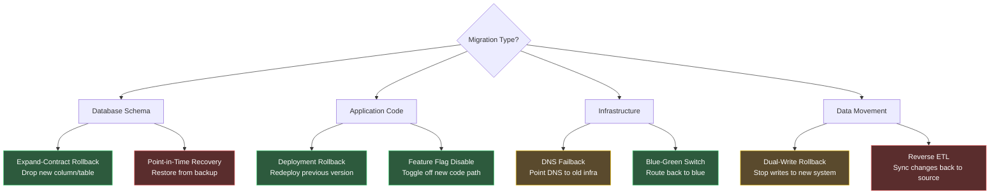
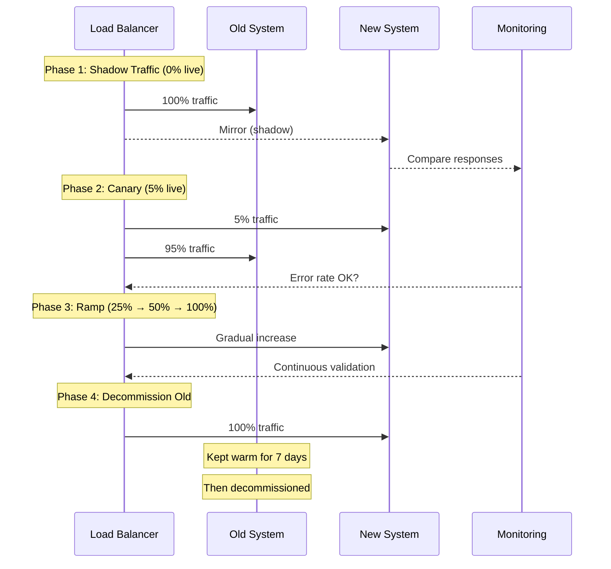

# Migration Playbooks

## Why Migrations Matter

Every production system eventually needs to change. The database schema that worked for 1,000 users cannot serve 10 million. The monolith that launched the startup cannot sustain 50 engineering teams. The on-premises infrastructure that met compliance in 2018 cannot compete with cloud-native competitors shipping features weekly.

Migration is the engineering discipline of moving a production system from state A to state B without losing data, breaking functionality, or causing downtime. It sounds simple. It is not. Migrations are the single highest-risk category of engineering work because they combine three dangerous properties simultaneously:

1. **Irreversibility pressure** — once you start moving data or traffic, rolling back becomes progressively harder
2. **Blast radius** — migrations typically affect the entire system, not a single feature
3. **Coordination complexity** — migrations require synchronizing changes across code, data, infrastructure, and often multiple teams

The history of catastrophic outages is littered with failed migrations. Knight Capital lost $440 million in 45 minutes due to a botched code deployment that reactivated dead code. GitLab lost 6 hours of production data when a database migration went wrong and backups were discovered to be non-functional. British Airways grounded all flights for three days after a power migration in their data center failed.

These are not stories of incompetence. They are stories of complexity overwhelming preparation. The purpose of migration playbooks is to systematically reduce this complexity through repeatable processes, risk frameworks, and rollback strategies.

### The Migration Spectrum

Not all migrations carry equal risk. Understanding where your migration falls on the risk spectrum determines how much preparation you need:

```mermaid
graph LR
    subgraph LOW["Low Risk"]
        A[Add nullable column]
        B[Add new index]
        C[Deploy new service]
    end

    subgraph MEDIUM["Medium Risk"]
        D[Rename column]
        E[Change column type]
        F[Split monolith service]
    end

    subgraph HIGH["High Risk"]
        G[Database engine swap]
        H[Cloud provider migration]
        I[Full re-architecture]
    end

    LOW -->|"Minutes"| MEDIUM
    MEDIUM -->|"Days to Weeks"| HIGH

    style LOW fill:#2d5a3d,stroke:#4ade80,color:#fff
    style MEDIUM fill:#5a4a2d,stroke:#facc15,color:#fff
    style HIGH fill:#5a2d2d,stroke:#f87171,color:#fff
```



---

## Types of Migrations

### Database Migrations

Database migrations modify the schema or engine that stores your application's data. They are the most common and most dangerous migration type because data is the one thing you absolutely cannot lose.

| Migration Type | Risk Level | Typical Duration | Rollback Difficulty |
|----------------|-----------|------------------|---------------------|
| Add nullable column | Low | Seconds | Easy — drop the column |
| Add index (concurrent) | Low | Minutes to hours | Easy — drop the index |
| Rename column | Medium | Hours (expand-contract) | Medium — requires code coordination |
| Change column type | High | Hours to days | Hard — data conversion may be lossy |
| Shard a database | Critical | Weeks | Very hard — data is distributed |
| Switch database engine | Critical | Weeks to months | Very hard — application layer changes |

::: tip Start with the Expand-Contract Pattern
Almost every database migration can be made safe by decomposing it into expand (add new) and contract (remove old) phases. This is covered in depth in the [Database Schema Migrations](/devops/migrations/database-schema) page.
:::

### Application Architecture Migrations

These migrations change how your application code is structured and deployed. The canonical example is monolith-to-microservices, but it also includes:

- **Framework migrations** (e.g., Express to Fastify, Angular to React)
- **Language migrations** (e.g., Ruby to Go for performance-critical services)
- **API version migrations** (e.g., REST v1 to v2, or REST to GraphQL)
- **Authentication migrations** (e.g., session-based to JWT, or to OAuth 2.0)

Application migrations are lower risk than database migrations because code is stateless and deployable. The primary risk is in the transition period where old and new code must coexist.

See also: [Monolith to Microservices](/devops/migrations/monolith-to-microservices) for the most complex application migration pattern.

### Infrastructure Migrations

Infrastructure migrations move your compute, storage, and networking from one platform or configuration to another:

- **Cloud migrations** (on-premises to cloud, or cloud-to-cloud)
- **Container migrations** (VMs to Docker/Kubernetes)
- **Network migrations** (IP range changes, VPN restructuring, DNS provider changes)
- **Storage migrations** (NFS to S3, EBS to EFS, HDD to SSD)

Infrastructure migrations carry high risk because they affect every layer of the stack simultaneously. A misconfigured security group or DNS record can take down the entire system.

See also: [Cloud Migration Playbook](/devops/migrations/cloud-migration) for the full 6 R's framework.

### Data Migrations

Data migrations move data between systems, formats, or locations without necessarily changing the schema:

- **ETL migrations** (changing data pipeline tools)
- **Data format migrations** (XML to JSON, CSV to Parquet)
- **Data residency migrations** (moving data to comply with GDPR, data sovereignty laws)
- **Archive migrations** (moving cold data to cheaper storage tiers)

---

## Risk Assessment Framework

Before starting any migration, run it through this risk assessment. The goal is not to avoid risk — it is to understand it well enough to prepare appropriate safeguards.

### The DICE Framework

Adapted from the Boston Consulting Group's DICE framework for change management, this version is tailored for technical migrations:

| Factor | Score 1 (Low Risk) | Score 2 (Medium Risk) | Score 3 (High Risk) | Score 4 (Critical Risk) |
|--------|--------------------|-----------------------|---------------------|-------------------------|
| **D**uration | < 1 day | 1-7 days | 1-4 weeks | > 4 weeks |
| **I**ntegrity (data risk) | No data changes | Additive only | Data transformation | Data deletion/movement |
| **C**oordination | Single team | 2-3 teams | Cross-org | External vendors |
| **E**ffort (% of team) | < 10% | 10-25% | 25-50% | > 50% |

**Total score interpretation:**

- **4-6**: Low risk. Standard deployment process is sufficient.
- **7-10**: Medium risk. Dedicated migration plan with explicit rollback steps.
- **11-14**: High risk. War room, dedicated on-call, rehearsed rollback.
- **15-16**: Critical risk. Board-level visibility, phased execution over weeks, kill switches at every stage.

```typescript
// Migration risk calculator
interface MigrationRisk {
  duration: 1 | 2 | 3 | 4;
  integrity: 1 | 2 | 3 | 4;
  coordination: 1 | 2 | 3 | 4;
  effort: 1 | 2 | 3 | 4;
}

function assessRisk(risk: MigrationRisk): string {
  const total = risk.duration + risk.integrity
    + risk.coordination + risk.effort;

  if (total <= 6) return 'LOW — standard deployment process';
  if (total <= 10) return 'MEDIUM — dedicated migration plan';
  if (total <= 14) return 'HIGH — war room + rehearsed rollback';
  return 'CRITICAL — phased execution, board visibility';
}

// Example: sharding a production database
const shardingMigration: MigrationRisk = {
  duration: 4,   // > 4 weeks
  integrity: 4,  // data movement across shards
  coordination: 3, // cross-org (DBA, backend, SRE)
  effort: 3,     // 25-50% of engineering team
};

console.log(assessRisk(shardingMigration));
// "CRITICAL — phased execution, board visibility"
```

### Pre-Migration Checklist

Every migration, regardless of risk level, should pass this checklist before execution:

```markdown
## Pre-Migration Checklist

### Data Safety
- [ ] Full backup taken and verified (restore tested)
- [ ] Point-in-time recovery confirmed working
- [ ] Data validation queries written and tested
- [ ] Rollback scripts written and tested in staging

### Observability
- [ ] Migration-specific dashboards created
- [ ] Alert thresholds adjusted for migration window
- [ ] Error rate baseline recorded
- [ ] Latency baseline recorded

### Communication
- [ ] Stakeholders notified of migration window
- [ ] Status page prepared (if customer-facing impact)
- [ ] Escalation contacts confirmed available
- [ ] Rollback decision criteria documented

### Execution
- [ ] Migration rehearsed in staging environment
- [ ] Timing estimates validated against staging run
- [ ] Feature flags in place for traffic control
- [ ] Kill switch tested and documented
```

::: warning Never Skip the Staging Rehearsal
The number one cause of migration failures is skipping the staging rehearsal. Production data is always messier, larger, and more interconnected than you expect. A migration that takes 30 seconds in staging may take 3 hours in production due to index sizes, foreign key constraints, or replication lag.
:::

---

## Rollback Strategies

A migration without a rollback plan is not a migration — it is a gamble. Every migration must have a documented rollback strategy before it begins.

### Rollback Strategy Matrix



### The Rollback Time Budget

Every migration has a **point of no return** — the moment after which rollback becomes more expensive than pushing forward. You must identify this point before starting.

```typescript
interface RollbackBudget {
  /** Maximum acceptable downtime in minutes */
  maxDowntimeMinutes: number;
  /** Time to execute rollback from any point */
  rollbackExecutionMinutes: number;
  /** Time to verify rollback succeeded */
  rollbackVerificationMinutes: number;
  /** Buffer for unexpected issues (typically 2x) */
  bufferMultiplier: number;
}

function calculatePointOfNoReturn(budget: RollbackBudget): number {
  const rollbackTotal =
    (budget.rollbackExecutionMinutes + budget.rollbackVerificationMinutes)
    * budget.bufferMultiplier;

  const pointOfNoReturn = budget.maxDowntimeMinutes - rollbackTotal;

  if (pointOfNoReturn <= 0) {
    throw new Error(
      'Rollback time exceeds downtime budget — migration cannot be done safely in this window'
    );
  }

  return pointOfNoReturn;
}

// Example: 4-hour maintenance window
const budget: RollbackBudget = {
  maxDowntimeMinutes: 240,
  rollbackExecutionMinutes: 45,
  rollbackVerificationMinutes: 15,
  bufferMultiplier: 2,
};

console.log(`Point of no return: ${
  calculatePointOfNoReturn(budget)
} minutes into migration`);
// "Point of no return: 120 minutes into migration"
```

::: danger Know Your Point of No Return
If you reach the point of no return and the migration is not on track, you must roll back immediately. Do not negotiate with the timeline. Do not convince yourself "it will probably finish." The further past the point of no return you go, the more catastrophic a failure becomes. This decision should be made by a single designated owner, not by committee.
:::

### Forward-Fix vs. Rollback

Sometimes rolling back is worse than fixing forward. The decision framework:

| Condition | Rollback | Fix Forward |
|-----------|----------|-------------|
| Data has been deleted or corrupted | Rollback to backup | Never |
| New code has a bug but data is intact | Either — depends on speed | If fix is < 15 min |
| Migration is 90% complete with no errors | Finish it | Fix Forward |
| Users are reporting errors | Rollback immediately | Only if root cause is known |
| Old infrastructure already decommissioned | Cannot rollback | Fix Forward (only option) |

---

## Migration Execution Patterns

### The Traffic Shift Pattern

For any migration that involves moving traffic between systems, use a gradual shift with automated rollback:



### The Dual-Write Pattern

For data migrations, dual-writing ensures no data is lost during the transition:

1. **Start dual-writing** — write to both old and new systems
2. **Backfill** — copy historical data to the new system
3. **Validate** — compare data in both systems
4. **Switch reads** — read from the new system
5. **Stop writing to old** — remove the dual-write path
6. **Decommission** — remove old system after a safety period

```typescript
class DualWriteProxy<T> {
  constructor(
    private oldStore: DataStore<T>,
    private newStore: DataStore<T>,
    private mode: 'shadow' | 'dual-write' | 'new-primary' | 'new-only'
  ) {}

  async write(key: string, value: T): Promise<void> {
    switch (this.mode) {
      case 'shadow':
        await this.oldStore.write(key, value);
        // Fire-and-forget to new store for testing
        this.newStore.write(key, value).catch(err =>
          metrics.increment('dual_write.shadow.error')
        );
        break;

      case 'dual-write':
        // Both must succeed
        await Promise.all([
          this.oldStore.write(key, value),
          this.newStore.write(key, value),
        ]);
        break;

      case 'new-primary':
        await this.newStore.write(key, value);
        this.oldStore.write(key, value).catch(err =>
          metrics.increment('dual_write.old_fallback.error')
        );
        break;

      case 'new-only':
        await this.newStore.write(key, value);
        break;
    }
  }

  async read(key: string): Promise<T | null> {
    if (this.mode === 'new-primary' || this.mode === 'new-only') {
      return this.newStore.read(key);
    }
    return this.oldStore.read(key);
  }
}
```

---

## Communication During Migrations

### The RACI Matrix for Migrations

| Activity | Responsible | Accountable | Consulted | Informed |
|----------|------------|-------------|-----------|----------|
| Migration plan | Lead engineer | Engineering manager | DBA, SRE | All engineering |
| Risk assessment | Lead engineer | VP Engineering | Security, Legal | CTO |
| Staging rehearsal | Migration team | Lead engineer | QA | SRE |
| Go/no-go decision | Lead engineer | VP Engineering | SRE, DBA | All engineering |
| Execution | Migration team | Lead engineer | SRE (on-call) | Status page |
| Rollback decision | Incident commander | VP Engineering | Lead engineer | All engineering |
| Post-migration review | Lead engineer | Engineering manager | All involved | All engineering |

### Status Update Template

During long-running migrations, send status updates every 30 minutes:

```markdown
## Migration Status Update — {​{​ timestamp }​}

**Phase:** 3 of 5 (Data backfill)
**Progress:** 67% (2.1M / 3.1M rows)
**ETA:** 45 minutes remaining
**Status:** ON TRACK

### Metrics
- Error rate: 0.001% (threshold: 0.1%)
- p99 latency: 142ms (baseline: 135ms)
- Replication lag: 2.3s (threshold: 10s)

### Issues
- None

### Next checkpoint
- 14:30 UTC — Phase 3 completion expected
```

---

## What To Read Next

This overview establishes the foundational concepts. Dive into the specific migration type you are planning:

| Migration Type | Page | When To Use |
|---------------|------|-------------|
| Database schema changes | [Zero-Downtime Database Migrations](/devops/migrations/database-schema) | Adding columns, changing types, renaming fields |
| Application re-architecture | [Monolith to Microservices](/devops/migrations/monolith-to-microservices) | Breaking apart a monolith |
| Infrastructure relocation | [Cloud Migration Playbook](/devops/migrations/cloud-migration) | Moving to cloud or between clouds |

See also: [Deployment Strategies](/devops/deployment-strategies/) for deploying code changes safely, and [Disaster Recovery](/devops/disaster-recovery/) for when migrations go catastrophically wrong.
