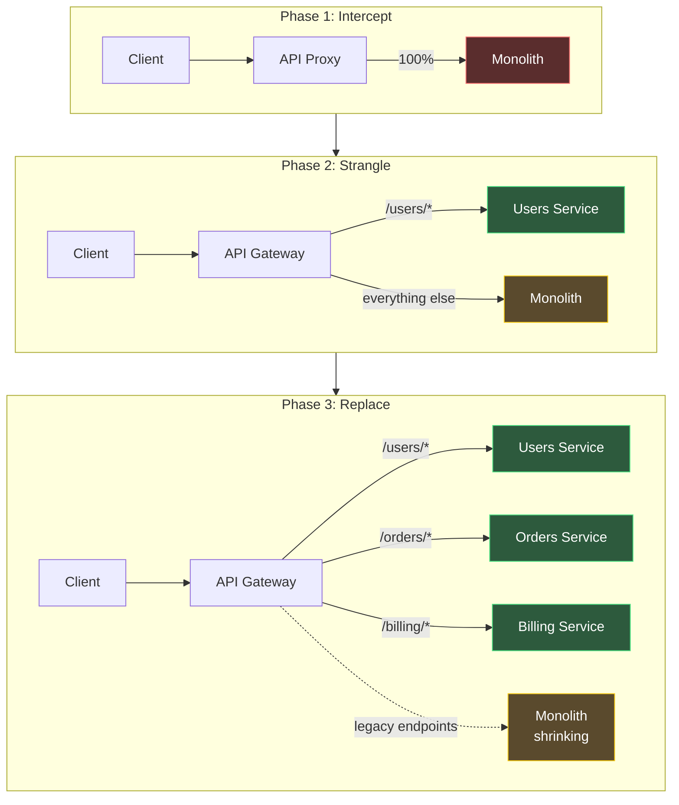
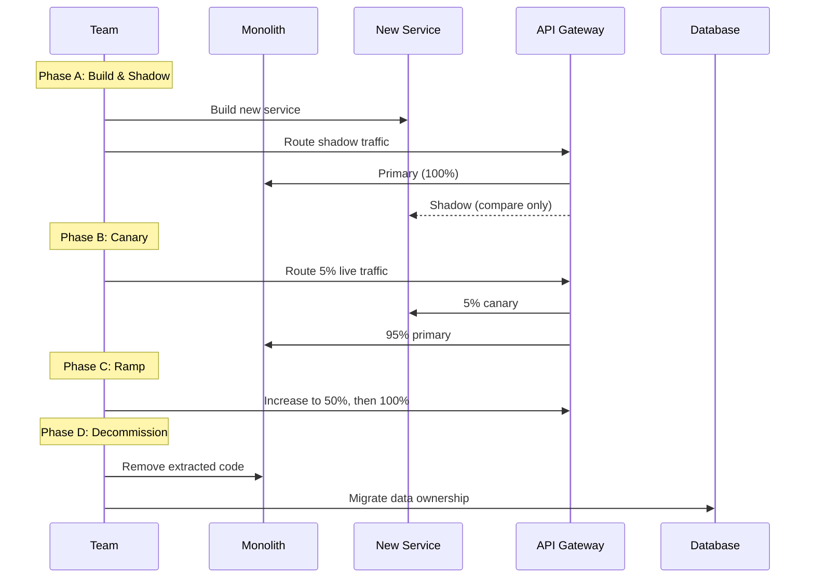
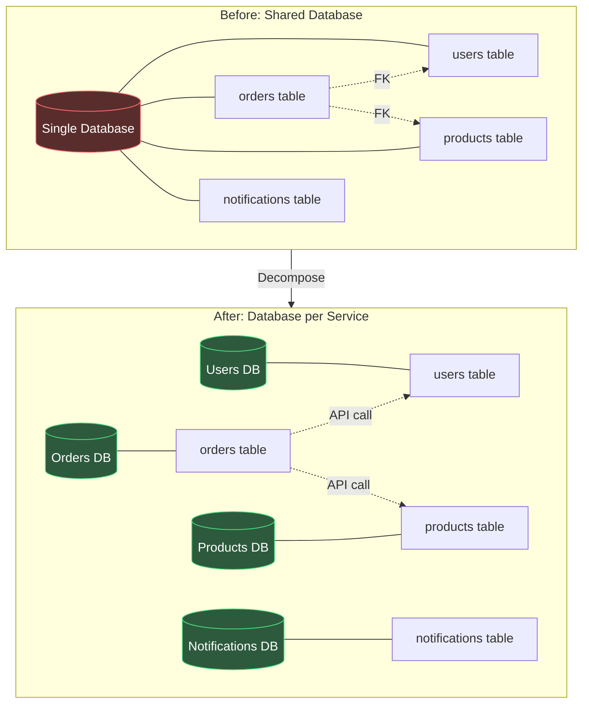
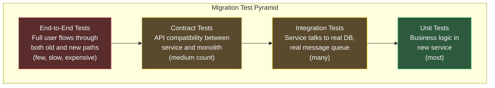

# Monolith to Microservices

## When NOT to Migrate

This section comes first intentionally. The most important decision in a monolith-to-microservices migration is whether to do it at all. The industry has a dangerous bias toward microservices, fueled by conference talks from companies operating at scales most organizations will never reach.

### The Honest Assessment

Ask these questions before starting:

| Question | If Yes → Stay Monolith | If No → Consider Microservices |
|----------|----------------------|-------------------------------|
| Can your team deploy independently within the monolith? | Yes — use modules | No — deployment coupling is a real problem |
| Is your team smaller than 30 engineers? | Yes — coordination overhead of microservices exceeds benefit | No — Conway's law demands boundaries |
| Is your scaling bottleneck the database, not compute? | Yes — microservices do not solve DB bottlenecks | No — independent scaling is valuable |
| Can you afford 6-12 months of reduced feature velocity? | No — migration drains engineering capacity | Yes — invest in the future |
| Do you have platform/SRE capability? | No — who runs Kubernetes? | Yes — operational readiness exists |

::: danger The Distributed Monolith Anti-Pattern
The worst outcome of a microservices migration is a distributed monolith — services that must be deployed together, share a database, or cannot function independently. You have all the operational complexity of microservices with none of the benefits. If your "microservices" require synchronized deploys, you have built a worse monolith.
:::

### Signs You Actually Need Microservices

1. **Deploy queue**: Teams wait days to deploy because of merge conflicts and shared CI/CD pipelines
2. **Blast radius**: A bug in the billing module takes down the search API
3. **Scaling mismatch**: The image processing module needs 100 CPU cores while the REST API needs 2
4. **Technology constraints**: You need ML models in Python but the monolith is in Java
5. **Compliance boundaries**: HIPAA/PCI data must be isolated from general application code

---

## The Strangler Fig Pattern

Named after the strangler fig tree that grows around a host tree and eventually replaces it, this pattern incrementally replaces monolith functionality with microservices without ever performing a "big bang" rewrite.

### How It Works



### Step 1: Introduce the API Gateway

Before extracting any service, place an API gateway in front of the monolith. This gives you a routing layer to incrementally redirect traffic:

```typescript
// api-gateway/src/routes.ts
import { Router } from 'express';
import httpProxy from 'http-proxy-middleware';

const router = Router();

// Phase 1: Everything goes to the monolith
const monolithProxy = httpProxy.createProxyMiddleware({
  target: process.env.MONOLITH_URL,
  changeOrigin: true,
});

// Phase 2: Users service extracted
const usersProxy = httpProxy.createProxyMiddleware({
  target: process.env.USERS_SERVICE_URL,
  changeOrigin: true,
});

// Feature flag controls the routing
router.use('/api/users', (req, res, next) => {
  if (featureFlags.isEnabled('use-users-service')) {
    return usersProxy(req, res, next);
  }
  return monolithProxy(req, res, next);
});

// Everything else goes to monolith
router.use('/', monolithProxy);

export default router;
```

::: tip Start with the API Gateway, Not the First Service
Teams often rush to extract their first microservice. Instead, spend the first sprint deploying the API gateway with 100% traffic proxied to the monolith. This validates that the proxy layer works, establishes monitoring baselines, and gives you the routing infrastructure for all subsequent extractions.
:::

### Step 2: Identify Extraction Candidates

Not all parts of the monolith should be extracted simultaneously. Rank candidates by this prioritization matrix:

```mermaid
quadrantChart
    title Service Extraction Priority
    x-axis Low Business Value --> High Business Value
    y-axis Low Coupling --> High Coupling
    quadrant-1 Extract Later (high value, high coupling)
    quadrant-2 Extract Last (low value, high coupling)
    quadrant-3 Extract First (low value, low coupling)
    quadrant-4 Extract Second (high value, low coupling)
    "Notifications": [0.2, 0.15]
    "PDF Generation": [0.15, 0.25]
    "User Auth": [0.85, 0.8]
    "Search": [0.7, 0.3]
    "Payments": [0.9, 0.65]
    "Image Processing": [0.3, 0.1]
    "Inventory": [0.75, 0.55]
    "Analytics": [0.5, 0.2]
```

**Extract first**: low coupling, low business value. These are safe experiments — if the extraction fails, the blast radius is small. Examples: notifications, PDF generation, image processing.

**Extract second**: high business value, low coupling. Now that you have experience, tackle the valuable services. Examples: search, recommendations.

**Extract later**: high coupling requires first decomposing the database and untangling shared code. Examples: payments, inventory.

**Extract last**: high coupling, low business value. Often not worth extracting at all. Consider keeping these in the monolith.

### Step 3: Extract the First Service

The first extraction is the hardest because you are building the platform (service discovery, observability, CI/CD) simultaneously. Here is the process:



```typescript
// Shadow traffic comparison middleware
async function shadowCompare(req: Request, res: Response, next: Function) {
  // Get response from monolith (primary)
  const monolithResponse = await fetchFromMonolith(req);

  // Get response from new service (shadow)
  const serviceResponse = await fetchFromService(req).catch(err => {
    metrics.increment('shadow.service.error');
    return null;
  });

  // Compare responses
  if (serviceResponse) {
    const match = deepEqual(monolithResponse.body, serviceResponse.body);
    metrics.increment(
      match ? 'shadow.match' : 'shadow.mismatch'
    );

    if (!match) {
      logger.warn('Shadow mismatch', {
        path: req.path,
        monolith: monolithResponse.body,
        service: serviceResponse.body,
      });
    }
  }

  // Always return the monolith response during shadow phase
  res.status(monolithResponse.status).json(monolithResponse.body);
}
```

---

## Database Decomposition

The hardest part of migrating from a monolith to microservices is not the code — it is the database. A monolith typically has one database with extensive cross-table joins, foreign keys, and stored procedures that span multiple domains.

### Database Decomposition Strategies



### The Shared Database Phase (Temporary)

During migration, the new service often still reads from the monolith's database. This is acceptable as a temporary state:

| Phase | Read | Write | Acceptable Duration |
|-------|------|-------|---------------------|
| 1. Shared DB (read/write) | Monolith DB | Monolith DB | Starting state |
| 2. Shared DB (read-only from service) | Monolith DB | Service API | Weeks |
| 3. Dual-write | Both | Both | Days to weeks |
| 4. Separate DB (service owns data) | Service DB | Service DB | Final state |

::: warning Do Not Skip Phase 2
Many teams try to jump from Phase 1 to Phase 4. This requires a "big bang" data migration with coordinated downtime. Instead, go through Phase 2 (service reads from monolith DB via read replica) and Phase 3 (dual-write to both databases). See [Zero-Downtime Database Migrations](/devops/migrations/database-schema) for the dual-write pattern.
:::

### Replacing Joins with API Calls

In a monolith, getting an order with user and product details is a single SQL query:

```sql
-- Monolith: single query with joins
SELECT
  o.id, o.total, o.created_at,
  u.name AS user_name, u.email,
  p.name AS product_name, p.price
FROM orders o
JOIN users u ON o.user_id = u.id
JOIN products p ON o.product_id = p.id
WHERE o.id = $1;
```

In microservices, this becomes multiple API calls:

```typescript
// Microservices: aggregate from multiple services
async function getOrderDetails(orderId: string): Promise<OrderDetails> {
  // Get order from orders service
  const order = await ordersClient.getOrder(orderId);

  // Fetch related data in parallel
  const [user, product] = await Promise.all([
    usersClient.getUser(order.userId),
    productsClient.getProduct(order.productId),
  ]);

  return {
    id: order.id,
    total: order.total,
    createdAt: order.createdAt,
    user: { name: user.name, email: user.email },
    product: { name: product.name, price: product.price },
  };
}
```

This introduces latency and failure modes. Mitigate with:

1. **Denormalization**: Store `user_name` and `product_name` in the orders table at write time
2. **Caching**: Cache user and product data with short TTLs
3. **Event-driven sync**: Use events to keep local read models up to date (see [Message Queues](/system-design/message-queues/))

```typescript
// Event-driven denormalization
class OrderService {
  // Listen for user name changes
  @OnEvent('user.updated')
  async handleUserUpdated(event: UserUpdatedEvent): Promise<void> {
    if (event.changes.includes('name')) {
      await this.orderRepository.updateUserName(
        event.userId,
        event.newName
      );
    }
  }

  // Orders table now has user_name column — no join needed
  async getOrder(orderId: string): Promise<Order> {
    return this.orderRepository.findById(orderId);
  }
}
```

---

## Feature Flags for Migration

Feature flags are the safety net that makes incremental migration possible. They let you route traffic between old and new code paths without deploying:

```typescript
// Feature flag configuration for migration
const migrationFlags = {
  // Percentage-based rollout
  'users-service-reads': {
    type: 'percentage',
    value: 25,           // 25% of traffic goes to new service
    stickyBy: 'userId',  // same user always gets same path
  },

  // User-segment based rollout
  'users-service-writes': {
    type: 'segment',
    enabledFor: ['internal', 'beta'],  // internal users first
    disabledFor: ['enterprise'],       // enterprise users last
  },

  // Kill switch
  'users-service-enabled': {
    type: 'boolean',
    value: true,
    description: 'Master switch — set to false to route all traffic to monolith',
  },
};
```

```typescript
// Using feature flags in the API gateway
router.use('/api/users/:id', async (req, res, next) => {
  const userId = req.params.id;

  // Check kill switch first
  if (!flags.isEnabled('users-service-enabled')) {
    return monolithProxy(req, res, next);
  }

  // Check percentage rollout
  if (flags.isEnabledForUser('users-service-reads', userId)) {
    try {
      const result = await usersServiceClient.getUser(userId);
      return res.json(result);
    } catch (err) {
      // Fallback to monolith on service failure
      metrics.increment('users_service.fallback');
      return monolithProxy(req, res, next);
    }
  }

  return monolithProxy(req, res, next);
});
```

::: tip Sticky Routing is Critical
When using percentage-based rollout, ensure the same user always hits the same backend (sticky routing). If user A writes to the new service but reads from the monolith, they will see stale data. Hash the user ID to deterministically choose a path.
:::

---

## Testing Strategies

### The Testing Pyramid for Migrations



### Contract Testing with Pact

Ensure the new service's API is compatible with every consumer:

```typescript
// Consumer test (in the API gateway)
import { PactV3 } from '@pact-foundation/pact';

const provider = new PactV3({
  consumer: 'ApiGateway',
  provider: 'UsersService',
});

describe('Users Service Contract', () => {
  it('returns user by ID', async () => {
    await provider
      .given('user with ID 123 exists')
      .uponReceiving('a request for user 123')
      .withRequest({
        method: 'GET',
        path: '/api/users/123',
        headers: { Accept: 'application/json' },
      })
      .willRespondWith({
        status: 200,
        headers: { 'Content-Type': 'application/json' },
        body: {
          id: '123',
          name: like('John Doe'),
          email: like('john@example.com'),
          createdAt: iso8601DateTime(),
        },
      })
      .executeTest(async (mockServer) => {
        const client = new UsersClient(mockServer.url);
        const user = await client.getUser('123');

        expect(user.id).toBe('123');
        expect(user.name).toBeDefined();
      });
  });
});
```

---

## Migration Timeline

A realistic timeline for extracting a single service from a monolith:

| Week | Activity | Risk |
|------|----------|------|
| 1-2 | Deploy API gateway, establish monitoring baselines | Low |
| 3-4 | Build new service with unit/integration tests | Low |
| 5 | Shadow traffic testing, fix mismatches | Medium |
| 6 | Canary deployment (5% traffic) | Medium |
| 7-8 | Ramp to 50%, then 100% of reads | Medium |
| 9-10 | Database decomposition (dual-write) | High |
| 11 | Switch writes to new service | High |
| 12 | Decommission monolith code for this domain | Low |

::: warning The 3x Rule
Whatever timeline you estimate, multiply by 3. Every monolith-to-microservices migration in history has taken longer than estimated. The biggest time sinks are: (1) discovering undocumented dependencies, (2) data migration edge cases, and (3) performance differences between SQL joins and API calls.
:::

### Tracking Progress

Track migration progress with a domain ownership matrix that records: domain name, read source (monolith/service/migrating), write source (monolith/service/dual-write), database status (shared/separate/migrating), traffic percentage routed to the new service, and owning team. Update this matrix weekly and review it in engineering leadership meetings. When all domains show `reads: 'service'`, `writes: 'service'`, `database: 'separate'`, and `trafficPercent: 100`, the migration is complete.

---

## Common Pitfalls

### Pitfall 1: Extracting the Wrong Service First

Teams often extract the most painful or most valuable service first. This is backwards. Extract the simplest, least coupled service first. You are building the platform (observability, deployment, service mesh) alongside the first extraction. Do not compound platform risk with business logic risk.

### Pitfall 2: Ignoring Data Gravity

Data has gravity — the more data you have, the harder it is to move. A service with 10GB of data is easy to extract. A service with 10TB requires weeks of migration planning. Account for data volume in your extraction priority.

### Pitfall 3: Synchronous Inter-Service Communication

If Service A calls Service B which calls Service C in a synchronous chain, you have created a fragile dependency tree. Prefer asynchronous communication (events) between services. Use synchronous calls only when you need an immediate response.

### Pitfall 4: Shared Libraries Become Coupling

A shared library used by multiple services seems efficient but creates deployment coupling. If the library changes, every service must update. Keep shared libraries minimal — only truly universal concerns (logging, tracing, auth). Business logic never belongs in a shared library.

### Pitfall 5: No Observability Before Extraction

If you cannot trace a request across the monolith today, you certainly cannot trace it across microservices. Instrument the monolith with distributed tracing (OpenTelemetry) before extracting any services.

See also: [Background Jobs Overview](/system-design/background-jobs/) for handling async work across service boundaries, and [Cloud Migration Playbook](/devops/migrations/cloud-migration) if you are simultaneously migrating infrastructure.
