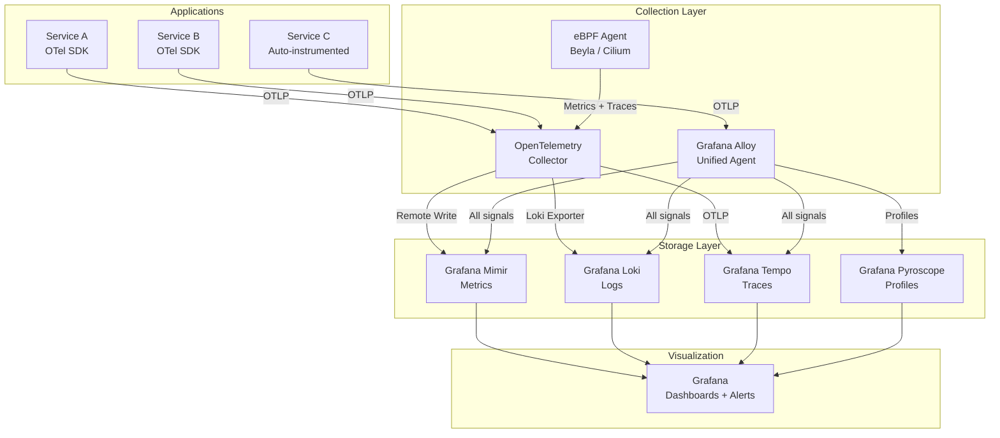
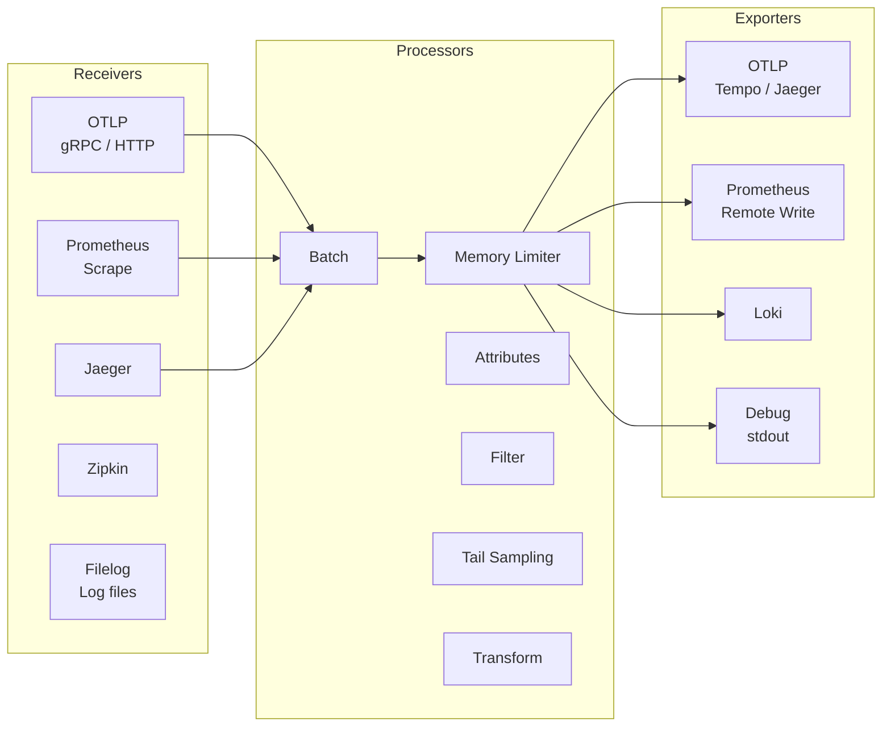
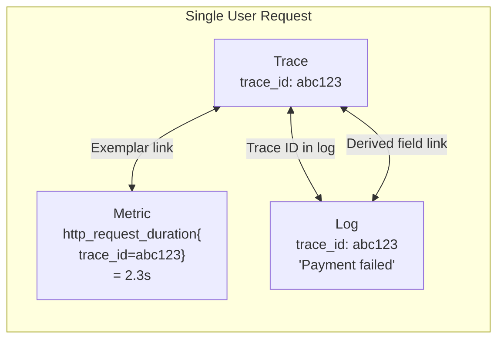
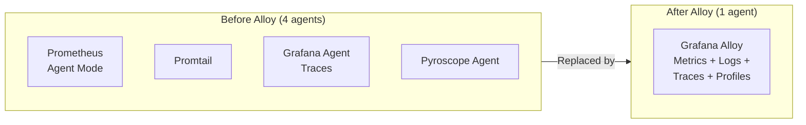
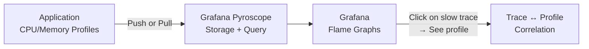
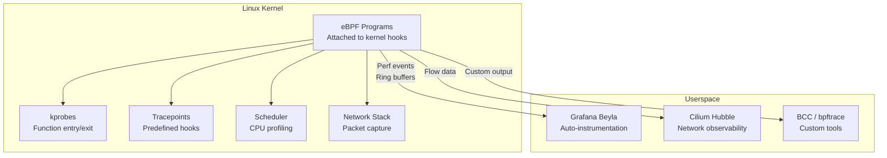
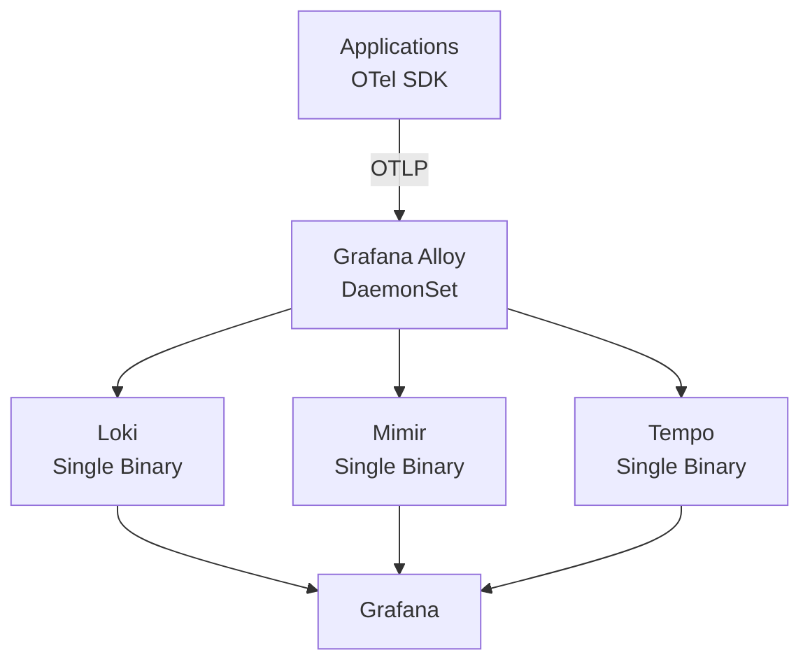
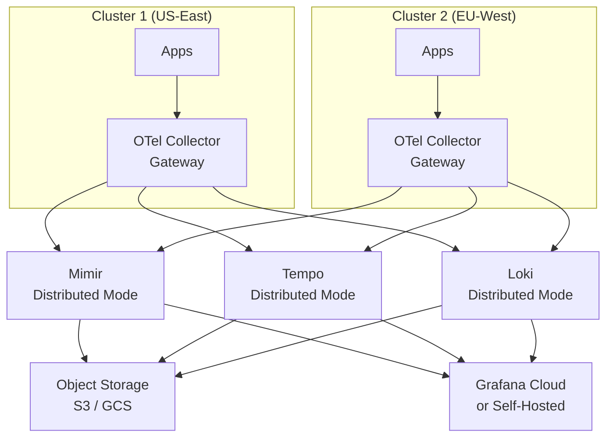

# Observability Tools Deep Dive

Observability is not a product you buy — it is a property of a system. A system is observable when you can understand its internal state from its external outputs. The three pillars (metrics, logs, traces) are the raw signals. The tools on this page collect, correlate, and make those signals useful.

This page covers the modern observability stack: OpenTelemetry as the vendor-neutral instrumentation standard, the OTel Collector for pipeline processing, Grafana's LGTM stack (Loki, Grafana, Tempo, Mimir), Grafana Alloy as the unified agent, continuous profiling with Pyroscope, and eBPF-based observability that requires zero application code changes.

**Related**: [Monitoring Overview](/devops/monitoring/) | [PromQL Cheat Sheet](/cheat-sheets/promql) | [Logging](/devops/logging/)

---

## The Observability Stack



### Stack Comparison

| Component | Grafana Stack | AWS | Datadog | Elastic |
|-----------|--------------|-----|---------|---------|
| **Metrics** | Mimir (Prometheus) | CloudWatch | Datadog Metrics | Elasticsearch |
| **Logs** | Loki | CloudWatch Logs | Datadog Logs | Elasticsearch |
| **Traces** | Tempo | X-Ray | Datadog APM | Elastic APM |
| **Profiles** | Pyroscope | CodeGuru | Datadog Profiling | Universal Profiling |
| **Dashboards** | Grafana | CloudWatch | Datadog | Kibana |
| **Agent** | Alloy | CloudWatch Agent | Datadog Agent | Elastic Agent |
| **Cost** | Open source (self-hosted) or Grafana Cloud | Pay per use | Per host/log GB | License or Cloud |

---

## OpenTelemetry Collector

The OTel Collector is the central pipeline for receiving, processing, and exporting telemetry data. It decouples applications from backends — your code sends OTLP, the collector routes it to wherever your backend is.

### Architecture



### Collector Configuration

```yaml
# otel-collector-config.yaml
receivers:
  otlp:
    protocols:
      grpc:
        endpoint: 0.0.0.0:4317
      http:
        endpoint: 0.0.0.0:4318

  prometheus:
    config:
      scrape_configs:
        - job_name: 'kubernetes-pods'
          kubernetes_sd_configs:
            - role: pod
          relabel_configs:
            - source_labels: [__meta_kubernetes_pod_annotation_prometheus_io_scrape]
              action: keep
              regex: true

  filelog:
    include:
      - /var/log/pods/*/*/*.log
    operators:
      - type: container
        id: container-parser

processors:
  batch:
    timeout: 5s
    send_batch_size: 1000
    send_batch_max_size: 5000

  memory_limiter:
    check_interval: 1s
    limit_mib: 512
    spike_limit_mib: 128

  attributes:
    actions:
      - key: environment
        value: production
        action: upsert
      - key: cluster
        value: us-east-1
        action: upsert

  filter/drop-health:
    traces:
      span:
        - 'attributes["http.route"] == "/health"'
        - 'attributes["http.route"] == "/ready"'

  tail_sampling:
    decision_wait: 10s
    policies:
      - name: errors-always
        type: status_code
        status_code: { status_codes: [ERROR] }
      - name: slow-requests
        type: latency
        latency: { threshold_ms: 1000 }
      - name: sample-rest
        type: probabilistic
        probabilistic: { sampling_percentage: 10 }

exporters:
  otlp/tempo:
    endpoint: tempo:4317
    tls:
      insecure: true

  prometheusremotewrite:
    endpoint: http://mimir:9009/api/v1/push
    resource_to_telemetry_conversion:
      enabled: true

  loki:
    endpoint: http://loki:3100/loki/api/v1/push

  debug:
    verbosity: detailed

service:
  pipelines:
    traces:
      receivers: [otlp]
      processors: [memory_limiter, filter/drop-health, tail_sampling, batch, attributes]
      exporters: [otlp/tempo]

    metrics:
      receivers: [otlp, prometheus]
      processors: [memory_limiter, batch, attributes]
      exporters: [prometheusremotewrite]

    logs:
      receivers: [otlp, filelog]
      processors: [memory_limiter, batch, attributes]
      exporters: [loki]

  telemetry:
    logs:
      level: info
    metrics:
      address: 0.0.0.0:8888
```

::: tip
Always include `memory_limiter` as the first processor in every pipeline. Without it, a burst of telemetry data can OOM-kill the collector. The memory limiter applies backpressure to receivers when memory usage exceeds the configured limit.
:::

---

## Trace-Log-Metric Correlation

The power of observability is not in individual signals — it is in connecting them. A trace ID links a request across services. That same trace ID should appear in logs and be queryable from metrics.



### Injecting Trace Context into Logs

```typescript
// Node.js — inject trace ID into structured logs
import { trace, context } from '@opentelemetry/api';
import pino from 'pino';

const logger = pino({
  mixin() {
    const span = trace.getSpan(context.active());
    if (span) {
      const spanContext = span.spanContext();
      return {
        trace_id: spanContext.traceId,
        span_id: spanContext.spanId,
        trace_flags: spanContext.traceFlags,
      };
    }
    return {};
  },
});

// Every log line now includes trace_id and span_id
logger.info('Processing payment');
// {"level":30,"trace_id":"abc123def456...","span_id":"789xyz...","msg":"Processing payment"}
```

```python
# Python — inject trace ID into logs
import logging
from opentelemetry import trace

class TraceIdFilter(logging.Filter):
    def filter(self, record):
        span = trace.get_current_span()
        if span.is_recording():
            ctx = span.get_span_context()
            record.trace_id = format(ctx.trace_id, '032x')
            record.span_id = format(ctx.span_id, '016x')
        else:
            record.trace_id = '0' * 32
            record.span_id = '0' * 16
        return True

logger = logging.getLogger(__name__)
logger.addFilter(TraceIdFilter())

formatter = logging.Formatter(
    '%(asctime)s %(levelname)s [trace_id=%(trace_id)s span_id=%(span_id)s] %(message)s'
)
```

### Exemplars (Metrics to Traces)

Exemplars attach trace IDs to metric data points, allowing you to jump from a latency spike in a dashboard to the exact trace that caused it.

```go
// Go — record histogram with exemplar
import (
    "github.com/prometheus/client_golang/prometheus"
    "go.opentelemetry.io/otel/trace"
)

var requestDuration = prometheus.NewHistogramVec(
    prometheus.HistogramOpts{
        Name:    "http_request_duration_seconds",
        Help:    "Request duration in seconds",
        Buckets: prometheus.DefBuckets,
    },
    []string{"method", "path", "status"},
)

func handleRequest(w http.ResponseWriter, r *http.Request) {
    start := time.Now()
    // ... handle request ...
    duration := time.Since(start).Seconds()

    // Get trace ID from context
    span := trace.SpanFromContext(r.Context())
    traceID := span.SpanContext().TraceID().String()

    // Record with exemplar (trace_id links to trace backend)
    requestDuration.WithLabelValues(
        r.Method, r.URL.Path, "200",
    ).(prometheus.ExemplarObserver).ObserveWithExemplar(
        duration,
        prometheus.Labels{"trace_id": traceID},
    )
}
```

### Grafana Correlation

In Grafana, configure data source correlations:

```yaml
# Grafana provisioning — link Loki logs to Tempo traces
apiVersion: 1

datasources:
  - name: Loki
    type: loki
    url: http://loki:3100
    jsonData:
      derivedFields:
        - datasourceUid: tempo
          matcherRegex: '"trace_id":"(\w+)"'
          name: TraceID
          url: '$${__value.raw}'

  - name: Tempo
    type: tempo
    uid: tempo
    url: http://tempo:3200
    jsonData:
      tracesToLogs:
        datasourceUid: loki
        filterByTraceID: true
        filterBySpanID: true
      tracesToMetrics:
        datasourceUid: mimir
        queries:
          - name: Request duration
            query: 'http_request_duration_seconds_bucket{trace_id="$${__span.traceId}"}'
```

---

## Grafana Alloy

Grafana Alloy (successor to Grafana Agent) is a unified telemetry collector that replaces Prometheus, Promtail, Grafana Agent, and the OTel Collector with a single binary using a declarative pipeline language (River / Alloy syntax).



### Alloy Configuration

```hcl
// alloy config — config.alloy

// === OTLP Receiver ===
otelcol.receiver.otlp "default" {
  grpc {
    endpoint = "0.0.0.0:4317"
  }
  http {
    endpoint = "0.0.0.0:4318"
  }
  output {
    metrics = [otelcol.processor.batch.default.input]
    logs    = [otelcol.processor.batch.default.input]
    traces  = [otelcol.processor.batch.default.input]
  }
}

// === Batch Processor ===
otelcol.processor.batch "default" {
  timeout = "5s"
  send_batch_size = 1000
  output {
    metrics = [otelcol.exporter.prometheus.default.input]
    logs    = [otelcol.exporter.loki.default.input]
    traces  = [otelcol.exporter.otlp.tempo.input]
  }
}

// === Prometheus Scrape ===
prometheus.scrape "kubernetes_pods" {
  targets    = discovery.kubernetes.pods.targets
  forward_to = [prometheus.remote_write.mimir.receiver]
}

prometheus.remote_write "mimir" {
  endpoint {
    url = "http://mimir:9009/api/v1/push"
  }
}

// === Loki Log Collection ===
loki.source.kubernetes_logs "pods" {
  targets    = discovery.kubernetes.pods.targets
  forward_to = [loki.write.default.receiver]
}

loki.write "default" {
  endpoint {
    url = "http://loki:3100/loki/api/v1/push"
  }
}

// === Tempo Trace Export ===
otelcol.exporter.otlp "tempo" {
  client {
    endpoint = "tempo:4317"
    tls {
      insecure = true
    }
  }
}

// === Pyroscope Continuous Profiling ===
pyroscope.scrape "default" {
  targets    = discovery.kubernetes.pods.targets
  forward_to = [pyroscope.write.default.receiver]
  profiling_config {
    profile.process_cpu {
      enabled = true
    }
    profile.memory {
      enabled = true
    }
  }
}

pyroscope.write "default" {
  endpoint {
    url = "http://pyroscope:4040"
  }
}

// === Kubernetes Discovery ===
discovery.kubernetes "pods" {
  role = "pod"
}
```

::: warning
Grafana Alloy replaces both Grafana Agent and the static Prometheus agent. If you are already running the OTel Collector for traces and Promtail for logs, Alloy can consolidate them into a single daemon. However, if you only need trace collection, the OTel Collector remains a perfectly valid choice.
:::

---

## Continuous Profiling with Pyroscope

Continuous profiling captures CPU, memory, and goroutine profiles from production systems in real time, with overhead low enough to run always-on (typically less than 2% CPU).



### Instrumenting Applications

```go
// Go — Pyroscope SDK
package main

import (
    "github.com/grafana/pyroscope-go"
)

func main() {
    pyroscope.Start(pyroscope.Config{
        ApplicationName: "my-service",
        ServerAddress:   "http://pyroscope:4040",
        Logger:          pyroscope.StandardLogger,
        Tags:            map[string]string{"region": "us-east-1"},
        ProfileTypes: []pyroscope.ProfileType{
            pyroscope.ProfileCPU,
            pyroscope.ProfileAllocObjects,
            pyroscope.ProfileAllocSpace,
            pyroscope.ProfileInuseObjects,
            pyroscope.ProfileInuseSpace,
            pyroscope.ProfileGoroutines,
        },
    })
    defer pyroscope.Stop()

    // Application code...
}
```

```python
# Python — Pyroscope SDK
import pyroscope

pyroscope.configure(
    application_name="my-python-service",
    server_address="http://pyroscope:4040",
    tags={"region": "us-east-1", "env": "production"},
)

# Profiles are collected automatically
# Tag specific code paths for drill-down
with pyroscope.tag_wrapper({"endpoint": "/api/process"}):
    process_heavy_request()
```

### Profile Types

| Profile Type | What It Measures | Use Case |
|-------------|-----------------|----------|
| **CPU** | Time spent executing code | Find hot functions |
| **Heap (alloc_space)** | Total bytes allocated | Find allocation-heavy code |
| **Heap (inuse_space)** | Current memory in use | Find memory leaks |
| **Goroutines** | Active goroutines (Go) | Detect goroutine leaks |
| **Mutex** | Time waiting for locks | Find lock contention |
| **Block** | Time goroutines spent blocked | Find I/O bottlenecks |

---

## eBPF Observability

eBPF (extended Berkeley Packet Filter) runs sandboxed programs in the Linux kernel, capturing telemetry without modifying application code. No SDKs, no agents inside containers, no restarts.



### Grafana Beyla (eBPF Auto-Instrumentation)

Beyla automatically instruments HTTP/gRPC services using eBPF — no code changes, no SDK, no restart required.

```yaml
# Kubernetes deployment with Beyla sidecar
apiVersion: apps/v1
kind: Deployment
metadata:
  name: my-service
spec:
  template:
    spec:
      containers:
        - name: my-service
          image: myapp:latest
          ports:
            - containerPort: 8080

        - name: beyla
          image: grafana/beyla:latest
          securityContext:
            privileged: true       # Required for eBPF
          env:
            - name: BEYLA_OPEN_PORT
              value: "8080"        # Watch this port
            - name: OTEL_EXPORTER_OTLP_ENDPOINT
              value: "http://otel-collector:4318"
            - name: BEYLA_SERVICE_NAME
              value: "my-service"
          volumeMounts:
            - name: debugfs
              mountPath: /sys/kernel/debug

      volumes:
        - name: debugfs
          hostPath:
            path: /sys/kernel/debug
```

### What eBPF Captures Automatically

| Signal | Details | No Code Changes |
|--------|---------|:-----------:|
| HTTP request/response metrics | Duration, status code, method, path | Yes |
| gRPC call metrics | Duration, status code, method | Yes |
| SQL query duration | Query latency (not query text) | Yes |
| TCP connection metrics | Connect time, bytes sent/received | Yes |
| DNS resolution time | Query latency, response codes | Yes |
| Process CPU/memory usage | Per-process resource consumption | Yes |
| Network flows | Service-to-service traffic map | Yes |
| Distributed traces | Auto-generated spans for HTTP/gRPC | Yes |

::: danger
eBPF requires Linux kernel 5.8+ and privileged containers in Kubernetes. It does not work on Windows or macOS hosts (works inside Linux VMs on those platforms). Verify your kernel version with `uname -r` before deploying eBPF-based tools.
:::

---

## Deployment Topology

### Small Team (Single Cluster)



### Large Organization (Multi-Cluster)



---

## Tail Sampling Strategies

Collecting 100% of traces is expensive. Tail sampling makes the decision after seeing the complete trace, so you can keep errors and slow requests while sampling routine traffic.

| Strategy | Keep Rate | Use Case |
|----------|-----------|----------|
| **Always sample errors** | 100% of errors | Debug failures |
| **Latency-based** | 100% of slow requests | Performance analysis |
| **Probabilistic** | N% of normal requests | Baseline visibility |
| **Rate-limited** | Max N traces/second | Cost control |
| **String attribute** | Match specific users/tenants | Debugging specific accounts |

```yaml
# OTel Collector tail sampling config
processors:
  tail_sampling:
    decision_wait: 10s
    num_traces: 100000
    expected_new_traces_per_sec: 1000
    policies:
      # Keep ALL errors
      - name: errors
        type: status_code
        status_code:
          status_codes: [ERROR]

      # Keep requests slower than 2 seconds
      - name: slow-requests
        type: latency
        latency:
          threshold_ms: 2000

      # Keep 5% of everything else
      - name: baseline
        type: probabilistic
        probabilistic:
          sampling_percentage: 5
```

::: tip
Tail sampling must happen in a single collector instance (or gateway) that sees all spans for a trace. If spans are distributed across multiple collector instances, use a load-balancing exporter to route all spans of a trace to the same tail-sampling collector.
:::

---

## Quick Start Docker Compose

```yaml
# compose.yaml — full observability stack for local development
services:
  otel-collector:
    image: otel/opentelemetry-collector-contrib:latest
    command: ["--config=/etc/otel/config.yaml"]
    volumes:
      - ./otel-config.yaml:/etc/otel/config.yaml
    ports:
      - "4317:4317"   # OTLP gRPC
      - "4318:4318"   # OTLP HTTP

  grafana:
    image: grafana/grafana:latest
    ports:
      - "3000:3000"
    volumes:
      - ./grafana/provisioning:/etc/grafana/provisioning

  loki:
    image: grafana/loki:latest
    ports:
      - "3100:3100"

  tempo:
    image: grafana/tempo:latest
    command: ["-config.file=/etc/tempo.yaml"]
    volumes:
      - ./tempo.yaml:/etc/tempo.yaml

  mimir:
    image: grafana/mimir:latest
    command: ["-config.file=/etc/mimir.yaml"]
    volumes:
      - ./mimir.yaml:/etc/mimir.yaml

  pyroscope:
    image: grafana/pyroscope:latest
    ports:
      - "4040:4040"
```

---

## Further Reading

- [Monitoring Overview](/devops/monitoring/) — metrics fundamentals, Prometheus, and alerting
- [PromQL Cheat Sheet](/cheat-sheets/promql) — querying metrics in Prometheus/Mimir
- [Logging](/devops/logging/) — structured logging, log aggregation, and log levels
- [gRPC Deep Dive](/system-design/api-design/grpc-deep-dive) — tracing gRPC calls
- [Docker Compose Cheat Sheet](/cheat-sheets/docker-compose) — running the observability stack locally
