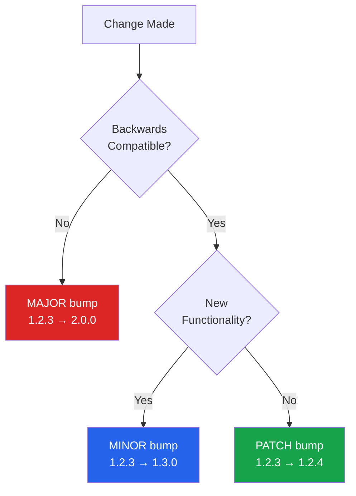
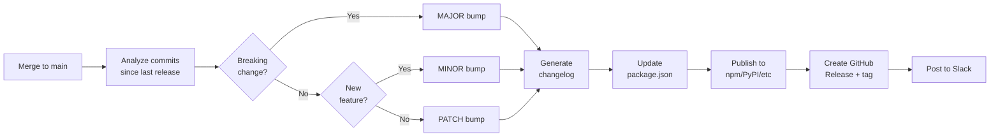
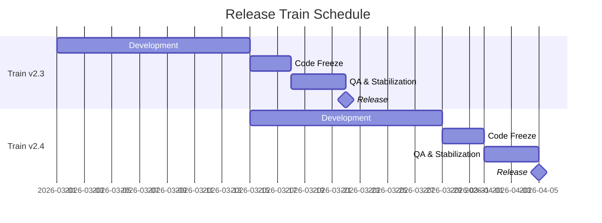
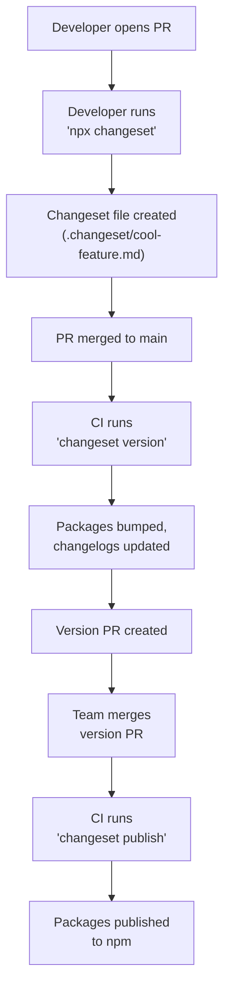
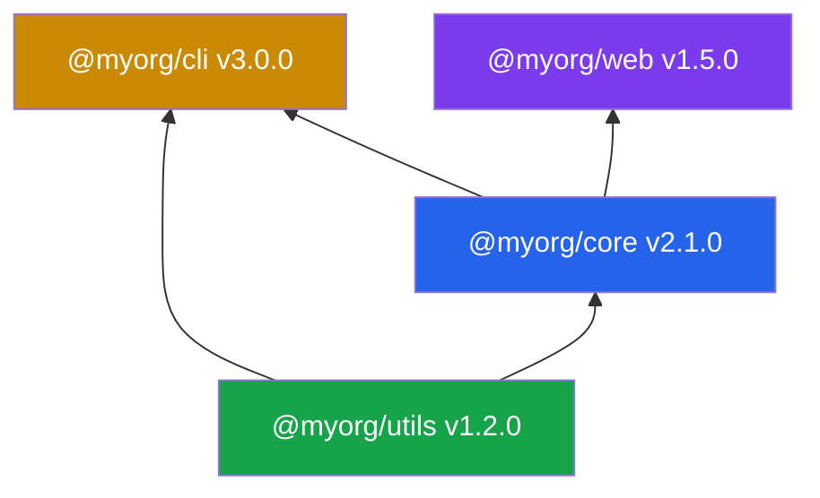

# Release Engineering

Release engineering is the discipline of getting software from a developer's machine to production reliably, reproducibly, and safely. It sounds simple until you need to coordinate changelogs across a monorepo, sign artifacts for supply chain security, publish packages to five registries simultaneously, and roll back a bad release at 2 AM.

This page covers the full release lifecycle: how to version your software, automate changelogs, choose a release strategy, publish to package registries, and coordinate releases in monorepos.

**Related**: [Deployment Strategies](/devops/deployment-strategies) | [Monitoring](/devops/monitoring) | [Incident Response](/devops/incident-response)

---

## Semantic Versioning Deep Dive

Semantic versioning (SemVer) is the dominant versioning scheme for libraries and frameworks. The format is `MAJOR.MINOR.PATCH`, but the rules behind it are more nuanced than most developers realize.

### The Rules

```
Given version MAJOR.MINOR.PATCH:

MAJOR — Incompatible API changes (breaking changes)
MINOR — New functionality, backwards-compatible
PATCH — Bug fixes, backwards-compatible
```



### Pre-release and Build Metadata

```
1.0.0-alpha.1        Pre-release: alpha
1.0.0-beta.3         Pre-release: beta
1.0.0-rc.1           Pre-release: release candidate
1.0.0+build.456      Build metadata (ignored in precedence)
1.0.0-beta.1+sha.abc Both pre-release and build metadata
```

### Version Ranges in Package Managers

| Syntax | Meaning | Example |
|--------|---------|---------|
| `^1.2.3` | Compatible with 1.x.x (>=1.2.3, <2.0.0) | npm default |
| `~1.2.3` | Approximately 1.2.x (>=1.2.3, <1.3.0) | Patch-level only |
| `>=1.2.3` | At least 1.2.3 | Minimum version |
| `1.2.x` | Any patch version of 1.2 | Wildcard |
| `*` | Any version | Dangerous |
| `1.2.3 - 2.0.0` | Range inclusive | Explicit range |

::: warning
**The caret (`^`) is npm's default and allows MINOR updates.** This means `^1.2.3` will install `1.9.9` if available. For libraries that do not follow SemVer strictly, this can introduce breaking changes. Use lockfiles (`package-lock.json`, `yarn.lock`, `pnpm-lock.yaml`) to pin exact installed versions.
:::

### When SemVer Gets Hard

| Scenario | What Version to Bump? |
|----------|----------------------|
| Dropping Node.js 16 support | **MAJOR** — consumers on Node 16 break |
| Fixing a bug that people depend on | **MAJOR** (technically), but often **PATCH** with a note |
| Adding a new optional parameter to a function | **MINOR** |
| Changing the type of an exported TypeScript type | **MAJOR** — type consumers break |
| Improving performance with no API change | **PATCH** |
| Removing a deprecated API | **MAJOR** |
| Adding a peer dependency | **MAJOR** — consumers must install it |

### CalVer: The Alternative

Some projects use calendar-based versioning instead:

| Project | Format | Example |
|---------|--------|---------|
| Ubuntu | `YY.MM` | `24.04` |
| pip | `YY.N` | `24.0` |
| Terraform | `MAJOR.MINOR.PATCH` but releases monthly | `1.7.0` |
| Black (Python) | `YY.MM.MICRO` | `24.3.0` |

CalVer works well for projects where "backwards compatibility" is not the primary concern — applications, distributions, and tools with rolling updates.

## Conventional Commits

Conventional Commits is a specification for writing structured commit messages that can be parsed by automation tools to generate changelogs and determine version bumps.

### The Format

```
<type>[optional scope]: <description>

[optional body]

[optional footer(s)]
```

### Commit Types

| Type | SemVer Impact | Description |
|------|---------------|-------------|
| `feat` | MINOR | New feature |
| `fix` | PATCH | Bug fix |
| `docs` | None | Documentation only |
| `style` | None | Formatting, whitespace |
| `refactor` | None | Code change that neither fixes nor adds |
| `perf` | PATCH | Performance improvement |
| `test` | None | Adding or fixing tests |
| `build` | None | Build system or dependencies |
| `ci` | None | CI configuration |
| `chore` | None | Other maintenance |

### Breaking Changes

```
feat(auth)!: replace session tokens with JWT

BREAKING CHANGE: The /api/auth/session endpoint now returns a JWT
instead of a session cookie. All clients must update their
authentication handling.

Closes #1234
```

The `!` after the type/scope and the `BREAKING CHANGE:` footer both signal a MAJOR version bump.

### Enforcing Conventional Commits

```json
// .commitlintrc.json
{
  "extends": ["@commitlint/config-conventional"],
  "rules": {
    "type-enum": [2, "always", [
      "feat", "fix", "docs", "style", "refactor",
      "perf", "test", "build", "ci", "chore"
    ]],
    "subject-max-length": [2, "always", 72],
    "body-max-line-length": [2, "always", 100]
  }
}
```

```json
// package.json — husky + commitlint
{
  "scripts": {
    "prepare": "husky"
  }
}
```

```bash
# .husky/commit-msg
npx --no -- commitlint --edit "$1"
```

## Changelog Automation

With conventional commits, changelogs write themselves.

### Tools

| Tool | Approach | Best For |
|------|----------|----------|
| **conventional-changelog** | Parses git log, generates CHANGELOG.md | Simple single-package repos |
| **release-please** | GitHub Action, creates release PRs | Google-style release workflow |
| **semantic-release** | Fully automated, publishes to registry | Hands-off CI/CD publishing |
| **changesets** | Developer-authored change descriptions | Monorepos with human-readable changelogs |
| **cliff** (git-cliff) | Highly configurable, Rust-based | Custom changelog formats |

### semantic-release Pipeline



### semantic-release Configuration

```json
// .releaserc.json
{
  "branches": ["main"],
  "plugins": [
    "@semantic-release/commit-analyzer",
    "@semantic-release/release-notes-generator",
    "@semantic-release/changelog",
    "@semantic-release/npm",
    "@semantic-release/github",
    ["@semantic-release/git", {
      "assets": ["CHANGELOG.md", "package.json"],
      "message": "chore(release): ${nextRelease.version} [skip ci]"
    }]
  ]
}
```

## Release Strategies

### Comparison

| Strategy | Release Cadence | Risk | Coordination Overhead |
|----------|----------------|------|----------------------|
| **Continuous Delivery** | Every merge to main | Low per release | Low |
| **Release Trains** | Fixed schedule (weekly/biweekly) | Medium (batched changes) | Medium |
| **Feature Releases** | When feature is complete | Variable | High |
| **LTS + Current** | Parallel tracks | Low (LTS) / Medium (Current) | High |

### Release Trains

A release train departs on schedule, regardless of what is on it. Features that are not ready wait for the next train.



::: tip
**Release trains** work well for medium-to-large teams. They create a predictable cadence that marketing, support, and documentation teams can plan around. The key rule: **the train leaves on time**. If a feature is not ready, it does not delay the train — it waits for the next one.
:::

### Continuous Delivery

Every merge to the default branch is a potential release. The pipeline decides whether to publish based on commit analysis.

```yaml
# GitHub Actions — release on every merge to main
name: Release
on:
  push:
    branches: [main]

jobs:
  release:
    runs-on: ubuntu-latest
    steps:
      - uses: actions/checkout@v4
        with:
          fetch-depth: 0
      - uses: actions/setup-node@v4
        with:
          node-version: 20
      - run: npm ci
      - run: npx semantic-release
        env:
          GITHUB_TOKEN: ${{ secrets.GITHUB_TOKEN }}
          NPM_TOKEN: ${{ secrets.NPM_TOKEN }}
```

## Package Publishing Pipelines

### npm (JavaScript/TypeScript)

```yaml
# .github/workflows/publish-npm.yml
jobs:
  publish:
    runs-on: ubuntu-latest
    permissions:
      contents: read
      id-token: write  # Required for npm provenance
    steps:
      - uses: actions/checkout@v4
      - uses: actions/setup-node@v4
        with:
          node-version: 20
          registry-url: 'https://registry.npmjs.org'
      - run: npm ci
      - run: npm test
      - run: npm publish --provenance --access public
        env:
          NODE_AUTH_TOKEN: ${{ secrets.NPM_TOKEN }}
```

### PyPI (Python)

```yaml
# .github/workflows/publish-pypi.yml
jobs:
  publish:
    runs-on: ubuntu-latest
    environment: release
    permissions:
      id-token: write  # Trusted publishing
    steps:
      - uses: actions/checkout@v4
      - uses: actions/setup-python@v5
        with:
          python-version: '3.12'
      - run: pip install build
      - run: python -m build
      - uses: pypa/gh-action-pypi-publish@release/v1
        # No token needed — uses OIDC trusted publishing
```

### Docker Hub

```yaml
# .github/workflows/publish-docker.yml
jobs:
  publish:
    runs-on: ubuntu-latest
    steps:
      - uses: actions/checkout@v4
      - uses: docker/setup-buildx-action@v3
      - uses: docker/login-action@v3
        with:
          username: ${{ secrets.DOCKERHUB_USERNAME }}
          password: ${{ secrets.DOCKERHUB_TOKEN }}
      - uses: docker/build-push-action@v5
        with:
          push: true
          tags: |
            myorg/myapp:${{ github.ref_name }}
            myorg/myapp:latest
          platforms: linux/amd64,linux/arm64
```

### Publishing Checklist

| Step | Why |
|------|-----|
| Run full test suite | Never publish untested code |
| Build from clean checkout | Avoid leaking local state |
| Verify package contents | `npm pack --dry-run`, `python -m build` |
| Tag the git commit | Link published artifact to exact source |
| Generate provenance | Prove the artifact came from your CI |
| Test the published package | `npm install yourpkg@latest` in a clean env |

## Artifact Signing and Verification

Supply chain attacks (SolarWinds, ua-parser-js, event-stream) have made artifact signing critical.

### Signing Methods

| Method | Tool | Ecosystem |
|--------|------|-----------|
| **npm provenance** | npm CLI + Sigstore | npm packages |
| **Sigstore cosign** | cosign | Container images, binaries |
| **GPG signing** | gpg | Git tags, Debian/RPM packages |
| **Apple notarization** | codesign + notarytool | macOS binaries |
| **Windows Authenticode** | signtool | Windows binaries |

### Sigstore: Keyless Signing

```bash
# Sign a container image (keyless — uses OIDC identity)
cosign sign myregistry.io/myapp:v1.2.3

# Verify a container image
cosign verify myregistry.io/myapp:v1.2.3 \
  --certificate-identity=ci@myorg.com \
  --certificate-oidc-issuer=https://token.actions.githubusercontent.com
```

::: danger
**Never commit signing keys to your repository.** Use CI/CD secrets, hardware security modules (HSMs), or keyless signing (Sigstore) instead. A leaked signing key compromises the entire trust chain for all your artifacts.
:::

### npm Provenance

npm provenance links a published package to its source commit and CI build:

```json
// Provenance attestation (automatically generated)
{
  "predicateType": "https://slsa.dev/provenance/v1",
  "predicate": {
    "buildDefinition": {
      "externalParameters": {
        "workflow": ".github/workflows/publish.yml",
        "ref": "refs/tags/v1.2.3"
      }
    },
    "runDetails": {
      "builder": {
        "id": "https://github.com/actions/runner"
      }
    }
  }
}
```

## Monorepo Release Coordination

Releasing multiple interdependent packages from a single repository is one of the hardest problems in release engineering.

### Changesets

Changesets is the most popular tool for monorepo release coordination. Developers create "changeset" files describing their changes, and the tool handles versioning and changelog generation.



### Changeset File Format

```markdown
---
"@myorg/core": minor
"@myorg/utils": patch
"@myorg/cli": minor
---

Added new `transform` API to core package.
Updated utils to support the new transform types.
CLI now exposes the transform command.
```

### Lerna

Lerna (now maintained by Nx) takes a more automated approach:

```json
// lerna.json
{
  "version": "independent",
  "npmClient": "pnpm",
  "command": {
    "version": {
      "conventionalCommits": true,
      "message": "chore(release): publish"
    },
    "publish": {
      "registry": "https://registry.npmjs.org"
    }
  }
}
```

| Mode | Behavior |
|------|----------|
| **Fixed** (`"version": "1.0.0"`) | All packages share one version number |
| **Independent** (`"version": "independent"`) | Each package versioned independently |

### Monorepo Dependency Graph

When publishing packages that depend on each other, order matters:



Publish in topological order: `utils` first, then `core`, then `cli` and `web`. If `core` bumps a major version, all dependents need their dependency range updated, potentially triggering their own version bumps.

## Release Automation Best Practices

| Practice | Why |
|----------|-----|
| **Automate everything** | Manual releases are error-prone and unrepeatable |
| **Use lockfiles** | Ensure builds are reproducible |
| **Publish from CI only** | Never `npm publish` from a developer laptop |
| **Pin CI action versions** | `actions/checkout@v4` not `actions/checkout@main` |
| **Test the release artifact** | Install your own package in a clean environment |
| **Keep releases small** | Smaller releases are easier to debug and roll back |
| **Write migration guides for majors** | Your users need to know what changed and how to update |
| **Maintain a security policy** | `SECURITY.md` with disclosure instructions and supported versions |

## Further Reading

- [Semantic Versioning Specification](https://semver.org/) — The official SemVer spec
- [Conventional Commits](https://www.conventionalcommits.org/) — The commit message specification
- [semantic-release](https://semantic-release.gitbook.io/) — Fully automated version management and publishing
- [Changesets](https://github.com/changesets/changesets) — Monorepo-friendly release management
- [Sigstore](https://www.sigstore.dev/) — Keyless signing for open source
- [SLSA Framework](https://slsa.dev/) — Supply chain integrity levels
- [Deployment Strategies](/devops/deployment-strategies) — What happens after you release
- [Monitoring](/devops/monitoring) — How to verify your release is healthy in production
