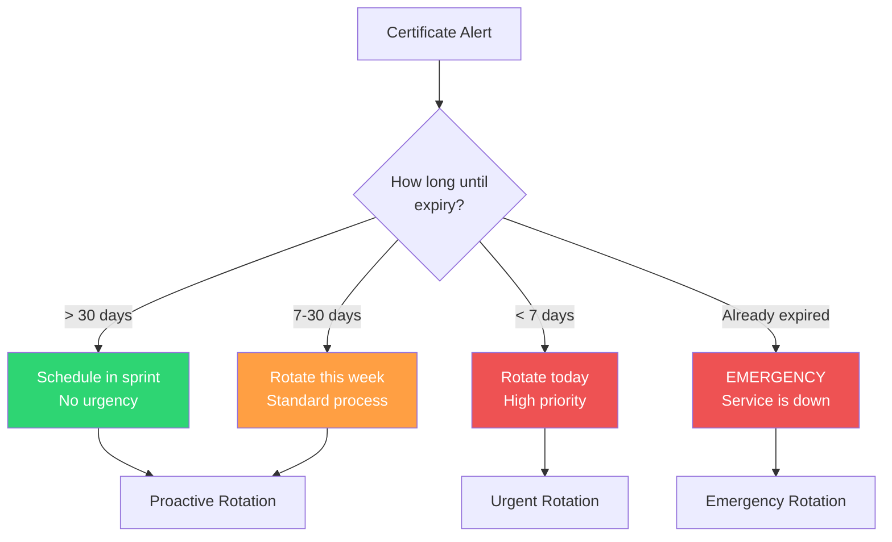

# Certificate Rotation Runbook

## Overview

TLS certificates expire. When they do, your service becomes inaccessible — browsers show security warnings, API clients reject connections, and mobile apps stop working. Certificate expiry is the most preventable cause of outages, yet it remains one of the most common. Every major tech company has had a certificate-related outage, including Microsoft (Teams, 2020), Spotify (2020), and Equifax (2017 — an expired certificate masked a data breach for 76 days).

This runbook covers both **proactive rotation** (certificate is expiring soon, you have time) and **emergency rotation** (certificate has already expired, service is down).

**Related**: [Security Review Checklist](/devops/checklists/security-review) | [Pre-Launch Checklist](/devops/checklists/pre-launch) | [Observability Readiness Checklist](/devops/checklists/observability-readiness) | [Incident Response](/devops/incident-response/)

---

## Scenario Classification

| Scenario | Urgency | Time Available | Procedure |
|---|---|---|---|
| Certificate expires in > 30 days | Low | Plan during sprint | [Proactive Rotation](#proactive-rotation) |
| Certificate expires in 7-30 days | Medium | This week | [Proactive Rotation](#proactive-rotation) (prioritize) |
| Certificate expires in < 7 days | High | Today | [Urgent Rotation](#urgent-rotation) |
| Certificate has expired | **Critical — SEV1** | Right now | [Emergency Rotation](#emergency-rotation) |



---

## Prerequisites

- [ ] Access to the certificate authority (Let's Encrypt, DigiCert, internal CA)
- [ ] Access to DNS management (for DNS-01 challenge validation)
- [ ] `kubectl` access to the production cluster
- [ ] Access to the secrets management system (Vault, AWS Secrets Manager, or K8s Secrets)
- [ ] `openssl` installed locally

### Certificate Inventory

| Domain | Certificate Type | Issuer | Location | Auto-Renew? |
|---|---|---|---|---|
| `*.example.com` | Wildcard | Let's Encrypt | Kubernetes Secret `tls-wildcard` | cert-manager |
| `api.example.com` | Single domain | DigiCert | AWS ACM `arn:aws:acm:...` | ACM auto-renew |
| `internal.example.com` | Internal CA | Vault PKI | Vault `pki/issue/internal` | Vault auto-renew |
| `mTLS service mesh` | mTLS | Istio CA | Istio auto-rotation | Yes |

---

## Proactive Rotation

Use this procedure when you have time (> 7 days until expiry).

### Step 1: Check Current Certificate Details

```bash
# Check certificate expiry for a domain
echo | openssl s_client -servername api.example.com -connect api.example.com:443 2>/dev/null \
  | openssl x509 -noout -dates -subject -issuer

# Check certificate in Kubernetes Secret
kubectl get secret tls-wildcard -n ingress -o jsonpath='{.data.tls\.crt}' \
  | base64 -d | openssl x509 -noout -dates -subject -issuer

# Check all certificates expiring within 30 days
kubectl get secrets -A -o json | jq -r '
  .items[] | select(.type == "kubernetes.io/tls") |
  "\(.metadata.namespace)/\(.metadata.name)"
' | while read secret; do
  ns=$(echo $secret | cut -d'/' -f1)
  name=$(echo $secret | cut -d'/' -f2)
  expiry=$(kubectl get secret $name -n $ns -o jsonpath='{.data.tls\.crt}' \
    | base64 -d | openssl x509 -noout -enddate 2>/dev/null | cut -d= -f2)
  echo "$secret expires: $expiry"
done
```

### Step 2: Generate New Certificate

#### Option A: Let's Encrypt with cert-manager (Automated)

If you are using cert-manager, rotation may be automatic. Check:

```bash
# Check cert-manager Certificate resource
kubectl get certificate -A

# Check if cert-manager is handling renewal
kubectl describe certificate my-cert -n ingress

# If cert-manager is stuck, trigger manual renewal
kubectl delete secret tls-wildcard -n ingress
# cert-manager will detect the missing secret and issue a new one

# Monitor cert-manager logs
kubectl logs -l app=cert-manager -n cert-manager --tail=50 -f
```

#### Option B: Let's Encrypt with certbot (Manual)

```bash
# Generate new certificate using DNS-01 challenge
sudo certbot certonly \
  --manual \
  --preferred-challenges dns \
  -d "*.example.com" \
  -d "example.com"

# Follow the prompts to create DNS TXT records
# Verify DNS propagation before confirming
dig TXT _acme-challenge.example.com

# Certificate files will be at:
# /etc/letsencrypt/live/example.com/fullchain.pem  (certificate + chain)
# /etc/letsencrypt/live/example.com/privkey.pem    (private key)
```

#### Option C: Commercial CA (DigiCert, Sectigo)

```bash
# Generate a new CSR (Certificate Signing Request)
openssl req -new -newkey rsa:2048 -nodes \
  -keyout api.example.com.key \
  -out api.example.com.csr \
  -subj "/C=US/ST=California/L=San Francisco/O=Example Inc/CN=api.example.com"

# Verify the CSR
openssl req -verify -in api.example.com.csr -text -noout

# Submit CSR to your CA through their portal
# Download the issued certificate and intermediate chain
```

#### Option D: Internal CA (HashiCorp Vault)

```bash
# Issue a new certificate from Vault PKI
vault write pki/issue/internal-cert \
  common_name="internal.example.com" \
  alt_names="service-a.internal,service-b.internal" \
  ttl="8760h"

# Save the output
vault write -format=json pki/issue/internal-cert \
  common_name="internal.example.com" \
  ttl="8760h" > cert-output.json

# Extract certificate and key
cat cert-output.json | jq -r '.data.certificate' > tls.crt
cat cert-output.json | jq -r '.data.private_key' > tls.key
cat cert-output.json | jq -r '.data.ca_chain[]' >> tls.crt
```

### Step 3: Validate the New Certificate

```bash
# Verify the certificate matches the private key
openssl x509 -noout -modulus -in tls.crt | md5sum
openssl rsa -noout -modulus -in tls.key | md5sum
# Both md5sums MUST match

# Verify the certificate chain is complete
openssl verify -CAfile /etc/ssl/certs/ca-certificates.crt tls.crt

# Check certificate details
openssl x509 -in tls.crt -noout -text | head -30

# Verify Subject Alternative Names (SANs)
openssl x509 -in tls.crt -noout -ext subjectAltName
```

::: danger Chain Completeness
The most common certificate deployment failure is an incomplete chain. The certificate must include the full chain: leaf certificate + intermediate certificate(s). If you only deploy the leaf certificate, some clients (particularly mobile apps and older browsers) will fail to validate it.

```bash
# Verify chain completeness
openssl s_client -showcerts -servername api.example.com -connect api.example.com:443 < /dev/null 2>/dev/null \
  | grep -c "BEGIN CERTIFICATE"
# Should return 2 or more (leaf + intermediate(s))
```
:::

### Step 4: Deploy the Certificate

#### Kubernetes Ingress

```bash
# Update the Kubernetes Secret
kubectl create secret tls tls-wildcard \
  --cert=tls.crt \
  --key=tls.key \
  --namespace=ingress \
  --dry-run=client -o yaml \
  | kubectl apply -f -

# Verify the ingress picked up the new certificate
# (Nginx ingress reloads automatically)
kubectl logs -l app.kubernetes.io/name=ingress-nginx -n ingress --tail=10

# Force a reload if needed
kubectl rollout restart deployment/ingress-nginx-controller -n ingress
```

#### AWS Application Load Balancer

```bash
# Import new certificate to ACM
aws acm import-certificate \
  --certificate fileb://tls.crt \
  --private-key fileb://tls.key \
  --certificate-chain fileb://chain.pem \
  --certificate-arn arn:aws:acm:us-east-1:123456789:certificate/abc-123

# Or if using a new ACM certificate, update the listener
aws elbv2 modify-listener \
  --listener-arn arn:aws:elasticloadbalancing:us-east-1:123456789:listener/app/my-alb/abc123/def456 \
  --certificates CertificateArn=arn:aws:acm:us-east-1:123456789:certificate/abc-123
```

#### CloudFlare

```bash
# Upload custom certificate via API
curl -X POST "https://api.cloudflare.com/client/v4/zones/{zone_id}/custom_certificates" \
  -H "Authorization: Bearer $CF_API_TOKEN" \
  -H "Content-Type: application/json" \
  -d "{
    \"certificate\": \"$(cat tls.crt)\",
    \"private_key\": \"$(cat tls.key)\",
    \"bundle_method\": \"ubiquitous\"
  }"
```

### Step 5: Verify Deployment

```bash
# Verify the new certificate is being served
echo | openssl s_client -servername api.example.com -connect api.example.com:443 2>/dev/null \
  | openssl x509 -noout -dates -serial

# Compare serial number with the new certificate
openssl x509 -in tls.crt -noout -serial
# Both serials should match

# Test from multiple locations (use online tools or curl from different regions)
curl -vI https://api.example.com 2>&1 | grep -A5 "Server certificate"

# Run SSL Labs test
echo "Run: https://www.ssllabs.com/ssltest/analyze.html?d=api.example.com"
```

---

## Urgent Rotation

When the certificate expires in less than 7 days, follow the [Proactive Rotation](#proactive-rotation) procedure but with these modifications:

1. **Skip the sprint planning** — do it now
2. **Pair with another engineer** — reduce risk of mistakes under time pressure
3. **Have the rollback ready** — if the new cert deployment fails, know how to revert
4. **Notify stakeholders** — let the team know you are rotating a certificate

---

## Emergency Rotation

When the certificate has already expired and the service is down.

::: danger Service is Down
Users are seeing security warnings or connection failures. Every minute counts.
:::

### Fastest Path to Recovery

```bash
# Step 1: Confirm certificate is expired (30 seconds)
echo | openssl s_client -servername api.example.com -connect api.example.com:443 2>/dev/null \
  | openssl x509 -noout -dates
# If "notAfter" is in the past, the certificate is expired

# Step 2: If using cert-manager, force immediate renewal (2 minutes)
kubectl delete secret tls-wildcard -n ingress
kubectl annotate certificate my-cert -n ingress cert-manager.io/issuer-name- --overwrite
kubectl annotate certificate my-cert -n ingress cert-manager.io/issuer-name=letsencrypt-prod

# Watch cert-manager issue a new certificate
kubectl get events -n ingress --watch

# Step 3: If cert-manager is not available, use certbot (5-10 minutes)
sudo certbot certonly --manual --preferred-challenges dns \
  -d "*.example.com" -d "example.com" --force-renewal

# Step 4: Deploy immediately (see Step 4 in Proactive Rotation above)

# Step 5: Verify (1 minute)
curl -vI https://api.example.com 2>&1 | grep "SSL certificate verify ok"
```

### Temporary Mitigation (While Waiting for New Certificate)

If certificate generation takes time (commercial CA, approval required):

```bash
# Option 1: Temporarily terminate TLS at the CDN (if available)
# CloudFlare/Fastly can provide edge TLS while you fix the origin cert

# Option 2: If you have a valid certificate for a different domain,
# temporarily redirect traffic (DNS CNAME) — this is a hack and should be temporary

# Option 3: Deploy a self-signed certificate to restore HTTPS
# (Clients will see warnings, but API clients with cert verification disabled will work)
openssl req -x509 -newkey rsa:2048 -nodes \
  -keyout emergency.key -out emergency.crt \
  -days 7 -subj "/CN=api.example.com"

kubectl create secret tls tls-emergency \
  --cert=emergency.crt \
  --key=emergency.key \
  --namespace=ingress \
  --dry-run=client -o yaml | kubectl apply -f -
```

::: warning Self-Signed Certificates
A self-signed certificate is NOT a real fix — it is a bandage. Browsers will show a full-page warning. Mobile apps will reject it. Use it only to restore service for API clients that can bypass certificate validation, and replace with a real certificate as soon as possible.
:::

---

## Setting Up Monitoring to Prevent This

### Prevent Future Emergencies

- [ ] **cert-manager installed** with automatic renewal (renews 30 days before expiry)
- [ ] **Certificate expiry monitoring** with alerts at 30 days and 7 days
- [ ] **Certificate inventory** maintained and reviewed quarterly
- [ ] **Automated alerts** for certificates not managed by cert-manager

```yaml
# Prometheus alert for certificate expiry
apiVersion: monitoring.coreos.com/v1
kind: PrometheusRule
metadata:
  name: certificate-expiry-alerts
spec:
  groups:
    - name: certificates
      rules:
        - alert: CertificateExpiringSoon
          expr: |
            (probe_ssl_earliest_cert_expiry - time()) / 86400 < 30
          for: 1h
          labels:
            severity: warning
          annotations:
            summary: "Certificate expires in {​{ $value | humanize }​} days"
            description: "Certificate for {​{ $labels.instance }​} expires in {​{ $value | humanize }​} days"
            runbook_url: "https://wiki.example.com/runbooks/certificate-rotation"

        - alert: CertificateExpiringCritical
          expr: |
            (probe_ssl_earliest_cert_expiry - time()) / 86400 < 7
          for: 1h
          labels:
            severity: critical
          annotations:
            summary: "CRITICAL: Certificate expires in {​{ $value | humanize }​} days"
            description: "Certificate for {​{ $labels.instance }​} expires in less than 7 days!"
            runbook_url: "https://wiki.example.com/runbooks/certificate-rotation"

        - alert: CertificateExpired
          expr: |
            (probe_ssl_earliest_cert_expiry - time()) < 0
          for: 5m
          labels:
            severity: critical
          annotations:
            summary: "EXPIRED: Certificate for {​{ $labels.instance }​} has expired"
            runbook_url: "https://wiki.example.com/runbooks/certificate-rotation"
```

### Blackbox Exporter Configuration

```yaml
# Prometheus Blackbox Exporter — probes certificate expiry
modules:
  tls_check:
    prober: tcp
    timeout: 10s
    tcp:
      tls: true
      tls_config:
        insecure_skip_verify: false

# Prometheus scrape config
scrape_configs:
  - job_name: 'tls-certificates'
    metrics_path: /probe
    params:
      module: [tls_check]
    static_configs:
      - targets:
          - api.example.com:443
          - app.example.com:443
          - admin.example.com:443
    relabel_configs:
      - source_labels: [__address__]
        target_label: __param_target
      - source_labels: [__param_target]
        target_label: instance
      - target_label: __address__
        replacement: blackbox-exporter:9115
```

---

## Troubleshooting

| Problem | Cause | Fix |
|---|---|---|
| cert-manager not renewing | DNS challenge failing | Check cert-manager logs, verify DNS credentials |
| New cert deployed but old one still served | Ingress controller cached old cert | Restart ingress controller pods |
| "Certificate chain incomplete" errors | Missing intermediate certificate | Concatenate intermediate cert to leaf: `cat leaf.crt intermediate.crt > fullchain.crt` |
| Mobile app still fails after rotation | Certificate pinning in the app | Release app update with new pin, or use backup pin |
| Let's Encrypt rate limit exceeded | Too many renewals for the same domain | Wait 1 hour (5 per hour limit) or use staging endpoint |
| "Key does not match certificate" | Wrong private key | Regenerate both CSR and key together |

---

## Expected Timeline

| Scenario | Step | Expected Duration |
|---|---|---|
| **Proactive** (> 7 days) | Generate + deploy + verify | 30-60 minutes |
| **Urgent** (< 7 days) | Generate + deploy + verify | 30-60 minutes, same day |
| **Emergency** (expired) | cert-manager renewal | 5-10 minutes |
| **Emergency** (expired, manual) | Generate + deploy + verify | 15-30 minutes |

---

## Post-Rotation Tasks

- [ ] Verify the new certificate is being served correctly from all endpoints
- [ ] Delete the old certificate from secrets management
- [ ] Update the certificate inventory with new expiry date
- [ ] Verify monitoring alerts now show healthy expiry (> 30 days)
- [ ] If this was an emergency, schedule a postmortem to prevent recurrence
- [ ] Consider implementing cert-manager if not already in use
