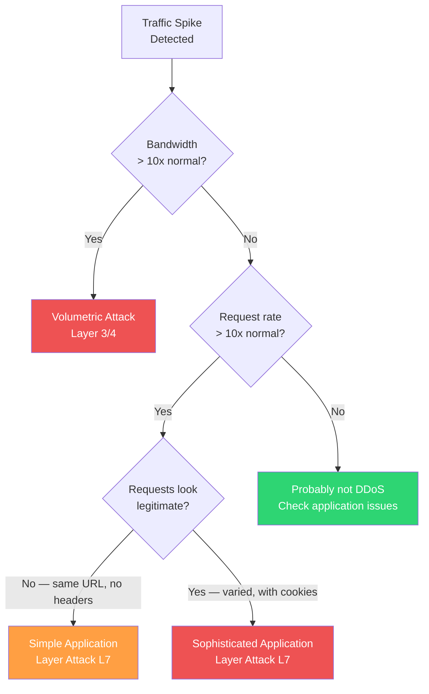

# DDoS Response Runbook

## Overview

A Distributed Denial of Service (DDoS) attack floods your infrastructure with traffic to overwhelm your services and make them unavailable to legitimate users. DDoS attacks range from unsophisticated volumetric floods (easy to mitigate with CDN rules) to application-layer attacks that mimic legitimate traffic (harder to detect and mitigate).

This runbook provides a systematic approach to identifying the type of attack, activating layered defenses, and communicating with stakeholders. The key insight is that DDoS mitigation is a layered defense — you do not rely on a single tool. Each layer filters out more malicious traffic until only legitimate requests reach your application.

**Related**: [Security Review Checklist](/devops/checklists/security-review) | [Service Degradation Runbook](/devops/runbooks/service-degradation) | [Incident Response](/devops/incident-response/) | [DDoS Response Runbook](/devops/runbooks/ddos-response)

---

## Attack Classification

Before you can mitigate, you must identify the type of attack:



| Attack Type | Layer | Characteristics | Difficulty to Mitigate |
|---|---|---|---|
| **Volumetric** (UDP flood, DNS amplification) | L3/L4 | Massive bandwidth, saturates network pipes | Easy — CDN/ISP absorbs |
| **Protocol** (SYN flood, Ping of Death) | L3/L4 | Exploits protocol weaknesses | Medium — firewall rules |
| **Simple Application** (HTTP flood) | L7 | High request rate, repetitive patterns, no cookies/JS | Medium — rate limiting, WAF rules |
| **Sophisticated Application** (slowloris, credential stuffing) | L7 | Low rate per IP, mimics real users, distributed | Hard — behavioral analysis |
| **Ransom DDoS** | Any | Accompanied by ransom demand | Varies — do NOT pay |

---

## Immediate Response (First 5 Minutes)

### Step 1: Confirm It Is a DDoS Attack

```bash
# Check traffic volume
# PromQL: sum(rate(http_requests_total[1m]))
# Compare to normal baseline (typically 100-500 RPS)

# Check unique source IPs
kubectl exec -it $(kubectl get pod -l app=ingress-nginx -n ingress -o jsonpath='{.items[0].metadata.name}') \
  -n ingress -- cat /var/log/nginx/access.log \
  | awk '{print $1}' | sort | uniq -c | sort -rn | head -20

# Check for traffic patterns
kubectl exec -it $(kubectl get pod -l app=ingress-nginx -n ingress -o jsonpath='{.items[0].metadata.name}') \
  -n ingress -- cat /var/log/nginx/access.log \
  | awk '{print $7}' | sort | uniq -c | sort -rn | head -20
# Look for: single URL getting hammered, or distributed across many URLs

# Check geographic distribution
# If using CloudFlare: check the CloudFlare dashboard for attack analytics
# If using AWS: check VPC Flow Logs or WAF dashboard
```

### Distinguish DDoS from Legitimate Traffic Surge

| Indicator | DDoS Attack | Legitimate Spike |
|---|---|---|
| Traffic source | Many IPs, few countries | Distributed globally |
| User agents | Identical or missing | Varied (Chrome, Safari, mobile) |
| Request patterns | Same URL repeatedly, or random | Natural distribution |
| Session behavior | No cookies, no JavaScript execution | Normal session flow |
| Time of day | Any time, sudden start | Correlates with events (launch, marketing) |
| Referrer headers | Missing or forged | Varied, legitimate sources |

::: warning False Positives
Before activating DDoS mitigation, verify it is actually an attack. Blocking legitimate traffic from a viral product launch or marketing campaign is worse than the attack itself. Check:
1. Did marketing send an email blast?
2. Was the product featured on Hacker News / Reddit / Product Hunt?
3. Is there a scheduled event (sale, launch) that could explain the traffic?
:::

### Step 2: Declare an Incident

```markdown
## Incident Declaration

**Severity**: SEV1 (if service impacted) / SEV2 (if mitigated by CDN)
**Channel**: #incident-ddos-[date]
**Incident Commander**: @[on-call engineer]

**Initial Assessment**:
- Attack type: [Volumetric / Application Layer / Unknown]
- Traffic volume: [X RPS, normal is Y RPS]
- Source: [Distributed / Concentrated in specific countries]
- Impact: [Service degraded / Service down / CDN absorbing]
- Duration so far: [X minutes]
```

---

## Layer 1: CDN & Edge Protection (5-10 Minutes)

Your CDN is the first line of defense. It can absorb volumetric attacks without any traffic reaching your origin.

### CloudFlare

```bash
# Enable "I'm Under Attack" mode (adds JS challenge to all visitors)
curl -X PATCH "https://api.cloudflare.com/client/v4/zones/{zone_id}/settings/security_level" \
  -H "Authorization: Bearer $CF_API_TOKEN" \
  -H "Content-Type: application/json" \
  -d '{"value": "under_attack"}'

# Create a firewall rule to challenge suspicious traffic
curl -X POST "https://api.cloudflare.com/client/v4/zones/{zone_id}/firewall/rules" \
  -H "Authorization: Bearer $CF_API_TOKEN" \
  -H "Content-Type: application/json" \
  -d '[{
    "filter": {
      "expression": "(http.request.uri.path eq \"/api/v1/target-endpoint\") and (cf.threat_score gt 10)",
      "description": "Challenge suspicious requests to targeted endpoint"
    },
    "action": "challenge",
    "description": "DDoS mitigation — challenge suspicious traffic"
  }]'

# Enable rate limiting rule
curl -X POST "https://api.cloudflare.com/client/v4/zones/{zone_id}/rate_limits" \
  -H "Authorization: Bearer $CF_API_TOKEN" \
  -H "Content-Type: application/json" \
  -d '{
    "threshold": 100,
    "period": 60,
    "action": {
      "mode": "challenge",
      "timeout": 3600
    },
    "match": {
      "request": {
        "url_pattern": "*.example.com/*"
      }
    },
    "description": "DDoS mitigation rate limit"
  }'
```

### AWS CloudFront + WAF

```bash
# Enable AWS WAF rate-based rule
aws wafv2 create-rule-group \
  --name "ddos-mitigation" \
  --scope CLOUDFRONT \
  --capacity 100 \
  --rules '[{
    "Name": "RateLimit",
    "Priority": 1,
    "Statement": {
      "RateBasedStatement": {
        "Limit": 1000,
        "AggregateKeyType": "IP"
      }
    },
    "Action": { "Block": {} },
    "VisibilityConfig": {
      "SampledRequestsEnabled": true,
      "CloudWatchMetricsEnabled": true,
      "MetricName": "DDoSRateLimit"
    }
  }]' \
  --visibility-config SampledRequestsEnabled=true,CloudWatchMetricsEnabled=true,MetricName=DDoSMitigation

# Enable AWS Shield Advanced (if available)
aws shield create-protection \
  --name "API Protection" \
  --resource-arn "arn:aws:elasticloadbalancing:us-east-1:123456789:loadbalancer/app/my-alb/abc123"
```

---

## Layer 2: Rate Limiting at the Application Level (5-10 Minutes)

If attack traffic reaches your origin, apply rate limiting at the ingress controller or application level.

### Nginx Ingress Rate Limiting

```bash
# Add rate limiting annotations to the ingress
kubectl annotate ingress my-service-ingress -n production \
  nginx.ingress.kubernetes.io/limit-rps="50" \
  nginx.ingress.kubernetes.io/limit-burst-multiplier="5" \
  nginx.ingress.kubernetes.io/limit-connections="20" \
  --overwrite

# Apply a more aggressive ConfigMap for the ingress controller
kubectl patch configmap ingress-nginx-controller -n ingress --type merge -p '{
  "data": {
    "limit-req-status-code": "429",
    "limit-conn-status-code": "429"
  }
}'
```

### Application-Level Rate Limiting

```bash
# Update application config to enable aggressive rate limiting
kubectl patch configmap my-service-config -n production --type merge -p '{
  "data": {
    "RATE_LIMIT_ENABLED": "true",
    "RATE_LIMIT_WINDOW_MS": "60000",
    "RATE_LIMIT_MAX_REQUESTS": "30",
    "RATE_LIMIT_BLOCK_DURATION_MS": "300000"
  }
}'
kubectl rollout restart deployment/my-service -n production
```

---

## Layer 3: Geo-Blocking (5 Minutes)

If the attack traffic is concentrated from specific regions where you have no legitimate users, block those regions.

```bash
# Identify attack source countries
# CloudFlare dashboard → Security → Overview → Top countries

# Block specific countries via CloudFlare
curl -X POST "https://api.cloudflare.com/client/v4/zones/{zone_id}/firewall/rules" \
  -H "Authorization: Bearer $CF_API_TOKEN" \
  -H "Content-Type: application/json" \
  -d '[{
    "filter": {
      "expression": "(ip.geoip.country in {\"RU\" \"CN\" \"KP\"})",
      "description": "Geo-block attack source countries"
    },
    "action": "block",
    "description": "DDoS mitigation — geo-block"
  }]'

# If using AWS WAF
aws wafv2 create-ip-set \
  --name "geo-block-set" \
  --scope CLOUDFRONT \
  --ip-address-version IPV4 \
  --addresses "0.0.0.0/0"
# Then create a geo-match rule in the WAF
```

::: warning Geo-Blocking Caveats
- Geo-blocking affects ALL traffic from those countries, including legitimate users
- Document which countries are blocked and create a task to remove blocks after the attack
- Consider using "challenge" instead of "block" — this allows legitimate users through while stopping bots
- Geo-blocking can be circumvented by VPNs/proxies, so it is not a complete solution
:::

### IP-Based Blocking

If you identify specific attacker IPs or CIDR ranges:

```bash
# Block specific IPs via CloudFlare
curl -X POST "https://api.cloudflare.com/client/v4/zones/{zone_id}/firewall/access_rules/rules" \
  -H "Authorization: Bearer $CF_API_TOKEN" \
  -H "Content-Type: application/json" \
  -d '{
    "mode": "block",
    "configuration": {
      "target": "ip_range",
      "value": "203.0.113.0/24"
    },
    "notes": "DDoS source — blocked during incident"
  }'

# Block at Kubernetes NetworkPolicy level (last resort)
kubectl apply -f - <<EOF
apiVersion: networking.k8s.io/v1
kind: NetworkPolicy
metadata:
  name: ddos-block
  namespace: production
spec:
  podSelector:
    matchLabels:
      app: my-service
  policyTypes:
    - Ingress
  ingress:
    - from:
        - ipBlock:
            cidr: 0.0.0.0/0
            except:
              - 203.0.113.0/24
              - 198.51.100.0/24
EOF
```

---

## Layer 4: Upstream Protection (10-15 Minutes)

If the attack is large enough to saturate your network bandwidth, you need upstream protection from your ISP or a DDoS mitigation service.

### Contact Your CDN/DDoS Mitigation Provider

| Provider | Emergency Contact | What to Request |
|---|---|---|
| CloudFlare | Enterprise: dedicated support channel | Enable Advanced DDoS Protection |
| AWS Shield | AWS Support (Business/Enterprise tier) | Engage DDoS Response Team (DRT) |
| Akamai | SOC: +1-XXX-XXX-XXXX | Enable Kona Site Defender |
| Fastly | support@fastly.com / in-app | Enable DDoS mitigation |

### Escalation Template for Provider

```markdown
Subject: DDoS Attack — Immediate Assistance Required

**Account**: [Account ID / Domain]
**Attack Start Time**: [HH:MM UTC]
**Attack Type**: [Volumetric / Application Layer / Mixed]
**Traffic Volume**: [X Gbps / Y million RPS]
**Source**: [Distributed / Concentrated in regions]
**Impact**: [Service degraded / Service down]
**Mitigation Applied**: [What you've done so far]
**Request**: [Activate advanced protection / Increase capacity / Custom rules]
```

---

## Layer 5: Application-Level Defenses (Ongoing)

### Slowloris / Low-and-Slow Attacks

These attacks use minimal bandwidth by opening connections and sending data very slowly, exhausting your connection limit.

```bash
# Reduce timeouts to close slow connections faster
kubectl patch configmap ingress-nginx-controller -n ingress --type merge -p '{
  "data": {
    "proxy-read-timeout": "10",
    "proxy-send-timeout": "10",
    "proxy-connect-timeout": "5",
    "keep-alive-requests": "100",
    "upstream-keepalive-timeout": "10"
  }
}'

# Limit concurrent connections per IP
kubectl annotate ingress my-service-ingress -n production \
  nginx.ingress.kubernetes.io/limit-connections="10" \
  --overwrite
```

### Bot Detection

```bash
# Block requests without a valid User-Agent
kubectl apply -f - <<EOF
apiVersion: networking.k8s.io/v1
kind: Ingress
metadata:
  name: my-service-ingress
  namespace: production
  annotations:
    nginx.ingress.kubernetes.io/server-snippet: |
      if (\$http_user_agent = "") {
        return 403;
      }
      if (\$http_user_agent ~* (bot|crawler|spider|scraper)) {
        return 403;
      }
EOF

# For more sophisticated bot detection, enable JavaScript challenges
# at the CDN level (CloudFlare Bot Management, AWS WAF Bot Control)
```

---

## Monitoring During the Attack

### Key Metrics to Watch

```promql
# Requests per second (total and by status code)
sum(rate(http_requests_total[1m])) by (status)

# Requests per second by country (if geo labels available)
sum(rate(http_requests_total[1m])) by (country)

# Bandwidth (bytes per second)
sum(rate(nginx_ingress_controller_response_size_sum[1m]))

# Connection count
nginx_ingress_controller_nginx_process_connections

# Error rate
sum(rate(http_requests_total{status=~"5.."}[1m])) / sum(rate(http_requests_total[1m]))

# CDN cache hit rate (higher is better during attack)
sum(rate(cloudflare_requests_total{status="cached"}[1m])) / sum(rate(cloudflare_requests_total[1m]))
```

### Dashboard Checklist During Attack

- [ ] Traffic volume graph — is it increasing, stable, or decreasing?
- [ ] Error rate — is the mitigation reducing errors?
- [ ] Legitimate traffic — are real users still getting through?
- [ ] CDN absorption rate — what percentage is the CDN handling?
- [ ] Origin load — is attack traffic reaching your servers?
- [ ] Latency — are response times acceptable for legitimate traffic?

---

## Communication

### Internal Communication (Immediately)

```markdown
## [ONGOING] DDoS Attack — [Service Name]

**Status**: Active mitigation in progress
**Severity**: SEV1
**Incident Commander**: @[name]
**Channel**: #incident-ddos-[date]

**Current Situation**:
- Attack started: [HH:MM UTC]
- Attack type: [Volumetric / Application Layer]
- Traffic: [X RPS, normal is Y RPS]
- User impact: [Degraded / Unavailable for some users]

**Mitigation Applied**:
1. [x] CDN protection activated (CloudFlare Under Attack mode)
2. [x] Rate limiting enabled at ingress
3. [ ] Geo-blocking applied for [countries]
4. [ ] ISP/CDN provider engaged

**Next Update**: [HH:MM UTC, in X minutes]
```

### External Communication (If Applicable)

```markdown
## Service Status Update

**Status**: Degraded Performance
**Updated**: [HH:MM UTC]

We are currently experiencing elevated traffic levels that are affecting
service performance. Our engineering team is actively mitigating the
situation. Some users may experience slower response times or
intermittent errors.

We will provide updates every 30 minutes until the situation is
resolved. We apologize for the inconvenience.

**Current Impact**:
- API response times may be elevated
- Some requests may receive 429 (rate limited) responses
- Core functionality is available but may be slower than usual
```

::: tip External Communication Guidelines
- **Do NOT** mention "DDoS attack" publicly unless your security team approves — it can encourage attackers
- **Do** acknowledge the impact and provide regular updates
- **Do** set expectations for resolution timeline
- **Do NOT** speculate about the source or motivation
:::

---

## Post-Attack Actions

Once the attack has subsided (traffic returns to normal levels):

### Immediate (Within 1 Hour)

- [ ] Remove emergency rate limits that may affect legitimate traffic
- [ ] Remove geo-blocks unless they are standard policy
- [ ] Verify service is fully recovered (error rates, latency normal)
- [ ] Send "resolved" communication to stakeholders
- [ ] Preserve logs and traffic data for analysis

### Short-Term (Within 24 Hours)

- [ ] Analyze attack traffic patterns for future prevention
- [ ] Update WAF rules based on attack signatures
- [ ] Review whether auto-mitigation can handle this type of attack
- [ ] File abuse reports with source network providers (if identifiable)
- [ ] Schedule postmortem

### Long-Term (Within 1 Week)

- [ ] Implement permanent CDN protection rules based on attack analysis
- [ ] Evaluate DDoS protection service tier (upgrade if needed)
- [ ] Implement automated DDoS detection and response
- [ ] Add DDoS simulation to game day exercises
- [ ] Update this runbook with lessons learned

---

## Prevention Measures

| Measure | Cost | Effectiveness | Implementation |
|---|---|---|---|
| CDN (CloudFlare, AWS CloudFront) | $/month | High for volumetric | Essential baseline |
| WAF rules | $ | Medium-High for L7 | Configure per application |
| Rate limiting | Free | Medium | Application + ingress config |
| Auto-scaling | Variable | Medium | Absorbs but may increase cost |
| Anycast DNS | $/month | High for DNS attacks | Use CloudFlare / Route53 |
| DDoS protection service | $$$/ month | Very High | Enterprise requirement |
| Bot management | $$/month | High for sophisticated L7 | CloudFlare Bot Mgmt / DataDome |

---

## Troubleshooting

| Problem | Cause | Fix |
|---|---|---|
| CDN "Under Attack" mode blocks legitimate users | JavaScript challenge fails for API clients | Exempt API paths from JS challenge, use API-specific rate limiting |
| Geo-blocking blocks legitimate users | Attack sources overlap with user locations | Use challenge instead of block; allow by ASN instead of country |
| Rate limiting causes 429 for legitimate users | Limits too aggressive | Increase limits gradually; use per-user instead of per-IP |
| Attack continues after all mitigations | Sophisticated L7 attack mimicking real traffic | Engage DDoS protection provider; implement behavioral analysis |
| Costs spike during attack (auto-scaling) | Auto-scaler responding to attack traffic | Set max replica limits; scale based on CPU, not request count |

---

## Expected Timeline

| Step | Expected Duration | Escalate If |
|---|---|---|
| Confirm DDoS attack | 2-5 minutes | Uncertainty > 10 minutes |
| Activate CDN protection | 5-10 minutes | CDN not responding |
| Rate limiting at ingress | 5 minutes | Configuration issues |
| Geo-blocking (if applicable) | 5 minutes | Cannot identify source |
| Engage upstream protection | 10-15 minutes | Provider unresponsive |
| **Total to initial mitigation** | **15-30 minutes** | **> 30 min with ongoing impact** |
| Full resolution | 1-4 hours | Attack persists > 4 hours |
