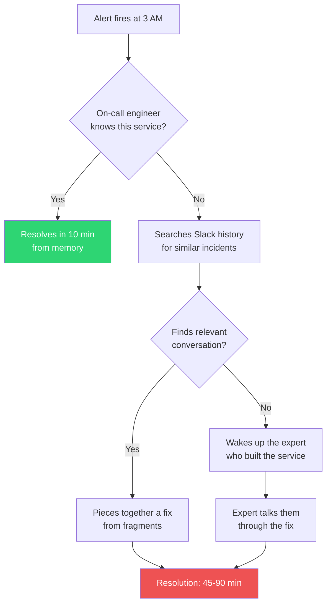
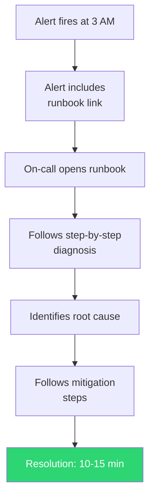
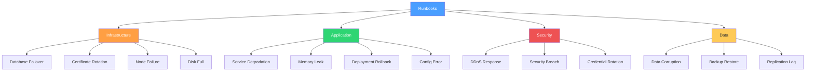
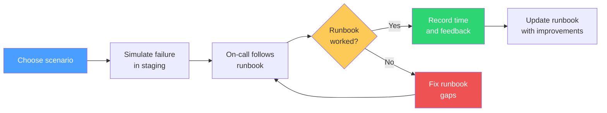

# Runbook Collection

A runbook is a set of step-by-step instructions that an on-call engineer follows to diagnose and resolve a specific operational scenario. The difference between a team that resolves incidents in 10 minutes and a team that takes 2 hours is almost never talent — it is preparation. Runbooks are that preparation.

The best runbooks are written by the engineer who just resolved an incident, while the details are still fresh. They are written for the worst-case reader: someone who has never seen this service, was woken up at 3 AM, and needs to stop the bleeding before they can think clearly. Every command should be copy-pasteable. Every decision should be a simple if/then. Every escalation path should be a name and a phone number.

**Related**: [Incident Response](/devops/incident-response/) | [Alert Design](/devops/alerting/alert-design) | [Observability Readiness Checklist](/devops/checklists/observability-readiness) | [On-Call Handbook](/devops/engineering-practices/on-call-handbook)

---

## Why Runbooks Matter

### The Problem

Without runbooks, incident response depends on individual knowledge:



With runbooks, incident response is democratized:



### The Data

| Metric | Without Runbooks | With Runbooks | Improvement |
|---|---|---|---|
| Mean time to mitigate (MTTM) | 47 minutes | 12 minutes | 74% faster |
| Escalation rate | 68% of incidents | 23% of incidents | 66% reduction |
| On-call engineer stress (1-10) | 7.8 | 3.2 | 59% reduction |
| Knowledge bus factor | 1-2 people per service | Any on-call engineer | Dramatically improved |
| Repeat incident resolution time | Same as first time | 50% faster each time | Continuous improvement |

---

## What Makes a Good Runbook

### The Five Qualities

1. **Specific** — written for one alert or one scenario, not a general "troubleshooting guide"
2. **Copy-pasteable** — every command can be copied and run as-is (with clearly marked placeholders)
3. **Decision-tree structured** — if/then branches for different root causes, not a wall of text
4. **Tested** — someone other than the author has followed it successfully
5. **Maintained** — updated after every incident that uses it

### Good vs Bad Runbooks

| Aspect | Bad Runbook | Good Runbook |
|---|---|---|
| Title | "Database Issues" | "Alert: PostgreSQL Replication Lag > 30s" |
| First step | "Check the database" | "Run: `kubectl exec -it pg-primary-0 -- psql -c 'SELECT pg_last_wal_replay_lsn()'`" |
| Diagnosis | "Look at the logs for errors" | "Check replication lag: Dashboard link. If lag > 60s, check for long-running queries: `SELECT pid, query, state FROM pg_stat_activity WHERE state != 'idle' ORDER BY query_start;`" |
| Mitigation | "Fix the issue" | "If caused by long-running query: `SELECT pg_cancel_backend(PID);`. If caused by network: restart replication: `pg_ctl promote /var/lib/postgresql/data`" |
| Escalation | "Contact the DBA" | "Escalate to @database-team in #db-incidents. DBA on-call: PagerDuty schedule link" |

::: danger The "Check the Logs" Anti-Pattern
If your runbook says "check the logs," it is not a runbook — it is a vague suggestion. A good runbook says:
```bash
# Check for errors in the last 15 minutes
kubectl logs -l app=my-service -n production --since=15m | grep -i error | tail -20

# Search for specific error patterns
kubectl logs -l app=my-service -n production --since=15m | grep "connection refused"
```
:::

---

## Runbook Template

Every runbook in this collection follows this template. Use it for your own services:

```markdown
---
title: "Alert: [Alert Name]"
service: [service-name]
severity: [critical/warning]
last_tested: [date]
last_updated: [date]
owner: [team-name]
---

# [Alert Name]

## Overview
One paragraph explaining what this alert means and why it matters.

## Impact
- **User-facing**: [What users experience]
- **Business**: [Revenue/data/reputation impact]
- **Blast radius**: [Which services/features are affected]

## Prerequisites
- Access to: [Kubernetes, AWS Console, Grafana, etc.]
- Tools: [kubectl, psql, redis-cli, etc.]

## Diagnosis

### Step 1: Assess severity
[Command to check current state]

### Step 2: Identify root cause
[Decision tree with commands for each branch]

### Step 3: Check recent changes
[Commands to check recent deployments, config changes, etc.]

## Mitigation

### Option A: [Most common fix]
[Step-by-step commands]

### Option B: [Second most common fix]
[Step-by-step commands]

### Option C: [Nuclear option / full rollback]
[Step-by-step commands]

## Verification
[Commands to verify the fix worked]

## Escalation
- **When to escalate**: [Criteria]
- **Who to contact**: [Names, PagerDuty schedules, Slack channels]
- **What to communicate**: [Template for escalation message]

## Post-Incident
- [ ] Update this runbook if the procedure has changed
- [ ] Create a postmortem if impact lasted > 15 minutes
- [ ] Update monitoring if this alert was noisy or missing
```

---

## Runbook Index

### Production Runbooks

| Runbook | Scenario | Severity | Est. Resolution |
|---|---|---|---|
| [Database Failover](/devops/runbooks/database-failover) | PostgreSQL primary failure → promote replica | Critical | 15-30 min |
| [Service Degradation](/devops/runbooks/service-degradation) | Service is slow or partially failing | Critical/Warning | 10-30 min |
| [Certificate Rotation](/devops/runbooks/certificate-rotation) | TLS certificate expiring or expired | Critical/Warning | 15-45 min |
| [DDoS Response](/devops/runbooks/ddos-response) | Traffic spike overwhelming infrastructure | Critical | 15-60 min |

### Runbook Categories



---

## Writing Effective Runbooks

### The Golden Rules

1. **Write it immediately after an incident** — you just spent an hour figuring out the fix. Spend 20 minutes writing it down so nobody ever has to spend that hour again.

2. **Write for copy-paste** — every command should work when pasted into a terminal. Use actual service names, namespaces, and paths. Mark placeholders clearly:

```bash
# Good: clear placeholders
kubectl rollout undo deployment/<SERVICE_NAME> -n <NAMESPACE>

# Better: actual values for this specific service
kubectl rollout undo deployment/payment-api -n production
```

3. **Write decision trees, not essays** — an on-call engineer needs to make decisions quickly:

```markdown
### Is the error rate above 50%?
- **Yes** → Go to [Complete Outage Mitigation](#complete-outage)
- **No** → Continue to next step

### Was there a recent deployment (last 2 hours)?
- **Yes** → Go to [Rollback Procedure](#rollback)
- **No** → Go to [Dependency Investigation](#dependencies)
```

4. **Include the "don't do this" section** — sometimes the intuitive fix makes things worse:

::: warning Things NOT To Do
- Do NOT restart all pods at once — this causes a complete outage during restart
- Do NOT delete the PVC — this destroys persistent data
- Do NOT modify the database directly — use the admin API
:::

5. **Include time estimates** — this helps the on-call decide when to escalate:

```markdown
## Expected Timeline
| Step | Expected Duration | Escalate If |
|---|---|---|
| Diagnosis | 5 minutes | > 10 minutes |
| Mitigation | 10 minutes | > 20 minutes |
| Verification | 5 minutes | Metrics don't recover in 15 min |
```

---

## Runbook Maintenance

### When to Update a Runbook

- After every incident where the runbook was used (add what worked, remove what did not)
- After every incident where a runbook should have existed but did not (create a new one)
- When infrastructure changes (new tools, new namespaces, new team structure)
- During quarterly review (test all runbooks with a tabletop exercise)

### Quarterly Review Process

- [ ] Each on-call engineer reads through runbooks for their services
- [ ] Verify all commands still work (service names, namespaces, tool versions)
- [ ] Verify all links still work (dashboards, wiki pages, PagerDuty schedules)
- [ ] Verify escalation contacts are still accurate
- [ ] Mark each runbook with `last_tested` date
- [ ] Remove runbooks for decommissioned services
- [ ] Identify gaps: which alerts have no runbook?

### Game Day Testing

The ultimate test of a runbook is a game day — a planned exercise where you simulate the incident and follow the runbook:



### Game Day Scenarios

| Scenario | What to Simulate | Difficulty |
|---|---|---|
| Database failover | Kill the primary database pod | Medium |
| Service degradation | Inject 5s latency on a dependency | Easy |
| Certificate expiry | Deploy a service with an expired cert | Easy |
| DDoS attack | Send 100x normal traffic with a load testing tool | Medium |
| Disk full | Fill a volume to 95% | Easy |
| Network partition | Add a network policy blocking a critical dependency | Hard |
| Data corruption | Insert invalid data through admin API | Hard |

---

## Runbook Anti-Patterns

| Anti-Pattern | Problem | Fix |
|---|---|---|
| **The novel** | 10-page runbook nobody reads under pressure | Keep under 2 pages. Link to deep-dive docs. |
| **The archaeologist** | Runbook written 2 years ago, never updated | Quarterly review cadence. `last_tested` date. |
| **The insider** | Assumes knowledge only the author has | Test with a new engineer. Explain all context. |
| **The optimist** | Only covers the happy path | Add "if this doesn't work" branches. |
| **The commander** | "Contact the DBA" — who? When? How? | Names, PagerDuty links, Slack channels. |
| **The theorist** | Explains why the system works, not how to fix it | Cut theory. Add commands. |

---

## Automation Opportunities

As runbooks mature, look for automation opportunities:

| Automation Level | Description | Example |
|---|---|---|
| **Level 0: Manual** | Human reads runbook and executes | On-call follows database failover steps |
| **Level 1: Assisted** | Script handles some steps, human decides | Script diagnoses the issue, human approves the fix |
| **Level 2: Supervised** | Script handles most steps, human approves | Auto-rollback requires human confirmation |
| **Level 3: Autonomous** | Fully automated, human notified | Auto-scaling, auto-restart, self-healing |

```bash
#!/bin/bash
# Example: Semi-automated runbook (Level 1)
# Diagnoses high error rate and suggests mitigation

echo "=== High Error Rate Diagnosis ==="

# Step 1: Check current error rate
ERROR_RATE=$(curl -s "http://prometheus:9090/api/v1/query?query=sum(rate(http_requests_total{status=~\"5..\"}[5m]))/sum(rate(http_requests_total[5m]))" | jq -r '.data.result[0].value[1]')
echo "Current error rate: ${ERROR_RATE}"

# Step 2: Check for recent deployments
echo ""
echo "=== Recent Deployments ==="
kubectl rollout history deployment/my-service -n production | tail -5

# Step 3: Check dependency health
echo ""
echo "=== Dependency Health ==="
kubectl get pods -n production -l tier=dependency --no-headers | awk '{print $1, $3}'

# Step 4: Suggest action
echo ""
echo "=== Suggested Action ==="
if [[ $(echo "$ERROR_RATE > 0.5" | bc -l) -eq 1 ]]; then
    echo "ERROR RATE > 50% — CRITICAL"
    echo "Suggested: Rollback to previous version"
    echo "Command: kubectl rollout undo deployment/my-service -n production"
else
    echo "ERROR RATE < 50% — Investigate dependencies and logs"
    echo "Command: kubectl logs -l app=my-service -n production --since=15m | grep ERROR | tail -20"
fi

echo ""
read -p "Execute suggested action? (y/n): " CONFIRM
```

---

## Further Reading

| Resource | Type | Key Takeaway |
|---|---|---|
| [Incident Response](/devops/incident-response/) | Internal | The broader incident response framework |
| [Postmortem Framework](/devops/incident-response/postmortem-framework) | Internal | How to learn from incidents and improve runbooks |
| [Alert Design](/devops/alerting/alert-design) | Internal | Designing alerts that link to runbooks |
| [Chaos Engineering](/devops/incident-response/chaos-engineering) | Internal | Testing runbooks with controlled failures |
| Google SRE Book, Ch. 15 | External | Postmortem culture at Google |
| PagerDuty Incident Response Guide | External | Industry-standard incident response practices |
