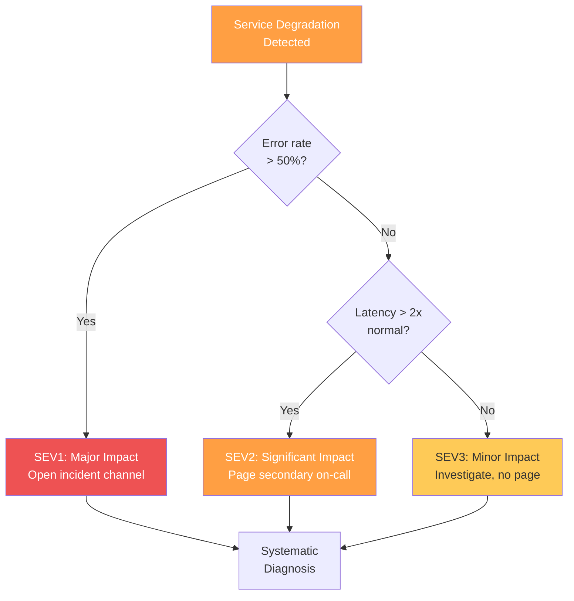
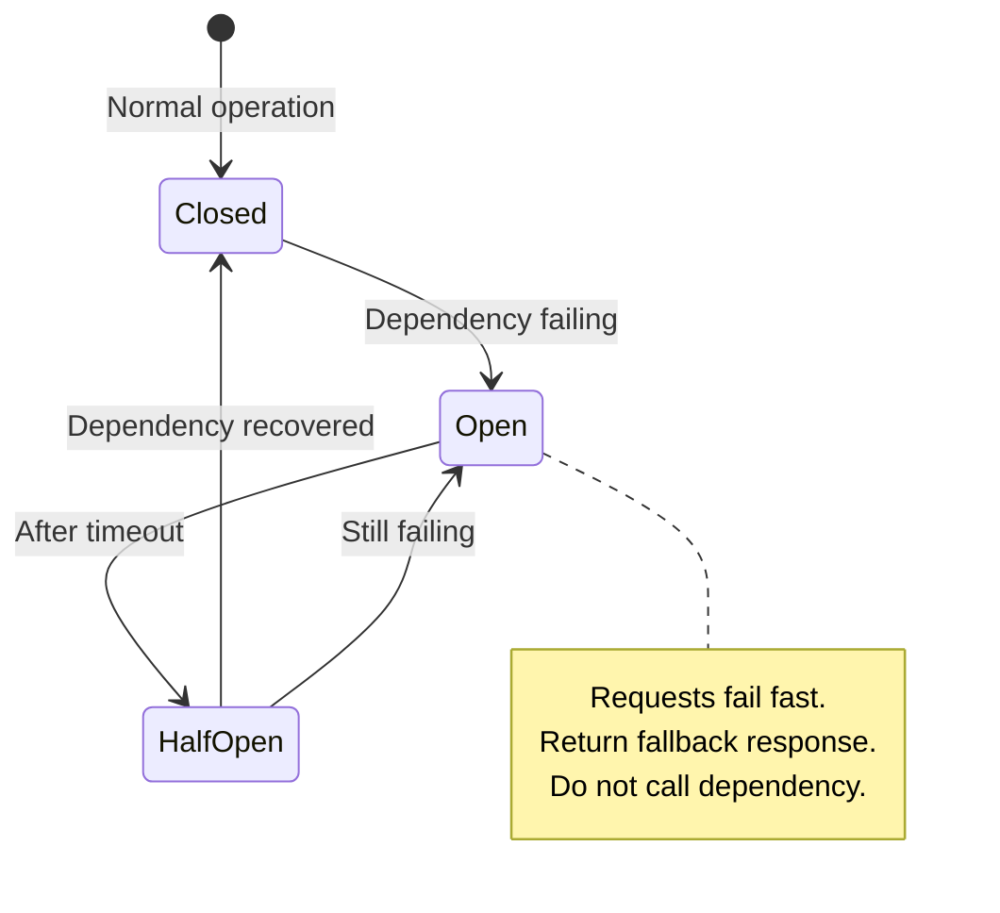
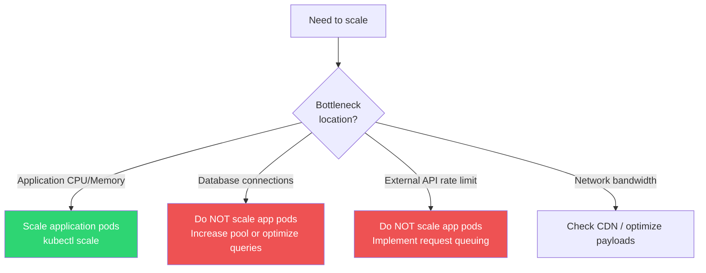

# Service Degradation Runbook

## Overview

Service degradation means the service is running but performing poorly — elevated error rates, increased latency, partial failures, or reduced throughput. Unlike a complete outage, degradation is insidious: it may affect only some users, some endpoints, or some regions, making it harder to detect and diagnose.

This runbook provides a systematic approach to identifying the degraded component, determining the root cause, and applying the appropriate mitigation strategy.

**Related**: [Database Failover Runbook](/devops/runbooks/database-failover) | [DDoS Response Runbook](/devops/runbooks/ddos-response) | [Performance Review Checklist](/devops/checklists/performance-review) | [Incident Response](/devops/incident-response/)

---

## Impact Assessment

Before diving into diagnosis, assess the blast radius:

| Question | How to Check | Action Based on Answer |
|---|---|---|
| What percentage of users are affected? | Error rate on dashboard | > 50% = SEV1, 10-50% = SEV2, < 10% = SEV3 |
| Which endpoints are degraded? | Per-endpoint latency/error dashboards | Focus diagnosis on affected endpoints |
| Is this getting worse or stable? | 15-minute trend on error rate graph | Getting worse = escalate immediately |
| When did it start? | Dashboard time range, deployment markers | Correlate with deploys, traffic changes, dependency issues |



---

## Systematic Diagnosis

Follow this decision tree to identify the root cause. Each step takes 1-2 minutes.

### Step 1: Was There a Recent Deployment?

```bash
# Check deployment history
kubectl rollout history deployment/my-service -n production

# Check when the last deployment happened
kubectl get deployment my-service -n production -o jsonpath='{.metadata.annotations.kubectl\.kubernetes\.io/last-applied-configuration}' | jq '.metadata.labels'

# Check deploy annotations on Grafana (visual correlation)
# Dashboard: https://grafana.example.com/d/my-service/overview
```

| Finding | Action |
|---|---|
| Deployment in last 2 hours and metrics degraded at deploy time | Go to [Rollback Procedure](#mitigation-5-rollback-deployment) |
| No recent deployment | Continue to Step 2 |
| Deployment, but degradation started before it | Continue to Step 2 |

### Step 2: Is a Dependency Down or Degraded?

```bash
# Check circuit breaker states
kubectl exec -it $(kubectl get pod -l app=my-service -n production -o jsonpath='{.items[0].metadata.name}') \
  -n production -- curl -s http://localhost:8080/actuator/health | jq '.components.circuitBreakers'

# Check dependency dashboards
# PostgreSQL: https://grafana.example.com/d/postgresql/overview
# Redis: https://grafana.example.com/d/redis/overview
# External APIs: https://grafana.example.com/d/external-deps/overview

# Quick dependency connectivity test
kubectl exec -it $(kubectl get pod -l app=my-service -n production -o jsonpath='{.items[0].metadata.name}') \
  -n production -- bash -c "
    echo '=== PostgreSQL ===' && pg_isready -h db-primary.example.com -p 5432
    echo '=== Redis ===' && redis-cli -h redis.example.com ping
    echo '=== External API ===' && curl -s -o /dev/null -w '%{http_code} %{time_total}s' https://api.external.com/health
  "
```

| Finding | Action |
|---|---|
| Database is down | Go to [Database Failover Runbook](/devops/runbooks/database-failover) |
| External dependency is slow/down | Go to [Activate Circuit Breaker](#mitigation-1-circuit-breaker) |
| All dependencies healthy | Continue to Step 3 |

### Step 3: Is Traffic Unusually High?

```bash
# Compare current RPS to baseline
# Check Prometheus/Grafana for traffic patterns
# PromQL: sum(rate(http_requests_total{service="my-service"}[5m]))

# Check if specific endpoints are spiking
kubectl exec -it $(kubectl get pod -l app=my-service -n production -o jsonpath='{.items[0].metadata.name}') \
  -n production -- curl -s http://localhost:8080/metrics | grep http_requests_total | sort -t'"' -k4 -rn | head -20
```

| Finding | Action |
|---|---|
| Traffic is 3x+ normal (potential DDoS) | Go to [DDoS Response Runbook](/devops/runbooks/ddos-response) |
| Traffic is 1.5-3x normal (organic spike) | Go to [Scale Up](#mitigation-4-scale-up) |
| Traffic is normal | Continue to Step 4 |

### Step 4: Are Resources Exhausted?

```bash
# Check CPU and memory
kubectl top pods -n production -l app=my-service

# Check for OOM kills
kubectl get events -n production --field-selector reason=OOMKilling --sort-by='.lastTimestamp' | tail -10

# Check for CPU throttling
kubectl exec -it $(kubectl get pod -l app=my-service -n production -o jsonpath='{.items[0].metadata.name}') \
  -n production -- cat /sys/fs/cgroup/cpu/cpu.stat

# Check connection pools
kubectl exec -it $(kubectl get pod -l app=my-service -n production -o jsonpath='{.items[0].metadata.name}') \
  -n production -- curl -s http://localhost:8080/actuator/metrics/hikaricp.connections | jq '.'

# Check disk usage
kubectl exec -it $(kubectl get pod -l app=my-service -n production -o jsonpath='{.items[0].metadata.name}') \
  -n production -- df -h
```

| Finding | Action |
|---|---|
| CPU near 100% | Go to [Scale Up](#mitigation-4-scale-up) or optimize hot path |
| Memory near limit / OOM kills | Increase memory limits or investigate memory leak |
| Connection pool exhausted | Go to [Shed Load](#mitigation-2-load-shedding) and tune pool |
| Disk full | Emergency cleanup, expand volume |
| Resources look normal | Continue to Step 5 |

### Step 5: Check Application Logs

```bash
# Recent error logs
kubectl logs -l app=my-service -n production --since=15m --tail=200 | grep -i "error\|exception\|fatal\|panic" | sort | uniq -c | sort -rn | head -20

# Look for specific patterns
kubectl logs -l app=my-service -n production --since=15m | grep -i "timeout\|connection refused\|circuit.open\|rate.limit" | tail -20

# Check for unusual patterns
kubectl logs -l app=my-service -n production --since=15m | grep -i "slow query\|deadlock\|lock timeout" | tail -20
```

---

## Mitigation Strategies

### Mitigation 1: Circuit Breaker

**When to use**: A downstream dependency is slow or failing, causing cascading latency and errors in your service.



```bash
# If using a circuit breaker library with runtime configuration:

# Option 1: Force open the circuit breaker (stop calling the dependency)
kubectl exec -it $(kubectl get pod -l app=my-service -n production -o jsonpath='{.items[0].metadata.name}') \
  -n production -- curl -X POST http://localhost:8080/admin/circuit-breaker/payment-service/force-open

# Option 2: Update circuit breaker config via ConfigMap
kubectl patch configmap my-service-config -n production --type merge -p '{
  "data": {
    "CIRCUIT_BREAKER_PAYMENT_ENABLED": "true",
    "CIRCUIT_BREAKER_PAYMENT_FAILURE_THRESHOLD": "3",
    "CIRCUIT_BREAKER_PAYMENT_TIMEOUT_MS": "5000"
  }
}'
kubectl rollout restart deployment/my-service -n production
```

**Fallback behaviors to implement:**

| Dependency | Fallback | User Experience |
|---|---|---|
| Payment service | Queue for retry, return "processing" | "Your order is being processed" |
| Recommendation engine | Return popular items | Less personalized, but functional |
| Cache (Redis) | Bypass cache, hit DB directly | Slower, but correct |
| Search service | Return "Search temporarily unavailable" | Degraded, but honest |
| Analytics/logging | Drop analytics events silently | No user impact |

::: tip Circuit Breaker vs Retry
Retries make sense for transient failures (network blip, momentary overload). Circuit breakers make sense for sustained failures (dependency is down, overloaded, or misconfigured). If you are retrying and the dependency is consistently failing, you are making the problem worse by adding 3x the load. Open the circuit breaker instead.
:::

---

### Mitigation 2: Load Shedding

**When to use**: The service is overwhelmed by traffic it cannot handle. Rather than everything being slow, deliberately reject some traffic so the rest can be served well.

```bash
# Option 1: Reduce connection limits at the ingress/load balancer level
kubectl annotate ingress my-service-ingress -n production \
  nginx.ingress.kubernetes.io/limit-rps="50" \
  nginx.ingress.kubernetes.io/limit-burst-multiplier="3" \
  --overwrite

# Option 2: Enable application-level rate limiting
kubectl patch configmap my-service-config -n production --type merge -p '{
  "data": {
    "RATE_LIMIT_ENABLED": "true",
    "RATE_LIMIT_RPS": "100",
    "RATE_LIMIT_BURST": "200"
  }
}'
kubectl rollout restart deployment/my-service -n production
```

**Load shedding priority matrix:**

| Priority | Traffic Type | Action During Overload |
|---|---|---|
| **Critical** | Health checks, authentication | Always serve |
| **High** | Paid user API calls | Serve with best effort |
| **Medium** | Free tier API calls | Rate limit aggressively |
| **Low** | Analytics, webhooks | Drop entirely |
| **Background** | Batch jobs, reports | Pause completely |

```python
# Example: Priority-based load shedding middleware
def load_shedding_middleware(request, call_next):
    current_load = get_current_load_percentage()

    if current_load > 95:
        # Shed everything except critical
        if request.priority not in ['critical']:
            return Response(status_code=503,
                          headers={'Retry-After': '30'})

    elif current_load > 80:
        # Shed low and background priority
        if request.priority in ['low', 'background']:
            return Response(status_code=503,
                          headers={'Retry-After': '15'})

    elif current_load > 70:
        # Shed only background
        if request.priority == 'background':
            return Response(status_code=503,
                          headers={'Retry-After': '10'})

    return call_next(request)
```

---

### Mitigation 3: Fallback / Graceful Degradation

**When to use**: A non-critical feature is causing the entire service to degrade. Disable the feature to restore core functionality.

```bash
# Disable specific features via feature flags
kubectl patch configmap my-service-config -n production --type merge -p '{
  "data": {
    "FEATURE_RECOMMENDATIONS": "false",
    "FEATURE_REAL_TIME_ANALYTICS": "false",
    "FEATURE_FULL_TEXT_SEARCH": "false"
  }
}'
kubectl rollout restart deployment/my-service -n production

# Or if using a feature flag service (LaunchDarkly, Unleash):
curl -X PATCH https://feature-flags.example.com/api/flags/recommendations \
  -H "Authorization: Bearer $FF_API_KEY" \
  -d '{"enabled": false}'
```

### Feature Degradation Matrix

| Feature | Impact of Disabling | Risk | Decision |
|---|---|---|---|
| Recommendations | Less personalized results | Low | Disable during degradation |
| Real-time notifications | Users get notifications late | Low | Disable during degradation |
| Search autocomplete | Users type full queries | Low | Disable during degradation |
| Image processing | Images show as original size | Medium | Disable during degradation |
| Payment processing | Cannot complete purchases | Critical | **Never disable** — fix root cause |
| Authentication | Users cannot log in | Critical | **Never disable** — fix root cause |

---

### Mitigation 4: Scale Up

**When to use**: Traffic has increased beyond current capacity, but the service is healthy — it just needs more instances.

```bash
# Check current replica count and HPA status
kubectl get hpa my-service-hpa -n production
kubectl get deployment my-service -n production

# Manual scale up
kubectl scale deployment/my-service -n production --replicas=20

# Or update HPA max if autoscaler is capped
kubectl patch hpa my-service-hpa -n production --type merge -p '{
  "spec": {
    "maxReplicas": 50
  }
}'

# Verify new pods are starting
kubectl get pods -n production -l app=my-service -w

# Verify new pods are passing health checks
kubectl get endpoints my-service -n production
```

::: warning Scaling Limitations
Scaling up only works if the bottleneck is in the application tier. If the bottleneck is in the database (connection pool, query performance, lock contention), adding more application pods will make it **worse** by increasing database load. Check database metrics before scaling.
:::



---

### Mitigation 5: Rollback Deployment

**When to use**: Degradation started immediately after or shortly after a deployment.

```bash
# Check deployment history
kubectl rollout history deployment/my-service -n production

# Rollback to previous version
kubectl rollout undo deployment/my-service -n production

# Or rollback to a specific revision
kubectl rollout undo deployment/my-service -n production --to-revision=42

# Monitor the rollback
kubectl rollout status deployment/my-service -n production

# Verify error rates are recovering
# Check dashboard: https://grafana.example.com/d/my-service/overview
```

::: danger Before Rolling Back
1. **Verify the rollback version is safe**: `kubectl rollout history deployment/my-service -n production --revision=42`
2. **Check for database migrations**: If the new version included a migration, rolling back the code without rolling back the database may cause errors. Check with the team before rolling back.
3. **Document the rollback**: Note the time, the version rolled back from/to, and the reason.
:::

---

## Verification

After applying any mitigation:

```bash
# 1. Check error rate is decreasing
#    PromQL: sum(rate(http_requests_total{service="my-service",status=~"5.."}[5m])) / sum(rate(http_requests_total{service="my-service"}[5m]))

# 2. Check latency is recovering
#    PromQL: histogram_quantile(0.99, sum(rate(http_request_duration_seconds_bucket{service="my-service"}[5m])) by (le))

# 3. Check all pods are healthy
kubectl get pods -n production -l app=my-service

# 4. Run a synthetic health check
curl -s -o /dev/null -w "HTTP %{http_code} in %{time_total}s\n" https://api.example.com/v1/healthz

# 5. Check no new errors in logs
kubectl logs -l app=my-service -n production --since=5m | grep -ci error
```

---

## Escalation

| Condition | Escalation Target | Channel |
|---|---|---|
| Degradation persists > 15 min after mitigation | Secondary on-call | PagerDuty |
| Error rate > 50% | Engineering Manager | Phone call |
| Customer-reported and not yet mitigated > 30 min | VP Engineering | Phone call |
| Data integrity concerns | Database Team Lead | #db-incidents Slack |
| Security-related degradation | Security On-Call | #security-incidents Slack |

### Escalation Message Template

```markdown
**Service Degradation — [Service Name]**

**Severity**: SEV[1/2/3]
**Started**: [HH:MM UTC]
**Duration**: [X minutes]
**Current status**: [Investigating / Mitigating / Monitoring]

**Impact**:
- Error rate: [X%] (normal: [Y%])
- P99 latency: [X ms] (normal: [Y ms])
- Affected users: [estimated count or percentage]

**Root cause hypothesis**: [brief description]
**Mitigation attempted**: [what you tried]
**Help needed**: [specific ask — e.g., "need DBA to check query performance"]

**Dashboard**: [link]
**Incident channel**: #incident-[date]-[name]
```

---

## Expected Timeline

| Step | Expected Duration | Escalate If |
|---|---|---|
| Impact assessment | 2 minutes | > 5 minutes |
| Systematic diagnosis | 5-10 minutes | > 15 minutes |
| Apply mitigation | 5 minutes | > 10 minutes |
| Verification | 5 minutes | Metrics not improving after 15 min |
| **Total** | **15-25 minutes** | **> 30 minutes total** |
