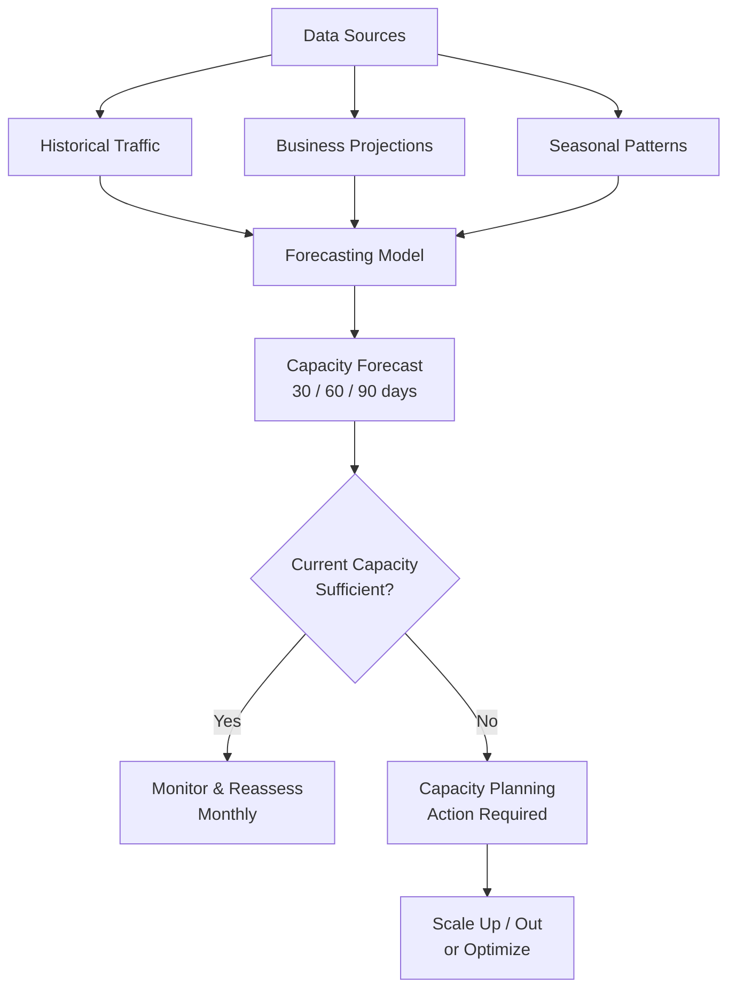
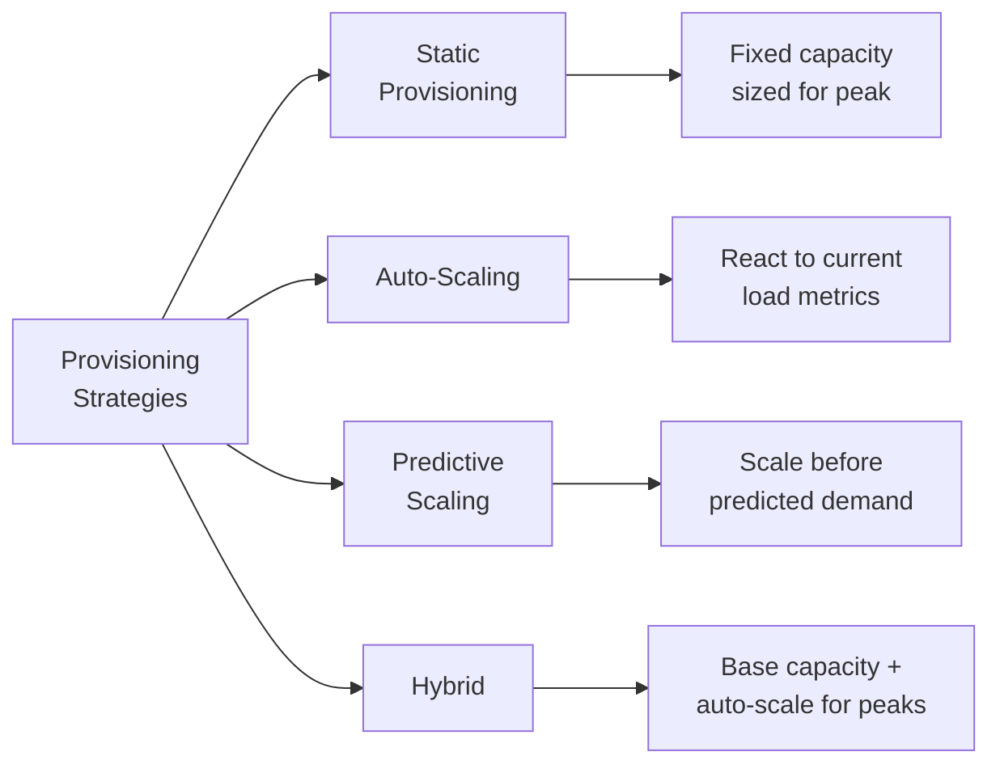
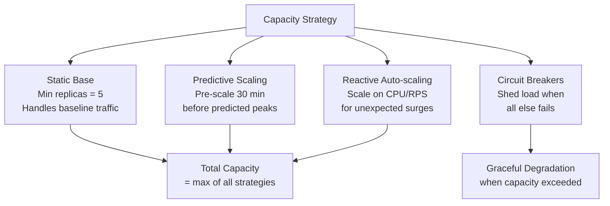
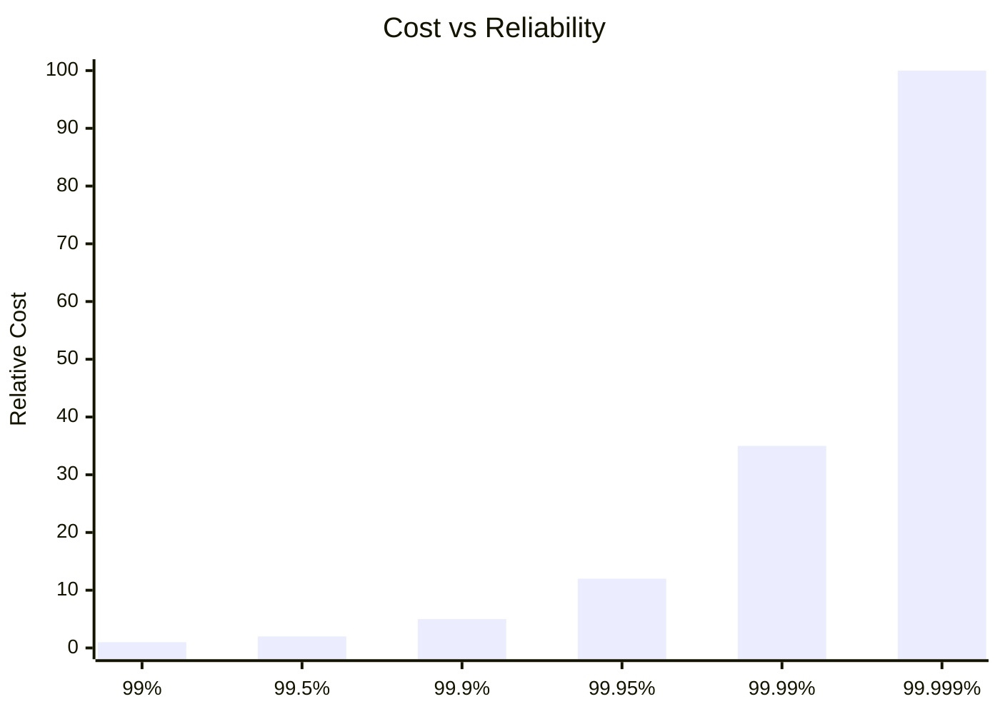

# Capacity Planning

Capacity planning is the process of determining what resources your systems need — compute, storage, network, and memory — to handle current and future demand while meeting your reliability targets. Get it wrong in one direction and you overpay for idle infrastructure. Get it wrong in the other direction and your service falls over during the next traffic spike, burning your error budget and your users' trust. The goal is not to have enough capacity — it is to have the **right** amount of capacity at the **right** time, with sufficient headroom to absorb unexpected surges.

Capacity planning sits at the intersection of SRE and FinOps. SRE cares about reliability — do we have enough capacity to meet our SLOs? FinOps cares about cost — are we paying for capacity we are not using? Good capacity planning satisfies both.

## Demand Forecasting

### Why Forecasting Matters

Without demand forecasting, capacity decisions are reactive: you wait until the system is struggling, then scramble to add resources. Reactive capacity management is expensive (you buy in a hurry, at premium prices), risky (you may not scale fast enough), and stressful (every traffic spike is a potential incident).

Proactive forecasting gives you lead time to make informed decisions.

### Forecasting Inputs

| Input | Source | What It Tells You |
|-------|--------|-------------------|
| Historical traffic patterns | Monitoring systems (Prometheus, CloudWatch) | Baseline growth, seasonal patterns, day-of-week trends |
| Business projections | Product and sales teams | Planned launches, marketing campaigns, expected customer growth |
| Organic growth rate | Month-over-month traffic data | Natural traffic increase from existing user base |
| Planned events | Marketing calendar, PR schedule | Spikes from product launches, media coverage, sales events |
| Competitive dynamics | Market intelligence | What happens if a competitor goes down and their users come to you? |
| Infrastructure changes | Engineering roadmap | Migrations, architecture changes that alter resource profiles |

### Forecasting Methods

#### Linear Extrapolation

The simplest method. Take your growth rate and project it forward:

```python
import numpy as np
from datetime import datetime, timedelta

def linear_forecast(
    historical_data: list[tuple[datetime, float]],
    forecast_days: int = 90
) -> list[tuple[datetime, float]]:
    """Simple linear regression forecast."""
    timestamps = np.array([
        (d - historical_data[0][0]).total_seconds()
        for d, _ in historical_data
    ])
    values = np.array([v for _, v in historical_data])

    # Fit linear model
    slope, intercept = np.polyfit(timestamps, values, 1)

    # Project forward
    last_date = historical_data[-1][0]
    forecast = []
    for day in range(1, forecast_days + 1):
        future_date = last_date + timedelta(days=day)
        future_timestamp = (future_date - historical_data[0][0]).total_seconds()
        predicted_value = slope * future_timestamp + intercept
        forecast.append((future_date, predicted_value))

    return forecast
```

::: warning Linear Extrapolation is Naive
Linear forecasting works for stable, mature services. It fails catastrophically for services experiencing exponential growth, seasonal variations, or step-function changes (like a product launch). Use it as a baseline, not as your only method.
:::

#### Seasonal Decomposition

Many services have strong seasonal patterns — higher traffic on weekdays, peaks at specific hours, spikes during holiday shopping seasons:

```python
from statsmodels.tsa.seasonal import seasonal_decompose

def analyze_seasonality(
    values: list[float],
    period: int = 7  # weekly seasonality for daily data
) -> dict:
    """Decompose time series into trend, seasonal, and residual."""
    result = seasonal_decompose(values, period=period, model='multiplicative')

    return {
        "trend": result.trend,
        "seasonal": result.seasonal,
        "residual": result.resid,
        "peak_season_multiplier": max(result.seasonal[:period]),
        "trough_season_multiplier": min(result.seasonal[:period]),
    }
```

#### The N+1 Growth Model

For services with predictable per-customer resource consumption:

```
Required Capacity = (Current Customers × Per-Customer Resource)
                    × Growth Rate
                    × Seasonal Multiplier
                    × Safety Margin
```

```python
def capacity_forecast(
    current_customers: int,
    resource_per_customer_mb: float,
    monthly_growth_rate: float,  # e.g., 0.05 for 5%
    months_ahead: int,
    seasonal_peak_multiplier: float = 1.3,
    safety_margin: float = 1.5,
) -> dict:
    """Forecast capacity needs based on customer growth."""
    future_customers = current_customers * ((1 + monthly_growth_rate) ** months_ahead)
    base_capacity = future_customers * resource_per_customer_mb
    peak_capacity = base_capacity * seasonal_peak_multiplier
    provisioned_capacity = peak_capacity * safety_margin

    return {
        "projected_customers": int(future_customers),
        "base_capacity_gb": round(base_capacity / 1024, 1),
        "peak_capacity_gb": round(peak_capacity / 1024, 1),
        "provisioned_capacity_gb": round(provisioned_capacity / 1024, 1),
        "months_ahead": months_ahead,
    }
```

### The Forecasting Dashboard



## Load Testing

### Why Load Testing is Critical

Forecasting tells you what traffic to expect. Load testing tells you whether your infrastructure can handle it. Without load testing, your capacity plan is theoretical — you think you can handle 10,000 RPS, but you have never actually tried.

### Load Testing Types

| Type | Purpose | When to Use |
|------|---------|-------------|
| **Smoke test** | Verify system works under minimal load | After every deployment |
| **Load test** | Validate performance at expected traffic levels | Weekly or before releases |
| **Stress test** | Find breaking points by increasing load until failure | Monthly or before major launches |
| **Soak test** | Detect memory leaks and degradation over extended time | Weekly, running for 4-24 hours |
| **Spike test** | Validate auto-scaling and behavior under sudden traffic surges | Before events or launches |
| **Breakpoint test** | Determine the exact point where the system fails | Quarterly or after architecture changes |

### Load Testing With k6

```javascript
// k6 load test script
import http from 'k6/http';
import { check, sleep } from 'k6';
import { Rate, Trend } from 'k6/metrics';

const errorRate = new Rate('error_rate');
const latencyP99 = new Trend('latency_p99');

export const options = {
  scenarios: {
    // Ramp up to expected peak
    load_test: {
      executor: 'ramping-vus',
      startVUs: 0,
      stages: [
        { duration: '5m', target: 100 },   // Ramp up
        { duration: '30m', target: 100 },   // Sustain expected peak
        { duration: '5m', target: 200 },    // Push to 2x peak
        { duration: '10m', target: 200 },   // Sustain 2x peak
        { duration: '5m', target: 0 },      // Ramp down
      ],
    },
    // Simulate traffic spike
    spike_test: {
      executor: 'ramping-vus',
      startVUs: 0,
      startTime: '60m',  // Run after load test
      stages: [
        { duration: '1m', target: 500 },    // Sudden spike
        { duration: '5m', target: 500 },    // Sustain spike
        { duration: '1m', target: 50 },     // Drop back
        { duration: '5m', target: 50 },     // Normal traffic
      ],
    },
  },
  thresholds: {
    'http_req_duration': ['p(99)<500'],     // 99th percentile < 500ms
    'error_rate': ['rate<0.01'],            // Error rate < 1%
    'http_req_failed': ['rate<0.01'],       // HTTP failure rate < 1%
  },
};

export default function () {
  // Simulate realistic user behavior
  const endpoints = [
    { url: `${__ENV.BASE_URL}/api/products`, weight: 40 },
    { url: `${__ENV.BASE_URL}/api/search?q=test`, weight: 30 },
    { url: `${__ENV.BASE_URL}/api/cart`, weight: 20 },
    { url: `${__ENV.BASE_URL}/api/checkout`, weight: 10 },
  ];

  const endpoint = weightedRandom(endpoints);
  const res = http.get(endpoint.url);

  check(res, {
    'status is 200': (r) => r.status === 200,
    'response time < 500ms': (r) => r.timings.duration < 500,
  });

  errorRate.add(res.status >= 400);
  latencyP99.add(res.timings.duration);

  sleep(Math.random() * 3 + 1); // 1-4 second think time
}

function weightedRandom(items) {
  const totalWeight = items.reduce((sum, item) => sum + item.weight, 0);
  let random = Math.random() * totalWeight;
  for (const item of items) {
    random -= item.weight;
    if (random <= 0) return item;
  }
  return items[items.length - 1];
}
```

### Load Testing Best Practices

::: tip Golden Rules of Load Testing
1. **Test in a production-like environment** — staging with 1/10th the capacity tells you nothing about production
2. **Use realistic data** — synthetic data with uniform distribution does not expose hot-spot problems
3. **Include dependencies** — test the full request path, not just the application tier
4. **Run regularly** — performance regressions creep in; catch them early
5. **Automate analysis** — human-reviewed load test results get stale fast
:::

### Interpreting Load Test Results

| Metric | What It Tells You | Action Threshold |
|--------|-------------------|-----------------|
| p50 latency | Typical user experience | Should be well within SLO |
| p99 latency | Worst-case user experience | Must be within SLO |
| p99.9 latency | Extreme tail latency | Watch for orders-of-magnitude spikes |
| Error rate | System stability under load | > 0.1% requires investigation |
| Throughput ceiling | Maximum sustainable RPS | Should be 2x expected peak (headroom) |
| Resource utilization at peak | How close to capacity | CPU > 70%, memory > 80% = needs attention |

## Resource Provisioning Strategies

### Provisioning Approaches



### Static Provisioning

Provision for peak capacity plus headroom. Simple but expensive.

| Pros | Cons |
|------|------|
| Predictable costs | Paying for idle capacity 80%+ of the time |
| No scaling delays | Cannot handle unexpected surges beyond peak |
| Simple to manage | Wasteful for variable workloads |

**When to use:** Latency-critical services where auto-scaling lag is unacceptable, or services with very flat traffic patterns.

### Auto-Scaling

Scale resources based on real-time metrics.

```yaml
# Kubernetes Horizontal Pod Autoscaler
apiVersion: autoscaling/v2
kind: HorizontalPodAutoscaler
metadata:
  name: api-server
spec:
  scaleTargetRef:
    apiVersion: apps/v1
    kind: Deployment
    name: api-server
  minReplicas: 3
  maxReplicas: 50
  metrics:
    # Scale on CPU utilization
    - type: Resource
      resource:
        name: cpu
        target:
          type: Utilization
          averageUtilization: 60
    # Scale on request rate (custom metric)
    - type: Pods
      pods:
        metric:
          name: http_requests_per_second
        target:
          type: AverageValue
          averageValue: "100"
  behavior:
    scaleUp:
      stabilizationWindowSeconds: 60
      policies:
        - type: Percent
          value: 50
          periodSeconds: 60
    scaleDown:
      stabilizationWindowSeconds: 300
      policies:
        - type: Percent
          value: 10
          periodSeconds: 60
```

::: danger Auto-Scaling is Not Instant
Auto-scaling has inherent delays: metric collection (15-60s), scaling decision (30-60s), instance provisioning (30s for containers, 2-5 minutes for VMs), application startup (10s-5min). Total lag: 2-10 minutes. If your traffic can spike faster than that, auto-scaling alone will not protect you. Use a base capacity floor plus auto-scaling for peaks.
:::

### Predictive Scaling

Use historical patterns to scale proactively:

```python
# Predictive scaling based on historical patterns
from datetime import datetime

class PredictiveScaler:
    def __init__(self, historical_data: dict):
        """
        historical_data: {hour_of_week: average_rps}
        e.g., {0: 100, 1: 80, ..., 167: 120}
        """
        self.baseline = historical_data
        self.safety_multiplier = 1.3  # 30% headroom

    def get_target_capacity(self, target_time: datetime) -> int:
        hour_of_week = target_time.weekday() * 24 + target_time.hour
        predicted_rps = self.baseline.get(hour_of_week, 0)
        target_rps = predicted_rps * self.safety_multiplier

        # Convert RPS to replica count (assuming 50 RPS per replica)
        replicas = max(3, int(target_rps / 50) + 1)
        return replicas

    def generate_scaling_schedule(self) -> list[dict]:
        """Generate a weekly scaling schedule."""
        schedule = []
        for hour in range(168):  # 7 days × 24 hours
            day = hour // 24
            hour_of_day = hour % 24
            replicas = self.get_target_capacity(
                datetime(2026, 3, 16 + day, hour_of_day)  # arbitrary Monday
            )
            schedule.append({
                "day": ["Mon","Tue","Wed","Thu","Fri","Sat","Sun"][day],
                "hour": hour_of_day,
                "replicas": replicas
            })
        return schedule
```

### The Hybrid Approach (Recommended)

Combine static base capacity with auto-scaling and predictive pre-scaling:



## Cost vs Reliability Trade-offs

### The Reliability Cost Curve



### Making the Trade-off

| Question | Cost-Optimized Answer | Reliability-Optimized Answer |
|----------|----------------------|------------------------------|
| How much headroom? | 20% above expected peak | 100% above expected peak |
| Multi-region? | Single region | Active-active in 2+ regions |
| Auto-scaling max? | 2x baseline | 10x baseline |
| Database replicas? | 1 primary, 1 read replica | 1 primary, 2+ read replicas + cross-region standby |
| Pre-provisioned capacity? | Scale on demand | Always warm |

### Right-Sizing

Right-sizing is the ongoing process of matching resource allocations to actual usage:

```python
# Right-sizing analysis
def analyze_utilization(
    allocated_cpu: float,    # CPU cores allocated
    actual_cpu_p95: float,   # 95th percentile CPU usage
    allocated_mem_gb: float, # Memory allocated
    actual_mem_p95: float,   # 95th percentile memory usage
    headroom: float = 0.3,   # 30% headroom target
) -> dict:
    recommended_cpu = actual_cpu_p95 * (1 + headroom)
    recommended_mem = actual_mem_p95 * (1 + headroom)

    return {
        "cpu": {
            "allocated": allocated_cpu,
            "used_p95": actual_cpu_p95,
            "recommended": round(recommended_cpu, 2),
            "savings_pct": round((1 - recommended_cpu / allocated_cpu) * 100, 1),
            "status": "oversized" if allocated_cpu > recommended_cpu * 1.2 else "ok",
        },
        "memory": {
            "allocated_gb": allocated_mem_gb,
            "used_p95_gb": actual_mem_p95,
            "recommended_gb": round(recommended_mem, 2),
            "savings_pct": round((1 - recommended_mem / allocated_mem_gb) * 100, 1),
            "status": "oversized" if allocated_mem_gb > recommended_mem * 1.2 else "ok",
        },
    }
```

See also: [Cloud Cost Optimization Playbook](/infrastructure/finops/cost-optimization) for detailed right-sizing strategies.

## Capacity Planning Process

### The Quarterly Capacity Review

Run this process every quarter:

| Step | Activity | Output |
|------|----------|--------|
| 1 | Gather demand forecasts from product and sales | Expected customer/traffic growth |
| 2 | Review current utilization across all services | Utilization heatmap |
| 3 | Run load tests against current capacity | Breaking point identification |
| 4 | Model future capacity needs | Capacity forecast spreadsheet |
| 5 | Identify services that will exceed capacity | Priority action list |
| 6 | Plan provisioning actions (reservations, scaling changes) | Infrastructure change plan |
| 7 | Execute and validate | Post-change load testing |

### Capacity Planning Document Template

```markdown
## Capacity Plan — [Service Name] — Q2 2026

### Current State
- Current peak traffic: X RPS
- Current capacity (tested): Y RPS
- Headroom: (Y - X) / X = Z%
- Current monthly cost: $N

### Demand Forecast
- Expected Q2 peak: A RPS (based on: growth rate, planned launch, seasonal)
- Confidence interval: A ± 20%

### Gap Analysis
- Required capacity: A × 1.5 (safety margin) = B RPS
- Current capacity: Y RPS
- Gap: B - Y = C RPS (need to add C RPS of capacity)

### Provisioning Plan
- Action: Scale from N to M instances
- Type: Reserved instances (1-year commitment for baseline, spot for burst)
- Timeline: Complete by [date], 2 weeks before projected need
- Cost impact: $X/month additional

### Risks
- If growth exceeds forecast by 50%: auto-scaling will handle up to 2x, beyond that we need manual intervention
- If [specific event] drives traffic: pre-scale 24h before event
```

::: tip Capacity Planning is a Team Sport
Effective capacity planning requires input from product (what are we building?), sales (how many customers are we expecting?), finance (what is the budget?), and engineering (what are the technical constraints?). An SRE team doing capacity planning in isolation will miss critical business context.
:::

## Further Reading

- [SRE Overview](/devops/sre/) — capacity planning within the broader SRE framework
- [Error Budgets](/devops/sre/error-budgets) — how capacity failures affect error budgets
- [Cloud Cost Optimization](/infrastructure/finops/cost-optimization) — right-sizing and cost-efficient provisioning
- [FinOps Overview](/infrastructure/finops/) — the financial framework for infrastructure decisions
- [Observability](/infrastructure/observability/) — the monitoring infrastructure that powers capacity planning
- Google SRE Book, Chapter 18: "Software Engineering in SRE" — sre.google/sre-book
- *The Art of Capacity Planning* by John Allspaw — foundational text on the discipline
- k6 documentation — k6.io/docs — load testing framework
