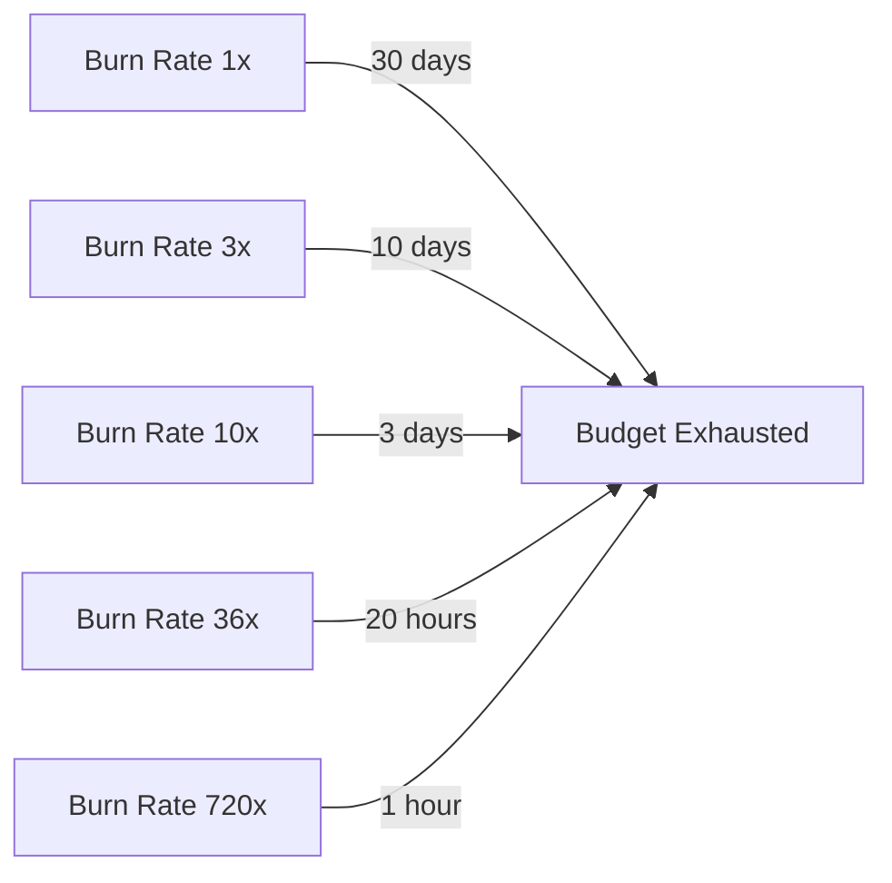
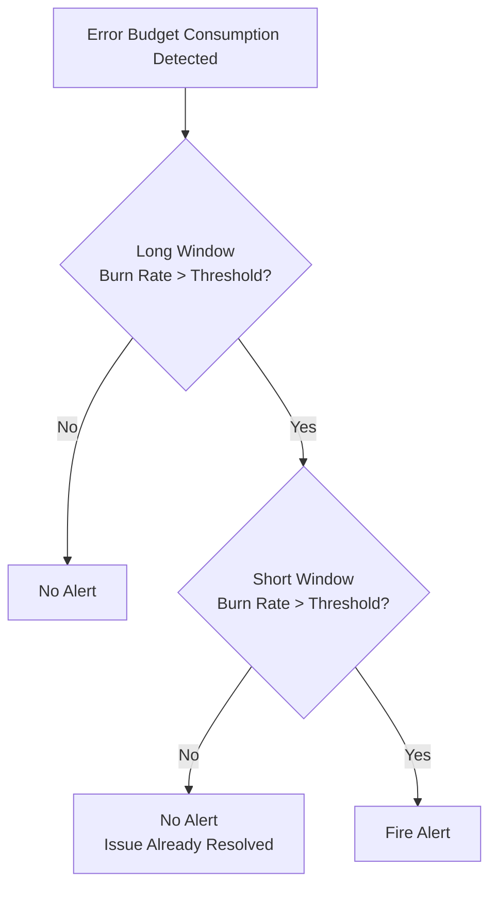
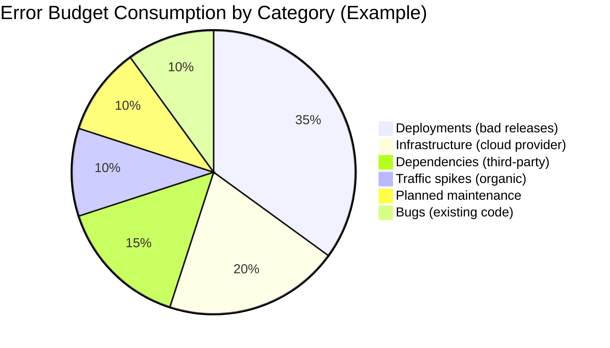

# Error Budgets

An error budget is the maximum amount of unreliability your service is allowed to have over a given time window. It is derived directly from your SLO: if your SLO is 99.9% availability over 30 days, your error budget is 0.1% — which translates to 43.2 minutes of allowed downtime. The error budget is not a target to hit. It is a budget to spend. And like any budget, how you spend it determines whether your organization thrives or burns out.

Error budgets are the single most important mechanism in SRE because they resolve the fundamental tension between development teams (who want to ship fast) and operations teams (who want stability). Without error budgets, this tension produces organizational conflict. With error budgets, it produces a data-driven conversation: "We have 28 minutes of budget remaining this month — should we spend it on this risky deployment or save it?"

## The Fundamental Calculation

### From SLO to Error Budget

The error budget formula is straightforward:

```
Error Budget = 1 - SLO target

If SLO = 99.9% availability
Error Budget = 100% - 99.9% = 0.1%
```

Converting to real units over a 30-day window:

```
Total minutes in 30 days = 30 × 24 × 60 = 43,200 minutes

Error Budget (minutes) = 43,200 × 0.001 = 43.2 minutes
```

### Error Budget by SLO Level

| SLO Target | Error Budget (%) | Downtime / 30 days | Downtime / year |
|-----------|-----------------|--------------------|-----------------|
| 99% | 1% | 7.2 hours | 3.65 days |
| 99.5% | 0.5% | 3.6 hours | 1.83 days |
| 99.9% | 0.1% | 43.2 minutes | 8.77 hours |
| 99.95% | 0.05% | 21.6 minutes | 4.38 hours |
| 99.99% | 0.01% | 4.32 minutes | 52.6 minutes |
| 99.999% | 0.001% | 26 seconds | 5.26 minutes |

::: warning The Cost Curve is Exponential
Moving from 99.9% to 99.99% does not cost 10x more — it costs 100x or even 1000x more. Each additional nine requires exponentially more redundancy, automation, and engineering investment. Choose your SLO wisely.
:::

### Request-Based Error Budgets

For request-driven services, error budgets are often calculated in terms of allowed failed requests rather than downtime:

```
Total requests in 30 days: 10,000,000
SLO: 99.9% success rate
Error budget: 10,000,000 × 0.001 = 10,000 failed requests
```

This means you are allowed 10,000 failed requests over 30 days. Every failed request consumes part of your error budget, whether the failure was caused by a bug, a deployment, infrastructure, or a third-party dependency.

```python
# Error budget calculation
def calculate_error_budget(
    total_requests: int,
    slo_target: float,  # e.g., 0.999 for 99.9%
    failed_requests: int
) -> dict:
    budget_total = total_requests * (1 - slo_target)
    budget_consumed = failed_requests
    budget_remaining = budget_total - budget_consumed
    budget_remaining_pct = (budget_remaining / budget_total) * 100

    return {
        "total_budget": budget_total,
        "consumed": budget_consumed,
        "remaining": budget_remaining,
        "remaining_pct": round(budget_remaining_pct, 2),
        "is_exhausted": budget_remaining <= 0,
    }

# Example
result = calculate_error_budget(
    total_requests=10_000_000,
    slo_target=0.999,
    failed_requests=7_500
)
# => {'total_budget': 10000, 'consumed': 7500, 'remaining': 2500,
#     'remaining_pct': 25.0, 'is_exhausted': False}
```

## Burn Rate

### What is Burn Rate?

Burn rate measures how fast you are consuming your error budget relative to the expected rate. A burn rate of 1.0 means you are consuming the budget exactly as fast as allowed — you will exhaust it precisely at the end of the SLO window. A burn rate of 2.0 means you are consuming it twice as fast and will exhaust it in half the time.

```
Burn Rate = (Observed Error Rate) / (SLO Error Rate)

If SLO allows 0.1% errors and you are currently seeing 0.3% errors:
Burn Rate = 0.3% / 0.1% = 3.0
```

A burn rate of 3.0 means your error budget will be consumed in 10 days instead of 30.

### Burn Rate Table

| Burn Rate | Time to Exhaust 30-day Budget | Severity |
|-----------|-------------------------------|----------|
| 1.0 | 30 days | Normal — on track |
| 2.0 | 15 days | Elevated — investigate |
| 3.0 | 10 days | High — take action |
| 6.0 | 5 days | Critical — stop deployments |
| 10.0 | 3 days | Emergency — all hands |
| 14.4 | 2 days | Severe — incident in progress |
| 36.0 | 20 hours | Outage — active incident response |
| 720.0 | 1 hour | Complete outage |



### Calculating Burn Rate in Practice

```yaml
# Prometheus recording rule for burn rate
groups:
  - name: slo_burn_rate
    interval: 30s
    rules:
      # Error ratio over 5 minutes
      - record: slo:error_ratio:5m
        expr: |
          sum(rate(http_requests_total{status=~"5.."}[5m]))
          /
          sum(rate(http_requests_total[5m]))

      # Error ratio over 1 hour
      - record: slo:error_ratio:1h
        expr: |
          sum(rate(http_requests_total{status=~"5.."}[1h]))
          /
          sum(rate(http_requests_total[1h]))

      # Burn rate (relative to SLO target of 99.9%)
      - record: slo:burn_rate:1h
        expr: |
          slo:error_ratio:1h / 0.001
```

## Multi-Window, Multi-Burn-Rate Alerting

### The Problem With Naive Alerting

Naive SLO-based alerting — "alert when error rate exceeds SLO threshold" — produces either too many false positives or too slow a response:

| Approach | Problem |
|----------|---------|
| Alert on short window (5 min) | High sensitivity but many false positives from transient spikes |
| Alert on long window (24 hours) | Few false positives but very slow to detect real incidents |
| Alert on single burn rate | Cannot distinguish brief spikes from sustained degradation |

### The Multi-Window Solution

Google's recommended approach uses **two windows** for each alert: a long window to detect sustained issues and a short window to confirm the issue is still happening (not just a spike that already resolved):



### Recommended Alert Configuration

The standard multi-window, multi-burn-rate alert configuration for a 30-day SLO window:

| Severity | Burn Rate | Long Window | Short Window | Budget Consumed Before Alert | Action |
|----------|-----------|-------------|--------------|-------|--------|
| Page (P1) | 14.4x | 1 hour | 5 minutes | 2% | Wake someone up |
| Page (P2) | 6x | 6 hours | 30 minutes | 5% | Respond urgently |
| Ticket | 3x | 1 day | 2 hours | 10% | Investigate soon |
| Ticket | 1x | 3 days | 6 hours | 10% | Investigate this week |

::: tip Why These Specific Numbers?
The burn rate of 14.4 comes from the budget exhaustion math: at 14.4x burn rate over 1 hour, you consume 14.4/720 = 2% of your monthly budget. This gives you enough signal to be confident the issue is real while alerting before serious damage to your error budget.
:::

### Prometheus Alert Rules

```yaml
# Multi-window, multi-burn-rate alerts
groups:
  - name: slo_alerts
    rules:
      # Page: 14.4x burn rate, 1h/5m windows
      - alert: SLOBurnRateCritical
        expr: |
          slo:burn_rate:1h > 14.4
          and
          slo:burn_rate:5m > 14.4
        for: 1m
        labels:
          severity: page
          team: platform
        annotations:
          summary: >
            High error budget burn rate detected.
            Burn rate {​{ $value }} over 1h window.
            At this rate, the 30-day error budget will be
            exhausted in {​{ printf "%.1f" (divide 720 $value) }} hours.

      # Page: 6x burn rate, 6h/30m windows
      - alert: SLOBurnRateHigh
        expr: |
          slo:burn_rate:6h > 6
          and
          slo:burn_rate:30m > 6
        for: 1m
        labels:
          severity: page
        annotations:
          summary: >
            Elevated error budget burn rate.
            Burn rate {​{ $value }} over 6h window.

      # Ticket: 3x burn rate, 1d/2h windows
      - alert: SLOBurnRateElevated
        expr: |
          slo:burn_rate:1d > 3
          and
          slo:burn_rate:2h > 3
        for: 5m
        labels:
          severity: ticket
        annotations:
          summary: >
            Error budget burn rate elevated.
            Investigate within 24 hours.

      # Ticket: 1x burn rate, 3d/6h windows
      - alert: SLOBurnRateSlow
        expr: |
          slo:burn_rate:3d > 1
          and
          slo:burn_rate:6h > 1
        for: 10m
        labels:
          severity: ticket
        annotations:
          summary: >
            Slow but sustained error budget consumption.
            Investigate this week.
```

## Error Budget Policies

### What is an Error Budget Policy?

An error budget policy defines **what happens** when the error budget is at various levels. Without a policy, error budget tracking is academic — interesting data that nobody acts on. With a policy, the error budget becomes a governance mechanism.

### Example Error Budget Policy

```markdown
## Error Budget Policy — Payment Service

### Stakeholders
- Product Owner: Jane Smith
- SRE Lead: Alex Chen
- Engineering Manager: Bob Williams

### SLO
- 99.95% availability over 30-day rolling window
- Error budget: 21.6 minutes per 30 days

### Policy Actions

| Budget Remaining | State | Actions |
|-----------------|-------|---------|
| > 50% | GREEN | Normal development velocity. Ship at will. |
| 25% - 50% | YELLOW | Reduce deployment frequency. No risky changes without SRE review. Prioritize reliability work. |
| 5% - 25% | ORANGE | Freeze non-critical deployments. All engineering effort on reliability. Daily error budget review. |
| < 5% | RED | Complete deployment freeze. Only reliability fixes deployed. Incident review mandatory. |
| Exhausted | BUDGET SPENT | Postmortem required. No deployments until budget recovers. Executive review if sustained. |

### Exceptions
- Security patches may be deployed regardless of budget state
- Budget freeze may be overridden by VP-level approval with documented risk acceptance
```

### Implementing Budget Policy Automation

```python
# Error budget policy enforcement
from enum import Enum
from dataclasses import dataclass

class BudgetState(Enum):
    GREEN = "green"
    YELLOW = "yellow"
    ORANGE = "orange"
    RED = "red"
    EXHAUSTED = "exhausted"

@dataclass
class PolicyAction:
    state: BudgetState
    deploy_allowed: bool
    requires_review: bool
    message: str

def evaluate_budget_policy(budget_remaining_pct: float) -> PolicyAction:
    if budget_remaining_pct > 50:
        return PolicyAction(
            state=BudgetState.GREEN,
            deploy_allowed=True,
            requires_review=False,
            message="Normal velocity. Ship at will."
        )
    elif budget_remaining_pct > 25:
        return PolicyAction(
            state=BudgetState.YELLOW,
            deploy_allowed=True,
            requires_review=True,
            message="Reduced velocity. SRE review required for risky changes."
        )
    elif budget_remaining_pct > 5:
        return PolicyAction(
            state=BudgetState.ORANGE,
            deploy_allowed=False,
            requires_review=True,
            message="Non-critical deployments frozen. Focus on reliability."
        )
    elif budget_remaining_pct > 0:
        return PolicyAction(
            state=BudgetState.RED,
            deploy_allowed=False,
            requires_review=True,
            message="Deployment freeze. Only reliability fixes."
        )
    else:
        return PolicyAction(
            state=BudgetState.EXHAUSTED,
            deploy_allowed=False,
            requires_review=True,
            message="Budget exhausted. Postmortem required. No deployments."
        )
```

::: danger Error Budget Policies Must Have Teeth
An error budget policy that nobody enforces is worse than no policy at all — it teaches the organization that reliability commitments are aspirational, not real. The policy must be backed by leadership and enforced consistently. If a team exhausts their budget and keeps shipping features, the entire SLO framework loses credibility.
:::

## Error Budget Attribution

### Why Attribution Matters

When your error budget is consumed, you need to know **what consumed it**. Without attribution, error budget tracking becomes a blame-free version of blame — everyone knows the budget is gone, but nobody knows why or who should fix it.

### Common Error Sources



### Attribution Implementation

Track error budget consumption by category:

```python
# Error budget attribution tracking
from datetime import datetime, timedelta

@dataclass
class BudgetConsumptionEvent:
    timestamp: datetime
    duration_minutes: float
    category: str  # deployment, infrastructure, dependency, traffic, maintenance, bug
    description: str
    incident_id: str | None
    team_responsible: str

def generate_attribution_report(
    events: list[BudgetConsumptionEvent],
    total_budget_minutes: float
) -> dict:
    by_category = {}
    for event in events:
        if event.category not in by_category:
            by_category[event.category] = 0.0
        by_category[event.category] += event.duration_minutes

    total_consumed = sum(by_category.values())

    return {
        "total_budget": total_budget_minutes,
        "total_consumed": total_consumed,
        "remaining": total_budget_minutes - total_consumed,
        "by_category": {
            cat: {
                "minutes": mins,
                "pct_of_consumed": round(mins / total_consumed * 100, 1) if total_consumed > 0 else 0
            }
            for cat, mins in sorted(by_category.items(), key=lambda x: -x[1])
        }
    }
```

## Error Budget Dashboard

A good error budget dashboard answers three questions at a glance:

1. **How much budget do I have left?** — percentage remaining and absolute value
2. **How fast am I spending it?** — current burn rate
3. **What is spending it?** — attribution breakdown

### Grafana Dashboard Configuration

```json
{
  "panels": [
    {
      "title": "Error Budget Remaining",
      "type": "gauge",
      "targets": [
        {
          "expr": "1 - (sum(increase(http_requests_total{status=~\"5..\"}[30d])) / sum(increase(http_requests_total[30d]))) / (1 - 0.999)",
          "legendFormat": "Budget Remaining %"
        }
      ],
      "thresholds": {
        "steps": [
          { "color": "red", "value": 0 },
          { "color": "orange", "value": 5 },
          { "color": "yellow", "value": 25 },
          { "color": "green", "value": 50 }
        ]
      }
    },
    {
      "title": "Current Burn Rate (1h)",
      "type": "stat",
      "targets": [
        {
          "expr": "slo:burn_rate:1h",
          "legendFormat": "Burn Rate"
        }
      ]
    },
    {
      "title": "Budget Consumption Over Time",
      "type": "timeseries",
      "targets": [
        {
          "expr": "1 - (sum(increase(http_requests_total{status=~\"5..\"}[30d])) / sum(increase(http_requests_total[30d]))) / (1 - 0.999)",
          "legendFormat": "Budget Remaining %"
        }
      ]
    }
  ]
}
```

## Common Pitfalls

| Pitfall | Problem | Solution |
|---------|---------|----------|
| SLO too aggressive | Budget is always exhausted, team ignores it | Set SLOs based on user expectations, not aspirations |
| SLO too generous | Budget is never consumed, provides no signal | Tighten SLOs until the budget is occasionally consumed |
| No error budget policy | Budget tracking has no consequences | Define and enforce a written policy |
| Ignoring partial outages | Only tracking full outages misses degraded performance | Include latency SLOs, not just availability |
| External dependencies | Third-party outages consume your budget unfairly | Track attribution; consider dependency SLOs |
| Gaming the budget | Teams deploy right after budget resets | Use rolling windows, not calendar-aligned windows |

::: tip The Error Budget is a Gift
Reframe the error budget as a positive: it is permission to take risks. When you have budget remaining, you can ship that risky migration, try that new database, or deploy on a Friday (if your policy allows it). The budget gives development teams the freedom to innovate while keeping reliability bounded.
:::

## Further Reading

- [SLI / SLO / SLA Engineering](/devops/sre/sli-slo-sla) — defining the SLOs that error budgets derive from
- [SRE Overview](/devops/sre/) — the broader SRE framework
- [On-Call Handbook](/devops/engineering-practices/on-call-handbook) — incident response when budgets are burning fast
- [Observability](/infrastructure/observability/) — the monitoring infrastructure that powers burn rate calculation
- *Implementing Service Level Objectives* by Alex Hidalgo — the definitive practical guide
- Google SRE Book, Chapter 3: "Embracing Risk" — sre.google/sre-book/embracing-risk
- Google SRE Workbook, Chapter 5: "Alerting on SLOs" — sre.google/workbook/alerting-on-slos
