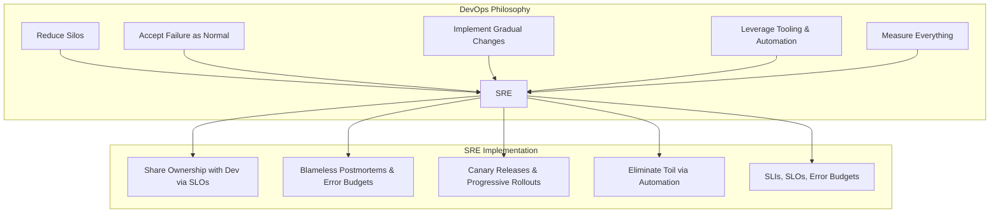
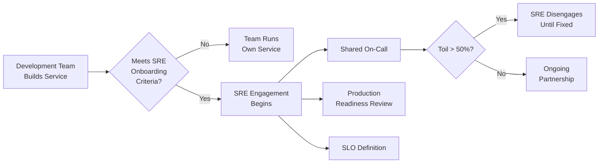

# Site Reliability Engineering (SRE)

Site Reliability Engineering is a discipline born at Google in 2003, when Ben Treynor Sloss was tasked with running a production team. His answer to the question "what happens when a software engineer is tasked with operations?" became the foundation for how the most demanding systems in the world are operated today. SRE is not a rebranding of operations. It is a fundamental rethinking of how reliability is achieved — by applying software engineering practices to infrastructure and operations problems.

The core insight is deceptively simple: **reliability is a feature**. It must be designed, measured, budgeted, and prioritized just like any other product feature. When you treat reliability as an afterthought — something the ops team handles — you get pager fatigue, heroic firefighting, and systems that break under real-world load. When you treat it as an engineering discipline, you get systems that degrade gracefully, teams that automate instead of toil, and organizations that can ship fast without breaking things.

## What is SRE?

### The Definition

SRE is what happens when you ask a software engineer to design an operations function. In Google's own words:

> "SRE is a software engineering approach to IT operations."

An SRE team is responsible for the **availability, latency, performance, efficiency, change management, monitoring, emergency response, and capacity planning** of the services they support.

The key differentiator: SRE teams are composed of engineers who write code. They do not manually configure servers, hand-deploy releases, or babysit dashboards. When they encounter a repetitive operational task, they automate it. When they detect a reliability problem, they engineer a solution. When they run out of error budget, they slow down releases.

### SRE at Google — The Origin Story

Google needed to operate services at a scale nobody had ever attempted:

| Challenge | Scale |
|-----------|-------|
| Search queries | Billions per day |
| Gmail users | Hundreds of millions |
| Infrastructure | Millions of servers across dozens of data centers |
| Deployments | Thousands per day across hundreds of services |
| Teams | Thousands of engineers modifying shared infrastructure |

Traditional operations teams — where sysadmins manually managed servers and deployments — could not scale to this. Google needed an approach where the **operational workload scaled sublinearly** with system growth.

The answer was to staff the operations function with software engineers who had the skills and incentive to automate themselves out of a job.

### The 50% Rule

Google mandates that SRE teams spend no more than 50% of their time on operational work (toil). The remaining 50% must be spent on engineering work — building tools, automating processes, improving reliability. If operational work exceeds 50%, the team can push back on the development teams by redirecting operations work to the developers or by temporarily halting feature releases.

This is not a guideline — it is a structural constraint that prevents SRE from degenerating into a renamed operations team.

## SRE vs DevOps

SRE and DevOps are frequently conflated. They share goals but differ in specificity.

### DevOps as a Philosophy

DevOps is a set of cultural practices and philosophies:

- Break down silos between development and operations
- Automate everything
- Measure and share metrics
- Continuous improvement
- Infrastructure as code

DevOps describes **what** needs to happen. It is a cultural movement, not a prescriptive framework.

### SRE as an Implementation

SRE is a concrete implementation of DevOps principles. It prescribes **how** to achieve those goals:

| Aspect | DevOps | SRE |
|--------|--------|-----|
| **Nature** | Culture / philosophy | Engineering discipline with concrete practices |
| **Prescriptiveness** | General principles | Specific practices (error budgets, SLOs, toil budgets) |
| **Team structure** | Shared responsibility model | Dedicated SRE teams with defined engagement models |
| **Measurement** | "Measure everything" | SLIs, SLOs, error budgets with mathematical precision |
| **Change velocity** | "Ship fast, fix fast" | Ship as fast as your error budget allows |
| **Operations cap** | Automate operations | Explicit 50% cap on toil |
| **Failure response** | Blameless culture | Blameless postmortems with formal follow-up process |
| **Reliability target** | "High availability" | Precisely defined SLOs (e.g., 99.95% over 30 days) |

::: tip The Canonical Framing
Google's VP of Engineering, Ben Treynor Sloss, put it concisely: **"SRE is what happens when you ask a software engineer to design an operations function."** If DevOps is the interface, SRE is a class that implements it.
:::

## Core Principles of SRE

### 1. Embracing Risk

No system should target 100% availability. It is infinitely expensive, practically impossible, and — critically — **unnecessary**. Users cannot distinguish 99.99% from 99.999% in most products. The difference between the two is 4.3 minutes of downtime per month, but the engineering cost to achieve it is orders of magnitude higher.

SRE formalizes this by defining a **target reliability level** (the SLO) and then calculating an **error budget** — the allowed amount of unreliability. The error budget is the mechanism that balances innovation velocity against reliability.

### 2. Service Level Objectives (SLOs)

SLOs are the foundation of everything in SRE. Without them, reliability conversations devolve into subjective arguments. With them, every reliability decision is grounded in data:

- **SLI (Service Level Indicator)** — a quantitative measure of service behavior (e.g., request latency at the 99th percentile)
- **SLO (Service Level Objective)** — a target value for an SLI (e.g., 99th percentile latency < 300ms)
- **SLA (Service Level Agreement)** — a contractual commitment with consequences for missing it

Read the full guide: [SLI / SLO / SLA Engineering](/devops/sre/sli-slo-sla)

### 3. Eliminating Toil

Toil is work that is manual, repetitive, automatable, tactical, devoid of long-term value, and scales linearly with service growth. SRE teams must measure toil and actively invest in reducing it. Every hour spent on toil is an hour not spent on engineering that improves reliability.

Read the full guide: [Toil Reduction](/devops/sre/toil-reduction)

### 4. Monitoring and Alerting

SRE distinguishes between three types of monitoring output:

| Output | Purpose | Example |
|--------|---------|---------|
| **Alerts** | Require immediate human action | Error budget burn rate exceeds threshold |
| **Tickets** | Require human action but not immediately | Certificate expires in 30 days |
| **Logs** | Recorded for diagnostic purposes, no action needed | Request trace for debugging |

Good alerting is symptom-based, not cause-based. Alert on "users are experiencing errors" not on "CPU is high." High CPU might be completely normal during a traffic spike.

See also: [Observability](/infrastructure/observability/)

### 5. Automation

SRE categorizes automation by value:

1. **No automation** — manual process performed by a human
2. **Externally maintained automation** — a script exists somewhere that someone runs manually
3. **Internally maintained automation** — the system has automation built in but requires human triggering
4. **Autonomous system** — the system detects and resolves issues without human intervention

The goal is to push every repetitive process as far toward autonomous as possible.

### 6. Release Engineering

Reliable releases require:

- **Hermetic builds** — builds that produce identical output regardless of the build environment
- **Progressive rollouts** — canary deployments that expose changes to a small percentage of traffic before full rollout
- **Automatic rollback** — systems that detect SLO violations and roll back without human intervention
- **Feature flags** — the ability to disable new functionality without a deployment

### 7. Simplicity

Complexity is the enemy of reliability. Every additional component, dependency, configuration option, and code path is a potential failure mode. SRE teams push back on unnecessary complexity:

- Remove dead code and unused features
- Minimize dependencies
- Prefer boring technology over bleeding-edge
- Design systems that fail in predictable, recoverable ways

::: warning Complexity is Not Free
Every line of code, every configuration parameter, every microservice boundary is a reliability liability. The most reliable component is the one that does not exist. SRE teams must be empowered to say "this is too complex" and push back on designs that introduce unnecessary failure modes.
:::

## The SRE Engagement Model

### How SRE Teams Work With Development Teams

SRE teams do not support every service. Engagement is earned:

### Production Readiness Review (PRR)

Before SRE takes on a service, they conduct a Production Readiness Review:

| Area | What SRE Evaluates |
|------|-------------------|
| **Architecture** | Failure modes, dependencies, single points of failure |
| **SLOs** | Are meaningful SLIs and SLOs defined? |
| **Monitoring** | Dashboards, alerts aligned to SLOs, logging |
| **Capacity** | Load testing results, scaling mechanisms, headroom |
| **Rollback** | Can the last deployment be rolled back in < 5 minutes? |
| **Runbooks** | Documented procedures for common failure scenarios |
| **On-call** | Is the development team trained and has done on-call rotations? |

### SRE Team Topologies

Organizations implement SRE in different ways:

| Model | Description | Best For |
|-------|-------------|----------|
| **Centralized SRE** | Single SRE team supports all services | Small-medium organizations (< 50 engineers) |
| **Embedded SRE** | SREs sit within product teams | Large organizations where context matters |
| **Consulting SRE** | SREs advise but do not take on-call | Organizations adopting SRE incrementally |
| **Platform SRE** | SREs build platforms that enable teams to self-serve reliability | Mature organizations with many teams |

## Getting Started With SRE

If you are introducing SRE practices in your organization, start here:

1. **Define SLOs for your most critical services** — start with availability and latency. See [SLI / SLO / SLA Engineering](/devops/sre/sli-slo-sla)
2. **Calculate error budgets** — make reliability trade-offs visible. See [Error Budgets](/devops/sre/error-budgets)
3. **Measure toil** — understand where your team's time goes. See [Toil Reduction](/devops/sre/toil-reduction)
4. **Implement blameless postmortems** — learn from incidents without finger-pointing. See [On-Call Handbook](/devops/engineering-practices/on-call-handbook)
5. **Plan for capacity** — understand your growth trajectory. See [Capacity Planning](/devops/sre/capacity-planning)
6. **Set up observability** — you cannot improve what you cannot see. See [Observability](/infrastructure/observability/)

::: tip Start Small
You do not need to adopt every SRE practice at once. Start with SLOs and error budgets — they give you a shared language for reliability conversations. Everything else builds on top of that foundation.
:::

## SRE in the Archon Knowledge Base

This section covers the core SRE practices in depth:

| Page | Focus |
|------|-------|
| [SLI / SLO / SLA Engineering](/devops/sre/sli-slo-sla) | Choosing SLIs, setting SLOs, writing SLA contracts |
| [Error Budgets](/devops/sre/error-budgets) | Calculating error budgets, burn rates, multi-window alerting |
| [Toil Reduction](/devops/sre/toil-reduction) | Measuring and eliminating toil, automation strategies |
| [Capacity Planning](/devops/sre/capacity-planning) | Demand forecasting, load testing, provisioning strategies |

Related pages across Archon:

| Page | Relevance |
|------|-----------|
| [On-Call Handbook](/devops/engineering-practices/on-call-handbook) | Incident response, severity levels, postmortems |
| [Observability](/infrastructure/observability/) | Logs, metrics, traces, alerting |

## Further Reading

- *Site Reliability Engineering* — the original Google SRE book (free online at sre.google/sre-book)
- *The Site Reliability Workbook* — practical companion to the SRE book (sre.google/workbook)
- *Seeking SRE* — essays from SRE practitioners outside Google
- *Implementing Service Level Objectives* — Alex Hidalgo's practical SLO guide
- Google's SRE page: sre.google
- The DORA research program (dora.dev) — quantitative research on engineering performance
