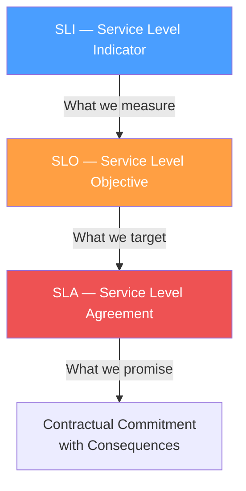
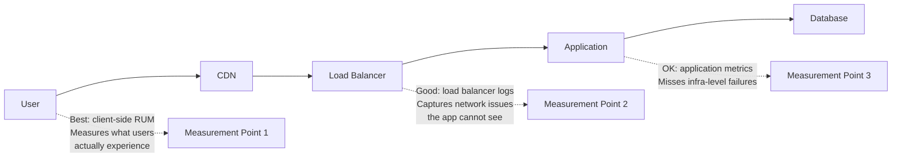
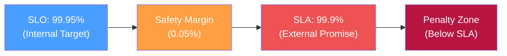
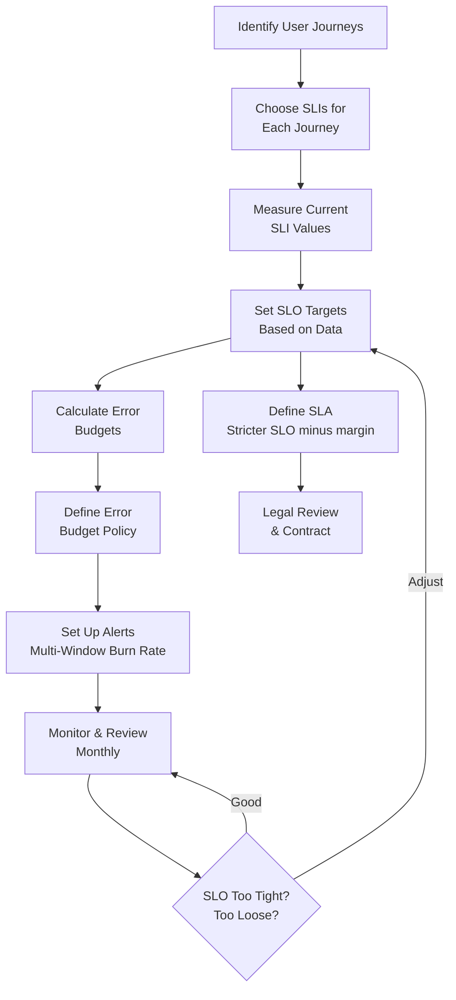

# SLI / SLO / SLA Engineering

Service Level Indicators, Objectives, and Agreements form a three-layer system for defining, measuring, and committing to reliability. Without them, reliability is a vague aspiration — "the system should be fast and available." With them, reliability is a precise engineering constraint — "99.9% of requests complete in under 300ms over a 30-day rolling window, and if we breach this target for three consecutive months, customers receive a 10% service credit."

This precision transforms reliability from an emotional debate ("it feels slow") into a data-driven practice ("p99 latency breached SLO for 47 minutes, consuming 8% of our error budget").

## The Three Layers



| Layer | Definition | Owned By | Example |
|-------|-----------|----------|---------|
| **SLI** | A quantitative measure of service behavior | Engineering | Ratio of successful HTTP requests to total requests |
| **SLO** | A target value or range for an SLI | Engineering + Product | 99.9% of requests succeed over 30 days |
| **SLA** | A contractual commitment to meet specific SLOs, with penalties for breach | Business + Legal | 99.9% availability; 10% service credit if breached |

::: tip The Critical Insight
SLOs should always be stricter than SLAs. If your SLA promises 99.9%, your SLO should target 99.95%. The gap between SLO and SLA is your safety margin — it gives you time to detect and fix problems before they trigger contractual penalties.
:::

## Service Level Indicators (SLIs)

### What Makes a Good SLI?

A good SLI is:

1. **User-facing** — it measures something the user cares about, not an internal metric
2. **Measurable** — it can be computed from existing data (logs, metrics, probes)
3. **Proportional** — small changes in system behavior produce proportional changes in the SLI
4. **Actionable** — when the SLI degrades, engineers know where to look

### The Four Golden SLIs

Google recommends focusing on four categories of SLIs:

| Category | What It Measures | Example SLI | Services |
|----------|-----------------|-------------|----------|
| **Availability** | Is the service up and serving? | Ratio of successful requests to total requests | All services |
| **Latency** | How fast does the service respond? | Proportion of requests faster than threshold | APIs, web apps |
| **Throughput** | How much work does the service handle? | Bytes processed per second | Data pipelines, batch jobs |
| **Correctness** | Does the service return the right answer? | Proportion of responses that are correct | Data pipelines, ML models, billing |

### SLI Specification vs Implementation

**SLI Specification** — what you want to measure (the ideal):
> "The proportion of valid requests served successfully"

**SLI Implementation** — how you actually measure it:
> "The proportion of HTTP requests that return a 2xx or 4xx status code, measured at the load balancer, excluding health checks"

The implementation is always an approximation of the specification. Document both, and acknowledge the gap.

### Choosing SLIs by Service Type

| Service Type | Primary SLI | Secondary SLIs |
|-------------|-------------|----------------|
| **REST API** | Availability (success rate) | Latency (p50, p99), Error rate by endpoint |
| **Web application** | Page load time | Availability, Core Web Vitals |
| **Batch pipeline** | Correctness (data quality) | Throughput, Freshness (data age) |
| **Streaming system** | Throughput | Latency (end-to-end), Message loss rate |
| **Storage system** | Durability | Availability, Latency, Throughput |
| **ML inference** | Latency | Availability, Prediction accuracy |

### Where to Measure SLIs

The measurement point matters enormously:



| Measurement Point | Pros | Cons |
|-------------------|------|------|
| Client-side (RUM) | Most accurate representation of user experience | Noisy (user device/network issues), hard to attribute |
| CDN/Edge | Captures most infra issues | Misses client-side problems |
| Load balancer | Reliable, easy to instrument | Misses CDN and network issues |
| Application | Most detailed, per-endpoint metrics | Misses infra failures (LB, network) |
| Synthetic probes | Consistent baseline, catches total outages | Does not reflect real user experience |

::: warning Measure at the Edge, Not the Application
If your application metric shows 100% success rate but the load balancer is returning 502s because the app is not responding, your SLI is lying. Always include a measurement point that is outside the application — load balancer logs or synthetic probes.
:::

### SLI Implementation Examples

#### Availability SLI (Prometheus)

```yaml
# Recording rule for availability SLI
groups:
  - name: sli_availability
    rules:
      - record: sli:availability:ratio_rate5m
        expr: |
          sum(rate(http_requests_total{status!~"5.."}[5m]))
          /
          sum(rate(http_requests_total[5m]))

      - record: sli:availability:ratio_rate30d
        expr: |
          sum(increase(http_requests_total{status!~"5.."}[30d]))
          /
          sum(increase(http_requests_total[30d]))
```

#### Latency SLI (Prometheus)

```yaml
# Recording rule for latency SLI — proportion of requests under threshold
groups:
  - name: sli_latency
    rules:
      - record: sli:latency:ratio_rate5m
        expr: |
          sum(rate(http_request_duration_seconds_bucket{le="0.3"}[5m]))
          /
          sum(rate(http_request_duration_seconds_count[5m]))

      - record: sli:latency:p99_5m
        expr: |
          histogram_quantile(0.99,
            sum(rate(http_request_duration_seconds_bucket[5m])) by (le)
          )
```

#### Correctness SLI (Application-Level)

```python
# Correctness SLI for a data pipeline
from prometheus_client import Counter

records_processed = Counter(
    'pipeline_records_processed_total',
    'Total records processed',
    ['result']  # 'correct', 'incorrect', 'skipped'
)

def process_record(record):
    result = transform(record)
    expected = get_expected_output(record)

    if result == expected:
        records_processed.labels(result='correct').inc()
    else:
        records_processed.labels(result='incorrect').inc()
        log_data_quality_issue(record, result, expected)

# SLI: records_processed{result="correct"} / sum(records_processed)
```

## Service Level Objectives (SLOs)

### Setting SLOs

SLOs answer the question: "How reliable does this service need to be?" The answer is not "as reliable as possible" — it is "reliable enough that users are satisfied, and no more."

#### Step 1: Understand User Expectations

| Method | What It Tells You |
|--------|-------------------|
| Analyze current performance | What reliability level are users already getting? |
| Customer support tickets | At what point do users start complaining? |
| Competitor analysis | What reliability level do alternatives offer? |
| User research | What do users say they need? (Be careful — users often overstate needs) |
| Business impact analysis | What is the revenue impact of different reliability levels? |

#### Step 2: Choose an SLO Target

Start with current performance and adjust:

```
If current availability = 99.95% and users are satisfied:
  → Set SLO at 99.9% (slightly below current, gives breathing room)

If current availability = 99.5% and users are complaining:
  → Set SLO at 99.9% (aspirational, drives improvement work)
  → Set intermediate milestone at 99.7% (achievable short-term)
```

::: danger Do NOT Set SLOs at 100%
An SLO of 100% means zero error budget, which means zero tolerance for any change. No deployments, no experiments, no migrations — because any of these could cause a single error. 100% availability is not just impossible; it is counterproductive. It paralyzes the team.
:::

#### Step 3: Define the SLO Window

| Window Type | Description | Pros | Cons |
|-------------|-------------|------|------|
| **Rolling (30 days)** | SLO evaluated over trailing 30 days | No "reset" gaming; always relevant | Incidents linger for 30 days |
| **Calendar (monthly)** | SLO resets on the 1st of each month | Clean reporting; aligns with billing | Teams can burn budget early and coast |
| **Rolling (7 days)** | Shorter evaluation window | Faster signal | Less tolerant of maintenance |

**Recommendation:** Use 30-day rolling windows for operational SLOs and calendar monthly for business reporting.

### The SLO Document

Every service should have an SLO document. Here is a production-ready template:

```markdown
## SLO Document — Order Service

### Service Description
The Order Service handles e-commerce order creation, payment processing,
and order status queries. It is a Tier-1 service — revenue-generating
and customer-facing.

### Stakeholders
- Service Owner: Alice Johnson (Engineering)
- Product Owner: Bob Williams (Product)
- SRE Lead: Carol Martinez (SRE)
- Approved by: Dave Chen (VP Engineering)

### SLIs and SLOs

| SLI | Description | Measurement | SLO Target | Window |
|-----|-------------|-------------|------------|--------|
| Availability | Successful requests / total requests | Load balancer access logs, excluding health checks | 99.95% | 30-day rolling |
| Latency (fast) | Requests completing < 200ms | Application metrics (histogram) | 90% of requests | 30-day rolling |
| Latency (slow) | Requests completing < 1000ms | Application metrics (histogram) | 99% of requests | 30-day rolling |
| Correctness | Orders with correct total calculation | End-of-day reconciliation job | 99.999% | 30-day rolling |

### Error Budget
- Availability budget: 0.05% = 21.6 minutes / 30 days
- Error budget policy: see [Error Budgets](/devops/sre/error-budgets)

### Exclusions
- Planned maintenance windows (announced 48h in advance, max 4h/month)
- Client errors (4xx responses) are not counted against availability
- Synthetic monitoring traffic is excluded

### Review Schedule
- Monthly: SLO compliance review with service team
- Quarterly: SLO target review with stakeholders
- Annually: Full SLO redesign if needed
```

### SLO Compliance Tracking

```python
# SLO compliance checker
from dataclasses import dataclass
from datetime import datetime

@dataclass
class SLOStatus:
    sli_name: str
    target: float
    current: float
    compliant: bool
    error_budget_remaining_pct: float
    window_start: datetime
    window_end: datetime

def check_slo_compliance(
    sli_value: float,    # Current SLI value (e.g., 0.9993)
    slo_target: float,   # SLO target (e.g., 0.9995)
    window_days: int = 30,
) -> SLOStatus:
    error_budget_total = 1 - slo_target     # e.g., 0.0005
    error_budget_consumed = max(0, 1 - sli_value)  # e.g., 0.0007
    error_budget_remaining = error_budget_total - error_budget_consumed
    remaining_pct = (error_budget_remaining / error_budget_total) * 100

    return SLOStatus(
        sli_name="availability",
        target=slo_target,
        current=sli_value,
        compliant=sli_value >= slo_target,
        error_budget_remaining_pct=round(remaining_pct, 2),
        window_start=datetime.utcnow(),
        window_end=datetime.utcnow(),
    )
```

## Service Level Agreements (SLAs)

### SLO vs SLA

| Aspect | SLO | SLA |
|--------|-----|-----|
| **Audience** | Internal engineering teams | External customers |
| **Consequences** | Error budget policy actions | Financial penalties, contract termination |
| **Stringency** | Stricter (provides safety margin) | Less strict (safety margin between SLO and SLA) |
| **Who sets it** | Engineering + Product | Business + Legal |
| **Documentation** | Internal SLO document | Legal contract |



### SLA Components

A well-written SLA includes:

| Component | Description | Example |
|-----------|-------------|---------|
| **Service description** | What is covered | "The API endpoint at api.example.com" |
| **Availability definition** | How uptime is calculated | "Percentage of 1-minute intervals where > 95% of health checks succeed" |
| **Exclusions** | What does not count | "Scheduled maintenance, force majeure, customer-caused issues" |
| **Measurement period** | Evaluation window | "Calendar month" |
| **Credit schedule** | Penalties for breach | "< 99.9%: 10% credit; < 99.0%: 25% credit; < 95%: 50% credit" |
| **Credit cap** | Maximum penalty | "Credits shall not exceed 50% of monthly fees" |
| **Claim process** | How customers request credits | "Submit ticket within 30 days of incident" |

### SLA Credit Schedule Example

| Monthly Uptime % | Service Credit |
|------------------|---------------|
| 99.0% - 99.9% | 10% of monthly bill |
| 95.0% - 99.0% | 25% of monthly bill |
| < 95.0% | 50% of monthly bill |

### Engineering Considerations for SLAs

::: warning SLAs are Legal Documents
Engineers should be deeply involved in SLA definition but should not write them alone. Common engineering mistakes in SLAs:
- Promising SLAs tighter than what the infrastructure can deliver
- Not defining measurement methodology precisely
- Not excluding planned maintenance
- Not accounting for dependency SLAs (your SLA cannot exceed your cloud provider's SLA)
- Not setting a credit cap (unlimited penalties are an existential business risk)
:::

### Dependency SLA Analysis

Your service's SLA is bounded by the SLAs of your dependencies:

```python
# Composite SLA calculation
def composite_sla(dependency_slas: list[float], topology: str = "serial") -> float:
    """
    Calculate composite SLA from dependency SLAs.

    Serial topology: all dependencies must be available.
    Parallel (redundant): at least one must be available.
    """
    if topology == "serial":
        # SLA = product of all dependency SLAs
        composite = 1.0
        for sla in dependency_slas:
            composite *= sla
        return round(composite, 6)
    elif topology == "parallel":
        # SLA = 1 - product of all failure probabilities
        composite_failure = 1.0
        for sla in dependency_slas:
            composite_failure *= (1 - sla)
        return round(1 - composite_failure, 6)

# Serial: API → Auth Service → Database
serial_sla = composite_sla([0.999, 0.999, 0.9999], topology="serial")
# => 0.997901 ≈ 99.79%
# You CANNOT promise 99.9% if your serial dependency chain gives 99.79%

# Parallel: Primary DB || Replica DB
parallel_sla = composite_sla([0.999, 0.999], topology="parallel")
# => 0.999999 ≈ 99.9999%
# Redundancy dramatically improves availability
```

## Putting It All Together

### The SLI/SLO/SLA Lifecycle



### Common Pitfalls

| Pitfall | Impact | Fix |
|---------|--------|-----|
| Too many SLIs | Alert fatigue, unclear priorities | Max 3-5 SLIs per service |
| SLIs not user-facing | SLOs that do not reflect user experience | Measure at the edge, not internally |
| SLOs set by fiat | Unrealistic targets, team ignores them | Base SLOs on data and user research |
| SLO = SLA | No safety margin; any slip triggers penalties | SLO should be 2-5x stricter than SLA |
| No SLO review cadence | SLOs become stale as the service evolves | Review monthly, adjust quarterly |
| Ignoring latency SLOs | Only tracking availability misses slowness | Always include latency SLIs at p50 and p99 |

## Further Reading

- [Error Budgets](/devops/sre/error-budgets) — what to do with the budget that SLOs create
- [SRE Overview](/devops/sre/) — the broader SRE framework
- [Observability](/infrastructure/observability/) — the monitoring infrastructure that powers SLI measurement
- [On-Call Handbook](/devops/engineering-practices/on-call-handbook) — incident response when SLOs are breached
- *Implementing Service Level Objectives* by Alex Hidalgo — the definitive book on SLOs
- Google SRE Book, Chapter 4: "Service Level Objectives" — sre.google/sre-book/service-level-objectives
- Google SRE Workbook, Chapter 2: "Implementing SLOs" — sre.google/workbook/implementing-slos
