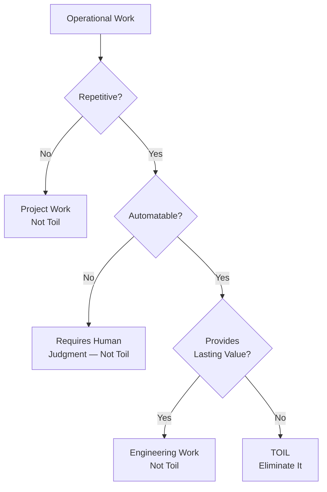
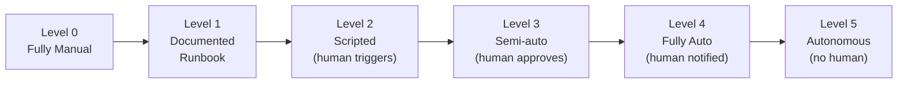
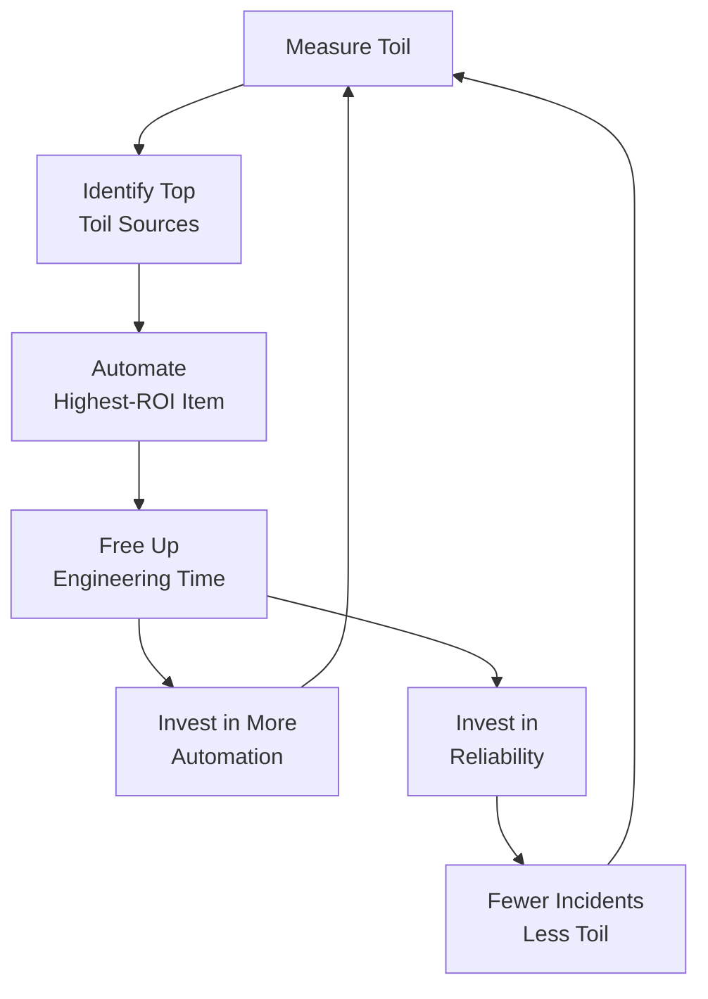

# Toil Reduction

Toil is the operational work that keeps a service running but does not permanently improve it. It is the manual deployment process you run every Tuesday. The certificate renewal you do every 90 days. The capacity bump you perform when traffic grows. The on-call alert that requires the same three-step fix every time. Each instance takes only minutes, but across a team of six engineers running dozens of services, toil can consume the majority of available engineering time — leaving nothing for the reliability improvements that would eliminate the toil in the first place. This vicious cycle is what SRE exists to break.

Google defines a strict rule: SRE teams must spend no more than 50% of their time on toil. The remaining 50% is dedicated to engineering work that improves reliability, performance, and automation. This is not a guideline — it is a structural constraint that keeps SRE teams from degenerating into traditional operations teams with a fancier title.

## What is Toil?

### The Formal Definition

Toil is work that has **all** of the following characteristics:

| Characteristic | Description | Example |
|---------------|-------------|---------|
| **Manual** | Requires a human to perform | Running a deployment script by hand |
| **Repetitive** | Done over and over again | Restarting a service after an OOM crash |
| **Automatable** | Could be handled by software | Rotating log files when disk fills up |
| **Tactical** | Reactive, interrupt-driven | Responding to a "disk full" alert |
| **No lasting value** | Does not permanently improve the service | Manually scaling capacity for a traffic spike |
| **Scales linearly** | Grows proportionally with service size or traffic | Adding config entries for each new customer |

::: tip Not All Operational Work is Toil
Toil is a specific category. Writing a postmortem is operational work but not toil — it produces lasting value. Reviewing an architecture design is not toil. On-call is partly toil (responding to known alerts with scripted fixes) and partly engineering (diagnosing novel failures). The distinction matters because the goal is to eliminate toil, not to eliminate all operations.
:::

### What is NOT Toil

| Activity | Why It Is Not Toil |
|----------|-------------------|
| Writing postmortems | Produces lasting knowledge |
| Architecture reviews | Prevents future problems |
| On-call for novel incidents | Requires creative problem-solving |
| Mentoring junior engineers | Builds team capability |
| Designing monitoring | Creates lasting observability |
| Writing runbooks | Reduces future toil for others |
| Strategic capacity planning | Permanent improvement |

### The Toil Taxonomy



## Measuring Toil

### Why Measurement Matters

You cannot reduce toil if you do not measure it. Without data, "we are drowning in toil" is a subjective complaint that leadership can dismiss. With data, "our team spent 62% of engineering hours on toil last quarter, leaving only 38% for reliability improvements" is an argument that commands attention and budget.

### The Toil Survey

The simplest measurement method is a periodic survey. Each team member tracks their time for one representative week:

```markdown
## Weekly Toil Survey

Engineer: _______________
Week of: _______________

For each activity, record:
- Description of the task
- Time spent (minutes)
- How many times you did it this week
- Could it be automated? (yes/no/partially)
- Category: deployment, monitoring, capacity, config, access, data, other

| Task | Time (min) | Frequency | Automatable | Category |
|------|-----------|-----------|-------------|----------|
| Manual deploy to staging | 30 | 5 | Yes | deployment |
| Reset user password via DB | 15 | 8 | Yes | access |
| Investigate disk-full alert | 20 | 3 | Partially | monitoring |
| Update feature flag config | 10 | 12 | Yes | config |
| Run data migration script | 45 | 2 | Yes | data |
| Manually rotate API keys | 25 | 1 | Yes | access |
```

### Toil Metrics

Track these metrics over time:

```python
# Toil measurement framework
from dataclasses import dataclass
from datetime import datetime

@dataclass
class ToilEntry:
    engineer: str
    task: str
    minutes: float
    frequency_per_week: float
    automatable: bool
    category: str
    timestamp: datetime

def calculate_toil_metrics(
    entries: list[ToilEntry],
    total_engineering_hours: float
) -> dict:
    total_toil_minutes = sum(e.minutes * e.frequency_per_week for e in entries)
    total_toil_hours = total_toil_minutes / 60
    toil_percentage = (total_toil_hours / total_engineering_hours) * 100

    # Annualized cost of toil (assuming $75/hr fully loaded cost)
    annual_toil_cost = total_toil_hours * 52 * 75

    # Potential savings from automation
    automatable = [e for e in entries if e.automatable]
    automatable_hours = sum(
        e.minutes * e.frequency_per_week for e in automatable
    ) / 60
    annual_automation_savings = automatable_hours * 52 * 75

    by_category = {}
    for entry in entries:
        if entry.category not in by_category:
            by_category[entry.category] = 0
        by_category[entry.category] += entry.minutes * entry.frequency_per_week

    return {
        "toil_hours_per_week": round(total_toil_hours, 1),
        "toil_percentage": round(toil_percentage, 1),
        "annual_toil_cost": round(annual_toil_cost),
        "automatable_hours_per_week": round(automatable_hours, 1),
        "annual_automation_savings": round(annual_automation_savings),
        "by_category": {
            k: round(v / 60, 1)
            for k, v in sorted(by_category.items(), key=lambda x: -x[1])
        },
        "over_budget": toil_percentage > 50,
    }
```

### Toil Budget

Just as SRE uses error budgets for reliability, establish a toil budget for your team:

| Metric | Target | Action When Exceeded |
|--------|--------|---------------------|
| Team toil percentage | < 50% | Redirect feature work to toil-reduction projects |
| Individual toil percentage | < 60% | Redistribute toil across team; escalate if systemic |
| Toil growth rate | < 5% quarter-over-quarter | Investigate and address root cause |
| Automatable toil | < 30% of total toil | Prioritize automation projects |

::: warning The 50% Threshold is Not Aspirational
If your team consistently spends more than 50% of their time on toil, you do not have an SRE team — you have an operations team with an SRE title. The 50% cap is the structural constraint that differentiates SRE from traditional operations. When toil exceeds this threshold, SRE must be empowered to push back: temporarily halting new feature onboarding, redirecting development team engineers to handle their own operations, or escalating to leadership.
:::

## Automation Strategies

### The Automation ROI Framework

Not all toil is worth automating immediately. Use an ROI calculation to prioritize:

```
Automation Value = (Time per occurrence × Frequency × Duration of relevance)
                   - (Time to automate + Time to maintain)
```

```mermaid
quadchart
    title Toil Automation Priority Matrix
    x-axis Low Frequency --> High Frequency
    y-axis Low Effort to Automate --> High Effort to Automate
    quadrant-1 Plan for automation
    quadrant-2 Quick wins
    quadrant-3 Deprioritize
    quadrant-4 Evaluate carefully
```

| Quadrant | Frequency | Automation Effort | Strategy |
|----------|-----------|-------------------|----------|
| **Quick wins** | High | Low | Automate immediately |
| **Plan** | High | High | Plan an automation project |
| **Evaluate** | Low | Low | Automate if easy, otherwise defer |
| **Deprioritize** | Low | High | Document and accept |

### Automation Ladder

Progress through these levels for each toil task:



| Level | Description | Example |
|-------|-------------|---------|
| 0 — Manual | No documentation, tribal knowledge | "Ask Sarah, she knows how to do it" |
| 1 — Documented | Written runbook, still manual | Step-by-step guide for rotating certificates |
| 2 — Scripted | Script exists, human triggers it | `./rotate-certs.sh` run by an engineer |
| 3 — Semi-automated | System proposes action, human approves | Bot posts "Certificate expiring in 7 days — click to renew" |
| 4 — Fully automated | System acts, human notified | Certificate auto-renewed, team gets Slack notification |
| 5 — Autonomous | System handles everything, no notification | Certificate auto-renewed silently, logged for audit |

### Common Automation Targets

#### Deployment Toil

```yaml
# Before: Manual deployment checklist
# 1. Check CI passed ✓
# 2. Create release branch
# 3. Update version number
# 4. Run staging deploy
# 5. Run smoke tests
# 6. Wait 30 minutes, check metrics
# 7. Deploy to production (region 1)
# 8. Monitor for 15 minutes
# 9. Deploy to production (region 2)
# 10. Update deployment tracker

# After: GitOps automated pipeline
# GitHub Actions workflow
name: Production Deploy
on:
  push:
    tags: ['v*']

jobs:
  deploy:
    runs-on: ubuntu-latest
    steps:
      - uses: actions/checkout@v4

      - name: Run tests
        run: npm test

      - name: Deploy to staging
        run: kubectl apply -k overlays/staging/

      - name: Smoke tests
        run: npm run test:smoke -- --env staging

      - name: Canary deploy (5% traffic)
        run: |
          kubectl apply -f canary-deployment.yaml
          sleep 300  # 5-minute canary window

      - name: Check SLO burn rate
        run: |
          BURN_RATE=$(curl -s "$PROMETHEUS_URL/api/v1/query?query=slo:burn_rate:5m" | jq '.data.result[0].value[1]')
          if (( $(echo "$BURN_RATE > 3" | bc -l) )); then
            echo "Canary burn rate too high ($BURN_RATE), rolling back"
            kubectl rollout undo deployment/app
            exit 1
          fi

      - name: Full rollout
        run: kubectl rollout status deployment/app --timeout=300s
```

#### Access Management Toil

```python
# Before: Manual user provisioning
# Engineer receives ticket, SSHs to server, creates user, sets permissions

# After: Self-service access management
from datetime import datetime, timedelta

class AccessManager:
    def grant_temporary_access(
        self,
        requester: str,
        resource: str,
        reason: str,
        duration_hours: int = 4,
        approval_required: bool = True,
    ) -> dict:
        """Grant time-bounded access with automatic revocation."""
        request = {
            "requester": requester,
            "resource": resource,
            "reason": reason,
            "expires_at": datetime.utcnow() + timedelta(hours=duration_hours),
            "approved": not approval_required,
            "audit_trail": [],
        }

        if approval_required:
            self.send_approval_request(request)
        else:
            self.provision_access(request)
            self.schedule_revocation(request)

        return request

    def schedule_revocation(self, request: dict):
        """Automatically revoke access when it expires."""
        # Schedule a job to revoke access at expires_at
        self.scheduler.schedule(
            at=request["expires_at"],
            action=self.revoke_access,
            args=[request],
        )
```

#### Incident Response Toil

```python
# Automated incident response for known failure patterns
class AutoRemediation:
    KNOWN_PATTERNS = {
        "OOMKilled": {
            "action": "restart_with_increased_memory",
            "description": "Pod killed due to OOM — restart with 1.5x memory limit",
            "auto_resolve": True,
            "notify": True,
        },
        "CertificateExpired": {
            "action": "rotate_certificate",
            "description": "TLS certificate expired — trigger cert-manager renewal",
            "auto_resolve": True,
            "notify": True,
        },
        "DiskPressure": {
            "action": "cleanup_old_logs",
            "description": "Disk > 90% — clean up logs older than 7 days",
            "auto_resolve": True,
            "notify": True,
        },
        "ConnectionPoolExhausted": {
            "action": "restart_pod_rolling",
            "description": "Connection leak detected — rolling restart",
            "auto_resolve": True,
            "notify": True,
        },
    }

    def handle_alert(self, alert_name: str, labels: dict):
        pattern = self.KNOWN_PATTERNS.get(alert_name)
        if pattern and pattern["auto_resolve"]:
            self.execute_remediation(pattern["action"], labels)
            self.log_auto_remediation(alert_name, pattern, labels)
            if pattern["notify"]:
                self.notify_oncall(
                    f"Auto-remediated: {pattern['description']}"
                )
        else:
            self.escalate_to_oncall(alert_name, labels)
```

## Toil Reduction Case Studies

### Case Study: Configuration Management

**Before:** Engineers manually updated JSON config files in a Git repo, created PRs, waited for review, merged, then ran a deployment script.

| Metric | Before | After |
|--------|--------|-------|
| Time per config change | 45 minutes | 2 minutes |
| Changes per week | 20 | 20 |
| Weekly toil | 15 hours | 40 minutes |
| Error rate | 8% (typos, wrong env) | 0.2% (validation catches errors) |

**After:** Built a self-service UI with schema validation, automatic PR creation, and GitOps-driven deployment. Engineers fill out a form, the system validates the config, creates a PR, and deploys on merge.

### Case Study: Database Schema Migrations

**Before:** DBA manually reviewed every migration, scheduled maintenance windows, ran migrations by hand, and monitored for issues.

**After:** Automated migration pipeline with:
- Schema linting (no dangerous operations like `DROP COLUMN` without review)
- Backward-compatibility checks
- Automatic execution during low-traffic windows
- Automatic rollback on error
- DBA review only required for operations flagged as risky

## Tracking Toil Reduction Progress

### The Toil Ledger

Maintain a living document that tracks your team's toil:

```markdown
## Toil Ledger — Platform Team — Q1 2026

| Task | Category | Time/week | Status | Automation ETA |
|------|----------|-----------|--------|----------------|
| Manual deploys | deployment | 8h | Automated (Q4 2025) | Done |
| Certificate rotation | security | 2h | In progress | March 2026 |
| User access provisioning | access | 4h | Planned | April 2026 |
| Log rotation | maintenance | 1h | Automated (Q3 2025) | Done |
| Incident page response (known issues) | incidents | 6h | In progress | March 2026 |
| Config changes | config | 3h | Not started | Q2 2026 |
| **Total toil** | | **24h** | | |
| **Team capacity** | | **240h** | | |
| **Toil percentage** | | **10%** | | |
```

### Toil Reduction Dashboard Metrics

Track these over time in your team dashboard:

- **Toil percentage** — total toil hours / total team hours (target: < 50%, aspire to < 30%)
- **Toil by category** — where is the toil concentrated?
- **Toil trend** — is toil increasing or decreasing quarter-over-quarter?
- **Automation coverage** — what percentage of identified toil has been automated?
- **Time to automate** — how long does it take from identifying toil to eliminating it?

## Building a Toil-Reduction Culture

### Leadership Support

Toil reduction requires organizational support:

1. **Allocate dedicated time** — reserve 20% of each sprint for toil reduction and reliability work
2. **Celebrate automation** — recognize engineers who eliminate toil, not just those who build features
3. **Track toil as a team metric** — make toil percentage a standing item in team health reviews
4. **Fund tooling** — invest in internal developer platforms that eliminate common toil categories

### The Toil Reduction Flywheel



::: tip The Compound Effect
Toil reduction is a compounding investment. Automating one task frees up time to automate the next task. A team that consistently invests 20% of their capacity in toil reduction will, within a year, have dramatically more time for meaningful engineering work than a team that spends all their time firefighting.
:::

## Further Reading

- [SRE Overview](/devops/sre/) — the broader SRE framework that toil reduction operates within
- [Error Budgets](/devops/sre/error-budgets) — when toil causes error budget burn, it gets prioritized
- [On-Call Handbook](/devops/engineering-practices/on-call-handbook) — on-call is a major source of toil
- Google SRE Book, Chapter 5: "Eliminating Toil" — sre.google/sre-book/eliminating-toil
- *The Phoenix Project* — Gene Kim's novel illustrating the damage of uncontrolled operational work
- *Team Topologies* — organizational structures that support platform thinking and toil reduction
