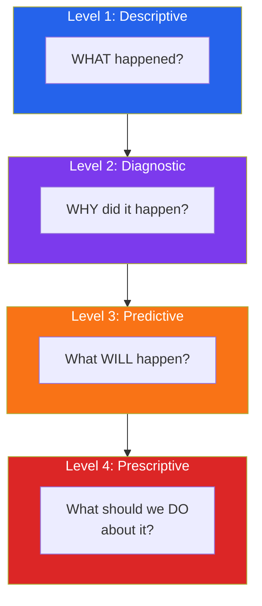
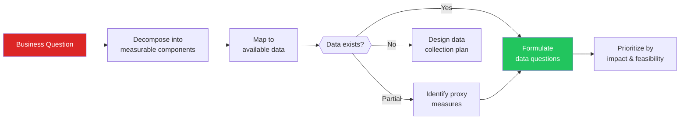
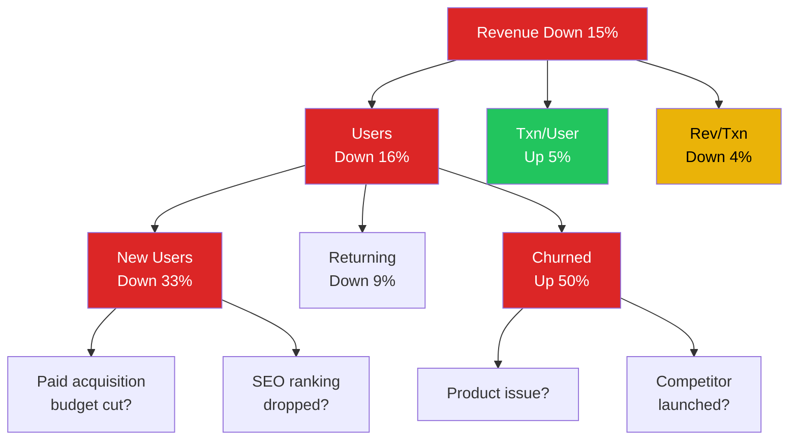
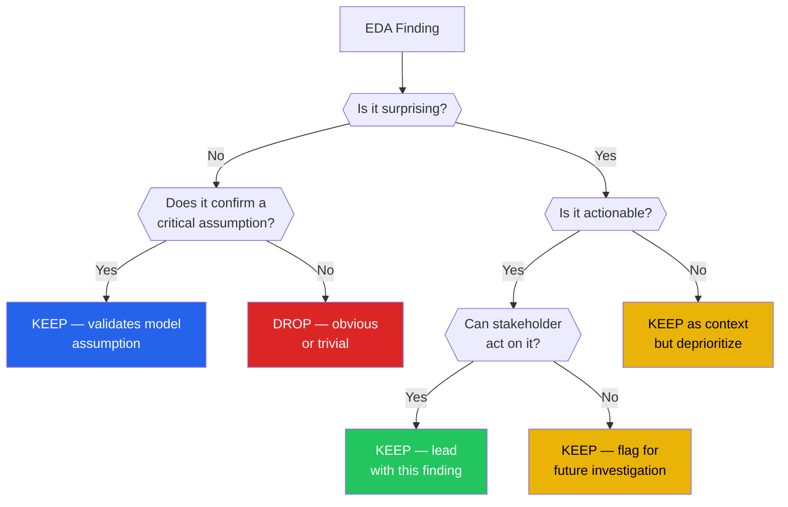

# Asking the Right Questions

The difference between a junior and senior data analyst is not their ability to use pandas. It is their ability to ask the right questions. A junior analyst opens a dataset and starts plotting everything. A senior analyst spends 30 minutes thinking about what they need to learn before writing a single line of code.

Most EDA failures are not technical failures — they are failures of question formulation. You can produce flawless visualizations of entirely the wrong thing. You can answer questions nobody asked. You can confirm what stakeholders already believe while missing what they actually need to know.

This page covers the discipline of asking questions before touching data: how to translate business problems into data questions, how to avoid confirmation bias, how to generate hypotheses systematically, and how to apply the "so what?" test to every finding.

---

## The Question Hierarchy

Not all questions are created equal. There is a hierarchy from descriptive to prescriptive:



### Examples Across the Hierarchy

```python
# question_hierarchy.py — Same dataset, four levels of questions
import pandas as pd
import numpy as np

# Simulate an e-commerce dataset
np.random.seed(42)
n = 5000

dates = pd.date_range('2025-01-01', periods=365, freq='D')
data = {
    'date': np.random.choice(dates, n),
    'customer_id': np.random.randint(1, 1001, n),
    'channel': np.random.choice(['organic', 'paid', 'email', 'referral'], n,
                                 p=[0.4, 0.3, 0.2, 0.1]),
    'revenue': np.random.exponential(50, n),
    'returned': np.random.binomial(1, 0.08, n),
}
df = pd.DataFrame(data)
df['date'] = pd.to_datetime(df['date'])
df['month'] = df['date'].dt.month

# LEVEL 1 — DESCRIPTIVE: What happened?
print("=" * 50)
print("LEVEL 1 — DESCRIPTIVE: What happened?")
print("=" * 50)
print(f"Total revenue: ${df['revenue'].sum():,.0f}")
print(f"Total orders: {len(df)}")
print(f"Return rate: {df['returned'].mean():.1%}")
print(f"Revenue by channel:\n{df.groupby('channel')['revenue'].sum().sort_values(ascending=False)}")

# LEVEL 2 — DIAGNOSTIC: Why did it happen?
print(f"\n{'=' * 50}")
print("LEVEL 2 — DIAGNOSTIC: Why did it happen?")
print("=" * 50)
print("Q: Why is paid channel revenue lower than organic?")
print(f"Average order value by channel:\n"
      f"{df.groupby('channel')['revenue'].mean().sort_values(ascending=False)}")
print(f"\nReturn rate by channel:\n"
      f"{df.groupby('channel')['returned'].mean().sort_values(ascending=False)}")
print("Hypothesis: Paid customers have similar AOV but may differ in retention")

# LEVEL 3 — PREDICTIVE: What will happen?
print(f"\n{'=' * 50}")
print("LEVEL 3 — PREDICTIVE: What will happen?")
print("=" * 50)
monthly_revenue = df.groupby('month')['revenue'].sum()
print(f"Monthly revenue trend:\n{monthly_revenue}")
growth_rate = monthly_revenue.pct_change().mean()
print(f"\nAverage monthly growth rate: {growth_rate:.1%}")
print(f"Projected next month: ${monthly_revenue.iloc[-1] * (1 + growth_rate):,.0f}")

# LEVEL 4 — PRESCRIPTIVE: What should we do?
print(f"\n{'=' * 50}")
print("LEVEL 4 — PRESCRIPTIVE: What should we do?")
print("=" * 50)
channel_roi = df.groupby('channel').agg(
    total_revenue=('revenue', 'sum'),
    order_count=('revenue', 'count'),
    return_rate=('returned', 'mean'),
    avg_order=('revenue', 'mean')
).round(2)
print(channel_roi)
print("\nRecommendation: Shift budget from channels with high return rates")
print("to channels with high AOV and low return rates")
```

::: tip Start at Level 1, Aim for Level 4
Most analysts stop at Level 1 (descriptive). Your stakeholders want Level 4 (prescriptive). Use EDA to climb the ladder: describe what happened, diagnose why, predict what comes next, then prescribe action.
:::

---

## Translating Business Questions to Data Questions

Business stakeholders do not ask data questions. They ask business questions. Your job is to translate.

### The Translation Framework



### Real Translation Examples

```python
# business_to_data.py — Translating business questions
translations = [
    {
        "business": "Are our customers happy?",
        "bad_data_q": "What is the average satisfaction score?",
        "good_data_q": [
            "What is the distribution of NPS scores by segment?",
            "How has NPS trended over the last 6 months?",
            "What topics appear in negative reviews?",
            "What is the correlation between NPS and retention?",
        ],
        "why_bad": "Average hides bimodal distributions (very happy + very unhappy)"
    },
    {
        "business": "Why are sales declining?",
        "bad_data_q": "Show me the sales chart",
        "good_data_q": [
            "Is the decline in new customers, existing customers, or both?",
            "Which product categories are declining vs growing?",
            "Did conversion rate, traffic, or AOV change?",
            "Are there seasonal patterns we're confusing with decline?",
            "Did a competitor launch or a market event occur?",
        ],
        "why_bad": "A chart shows WHAT, not WHY. You need decomposition."
    },
    {
        "business": "Should we expand to Europe?",
        "bad_data_q": "How big is the European market?",
        "good_data_q": [
            "What % of our current traffic comes from Europe?",
            "What is the conversion rate for European visitors vs domestic?",
            "What are the regulatory/GDPR costs of operating in EU?",
            "Which European countries show highest organic demand?",
            "What do European competitors charge for similar products?",
        ],
        "why_bad": "Market size is irrelevant if you can't capture any of it"
    },
    {
        "business": "Is our new feature working?",
        "bad_data_q": "How many people used the feature?",
        "good_data_q": [
            "What % of eligible users adopted the feature?",
            "Do feature users retain better than non-users?",
            "Is there a self-selection bias (power users adopt everything)?",
            "What is the feature's impact on the core metric we care about?",
            "How quickly do users discover and adopt the feature?",
        ],
        "why_bad": "Usage count is vanity. Impact on outcomes is what matters."
    },
]

for t in translations:
    print(f"\nBusiness Q: {t['business']}")
    print(f"  BAD data question: {t['bad_data_q']}")
    print(f"  Why bad: {t['why_bad']}")
    print(f"  GOOD data questions:")
    for q in t['good_data_q']:
        print(f"    - {q}")
```

---

## The Pre-EDA Question Checklist

Before writing any code, answer these questions on paper (or in a markdown file):

```python
# pre_eda_checklist.py — Template for pre-EDA planning
pre_eda_template = """
# Pre-EDA Question Checklist

## 1. Context
- What is the business problem we are trying to solve?
- Who will use the results of this analysis?
- What decisions will be made based on this analysis?
- What is the cost of a wrong conclusion?

## 2. Data Provenance
- Where did this data come from?
- How was it collected? (survey, logs, sensors, manual entry?)
- When was it collected? (Is it current?)
- Who collected it? (Any incentives to bias the data?)
- What is the unit of observation? (one row = one what?)

## 3. Known Unknowns
- What data do we WISH we had but don't?
- What biases are likely present in the collection process?
- What population does this data represent? (And NOT represent?)
- Are there known data quality issues?

## 4. Hypotheses (Write BEFORE looking at data)
- H1: [Your first hypothesis]
- H2: [Your second hypothesis]
- H3: [Your third hypothesis]
- Anti-H1: [What would DISPROVE H1?]

## 5. Success Criteria
- What would a "good" result look like?
- What would cause us to abandon this analysis?
- How precise do our answers need to be?
"""

print(pre_eda_template)
```

::: warning Write Your Hypotheses BEFORE Looking at Data
This is the most violated rule in data analysis. Once you see the data, your brain will pattern-match and you will "discover" things you expected to see. Writing hypotheses first gives you a baseline to compare against. If all your hypotheses are confirmed, you should be suspicious — either the problem was too easy, or you have confirmation bias.
:::

---

## Hypothesis Generation Techniques

### The 5 Whys Method

```python
# five_whys.py — Structured root cause analysis
def five_whys(observation: str) -> list:
    """Demonstrate the 5 Whys technique for root cause analysis."""
    chain = [
        ("Observation", observation),
    ]
    return chain

# Example: Customer churn spike
chain = [
    ("Observation", "Customer churn increased from 5% to 12% this quarter"),
    ("Why 1?", "More customers are cancelling in their 3rd month"),
    ("Why 2?", "3rd-month customers hit the end of their free trial extension"),
    ("Why 3?", "Sales gave 90-day free trials to close Q3 deals"),
    ("Why 4?", "Sales had an aggressive Q3 quota and used discounts to hit it"),
    ("Why 5?", "Quota was set without considering customer quality metrics"),
]

print("THE 5 WHYS — Customer Churn Example")
print("=" * 50)
for level, explanation in chain:
    print(f"  {level}: {explanation}")

print("\nRoot cause: Misaligned incentives in sales quotas")
print("Data questions to validate:")
print("  1. Is churn concentrated in customers acquired in Q3?")
print("  2. Do trial-extension customers have different usage patterns?")
print("  3. What is the LTV of Q3 cohort vs previous quarters?")
```

### MECE Decomposition

```python
# mece_decomposition.py — Mutually Exclusive, Collectively Exhaustive
import pandas as pd
import numpy as np

# Problem: Revenue is down 15% year-over-year
# MECE decomposition of revenue:
# Revenue = Users x Transactions_per_User x Revenue_per_Transaction

np.random.seed(42)

# Simulate year-over-year data
metrics = pd.DataFrame({
    'metric': ['Total Revenue', 'Active Users', 'Txn per User', 'Rev per Txn',
               'New Users', 'Returning Users', 'Churned Users'],
    'last_year': [10_000_000, 50_000, 4.0, 50, 15_000, 35_000, 8_000],
    'this_year': [8_500_000, 42_000, 4.2, 48, 10_000, 32_000, 12_000],
})

metrics['change'] = ((metrics['this_year'] / metrics['last_year']) - 1) * 100
metrics['change_str'] = metrics['change'].apply(
    lambda x: f"+{x:.1f}%" if x > 0 else f"{x:.1f}%"
)

print("MECE Revenue Decomposition")
print("=" * 60)
print(metrics.to_string(index=False))

print("\n\nDiagnosis:")
print("  Revenue down 15% is driven by:")
print("  - Active users down 16% (main driver)")
print("    - New user acquisition down 33%")
print("    - Churn up 50%")
print("  - Transactions per user actually UP 5% (not the problem)")
print("  - Revenue per transaction down 4% (minor contributor)")
print("\n  Root cause: User acquisition and retention, NOT monetization")

# This MECE framework tells you WHERE to dig deeper:
print("\n\nNext EDA questions (prioritized):")
print("  1. What changed in user acquisition channels?")
print("  2. Which user segments are churning?")
print("  3. Is the revenue-per-transaction decline in specific products?")
```



---

## Confirmation Bias in EDA

Confirmation bias is the tendency to search for, interpret, and recall information that confirms your pre-existing beliefs. In EDA, it manifests in predictable ways.

### How Confirmation Bias Corrupts EDA

```python
# confirmation_bias.py — How the same data supports opposite conclusions
import pandas as pd
import numpy as np
from scipy import stats

np.random.seed(42)

# Simulate employee performance data
n = 500
df = pd.DataFrame({
    'department': np.random.choice(['Engineering', 'Sales', 'Marketing'], n,
                                    p=[0.4, 0.35, 0.25]),
    'remote': np.random.binomial(1, 0.5, n),
    'performance_score': np.random.normal(70, 15, n),
    'tenure_years': np.random.exponential(3, n),
    'hours_worked': np.random.normal(42, 5, n),
})
# Add slight noise correlation
df['performance_score'] += df['tenure_years'] * 0.5

# ANALYST A believes: "Remote workers perform better"
print("=== ANALYST A: Confirming 'Remote is Better' ===")
remote = df[df['remote'] == 1]['performance_score']
office = df[df['remote'] == 0]['performance_score']
print(f"Remote mean: {remote.mean():.1f}")
print(f"Office mean: {office.mean():.1f}")
# Cherry-pick: look at only top performers
top = df[df['performance_score'] > 80]
print(f"Among top performers, % remote: {top['remote'].mean():.1%}")
print("Analyst A: 'See? Remote work produces more top performers!'\n")

# ANALYST B believes: "Office workers perform better"
print("=== ANALYST B: Confirming 'Office is Better' ===")
# Cherry-pick: look at only the engineering department
eng = df[df['department'] == 'Engineering']
print(f"Engineering remote mean: {eng[eng['remote']==1]['performance_score'].mean():.1f}")
print(f"Engineering office mean: {eng[eng['remote']==0]['performance_score'].mean():.1f}")
# Cherry-pick: look at hours worked
print(f"Remote avg hours: {df[df['remote']==1]['hours_worked'].mean():.1f}")
print(f"Office avg hours: {df[df['remote']==0]['hours_worked'].mean():.1f}")
print("Analyst B: 'See? Office workers are more dedicated!'\n")

# THE HONEST APPROACH
print("=== HONEST ANALYST: Testing the hypothesis properly ===")
t_stat, p_value = stats.ttest_ind(remote, office)
print(f"t-statistic: {t_stat:.3f}")
print(f"p-value: {p_value:.3f}")
effect_size = (remote.mean() - office.mean()) / df['performance_score'].std()
print(f"Cohen's d (effect size): {effect_size:.3f}")
print(f"\nConclusion: {'No significant difference' if p_value > 0.05 else 'Significant difference'}")
print(f"Effect size is {'negligible' if abs(effect_size) < 0.2 else 'small' if abs(effect_size) < 0.5 else 'medium'}")
print("\nThe honest answer: remote vs office makes almost no difference")
print("in this dataset. Both analysts were cherry-picking.")
```

### Anti-Confirmation Bias Techniques

| Technique | How It Works | Example |
|-----------|-------------|---------|
| **Pre-registration** | Write hypotheses before seeing data | "I predict churn > 10% for users with < 3 logins/week" |
| **Devil's advocate** | Actively seek disconfirming evidence | "What if the correlation is driven by a confounder?" |
| **Blind analysis** | Analyze data without knowing group labels | Shuffle treatment/control labels, analyze, then reveal |
| **Red team** | Have someone try to disprove your findings | Ask a colleague to find flaws in your analysis |
| **Pre-mortem** | Before starting, ask "How could this analysis go wrong?" | "If I find X, what else could explain it?" |
| **Multiple comparisons** | Always report ALL tests, not just significant ones | "I tested 15 variables; 2 were significant" |

```python
# anti_bias_preregistration.py — How to pre-register EDA hypotheses
import json
from datetime import datetime

preregistration = {
    "project": "Q1 Customer Churn Analysis",
    "analyst": "Data Team",
    "date_registered": "2026-03-24",
    "date_data_accessed": None,  # Fill AFTER pre-registration

    "primary_hypotheses": [
        {
            "id": "H1",
            "statement": "Customers with < 3 logins per week in their first month churn at > 2x the rate of active customers",
            "variable": "login_frequency_month1",
            "threshold": "3 logins/week",
            "expected_effect": "2x churn rate",
            "analysis_plan": "Compare churn rates of below-threshold vs above-threshold groups using chi-squared test"
        },
        {
            "id": "H2",
            "statement": "Price-sensitive customers (those who used discount codes) churn more after price increases",
            "variable": "used_discount_code AND price_increase_exposure",
            "threshold": "Any discount code usage",
            "expected_effect": "50% higher churn",
            "analysis_plan": "Difference-in-differences: compare churn before/after price change for discount vs non-discount users"
        },
    ],
    "exploratory_questions": [
        "Are there customer segments we haven't identified?",
        "What features best predict churn in a random forest?",
        "Is there a seasonal pattern to churn?",
    ],
    "what_would_change_my_mind": [
        "If login frequency has no relationship to churn, our onboarding thesis is wrong",
        "If discount users churn LESS, discounts may actually build loyalty",
    ],
    "known_limitations": [
        "We only have data for customers who signed up after July 2025",
        "We cannot distinguish voluntary churn from involuntary (failed payment)",
    ]
}

print(json.dumps(preregistration, indent=2))
```

::: danger The Most Insidious Form of Confirmation Bias
It is not cherry-picking results you know are wrong. It is stopping your analysis as soon as you find something that confirms your prior belief. You find one chart that shows what you expected, and you stop looking. The cure: always ask "What would I expect to see if my hypothesis were FALSE?" and check for that too.
:::

---

## The "So What?" Test

Every finding in EDA must pass the "so what?" test: if someone reads this finding, would it change a decision?

### Applying the Test

```python
# so_what_test.py — Filtering findings that actually matter
import pandas as pd
import seaborn as sns

tips = sns.load_dataset('tips')

findings = [
    {
        "finding": "The dataset has 244 rows and 7 columns",
        "so_what": "Nothing. This is metadata, not insight.",
        "actionable": False,
        "keep": False,
    },
    {
        "finding": "Average tip is $3.00 (15.5% of bill)",
        "so_what": "Confirms expected tipping norms. Not surprising.",
        "actionable": False,
        "keep": False,
    },
    {
        "finding": "Sunday dinner has the highest average bill ($21.41) "
                   "and highest tip ($3.26)",
        "so_what": "Staff Sunday dinner shifts more heavily — higher revenue "
                   "and tips per table.",
        "actionable": True,
        "keep": True,
    },
    {
        "finding": "Smoker tables have 20% higher tip variance",
        "so_what": "Smoker sections are less predictable for revenue "
                   "forecasting. Consider when projecting daily revenue.",
        "actionable": True,
        "keep": True,
    },
    {
        "finding": "There are more male payers than female payers in the dataset",
        "so_what": "Reflects who pays, not who dines. Could be cultural. "
                   "Not actionable without more context.",
        "actionable": False,
        "keep": False,
    },
    {
        "finding": "Parties of 2 make up 60% of all tables but only 45% of revenue",
        "so_what": "Larger parties are disproportionately valuable. "
                   "Seating optimization should prioritize large party capacity.",
        "actionable": True,
        "keep": True,
    },
]

# Demonstrate the filtering
print("THE 'SO WHAT?' TEST")
print("=" * 60)
kept = 0
for f in findings:
    status = "KEEP" if f['keep'] else "DROP"
    print(f"\n[{status}] Finding: {f['finding']}")
    print(f"  So what?: {f['so_what']}")
    if f['keep']:
        kept += 1

print(f"\n\nKept {kept}/{len(findings)} findings ({kept/len(findings):.0%})")
print("A good EDA report keeps 30-50% of findings.")
print("If you keep everything, you have a data dump, not an analysis.")

# Validate some of these findings with actual code
print("\n\nValidating kept findings:")
print("\nAverage bill and tip by day+time:")
print(tips.groupby(['day', 'time'])[['total_bill', 'tip']].mean().round(2))

print("\nTip variance by smoker status:")
print(tips.groupby('smoker')['tip'].agg(['mean', 'std', 'var']).round(2))

print("\nRevenue share by party size:")
size_analysis = tips.groupby('size').agg(
    table_count=('total_bill', 'count'),
    total_revenue=('total_bill', 'sum')
)
size_analysis['pct_tables'] = size_analysis['table_count'] / len(tips) * 100
size_analysis['pct_revenue'] = size_analysis['total_revenue'] / tips['total_bill'].sum() * 100
print(size_analysis.round(1))
```

### The So What Decision Tree



---

## Question Templates by Domain

```python
# domain_questions.py — Question templates for common data science domains

domain_questions = {
    "E-commerce": {
        "descriptive": [
            "What are the top 10 products by revenue?",
            "What is the distribution of order values?",
            "What percentage of revenue comes from repeat customers?",
        ],
        "diagnostic": [
            "Why did conversion rate drop last week?",
            "Which step in the funnel has the highest drop-off?",
            "What distinguishes one-time buyers from repeat buyers?",
        ],
        "predictive": [
            "Which customers are most likely to churn in the next 30 days?",
            "What will holiday season revenue look like?",
            "Which products will need restocking first?",
        ],
        "prescriptive": [
            "Which customer segment should we target with the next campaign?",
            "What discount level maximizes profit (not just revenue)?",
            "Should we invest in acquisition or retention?",
        ],
    },
    "Healthcare": {
        "descriptive": [
            "What is the distribution of patient wait times?",
            "What are the most common diagnoses by age group?",
            "What is the readmission rate by department?",
        ],
        "diagnostic": [
            "Why do certain departments have higher readmission rates?",
            "What factors correlate with longer hospital stays?",
            "Are there disparities in treatment outcomes across demographics?",
        ],
        "predictive": [
            "Which patients are at highest risk of readmission?",
            "What will next quarter's ICU occupancy look like?",
            "Can we predict no-show appointments?",
        ],
        "prescriptive": [
            "How should we staff the ER on weekends vs weekdays?",
            "Which interventions reduce readmission most cost-effectively?",
            "Should we expand capacity or improve throughput?",
        ],
    },
    "SaaS / Product": {
        "descriptive": [
            "What is the DAU/MAU ratio?",
            "What features are used most/least?",
            "What is the distribution of session lengths?",
        ],
        "diagnostic": [
            "Why did trial-to-paid conversion drop?",
            "What do users do right before they churn?",
            "Why do enterprise users engage more than SMB users?",
        ],
        "predictive": [
            "Which trial users will convert to paid?",
            "What is the expected LTV of a user acquired from channel X?",
            "When will we hit our ARR target at current growth?",
        ],
        "prescriptive": [
            "Which onboarding flow variant should we roll out?",
            "What features should we build next to reduce churn?",
            "How should we price the new tier?",
        ],
    },
}

for domain, levels in domain_questions.items():
    print(f"\n{'=' * 50}")
    print(f"DOMAIN: {domain}")
    print(f"{'=' * 50}")
    for level, questions in levels.items():
        print(f"\n  {level.upper()}:")
        for q in questions:
            print(f"    - {q}")
```

---

## Building a Question Tree

For complex analyses, build a question tree that maps the logical flow from high-level questions to specific data queries.

```python
# question_tree.py — Structured decomposition of a complex question
import pandas as pd
import numpy as np

# Example: "Should we launch in a new market?"
question_tree = {
    "root": "Should we launch Product X in Germany?",
    "branches": [
        {
            "question": "Is there demand?",
            "data_queries": [
                "Google Trends: search volume for our category in Germany vs US",
                "Competitor analysis: who operates in Germany? Revenue estimates?",
                "Our data: How many German IPs visit our site? Conversion rate?",
            ],
            "sub_questions": [
                {
                    "question": "Is demand growing or shrinking?",
                    "data_queries": [
                        "Year-over-year search trend",
                        "Competitor funding/hiring signals",
                    ]
                },
            ]
        },
        {
            "question": "Can we serve the market?",
            "data_queries": [
                "GDPR compliance cost estimate",
                "Localization effort (language, payment methods, tax)",
                "Existing infrastructure: latency from nearest data center",
            ],
            "sub_questions": [
                {
                    "question": "What is the minimum viable localization?",
                    "data_queries": [
                        "% of German users who can use English product",
                        "Payment method preferences in Germany",
                    ]
                },
            ]
        },
        {
            "question": "Is it profitable?",
            "data_queries": [
                "CAC estimate based on German ad market CPM/CPC",
                "Expected LTV using US cohort data adjusted for purchasing power",
                "Break-even timeline at different growth scenarios",
            ],
            "sub_questions": [
                {
                    "question": "What is our competitive advantage in this market?",
                    "data_queries": [
                        "Feature comparison matrix vs German competitors",
                        "Price positioning analysis",
                    ]
                },
            ]
        },
    ]
}

def print_tree(tree, indent=0):
    prefix = "  " * indent
    print(f"{prefix}Q: {tree['root'] if 'root' in tree else tree['question']}")
    branches = tree.get('branches', tree.get('sub_questions', []))
    for branch in branches:
        print(f"{prefix}  Q: {branch['question']}")
        for dq in branch['data_queries']:
            print(f"{prefix}    -> Data: {dq}")
        for sub in branch.get('sub_questions', []):
            print(f"{prefix}    Q: {sub['question']}")
            for dq in sub['data_queries']:
                print(f"{prefix}      -> Data: {dq}")

print_tree(question_tree)
```

---

## The Question Quality Rubric

```python
# question_quality.py — Score your questions before analyzing
def score_question(question: str, criteria: dict) -> dict:
    """Score a data question on multiple quality dimensions."""
    total = sum(criteria.values())
    max_score = len(criteria) * 3  # max 3 per criterion
    return {
        "question": question,
        "scores": criteria,
        "total": total,
        "max": max_score,
        "grade": "A" if total/max_score > 0.8 else
                 "B" if total/max_score > 0.6 else
                 "C" if total/max_score > 0.4 else "D"
    }

# Score example questions
q1 = score_question(
    "What is the average revenue?",
    {
        "specific": 1,       # 1/3 — too vague (which time period? which segment?)
        "measurable": 3,     # 3/3 — clearly measurable
        "actionable": 1,     # 1/3 — knowing the average changes nothing
        "relevant": 2,       # 2/3 — revenue matters but average is misleading
        "time_bound": 1,     # 1/3 — no time frame specified
        "testable": 2,       # 2/3 — can compute but no hypothesis to test
    }
)

q2 = score_question(
    "Did customers acquired through paid search in Q4 2025 have lower "
    "30-day retention than organic customers, controlling for product tier?",
    {
        "specific": 3,       # 3/3 — exact segment, timeframe, metric
        "measurable": 3,     # 3/3 — retention rate is clearly defined
        "actionable": 3,     # 3/3 — would change marketing budget allocation
        "relevant": 3,       # 3/3 — directly impacts CAC/LTV calculations
        "time_bound": 3,     # 3/3 — Q4 2025, 30-day window
        "testable": 3,       # 3/3 — clear hypothesis with control variable
    }
)

for q in [q1, q2]:
    print(f"\nQuestion: {q['question']}")
    print(f"Grade: {q['grade']} ({q['total']}/{q['max']})")
    for criterion, score in q['scores'].items():
        bar = '#' * score + '.' * (3 - score)
        print(f"  {criterion:12s}: [{bar}] {score}/3")
```

| Quality Dimension | Bad Example | Good Example |
|-------------------|-------------|-------------|
| **Specific** | "How are sales?" | "How did Category X sales change in Q1 vs Q4?" |
| **Measurable** | "Are customers happy?" | "What % of customers gave NPS > 8?" |
| **Actionable** | "What is the average age?" | "Should we target 25-34 or 35-44 age group?" |
| **Relevant** | "How many rows are there?" | "Do we have enough data to detect a 5% effect?" |
| **Time-bound** | "What is revenue?" | "What was MRR growth rate over the last 6 months?" |
| **Testable** | "Is our product good?" | "Do users who complete onboarding retain 2x better?" |

---

## Summary

| Concept | Key Takeaway |
|---------|-------------|
| Question hierarchy | Move from descriptive (what) to prescriptive (what to do) |
| Business translation | Decompose vague business questions into specific, measurable data queries |
| Pre-registration | Write hypotheses BEFORE seeing data to combat confirmation bias |
| MECE decomposition | Break metrics into non-overlapping components to find root causes |
| Confirmation bias | The biggest threat to valid EDA — actively seek disconfirming evidence |
| "So what?" test | Every finding must pass: would this change a decision? |
| Question quality | Score questions on specificity, measurability, actionability, relevance, time-boundedness |

---

## What's Next

| Page | What You'll Learn |
|------|------------------|
| [EDA Workflow](/eda/eda-workflow) | The 10-step systematic process from data acquisition to communication |
| [Common Mistakes](/eda/common-mistakes) | 30+ mistakes to avoid during analysis |
| [Data Profiling](/eda/data-profiling) | Your first 15 minutes with any dataset |
