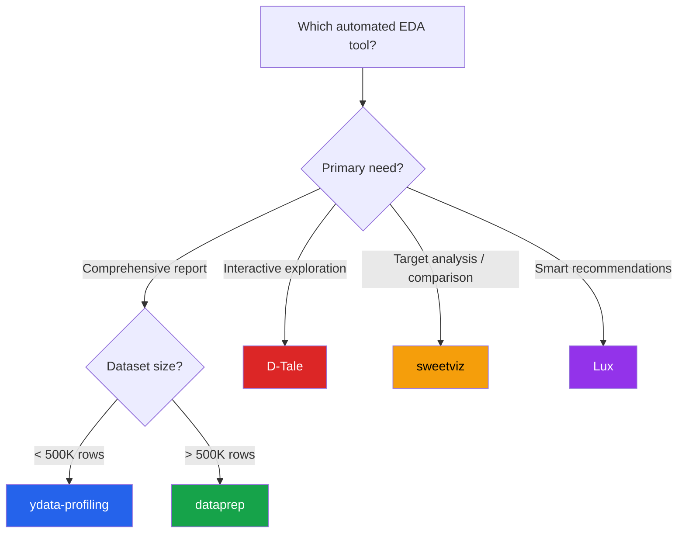

# Automated EDA Tools

Automated EDA libraries generate comprehensive data profiles in one line of code. They are ideal for initial data understanding, data quality checks, and quick reporting. This page compares the five leading libraries with working code examples.

---

## Tool Comparison Matrix

| Feature | ydata-profiling | sweetviz | D-Tale | Lux | dataprep |
|---------|:---:|:---:|:---:|:---:|:---:|
| HTML report | Yes | Yes | No (web UI) | No (Jupyter) | Yes |
| Interactive | Limited | Limited | Full | Full | Limited |
| Large data (>1M) | Slow | Moderate | Fast | Moderate | Fast |
| Correlations | 5 types | Pearson/assoc | Pearson | Pearson | Pearson/Spearman |
| Missing data | Excellent | Good | Good | Basic | Good |
| Text profiling | Yes | No | No | No | No |
| Time series | Yes | No | No | No | Yes |
| Alerts/warnings | Yes | Yes | No | Implicit | No |
| Comparison reports | Yes | Yes | No | No | No |

---

## Setup Dataset

```python
import pandas as pd
import numpy as np

np.random.seed(42)
n = 5000

df = pd.DataFrame({
    'customer_id':  range(1, n + 1),
    'age':          np.random.normal(42, 14, n).clip(18, 85).astype(int),
    'income':       np.round(np.random.lognormal(10.8, 0.7, n), 0),
    'credit_score': np.random.normal(690, 65, n).clip(300, 850).astype(int),
    'tenure_yrs':   np.random.exponential(5, n).clip(0, 30).round(1),
    'n_products':   np.random.poisson(3, n).clip(1, 10),
    'balance':      np.round(np.random.lognormal(9, 2, n), 2),
    'region':       np.random.choice(['North', 'South', 'East', 'West'], n, p=[0.3, 0.2, 0.25, 0.25]),
    'segment':      np.random.choice(['Premium', 'Standard', 'Basic'], n, p=[0.15, 0.5, 0.35]),
    'channel':      np.random.choice(['Online', 'Branch', 'Phone'], n, p=[0.5, 0.35, 0.15]),
    'churned':      np.random.choice([0, 1], n, p=[0.82, 0.18]),
    'signup_date':  pd.date_range('2018-01-01', periods=n, freq='4h'),
})

# Inject missing values
for col in ['income', 'credit_score', 'balance', 'region']:
    mask = np.random.rand(n) < 0.04
    df.loc[mask, col] = np.nan

print(f"Dataset: {df.shape[0]} rows x {df.shape[1]} columns")
print(f"Missing: {df.isna().sum().sum()} cells")
```

---

## ydata-profiling (formerly pandas-profiling)

The most comprehensive automated profiling tool. Generates a full HTML report with distribution analysis, correlation matrices, missing data patterns, and interaction detection.

```python
# pip install ydata-profiling

from ydata_profiling import ProfileReport

# Basic report
profile = ProfileReport(
    df,
    title="Customer Churn Dataset — EDA Profile",
    explorative=True,
)

# Display in Jupyter
profile.to_notebook_iframe()

# Save as HTML file
profile.to_file("customer_profile.html")

# Get as JSON (for programmatic access)
json_report = profile.to_json()
```

### Advanced Configuration

```python
profile = ProfileReport(
    df,
    title="Customer Dataset — Detailed Profile",
    # Performance settings
    minimal=False,           # Full report (set True for large datasets)
    pool_size=4,             # Parallel processing
    samples={"head": 10, "tail": 10},

    # Correlation settings
    correlations={
        "pearson":  {"calculate": True, "warn_high_correlations": 0.8},
        "spearman": {"calculate": True, "warn_high_correlations": 0.8},
        "kendall":  {"calculate": True},
        "phi_k":    {"calculate": True},   # Phi-K for mixed types
        "cramers":  {"calculate": True},   # Cramer's V for categorical
    },

    # Missing data
    missing_diagrams={
        "bar": True,
        "matrix": True,
        "heatmap": True,
    },

    # Interaction detection
    interactions={
        "continuous": True,   # pairwise scatter plots
        "targets": ["churned"],
    },

    # Variable type overrides
    type_schema={
        "customer_id": "categorical",  # force ID as categorical
        "churned": "categorical",      # force binary as categorical
    },
)

profile.to_file("detailed_profile.html")
print(f"Report sections: {list(profile.get_description().keys())}")
```

### Comparison Reports

```python
# Compare two datasets (e.g., train vs test, before vs after)
df_train = df.sample(frac=0.7, random_state=42)
df_test = df.drop(df_train.index)

train_profile = ProfileReport(df_train, title="Train Set", minimal=True)
test_profile = ProfileReport(df_test, title="Test Set", minimal=True)

comparison = train_profile.compare(test_profile)
comparison.to_file("train_vs_test_comparison.html")
```

---

## sweetviz

Fast, visually rich comparison reports with a focus on target variable analysis.

```python
# pip install sweetviz

import sweetviz as sv

# Basic report
report = sv.analyze(df, target_feat='churned')
report.show_html('sweetviz_report.html')

# Comparison report (two DataFrames)
df_churned = df[df['churned'] == 1]
df_active = df[df['churned'] == 0]

compare_report = sv.compare(
    [df_active, "Active Customers"],
    [df_churned, "Churned Customers"],
    target_feat='income'
)
compare_report.show_html('sweetviz_comparison.html')

# Compare train vs test
report = sv.compare(
    [df_train, "Training Set"],
    [df_test, "Test Set"],
)
report.show_html('sweetviz_train_test.html')
```

### sweetviz Configuration

```python
# Customize the analysis
report = sv.analyze(
    df,
    target_feat='churned',
    feat_cfg=sv.FeatureConfig(
        skip=['customer_id'],       # skip ID columns
        force_cat=['churned'],      # force as categorical
        force_num=['n_products'],   # force as numeric
    ),
    pairwise_analysis='on',         # compute all pairwise associations
)
report.show_html('sweetviz_custom.html')

# Programmatic access to stats
# report.get_feature_config()  # see how features were typed
```

---

## D-Tale

The most interactive option: launches a full web-based UI for live data exploration.

```python
# pip install dtale

import dtale

# Launch interactive UI
d = dtale.show(df)
d.open_browser()

# Or in Jupyter
d  # renders inline

# Access the URL
print(f"D-Tale URL: {d._url}")
```

### D-Tale Key Features

```python
# Programmatic access while D-Tale is running

# Get column statistics
stats = d.describe()
print(stats)

# Build charts programmatically
d.build_chart(
    chart_type='bar',
    x='region',
    y=['income'],
    agg='mean',
)

# Filter data
d.filter('age > 40 and income > 50000')

# Export
d.to_csv('dtale_export.csv')

# Kill the instance
d.kill()
```

### D-Tale Configuration

```python
import dtale
import dtale.global_state as global_state

# Configuration
dtale.show(
    df,
    name='customer_data',
    ignore_duplicate=True,
    drop_index=True,
    # Hide columns
    hide_columns=['customer_id'],
)

# D-Tale provides through the UI:
# - Column analysis (distributions, frequency, outliers)
# - Correlations (Pearson, Spearman) with scatter plots
# - Missing data analysis
# - Charts builder (line, bar, scatter, pie, heatmap, 3D)
# - Code export (generates pandas code for your interactions)
# - Duplicate detection
# - Column filtering and highlighting
```

---

## Lux

Automatic visualization recommendations inside Jupyter notebooks. Lux augments the standard DataFrame display with suggested charts.

```python
# pip install lux-api

import lux
import pandas as pd

# Enable Lux (augments pandas DataFrames)
df_lux = df.copy()

# Simply display the DataFrame — Lux adds a "Toggle Pandas/Lux" button
df_lux  # In Jupyter, this shows data + visualization recommendations

# Set intent: what you want to explore
df_lux.intent = ['churned']  # visualize everything w.r.t. churn
df_lux  # recommendations now focus on churn

# Multi-column intent
df_lux.intent = ['income', 'churned']
df_lux  # scatter + distributions related to income & churn

# Filter intent
df_lux.intent = ['income', 'age', 'region=North']
df_lux  # filtered exploration
```

### Lux Exports

```python
# Save recommended visualizations
vis_list = df_lux.recommendation['Correlation']
vis_list[0]  # display first recommended chart

# Export to Matplotlib code
from lux.vis.Vis import Vis
vis = Vis(['income', 'age'], df_lux)
print(vis.to_matplotlib_code())

# Export to Altair
print(vis.to_altair())

# Export all recommendations as HTML
from lux.vis.VisList import VisList
vis_list.export_as_html('lux_recommendations.html')
```

---

## dataprep

Built for speed on large datasets. Produces clean reports with minimal configuration.

```python
# pip install dataprep

from dataprep.eda import create_report, plot, plot_correlation, plot_missing

# Full EDA report (fastest option for large datasets)
report = create_report(df, title="Customer EDA Report")
report.save("dataprep_report.html")
report.show_browser()

# Plot overview
plot(df)               # distribution overview
plot(df, 'income')     # single column deep dive
plot(df, 'income', 'age')  # bivariate analysis
```

### Targeted Analysis

```python
# Correlation analysis
plot_correlation(df)                          # all correlations
plot_correlation(df, 'income')                # one variable vs all
plot_correlation(df, value_range=[-1, 0.5])   # filter by range

# Missing data analysis
plot_missing(df)                              # overview
plot_missing(df, 'income')                    # impact of income being missing
plot_missing(df, 'income', 'balance')         # pairwise missing pattern

# Custom configuration
from dataprep.eda import create_report

report = create_report(
    df,
    title="Detailed Customer Report",
    config={
        'hist.bins': 50,
        'bar.bars': 20,
        'insight.enable': True,  # auto-generate insights
    }
)
report.save("dataprep_detailed.html")
```

### dataprep for Cleaning

```python
from dataprep.clean import clean_headers, clean_country, clean_email

# Clean column headers
df_clean = clean_headers(df, case='snake')

# Validate and clean specific column types
# clean_email(df, 'email_column')
# clean_country(df, 'country_column')
```

---

## Decision Guide



### When to Use Each Tool

| Scenario | Recommended Tool |
|----------|-----------------|
| First look at a new dataset (< 500K rows) | ydata-profiling |
| First look at a large dataset (> 500K rows) | dataprep |
| Compare train vs test for data drift | sweetviz or ydata-profiling |
| Interactive session with colleagues | D-Tale |
| Jupyter-native visual exploration | Lux |
| Target variable analysis | sweetviz |
| Mixed data types (text + numeric) | ydata-profiling |
| Quick quality check in CI/CD | dataprep |
| Presentation-ready report | ydata-profiling or sweetviz |

---

## Combining Manual and Automated EDA

```python
# Step 1: Automated overview (5 minutes)
from ydata_profiling import ProfileReport
profile = ProfileReport(df, minimal=True, title="Quick Overview")
profile.to_file("quick_overview.html")

# Step 2: Read the automated report and identify areas to explore further

# Step 3: Manual deep dives on interesting findings
import seaborn as sns
import matplotlib.pyplot as plt

# The automated report flagged high correlation between income and balance
fig, ax = plt.subplots(figsize=(10, 6))
sns.scatterplot(data=df, x='income', y='balance', hue='churned',
                alpha=0.3, ax=ax)
ax.set_xscale('log')
ax.set_yscale('log')
ax.set_title('Income vs Balance by Churn Status')
plt.tight_layout()
plt.show()

# The report flagged missing data pattern between income and region
import pandas as pd
missing_cross = pd.crosstab(
    df['income'].isna(),
    df['region'].fillna('Missing'),
    margins=True,
)
print("Missing income by region:")
print(missing_cross)

# Step 4: Statistical tests on flagged relationships
from scipy import stats
churned_income = df[df['churned'] == 1]['income'].dropna()
active_income = df[df['churned'] == 0]['income'].dropna()
stat, p = stats.mannwhitneyu(churned_income, active_income)
print(f"Income difference by churn: U={stat:.0f}, p={p:.4f}")
```

---

## Performance Tips

```python
# ydata-profiling: use minimal mode for large datasets
profile = ProfileReport(df, minimal=True, pool_size=8)

# sweetviz: no specific large-data mode, sample first
sample = df.sample(min(50000, len(df)), random_state=42)
report = sv.analyze(sample)

# D-Tale: handles large data natively (server-side filtering)
d = dtale.show(df, ignore_duplicate=True)

# dataprep: designed for large data
from dataprep.eda import create_report
report = create_report(df, title="Large Dataset")  # uses Dask internally

# General tip: always sample for the initial profile, then run full on subsets
if len(df) > 100_000:
    sample = df.sample(50_000, random_state=42)
    profile = ProfileReport(sample, title="Sampled Profile")
else:
    profile = ProfileReport(df, title="Full Profile")
```

---

## Key Takeaways

- Automated EDA tools **save hours** on initial data understanding — run them first on every new dataset
- **ydata-profiling** is the most comprehensive but slowest; use `minimal=True` for large datasets
- **sweetviz** excels at **target analysis** and **dataset comparison** (train/test, before/after)
- **D-Tale** provides the most **interactive experience** for live data exploration sessions
- **Lux** provides **smart recommendations** right inside Jupyter without learning a new API
- **dataprep** is the **fastest** for large datasets and produces clean, simple reports
- Automated EDA is a **starting point**, not a replacement for manual deep dives on specific findings
- Always combine automated profiling with **targeted statistical tests** and **custom visualizations**
