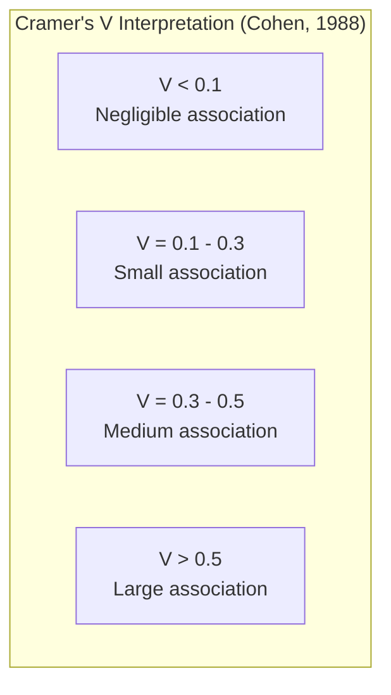
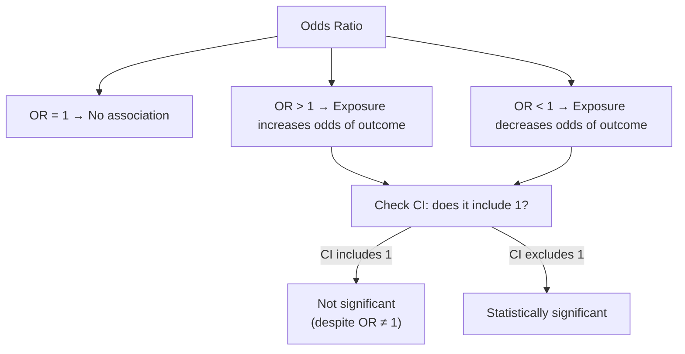
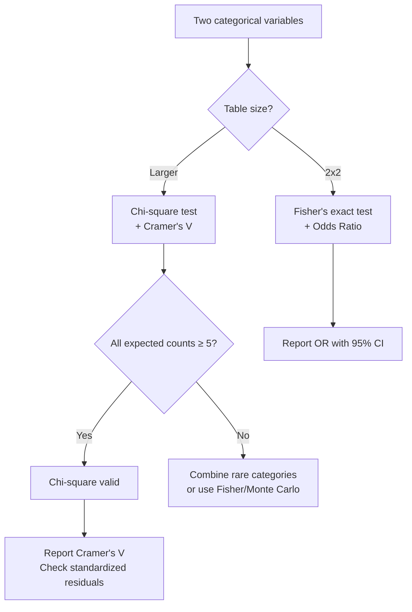

# Bivariate Analysis: Categorical vs Categorical

Two categorical variables. Are they independent, or does knowing one tell you something about the other? Does the distribution of payment methods differ across regions? Is churn associated with subscription plan? Are treatment outcomes related to patient group?

This page covers cross-tabulation, chi-square tests of independence, Cramer's V for effect size, mosaic plots for visual display, and odds ratios for 2x2 tables.

## The Dataset

We will generate a customer dataset with known associations between categorical variables.

```python
import numpy as np
import pandas as pd
import matplotlib.pyplot as plt
import seaborn as sns
from scipy import stats
from scipy.stats import chi2_contingency, fisher_exact

np.random.seed(42)
n = 3000

# Region affects product preference
regions = np.random.choice(
    ["North America", "Europe", "Asia", "South America"],
    size=n, p=[0.35, 0.30, 0.25, 0.10],
)

# Product category depends on region (conditional probabilities)
product_probs = {
    "North America": [0.30, 0.25, 0.20, 0.15, 0.10],
    "Europe":        [0.20, 0.15, 0.25, 0.25, 0.15],
    "Asia":          [0.35, 0.30, 0.10, 0.15, 0.10],
    "South America": [0.15, 0.20, 0.30, 0.20, 0.15],
}
product_cats = ["Electronics", "Clothing", "Food", "Home", "Sports"]
products = [np.random.choice(product_cats, p=product_probs[r]) for r in regions]

# Churn associated with plan type (strong association)
plans = np.random.choice(["Free", "Basic", "Pro", "Enterprise"],
                          size=n, p=[0.30, 0.35, 0.25, 0.10])
churn_probs = {"Free": 0.40, "Basic": 0.25, "Pro": 0.12, "Enterprise": 0.05}
churned = [np.random.random() < churn_probs[p] for p in plans]
churn_status = ["Churned" if c else "Active" for c in churned]

# Payment method — weakly associated with region
payment_probs = {
    "North America": [0.45, 0.30, 0.15, 0.10],
    "Europe":        [0.35, 0.25, 0.25, 0.15],
    "Asia":          [0.30, 0.20, 0.20, 0.30],
    "South America": [0.40, 0.35, 0.15, 0.10],
}
payment_methods = ["Credit Card", "Debit Card", "PayPal", "Digital Wallet"]
payments = [np.random.choice(payment_methods, p=payment_probs[r]) for r in regions]

df = pd.DataFrame({
    "region": regions,
    "product": products,
    "plan": plans,
    "churn": churn_status,
    "payment": payments,
})

# Set ordered categories where appropriate
df["plan"] = pd.Categorical(df["plan"], categories=["Free", "Basic", "Pro", "Enterprise"], ordered=True)

print(df.shape)
print(df.dtypes)
df.head()
```

## Cross-Tabulation: The Foundation

A cross-tabulation (contingency table) shows the joint frequency distribution of two categorical variables.

```python
def detailed_crosstab(df, row_var, col_var):
    """Create detailed cross-tabulation with margins and percentages."""
    # Raw counts
    ct = pd.crosstab(df[row_var], df[col_var], margins=True, margins_name="Total")
    print(f"\n{'='*65}")
    print(f"  Cross-Tabulation: {row_var} x {col_var}")
    print(f"{'='*65}")
    print(f"\nRaw Counts:")
    print(ct.to_string())

    # Row percentages (how each row distributes across columns)
    ct_row = pd.crosstab(df[row_var], df[col_var], normalize="index") * 100
    print(f"\nRow Percentages (how {row_var} distributes across {col_var}):")
    print(ct_row.round(1).to_string())

    # Column percentages
    ct_col = pd.crosstab(df[row_var], df[col_var], normalize="columns") * 100
    print(f"\nColumn Percentages (composition of each {col_var}):")
    print(ct_col.round(1).to_string())

    # Expected frequencies under independence
    ct_raw = pd.crosstab(df[row_var], df[col_var])
    chi2, p, dof, expected = chi2_contingency(ct_raw)
    expected_df = pd.DataFrame(expected, index=ct_raw.index, columns=ct_raw.columns)
    print(f"\nExpected Frequencies (under independence):")
    print(expected_df.round(1).to_string())

    # Observed - Expected (residuals)
    residuals = ct_raw - expected_df
    print(f"\nObserved - Expected (positive = more than expected):")
    print(residuals.round(1).to_string())

    return ct_raw, expected_df

ct, exp = detailed_crosstab(df, "region", "product")
```

## Chi-Square Test of Independence

The chi-square test asks: "Could this contingency table have arisen if the two variables were independent?"

```python
def chi_square_analysis(df, row_var, col_var):
    """Complete chi-square analysis with effect sizes."""
    ct = pd.crosstab(df[row_var], df[col_var])
    n_total = ct.values.sum()
    n_rows, n_cols = ct.shape

    # Chi-square test
    chi2, p_value, dof, expected = chi2_contingency(ct)

    print(f"\n{'='*65}")
    print(f"  Chi-Square Test: {row_var} x {col_var}")
    print(f"{'='*65}")
    print(f"  Chi² statistic: {chi2:.3f}")
    print(f"  Degrees of freedom: {dof}")
    print(f"  p-value: {p_value:.2e}")
    print(f"  n: {n_total:,}")

    # Check validity: expected frequencies
    expected_flat = expected.flatten()
    low_expected = (expected_flat < 5).sum()
    if low_expected > 0:
        print(f"\n  WARNING: {low_expected} cells have expected count < 5 "
              f"({low_expected / len(expected_flat) * 100:.1f}%)")
        print(f"  Chi-square may be unreliable. Consider Fisher's exact or combining categories.")

    # Effect sizes
    # Cramer's V
    k = min(n_rows, n_cols)
    cramers_v = np.sqrt(chi2 / (n_total * (k - 1)))

    # Bias-corrected Cramer's V (Bergsma, 2013)
    phi2 = chi2 / n_total
    phi2_corrected = max(0, phi2 - (n_rows - 1) * (n_cols - 1) / (n_total - 1))
    k_rows_corr = n_rows - (n_rows - 1)**2 / (n_total - 1)
    k_cols_corr = n_cols - (n_cols - 1)**2 / (n_total - 1)
    cramers_v_corrected = np.sqrt(phi2_corrected / (min(k_rows_corr, k_cols_corr) - 1))

    # Contingency coefficient
    cont_coeff = np.sqrt(chi2 / (chi2 + n_total))

    print(f"\n  Effect Sizes:")
    print(f"    Cramer's V:              {cramers_v:.4f}", end="")
    if cramers_v < 0.1:
        print(" (negligible)")
    elif cramers_v < 0.3:
        print(" (small)")
    elif cramers_v < 0.5:
        print(" (medium)")
    else:
        print(" (large)")
    print(f"    Cramer's V (corrected):  {cramers_v_corrected:.4f}")
    print(f"    Contingency coefficient: {cont_coeff:.4f}")

    # Standardized residuals (identify which cells drive the association)
    std_residuals = (ct.values - expected) / np.sqrt(expected)
    std_resid_df = pd.DataFrame(std_residuals, index=ct.index, columns=ct.columns)
    print(f"\n  Standardized Residuals (|z| > 2 indicates significant deviation):")
    print(std_resid_df.round(2).to_string())

    return {
        "chi2": chi2, "p_value": p_value, "dof": dof,
        "cramers_v": cramers_v, "cramers_v_corrected": cramers_v_corrected,
        "std_residuals": std_resid_df,
    }

# Test: region x product (moderate association)
result_rp = chi_square_analysis(df, "region", "product")

# Test: plan x churn (strong association)
result_pc = chi_square_analysis(df, "plan", "churn")

# Test: region x payment (weak association)
result_rpay = chi_square_analysis(df, "region", "payment")
```

### Interpreting Cramer's V



::: tip Cramer's V depends on table size
A V of 0.2 in a 2x2 table means something different than in a 10x10 table. Use the bias-corrected version when comparing across different table dimensions.
:::

## Mosaic Plots

Mosaic plots visualize contingency tables by mapping both frequency and association to tile size and color.

```python
from matplotlib.patches import Rectangle
from matplotlib.colors import Normalize
from matplotlib.cm import ScalarMappable

def mosaic_plot(df, row_var, col_var, figsize=(14, 8)):
    """Create a mosaic plot with standardized residual coloring."""
    ct = pd.crosstab(df[row_var], df[col_var])
    chi2, p, dof, expected = chi2_contingency(ct)
    std_resid = (ct.values - expected) / np.sqrt(expected)

    fig, ax = plt.subplots(figsize=figsize)
    norm = Normalize(vmin=-4, vmax=4)
    cmap = plt.cm.RdBu_r

    row_totals = ct.sum(axis=1)
    col_totals = ct.sum(axis=0)
    total = ct.values.sum()

    x_offset = 0
    gap = 0.01

    for j, col in enumerate(ct.columns):
        col_width = col_totals[col] / total
        y_offset = 0

        for i, row in enumerate(ct.index):
            cell_height = ct.loc[row, col] / col_totals[col]
            color = cmap(norm(std_resid[i, j]))

            rect = Rectangle((x_offset, y_offset), col_width - gap, cell_height - gap,
                            facecolor=color, edgecolor="white", linewidth=1.5)
            ax.add_patch(rect)

            # Label if large enough
            if cell_height > 0.05 and col_width > 0.05:
                ax.text(x_offset + (col_width - gap) / 2,
                       y_offset + (cell_height - gap) / 2,
                       f"{ct.loc[row, col]}\n({std_resid[i, j]:+.1f})",
                       ha="center", va="center", fontsize=8,
                       fontweight="bold" if abs(std_resid[i, j]) > 2 else "normal")

            y_offset += cell_height

        # Column label
        ax.text(x_offset + (col_width - gap) / 2, -0.03, col,
                ha="center", va="top", fontsize=10, fontweight="bold")
        x_offset += col_width

    # Row labels
    y_offset = 0
    first_col_width = col_totals.iloc[0] / total
    for i, row in enumerate(ct.index):
        cell_height = ct.iloc[i, 0] / col_totals.iloc[0]
        ax.text(-0.02, y_offset + cell_height / 2, row,
                ha="right", va="center", fontsize=10)
        y_offset += cell_height

    ax.set_xlim(-0.15, 1.05)
    ax.set_ylim(-0.08, 1.02)
    ax.set_aspect("auto")
    ax.axis("off")
    ax.set_title(f"Mosaic Plot: {row_var} x {col_var}\n"
                 f"Chi²={chi2:.1f}, p={p:.2e}, Cramer's V={np.sqrt(chi2/(total*(min(ct.shape)-1))):.3f}",
                 fontsize=14, fontweight="bold")

    # Colorbar
    sm = ScalarMappable(cmap=cmap, norm=norm)
    sm.set_array([])
    cbar = plt.colorbar(sm, ax=ax, shrink=0.6, label="Standardized Residual")

    plt.tight_layout()
    plt.savefig(f"mosaic_{row_var}_{col_var}.png", dpi=150, bbox_inches="tight")
    plt.show()

mosaic_plot(df, "region", "product")
mosaic_plot(df, "plan", "churn")
```

## Heatmap of Row Percentages

```python
def association_heatmap(df, row_var, col_var, figsize=(12, 6)):
    """Heatmap of row-normalized percentages with chi-square annotation."""
    ct = pd.crosstab(df[row_var], df[col_var], normalize="index") * 100

    # Overall proportions for comparison
    overall = df[col_var].value_counts(normalize=True) * 100

    fig, ax = plt.subplots(figsize=figsize)
    sns.heatmap(ct, annot=True, fmt=".1f", cmap="YlOrRd", ax=ax,
                linewidths=0.5, cbar_kws={"label": "Row %"})
    ax.set_title(f"Row Percentages: {row_var} x {col_var}", fontsize=14)
    ax.set_ylabel(row_var)
    ax.set_xlabel(col_var)
    plt.tight_layout()
    plt.savefig(f"heatmap_{row_var}_{col_var}.png", dpi=150, bbox_inches="tight")
    plt.show()

    print(f"\nOverall distribution of {col_var}:")
    print(overall.round(1))

association_heatmap(df, "region", "product")
```

## Odds Ratios for 2x2 Tables

For binary variables, the odds ratio is the most interpretable measure of association.

```python
def odds_ratio_analysis(df, exposure_col, outcome_col, exposure_val, outcome_val):
    """Compute odds ratio with confidence interval for a 2x2 table."""
    # Create 2x2 table
    exposed = df[exposure_col] == exposure_val
    outcome = df[outcome_col] == outcome_val

    a = (exposed & outcome).sum()       # exposed + outcome
    b = (exposed & ~outcome).sum()      # exposed + no outcome
    c = (~exposed & outcome).sum()      # unexposed + outcome
    d = (~exposed & ~outcome).sum()     # unexposed + no outcome

    table = np.array([[a, b], [c, d]])

    print(f"\n{'='*55}")
    print(f"  Odds Ratio: {exposure_col}={exposure_val} → {outcome_col}={outcome_val}")
    print(f"{'='*55}")
    print(f"\n  2x2 Table:")
    print(f"                    {outcome_val:>10s}  {'Not ' + outcome_val:>12s}")
    print(f"  {exposure_val:>16s}  {a:>10d}  {b:>12d}")
    print(f"  {'Not ' + exposure_val:>16s}  {c:>10d}  {d:>12d}")

    # Odds ratio
    or_val = (a * d) / (b * c) if (b * c) > 0 else float("inf")

    # 95% CI (Woolf's method)
    se_log_or = np.sqrt(1/a + 1/b + 1/c + 1/d) if min(a, b, c, d) > 0 else float("inf")
    ci_low = np.exp(np.log(or_val) - 1.96 * se_log_or)
    ci_high = np.exp(np.log(or_val) + 1.96 * se_log_or)

    # Risk ratio
    risk_exposed = a / (a + b) if (a + b) > 0 else 0
    risk_unexposed = c / (c + d) if (c + d) > 0 else 0
    rr = risk_exposed / risk_unexposed if risk_unexposed > 0 else float("inf")

    # Fisher's exact test
    oddsratio_fisher, p_fisher = fisher_exact(table)

    print(f"\n  Probabilities:")
    print(f"    P({outcome_val} | {exposure_val}):     {risk_exposed:.4f} ({risk_exposed*100:.1f}%)")
    print(f"    P({outcome_val} | not {exposure_val}): {risk_unexposed:.4f} ({risk_unexposed*100:.1f}%)")

    print(f"\n  Measures:")
    print(f"    Odds Ratio:        {or_val:.3f}  95% CI: [{ci_low:.3f}, {ci_high:.3f}]")
    print(f"    Risk Ratio:        {rr:.3f}")
    print(f"    Risk Difference:   {risk_exposed - risk_unexposed:+.4f}")
    print(f"    Fisher's exact p:  {p_fisher:.2e}")

    if or_val > 1:
        print(f"\n  Interpretation: {exposure_val} increases the odds of {outcome_val} by {(or_val-1)*100:.1f}%")
    elif or_val < 1:
        print(f"\n  Interpretation: {exposure_val} decreases the odds of {outcome_val} by {(1-or_val)*100:.1f}%")
    else:
        print(f"\n  Interpretation: No association (OR = 1)")

    return {"odds_ratio": or_val, "ci_low": ci_low, "ci_high": ci_high, "p_fisher": p_fisher}

# Free plan vs churn
odds_ratio_analysis(df, "plan", "churn", "Free", "Churned")

# Enterprise plan vs churn
odds_ratio_analysis(df, "plan", "churn", "Enterprise", "Churned")
```

### Odds Ratio Interpretation



## Multiple Categorical Association Matrix

```python
def association_matrix(df, cat_cols, figsize=(10, 8)):
    """Compute pairwise Cramer's V for all categorical variable pairs."""
    n_cols = len(cat_cols)
    matrix = pd.DataFrame(np.zeros((n_cols, n_cols)),
                           index=cat_cols, columns=cat_cols)
    p_matrix = pd.DataFrame(np.zeros((n_cols, n_cols)),
                             index=cat_cols, columns=cat_cols)

    for i in range(n_cols):
        for j in range(n_cols):
            if i == j:
                matrix.iloc[i, j] = 1.0
                p_matrix.iloc[i, j] = 0.0
            elif i < j:
                ct = pd.crosstab(df[cat_cols[i]], df[cat_cols[j]])
                chi2, p, dof, _ = chi2_contingency(ct)
                n = ct.values.sum()
                k = min(ct.shape)
                v = np.sqrt(chi2 / (n * (k - 1)))
                matrix.iloc[i, j] = v
                matrix.iloc[j, i] = v
                p_matrix.iloc[i, j] = p
                p_matrix.iloc[j, i] = p

    fig, ax = plt.subplots(figsize=figsize)
    mask = np.triu(np.ones_like(matrix, dtype=bool), k=1)
    sns.heatmap(matrix, annot=True, fmt=".3f", cmap="YlOrRd", ax=ax,
                mask=mask, square=True, linewidths=0.5,
                vmin=0, vmax=0.5, cbar_kws={"label": "Cramer's V"})
    ax.set_title("Categorical Association Matrix (Cramer's V)", fontsize=14)
    plt.tight_layout()
    plt.savefig("association_matrix.png", dpi=150, bbox_inches="tight")
    plt.show()

    return matrix, p_matrix

cat_cols = ["region", "product", "plan", "churn", "payment"]
assoc, pvals = association_matrix(df, cat_cols)

print("\nCramer's V Matrix:")
print(assoc.round(3))
print("\nP-value Matrix:")
print(pvals.round(6))
```

## Decision Flow



## Key Takeaways

- Cross-tabulation is the foundation. Always compute raw counts, row percentages, and expected frequencies before any test.
- Chi-square tests require adequate expected counts (all cells >= 5). With sparse tables, use Fisher's exact test or combine categories.
- Cramer's V is the standard effect size for categorical associations. Use the bias-corrected version when comparing across different table sizes.
- Standardized residuals identify which cells drive the association — far more useful than the overall chi-square statistic alone.
- For 2x2 tables, odds ratios with confidence intervals are the most interpretable measure.
- Mosaic plots are the best visualization for contingency tables. Tile size shows frequency; color shows deviation from independence.
- Build an association matrix (pairwise Cramer's V) to scan all categorical relationships at once.
