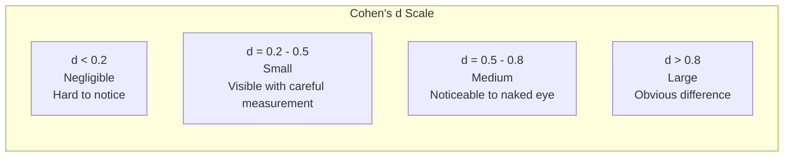
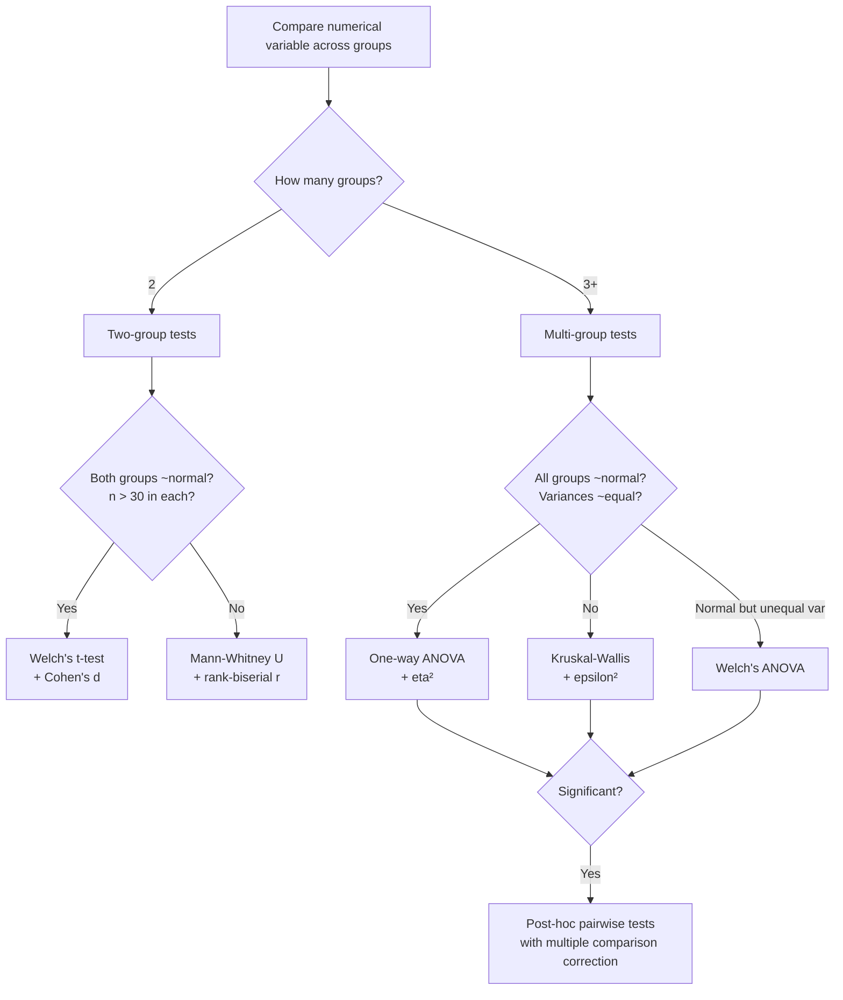

# Bivariate Analysis: Categorical vs Numerical

The question "does this numerical variable differ across categories?" is one of the most common in data analysis. Does salary differ by department? Does conversion rate differ by device type? Does treatment A produce different outcomes than treatment B?

This page covers the complete toolkit: visualization, parametric and nonparametric tests, effect size measures, and the critical issue of multiple comparisons.

## The Dataset

We will generate a realistic HR dataset where salary, performance, and tenure genuinely differ across departments and roles.

```python
import numpy as np
import pandas as pd
import matplotlib.pyplot as plt
import seaborn as sns
from scipy import stats
from itertools import combinations

np.random.seed(42)

departments = {
    "Engineering": {"salary_mean": 120000, "salary_std": 25000, "n": 400, "perf_mean": 72},
    "Sales": {"salary_mean": 85000, "salary_std": 30000, "n": 350, "perf_mean": 68},
    "Marketing": {"salary_mean": 90000, "salary_std": 20000, "n": 200, "perf_mean": 70},
    "HR": {"salary_mean": 75000, "salary_std": 15000, "n": 150, "perf_mean": 74},
    "Finance": {"salary_mean": 105000, "salary_std": 22000, "n": 180, "perf_mean": 71},
    "Support": {"salary_mean": 55000, "salary_std": 12000, "n": 220, "perf_mean": 65},
}

records = []
for dept, params in departments.items():
    n = params["n"]
    salary = np.random.normal(params["salary_mean"], params["salary_std"], n)
    salary = np.clip(salary, 30000, 300000).astype(int)
    performance = np.random.normal(params["perf_mean"], 12, n)
    performance = np.clip(performance, 0, 100)
    tenure = np.random.exponential(36, n).astype(int)
    tenure = np.clip(tenure, 1, 240)

    for i in range(n):
        records.append({
            "department": dept,
            "salary": salary[i],
            "performance": performance[i],
            "tenure_months": tenure[i],
        })

df = pd.DataFrame(records)

# Add a binary variable for two-group tests
df["is_engineering"] = (df["department"] == "Engineering").astype(int)

# Add experience level (ordinal with 3 groups)
df["level"] = pd.cut(df["tenure_months"], bins=[0, 24, 72, 240],
                      labels=["Junior", "Mid", "Senior"])

print(df.shape)
print(df.groupby("department")["salary"].describe().round(0))
```

## Visualization: Box Plots by Category

```python
fig, axes = plt.subplots(2, 2, figsize=(16, 12))

# Box plot — salary by department (ordered by median)
order = df.groupby("department")["salary"].median().sort_values(ascending=False).index
sns.boxplot(data=df, x="department", y="salary", order=order, ax=axes[0, 0],
            palette="Set2", flierprops=dict(marker="o", markersize=3, alpha=0.5))
axes[0, 0].set_title("Salary by Department (Box Plot)", fontsize=12)
axes[0, 0].tick_params(axis="x", rotation=30)

# Violin plot — shows distribution shape
sns.violinplot(data=df, x="department", y="salary", order=order, ax=axes[0, 1],
               palette="Set2", inner="quartile")
axes[0, 1].set_title("Salary by Department (Violin Plot)", fontsize=12)
axes[0, 1].tick_params(axis="x", rotation=30)

# Strip plot — shows every point
sns.stripplot(data=df, x="department", y="salary", order=order, ax=axes[1, 0],
              palette="Set2", size=2, alpha=0.4, jitter=0.3)
axes[1, 0].set_title("Salary by Department (Strip Plot)", fontsize=12)
axes[1, 0].tick_params(axis="x", rotation=30)

# Box + Strip overlay — best of both
sns.boxplot(data=df, x="department", y="salary", order=order, ax=axes[1, 1],
            palette="Set2", fliersize=0)
sns.stripplot(data=df, x="department", y="salary", order=order, ax=axes[1, 1],
              color="black", size=1.5, alpha=0.2, jitter=0.3)
axes[1, 1].set_title("Combined Box + Strip", fontsize=12)
axes[1, 1].tick_params(axis="x", rotation=30)

plt.suptitle("Comparing Salary Across Departments", fontsize=16, fontweight="bold")
plt.tight_layout()
plt.savefig("catnum_visualization.png", dpi=150, bbox_inches="tight")
plt.show()
```

## Two-Group Tests: t-test and Alternatives

When comparing exactly two groups, the independent samples t-test is the classic choice — but only if assumptions hold.

```python
def two_group_comparison(df, group_col, value_col, group_a, group_b):
    """Complete two-group comparison with multiple tests and effect sizes."""
    a = df[df[group_col] == group_a][value_col].dropna()
    b = df[df[group_col] == group_b][value_col].dropna()

    print(f"\n{'='*65}")
    print(f"  {group_a} vs {group_b}: {value_col}")
    print(f"{'='*65}")
    print(f"  {group_a}: n={len(a)}, mean={a.mean():.1f}, std={a.std():.1f}, median={a.median():.1f}")
    print(f"  {group_b}: n={len(b)}, mean={b.mean():.1f}, std={b.std():.1f}, median={b.median():.1f}")

    # Check assumptions
    # 1. Normality
    _, p_norm_a = stats.shapiro(a[:5000])
    _, p_norm_b = stats.shapiro(b[:5000])
    normal_a = p_norm_a > 0.05
    normal_b = p_norm_b > 0.05

    # 2. Equal variances (Levene's test)
    _, p_levene = stats.levene(a, b)
    equal_var = p_levene > 0.05

    print(f"\n  Assumptions:")
    print(f"    Normality ({group_a}): p={p_norm_a:.4f} ({'OK' if normal_a else 'VIOLATED'})")
    print(f"    Normality ({group_b}): p={p_norm_b:.4f} ({'OK' if normal_b else 'VIOLATED'})")
    print(f"    Equal variance:       p={p_levene:.4f} ({'OK' if equal_var else 'VIOLATED'})")

    # Tests
    print(f"\n  Statistical Tests:")

    # Independent t-test (equal variance)
    t_stat, p_equal = stats.ttest_ind(a, b, equal_var=True)
    print(f"    Student's t-test:     t={t_stat:.3f}, p={p_equal:.2e}")

    # Welch's t-test (unequal variance — generally preferred)
    t_welch, p_welch = stats.ttest_ind(a, b, equal_var=False)
    print(f"    Welch's t-test:       t={t_welch:.3f}, p={p_welch:.2e}")

    # Mann-Whitney U (nonparametric)
    u_stat, p_mann = stats.mannwhitneyu(a, b, alternative="two-sided")
    print(f"    Mann-Whitney U:       U={u_stat:.0f}, p={p_mann:.2e}")

    # Effect sizes
    print(f"\n  Effect Sizes:")

    # Cohen's d
    pooled_std = np.sqrt(((len(a) - 1) * a.std()**2 + (len(b) - 1) * b.std()**2) /
                          (len(a) + len(b) - 2))
    cohens_d = (a.mean() - b.mean()) / pooled_std
    print(f"    Cohen's d:            {cohens_d:+.3f}", end="")
    if abs(cohens_d) < 0.2:
        print(" (negligible)")
    elif abs(cohens_d) < 0.5:
        print(" (small)")
    elif abs(cohens_d) < 0.8:
        print(" (medium)")
    else:
        print(" (large)")

    # Common Language Effect Size (probability of superiority)
    cles = stats.norm.cdf(cohens_d / np.sqrt(2))
    print(f"    CLES (prob superior): {cles:.3f}")

    # Rank-biserial correlation
    n_a, n_b = len(a), len(b)
    r_rb = 1 - (2 * u_stat) / (n_a * n_b)
    print(f"    Rank-biserial r:      {r_rb:+.3f}")

    return {
        "welch_p": p_welch, "mann_p": p_mann, "cohens_d": cohens_d,
        "cles": cles, "equal_var": equal_var,
    }

# Compare Engineering vs Support (large difference)
two_group_comparison(df, "department", "salary", "Engineering", "Support")

# Compare Engineering vs Finance (smaller difference)
two_group_comparison(df, "department", "salary", "Engineering", "Finance")
```

### Effect Size Interpretation



::: warning Use Welch's t-test as your default
Student's t-test assumes equal variances. Welch's t-test does not, and performs nearly as well as Student's when variances are equal. There is virtually no cost to using Welch's by default.
:::

## Multi-Group Tests: ANOVA and Kruskal-Wallis

When comparing three or more groups, never run pairwise t-tests without correction. Use ANOVA or Kruskal-Wallis as an omnibus test first.

```python
def multi_group_comparison(df, group_col, value_col):
    """Complete multi-group comparison."""
    groups = df[group_col].unique()
    group_data = [df[df[group_col] == g][value_col].dropna().values for g in groups]

    print(f"\n{'='*65}")
    print(f"  Multi-Group Comparison: {value_col} by {group_col}")
    print(f"  Groups: {len(groups)} — {', '.join(str(g) for g in groups)}")
    print(f"{'='*65}")

    # Group summaries
    summary = df.groupby(group_col)[value_col].agg(["count", "mean", "std", "median"])
    print(f"\n{summary.round(1).to_string()}")

    # Assumption checks
    # Normality per group
    print(f"\n  Normality (Shapiro-Wilk):")
    all_normal = True
    for g, data in zip(groups, group_data):
        _, p = stats.shapiro(data[:5000])
        normal = p > 0.05
        all_normal = all_normal and normal
        print(f"    {g}: p={p:.4f} ({'OK' if normal else 'VIOLATED'})")

    # Homogeneity of variance (Levene)
    lev_stat, lev_p = stats.levene(*group_data)
    equal_var = lev_p > 0.05
    print(f"\n  Levene's test: F={lev_stat:.3f}, p={lev_p:.4f} ({'Equal' if equal_var else 'Unequal'} variances)")

    # One-way ANOVA
    f_stat, anova_p = stats.f_oneway(*group_data)
    print(f"\n  One-way ANOVA:   F={f_stat:.3f}, p={anova_p:.2e}")

    # Welch's ANOVA (does not assume equal variances)
    from scipy.stats import alexandergovern
    result = alexandergovern(*group_data)
    print(f"  Welch's ANOVA:   stat={result.statistic:.3f}, p={result.pvalue:.2e}")

    # Kruskal-Wallis (nonparametric)
    h_stat, kw_p = stats.kruskal(*group_data)
    print(f"  Kruskal-Wallis:  H={h_stat:.3f}, p={kw_p:.2e}")

    # Effect sizes
    # Eta-squared (ANOVA)
    grand_mean = df[value_col].mean()
    ss_between = sum(len(d) * (d.mean() - grand_mean)**2 for d in group_data)
    ss_total = sum((df[value_col] - grand_mean)**2)
    eta_sq = ss_between / ss_total

    # Omega-squared (less biased)
    k = len(groups)
    n_total = len(df)
    ms_within = (ss_total - ss_between) / (n_total - k)
    omega_sq = (ss_between - (k - 1) * ms_within) / (ss_total + ms_within)

    print(f"\n  Effect Sizes:")
    print(f"    Eta²:    {eta_sq:.4f}", end="")
    if eta_sq < 0.01:
        print(" (negligible)")
    elif eta_sq < 0.06:
        print(" (small)")
    elif eta_sq < 0.14:
        print(" (medium)")
    else:
        print(" (large)")
    print(f"    Omega²:  {omega_sq:.4f} (bias-corrected)")
    print(f"    Epsilon² (Kruskal): {(h_stat - k + 1) / (n_total - k):.4f}")

    return {
        "anova_p": anova_p, "kw_p": kw_p,
        "eta_squared": eta_sq, "omega_squared": omega_sq,
    }

result = multi_group_comparison(df, "department", "salary")
```

### Decision Tree: Which Test to Use



## Multiple Comparisons: The Hidden Trap

With 6 departments, there are 15 pairwise comparisons. If each test uses alpha=0.05, the probability of at least one false positive is 1 - (1-0.05)^15 = 54%. You must correct for this.

```python
from scipy.stats import ttest_ind
from statsmodels.stats.multitest import multipletests

def pairwise_comparisons(df, group_col, value_col, alpha=0.05):
    """Run all pairwise comparisons with multiple correction methods."""
    groups = sorted(df[group_col].unique())
    pairs = list(combinations(groups, 2))

    print(f"\n{'='*65}")
    print(f"  Pairwise Comparisons: {value_col} by {group_col}")
    print(f"  {len(pairs)} pairs, {len(groups)} groups")
    print(f"{'='*65}")

    results = []
    for g1, g2 in pairs:
        a = df[df[group_col] == g1][value_col].dropna()
        b = df[df[group_col] == g2][value_col].dropna()
        t_stat, p_val = ttest_ind(a, b, equal_var=False)
        pooled_std = np.sqrt(((len(a)-1)*a.std()**2 + (len(b)-1)*b.std()**2) / (len(a)+len(b)-2))
        d = (a.mean() - b.mean()) / pooled_std
        results.append({
            "group_a": g1, "group_b": g2,
            "diff_means": a.mean() - b.mean(),
            "cohens_d": d, "t_stat": t_stat, "p_raw": p_val,
        })

    result_df = pd.DataFrame(results)
    p_raw = result_df["p_raw"].values

    # Multiple correction methods
    corrections = {
        "Bonferroni": multipletests(p_raw, alpha=alpha, method="bonferroni"),
        "Holm": multipletests(p_raw, alpha=alpha, method="holm"),
        "Benjamini-Hochberg (FDR)": multipletests(p_raw, alpha=alpha, method="fdr_bh"),
    }

    for name, (reject, p_adj, _, _) in corrections.items():
        result_df[f"p_{name}"] = p_adj
        result_df[f"sig_{name}"] = reject

    # Display
    display_cols = ["group_a", "group_b", "diff_means", "cohens_d", "p_raw"]
    for name in corrections:
        display_cols.append(f"p_{name}")
        display_cols.append(f"sig_{name}")

    print(result_df[["group_a", "group_b", "diff_means", "cohens_d", "p_raw",
                       "p_Bonferroni", "sig_Bonferroni",
                       "p_Benjamini-Hochberg (FDR)", "sig_Benjamini-Hochberg (FDR)"]].round(4).to_string())

    # Summary
    print(f"\n  Summary (alpha={alpha}):")
    print(f"    Raw significant:         {(p_raw < alpha).sum()} / {len(pairs)}")
    for name, (reject, _, _, _) in corrections.items():
        print(f"    {name:30s} {reject.sum()} / {len(pairs)}")

    return result_df

pw_results = pairwise_comparisons(df, "department", "salary")
```

### Correction Methods Compared

| Method | Controls | When to Use | Trade-off |
|--------|----------|-------------|-----------|
| **Bonferroni** | FWER (family-wise error rate) | Few comparisons, want no false positives | Very conservative — misses real effects |
| **Holm** | FWER (step-down) | Same goals as Bonferroni but more powerful | Slightly more complex but strictly better |
| **Benjamini-Hochberg** | FDR (false discovery rate) | Many comparisons, can tolerate some false positives | More powerful but allows ~5% false positives among discoveries |
| **Tukey HSD** | FWER (pairwise ANOVA) | All pairwise comparisons after ANOVA | Specifically designed for balanced ANOVA |

::: tip Use Holm over Bonferroni, always
Holm's step-down procedure is strictly more powerful than Bonferroni while controlling the same error rate. There is no reason to use Bonferroni.
:::

## Visualization: Effect Sizes Heatmap

```python
# Build pairwise effect size matrix
groups = sorted(df["department"].unique())
n_groups = len(groups)
effect_matrix = pd.DataFrame(np.zeros((n_groups, n_groups)),
                              index=groups, columns=groups)

for _, row in pw_results.iterrows():
    effect_matrix.loc[row["group_a"], row["group_b"]] = row["cohens_d"]
    effect_matrix.loc[row["group_b"], row["group_a"]] = -row["cohens_d"]

fig, ax = plt.subplots(figsize=(10, 8))
mask = np.triu(np.ones_like(effect_matrix, dtype=bool), k=0)
sns.heatmap(effect_matrix, mask=mask, annot=True, fmt=".2f", cmap="RdBu_r",
            center=0, vmin=-2, vmax=2, square=True, ax=ax,
            linewidths=0.5, cbar_kws={"label": "Cohen's d"})
ax.set_title("Pairwise Effect Sizes (Cohen's d)\nSalary by Department", fontsize=14)
plt.tight_layout()
plt.savefig("effect_size_heatmap.png", dpi=150, bbox_inches="tight")
plt.show()
```

## Interaction with a Second Categorical Variable

```python
# Does the salary-department relationship depend on level?
fig, axes = plt.subplots(1, 2, figsize=(16, 6))

# Grouped box plot
order = df.groupby("department")["salary"].median().sort_values(ascending=False).index
sns.boxplot(data=df, x="department", y="salary", hue="level",
            order=order, ax=axes[0], palette="Set2", fliersize=2)
axes[0].set_title("Salary by Department and Level", fontsize=12)
axes[0].tick_params(axis="x", rotation=30)
axes[0].legend(title="Level")

# Mean plot with error bars
grouped = df.groupby(["department", "level"])["salary"].agg(["mean", "std", "count"]).reset_index()
grouped["se"] = grouped["std"] / np.sqrt(grouped["count"])

for level in ["Junior", "Mid", "Senior"]:
    subset = grouped[grouped["level"] == level]
    axes[1].errorbar(subset["department"], subset["mean"], yerr=1.96 * subset["se"],
                     marker="o", capsize=4, label=level, linewidth=2)
axes[1].set_title("Mean Salary ± 95% CI", fontsize=12)
axes[1].tick_params(axis="x", rotation=30)
axes[1].legend(title="Level")

plt.suptitle("Interaction: Department x Level", fontsize=16, fontweight="bold")
plt.tight_layout()
plt.savefig("interaction_plot.png", dpi=150, bbox_inches="tight")
plt.show()

# Two-way ANOVA (testing interaction)
from statsmodels.formula.api import ols
from statsmodels.stats.anova import anova_lm

model = ols("salary ~ C(department) * C(level)", data=df).fit()
anova_table = anova_lm(model, typ=2)
print("\nTwo-way ANOVA (Type II):")
print(anova_table.round(4))
```

## Practical Checklist

Before concluding categorical vs numerical analysis:

1. **Visualize first**: Box, violin, or strip plots before any test.
2. **Check assumptions**: Normality within groups and homogeneity of variance.
3. **Choose the right test**: Two groups use Welch's t-test; three or more use ANOVA or Kruskal-Wallis.
4. **Always report effect sizes**: Cohen's d for two groups, eta-squared for multiple groups. P-values alone are not enough.
5. **Correct for multiple comparisons**: Use Holm or Benjamini-Hochberg when running pairwise tests.
6. **Check interactions**: The relationship may depend on a third variable.

## Key Takeaways

- Welch's t-test should be your default for two-group comparisons. It handles unequal variances gracefully.
- Use Kruskal-Wallis when normality is violated or sample sizes are very unequal.
- Effect sizes (Cohen's d, eta-squared) are more informative than p-values. A significant p-value with d = 0.1 is not a meaningful difference.
- With k groups, there are k(k-1)/2 pairwise comparisons. Without correction, over half may be false positives.
- Holm's method is strictly superior to Bonferroni. Benjamini-Hochberg is the best choice when you can tolerate some false positives.
- Interaction effects are common. Always check whether the group difference depends on another variable.
