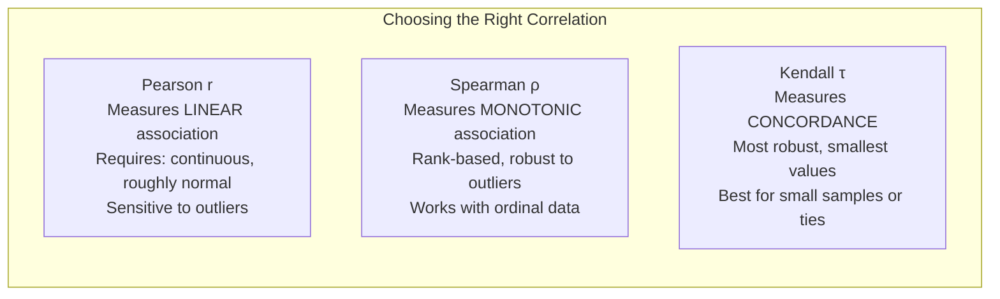
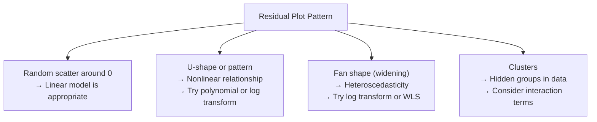
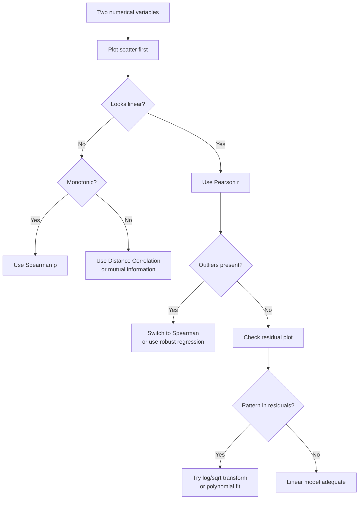

# Bivariate Analysis: Numerical vs Numerical

Understanding the relationship between two numerical variables is the core of bivariate EDA. But "relationship" is a loaded word. Is it linear or curved? Strong or weak? Does it hold across all subgroups? Are there outliers distorting the picture?

This page covers scatter plots, three types of correlation, when each is appropriate, residual analysis, and visualization techniques that scale to large datasets.

## The Dataset

We will generate a realistic dataset with known relationships of varying types.

```python
import numpy as np
import pandas as pd
import matplotlib.pyplot as plt
import seaborn as sns
from scipy import stats

np.random.seed(42)
n = 1500

# Variables with different relationship types
age = np.random.uniform(22, 65, n)
experience = age - 22 + np.random.normal(0, 3, n)  # strong linear
experience = np.clip(experience, 0, 45)

salary = 30000 + 1500 * experience + 200 * experience**1.3 + np.random.normal(0, 15000, n)
salary = np.clip(salary, 25000, 350000)

# Nonlinear: performance peaks at mid-career
performance = 60 + 15 * np.sin(experience / 45 * np.pi) + np.random.normal(0, 10, n)
performance = np.clip(performance, 0, 100)

# Weak relationship with noise
satisfaction = 50 + 0.15 * salary / 1000 + np.random.normal(0, 20, n)
satisfaction = np.clip(satisfaction, 0, 100)

# Independent variables (no relationship)
shoe_size = np.random.normal(10, 1.5, n)

# Outlier-contaminated relationship
hours_worked = 40 + 0.3 * experience + np.random.normal(0, 5, n)
# Add outliers
outlier_idx = np.random.choice(n, 30, replace=False)
hours_worked[outlier_idx] = np.random.uniform(60, 80, 30)

df = pd.DataFrame({
    "age": age,
    "experience": experience,
    "salary": salary,
    "performance": performance,
    "satisfaction": satisfaction,
    "shoe_size": shoe_size,
    "hours_worked": hours_worked,
})

print(df.describe().round(2))
```

## Scatter Plots: The Essential Starting Point

Before computing any statistic, plot the data. Correlation coefficients can be identical for wildly different relationships (Anscombe's quartet).

```python
fig, axes = plt.subplots(2, 3, figsize=(18, 11))

# Strong linear
axes[0, 0].scatter(df["experience"], df["salary"], alpha=0.3, s=10, color="steelblue")
axes[0, 0].set_xlabel("Experience (years)")
axes[0, 0].set_ylabel("Salary ($)")
axes[0, 0].set_title("Strong Linear: Experience vs Salary", fontsize=11)

# Nonlinear (quadratic-like)
axes[0, 1].scatter(df["experience"], df["performance"], alpha=0.3, s=10, color="steelblue")
axes[0, 1].set_xlabel("Experience (years)")
axes[0, 1].set_ylabel("Performance Score")
axes[0, 1].set_title("Nonlinear: Experience vs Performance", fontsize=11)

# Weak linear
axes[0, 2].scatter(df["salary"], df["satisfaction"], alpha=0.3, s=10, color="steelblue")
axes[0, 2].set_xlabel("Salary ($)")
axes[0, 2].set_ylabel("Satisfaction")
axes[0, 2].set_title("Weak: Salary vs Satisfaction", fontsize=11)

# No relationship
axes[1, 0].scatter(df["shoe_size"], df["salary"], alpha=0.3, s=10, color="steelblue")
axes[1, 0].set_xlabel("Shoe Size")
axes[1, 0].set_ylabel("Salary ($)")
axes[1, 0].set_title("None: Shoe Size vs Salary", fontsize=11)

# With outliers
axes[1, 1].scatter(df["experience"], df["hours_worked"], alpha=0.3, s=10, color="steelblue")
axes[1, 1].scatter(df["experience"].iloc[outlier_idx], df["hours_worked"].iloc[outlier_idx],
                    color="red", s=30, alpha=0.7, label="Outliers")
axes[1, 1].set_xlabel("Experience (years)")
axes[1, 1].set_ylabel("Hours Worked")
axes[1, 1].set_title("Outlier-Contaminated", fontsize=11)
axes[1, 1].legend()

# Anscombe's reminder — same correlation, different relationships
x_anscombe = np.linspace(0, 10, 100)
for i, (label, y_func) in enumerate([
    ("Linear", lambda x: 2 * x + np.random.normal(0, 2, len(x))),
    ("Quadratic", lambda x: 10 - (x - 5)**2 / 3 + np.random.normal(0, 1.5, len(x))),
    ("Outlier-driven", lambda x: np.where(x < 9, 5 + np.random.normal(0, 0.5, len(x)), 20)),
]):
    np.random.seed(42 + i)
    y = y_func(x_anscombe)
    r = np.corrcoef(x_anscombe, y)[0, 1]
    axes[1, 2].scatter(x_anscombe + i * 12, y, alpha=0.5, s=10, label=f"{label} (r={r:.2f})")
axes[1, 2].set_title("Same r, Different Stories", fontsize=11)
axes[1, 2].legend(fontsize=8)

plt.suptitle("Scatter Plot Gallery", fontsize=16, fontweight="bold")
plt.tight_layout()
plt.savefig("scatter_gallery.png", dpi=150, bbox_inches="tight")
plt.show()
```

## The Three Correlations



```python
def correlation_analysis(x, y, x_name, y_name):
    """Compute all three correlations with confidence intervals."""
    # Pearson
    r_pearson, p_pearson = stats.pearsonr(x, y)

    # Spearman
    r_spearman, p_spearman = stats.spearmanr(x, y)

    # Kendall
    r_kendall, p_kendall = stats.kendalltau(x, y)

    # Pearson CI via Fisher z-transform
    n = len(x)
    z = np.arctanh(r_pearson)
    se = 1 / np.sqrt(n - 3)
    ci_low = np.tanh(z - 1.96 * se)
    ci_high = np.tanh(z + 1.96 * se)

    print(f"\n--- {x_name} vs {y_name} (n={n}) ---")
    print(f"  Pearson  r = {r_pearson:+.4f}  (p={p_pearson:.2e})  95% CI: [{ci_low:.4f}, {ci_high:.4f}]")
    print(f"  Spearman ρ = {r_spearman:+.4f}  (p={p_spearman:.2e})")
    print(f"  Kendall  τ = {r_kendall:+.4f}  (p={p_kendall:.2e})")

    # Interpretation
    if abs(r_spearman) > abs(r_pearson) + 0.05:
        print(f"  ⚠ Spearman >> Pearson suggests nonlinear but monotonic relationship")
    if abs(r_pearson) > abs(r_spearman) + 0.1:
        print(f"  ⚠ Pearson >> Spearman is unusual — check for outlier influence")

    return {
        "pearson": r_pearson, "spearman": r_spearman, "kendall": r_kendall,
        "pearson_p": p_pearson, "spearman_p": p_spearman, "kendall_p": p_kendall,
    }

pairs = [
    ("experience", "salary"),
    ("experience", "performance"),
    ("salary", "satisfaction"),
    ("shoe_size", "salary"),
    ("experience", "hours_worked"),
]

results = {}
for x_col, y_col in pairs:
    results[(x_col, y_col)] = correlation_analysis(
        df[x_col], df[y_col], x_col, y_col
    )
```

### When to Use Which Correlation

| Scenario | Use | Reason |
|----------|-----|--------|
| Both variables roughly normal, linear relationship | **Pearson** | Most powerful for detecting linear relationships |
| Ordinal data (e.g., ratings) | **Spearman** | Rank-based, appropriate for ordinal scales |
| Skewed data, outliers present | **Spearman** | Robust to outliers and non-normality |
| Monotonic but nonlinear | **Spearman** | Captures monotonic relationships Pearson misses |
| Small sample (n < 30) with ties | **Kendall** | Better asymptotic properties for small samples |
| Not sure | **Report all three** | Differences between them are informative |

::: warning Correlation does not equal importance
A Pearson r of 0.3 explains only 9% of variance (r²). In large datasets, even r = 0.05 can be statistically significant while being practically meaningless. Always consider effect size alongside p-values.
:::

## Residual Plots: Detecting What Correlation Misses

A residual plot after fitting a linear model reveals patterns that correlation coefficients hide.

```python
from numpy.polynomial import polynomial as P

fig, axes = plt.subplots(2, 3, figsize=(18, 10))

for i, (x_col, y_col) in enumerate(pairs[:3]):
    row, col_idx = divmod(i, 3)
    ax_scatter = axes[0, col_idx]
    ax_resid = axes[1, col_idx]

    x, y = df[x_col].values, df[y_col].values

    # Fit linear model
    slope, intercept = np.polyfit(x, y, 1)
    y_pred = slope * x + intercept
    residuals = y - y_pred

    # Scatter with fit line
    ax_scatter.scatter(x, y, alpha=0.2, s=8, color="steelblue")
    x_sorted = np.sort(x)
    ax_scatter.plot(x_sorted, slope * x_sorted + intercept, color="crimson", linewidth=2)
    ax_scatter.set_xlabel(x_col)
    ax_scatter.set_ylabel(y_col)
    ax_scatter.set_title(f"{x_col} vs {y_col}", fontsize=11)

    # Residual plot
    ax_resid.scatter(y_pred, residuals, alpha=0.2, s=8, color="steelblue")
    ax_resid.axhline(0, color="crimson", linewidth=1)
    # Add LOWESS smoother to reveal patterns
    from statsmodels.nonparametric.smoothers_lowess import lowess
    smooth = lowess(residuals, y_pred, frac=0.3)
    ax_resid.plot(smooth[:, 0], smooth[:, 1], color="orange", linewidth=2, label="LOWESS")
    ax_resid.set_xlabel(f"Predicted {y_col}")
    ax_resid.set_ylabel("Residual")
    ax_resid.set_title(f"Residuals: {x_col} → {y_col}", fontsize=11)
    ax_resid.legend()

plt.suptitle("Scatter Plots (top) and Residual Plots (bottom)", fontsize=16, fontweight="bold")
plt.tight_layout()
plt.savefig("residual_plots.png", dpi=150, bbox_inches="tight")
plt.show()
```

### What Residual Patterns Tell You



## Hexbin Plots for Large Datasets

When n > 10,000, scatter plots become unreadable blobs. Hexbin plots solve this by binning points into hexagonal cells and color-coding by density.

```python
# Generate large dataset
np.random.seed(42)
n_large = 100_000
x_large = np.random.normal(50, 15, n_large)
y_large = 0.8 * x_large + np.random.normal(0, 10, n_large)

fig, axes = plt.subplots(1, 3, figsize=(18, 5))

# Regular scatter — useless at this scale
axes[0].scatter(x_large, y_large, alpha=0.01, s=1, color="steelblue")
axes[0].set_title(f"Scatter (n={n_large:,}) — Overplotting", fontsize=12)

# Hexbin
hb = axes[1].hexbin(x_large, y_large, gridsize=40, cmap="YlOrRd", mincnt=1)
plt.colorbar(hb, ax=axes[1], label="Count")
axes[1].set_title(f"Hexbin — Shows Density", fontsize=12)

# 2D KDE
sns.kdeplot(x=x_large, y=y_large, levels=10, ax=axes[2],
            cmap="YlOrRd", fill=True, alpha=0.7)
axes[2].set_title(f"2D KDE — Smooth Density", fontsize=12)

for ax in axes:
    ax.set_xlabel("X")
    ax.set_ylabel("Y")

plt.suptitle("Visualization at Scale", fontsize=16, fontweight="bold")
plt.tight_layout()
plt.savefig("hexbin.png", dpi=150, bbox_inches="tight")
plt.show()
```

## Detecting Nonlinear Relationships

Pearson correlation only captures linear relationships. A perfect U-shaped relationship gives r = 0.

```python
# Generate nonlinear examples
np.random.seed(42)
n_nl = 500
x_nl = np.random.uniform(-5, 5, n_nl)

nonlinear_examples = {
    "Quadratic (r≈0)": x_nl**2 + np.random.normal(0, 2, n_nl),
    "Exponential": np.exp(0.5 * x_nl) + np.random.normal(0, 2, n_nl),
    "Sinusoidal (r≈0)": 5 * np.sin(x_nl) + np.random.normal(0, 1, n_nl),
    "Logarithmic": 3 * np.log(np.abs(x_nl) + 1) * np.sign(x_nl) + np.random.normal(0, 1, n_nl),
}

fig, axes = plt.subplots(2, 2, figsize=(14, 10))

for ax, (name, y_nl) in zip(axes.flat, nonlinear_examples.items()):
    ax.scatter(x_nl, y_nl, alpha=0.4, s=15, color="steelblue")

    # Pearson vs Spearman
    r_p, _ = stats.pearsonr(x_nl, y_nl)
    r_s, _ = stats.spearmanr(x_nl, y_nl)

    # Distance correlation (measures general dependence)
    def distance_correlation(x, y):
        """Compute distance correlation (Szekely, 2007)."""
        n = len(x)
        a = np.abs(x[:, None] - x[None, :])
        b = np.abs(y[:, None] - y[None, :])
        A = a - a.mean(axis=0) - a.mean(axis=1)[:, None] + a.mean()
        B = b - b.mean(axis=0) - b.mean(axis=1)[:, None] + b.mean()
        dcov2 = (A * B).mean()
        dvar_x = (A * A).mean()
        dvar_y = (B * B).mean()
        if dvar_x * dvar_y == 0:
            return 0
        return np.sqrt(dcov2 / np.sqrt(dvar_x * dvar_y))

    # Use subset for speed
    subset = np.random.choice(n_nl, min(300, n_nl), replace=False)
    dc = distance_correlation(x_nl[subset], y_nl[subset])

    ax.set_title(f"{name}\nPearson={r_p:.3f}, Spearman={r_s:.3f}, DistCorr={dc:.3f}", fontsize=11)
    ax.set_xlabel("X")
    ax.set_ylabel("Y")

plt.suptitle("Nonlinear Relationships: Correlation Fails", fontsize=16, fontweight="bold")
plt.tight_layout()
plt.savefig("nonlinear.png", dpi=150, bbox_inches="tight")
plt.show()
```

::: tip Distance correlation catches what Pearson and Spearman miss
Distance correlation is zero if and only if the variables are independent. Unlike Pearson (linear only) or Spearman (monotonic only), it detects any kind of statistical dependence. The downside is O(n²) computation.
:::

## Outlier Influence on Correlation

A single outlier can create or destroy a correlation.

```python
np.random.seed(42)
n_out = 50

# No relationship + one outlier creates correlation
x_clean = np.random.normal(50, 10, n_out)
y_clean = np.random.normal(50, 10, n_out)

# Add one extreme outlier
x_with_outlier = np.append(x_clean, 120)
y_with_outlier = np.append(y_clean, 120)

fig, axes = plt.subplots(1, 3, figsize=(18, 5))

# Without outlier
r_no, _ = stats.pearsonr(x_clean, y_clean)
axes[0].scatter(x_clean, y_clean, color="steelblue")
axes[0].set_title(f"Without Outlier: r = {r_no:.3f}", fontsize=12)

# With outlier
r_with, _ = stats.pearsonr(x_with_outlier, y_with_outlier)
axes[1].scatter(x_with_outlier, y_with_outlier, color="steelblue")
axes[1].scatter([120], [120], color="red", s=100, zorder=5, label="Outlier")
axes[1].set_title(f"With Outlier: r = {r_with:.3f}", fontsize=12)
axes[1].legend()

# Robust alternative: Spearman
r_sp_no, _ = stats.spearmanr(x_clean, y_clean)
r_sp_with, _ = stats.spearmanr(x_with_outlier, y_with_outlier)
axes[2].bar(["Pearson\n(no outlier)", "Pearson\n(with outlier)",
             "Spearman\n(no outlier)", "Spearman\n(with outlier)"],
            [r_no, r_with, r_sp_no, r_sp_with],
            color=["steelblue", "coral", "steelblue", "coral"],
            edgecolor="black")
axes[2].set_ylabel("Correlation")
axes[2].set_title("Outlier Impact: Pearson vs Spearman", fontsize=12)

plt.suptitle("A Single Outlier Can Create a Spurious Correlation", fontsize=16, fontweight="bold")
plt.tight_layout()
plt.savefig("outlier_correlation.png", dpi=150, bbox_inches="tight")
plt.show()
```

## Complete Bivariate Numerical Profile

```python
def bivariate_num_profile(df, x_col, y_col, figsize=(18, 10)):
    """Complete bivariate profile for two numerical variables."""
    x, y = df[x_col].dropna(), df[y_col].dropna()
    common = df[[x_col, y_col]].dropna()
    x, y = common[x_col], common[y_col]

    fig = plt.figure(figsize=figsize)

    # Layout
    ax1 = fig.add_subplot(2, 3, 1)  # Scatter
    ax2 = fig.add_subplot(2, 3, 2)  # Hexbin
    ax3 = fig.add_subplot(2, 3, 3)  # Residuals
    ax4 = fig.add_subplot(2, 3, 4)  # Joint marginals
    ax5 = fig.add_subplot(2, 3, 5)  # QQ of residuals
    ax6 = fig.add_subplot(2, 3, 6)  # Stats

    # 1. Scatter with regression
    ax1.scatter(x, y, alpha=0.2, s=8, color="steelblue")
    slope, intercept = np.polyfit(x, y, 1)
    x_line = np.linspace(x.min(), x.max(), 100)
    ax1.plot(x_line, slope * x_line + intercept, color="crimson", linewidth=2)
    ax1.set_xlabel(x_col)
    ax1.set_ylabel(y_col)
    ax1.set_title("Scatter + Linear Fit")

    # 2. Hexbin
    hb = ax2.hexbin(x, y, gridsize=25, cmap="YlOrRd", mincnt=1)
    plt.colorbar(hb, ax=ax2)
    ax2.set_xlabel(x_col)
    ax2.set_ylabel(y_col)
    ax2.set_title("Hexbin Density")

    # 3. Residuals
    y_pred = slope * x + intercept
    residuals = y - y_pred
    ax3.scatter(y_pred, residuals, alpha=0.2, s=8, color="steelblue")
    ax3.axhline(0, color="crimson")
    ax3.set_xlabel(f"Predicted {y_col}")
    ax3.set_ylabel("Residual")
    ax3.set_title("Residual Plot")

    # 4. Binned means (shows functional relationship)
    common_copy = common.copy()
    common_copy["x_bin"] = pd.qcut(x, 20, duplicates="drop")
    binned = common_copy.groupby("x_bin")[y_col].agg(["mean", "std", "count"])
    bin_centers = [interval.mid for interval in binned.index]
    ax4.errorbar(bin_centers, binned["mean"], yerr=binned["std"] / np.sqrt(binned["count"]),
                 fmt="o-", color="crimson", capsize=3)
    ax4.set_xlabel(f"{x_col} (binned)")
    ax4.set_ylabel(f"Mean {y_col}")
    ax4.set_title("Binned Means ± SE")

    # 5. QQ of residuals
    stats.probplot(residuals, plot=ax5)
    ax5.set_title("QQ of Residuals")

    # 6. Statistics
    ax6.axis("off")
    r_p, p_p = stats.pearsonr(x, y)
    r_s, p_s = stats.spearmanr(x, y)
    r_k, p_k = stats.kendalltau(x, y)
    r2 = r_p ** 2

    stat_text = (
        f"n = {len(x):,}\n\n"
        f"Pearson  r  = {r_p:+.4f}  (p={p_p:.2e})\n"
        f"Spearman ρ  = {r_s:+.4f}  (p={p_s:.2e})\n"
        f"Kendall  τ  = {r_k:+.4f}  (p={p_k:.2e})\n\n"
        f"R²          = {r2:.4f}\n"
        f"Slope       = {slope:.4f}\n"
        f"Intercept   = {intercept:.2f}\n\n"
        f"Residual std = {residuals.std():.2f}\n"
        f"Residual skew = {residuals.skew():.3f}"
    )
    ax6.text(0.05, 0.5, stat_text, transform=ax6.transAxes, fontsize=11,
             fontfamily="monospace", verticalalignment="center",
             bbox=dict(boxstyle="round", facecolor="lightyellow", alpha=0.8))
    ax6.set_title("Correlation Statistics")

    fig.suptitle(f"Bivariate Profile: {x_col} vs {y_col}", fontsize=16, fontweight="bold")
    plt.tight_layout()
    plt.savefig(f"bivariate_{x_col}_{y_col}.png", dpi=150, bbox_inches="tight")
    plt.show()

# Run for key pairs
for x_col, y_col in [("experience", "salary"), ("experience", "performance")]:
    bivariate_num_profile(df, x_col, y_col)
```

## Decision Flow



## Key Takeaways

- Always scatter plot before computing correlation. The same r value can describe completely different relationships.
- Pearson measures linear association only. Use Spearman for monotonic relationships or when data has outliers.
- A single outlier can inflate Pearson r from 0 to 0.5 or higher. Spearman is far more robust.
- Residual plots reveal what correlation coefficients hide: nonlinearity, heteroscedasticity, and hidden groups.
- For large datasets (n > 10,000), use hexbin plots or 2D KDE instead of scatter plots.
- Distance correlation detects any dependence, not just linear or monotonic, but at O(n²) cost.
- Report confidence intervals alongside point estimates. A correlation of 0.3 with CI [0.05, 0.55] tells a different story than 0.3 with CI [0.25, 0.35].

## Try It Yourself

**Exercise 1:** You have a dataset with `study_hours` and `exam_score` for 200 students. Compute Pearson, Spearman, and Kendall correlations, create a scatter plot with regression line, and produce a residual plot. Interpret whether the relationship is linear based on the residual pattern.

::: details Solution
```python
import numpy as np
import pandas as pd
import matplotlib.pyplot as plt
from scipy import stats

x = df['study_hours'].values
y = df['exam_score'].values

# Three correlations
r_p, p_p = stats.pearsonr(x, y)
r_s, p_s = stats.spearmanr(x, y)
r_k, p_k = stats.kendalltau(x, y)

print(f"Pearson  r = {r_p:.4f} (p={p_p:.2e})")
print(f"Spearman p = {r_s:.4f} (p={p_s:.2e})")
print(f"Kendall  t = {r_k:.4f} (p={p_k:.2e})")

# Fit linear model
slope, intercept = np.polyfit(x, y, 1)
y_pred = slope * x + intercept
residuals = y - y_pred

fig, axes = plt.subplots(1, 2, figsize=(14, 5))

# Scatter + regression line
axes[0].scatter(x, y, alpha=0.5, s=20, color='steelblue')
x_sorted = np.sort(x)
axes[0].plot(x_sorted, slope * x_sorted + intercept, color='crimson', linewidth=2)
axes[0].set_xlabel('Study Hours')
axes[0].set_ylabel('Exam Score')
axes[0].set_title(f'Scatter (r={r_p:.3f})')

# Residual plot
axes[1].scatter(y_pred, residuals, alpha=0.5, s=20, color='steelblue')
axes[1].axhline(0, color='crimson', linewidth=1)
axes[1].set_xlabel('Predicted Exam Score')
axes[1].set_ylabel('Residual')
axes[1].set_title('Residual Plot')

plt.tight_layout()
plt.show()

# Interpretation
print(f"\nIf residuals show random scatter -> linear model is adequate")
print(f"If residuals show a U-shape -> relationship is nonlinear, try polynomial")
print(f"If residuals show a fan shape -> heteroscedasticity, try log transform")
```
:::

**Exercise 2:** Two variables have Pearson r = 0.05 (not significant, p=0.42) with n=500. But you suspect a nonlinear relationship. Write code to compute distance correlation and test whether the variables are truly independent. Visualize the relationship with a scatter plot and binned means.

::: details Solution
```python
import numpy as np
import pandas as pd
import matplotlib.pyplot as plt
from scipy import stats

x = df['feature_a'].values
y = df['feature_b'].values

# Pearson (near zero)
r_p, p_p = stats.pearsonr(x, y)
print(f"Pearson r = {r_p:.4f} (p={p_p:.3f}) -- no linear relationship")

# Distance correlation
def distance_correlation(x, y):
    n = len(x)
    a = np.abs(x[:, None] - x[None, :])
    b = np.abs(y[:, None] - y[None, :])
    A = a - a.mean(axis=0) - a.mean(axis=1)[:, None] + a.mean()
    B = b - b.mean(axis=0) - b.mean(axis=1)[:, None] + b.mean()
    dcov2 = (A * B).mean()
    dvar_x = (A * A).mean()
    dvar_y = (B * B).mean()
    if dvar_x * dvar_y == 0:
        return 0
    return np.sqrt(dcov2 / np.sqrt(dvar_x * dvar_y))

dc = distance_correlation(x, y)
print(f"Distance correlation = {dc:.4f}")

if dc > 0.15:
    print("Nonlinear dependence detected despite Pearson ~ 0!")
else:
    print("Variables appear truly independent")

# Visualize: scatter + binned means
fig, axes = plt.subplots(1, 2, figsize=(14, 5))

axes[0].scatter(x, y, alpha=0.3, s=10, color='steelblue')
axes[0].set_title(f'Scatter (Pearson={r_p:.3f}, DistCorr={dc:.3f})')

# Binned means reveal the functional form
df_temp = pd.DataFrame({'x': x, 'y': y})
df_temp['x_bin'] = pd.qcut(x, 20, duplicates='drop')
binned = df_temp.groupby('x_bin')['y'].agg(['mean', 'std', 'count'])
bin_centers = [interval.mid for interval in binned.index]
axes[1].errorbar(bin_centers, binned['mean'],
                 yerr=binned['std'] / np.sqrt(binned['count']),
                 fmt='o-', color='crimson', capsize=3)
axes[1].set_title('Binned Means (reveals nonlinear pattern)')
axes[1].set_xlabel('Feature A (binned)')
axes[1].set_ylabel('Mean Feature B')

plt.tight_layout()
plt.show()
```
:::

**Exercise 3:** You compute a Pearson correlation of r=0.72 between advertising spend and revenue across 50 data points. But there are 3 outlier points with spend > $1M. Remove the outliers and recompute. Also compute Spearman correlation on both the full and cleaned data. Discuss which result you trust more.

::: details Solution
```python
import numpy as np
from scipy import stats

x = df['ad_spend'].values
y = df['revenue'].values

# Full data correlations
r_p_full, _ = stats.pearsonr(x, y)
r_s_full, _ = stats.spearmanr(x, y)
print(f"FULL DATA (n={len(x)}):")
print(f"  Pearson  r = {r_p_full:.4f}")
print(f"  Spearman r = {r_s_full:.4f}")

# Remove outliers (spend > 1M)
mask = x <= 1_000_000
x_clean = x[mask]
y_clean = y[mask]

r_p_clean, _ = stats.pearsonr(x_clean, y_clean)
r_s_clean, _ = stats.spearmanr(x_clean, y_clean)
print(f"\nCLEANED DATA (n={len(x_clean)}, removed {(~mask).sum()} outliers):")
print(f"  Pearson  r = {r_p_clean:.4f}")
print(f"  Spearman r = {r_s_clean:.4f}")

# Comparison
print(f"\n--- Analysis ---")
print(f"Pearson  change: {r_p_full:.3f} -> {r_p_clean:.3f} (delta={r_p_clean - r_p_full:+.3f})")
print(f"Spearman change: {r_s_full:.3f} -> {r_s_clean:.3f} (delta={r_s_clean - r_s_full:+.3f})")

if abs(r_p_full - r_p_clean) > 0.15:
    print("\nPearson is HIGHLY sensitive to these outliers -> do NOT trust r=0.72")
    print("Spearman is more stable -> trust Spearman for the true correlation strength")
else:
    print("\nBoth are stable -> the relationship is robust to outliers")

print("\nBest practice: Report both, note the outlier sensitivity,")
print("and use Spearman as the primary measure when outliers are present.")
```
:::

## Quick Quiz

**1. Pearson r = 0.85 between ice cream sales and drowning deaths. What is the most likely explanation?**
- a) Ice cream causes drowning
- b) Drowning causes people to buy ice cream
- c) A confounding variable (temperature/season) drives both

::: details Answer
**c) A confounding variable (temperature/season) drives both.** Hot weather increases both ice cream consumption and swimming activity (which increases drowning risk). This is a classic example of confounding. The correlation between ice cream and drowning is real but spurious -- the causal driver is temperature. Always ask: "What third variable could explain this association?"
:::

**2. When should you use Spearman correlation instead of Pearson?**
- a) Only when the data is perfectly normal
- b) When the relationship is monotonic but not necessarily linear, or when outliers are present
- c) Only when both variables are ordinal

::: details Answer
**b) When the relationship is monotonic but not necessarily linear, or when outliers are present.** Spearman correlation works on ranks rather than raw values, making it robust to outliers and appropriate for any monotonic relationship (including logarithmic, exponential, etc.). It also works for ordinal data, but that is not its only use case.
:::

**3. A scatter plot of 100,000 points looks like a solid blob. What visualization should you use instead?**
- a) A larger scatter plot with smaller dots
- b) A hexbin plot or 2D KDE to show density
- c) A bar chart of the two variables

::: details Answer
**b) A hexbin plot or 2D KDE to show density.** At n > 10,000, individual scatter points overlap so heavily that all structure is hidden (overplotting). Hexbin plots bin points into hexagonal cells and color by count, revealing density patterns. 2D KDE provides a smooth density estimate. Both techniques expose the relationship that raw scatter plots obscure.
:::

**4. What does an R-squared (r^2) of 0.09 mean in practical terms?**
- a) The model explains 9% of the variance in Y
- b) The correlation is 0.09
- c) 9% of the data points are outliers

::: details Answer
**a) The model explains 9% of the variance in Y.** R-squared is the square of the correlation coefficient. An r of 0.3 gives r^2 = 0.09, meaning the linear relationship with X accounts for only 9% of the variability in Y. The remaining 91% is explained by other factors or random variation. In large datasets, even r = 0.3 can be statistically significant while being practically weak.
:::

**5. A residual plot shows a clear U-shaped pattern. What does this mean and what should you do?**
- a) The data has outliers that need removal
- b) The linear model is missing a nonlinear relationship; try a polynomial or log transform
- c) The correlation is too weak to model

::: details Answer
**b) The linear model is missing a nonlinear relationship; try a polynomial or log transform.** A U-shaped residual pattern means the linear fit systematically underestimates at the extremes and overestimates in the middle, indicating the true relationship is curved. Solutions include: (1) adding a quadratic term (x^2), (2) log-transforming x or y, or (3) using a nonlinear model. The residual plot is more informative than the correlation coefficient for diagnosing this.
:::
