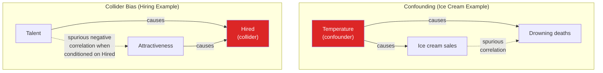
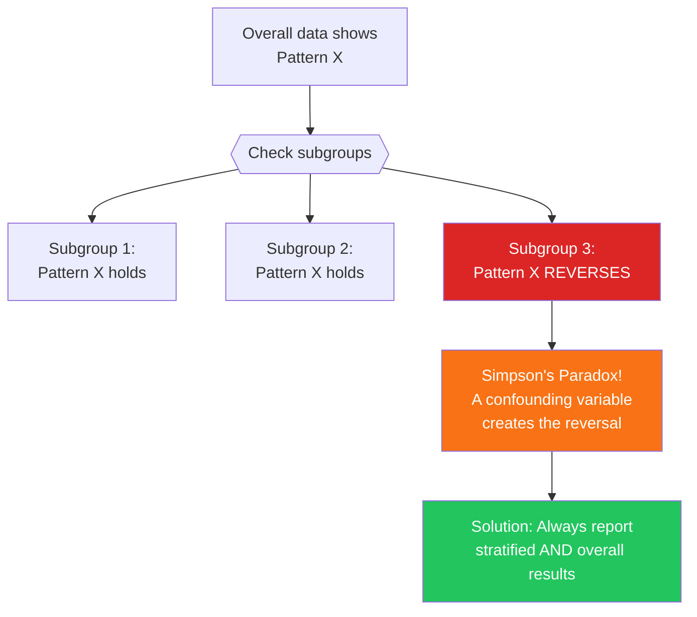
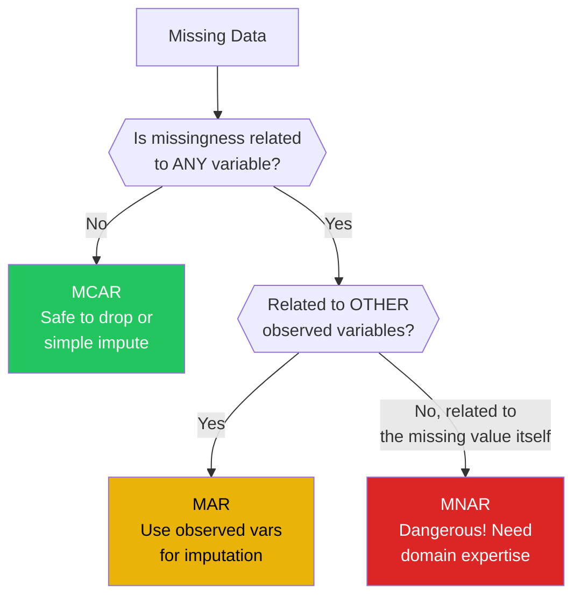
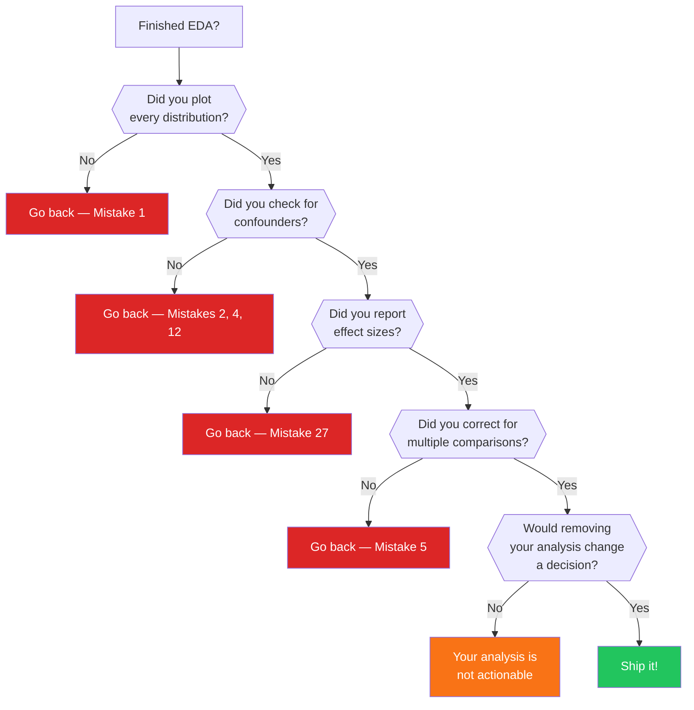

# Common EDA Mistakes

Every mistake on this page has killed a real project. Some led to wrong business decisions. Some caused models to fail in production. Some wasted months of analyst time. The goal is not to memorize a list — it is to develop the instinct to recognize when you are about to make one.

These are organized from the most common (and easiest to catch) to the most subtle (and hardest to detect).

---

## Category 1: Statistical Traps

### Mistake 1: Means Without Distributions

The single most common EDA mistake. The mean is only meaningful when the distribution is roughly symmetric and unimodal.

```python
# mistake1_means.py — When the mean lies
import numpy as np
import matplotlib.pyplot as plt

np.random.seed(42)

# Case 1: Bimodal distribution — mean describes NOBODY
junior_salaries = np.random.normal(55000, 8000, 200)
senior_salaries = np.random.normal(130000, 15000, 50)
all_salaries = np.concatenate([junior_salaries, senior_salaries])

print("=== Bimodal Salary Data ===")
print(f"Mean:   ${np.mean(all_salaries):>10,.0f}  <- Nobody earns this")
print(f"Median: ${np.median(all_salaries):>10,.0f}")
print(f"Mode:   ~$55,000 and ~$130,000  <- Two peaks!")

# Case 2: Heavy-tailed distribution — mean is unstable
response_times = np.random.exponential(200, 10000)  # milliseconds
print(f"\n=== Response Time Data ===")
print(f"Mean:   {np.mean(response_times):>8.0f} ms")
print(f"Median: {np.median(response_times):>8.0f} ms")
print(f"P95:    {np.percentile(response_times, 95):>8.0f} ms")
print(f"P99:    {np.percentile(response_times, 99):>8.0f} ms")
print("The mean is 44% higher than the median due to tail!")

# Case 3: Skewed with outliers — mean gets pulled
incomes = np.random.lognormal(mean=10.5, sigma=0.8, size=1000)
incomes_with_billionaire = np.append(incomes, [50_000_000])
print(f"\n=== Income Data (n=1001) ===")
print(f"Mean without billionaire: ${np.mean(incomes):>12,.0f}")
print(f"Mean WITH billionaire:    ${np.mean(incomes_with_billionaire):>12,.0f}")
print(f"One outlier shifted the mean by ${np.mean(incomes_with_billionaire) - np.mean(incomes):>10,.0f}!")
print(f"Median barely changed:    ${np.median(incomes):>12,.0f} -> ${np.median(incomes_with_billionaire):>12,.0f}")

fig, axes = plt.subplots(1, 3, figsize=(15, 4))
axes[0].hist(all_salaries, bins=40, edgecolor='black')
axes[0].axvline(np.mean(all_salaries), color='red', linestyle='--', label='Mean')
axes[0].set_title('Bimodal: Mean Describes Nobody')
axes[0].legend()

axes[1].hist(response_times, bins=50, edgecolor='black')
axes[1].axvline(np.mean(response_times), color='red', linestyle='--', label='Mean')
axes[1].axvline(np.median(response_times), color='blue', linestyle='--', label='Median')
axes[1].set_title('Exponential: Mean > Median')
axes[1].legend()

axes[2].hist(incomes, bins=50, edgecolor='black')
axes[2].axvline(np.mean(incomes), color='red', linestyle='--', label='Mean')
axes[2].axvline(np.median(incomes), color='blue', linestyle='--', label='Median')
axes[2].set_title('Log-Normal: Heavy Right Tail')
axes[2].legend()

plt.tight_layout()
plt.savefig("means_without_distributions.png", dpi=150)
plt.show()
```

::: danger The Fix
Always report mean AND median. If they differ by more than 10-20%, the distribution is skewed and the mean is misleading. Plot the distribution before reporting any central tendency.
:::

---

### Mistake 2: Correlation Does Not Imply Causation

```python
# mistake2_correlation.py — Spurious correlations and confounders
import numpy as np
import pandas as pd

np.random.seed(42)

# Spurious correlation: ice cream sales and drowning deaths
months = np.arange(1, 13)
temperature = np.array([30, 33, 45, 55, 68, 78, 85, 83, 72, 58, 42, 32])
ice_cream = temperature * 50 + np.random.normal(0, 200, 12)
drowning = temperature * 0.3 + np.random.normal(0, 1.5, 12)

df = pd.DataFrame({
    'month': months, 'temperature': temperature,
    'ice_cream_sales': ice_cream, 'drowning_deaths': drowning
})

print("=== SPURIOUS CORRELATION ===")
print(f"Correlation(ice cream, drowning): {df['ice_cream_sales'].corr(df['drowning_deaths']):.3f}")
print("Conclusion: Ice cream causes drowning? NO!")
print("Confounder: Temperature causes BOTH\n")

# Simpson's Paradox: Treatment appears harmful overall, helpful in subgroups
print("=== SIMPSON'S PARADOX ===")
# Small kidney stones: Treatment A 93% success, Treatment B 87% success
# Large kidney stones: Treatment A 73% success, Treatment B 69% success
# But OVERALL: Treatment B wins due to case mix!
paradox = pd.DataFrame({
    'Stone Size': ['Small', 'Small', 'Large', 'Large', 'Overall', 'Overall'],
    'Treatment': ['A', 'B', 'A', 'B', 'A', 'B'],
    'Success Rate': [93, 87, 73, 69, 78, 83],
    'N Patients': [87, 270, 263, 80, 350, 350],
})
print(paradox.to_string(index=False))
print("\nTreatment A is better in EVERY subgroup, but appears worse overall!")
print("Reason: Treatment A was disproportionately given to HARD cases (large stones)")

# Collider bias
print("\n=== COLLIDER BIAS ===")
n = 5000
talent = np.random.normal(0, 1, n)
attractiveness = np.random.normal(0, 1, n)
# Hired if talent OR attractiveness is high
hired = (talent + attractiveness) > 1.0

print(f"Full population correlation(talent, attractiveness): "
      f"{np.corrcoef(talent, attractiveness)[0,1]:.3f}")
print(f"Among HIRED only correlation(talent, attractiveness): "
      f"{np.corrcoef(talent[hired], attractiveness[hired])[0,1]:.3f}")
print("In the hired subgroup, talent and looks appear NEGATIVELY correlated!")
print("This is collider bias — conditioning on the common effect creates")
print("a spurious negative relationship between the two causes.")
```



---

### Mistake 3: Survivorship Bias

You can only analyze data that exists. But what about the data that is missing because the subjects did not "survive" to be measured?

```python
# mistake3_survivorship.py — The invisible missing data
import numpy as np
import pandas as pd

np.random.seed(42)

# Simulate: 1000 startups, we only see the survivors
n_startups = 1000
startup_quality = np.random.normal(50, 20, n_startups)
marketing_spend = np.random.exponential(50000, n_startups)
has_ping_pong = np.random.binomial(1, 0.7, n_startups)

# Survival depends on quality, NOT on ping pong tables
survival_prob = 1 / (1 + np.exp(-(startup_quality - 60) / 10))
survived = np.random.binomial(1, survival_prob)

df = pd.DataFrame({
    'quality': startup_quality,
    'marketing': marketing_spend,
    'ping_pong': has_ping_pong,
    'survived': survived,
})

print("=== ALL 1000 STARTUPS ===")
print(f"Survival rate: {df['survived'].mean():.1%}")
print(f"% with ping pong: {df['ping_pong'].mean():.1%}")
print(f"Ping pong among survivors: {df[df['survived']==1]['ping_pong'].mean():.1%}")
print(f"Ping pong among failures: {df[df['survived']==0]['ping_pong'].mean():.1%}")
print("Ping pong tables do NOT predict survival!")

# But if we only analyze survivors:
survivors = df[df['survived'] == 1]
print(f"\n=== ANALYZING ONLY SURVIVORS (n={len(survivors)}) ===")
print(f"% with ping pong: {survivors['ping_pong'].mean():.1%}")
print(f"Mean quality: {survivors['quality'].mean():.1f}")
print(f"Mean marketing: ${survivors['marketing'].mean():,.0f}")
print("\n'70% of successful startups have ping pong tables!'")
print("'70% of FAILED startups also had ping pong tables.'")
print("Survivorship bias makes a meaningless feature look important.")

# Real-world examples
examples = [
    ("WWII aircraft armor", "Only analyzed planes that RETURNED. Missing bullet holes "
     "were on planes that CRASHED. Should armor the areas WITHOUT holes on survivors."),
    ("Music industry", "We study hit songs to learn success. But thousands of songs "
     "with similar features flopped — we never analyze the failures."),
    ("Investment funds", "Mutual fund average returns look great because funds that "
     "performed poorly were shut down and removed from the dataset."),
    ("Buildings/bridges", "Ancient Roman structures still stand! But we never see the "
     "thousands that collapsed. Survivorship makes Roman engineering look miraculous."),
]

print("\n=== REAL-WORLD SURVIVORSHIP BIAS ===")
for title, explanation in examples:
    print(f"\n{title}:")
    print(f"  {explanation}")
```

---

### Mistake 4: Simpson's Paradox

A trend that appears in several groups reverses when the groups are combined.

```python
# mistake4_simpsons.py — Complete worked example
import pandas as pd
import numpy as np

# UC Berkeley admissions paradox (real case, simplified)
admissions = pd.DataFrame({
    'department': ['A', 'A', 'A', 'A', 'B', 'B', 'B', 'B'],
    'gender': ['Male', 'Male', 'Female', 'Female',
               'Male', 'Male', 'Female', 'Female'],
    'outcome': ['Admitted', 'Rejected', 'Admitted', 'Rejected',
                'Admitted', 'Rejected', 'Admitted', 'Rejected'],
    'count': [512, 313, 89, 19, 53, 585, 17, 681],
})

print("=== UC BERKELEY ADMISSIONS (SIMPLIFIED) ===")

# Overall rates
for g in ['Male', 'Female']:
    subset = admissions[admissions['gender'] == g]
    admitted = subset[subset['outcome'] == 'Admitted']['count'].sum()
    total = subset['count'].sum()
    print(f"{g}: {admitted}/{total} = {admitted/total:.1%} admitted")

print("\nOverall: Looks like gender discrimination against women!")

# By department
print("\nBy Department:")
for dept in ['A', 'B']:
    print(f"\nDepartment {dept}:")
    for g in ['Male', 'Female']:
        subset = admissions[
            (admissions['department'] == dept) & (admissions['gender'] == g)
        ]
        admitted = subset[subset['outcome'] == 'Admitted']['count'].sum()
        total = subset['count'].sum()
        print(f"  {g}: {admitted}/{total} = {admitted/total:.1%}")

print("\nDept A: Women admitted at HIGHER rate (82% vs 62%)")
print("Dept B: Women admitted at HIGHER rate (2.4% vs 8.3%)")
print("\nParadox: Women were favored in BOTH departments,")
print("but appeared disadvantaged overall!")
print("Reason: Women disproportionately applied to Dept B (low acceptance rate)")
```



---

### Mistake 5: Multiple Comparisons Problem

```python
# mistake5_multiple_comparisons.py
import numpy as np
from scipy import stats
from statsmodels.stats.multitest import multipletests

np.random.seed(42)

# Test 20 completely random "features" against a random target
# Expect ~1 false positive at alpha=0.05
n_features = 20
n_samples = 200

X = np.random.randn(n_samples, n_features)
y = np.random.randn(n_samples)  # completely random target

print("Testing 20 RANDOM features against RANDOM target:")
p_values = []
for i in range(n_features):
    corr, p = stats.pearsonr(X[:, i], y)
    p_values.append(p)
    if p < 0.05:
        print(f"  Feature {i}: r={corr:.3f}, p={p:.4f} ** 'SIGNIFICANT' **")

sig_count = sum(1 for p in p_values if p < 0.05)
print(f"\nFound {sig_count} 'significant' results out of {n_features} tests")
print(f"Expected by chance: {n_features * 0.05:.0f}")

# The fix: multiple comparison correction
rejected, corrected_p, _, _ = multipletests(p_values, method='fdr_bh')
sig_after = sum(rejected)
print(f"\nAfter Benjamini-Hochberg correction: {sig_after} significant")
print("The false discoveries disappear!")
```

::: warning The Jelly Bean Problem
"We tested 20 jelly bean colors. Green jelly beans are linked to acne (p=0.04)!" When you run 20 tests, one will appear significant by pure chance. Always correct for multiple comparisons or, better yet, use EDA to generate a single focused hypothesis.
:::

---

## Category 2: Data Quality Traps

### Mistake 6: Data Leakage

```python
# mistake6_leakage.py — Features that cheat
import pandas as pd
import numpy as np
from sklearn.ensemble import RandomForestClassifier
from sklearn.model_selection import train_test_split, cross_val_score

np.random.seed(42)

# Simulate churn prediction
n = 2000
df = pd.DataFrame({
    'tenure_months': np.random.geometric(0.03, n),
    'monthly_charges': np.random.uniform(20, 100, n),
    'support_tickets': np.random.poisson(2, n),
    'usage_hours': np.random.exponential(20, n),
})
# Target: churn
df['churned'] = (np.random.random(n) < 0.3).astype(int)

# LEAKED FEATURE: "cancellation_reason" only exists for churned customers
df['has_cancellation_reason'] = df['churned']  # Perfect leakage!

# SUBTLE LEAK: "last_billing_date" — if null, account was cancelled
df['days_since_last_bill'] = np.where(
    df['churned'] == 1,
    np.random.randint(30, 90, n),  # Churned: old last bill
    np.random.randint(0, 30, n),   # Active: recent last bill
)

# Model WITH leakage
features_leaked = ['tenure_months', 'monthly_charges', 'support_tickets',
                   'has_cancellation_reason', 'days_since_last_bill']
X = df[features_leaked]
y = df['churned']
clf_leaked = RandomForestClassifier(n_estimators=50, random_state=42)
scores_leaked = cross_val_score(clf_leaked, X, y, cv=5, scoring='accuracy')
print(f"With leakage:    accuracy = {scores_leaked.mean():.3f} +/- {scores_leaked.std():.3f}")

# Model WITHOUT leakage
features_clean = ['tenure_months', 'monthly_charges', 'support_tickets', 'usage_hours']
X_clean = df[features_clean]
clf_clean = RandomForestClassifier(n_estimators=50, random_state=42)
scores_clean = cross_val_score(clf_clean, X_clean, y, cv=5, scoring='accuracy')
print(f"Without leakage: accuracy = {scores_clean.mean():.3f} +/- {scores_clean.std():.3f}")

print(f"\nLeakage inflated accuracy by {(scores_leaked.mean() - scores_clean.mean()) * 100:.1f} percentage points!")
```

### Common Leakage Sources

| Source | Example | Detection |
|--------|---------|-----------|
| **Target encoding** | Using churned-only columns | Check: does column exist for all rows at prediction time? |
| **Future data** | Using next month's usage to predict this month's churn | Check: is this feature available BEFORE the target event? |
| **Aggregate leakage** | Mean-encoding on full data including test set | Check: is encoding computed only on training data? |
| **Preprocessing leakage** | Fitting scaler on full data before train/test split | Check: is fit() called only on training data? |
| **Temporal leakage** | Random train/test split on time-series data | Check: is your split respecting time order? |

---

### Mistake 7: Ignoring Missing Data Mechanisms

```python
# mistake7_missing_mechanisms.py
import pandas as pd
import numpy as np

np.random.seed(42)
n = 1000

# Three types of missingness
income = np.random.lognormal(10.5, 0.8, n)
age = np.random.normal(40, 12, n)

# MCAR: Missing completely at random
income_mcar = income.copy()
mcar_mask = np.random.random(n) < 0.15
income_mcar[mcar_mask] = np.nan
print(f"MCAR: {mcar_mask.sum()} missing ({mcar_mask.mean():.1%})")
print(f"  Mean (observed): ${np.nanmean(income_mcar):,.0f}")
print(f"  Mean (true):     ${np.mean(income):,.0f}")
print(f"  Bias: ${np.nanmean(income_mcar) - np.mean(income):,.0f} (low - MCAR is safe)\n")

# MAR: Missing depends on OBSERVED variable (age)
# Older people less likely to report income
income_mar = income.copy()
mar_prob = 1 / (1 + np.exp(-(age - 50) / 5))  # Higher prob of missing if older
mar_mask = np.random.random(n) < mar_prob * 0.3
income_mar[mar_mask] = np.nan
print(f"MAR: {mar_mask.sum()} missing ({mar_mask.mean():.1%})")
print(f"  Mean (observed): ${np.nanmean(income_mar):,.0f}")
print(f"  Mean (true):     ${np.mean(income):,.0f}")
print(f"  Bias: ${np.nanmean(income_mar) - np.mean(income):,.0f} (moderate - older people underrepresented)\n")

# MNAR: Missing depends on the MISSING value itself
# High earners refuse to report income
income_mnar = income.copy()
mnar_mask = np.random.random(n) < (income / income.max()) * 0.5
income_mnar[mnar_mask] = np.nan
print(f"MNAR: {mnar_mask.sum()} missing ({mnar_mask.mean():.1%})")
print(f"  Mean (observed): ${np.nanmean(income_mnar):,.0f}")
print(f"  Mean (true):     ${np.mean(income):,.0f}")
print(f"  Bias: ${np.nanmean(income_mnar) - np.mean(income):,.0f} (LARGE - high earners are missing!)")
```



---

### Mistake 8: Not Checking for Duplicates Properly

```python
# mistake8_duplicates.py — Hidden duplicates
import pandas as pd

# Obvious duplicates
df = pd.DataFrame({
    'name': ['Alice Smith', 'alice smith', 'ALICE SMITH', 'Alice  Smith',
             ' Alice Smith', 'Alice Smith.', 'Bob Jones'],
    'email': ['alice@gmail.com', 'Alice@Gmail.com', 'alice@gmail.com',
              'alice@gmail.com', 'alice@gmail.com ', 'alice@gmail.com',
              'bob@gmail.com'],
    'phone': ['555-1234', '5551234', '(555) 1234', '555.1234',
              '+1-555-1234', '555-1234', '555-5678'],
    'revenue': [100, 150, 200, 50, 300, 75, 500],
})

print("=== RAW DATA ===")
print(df.to_string(index=False))
print(f"\nUnique 'name' values: {df['name'].nunique()}")
print(f"Unique emails: {df['email'].nunique()}")

# Normalize and check again
df['name_clean'] = df['name'].str.lower().str.strip().str.replace(r'\s+', ' ', regex=True).str.rstrip('.')
df['email_clean'] = df['email'].str.lower().str.strip()
df['phone_clean'] = df['phone'].str.replace(r'[^0-9]', '', regex=True)
# Keep last 10 digits (remove country code)
df['phone_clean'] = df['phone_clean'].str[-7:]

print(f"\n=== AFTER NORMALIZATION ===")
print(f"Unique cleaned names: {df['name_clean'].nunique()}")
print(f"Unique cleaned emails: {df['email_clean'].nunique()}")
print(f"Unique cleaned phones: {df['phone_clean'].nunique()}")

# Alice appeared 6 times — her revenue is inflated 6x!
alice_revenue = df[df['name_clean'] == 'alice smith']['revenue'].sum()
print(f"\nAlice's total revenue (counted 6x): ${alice_revenue}")
print(f"Alice's true revenue (latest): ${df[df['name_clean'] == 'alice smith']['revenue'].iloc[-1]}")
```

---

## Category 3: Visualization Traps

### Mistake 9: Truncated Y-Axis

```python
# mistake9_truncated_axis.py
import matplotlib.pyplot as plt
import numpy as np

months = ['Jan', 'Feb', 'Mar', 'Apr', 'May', 'Jun']
revenue = [1020, 1035, 1028, 1042, 1038, 1045]

fig, axes = plt.subplots(1, 2, figsize=(14, 5))

# MISLEADING: truncated y-axis
axes[0].plot(months, revenue, 'ro-', linewidth=2, markersize=8)
axes[0].set_ylim(1015, 1050)
axes[0].set_title('MISLEADING: Revenue is SURGING!', color='red')
axes[0].set_ylabel('Revenue ($K)')

# HONEST: full y-axis starting at 0
axes[1].plot(months, revenue, 'go-', linewidth=2, markersize=8)
axes[1].set_ylim(0, 1200)
axes[1].set_title('HONEST: Revenue is basically flat', color='green')
axes[1].set_ylabel('Revenue ($K)')

plt.tight_layout()
plt.savefig("truncated_axis.png", dpi=150)
plt.show()

pct_change = (revenue[-1] - revenue[0]) / revenue[0] * 100
print(f"Actual change: {pct_change:.1f}% over 6 months")
print("The truncated axis makes a 2.5% change look like a 90% surge")
```

### Mistake 10: Wrong Chart Type

| Data Type | Correct Chart | Wrong Chart | Why |
|-----------|--------------|-------------|-----|
| Distribution | Histogram, KDE, box plot | Bar chart of means | Hides shape |
| Time series | Line chart | Bar chart | Bar implies categories, not continuity |
| Part-to-whole | Stacked bar, treemap | Pie chart (if > 5 slices) | Humans cannot compare angles |
| Correlation | Scatter plot | Dual-axis line chart | Dual axes create spurious visual correlation |
| Ranking | Horizontal bar | Vertical bar (if many items) | Hard to read rotated labels |
| Comparison (few) | Grouped bar | Line chart | Line implies continuity between categories |

---

## Category 4: Cognitive Traps

### Mistake 11: Cherry-Picking Results

```python
# mistake11_cherry_picking.py — Showing only what supports your narrative
import numpy as np
import pandas as pd

np.random.seed(42)

# 12 months of marketing data with NO real effect
months = pd.date_range('2025-01-01', periods=12, freq='MS')
campaign_spend = np.random.uniform(10000, 50000, 12)
conversions = np.random.normal(500, 50, 12)

df = pd.DataFrame({
    'month': months,
    'spend': campaign_spend,
    'conversions': conversions,
})

# Cherry-picking: Find any 3-month window that looks good
print("=== CHERRY-PICKED RESULTS ===")
best_window = None
best_corr = -1
for i in range(10):
    window = df.iloc[i:i+3]
    corr = window['spend'].corr(window['conversions'])
    if corr > best_corr:
        best_corr = corr
        best_window = (i, i+3)

w = df.iloc[best_window[0]:best_window[1]]
print(f"Months {best_window[0]+1}-{best_window[1]}: spend/conversion correlation = {best_corr:.2f}")
print("'More spending clearly leads to more conversions!'")

# Full picture
full_corr = df['spend'].corr(df['conversions'])
print(f"\n=== FULL PICTURE ===")
print(f"All 12 months: spend/conversion correlation = {full_corr:.2f}")
print("There is NO real relationship. The 3-month window was cherry-picked.")
```

### Mistake 12: Anchoring on First Impressions

```python
# mistake12_anchoring.py — First chart biases all subsequent analysis
import pandas as pd
import seaborn as sns
import numpy as np

tips = sns.load_dataset('tips')

# If your first chart is this:
print("=== FIRST IMPRESSION: 'Men tip more than women' ===")
print(tips.groupby('sex')['tip'].mean())
# Male: $3.09, Female: $2.83
# You now spend the rest of EDA looking for WHY men tip more

# But wait — control for bill size
print("\n=== CONTROLLED: Tip as % of bill ===")
tips['tip_pct'] = tips['tip'] / tips['total_bill'] * 100
print(tips.groupby('sex')['tip_pct'].mean())
# Much closer! Men: ~15.8%, Women: ~16.6%
# Women actually tip a HIGHER percentage!

# The difference was confounded by bill size
print("\n=== CONFOUNDER: Bill size differs ===")
print(tips.groupby('sex')['total_bill'].mean())
# Men have higher bills, so higher absolute tips

print("\nLesson: Your first chart set the anchor. If you had started with")
print("tip percentage, you would have anchored on 'women tip more'.")
print("Always check multiple perspectives before drawing conclusions.")
```

---

### Mistake 13: Ignoring Base Rates

```python
# mistake13_base_rates.py — The base rate fallacy
import numpy as np

# Scenario: Fraud detection
n_transactions = 1_000_000
fraud_rate = 0.001  # 0.1% of transactions are fraud
n_fraud = int(n_transactions * fraud_rate)
n_legit = n_transactions - n_fraud

# Model with 99% accuracy sounds great!
sensitivity = 0.99  # catches 99% of fraud
specificity = 0.99  # correctly flags 99% of legit as legit

true_positives = int(n_fraud * sensitivity)
false_positives = int(n_legit * (1 - specificity))
false_negatives = int(n_fraud * (1 - sensitivity))
true_negatives = int(n_legit * specificity)

precision = true_positives / (true_positives + false_positives)

print("=== FRAUD DETECTION: 99% ACCURATE MODEL ===")
print(f"Total transactions: {n_transactions:,}")
print(f"Actual fraud:       {n_fraud:,} ({fraud_rate:.1%})")
print(f"\nTrue positives (caught fraud):   {true_positives:,}")
print(f"False positives (false alarms):  {false_positives:,}")
print(f"False negatives (missed fraud):  {false_negatives:,}")
print(f"True negatives (correct legit):  {true_negatives:,}")
print(f"\nPrecision: {precision:.1%}")
print(f"\nOf all flagged transactions, only {precision:.1%} are actually fraud!")
print(f"A '99% accurate' model generates {false_positives:,} false alarms")
print(f"for every {true_positives:,} real fraud catches.")
print("\nThe base rate (0.1% fraud) dominates the math.")
```

---

## Category 5: Process Traps

### Mistake 14: Over-Cleaning

```python
# mistake14_overcleaning.py — Removing too much data
import pandas as pd
import numpy as np

np.random.seed(42)

# Simulate a dataset
n = 1000
df = pd.DataFrame({
    'age': np.random.normal(35, 12, n),
    'income': np.random.lognormal(10.5, 0.8, n),
    'score': np.random.normal(70, 15, n),
})

print(f"Original: {len(df)} rows")

# Aggressive outlier removal (BAD)
q1, q3 = df['income'].quantile([0.25, 0.75])
iqr = q3 - q1
lower, upper = q1 - 1.5 * iqr, q3 + 1.5 * iqr
df_filtered = df[(df['income'] >= lower) & (df['income'] <= upper)]
print(f"After IQR filter on income: {len(df_filtered)} rows ({len(df) - len(df_filtered)} removed)")

# Repeat for all columns
for col in ['age', 'score']:
    q1, q3 = df_filtered[col].quantile([0.25, 0.75])
    iqr = q3 - q1
    lower, upper = q1 - 1.5 * iqr, q3 + 1.5 * iqr
    before = len(df_filtered)
    df_filtered = df_filtered[(df_filtered[col] >= lower) & (df_filtered[col] <= upper)]
    print(f"After IQR filter on {col}: {len(df_filtered)} rows ({before - len(df_filtered)} removed)")

pct_remaining = len(df_filtered) / len(df) * 100
print(f"\nFinal: {len(df_filtered)} rows ({pct_remaining:.0f}% of original)")
print(f"You removed {100 - pct_remaining:.0f}% of your data!")
print("With lognormal income, IQR method removes legitimate high earners.")
print("\nBetter approach: understand WHY values are extreme before removing them.")
```

### Mistake 15: Not Documenting Decisions

### Mistakes 16-30: Quick Reference

| # | Mistake | Category | Severity | Fix |
|---|---------|----------|----------|-----|
| 16 | Using pie charts for > 5 categories | Visualization | Low | Use horizontal bar chart |
| 17 | Fitting models during EDA | Process | Medium | Separate exploration from modeling |
| 18 | Ignoring class imbalance | Statistical | High | Check target distribution first |
| 19 | Treating ordinal as nominal | Data Types | Medium | Use ordered categories |
| 20 | Ignoring time-based splits | Process | Critical | Never random-split time data |
| 21 | Not checking for multicollinearity | Statistical | Medium | Compute VIF scores |
| 22 | Treating ZIP codes as numbers | Data Types | High | Cast to string/category |
| 23 | Using correlation on non-linear relationships | Statistical | High | Use Spearman or mutual information |
| 24 | Ignoring feature scale | Statistical | Medium | Normalize before distance-based methods |
| 25 | Averaging percentages | Statistical | High | Compute weighted averages |
| 26 | Extrapolating beyond data range | Statistical | Critical | Only interpolate within observed range |
| 27 | Confusing statistical and practical significance | Statistical | High | Report effect sizes, not just p-values |
| 28 | Ignoring temporal patterns in cross-sectional data | Process | High | Always check if a time dimension exists |
| 29 | Using default bin sizes in histograms | Visualization | Medium | Try multiple bin sizes |
| 30 | Assuming stationarity in time series | Statistical | High | Test with ADF before modeling |

```python
# mistakes_16_30_demos.py — Quick demos of remaining mistakes

import pandas as pd
import numpy as np
from scipy import stats

np.random.seed(42)

# Mistake 22: ZIP codes as numbers
print("=== MISTAKE 22: ZIP Codes as Numbers ===")
zips = pd.Series([10001, 90210, 60601, 33101, 98101])
print(f"Mean ZIP code: {zips.mean():.0f}")
print(f"That 'mean ZIP' is in {58403}... somewhere in North Dakota?")
print("ZIP codes are categorical. Arithmetic on them is meaningless.\n")

# Mistake 25: Averaging percentages
print("=== MISTAKE 25: Averaging Percentages ===")
groups = pd.DataFrame({
    'group': ['A', 'B'],
    'conversions': [10, 90],
    'visitors': [100, 1000],
})
groups['rate'] = groups['conversions'] / groups['visitors'] * 100
print(groups)
print(f"Simple average of rates: {groups['rate'].mean():.1f}%")
print(f"Correct weighted rate: {groups['conversions'].sum() / groups['visitors'].sum() * 100:.2f}%")
print("Simple average gives 9.5%, correct answer is 9.09%.")
print("Small group (A) gets equal weight to large group (B).\n")

# Mistake 23: Pearson on non-linear relationships
print("=== MISTAKE 23: Pearson on Non-Linear Data ===")
x = np.linspace(0, 10, 100)
y = np.sin(x) + np.random.normal(0, 0.1, 100)
pearson_r, _ = stats.pearsonr(x, y)
spearman_r, _ = stats.spearmanr(x, y)
mi = np.abs(np.corrcoef(x, np.abs(y))[0, 1])
print(f"Pearson r: {pearson_r:.3f} (says 'no relationship')")
print(f"Spearman r: {spearman_r:.3f}")
print("y = sin(x) has a STRONG but non-linear relationship.")
print("Pearson only detects linear relationships.\n")

# Mistake 27: Statistical vs practical significance
print("=== MISTAKE 27: Statistical vs Practical Significance ===")
# With large enough N, everything is 'statistically significant'
group_a = np.random.normal(100, 15, 100000)
group_b = np.random.normal(100.1, 15, 100000)  # Trivial 0.1% difference
t_stat, p_val = stats.ttest_ind(group_a, group_b)
cohen_d = (group_b.mean() - group_a.mean()) / 15
print(f"p-value: {p_val:.6f} ({'Significant!' if p_val < 0.05 else 'Not significant'})")
print(f"Effect size (Cohen's d): {cohen_d:.4f}")
print(f"Actual difference: {group_b.mean() - group_a.mean():.2f}")
print("'Statistically significant' but utterly meaningless in practice.")
print("Always report effect size alongside p-values.")
```

::: tip The Meta-Mistake
The meta-mistake is thinking you are immune to these mistakes. Every analyst, from beginner to expert, makes them. The difference is that experts have checklists and review processes to catch them before they ship.
:::

---

## EDA Mistake Detection Checklist



---

## Summary

| Category | Top Mistakes | Prevention |
|----------|-------------|------------|
| Statistical | Means without distributions, correlation as causation, Simpson's paradox | Always plot, always check subgroups |
| Data Quality | Leakage, hidden duplicates, missing data mechanism | Ask "would this exist at prediction time?" |
| Visualization | Truncated axes, wrong chart types | Start y-axis at 0, match chart to data type |
| Cognitive | Cherry-picking, anchoring, base rate neglect | Pre-register hypotheses, seek disconfirmation |
| Process | Over-cleaning, no documentation, models during EDA | Keep a cleaning log, separate EDA from modeling |

---

## What's Next

| Page | What You'll Learn |
|------|------------------|
| [EDA for Different Domains](/eda/eda-for-different-domains) | Domain-specific EDA patterns |
| [Missing Data](/eda/missing-data) | Deep dive into MCAR/MAR/MNAR |
| [Outlier Analysis](/eda/outlier-analysis) | When outliers are bugs vs features |
