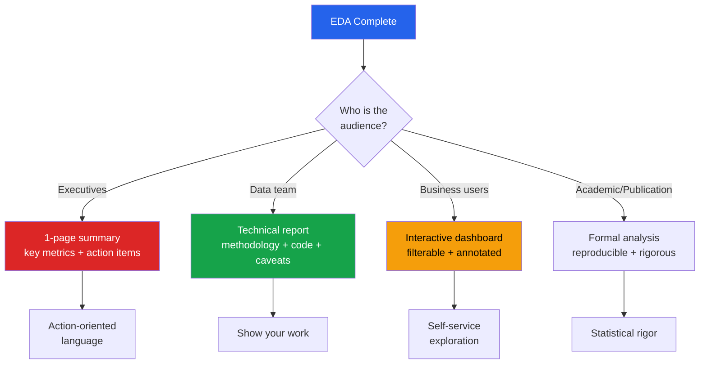

# Communicating EDA Findings

The most brilliant analysis is worthless if it cannot be communicated. This page covers how to transform raw EDA outputs into compelling, audience-appropriate reports and presentations.

---

## Communication Framework



---

## Report Structure

### The Pyramid Principle

Start with the conclusion, then support with evidence. Do not make the reader wait.

```python
report_structure = """
EDA REPORT: Customer Churn Analysis
=====================================

EXECUTIVE SUMMARY (read this only if short on time)
----------------------------------------------------
- 18% of customers churned last quarter, up from 14%
- Top 3 predictors: contract type, tenure, monthly charges
- Recommended action: target month-to-month customers with
  retention offers before month 3

KEY FINDINGS (5-7 findings with evidence)
----------------------------------------------------
1. Finding: [Statement]
   Evidence: [Chart + number]
   Implication: [So what?]

2. Finding: ...

DATA QUALITY NOTES
----------------------------------------------------
- 3% missing in income (imputed with median)
- 200 duplicate records removed
- Date range: 2023-01-01 to 2024-12-31

METHODOLOGY
----------------------------------------------------
- Tools: Python 3.11, pandas 2.2, scikit-learn 1.4
- Statistical tests: Mann-Whitney U, Chi-squared
- Significance level: alpha = 0.05

APPENDIX
----------------------------------------------------
- Detailed tables
- Additional charts
- Code reference
"""
print(report_structure)
```

---

## Chart Simplification

### Before and After

```python
import matplotlib.pyplot as plt
import numpy as np
import seaborn as sns

np.random.seed(42)
categories = ['Electronics', 'Clothing', 'Home', 'Books', 'Sports']
values = [42, 38, 55, 28, 47]

# BAD: Cluttered, default styling
fig, axes = plt.subplots(1, 2, figsize=(16, 6))

axes[0].bar(categories, values, color=['red', 'blue', 'green', 'orange', 'purple'],
            edgecolor='black', linewidth=2)
axes[0].set_title('Sales by Category', fontsize=8)
axes[0].grid(True)
axes[0].set_ylabel('Units')
axes[0].legend(['Sales'])  # unnecessary legend
for i, v in enumerate(values):
    axes[0].text(i, v + 0.5, str(v), ha='center', fontsize=7)
axes[0].set_ylim(0, 70)
# Title: "BEFORE — Too many colors, unnecessary legend, small font"
axes[0].set_title('BEFORE: Default/cluttered', fontweight='bold')

# GOOD: Clean, focused, tells a story
sorted_idx = np.argsort(values)[::-1]
sorted_cats = [categories[i] for i in sorted_idx]
sorted_vals = [values[i] for i in sorted_idx]
colors = ['#2563eb' if v == max(values) else '#94a3b8' for v in sorted_vals]

axes[1].barh(sorted_cats, sorted_vals, color=colors, height=0.6)
axes[1].set_title('Home leads category sales', fontsize=14, fontweight='bold', loc='left')
axes[1].spines['top'].set_visible(False)
axes[1].spines['right'].set_visible(False)
axes[1].spines['bottom'].set_visible(False)
axes[1].xaxis.set_visible(False)
axes[1].invert_yaxis()
for i, v in enumerate(sorted_vals):
    axes[1].text(v + 0.5, i, f'{v} units', va='center', fontsize=11,
                  fontweight='bold' if v == max(values) else 'normal')

plt.tight_layout()
plt.show()
```

### Chart Simplification Rules

| Rule | Before | After |
|------|--------|-------|
| Remove chartjunk | Grid lines, borders, legends | Only essential elements |
| Highlight the insight | All bars same color | Hero bar is colored, rest gray |
| Use descriptive titles | "Revenue by Quarter" | "Q3 revenue dropped 15% after pricing change" |
| Sort meaningfully | Alphabetical | By value (largest first) |
| Remove redundancy | Legend + axis labels + data labels | Pick one or two |
| Choose right orientation | Vertical bars for 10 categories | Horizontal bars for readability |

---

## Audience-Aware Communication

### For Executives

```python
def executive_summary(df, target_col, key_metrics):
    """Generate an executive-friendly summary."""
    summary = []
    summary.append("KEY METRICS")
    summary.append("-" * 40)

    for name, value, change in key_metrics:
        direction = "up" if change > 0 else "down"
        summary.append(f"  {name}: {value} ({direction} {abs(change):.1f}% vs prior period)")

    # Top insight
    summary.append("")
    summary.append("TOP INSIGHT")
    summary.append("-" * 40)

    if target_col in df.columns:
        rate = df[target_col].mean()
        summary.append(f"  {target_col} rate: {rate:.1%}")

    summary.append("")
    summary.append("RECOMMENDED ACTIONS")
    summary.append("-" * 40)
    summary.append("  1. [Specific action based on findings]")
    summary.append("  2. [Second action]")
    summary.append("  3. [Third action]")

    return '\n'.join(summary)

# Usage
metrics = [
    ("Churn Rate", "18.2%", 4.2),
    ("Avg Revenue/Customer", "$142", -3.1),
    ("Customer Satisfaction", "4.2/5", 0.1),
]
# print(executive_summary(df, 'churned', metrics))
```

### For Technical Audience

```python
def technical_report_section(finding_name, description, statistical_test,
                              effect_size, visualization_fn, caveats):
    """Generate a technical EDA finding section."""
    report = f"""
### {finding_name}

**Description**: {description}

**Statistical Evidence**:
- Test: {statistical_test['name']}
- Statistic: {statistical_test['statistic']:.4f}
- p-value: {statistical_test['p_value']:.4f}
- Effect size: {effect_size['name']} = {effect_size['value']:.4f} ({effect_size['interpretation']})

**Caveats**:
"""
    for caveat in caveats:
        report += f"- {caveat}\n"

    return report

# Example
finding = technical_report_section(
    "Churn rate differs by contract type",
    "Month-to-month customers churn at 3x the rate of annual contract customers",
    {'name': 'Chi-squared', 'statistic': 245.8, 'p_value': 0.0001},
    {'name': "Cramer's V", 'value': 0.42, 'interpretation': 'medium-large'},
    None,
    ['Self-selection bias: customers who intend to stay choose annual contracts',
     'Analysis period covers only 12 months'],
)
print(finding)
```

---

## Data Storytelling

### The SCR Framework (Situation-Complication-Resolution)

```python
story_template = """
SITUATION:
  Our customer base grew 25% last year to 50,000 active customers.
  Revenue per customer averaged $142/month.

COMPLICATION:
  However, churn increased from 14% to 18% — we are losing customers
  faster than we are acquiring them. At this rate, net growth turns
  negative in Q3.

RESOLUTION:
  EDA reveals that 72% of churn comes from month-to-month contracts
  in their first 3 months. A targeted onboarding program for this
  segment could reduce churn by an estimated 4 percentage points,
  saving $2.1M annually.
"""
```

### Annotation-Driven Charts

```python
# Charts should tell stories through annotations
np.random.seed(42)
months = pd.date_range('2023-01-01', periods=24, freq='M')
churn_rates = np.array([14, 13.5, 14.2, 14.8, 15, 14.5, 15.2, 15.8,
                         16, 16.5, 17, 17.2, 17.5, 18, 18.2, 17.8,
                         17.5, 17, 16.5, 16, 15.5, 15, 14.8, 14.5])

fig, ax = plt.subplots(figsize=(14, 6))
ax.plot(months, churn_rates, 'o-', color='#dc2626', linewidth=2, markersize=5)
ax.fill_between(months, churn_rates, alpha=0.1, color='#dc2626')

# Annotate key events
ax.annotate('Price increase\nimplemented',
            xy=(months[4], churn_rates[4]),
            xytext=(months[6], churn_rates[4] + 2),
            arrowprops=dict(arrowstyle='->', color='black'),
            fontsize=10, ha='center',
            bbox=dict(boxstyle='round,pad=0.3', facecolor='yellow', alpha=0.8))

ax.annotate('Peak churn:\n18.2%',
            xy=(months[14], churn_rates[14]),
            xytext=(months[16], churn_rates[14] + 1.5),
            arrowprops=dict(arrowstyle='->', color='black'),
            fontsize=10, ha='center', fontweight='bold',
            bbox=dict(boxstyle='round,pad=0.3', facecolor='#fecaca', alpha=0.8))

ax.annotate('Retention program\nlaunched',
            xy=(months[15], churn_rates[15]),
            xytext=(months[13], churn_rates[15] - 2.5),
            arrowprops=dict(arrowstyle='->', color='green'),
            fontsize=10, ha='center',
            bbox=dict(boxstyle='round,pad=0.3', facecolor='#bbf7d0', alpha=0.8))

# Clean styling
ax.set_title('Monthly Churn Rate: Price increase drove churn up; retention program brought it back down',
             fontsize=12, fontweight='bold', loc='left')
ax.set_ylabel('Churn Rate (%)')
ax.spines['top'].set_visible(False)
ax.spines['right'].set_visible(False)
ax.grid(axis='y', alpha=0.3)
ax.set_ylim(12, 22)

plt.tight_layout()
plt.show()
```

---

## Common Communication Mistakes

| Mistake | Problem | Fix |
|---------|---------|-----|
| Showing all 50 charts | Information overload | Pick 5-7 that tell the story |
| Technical jargon | "p-value of 0.003" means nothing to executives | "Statistically significant" or "very likely real" |
| No "so what" | Charts without interpretation | Every chart needs a takeaway sentence |
| Correlation as causation | "Higher income causes lower churn" | "Higher income is associated with lower churn" |
| Ignoring uncertainty | "Churn rate is 18.2%" | "Churn rate is 18.2% (95% CI: 17.1%-19.3%)" |
| Missing context | "Revenue is $5M" | "Revenue is $5M, up 12% YoY, but below $5.5M target" |

---

## EDA Presentation Template

```python
def generate_eda_presentation_outline(dataset_name, n_findings=5):
    """Generate a presentation outline for EDA findings."""
    outline = f"""
EDA PRESENTATION: {dataset_name}
{'=' * 60}

SLIDE 1: TITLE
  - Dataset name, date range, analyst
  - One-sentence summary of the most important finding

SLIDE 2: CONTEXT
  - Why this analysis was done
  - What question we are answering
  - Data source and time period

SLIDE 3: DATA OVERVIEW
  - Size: rows x columns
  - Key variables
  - Data quality summary (missing %, duplicates)

SLIDES 4-{3+n_findings}: FINDINGS (one per slide)
  - Insight title (not "Chart 1" but "Churn peaks in month 2")
  - ONE chart that supports the insight
  - Key number highlighted
  - Business implication

SLIDE {4+n_findings}: LIMITATIONS & CAVEATS
  - What the data cannot tell us
  - Missing data impact
  - Known biases

SLIDE {5+n_findings}: RECOMMENDATIONS
  - 3-5 specific, actionable recommendations
  - Each tied to a finding
  - Estimated impact if possible

SLIDE {6+n_findings}: NEXT STEPS
  - Additional analysis needed
  - Data collection suggestions
  - Timeline
"""
    return outline

print(generate_eda_presentation_outline("Customer Churn"))
```

---

## Export-Ready Visualization Settings

```python
# Publication-quality figure settings
def setup_publication_style():
    """Configure matplotlib for clean, professional charts."""
    plt.rcParams.update({
        # Figure
        'figure.figsize': (10, 6),
        'figure.dpi': 100,
        'savefig.dpi': 300,
        'savefig.bbox': 'tight',
        'savefig.transparent': False,
        'savefig.facecolor': 'white',

        # Font
        'font.family': 'sans-serif',
        'font.sans-serif': ['Arial', 'Helvetica', 'DejaVu Sans'],
        'font.size': 12,
        'axes.titlesize': 14,
        'axes.titleweight': 'bold',
        'axes.labelsize': 12,

        # Axes
        'axes.spines.top': False,
        'axes.spines.right': False,
        'axes.grid': True,
        'grid.alpha': 0.3,

        # Legend
        'legend.fontsize': 10,
        'legend.framealpha': 0.9,

        # Lines
        'lines.linewidth': 2,
        'lines.markersize': 6,
    })

setup_publication_style()

# Save in multiple formats
def save_figure(fig, name, formats=['png', 'svg']):
    """Save figure in multiple formats for different uses."""
    for fmt in formats:
        path = f'reports/figures/{name}.{fmt}'
        fig.savefig(path, format=fmt, bbox_inches='tight', facecolor='white')
        print(f"Saved: {path}")
```

---

## Writing Insight Statements

```python
# Template for converting analysis into insight statements

insight_templates = {
    'comparison': "{group_a} has {metric} that is {difference} {direction} than {group_b} ({value_a} vs {value_b})",
    'trend': "{metric} has {direction} by {amount} over {period}, from {start} to {end}",
    'distribution': "{percent}% of {entity} have {metric} {condition} ({threshold})",
    'correlation': "{variable_a} and {variable_b} are {strength} {direction}ly correlated (r={correlation})",
    'anomaly': "{entity} shows an unusual {pattern} in {metric}, suggesting {hypothesis}",
}

# Examples:
examples = [
    insight_templates['comparison'].format(
        group_a='Month-to-month customers', metric='churn rate',
        difference='3x', direction='higher', group_b='annual contract customers',
        value_a='42%', value_b='14%'
    ),
    insight_templates['trend'].format(
        metric='Average revenue per user', direction='declined',
        amount='8%', period='the past 6 months',
        start='$156', end='$143'
    ),
    insight_templates['distribution'].format(
        percent=72, entity='churned customers', metric='tenure',
        condition='less than', threshold='6 months'
    ),
]

print("Example Insight Statements:")
for i, ex in enumerate(examples, 1):
    print(f"  {i}. {ex}")
```

---

## Key Takeaways

- **Start with the conclusion** (Pyramid Principle) — do not make the reader wait through methodology to get the answer
- **Every chart needs a "so what"** — the title should state the insight, not describe the chart type
- **Simplify ruthlessly**: fewer colors, fewer grid lines, fewer charts; highlight only what matters
- **Know your audience**: executives want actions, data teams want methodology, business users want filters
- **Annotate charts** with context (events, benchmarks, targets) that the reader needs to interpret them
- Use the **SCR framework** (Situation-Complication-Resolution) for narrative structure
- **Never present correlation as causation** — use language like "associated with" not "causes"
- Always include **caveats and limitations** — they build credibility, not doubt
