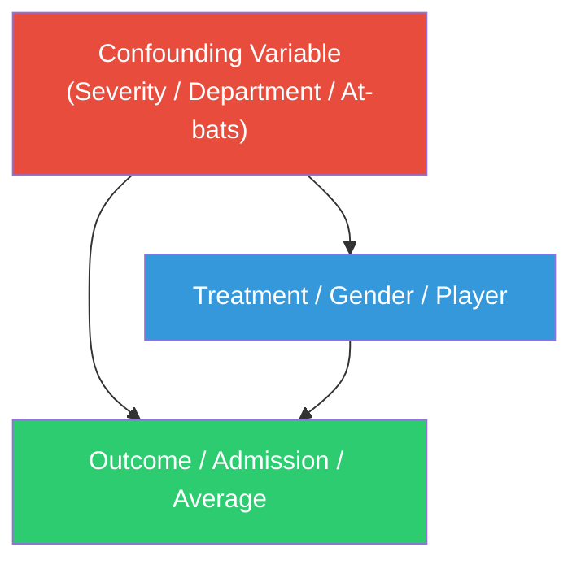
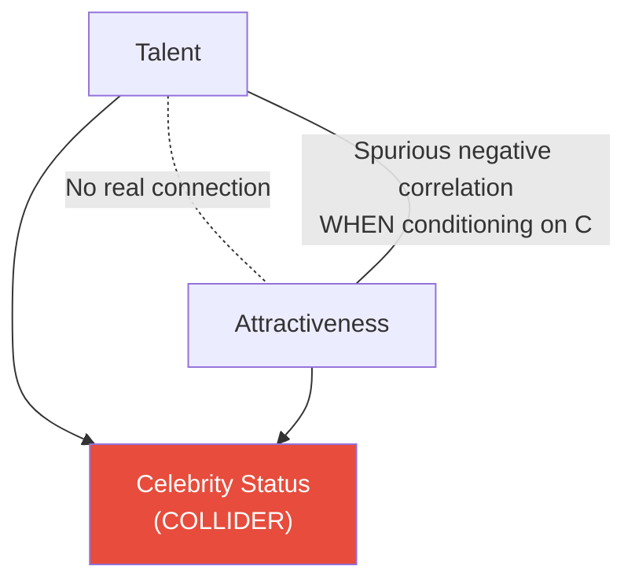
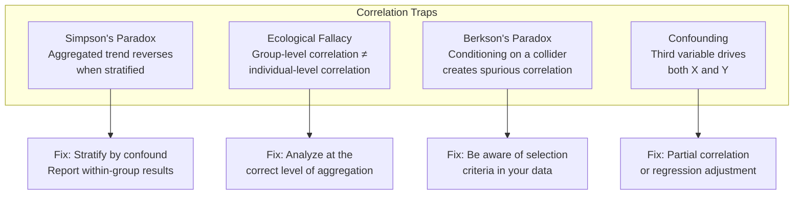

# Correlation Traps & Paradoxes

Correlation is the most misused statistic in data science. Not because the math is wrong, but because humans instinctively interpret "X correlates with Y" as "X causes Y" or at minimum "the relationship between X and Y is real." Both conclusions can be spectacularly wrong.

This page walks through the most dangerous traps: Simpson's paradox, the ecological fallacy, Berkson's paradox, collider bias, and confounding — with full examples, real data, and the partial correlation tools that help you escape them.

## Simpson's Paradox

Simpson's paradox occurs when a trend that appears in several groups of data reverses when the groups are combined. It is not a mathematical curiosity — it happens in real data all the time, and acting on the aggregated result can be catastrophic.

### Example 1: Treatment Effectiveness

A hospital compares two treatments. Treatment B looks better overall, but worse in every subgroup.

```python
import numpy as np
import pandas as pd
import matplotlib.pyplot as plt
import seaborn as sns
from scipy import stats

np.random.seed(42)

# Treatment data — Simpson's paradox by severity
data = {
    "Treatment": ["A"] * 1000 + ["B"] * 1000,
    "Severity": (["Mild"] * 200 + ["Severe"] * 800 +
                 ["Mild"] * 800 + ["Severe"] * 200),
}

# Recovery rates — Treatment A is BETTER within each severity
recovery = []
for treat, sev in zip(data["Treatment"], data["Severity"]):
    if treat == "A" and sev == "Mild":
        recovery.append(np.random.random() < 0.93)   # A: 93% for mild
    elif treat == "A" and sev == "Severe":
        recovery.append(np.random.random() < 0.73)   # A: 73% for severe
    elif treat == "B" and sev == "Mild":
        recovery.append(np.random.random() < 0.87)   # B: 87% for mild
    elif treat == "B" and sev == "Severe":
        recovery.append(np.random.random() < 0.69)   # B: 69% for severe

data["Recovered"] = [int(r) for r in recovery]
df_treat = pd.DataFrame(data)

# Aggregated view (MISLEADING)
agg = df_treat.groupby("Treatment")["Recovered"].mean() * 100
print("AGGREGATED (misleading):")
print(agg.round(1))
print(f"\nAppears that Treatment B ({agg['B']:.1f}%) is better than A ({agg['A']:.1f}%)")

# Stratified view (CORRECT)
strat = df_treat.groupby(["Treatment", "Severity"])["Recovered"].agg(["mean", "count"])
strat["pct"] = (strat["mean"] * 100).round(1)
print(f"\nSTRATIFIED (correct):")
print(strat[["count", "pct"]])
print(f"\nTreatment A is BETTER in EVERY subgroup!")
print(f"The reversal happens because A is disproportionately given to severe cases.")
```

```python
# Visualization
fig, axes = plt.subplots(1, 3, figsize=(18, 5))

# Aggregated
agg.plot(kind="bar", ax=axes[0], color=["#e74c3c", "#3498db"], edgecolor="black")
axes[0].set_title("Aggregated: B looks better", fontsize=12)
axes[0].set_ylabel("Recovery Rate (%)")
axes[0].set_ylim(0, 100)
axes[0].tick_params(axis="x", rotation=0)

# Stratified
strat_pivot = df_treat.groupby(["Severity", "Treatment"])["Recovered"].mean().unstack() * 100
strat_pivot.plot(kind="bar", ax=axes[1], color=["#e74c3c", "#3498db"], edgecolor="black")
axes[1].set_title("Stratified: A is better in BOTH groups", fontsize=12)
axes[1].set_ylabel("Recovery Rate (%)")
axes[1].set_ylim(0, 100)
axes[1].tick_params(axis="x", rotation=0)
axes[1].legend(title="Treatment")

# Show the confound: treatment allocation
alloc = df_treat.groupby(["Treatment", "Severity"]).size().unstack()
alloc.plot(kind="bar", ax=axes[2], color=["#2ecc71", "#e67e22"], edgecolor="black")
axes[2].set_title("Root cause: Unequal allocation", fontsize=12)
axes[2].set_ylabel("Count")
axes[2].tick_params(axis="x", rotation=0)
axes[2].legend(title="Severity")

plt.suptitle("Simpson's Paradox: Treatment Effectiveness", fontsize=16, fontweight="bold")
plt.tight_layout()
plt.savefig("simpson_treatment.png", dpi=150, bbox_inches="tight")
plt.show()
```

### Example 2: University Admissions (Berkeley Gender Bias)

The most famous real-world case of Simpson's paradox.

```python
# Simplified Berkeley admissions data
departments = {
    "Dept A": {"male_applied": 825, "male_admitted": 62, "female_applied": 108, "female_admitted": 82},
    "Dept B": {"male_applied": 560, "male_admitted": 63, "female_applied": 25, "female_admitted": 68},
    "Dept C": {"male_applied": 325, "male_admitted": 37, "female_applied": 593, "female_admitted": 34},
    "Dept D": {"male_applied": 417, "male_admitted": 33, "female_applied": 375, "female_admitted": 35},
    "Dept E": {"male_applied": 191, "male_admitted": 28, "female_applied": 393, "female_admitted": 24},
    "Dept F": {"male_applied": 373, "male_admitted": 6, "female_applied": 341, "female_admitted": 7},
}

rows = []
for dept, vals in departments.items():
    rows.append({
        "department": dept,
        "gender": "Male",
        "applied": vals["male_applied"],
        "admission_rate": vals["male_admitted"],
    })
    rows.append({
        "department": dept,
        "gender": "Female",
        "applied": vals["female_applied"],
        "admission_rate": vals["female_admitted"],
    })

berkeley = pd.DataFrame(rows)

# Overall admission rate by gender
for gender in ["Male", "Female"]:
    subset = berkeley[berkeley["gender"] == gender]
    total_applied = subset["applied"].sum()
    total_admitted = (subset["applied"] * subset["admission_rate"] / 100).sum()
    print(f"{gender}: {total_admitted/total_applied*100:.1f}% overall admission rate")

print("\nBy department:")
for _, row in berkeley.iterrows():
    print(f"  {row['department']} - {row['gender']}: {row['admission_rate']}% "
          f"(n={row['applied']})")

print("\nParadox: Women have a LOWER overall rate, but HIGHER rates in most departments!")
print("Cause: Women applied disproportionately to competitive departments (C-F).")
```

### Example 3: Batting Averages in Baseball

```python
# Player performance across two seasons
players = pd.DataFrame({
    "player": ["Player A"] * 2 + ["Player B"] * 2,
    "season": ["2024", "2025"] * 2,
    "hits": [12, 183, 104, 45],
    "at_bats": [48, 600, 400, 200],
})
players["avg"] = (players["hits"] / players["at_bats"]).round(3)

print("Season-by-season:")
for _, row in players.iterrows():
    print(f"  {row['player']} {row['season']}: {row['hits']}/{row['at_bats']} = {row['avg']:.3f}")

# Aggregated
for player in ["Player A", "Player B"]:
    subset = players[players["player"] == player]
    total_avg = subset["hits"].sum() / subset["at_bats"].sum()
    print(f"\n{player} combined: {subset['hits'].sum()}/{subset['at_bats'].sum()} = {total_avg:.3f}")

print("\nPlayer A has a HIGHER average in BOTH seasons,")
print("but a LOWER combined average (different sample sizes per season).")
```

### Simpson's Paradox: The Causal Structure



The confounding variable (C) influences both the exposure (X) and the outcome (Y). If you do not control for C, you get the wrong answer.

## Ecological Fallacy

The ecological fallacy occurs when you draw conclusions about individuals from aggregate (group-level) data.

```python
np.random.seed(42)

# Generate country-level data
n_countries = 50
countries = [f"Country_{i}" for i in range(n_countries)]

# Country-level: GDP correlates POSITIVELY with life expectancy
gdp_country = np.random.lognormal(10, 0.8, n_countries)
life_exp_country = 55 + 10 * np.log(gdp_country / 10000) + np.random.normal(0, 3, n_countries)
life_exp_country = np.clip(life_exp_country, 40, 90)

# Individual-level within a rich country: income correlates WEAKLY with life expectancy
# (because within-country, other factors dominate)
n_individuals = 2000
income_individual = np.random.lognormal(11, 0.7, n_individuals)
# Within a single country, the relationship is much weaker
life_exp_individual = 78 + 0.3 * np.log(income_individual / 50000) + np.random.normal(0, 5, n_individuals)
life_exp_individual = np.clip(life_exp_individual, 55, 95)

fig, axes = plt.subplots(1, 2, figsize=(16, 6))

# Country level (strong correlation)
r_country, _ = stats.pearsonr(np.log(gdp_country), life_exp_country)
axes[0].scatter(np.log(gdp_country), life_exp_country, color="steelblue", s=50, alpha=0.7)
axes[0].set_xlabel("Log GDP per Capita (Country Average)")
axes[0].set_ylabel("Life Expectancy (Country Average)")
axes[0].set_title(f"Country Level: r = {r_country:.3f}\n(Strong ecological correlation)", fontsize=12)

# Individual level (weak correlation)
r_individual, _ = stats.pearsonr(np.log(income_individual), life_exp_individual)
axes[1].scatter(np.log(income_individual), life_exp_individual,
                color="steelblue", s=5, alpha=0.2)
axes[1].set_xlabel("Log Individual Income")
axes[1].set_ylabel("Individual Life Expectancy")
axes[1].set_title(f"Individual Level: r = {r_individual:.3f}\n(Weak individual correlation)", fontsize=12)

plt.suptitle("Ecological Fallacy: Group-Level Correlations ≠ Individual-Level",
             fontsize=16, fontweight="bold")
plt.tight_layout()
plt.savefig("ecological_fallacy.png", dpi=150, bbox_inches="tight")
plt.show()

print(f"Country-level correlation:    r = {r_country:.3f}")
print(f"Individual-level correlation: r = {r_individual:.3f}")
print(f"Concluding individual-level effects from country-level data is WRONG.")
```

## Berkson's Paradox (Collider Bias)

Berkson's paradox creates a spurious negative correlation between two independent variables when you condition on a common effect (a collider).

```python
np.random.seed(42)
n = 5000

# Talent and attractiveness are INDEPENDENT in the population
talent = np.random.normal(50, 15, n)
attractiveness = np.random.normal(50, 15, n)

# Verify independence
r_pop, p_pop = stats.pearsonr(talent, attractiveness)
print(f"In the full population: r = {r_pop:.4f} (p = {p_pop:.3f})")
print(f"Talent and attractiveness are INDEPENDENT")

# Celebrity status is a COLLIDER — caused by both talent and attractiveness
celebrity_score = 0.5 * talent + 0.5 * attractiveness + np.random.normal(0, 5, n)
is_celebrity = celebrity_score > np.percentile(celebrity_score, 90)

# Among celebrities, talent and attractiveness appear NEGATIVELY correlated
r_celeb, p_celeb = stats.pearsonr(talent[is_celebrity], attractiveness[is_celebrity])
print(f"\nAmong celebrities only: r = {r_celeb:.4f} (p = {p_celeb:.3f})")
print(f"Spurious NEGATIVE correlation!")

fig, axes = plt.subplots(1, 2, figsize=(14, 6))

axes[0].scatter(talent[~is_celebrity], attractiveness[~is_celebrity],
                alpha=0.1, s=5, color="gray", label="Non-celebrity")
axes[0].scatter(talent[is_celebrity], attractiveness[is_celebrity],
                alpha=0.5, s=20, color="red", label="Celebrity")
axes[0].set_xlabel("Talent")
axes[0].set_ylabel("Attractiveness")
axes[0].set_title(f"Full Population: r = {r_pop:.3f}", fontsize=12)
axes[0].legend()

axes[1].scatter(talent[is_celebrity], attractiveness[is_celebrity],
                alpha=0.5, s=20, color="red")
# Add regression line
z = np.polyfit(talent[is_celebrity], attractiveness[is_celebrity], 1)
x_line = np.linspace(talent[is_celebrity].min(), talent[is_celebrity].max(), 100)
axes[1].plot(x_line, np.polyval(z, x_line), "k--", linewidth=2)
axes[1].set_xlabel("Talent")
axes[1].set_ylabel("Attractiveness")
axes[1].set_title(f"Celebrities Only: r = {r_celeb:.3f} (SPURIOUS)", fontsize=12)

plt.suptitle("Berkson's Paradox: Conditioning on a Collider Creates Spurious Correlation",
             fontsize=14, fontweight="bold")
plt.tight_layout()
plt.savefig("berksons_paradox.png", dpi=150, bbox_inches="tight")
plt.show()
```

### The Collider Structure



::: warning Collider bias in data collection
Berkson's paradox is especially dangerous when your dataset is already conditioned on a collider. If you only study hospitalized patients, admitted students, or successful startups, you are conditioning on a collider. Any two independent causes of "being in your dataset" will appear negatively correlated.
:::

## Partial Correlation: The Tool for Unconfounding

Partial correlation measures the correlation between X and Y after removing the effect of one or more confounding variables Z.

```python
def partial_correlation(df, x, y, z_list):
    """Compute partial correlation of x and y controlling for z variables."""
    from sklearn.linear_model import LinearRegression

    # Residualize X
    model_x = LinearRegression()
    model_x.fit(df[z_list], df[x])
    resid_x = df[x] - model_x.predict(df[z_list])

    # Residualize Y
    model_y = LinearRegression()
    model_y.fit(df[z_list], df[y])
    resid_y = df[y] - model_y.predict(df[z_list])

    # Correlate residuals
    r, p = stats.pearsonr(resid_x, resid_y)
    return r, p

# Demonstration: apparent correlation driven by confound
np.random.seed(42)
n = 1000

# Z (age) causes both X (income) and Y (health spending)
age = np.random.uniform(20, 70, n)
income = 20000 + 1500 * age + np.random.normal(0, 15000, n)
health_spending = 500 + 80 * age + np.random.normal(0, 2000, n)
shoe_size = np.random.normal(10, 1.5, n)  # truly independent

demo = pd.DataFrame({
    "age": age,
    "income": income,
    "health_spending": health_spending,
    "shoe_size": shoe_size,
})

# Raw correlations
r_raw, p_raw = stats.pearsonr(demo["income"], demo["health_spending"])
print(f"Raw correlation (income, health spending): r = {r_raw:.4f} (p = {p_raw:.2e})")

# Partial correlation controlling for age
r_partial, p_partial = partial_correlation(demo, "income", "health_spending", ["age"])
print(f"Partial correlation (controlling for age): r = {r_partial:.4f} (p = {p_partial:.2e})")

# The income-health spending relationship largely disappears when controlling for age
print(f"\nConclusion: {abs(r_raw - r_partial)/abs(r_raw)*100:.0f}% of the correlation "
      f"was due to the confound (age)")

# Full partial correlation matrix
from pingouin import partial_corr

# Compare raw vs partial for all pairs
pairs = [("income", "health_spending", ["age"]),
         ("income", "shoe_size", ["age"]),
         ("health_spending", "shoe_size", ["age"])]

print(f"\n{'Pair':>40s}  {'Raw r':>8s}  {'Partial r':>10s}  {'Change':>8s}")
print("-" * 75)
for x, y, z in pairs:
    r_raw, _ = stats.pearsonr(demo[x], demo[y])
    r_part, _ = partial_correlation(demo, x, y, z)
    print(f"{x + ' ↔ ' + y:>40s}  {r_raw:+8.4f}  {r_part:+10.4f}  {r_part - r_raw:+8.4f}")
```

## Summary: The Trap Taxonomy



## Defensive EDA Checklist

Before trusting any correlation or trend, ask:

1. **Does the relationship hold within subgroups?** Check for Simpson's paradox by stratifying on key confounders.
2. **Is your data aggregated?** If using group-level data, never conclude about individual behavior.
3. **Is your sample conditioned on an outcome?** If studying only "successful" cases, look for Berkson's bias.
4. **What third variables could drive both X and Y?** Compute partial correlations controlling for plausible confounders.
5. **Does the direction make causal sense?** Correlation is symmetric; causation is not.
6. **Is the sample size sufficient?** Small samples produce large spurious correlations routinely.

## Key Takeaways

- Simpson's paradox is common, dangerous, and non-obvious. Always check aggregated results against stratified results.
- Ecological fallacy means you cannot infer individual behavior from aggregate data. Rich countries have higher life expectancy, but within a country, being richer may not help much.
- Berkson's paradox (collider bias) creates negative correlations between independent causes when you condition on their shared effect. Any filtered or selected dataset is at risk.
- Partial correlation removes confounding effects and is the first-line defense against spurious associations.
- No statistical test can determine causation from observational data alone. Domain knowledge is irreplaceable.
