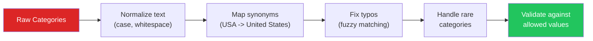
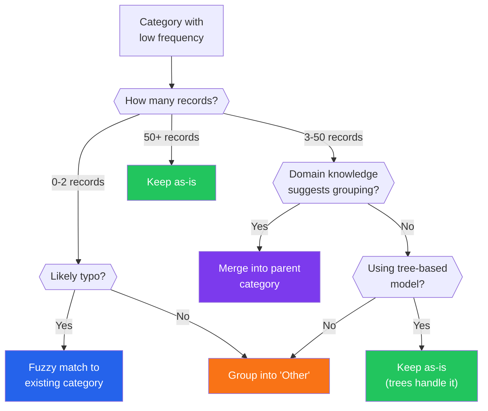

# Data Cleaning — Categories

Categorical data is deceptively simple until you encounter real-world data. A "country" column with 47 unique values that should have 12. A "status" field with "Active", "active", "ACTIVE", "Activ", and "A". A "product category" with 2,000 unique values where the top 20 account for 95% of records. Cleaning categorical data is about imposing order on chaos while preserving the meaning.

---

## The Category Cleaning Pipeline



```python
# category_cleaning.py — The complete pipeline
import pandas as pd
import numpy as np
from collections import Counter

# Messy categorical data
np.random.seed(42)
n = 1000

countries_messy = np.random.choice([
    'USA', 'US', 'U.S.A.', 'United States', 'united states',
    'UNITED STATES', 'US of A', 'América',
    'UK', 'U.K.', 'United Kingdom', 'Great Britain', 'England',
    'Canada', 'CANADA', 'canada', 'CA',
    'Germany', 'GERMANY', 'Deutschland', 'DE',
    'France', 'FRANCE', 'france', 'FR',
], n)

df = pd.DataFrame({'country': countries_messy})

print("=== RAW CATEGORIES ===")
print(f"Unique values: {df['country'].nunique()}")
print(f"\nValue counts:\n{df['country'].value_counts().to_string()}")

# Step 1: Normalize text
df['country_clean'] = (df['country']
    .str.strip()
    .str.lower()
    .str.replace(r'[.\-]', '', regex=True)  # Remove dots and dashes
    .str.replace(r'\s+', ' ', regex=True)    # Collapse whitespace
)

# Step 2: Map synonyms
country_map = {
    'usa': 'United States', 'us': 'United States', 'usa': 'United States',
    'united states': 'United States', 'us of a': 'United States',
    'américa': 'United States',
    'uk': 'United Kingdom', 'united kingdom': 'United Kingdom',
    'great britain': 'United Kingdom', 'england': 'United Kingdom',
    'canada': 'Canada', 'ca': 'Canada',
    'germany': 'Germany', 'deutschland': 'Germany', 'de': 'Germany',
    'france': 'France', 'fr': 'France',
}
df['country_final'] = df['country_clean'].map(country_map).fillna(df['country_clean'])

print(f"\n=== AFTER CLEANING ===")
print(f"Unique values: {df['country_final'].nunique()}")
print(f"\nValue counts:\n{df['country_final'].value_counts().to_string()}")

reduction = 1 - df['country_final'].nunique() / df['country'].nunique()
print(f"\nCardinality reduction: {reduction:.0%}")
```

---

## Systematic Synonym Detection

```python
# synonym_detection.py — Automatically finding similar category names
import pandas as pd
import numpy as np
from thefuzz import fuzz, process
from collections import defaultdict

# Generate messy product categories
categories = pd.Series([
    'Electronics', 'electronics', 'ELECTRONICS', 'Elctronics',
    'Home & Garden', 'Home and Garden', 'Home&Garden', 'Home / Garden',
    'Clothing', 'Clothes', 'Apparel', 'CLOTHING',
    'Sports & Outdoors', 'Sports and Outdoors', 'Sports',
    'Books', 'Book', 'BOOKS',
    'Toys & Games', 'Toys and Games', 'Toys',
    'Health & Beauty', 'Health and Beauty', 'Health/Beauty',
] * 50)

print("=== AUTOMATIC SYNONYM DETECTION ===\n")

# Step 1: Normalize
normalized = categories.str.strip().str.lower().str.replace(r'[&/]', 'and', regex=True)
normalized = normalized.str.replace(r'\s+', ' ', regex=True)

unique_normalized = sorted(normalized.unique())
print(f"Unique after normalization: {len(unique_normalized)}")

# Step 2: Cluster similar strings
def cluster_similar_strings(strings, threshold=80):
    """Group similar strings using fuzzy matching."""
    clusters = defaultdict(list)
    assigned = set()

    for s in strings:
        if s in assigned:
            continue

        # Find all matches above threshold
        matches = process.extract(s, strings, scorer=fuzz.token_set_ratio, limit=10)
        cluster = [s]
        for match_str, score, _ in matches:
            if score >= threshold and match_str != s and match_str not in assigned:
                cluster.append(match_str)
                assigned.add(match_str)

        # Use most common or longest as canonical name
        canonical = max(cluster, key=len)
        clusters[canonical] = cluster
        assigned.add(s)

    return clusters

clusters = cluster_similar_strings(unique_normalized, threshold=75)
print(f"Clusters found: {len(clusters)}\n")

for canonical, members in sorted(clusters.items()):
    if len(members) > 1:
        print(f"  '{canonical}':")
        for m in members:
            if m != canonical:
                print(f"    <- '{m}'")

# Step 3: Build mapping from clusters
mapping = {}
for canonical, members in clusters.items():
    for member in members:
        mapping[member] = canonical.title()

categories_clean = normalized.map(mapping).fillna(normalized.str.title())
print(f"\n=== RESULT ===")
print(f"Before: {categories.nunique()} unique")
print(f"After: {categories_clean.nunique()} unique")
print(f"\n{categories_clean.value_counts()}")
```

---

## Handling Rare Categories

```python
# rare_categories.py — What to do with categories that appear once or twice
import pandas as pd
import numpy as np

np.random.seed(42)
n = 5000

# Simulate product categories with long tail
popular = np.random.choice(
    ['Electronics', 'Clothing', 'Home', 'Books', 'Sports'],
    int(n * 0.85), p=[0.3, 0.25, 0.2, 0.15, 0.1]
)
rare = np.random.choice(
    [f'Niche_{i}' for i in range(50)],  # 50 rare categories
    int(n * 0.15)
)
categories = pd.Series(np.concatenate([popular, rare]))
np.random.shuffle(categories.values)

vc = categories.value_counts()
print("=== RARE CATEGORIES ===\n")
print(f"Total unique categories: {categories.nunique()}")
print(f"Categories with >= 100 records: {(vc >= 100).sum()}")
print(f"Categories with < 10 records: {(vc < 10).sum()}")
print(f"Categories with 1 record: {(vc == 1).sum()}")
print(f"\nTop 5 categories account for {vc.head(5).sum()/len(categories):.1%} of data")
print(f"Bottom 50 categories account for {vc.tail(50).sum()/len(categories):.1%} of data")

# Strategy 1: Threshold-based grouping
print(f"\n--- Strategy 1: Group below threshold ---")
threshold = 50
frequent = set(vc[vc >= threshold].index)
clean_threshold = categories.apply(lambda x: x if x in frequent else 'Other')
print(f"After grouping (threshold={threshold}):")
print(clean_threshold.value_counts())

# Strategy 2: Top-N + Other
print(f"\n--- Strategy 2: Top-N + Other ---")
top_n = 5
top_categories = set(vc.head(top_n).index)
clean_topn = categories.apply(lambda x: x if x in top_categories else 'Other')
print(f"After top-{top_n} grouping:")
print(clean_topn.value_counts())

# Strategy 3: Percentage-based
print(f"\n--- Strategy 3: Minimum percentage ---")
min_pct = 0.02  # At least 2% of records
min_count = int(len(categories) * min_pct)
frequent_pct = set(vc[vc >= min_count].index)
clean_pct = categories.apply(lambda x: x if x in frequent_pct else 'Other')
print(f"After {min_pct:.0%} minimum ({min_count} records):")
print(clean_pct.value_counts())

# Decision guide
print(f"\n--- RARE CATEGORY DECISION GUIDE ---")
guide = pd.DataFrame({
    'Strategy': ['Threshold count', 'Top-N', 'Min percentage',
                 'Domain grouping', 'Keep all (tree models)'],
    'When to Use': [
        'Fixed minimum sample size needed',
        'Want exactly N categories',
        'Relative to dataset size',
        'Domain knowledge suggests natural groups',
        'Tree-based models handle high cardinality well',
    ],
    'Risk': [
        'Arbitrary threshold choice',
        'Ignores natural category boundaries',
        'Changes with dataset growth',
        'Requires domain expertise',
        'Overfitting on rare categories',
    ],
})
print(guide.to_string(index=False))
```



---

## Ordinal Category Handling

```python
# ordinal_categories.py — Preserving order in ordinal data
import pandas as pd
import numpy as np

# Education levels (natural ordering)
education_data = pd.Series([
    'PhD', 'High School', "Bachelor's", "Master's", 'High School',
    "Bachelor's", "Master's", 'PhD', 'Some College', "Associate's",
    'High School', "Bachelor's", "Bachelor's", "Master's", 'High School'
])

print("=== ORDINAL CATEGORY HANDLING ===\n")

# Wrong: treating as nominal (alphabetical order)
print("Wrong (alphabetical order):")
print(sorted(education_data.unique()))

# Right: explicit ordered category
education_order = ['High School', 'Some College', "Associate's",
                    "Bachelor's", "Master's", 'PhD']

education_cat = pd.Categorical(
    education_data,
    categories=education_order,
    ordered=True
)

print(f"\nCorrect (ordered):")
print(f"Categories: {education_cat.categories.tolist()}")
print(f"\nComparisons work:")
df_edu = pd.DataFrame({'education': education_cat})
print(f"Records with >= Master's: {(df_edu['education'] >= \"Master's\").sum()}")
print(f"Records with < Bachelor's: {(df_edu['education'] < \"Bachelor's\").sum()}")

# Ordinal encoding for models
ordinal_map = {cat: i for i, cat in enumerate(education_order)}
df_edu['education_encoded'] = education_data.map(ordinal_map)
print(f"\nOrdinal encoding:")
for cat, code in ordinal_map.items():
    count = (education_data == cat).sum()
    print(f"  {cat:>15} -> {code} (n={count})")

# Common ordinal scales
print(f"\n=== COMMON ORDINAL SCALES ===")
scales = {
    'Satisfaction': ['Very Dissatisfied', 'Dissatisfied', 'Neutral',
                     'Satisfied', 'Very Satisfied'],
    'T-shirt size': ['XS', 'S', 'M', 'L', 'XL', 'XXL'],
    'Risk level': ['Low', 'Medium', 'High', 'Critical'],
    'Priority': ['P4 (Low)', 'P3 (Medium)', 'P2 (High)', 'P1 (Critical)'],
    'Income bracket': ['< $25K', '$25K-50K', '$50K-75K', '$75K-100K', '> $100K'],
}

for scale_name, levels in scales.items():
    print(f"\n  {scale_name}:")
    print(f"    {' < '.join(levels)}")
```

---

## Category Merging Strategies

```python
# category_merging.py — Intelligent grouping of categories
import pandas as pd
import numpy as np

np.random.seed(42)

# Job title data — extreme cardinality
job_titles = pd.Series([
    'Software Engineer', 'Sr Software Engineer', 'Senior Software Engineer',
    'Software Developer', 'Sr Software Developer', 'Staff Engineer',
    'Principal Engineer', 'Engineering Manager', 'VP of Engineering',
    'Data Scientist', 'Sr Data Scientist', 'ML Engineer',
    'Product Manager', 'Sr Product Manager', 'Director of Product',
    'Designer', 'Sr Designer', 'UX Designer', 'UI Designer',
    'Sales Rep', 'Account Executive', 'Sales Manager', 'VP Sales',
    'Marketing Analyst', 'Marketing Manager', 'CMO',
] * 20 + ['Intern', 'Contractor', 'Consultant'] * 5)

print("=== CATEGORY MERGING ===\n")
print(f"Original unique titles: {job_titles.nunique()}")

# Strategy 1: Keyword-based grouping
def group_by_keywords(title):
    title_lower = title.lower()
    if any(kw in title_lower for kw in ['engineer', 'developer']):
        return 'Engineering'
    elif any(kw in title_lower for kw in ['data', 'ml', 'machine learning']):
        return 'Data/ML'
    elif any(kw in title_lower for kw in ['product']):
        return 'Product'
    elif any(kw in title_lower for kw in ['design', 'ux', 'ui']):
        return 'Design'
    elif any(kw in title_lower for kw in ['sales', 'account']):
        return 'Sales'
    elif any(kw in title_lower for kw in ['marketing', 'cmo']):
        return 'Marketing'
    else:
        return 'Other'

grouped = job_titles.apply(group_by_keywords)
print(f"\nKeyword-grouped ({grouped.nunique()} groups):")
print(grouped.value_counts())

# Strategy 2: Seniority extraction
def extract_seniority(title):
    title_lower = title.lower()
    if any(kw in title_lower for kw in ['vp', 'director', 'cmo', 'chief']):
        return 'Executive'
    elif any(kw in title_lower for kw in ['manager', 'lead']):
        return 'Manager'
    elif any(kw in title_lower for kw in ['principal', 'staff']):
        return 'Staff/Principal'
    elif any(kw in title_lower for kw in ['senior', 'sr ']):
        return 'Senior'
    elif any(kw in title_lower for kw in ['intern', 'junior', 'jr']):
        return 'Junior'
    else:
        return 'Mid-level'

seniority = job_titles.apply(extract_seniority)
print(f"\nSeniority extracted ({seniority.nunique()} levels):")
print(seniority.value_counts())

# Strategy 3: Create TWO features (department + seniority)
print(f"\nCombined features:")
df_jobs = pd.DataFrame({
    'title': job_titles,
    'department': job_titles.apply(group_by_keywords),
    'seniority': job_titles.apply(extract_seniority),
})
print(pd.crosstab(df_jobs['department'], df_jobs['seniority']))
```

::: tip Two Features Are Better Than One High-Cardinality Feature
Instead of trying to encode 500 job titles as one feature, extract the underlying dimensions: department (Engineering, Sales, Marketing) and seniority (Junior, Mid, Senior, Executive). Two low-cardinality features are more useful to models than one high-cardinality feature.
:::

---

## Validation Against Allowed Values

```python
# category_validation.py — Enforcing valid categories
import pandas as pd
import numpy as np
from thefuzz import process

# Define allowed values
allowed_countries = [
    'United States', 'United Kingdom', 'Canada', 'Germany', 'France',
    'Japan', 'Australia', 'Brazil', 'India', 'Mexico'
]

# Incoming data with errors
incoming = pd.Series([
    'United States', 'Unites States', 'United Kingdon', 'Cnada',
    'Germany', 'Frace', 'Japn', 'Australia', 'Brazl', 'India',
    'Mexico', 'Fake Country', 'Atlantis', 'US', ''
])

print("=== CATEGORY VALIDATION ===\n")

def validate_and_fix(value, allowed, threshold=80):
    """Validate category against allowed list, fuzzy-fix if close."""
    if not value or pd.isna(value):
        return None, 'EMPTY', 0

    # Exact match
    if value in allowed:
        return value, 'VALID', 100

    # Fuzzy match
    best_match, score = process.extractOne(value, allowed)[:2]
    if score >= threshold:
        return best_match, 'FUZZY_FIXED', score
    else:
        return None, 'INVALID', score

results = []
for val in incoming:
    fixed, status, score = validate_and_fix(val, allowed_countries)
    results.append({
        'original': val,
        'fixed': fixed,
        'status': status,
        'score': score,
    })

results_df = pd.DataFrame(results)
print(results_df.to_string(index=False))

print(f"\nSummary:")
for status in ['VALID', 'FUZZY_FIXED', 'INVALID', 'EMPTY']:
    count = (results_df['status'] == status).sum()
    print(f"  {status}: {count}")
```

---

## Summary

| Technique | When to Use | Key Consideration |
|-----------|-------------|------------------|
| Text normalization | Always (first step) | Case, whitespace, punctuation |
| Synonym mapping | Known variants exist | Maintain the mapping table |
| Fuzzy matching | Typos and misspellings | Set threshold carefully (80+ for names) |
| Rare category grouping | Long-tail distributions | Choose threshold by domain and model |
| Ordinal encoding | Categories have natural order | Preserve order in encoding |
| Feature extraction | High-cardinality compound categories | Extract dimensions (dept + seniority) |
| Validation | Data from external sources | Fuzzy-fix close matches, reject far ones |

---

## What's Next

| Page | What You'll Learn |
|------|------------------|
| [Data Quality Validation](/eda/data-quality-validation) | Pandera, Great Expectations |
| [Data Cleaning — Text](/eda/data-cleaning-text) | Regex, deduplication, record linkage |
| [Data Cleaning — Edge Cases](/eda/data-cleaning-edge-cases) | Mixed types, encoding, NaN vs None |
