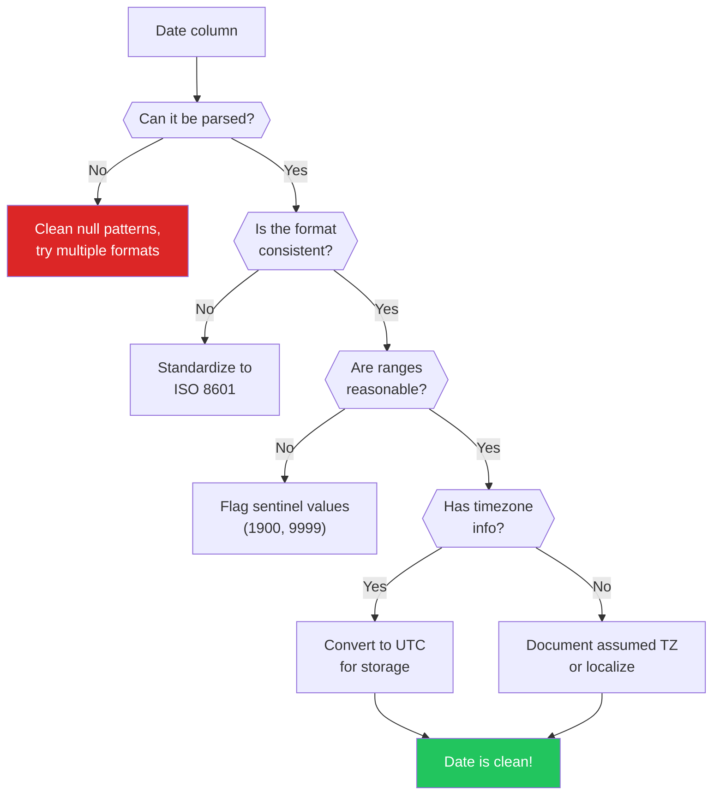

# Data Cleaning — Dates & Times

Datetime data is the most consistently broken data type in any real-world dataset. Dates arrive as strings in 47 different formats. Timezones are missing, wrong, or ambiguous. Daylight saving time creates hours that do not exist and hours that exist twice. "January 2nd" and "February 1st" look identical in MM/DD vs DD/MM format. And the edge cases — leap seconds, fiscal years, "the 30th of February" — will haunt your analysis if you do not catch them early.

---

## The Datetime Parsing Minefield

```python
# datetime_parsing.py — The many faces of a single date
import pandas as pd
import numpy as np
from datetime import datetime

# The same date in different formats
date_strings = [
    '2024-03-15',           # ISO 8601 (best format)
    '03/15/2024',           # US format (MM/DD/YYYY)
    '15/03/2024',           # European format (DD/MM/YYYY)
    '15-Mar-2024',          # Abbreviated month
    'March 15, 2024',       # Full month name
    '15 March 2024',        # European full
    '2024/03/15',           # Asian format
    '20240315',             # Compact
    '1710460800',           # Unix epoch (seconds)
    '1710460800000',        # Unix epoch (milliseconds)
    'Mar 15 2024 14:30:00', # With time
    '2024-03-15T14:30:00Z', # ISO 8601 with timezone
    '03-15-24',             # Two-digit year
]

print("=== DATE FORMAT CHAOS ===\n")
for ds in date_strings:
    try:
        parsed = pd.to_datetime(ds)
        print(f"  {ds:>30} -> {parsed}")
    except Exception as e:
        print(f"  {ds:>30} -> FAILED: {e}")

# The ambiguous date problem: is 01/02/2024 January 2 or February 1?
print(f"\n=== THE AMBIGUOUS DATE PROBLEM ===")
ambiguous = '01/02/2024'
us_parse = pd.to_datetime(ambiguous, format='%m/%d/%Y')
eu_parse = pd.to_datetime(ambiguous, format='%d/%m/%Y')
print(f"'{ambiguous}' parsed as US (MM/DD): {us_parse.date()}")
print(f"'{ambiguous}' parsed as EU (DD/MM): {eu_parse.date()}")
print("These are ONE MONTH APART. Always specify format explicitly!")

# Detecting which format a column uses
def detect_date_format(series):
    """Heuristic to detect MM/DD vs DD/MM format."""
    series = series.dropna().astype(str)
    # Extract the first number before the separator
    parts = series.str.extract(r'(\d{1,2})[/\-.](\d{1,2})[/\-.](\d{2,4})')
    if parts.empty:
        return "Unknown"

    first_nums = pd.to_numeric(parts[0], errors='coerce')
    second_nums = pd.to_numeric(parts[1], errors='coerce')

    # If first number ever exceeds 12, it must be DD
    if (first_nums > 12).any():
        return "DD/MM/YYYY"
    # If second number ever exceeds 12, it must be DD
    if (second_nums > 12).any():
        return "MM/DD/YYYY"
    # Both are <= 12 — truly ambiguous
    return "AMBIGUOUS (both <= 12)"

test_dates = pd.Series(['15/03/2024', '28/12/2024', '01/06/2024'])
print(f"\nDetected format for {test_dates.tolist()}: {detect_date_format(test_dates)}")

test_dates2 = pd.Series(['03/15/2024', '12/28/2024', '06/01/2024'])
print(f"Detected format for {test_dates2.tolist()}: {detect_date_format(test_dates2)}")

test_dates3 = pd.Series(['01/02/2024', '03/04/2024', '05/06/2024'])
print(f"Detected format for {test_dates3.tolist()}: {detect_date_format(test_dates3)}")
```

::: danger Always Specify Date Format Explicitly
`pd.to_datetime(df['date'])` with `infer_datetime_format=True` guesses the format and will silently swap month/day when the values are ambiguous. Always pass `format='%Y-%m-%d'` (or whichever format your data uses). The five seconds of typing saves hours of debugging.
:::

---

## Timezone Handling

```python
# timezone_handling.py — The timezone nightmare
import pandas as pd
from datetime import datetime
import pytz

# The same moment in time across timezones
utc_time = pd.Timestamp('2024-03-15 14:00:00', tz='UTC')

print("=== SAME MOMENT, DIFFERENT TIMEZONES ===")
timezones = ['US/Eastern', 'US/Pacific', 'Europe/London', 'Asia/Tokyo',
             'Australia/Sydney', 'Asia/Kolkata']
for tz in timezones:
    local = utc_time.tz_convert(tz)
    print(f"  {tz:>22}: {local}")

# The deadly mistake: naive vs aware datetimes
print(f"\n=== NAIVE vs AWARE DATETIMES ===")
naive = pd.Timestamp('2024-03-15 14:00:00')
aware = pd.Timestamp('2024-03-15 14:00:00', tz='UTC')
print(f"Naive (no tz): {naive} — is this UTC? Local? Unknown!")
print(f"Aware (UTC):   {aware}")

# Comparing naive with aware raises errors (good!)
try:
    result = naive == aware
except TypeError as e:
    print(f"Comparison raises: {type(e).__name__}")
    print("This is CORRECT behavior — you should NOT compare naive with aware")

# Converting between timezones
print(f"\n=== TIMEZONE CONVERSION ===")
# Step 1: Localize (assign timezone to naive datetime)
eastern = naive.tz_localize('US/Eastern')
print(f"Localized to Eastern: {eastern}")

# Step 2: Convert (change to different timezone)
utc = eastern.tz_convert('UTC')
print(f"Converted to UTC: {utc}")

pacific = eastern.tz_convert('US/Pacific')
print(f"Converted to Pacific: {pacific}")

# Common timezone pitfall: storing as strings loses timezone
print(f"\n=== PITFALL: String Conversion Loses Timezone ===")
ts = pd.Timestamp('2024-03-15 14:00:00', tz='US/Eastern')
as_string = str(ts)
restored = pd.Timestamp(as_string)
print(f"Original: {ts}")
print(f"As string: {as_string}")
print(f"Restored: {restored} (timezone info: {restored.tz})")
print("Store timestamps in UTC. Convert to local only for display.")
```

---

## Daylight Saving Time Pitfalls

```python
# dst_pitfalls.py — The hour that does not exist
import pandas as pd
import pytz

print("=== DAYLIGHT SAVING TIME PITFALLS ===\n")

# US clocks "spring forward" at 2:00 AM on second Sunday of March
# 2:00 AM becomes 3:00 AM — the hour 2:00-2:59 does NOT EXIST

# Pitfall 1: The non-existent hour
print("--- Pitfall 1: Non-existent Hour ---")
try:
    # March 10, 2024: US DST transition
    problematic = pd.Timestamp('2024-03-10 02:30:00')
    localized = problematic.tz_localize('US/Eastern')
    print(f"Localized: {localized}")
except pytz.exceptions.NonExistentTimeError:
    print("2:30 AM on March 10 DOES NOT EXIST in US/Eastern!")
    # Fix: use nonexistent parameter
    fixed = problematic.tz_localize('US/Eastern', nonexistent='shift_forward')
    print(f"Shifted forward: {fixed}")

# Pitfall 2: The ambiguous hour
print(f"\n--- Pitfall 2: Ambiguous Hour ---")
# November 3, 2024: clocks "fall back" at 2:00 AM
# 1:30 AM happens TWICE!
try:
    ambiguous = pd.Timestamp('2024-11-03 01:30:00')
    localized = ambiguous.tz_localize('US/Eastern')
    print(f"Localized: {localized}")
except pytz.exceptions.AmbiguousTimeError:
    print("1:30 AM on November 3 is AMBIGUOUS (happens twice)!")
    # Fix: specify which one
    first = ambiguous.tz_localize('US/Eastern', ambiguous=True)  # DST (first occurrence)
    print(f"First occurrence (DST): {first}")

# Pitfall 3: Duration calculations across DST
print(f"\n--- Pitfall 3: Duration Across DST ---")
before_dst = pd.Timestamp('2024-03-09 23:00:00', tz='US/Eastern')
after_dst = pd.Timestamp('2024-03-10 05:00:00', tz='US/Eastern')

wall_clock_diff = 6  # 11 PM to 5 AM looks like 6 hours
actual_diff = (after_dst - before_dst).total_seconds() / 3600

print(f"Wall clock difference: {wall_clock_diff} hours")
print(f"Actual difference: {actual_diff} hours")
print(f"The 'missing' hour from DST means only 5 real hours elapsed!")

# Best practice: always compute durations in UTC
before_utc = before_dst.tz_convert('UTC')
after_utc = after_dst.tz_convert('UTC')
diff_utc = (after_utc - before_utc).total_seconds() / 3600
print(f"UTC-based difference: {diff_utc} hours (correct!)")
```

::: warning The DST Rule
Always store timestamps in UTC. Convert to local time only for display. If you compute durations in local time, DST transitions will give you wrong answers. One day per year has 23 hours, another has 25 hours.
:::

---

## Epoch Timestamps

```python
# epoch_timestamps.py — Working with Unix timestamps
import pandas as pd
import numpy as np

# Common epoch formats
epochs = {
    'seconds':      1710460800,
    'milliseconds': 1710460800000,
    'microseconds': 1710460800000000,
    'nanoseconds':  1710460800000000000,
}

print("=== EPOCH TIMESTAMP CONVERSION ===\n")
for unit, value in epochs.items():
    try:
        ts = pd.to_datetime(value, unit=unit[:1])  # 's', 'ms', 'us', 'ns'
        print(f"  {value:>25} ({unit:>12}) -> {ts}")
    except Exception as e:
        print(f"  {value:>25} ({unit:>12}) -> Error: {e}")

# How to detect which epoch unit you have
def detect_epoch_unit(value):
    """Guess the epoch unit based on digit count."""
    n_digits = len(str(int(abs(value))))
    if n_digits <= 10:
        return 'seconds'
    elif n_digits <= 13:
        return 'milliseconds'
    elif n_digits <= 16:
        return 'microseconds'
    else:
        return 'nanoseconds'

test_values = [1710460800, 1710460800000, 1710460800000000]
for v in test_values:
    unit = detect_epoch_unit(v)
    ts = pd.to_datetime(v, unit=unit[0])
    print(f"\n  {v} -> detected as {unit} -> {ts}")

# Pitfall: Excel serial dates (different epoch!)
print(f"\n=== EXCEL SERIAL DATES ===")
print("Excel epoch starts at 1900-01-01 (or 1904-01-01 on Mac)")
print("Excel serial date 45000 ≈ 2023-03-01")
excel_date = 45000
pandas_date = pd.Timestamp('1899-12-30') + pd.Timedelta(days=excel_date)
print(f"Excel serial {excel_date} -> {pandas_date.date()}")
```

---

## Fiscal Years and Business Days

```python
# fiscal_business.py — Non-calendar time concepts
import pandas as pd
import numpy as np

# Fiscal years (vary by company)
print("=== FISCAL YEARS ===\n")

def get_fiscal_quarter(date, fiscal_start_month=4):
    """Calculate fiscal quarter. Default: April start (like many corporations)."""
    month = date.month
    # Shift months so fiscal year start = month 1
    adjusted = (month - fiscal_start_month) % 12
    quarter = adjusted // 3 + 1
    fiscal_year = date.year if month >= fiscal_start_month else date.year - 1
    return f"FY{fiscal_year} Q{quarter}"

dates = pd.date_range('2024-01-01', periods=12, freq='MS')
for d in dates:
    cal_q = f"Q{(d.month - 1) // 3 + 1}"
    fiscal_q = get_fiscal_quarter(d)
    print(f"  {d.strftime('%Y-%m')}: Calendar {cal_q}, Fiscal {fiscal_q}")

# Business days
print(f"\n=== BUSINESS DAYS ===")
start = pd.Timestamp('2024-03-08')  # Friday
end = pd.Timestamp('2024-03-15')    # Next Friday

calendar_days = (end - start).days
business_days = np.busday_count(
    start.date(), end.date()
)
print(f"From {start.date()} to {end.date()}:")
print(f"  Calendar days: {calendar_days}")
print(f"  Business days: {business_days}")

# Custom holidays
from pandas.tseries.holiday import USFederalHolidayCalendar

cal = USFederalHolidayCalendar()
holidays = cal.holidays(start='2024-01-01', end='2024-12-31')
print(f"\nUS Federal holidays in 2024: {len(holidays)}")
for h in holidays[:5]:
    print(f"  {h.date()}")

# Business day offset
bday = pd.offsets.BusinessDay(5)
print(f"\n5 business days after 2024-03-08 (Friday): {start + bday}")
# Should be the next Friday (skips weekends)

# Month-end business days
print(f"\nMonth-end business days 2024:")
month_ends = pd.date_range('2024-01-01', periods=6, freq='BME')
for me in month_ends:
    print(f"  {me.date()} ({me.strftime('%A')})")
```

---

## Handling Unknown and Invalid Dates

```python
# unknown_dates.py — The messy reality of date fields
import pandas as pd
import numpy as np

# Real-world date column with every kind of problem
dates_raw = pd.Series([
    '2024-03-15',          # Good
    '03/15/2024',          # Different format
    'March 15, 2024',      # Text format
    'unknown',             # Unknown
    'TBD',                 # To be determined
    'N/A',                 # Not available
    '',                    # Empty string
    None,                  # Null
    'not applicable',      # Text null
    '0000-00-00',          # Database null date
    '1900-01-01',          # Default/sentinel date
    '9999-12-31',          # Far future sentinel
    '2024-02-30',          # Invalid (Feb 30 does not exist)
    '2024-13-01',          # Invalid month
    '31/02/2024',          # Invalid (Feb 31)
    '2024-03-15 25:00:00', # Invalid hour
])

print("=== HANDLING PROBLEMATIC DATES ===\n")

# Step 1: Identify known null patterns
null_patterns = {'unknown', 'tbd', 'n/a', 'not applicable', '', 'none',
                 '0000-00-00', 'null', 'na', '-'}

def clean_date(value):
    """Clean a single date value with full error handling."""
    if value is None or pd.isna(value):
        return pd.NaT

    value_str = str(value).strip().lower()

    if value_str in null_patterns:
        return pd.NaT

    # Try parsing
    try:
        parsed = pd.to_datetime(value, errors='raise')

        # Check for sentinel values
        if parsed.year < 1900 or parsed.year > 2100:
            return pd.NaT

        return parsed
    except (ValueError, OverflowError):
        return pd.NaT

dates_clean = dates_raw.apply(clean_date)

print(f"{'Original':>25} -> {'Cleaned':>25} | Status")
print("-" * 75)
for raw, clean in zip(dates_raw, dates_clean):
    raw_str = str(raw) if raw is not None else 'None'
    clean_str = str(clean) if pd.notna(clean) else 'NaT'
    status = 'OK' if pd.notna(clean) else 'NULL'
    print(f"{raw_str:>25} -> {clean_str:>25} | {status}")

parsed_count = dates_clean.notna().sum()
print(f"\nParsed: {parsed_count}/{len(dates_raw)} ({parsed_count/len(dates_raw):.0%})")
print(f"Failed: {dates_clean.isna().sum()}/{len(dates_raw)}")
```

---

## Date Validation Checklist



| Check | What to Look For | Action |
|-------|-----------------|--------|
| Format consistency | Mixed MM/DD and DD/MM | Standardize to ISO 8601 |
| Null patterns | "unknown", "TBD", "N/A", "0000-00-00" | Map to `NaT` |
| Sentinel values | 1900-01-01, 9999-12-31, 1970-01-01 | Replace with `NaT` or document meaning |
| Timezone info | Missing or inconsistent | Localize to known TZ, store as UTC |
| Future dates | Dates after today in historical data | Flag for review |
| Impossible dates | Feb 30, month 13, hour 25 | Parse with `errors='coerce'` |
| Chronological order | End date before start date | Flag and investigate |

---

## Best Practices Summary

```python
# best_practices.py — The definitive date handling approach
import pandas as pd

print("=== DATETIME BEST PRACTICES ===\n")

practices = [
    ("Store in UTC", "Always convert to UTC before saving. Convert to local only for display."),
    ("Use ISO 8601", "YYYY-MM-DD format is unambiguous and sorts correctly as strings."),
    ("Specify format", "pd.to_datetime(s, format='%Y-%m-%d') is 10x faster and avoids ambiguity."),
    ("Use pandas Timestamp", "Not Python datetime. Pandas handles NaT, vectorization, and timezones better."),
    ("Keep timezone-aware", "Naive datetimes are bugs waiting to happen when you cross timezones."),
    ("Validate ranges", "Dates before 1900 or after 2100 are almost certainly errors."),
    ("Document assumptions", "If the data has no timezone, document what you assumed (UTC? Local?)."),
    ("Test DST edges", "Always test with dates around March and November transitions."),
    ("Use business day logic", "Calendar days and business days differ — use the right one for your metric."),
    ("Separate date from time", "Sometimes you need date-only analysis. Use .dt.date or .dt.normalize()."),
]

for i, (title, detail) in enumerate(practices, 1):
    print(f"  {i:2d}. {title}")
    print(f"      {detail}\n")
```

---

## Summary

| Problem | Solution |
|---------|----------|
| Mixed date formats | Detect format, then parse with explicit `format=` |
| Ambiguous MM/DD vs DD/MM | Check if any values > 12 in first position |
| Missing timezone | Localize to known TZ, convert to UTC |
| DST gaps | Use `nonexistent='shift_forward'` in `tz_localize` |
| Epoch timestamps | Detect unit by digit count, convert with `pd.to_datetime(v, unit=)` |
| Unknown/null dates | Map sentinel values and text nulls to `NaT` |
| Business vs calendar days | Use `np.busday_count()` or `pd.offsets.BusinessDay()` |
| Fiscal years | Write a mapping function for your company's fiscal calendar |

---

## What's Next

| Page | What You'll Learn |
|------|------------------|
| [Data Cleaning — Categories](/eda/data-cleaning-categories) | Standardizing messy categorical data |
| [Data Quality Validation](/eda/data-quality-validation) | Pandera, Great Expectations |
| [Data Cleaning — Edge Cases](/eda/data-cleaning-edge-cases) | Floating point, encoding issues |
