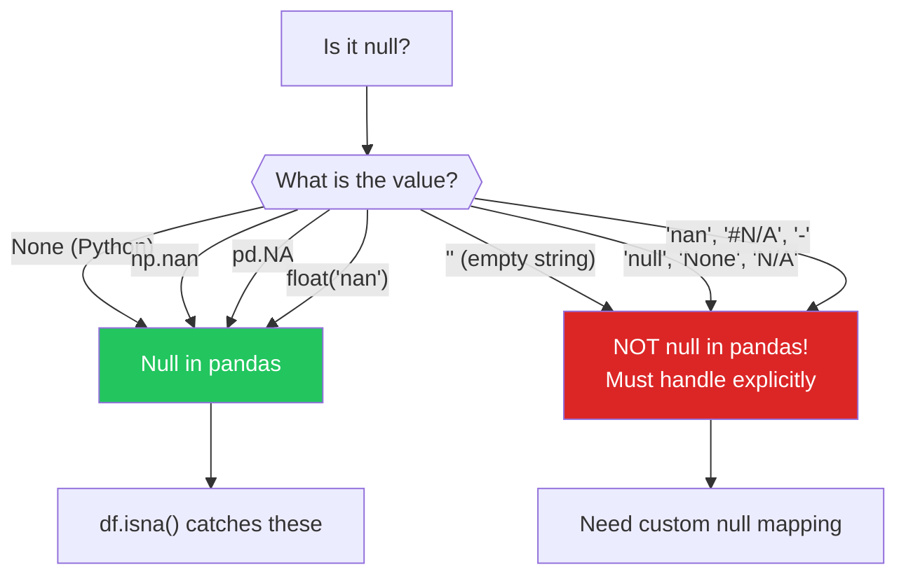

# Data Cleaning — Edge Cases

These are the problems that do not appear in tutorials. They lurk in production data, in CSV exports from legacy systems, in API responses from third parties, and in databases that have been running for 15 years. Each one can silently corrupt your analysis if you do not know it exists. This page covers the 20 hardest data cleaning problems with concrete Python solutions.

---

## Problem 1: NaN vs None vs "null" vs Empty String

```python
# nan_vs_none.py — The five faces of missing data in Python
import pandas as pd
import numpy as np

# All the ways "missing" appears in real data
data = {
    'col_a': [1, None, np.nan, float('nan'), pd.NA],
    'col_b': ['hello', '', None, 'null', 'None'],
    'col_c': [True, False, None, np.nan, pd.NA],
}

# pandas handles these differently
df = pd.DataFrame(data)
print("=== NaN vs None vs 'null' vs Empty ===\n")
print(df)
print(f"\nTypes:\n{df.dtypes}")

print(f"\n--- col_a (numeric) ---")
print(f"isnull: {df['col_a'].isnull().tolist()}")
# None and np.nan both become NaN in numeric columns

print(f"\n--- col_b (string) ---")
print(f"isnull: {df['col_b'].isnull().tolist()}")
# '' (empty string) is NOT null! Neither is 'null' or 'None'

print(f"\n--- Equality traps ---")
print(f"NaN == NaN: {np.nan == np.nan}")          # False!
print(f"None == None: {None == None}")              # True
print(f"pd.isna(np.nan): {pd.isna(np.nan)}")      # True
print(f"pd.isna(None): {pd.isna(None)}")           # True
print(f"pd.isna(''): {pd.isna('')}")               # False!
print(f"pd.isna('null'): {pd.isna('null')}")       # False!

# The comprehensive null cleaner
def comprehensive_null_clean(series):
    """Treat all null-like values as actual null."""
    null_values = {'', 'null', 'NULL', 'none', 'None', 'NONE',
                   'na', 'NA', 'N/A', 'n/a', '#N/A', '#NA',
                   'nan', 'NaN', 'NAN', '-', '--', '.', 'missing',
                   'undefined', 'UNDEFINED'}

    cleaned = series.copy()
    if cleaned.dtype == 'object':
        mask = cleaned.str.strip().isin(null_values) | cleaned.isna()
        cleaned[mask] = np.nan
    return cleaned

print(f"\n--- After comprehensive cleaning ---")
df['col_b_clean'] = comprehensive_null_clean(df['col_b'])
print(f"col_b isnull: {df['col_b_clean'].isnull().tolist()}")
```



---

## Problem 2: Floating Point Comparison

```python
# floating_point.py — IEEE 754 strikes again
import numpy as np
import pandas as pd

print("=== FLOATING POINT TRAPS ===\n")

# Trap 1: Equality comparison fails
a = 0.1 + 0.2
b = 0.3
print(f"0.1 + 0.2 == 0.3: {a == b}")  # False!
print(f"0.1 + 0.2 = {a:.20f}")
print(f"0.3       = {b:.20f}")
print(f"Difference: {abs(a - b):.20e}")

# Fix: use np.isclose() or math.isclose()
print(f"\nnp.isclose(0.1 + 0.2, 0.3): {np.isclose(a, b)}")

# Trap 2: Cumulative errors in aggregation
values = [0.1] * 10
print(f"\nsum([0.1] * 10) == 1.0: {sum(values) == 1.0}")
print(f"sum([0.1] * 10) = {sum(values):.20f}")
print(f"math.fsum([0.1] * 10) == 1.0: {__import__('math').fsum(values) == 1.0}")

# Trap 3: Groupby fails with floats
df = pd.DataFrame({
    'price': [0.1 + 0.2, 0.3, 0.30, 0.300, 0.3 + 1e-16],
    'item': ['A', 'B', 'C', 'D', 'E'],
})
print(f"\n--- Groupby with floats ---")
print(f"Unique prices: {df['price'].unique()}")
print(f"Number of groups: {df['price'].nunique()}")
# These SHOULD all be the same group but float precision makes them different!

# Fix: round before groupby
df['price_rounded'] = df['price'].round(10)
print(f"After rounding: {df['price_rounded'].nunique()} groups")

# Trap 4: Merge fails on float keys
df1 = pd.DataFrame({'key': [0.1 + 0.2], 'val1': ['A']})
df2 = pd.DataFrame({'key': [0.3], 'val2': ['B']})
merged = df1.merge(df2, on='key')
print(f"\n--- Merge on float keys ---")
print(f"Rows after merge: {len(merged)} (expected 1, got {len(merged)}!)")

# Fix: round both keys before merge
df1['key'] = df1['key'].round(10)
df2['key'] = df2['key'].round(10)
merged_fixed = df1.merge(df2, on='key')
print(f"After rounding: {len(merged_fixed)} rows")

# Trap 5: Money should NEVER be stored as float
print(f"\n--- MONEY AND FLOATS ---")
price = 19.99
tax_rate = 0.0825
tax = price * tax_rate
total = price + tax
print(f"Price: ${price}")
print(f"Tax (8.25%): ${tax:.20f}")
print(f"Total: ${total:.2f}")
print(f"Fix: Use integers (cents) or Decimal for financial calculations")
from decimal import Decimal
price_d = Decimal('19.99')
tax_d = price_d * Decimal('0.0825')
total_d = price_d + tax_d
print(f"Decimal total: ${total_d:.2f}")
```

::: danger Never Use Floats for Money
`0.1 + 0.2 != 0.3` in IEEE 754 floating point. For financial calculations, use `decimal.Decimal` or store amounts as integers (cents). A bank that rounds wrong by $0.01 on a million transactions loses $10,000.
:::

---

## Problem 3: Character Encoding Issues

```python
# encoding_issues.py — When bytes are not what you think
import pandas as pd

print("=== CHARACTER ENCODING ISSUES ===\n")

# The problem: same text, different byte representations
text = "Caf\u00e9 M\u00fcnchen"
print(f"Original text: {text}")

# UTF-8 encoding (modern standard)
utf8_bytes = text.encode('utf-8')
print(f"UTF-8 bytes: {utf8_bytes}")

# Latin-1 encoding (legacy European)
latin1_bytes = text.encode('latin-1')
print(f"Latin-1 bytes: {latin1_bytes}")

# The corruption: reading UTF-8 bytes as Latin-1
corrupted = utf8_bytes.decode('latin-1')
print(f"\nCorrupted (UTF-8 read as Latin-1): {corrupted}")

# The fix: read with correct encoding
fixed = utf8_bytes.decode('utf-8')
print(f"Fixed (UTF-8 read as UTF-8): {fixed}")

# How to detect encoding
print(f"\n--- Encoding Detection ---")
# pip install chardet
import chardet

for enc_name, raw_bytes in [('UTF-8', utf8_bytes), ('Latin-1', latin1_bytes)]:
    detected = chardet.detect(raw_bytes)
    print(f"  {enc_name} bytes detected as: {detected}")

# Common encoding issues and fixes
print(f"\n--- Common Encoding Issues ---")
issues = [
    {
        'symptom': '\u00c3\u00a9 instead of \u00e9',
        'cause': 'UTF-8 decoded as Latin-1',
        'fix': "text.encode('latin-1').decode('utf-8')",
    },
    {
        'symptom': '\ufffd (replacement character)',
        'cause': 'Invalid bytes in the encoding',
        'fix': "open(f, encoding='utf-8', errors='replace')",
    },
    {
        'symptom': 'BOM character (\ufeff) at file start',
        'cause': 'UTF-8 with BOM (common in Excel exports)',
        'fix': "pd.read_csv(f, encoding='utf-8-sig')",
    },
    {
        'symptom': 'Chinese/Japanese characters appear as ?????',
        'cause': 'CJK text read with Western encoding',
        'fix': "Try encoding='utf-8' or encoding='gb2312'",
    },
]

for issue in issues:
    print(f"\n  Symptom: {issue['symptom']}")
    print(f"  Cause: {issue['cause']}")
    print(f"  Fix: {issue['fix']}")

# Robust CSV reading
print(f"\n--- Robust CSV Reading ---")
def read_csv_robust(filepath):
    """Try multiple encodings until one works."""
    encodings = ['utf-8', 'utf-8-sig', 'latin-1', 'cp1252', 'iso-8859-1']

    for enc in encodings:
        try:
            df = pd.read_csv(filepath, encoding=enc, nrows=5)
            print(f"  Success with encoding: {enc}")
            return pd.read_csv(filepath, encoding=enc)
        except UnicodeDecodeError:
            continue
        except Exception as e:
            print(f"  Error with {enc}: {e}")
            continue

    # Last resort: detect encoding
    import chardet
    with open(filepath, 'rb') as f:
        raw = f.read(10000)
    detected = chardet.detect(raw)
    return pd.read_csv(filepath, encoding=detected['encoding'])

print("Usage: df = read_csv_robust('messy_file.csv')")
```

---

## Problem 4: Mixed Types in a Column

```python
# mixed_types_column.py — Numbers mixed with strings
import pandas as pd
import numpy as np

# This happens ALL THE TIME in real data
data = {
    'age': ['25', 30, '28', 'unknown', '35', None, 'thirty', 42, '  33 ', 'N/A'],
    'amount': ['$1,234.56', 1500, '$2,000.00', 'free', 0, None, '999', 'varies', '$500', 'TBD'],
    'status': [1, 'active', True, 'ACTIVE', 0, 'inactive', 'true', False, 1, ''],
}
df = pd.DataFrame(data)

print("=== MIXED TYPE HANDLING ===\n")
print(df)
print(f"\nTypes: {df.dtypes.to_dict()}")

# Solution: type-aware cleaning functions
def to_numeric_robust(series):
    """Convert a mixed-type series to numeric, handling common patterns."""
    result = pd.Series(index=series.index, dtype='float64')

    for idx, val in series.items():
        if pd.isna(val):
            result[idx] = np.nan
            continue

        val_str = str(val).strip().lower()

        # Known null values
        if val_str in ('', 'unknown', 'n/a', 'na', 'tbd', 'varies', 'none', 'null'):
            result[idx] = np.nan
            continue

        # Remove currency symbols and commas
        cleaned = val_str.replace('$', '').replace(',', '').replace('\u00a3', '').replace('\u20ac', '')

        # Handle special values
        if cleaned == 'free':
            result[idx] = 0.0
            continue

        # Text numbers
        text_nums = {'zero': 0, 'one': 1, 'two': 2, 'three': 3, 'four': 4,
                     'five': 5, 'ten': 10, 'twenty': 20, 'thirty': 30,
                     'forty': 40, 'fifty': 50}
        if cleaned in text_nums:
            result[idx] = float(text_nums[cleaned])
            continue

        try:
            result[idx] = float(cleaned)
        except ValueError:
            result[idx] = np.nan

    return result

def to_boolean_robust(series):
    """Convert mixed-type series to boolean."""
    true_values = {'1', 'true', 'yes', 'y', 'active', 'on', 'enabled', '1.0'}
    false_values = {'0', 'false', 'no', 'n', 'inactive', 'off', 'disabled', '0.0', ''}

    result = pd.Series(index=series.index, dtype='object')
    for idx, val in series.items():
        if pd.isna(val):
            result[idx] = np.nan
        else:
            val_str = str(val).strip().lower()
            if val_str in true_values:
                result[idx] = True
            elif val_str in false_values:
                result[idx] = False
            else:
                result[idx] = np.nan

    return result.astype('boolean')

df['age_clean'] = to_numeric_robust(df['age'])
df['amount_clean'] = to_numeric_robust(df['amount'])
df['status_clean'] = to_boolean_robust(df['status'])

print(f"\n=== AFTER CLEANING ===")
print(df[['age', 'age_clean', 'amount', 'amount_clean', 'status', 'status_clean']])

parsed_stats = {
    'age': df['age_clean'].notna().sum(),
    'amount': df['amount_clean'].notna().sum(),
    'status': df['status_clean'].notna().sum(),
}
print(f"\nParse success: {parsed_stats}")
```

---

## Problem 5: Nested JSON Flattening

```python
# nested_json.py — Real-world API response flattening
import pandas as pd
import json
import numpy as np

# Deeply nested JSON (typical API response)
api_response = [
    {
        "user": {
            "id": 1,
            "profile": {
                "name": "Alice",
                "preferences": {
                    "theme": "dark",
                    "notifications": {"email": True, "sms": False}
                }
            }
        },
        "orders": [
            {"id": 101, "items": [{"sku": "A1", "qty": 2}, {"sku": "B2", "qty": 1}]},
            {"id": 102, "items": [{"sku": "C3", "qty": 5}]}
        ],
        "tags": ["premium", "early_adopter"]
    },
    {
        "user": {
            "id": 2,
            "profile": {
                "name": "Bob",
                "preferences": {
                    "theme": "light",
                    "notifications": {"email": False, "sms": True}
                }
            }
        },
        "orders": [
            {"id": 201, "items": [{"sku": "A1", "qty": 1}]}
        ],
        "tags": ["basic"]
    }
]

print("=== NESTED JSON FLATTENING ===\n")

# Level 1: Basic json_normalize (handles nested dicts)
df_basic = pd.json_normalize(api_response)
print(f"Basic normalize columns:")
for col in df_basic.columns:
    print(f"  {col}")

# Level 2: Flatten orders (list of dicts)
df_orders = pd.json_normalize(
    api_response,
    record_path='orders',
    meta=[['user', 'id'], ['user', 'profile', 'name']],
    meta_prefix='user_'
)
print(f"\nOrders flattened:")
print(df_orders)

# Level 3: Flatten items within orders (nested list)
df_items = pd.json_normalize(
    api_response,
    record_path=['orders', 'items'],
    meta=[['user', 'id'], ['user', 'profile', 'name']],
    meta_prefix='user_'
)
print(f"\nItems flattened:")
print(df_items)

# Level 4: Handle tags (list of strings -> columns or exploded rows)
# Strategy A: Explode to rows
df_basic_with_tags = pd.json_normalize(api_response)
df_exploded = df_basic_with_tags.explode('tags')
print(f"\nTags exploded to rows:")
print(df_exploded[['user.id', 'user.profile.name', 'tags']])

# Strategy B: Convert to binary columns (one-hot)
all_tags = set()
for row in api_response:
    all_tags.update(row.get('tags', []))

for tag in sorted(all_tags):
    df_basic[f'tag_{tag}'] = df_basic['tags'].apply(lambda x: tag in x)
print(f"\nTags as binary columns:")
tag_cols = [c for c in df_basic.columns if c.startswith('tag_')]
print(df_basic[['user.id'] + tag_cols])

# Recursive flattener for arbitrary depth
def flatten_json(nested, prefix='', sep='.'):
    """Recursively flatten a nested dict/JSON."""
    flat = {}
    for key, value in nested.items():
        new_key = f"{prefix}{sep}{key}" if prefix else key
        if isinstance(value, dict):
            flat.update(flatten_json(value, new_key, sep))
        elif isinstance(value, list):
            if len(value) > 0 and isinstance(value[0], dict):
                flat[new_key] = json.dumps(value)  # Store as JSON string
            else:
                flat[new_key] = value  # Keep as list
        else:
            flat[new_key] = value
    return flat

print(f"\nRecursive flattening of first record:")
flat = flatten_json(api_response[0])
for k, v in flat.items():
    print(f"  {k}: {v}")
```

---

## Problem 6: Unicode Normalization

```python
# unicode_normalization.py — When identical-looking strings are different
import unicodedata

print("=== UNICODE NORMALIZATION ===\n")

# These look identical but are different bytes!
str_a = 'caf\u00e9'                     # Single code point: e with acute
str_b = 'cafe\u0301'                     # Two code points: e + combining acute

print(f"String A: {str_a} (len={len(str_a)})")
print(f"String B: {str_b} (len={len(str_b)})")
print(f"A == B: {str_a == str_b}")  # False!
print(f"They LOOK identical but are different at the byte level!")

# Fix: normalize to a consistent form
nfc_a = unicodedata.normalize('NFC', str_a)
nfc_b = unicodedata.normalize('NFC', str_b)
print(f"\nAfter NFC normalization:")
print(f"A: {nfc_a} (len={len(nfc_a)})")
print(f"B: {nfc_b} (len={len(nfc_b)})")
print(f"A == B: {nfc_a == nfc_b}")  # True!

# More tricky cases
print(f"\n--- Tricky Unicode Cases ---")
cases = [
    ('\u00bc', '1/4', 'Fraction character vs text'),
    ('\u2019', "'", 'Smart quote vs ASCII quote'),
    ('\u2013', '-', 'En dash vs hyphen'),
    ('\u00a0', ' ', 'Non-breaking space vs regular space'),
    ('\uff21', 'A', 'Fullwidth A vs regular A'),
    ('\u200b', '', 'Zero-width space (invisible!)'),
]

for char, expected, description in cases:
    print(f"  '{char}' vs '{expected}': looks same, == {char == expected} ({description})")

# Zero-width space: the invisible character that breaks everything
import pandas as pd
df = pd.DataFrame({
    'name': ['Alice', 'Alice\u200b', 'Bob', 'Bob\u200b\u200b'],
})
print(f"\nDataFrame with zero-width spaces:")
print(f"Unique names: {df['name'].nunique()} (should be 2, got {df['name'].nunique()})")

# Fix: strip all zero-width characters
df['name_clean'] = df['name'].str.replace(r'[\u200b\u200c\u200d\ufeff]', '', regex=True)
print(f"After cleaning: {df['name_clean'].nunique()} unique names")
```

---

## Problems 7-20: Quick Reference

```python
# remaining_edge_cases.py — Quick solutions for each
import pandas as pd
import numpy as np

print("=== 14 MORE EDGE CASES ===\n")

# Problem 7: Integer overflow
print("--- 7. Integer Overflow ---")
big_num = 2**63
print(f"2^63 = {big_num}")
print(f"Fits in int64? {big_num <= np.iinfo(np.int64).max}")
print(f"Fix: Use int64 for IDs, float64 for very large numbers, or Python int\n")

# Problem 8: Timezone-naive merge with timezone-aware
print("--- 8. Timezone-Naive + Aware Merge ---")
df1 = pd.DataFrame({'dt': pd.to_datetime(['2024-01-01']), 'val': [1]})
df2 = pd.DataFrame({'dt': pd.to_datetime(['2024-01-01']).tz_localize('UTC'), 'val': [2]})
print("Cannot merge: one is tz-naive, other is tz-aware")
print("Fix: df1['dt'] = df1['dt'].dt.tz_localize('UTC')\n")

# Problem 9: CSV with inconsistent quoting
print("--- 9. CSV Inconsistent Quoting ---")
print('Line 1: "John","Smith"   Line 2: Jane,Doe')
print("Fix: pd.read_csv(f, quoting=csv.QUOTE_MINIMAL)\n")

# Problem 10: Column names with special characters
print("--- 10. Column Names with Spaces/Special Chars ---")
df = pd.DataFrame({'First Name': [1], 'Last.Name': [2], 'age (years)': [3]})
print(f"Columns: {df.columns.tolist()}")
df.columns = df.columns.str.lower().str.replace(r'[^a-z0-9]', '_', regex=True)
print(f"Fixed: {df.columns.tolist()}\n")

# Problem 11: Inf values
print("--- 11. Infinite Values ---")
arr = np.array([1, 2, np.inf, -np.inf, 5])
print(f"Mean with inf: {arr.mean()}")  # inf!
print(f"np.isinf(arr): {np.isinf(arr).tolist()}")
print("Fix: df.replace([np.inf, -np.inf], np.nan)\n")

# Problem 12: Category dtype gotchas
print("--- 12. Category Dtype Gotchas ---")
s = pd.Categorical(['A', 'B', 'C'], categories=['A', 'B', 'C', 'D'])
print(f"Values: {s.tolist()}, Categories: {s.categories.tolist()}")
print("'D' is a valid category even though no data has it!")
print("Fix: cat.remove_unused_categories()\n")

# Problem 13: Chained indexing
print("--- 13. Chained Indexing (SettingWithCopyWarning) ---")
df = pd.DataFrame({'a': [1, 2, 3], 'b': [4, 5, 6]})
print("BAD: df[df['a'] > 1]['b'] = 99  (may not work!)")
print("GOOD: df.loc[df['a'] > 1, 'b'] = 99\n")

# Problem 14: Memory explosion with string columns
print("--- 14. Memory: object dtype strings ---")
n = 100_000
df = pd.DataFrame({'status': np.random.choice(['active', 'inactive'], n)})
mem_obj = df.memory_usage(deep=True).sum() / 1024
df['status_cat'] = df['status'].astype('category')
mem_cat = df[['status_cat']].memory_usage(deep=True).sum() / 1024
print(f"As object: {mem_obj:.0f} KB")
print(f"As category: {mem_cat:.0f} KB")
print(f"Savings: {(1 - mem_cat/mem_obj)*100:.0f}%\n")

# Problem 15: Merge producing unexpected duplicates
print("--- 15. Merge Key Duplicates ---")
left = pd.DataFrame({'key': ['A', 'A', 'B'], 'val': [1, 2, 3]})
right = pd.DataFrame({'key': ['A', 'A', 'B'], 'data': [10, 20, 30]})
merged = left.merge(right, on='key')
print(f"Left: {len(left)} rows, Right: {len(right)} rows")
print(f"Merged: {len(merged)} rows (many-to-many explosion!)")
print("Fix: Ensure keys are unique in at least one table\n")

# Problem 16: Scientific notation in CSV
print("--- 16. Scientific Notation ---")
print("Excel exports '1234567890' as '1.23E+09' in CSV")
print("Fix: pd.read_csv(f, float_precision='round_trip')")
print("Or: pd.read_csv(f, dtype={'id_col': str})\n")

# Problem 17: Off-by-one in date ranges
print("--- 17. Inclusive vs Exclusive Date Ranges ---")
start, end = pd.Timestamp('2024-01-01'), pd.Timestamp('2024-01-31')
between_result = pd.date_range('2024-01-01', periods=31, freq='D')
print(f"pd.date_range includes endpoints: {len(between_result)} days")
print("df[df['date'].between(start, end)] includes BOTH endpoints")
print("SQL: WHERE date BETWEEN '2024-01-01' AND '2024-01-31' also includes both\n")

# Problem 18: Multiline strings in CSV
print("--- 18. Multiline Strings in CSV ---")
print('A CSV field with \\n inside quotes breaks naive line counting')
print("Fix: Always use pd.read_csv(), never manual line splitting\n")

# Problem 19: Leading/trailing whitespace in keys
print("--- 19. Whitespace in Join Keys ---")
df1 = pd.DataFrame({'key': ['ABC', 'DEF'], 'val': [1, 2]})
df2 = pd.DataFrame({'key': [' ABC', 'DEF '], 'val': [3, 4]})
merged = df1.merge(df2, on='key', how='inner')
print(f"Merge result: {len(merged)} rows (expected 2, got {len(merged)})")
print("Fix: Strip both sides before merge\n")

# Problem 20: Boolean column with nulls
print("--- 20. Boolean + Null ---")
s = pd.Series([True, False, None, True])
print(f"dtype: {s.dtype}")  # object, not bool!
print(f"sum: {s.sum()}")    # Might not work as expected
s_nullable = s.astype('boolean')
print(f"Nullable boolean dtype: {s_nullable.dtype}")
print(f"sum (nullable): {s_nullable.sum()}")
```

---

## Edge Case Decision Matrix

| Problem | Detection | Risk Level | Fix |
|---------|-----------|-----------|-----|
| NaN vs None vs "null" | `df.dtypes`, manual inspection | High | Comprehensive null mapping |
| Floating point | `a == b` fails unexpectedly | Medium | `np.isclose()`, round before groupby |
| Encoding | Garbled characters | High | `chardet.detect()`, try encodings |
| Mixed types | `df.dtypes` shows `object` for numeric | High | Custom type-aware parser |
| Nested JSON | API response inspection | Medium | `json_normalize()` + `explode()` |
| Unicode normalization | String equality fails visually | Medium | `unicodedata.normalize('NFC')` |
| Integer overflow | Values > 2^63 | Low | Use Python int or float64 |
| Inf values | `df.describe()` shows inf | Medium | Replace with NaN |
| Memory explosion | `df.memory_usage(deep=True)` | Medium | Use category dtype |
| Merge duplication | Post-merge row count check | High | Validate key uniqueness first |

---

## The Universal Pre-Cleaning Checklist

```python
# universal_checklist.py — Run BEFORE any analysis
import pandas as pd
import numpy as np

def pre_cleaning_check(df, name="Dataset"):
    """Universal pre-cleaning checklist for any dataset."""
    print(f"\n{'=' * 50}")
    print(f"PRE-CLEANING CHECK: {name}")
    print(f"{'=' * 50}\n")

    issues = []

    # 1. Check for inf values
    numeric_cols = df.select_dtypes(include='number').columns
    for col in numeric_cols:
        n_inf = np.isinf(df[col]).sum()
        if n_inf > 0:
            issues.append(f"INF: {col} has {n_inf} infinite values")

    # 2. Check for hidden nulls in object columns
    for col in df.select_dtypes(include='object').columns:
        null_strings = df[col].isin(['', 'null', 'NULL', 'None', 'N/A', 'na', '-'])
        n_hidden = null_strings.sum()
        if n_hidden > 0:
            issues.append(f"HIDDEN NULL: {col} has {n_hidden} null-like strings")

    # 3. Check for whitespace in string columns
    for col in df.select_dtypes(include='object').columns:
        has_leading = (df[col].str.startswith(' ') | df[col].str.endswith(' ')).any()
        if has_leading:
            issues.append(f"WHITESPACE: {col} has leading/trailing whitespace")

    # 4. Check for duplicate columns (same values)
    for i, col1 in enumerate(df.columns):
        for col2 in df.columns[i+1:]:
            if df[col1].equals(df[col2]):
                issues.append(f"DUPLICATE COL: {col1} and {col2} are identical")

    # 5. Check for constant columns
    for col in df.columns:
        if df[col].nunique() <= 1:
            issues.append(f"CONSTANT: {col} has {df[col].nunique()} unique value(s)")

    # 6. Check memory usage
    mem_mb = df.memory_usage(deep=True).sum() / 1024**2
    if mem_mb > 100:
        issues.append(f"MEMORY: {mem_mb:.0f} MB — consider optimizing dtypes")

    if not issues:
        print("  No issues found!")
    else:
        for issue in issues:
            print(f"  [{issue.split(':')[0]:>12}] {issue}")

    print(f"\n  Total issues: {len(issues)}")
    return issues

# Demo
df = pd.read_csv(
    "https://raw.githubusercontent.com/datasciencedojo/datasets/master/titanic.csv"
)
pre_cleaning_check(df, "Titanic")
```

---

## Summary

| Edge Case | Severity | Key Fix |
|-----------|----------|---------|
| NaN vs None vs "null" | High | Comprehensive null mapping function |
| Floating point comparison | Medium | `np.isclose()`, never `==` for floats |
| Character encoding | High | Detect with `chardet`, specify in `read_csv` |
| Mixed types in columns | High | Custom robust type converters |
| Nested JSON | Medium | `json_normalize` + `explode` |
| Unicode normalization | Medium | `unicodedata.normalize('NFC')` |
| Zero-width characters | High | Regex strip: `[\u200b\u200c\u200d\ufeff]` |
| Merge key whitespace | High | Strip both DataFrames before merge |
| Boolean with nulls | Medium | Use `pd.BooleanDtype()` |
| Memory from object dtype | Medium | Convert low-cardinality strings to `category` |

---

## What's Next

| Page | What You'll Learn |
|------|------------------|
| [Data Quality Validation](/eda/data-quality-validation) | Pandera, Great Expectations |
| [Data Cleaning — Text](/eda/data-cleaning-text) | Regex, fuzzy matching, dedup |
| [Missing Data](/eda/missing-data) | MCAR/MAR/MNAR imputation |

## Try It Yourself

**Exercise 1:** You receive a CSV file where the `price` column contains values like `"$1,234.56"`, `"free"`, `1500`, `"varies"`, `None`, `"TBD"`, and `"  33 "`. Write a robust parser that converts ALL of these to proper numeric values (with "free"=0, "varies"/"TBD"=NaN), and report how many values were successfully parsed.

::: details Solution
```python
import pandas as pd
import numpy as np

def parse_price_robust(series):
    """Convert a messy price column to clean numeric values."""
    result = pd.Series(np.nan, index=series.index, dtype='float64')
    parse_success = 0
    parse_fail = 0

    for idx, val in series.items():
        if pd.isna(val):
            continue

        val_str = str(val).strip().lower()

        # Known null values
        if val_str in ('', 'none', 'null', 'n/a', 'na', 'tbd', 'varies',
                        'unknown', '-', '--'):
            continue

        # Special values
        if val_str == 'free':
            result[idx] = 0.0
            parse_success += 1
            continue

        # Remove currency symbols and formatting
        cleaned = val_str.replace('$', '').replace(',', '').replace(' ', '')
        cleaned = cleaned.replace('\u00a3', '').replace('\u20ac', '')

        try:
            result[idx] = float(cleaned)
            parse_success += 1
        except ValueError:
            parse_fail += 1

    total = series.notna().sum()
    print(f"Parse results: {parse_success}/{total} success, {parse_fail} failed, "
          f"{series.isna().sum()} original NaN")
    return result

df['price_clean'] = parse_price_robust(df['price'])
print(f"\nBefore: dtype={df['price'].dtype}, non-null={df['price'].notna().sum()}")
print(f"After:  dtype={df['price_clean'].dtype}, non-null={df['price_clean'].notna().sum()}")
print(f"\nSample mapping:")
print(df[['price', 'price_clean']].drop_duplicates().head(10))
```
:::

**Exercise 2:** Two DataFrames need to be merged on a `name` column. But the names have inconsistent casing ("John Smith" vs "john smith"), whitespace issues (" Alice " vs "Alice"), and zero-width Unicode characters. Write a preprocessing function that cleans both DataFrames' keys before merging, and verify the merge produces the expected number of rows.

::: details Solution
```python
import pandas as pd
import unicodedata

def clean_merge_key(series):
    """Clean a string column for reliable merging."""
    cleaned = series.copy().astype(str)

    # Step 1: Unicode normalize (NFC — compose characters)
    cleaned = cleaned.apply(lambda x: unicodedata.normalize('NFC', x))

    # Step 2: Remove zero-width characters
    cleaned = cleaned.str.replace(r'[\u200b\u200c\u200d\ufeff\u00ad]', '', regex=True)

    # Step 3: Normalize whitespace (strip + collapse internal spaces)
    cleaned = cleaned.str.strip()
    cleaned = cleaned.str.replace(r'\s+', ' ', regex=True)

    # Step 4: Lowercase
    cleaned = cleaned.str.lower()

    # Step 5: Remove non-breaking spaces
    cleaned = cleaned.str.replace('\u00a0', ' ')

    return cleaned

# Clean both DataFrames' keys
df1['name_clean'] = clean_merge_key(df1['name'])
df2['name_clean'] = clean_merge_key(df2['name'])

# Check unique values before and after
print(f"df1 names: {df1['name'].nunique()} raw -> {df1['name_clean'].nunique()} cleaned")
print(f"df2 names: {df2['name'].nunique()} raw -> {df2['name_clean'].nunique()} cleaned")

# Merge on cleaned key
merged = df1.merge(df2, on='name_clean', how='inner', suffixes=('_left', '_right'))
print(f"\nMerge result: {len(merged)} rows")
print(f"Expected: ~{min(df1['name_clean'].nunique(), df2['name_clean'].nunique())} matches")

# Show examples of matches that would have failed without cleaning
examples = merged[merged['name_left'] != merged['name_right']][['name_left', 'name_right', 'name_clean']].head()
if len(examples) > 0:
    print(f"\nMatches rescued by cleaning:")
    print(examples)
```
:::

**Exercise 3:** You discover that `0.1 + 0.2 != 0.3` in your data processing pipeline. A groupby on a float column produces 5 groups when there should be 3. A merge on float keys loses 30% of rows. Write code demonstrating all three floating-point traps and their fixes.

::: details Solution
```python
import pandas as pd
import numpy as np

print("=== FLOATING POINT TRAPS AND FIXES ===\n")

# Trap 1: Equality comparison
a = 0.1 + 0.2
b = 0.3
print(f"Trap 1: 0.1 + 0.2 == 0.3 -> {a == b}")
print(f"  Actual: 0.1 + 0.2 = {a:.20f}")
print(f"  Fix: np.isclose(0.1 + 0.2, 0.3) -> {np.isclose(a, b)}\n")

# Trap 2: Groupby on floats
df_group = pd.DataFrame({
    'price': [0.1 + 0.2, 0.3, 0.30, 0.300, 0.3 + 1e-16],
    'item': ['A', 'B', 'C', 'D', 'E'],
})
print(f"Trap 2: Groupby on float column")
print(f"  Unique 'prices': {df_group['price'].nunique()} (should be 1)")

# Fix: round before groupby
df_group['price_rounded'] = df_group['price'].round(10)
print(f"  After rounding: {df_group['price_rounded'].nunique()} unique values\n")

# Trap 3: Merge on float keys
df_left = pd.DataFrame({'key': [0.1 + 0.2, 0.7 + 0.1], 'val_a': [1, 2]})
df_right = pd.DataFrame({'key': [0.3, 0.8], 'val_b': [10, 20]})
merged_bad = df_left.merge(df_right, on='key')
print(f"Trap 3: Merge on float keys")
print(f"  Before fix: {len(merged_bad)} rows matched (expected 2)")

# Fix: round both keys
df_left['key'] = df_left['key'].round(10)
df_right['key'] = df_right['key'].round(10)
merged_good = df_left.merge(df_right, on='key')
print(f"  After fix: {len(merged_good)} rows matched")

# Best practice: use integers or Decimal for money
print(f"\n  Best practice for money: store as integer cents")
print(f"  price_cents = int(price * 100)")
print(f"  Or use decimal.Decimal('19.99') for exact arithmetic")
```
:::

## Quick Quiz

**1. In pandas, which of these is NOT detected by `df.isna()`?**
- a) `None`
- b) `np.nan`
- c) An empty string `""`

::: details Answer
**c) An empty string `""`.** Pandas treats `None`, `np.nan`, `pd.NA`, and `float('nan')` as null values that `isna()` catches. But an empty string `""` is a valid string value, not null. Similarly, the strings `"null"`, `"None"`, and `"N/A"` are just regular strings. You must explicitly map these to `np.nan` with a custom null cleaning function.
:::

**2. Why should you NEVER store money as floating-point numbers?**
- a) Floating point is too slow for financial calculations
- b) IEEE 754 floating point cannot represent all decimal fractions exactly (0.1 + 0.2 != 0.3), causing rounding errors that accumulate
- c) Floating point numbers are limited to 6 digits

::: details Answer
**b) IEEE 754 floating point cannot represent all decimal fractions exactly (0.1 + 0.2 != 0.3), causing rounding errors that accumulate.** The number 0.1 has an infinite binary representation, so it is rounded. Across millions of transactions, these tiny errors accumulate into real money. Use integer cents (1999 instead of 19.99) or `decimal.Decimal` for exact arithmetic.
:::

**3. A CSV column has dtype `object` but you expected it to be numeric. What is the most likely cause?**
- a) The file is corrupted
- b) The column contains mixed types -- some values are numeric but at least one is a non-numeric string (like "N/A", "$1,234", or "unknown")
- c) The CSV was saved in the wrong format

::: details Answer
**b) The column contains mixed types -- some values are numeric but at least one is a non-numeric string (like "N/A", "$1,234", or "unknown").** Pandas infers column types. If even one value is non-numeric, the entire column becomes `object` dtype. Common culprits: currency symbols, commas in numbers, placeholder strings like "N/A", and trailing whitespace.
:::

**4. Two strings look identical on screen: "cafe" and "cafe". But `str1 == str2` returns False. What is the most likely cause?**
- a) The comparison operator is broken
- b) One uses a composed Unicode character (e.g., "e" + combining acute accent) while the other uses a precomposed character; or there is an invisible zero-width character
- c) The strings have different encodings

::: details Answer
**b) One uses a composed Unicode character (e.g., "e" + combining acute accent) while the other uses a precomposed character; or there is an invisible zero-width character.** "cafe\u0301" (e + combining accent) and "caf\u00e9" (precomposed e-with-accent) look identical but have different bytes. Fix with `unicodedata.normalize('NFC', text)`. Zero-width characters (`\u200b`) are invisible but make strings unequal.
:::

**5. After merging two DataFrames on a key column, the result has 3x more rows than expected. What happened?**
- a) The merge function has a bug
- b) One or both DataFrames have duplicate keys, causing a many-to-many join that multiplies rows
- c) The DataFrames have different numbers of columns

::: details Answer
**b) One or both DataFrames have duplicate keys, causing a many-to-many join that multiplies rows.** If the left table has 2 rows with key="A" and the right table has 3 rows with key="A", the merge produces 2 x 3 = 6 rows for key "A". Always check `df['key'].duplicated().sum()` before merging, and ensure at least one side has unique keys unless you explicitly want a many-to-many join.
:::
