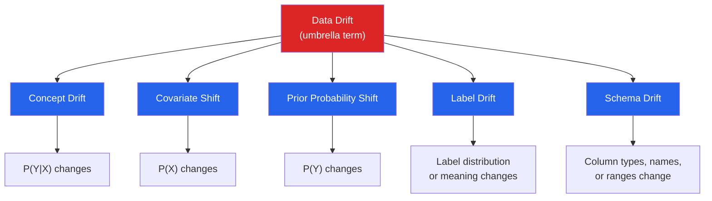
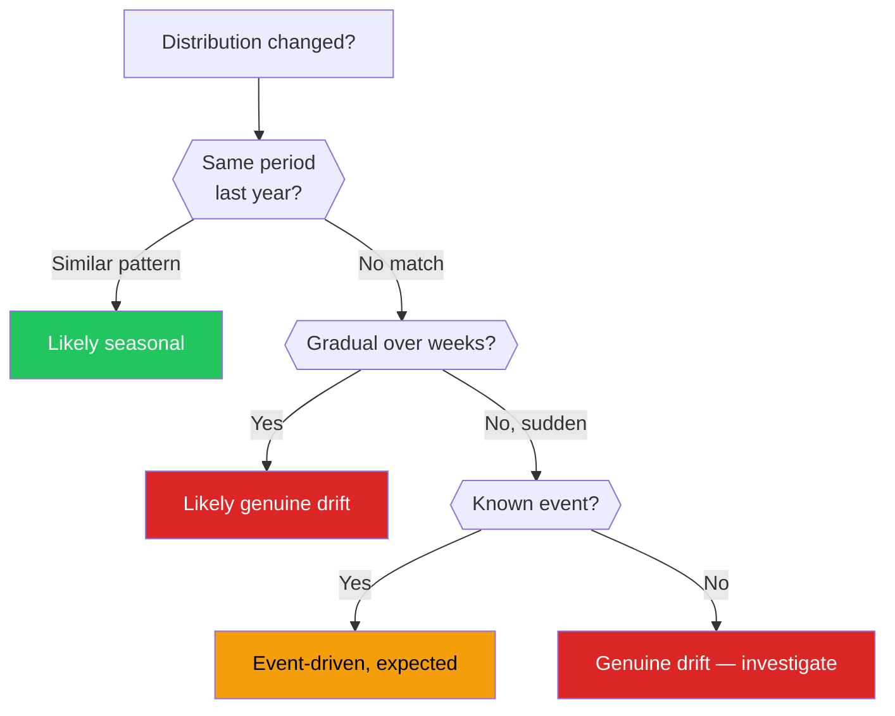
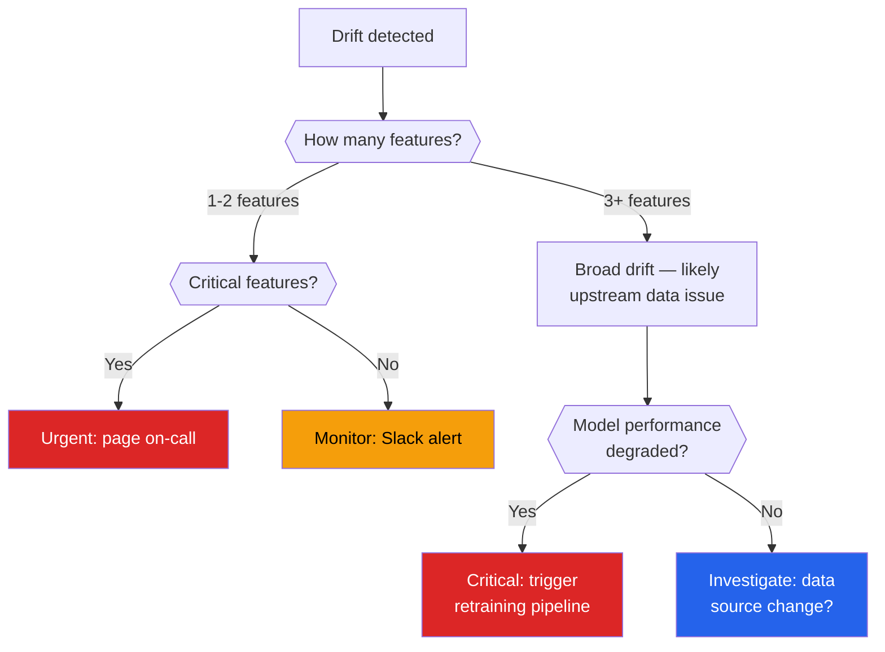

# Data Drift & Evolution

Production data never stays still. The distributions you trained on shift, new categories appear, upstream schemas mutate, and real-world behavior evolves. If you do not detect these changes, your models silently degrade, your dashboards lie, and your business decisions rot. This page gives you the theory, the math, the Python code, and the tooling to catch drift before it catches you.

---

## What Is Drift?

Drift is any change in the statistical properties of data over time that was not anticipated by your model or analysis. It is not a single phenomenon — it is a family of related problems, each with different causes and different detection strategies.



---

## Types of Drift

### Covariate Shift

The input feature distribution P(X) changes, but the relationship between features and target P(Y|X) stays the same.

| Scenario | Example |
|----------|---------|
| Demographic shift | A lending model trained on urban applicants starts receiving rural applicants with different income distributions |
| Seasonal change | An e-commerce model trained on summer data sees winter traffic with different browsing patterns |
| Data collection change | A sensor is recalibrated and starts producing readings with a different baseline |

```python
import numpy as np
import pandas as pd
from scipy import stats

np.random.seed(42)

# Training data: income is roughly log-normal, urban population
train_income = np.random.lognormal(mean=10.8, sigma=0.5, size=5000)

# Production data: shifted — rural population has lower, wider distribution
prod_income = np.random.lognormal(mean=10.3, sigma=0.7, size=5000)

print(f"Train  — mean: ${train_income.mean():,.0f}  median: ${np.median(train_income):,.0f}")
print(f"Prod   — mean: ${prod_income.mean():,.0f}  median: ${np.median(prod_income):,.0f}")

# Quick KS test
ks_stat, p_value = stats.ks_2samp(train_income, prod_income)
print(f"\nKS statistic: {ks_stat:.4f}, p-value: {p_value:.2e}")
# p < 0.05 → distributions differ significantly
```

### Concept Drift

The relationship between features and target P(Y|X) changes, even if the input distribution stays the same.

| Type | Description | Example |
|------|-------------|---------|
| **Sudden** | Abrupt change at a point in time | New regulation changes loan approval criteria overnight |
| **Gradual** | Slow shift over weeks or months | Customer preferences evolve as a competitor enters the market |
| **Incremental** | Small, steady accumulation | Inflation slowly changes what "high income" means |
| **Recurring** | Cyclic patterns | Holiday shopping behavior returns every December |

```python
# Simulating concept drift: same features, different target relationship
np.random.seed(42)

n = 2000
X = np.random.uniform(0, 10, n)

# Period 1: linear relationship
y_period1 = 2.5 * X + np.random.normal(0, 1, n)

# Period 2: relationship has changed (concept drift)
y_period2 = 1.0 * X + 5.0 + np.random.normal(0, 1, n)

print("Same X distribution, different Y|X relationship:")
print(f"Period 1 — slope: ~2.5, intercept: ~0")
print(f"Period 2 — slope: ~1.0, intercept: ~5.0")

# A model trained on period 1 will systematically mis-predict in period 2
from sklearn.linear_model import LinearRegression

model = LinearRegression().fit(X[:1000].reshape(-1, 1), y_period1[:1000])
pred_p1 = model.predict(X[1000:].reshape(-1, 1))
pred_p2 = model.predict(X[1000:].reshape(-1, 1))

mae_p1 = np.mean(np.abs(pred_p1 - y_period1[1000:]))
mae_p2 = np.mean(np.abs(pred_p2 - y_period2[1000:]))
print(f"\nMAE on period 1 holdout: {mae_p1:.2f}")
print(f"MAE on period 2 data:    {mae_p2:.2f}  ← concept drift degradation")
```

### Prior Probability Shift

The target distribution P(Y) changes. In classification, the class proportions shift; in regression, the target's range or center moves.

```python
np.random.seed(42)

# Training: 5% fraud rate
train_labels = np.random.choice([0, 1], size=10000, p=[0.95, 0.05])

# Production: fraud rate doubled (e.g., new attack vector)
prod_labels = np.random.choice([0, 1], size=10000, p=[0.90, 0.10])

print(f"Train fraud rate: {train_labels.mean():.3f}")
print(f"Prod  fraud rate: {prod_labels.mean():.3f}")

# Chi-square test for label distribution change
from scipy.stats import chi2_contingency

train_counts = np.bincount(train_labels)
prod_counts = np.bincount(prod_labels)
contingency = np.array([train_counts, prod_counts])

chi2, p_value, dof, expected = chi2_contingency(contingency)
print(f"\nChi-square: {chi2:.2f}, p-value: {p_value:.2e}")
```

### Label Drift

The meaning or quality of labels changes. This is insidious because the data looks fine — it is the ground truth that has shifted.

| Cause | Example |
|-------|---------|
| Annotator turnover | New labelers interpret guidelines differently |
| Guideline update | "Positive sentiment" definition changes to include neutral-positive |
| Feedback loop | Model predictions influence future labels (e.g., approved loans default less because risky ones were rejected) |

::: warning Label Drift Is the Hardest to Detect
Unlike covariate or prior probability shift, label drift requires access to ground truth AND knowledge of how labels are produced. Automated statistical tests alone cannot catch it — you need process monitoring and inter-annotator agreement tracking.
:::

### Schema Drift

Structural changes to the data itself — new columns, removed columns, type changes, encoding changes.

```python
# Detecting schema drift between two DataFrames
def detect_schema_drift(reference_df: pd.DataFrame, current_df: pd.DataFrame) -> dict:
    """Compare schemas and report all differences."""
    drift_report = {
        "new_columns": [],
        "missing_columns": [],
        "type_changes": [],
        "range_changes": [],
    }

    ref_cols = set(reference_df.columns)
    cur_cols = set(current_df.columns)

    drift_report["new_columns"] = sorted(cur_cols - ref_cols)
    drift_report["missing_columns"] = sorted(ref_cols - cur_cols)

    for col in ref_cols & cur_cols:
        if reference_df[col].dtype != current_df[col].dtype:
            drift_report["type_changes"].append({
                "column": col,
                "reference_type": str(reference_df[col].dtype),
                "current_type": str(current_df[col].dtype),
            })

        if pd.api.types.is_numeric_dtype(reference_df[col]):
            ref_range = (reference_df[col].min(), reference_df[col].max())
            cur_range = (current_df[col].min(), current_df[col].max())
            if cur_range[0] < ref_range[0] * 0.5 or cur_range[1] > ref_range[1] * 2.0:
                drift_report["range_changes"].append({
                    "column": col,
                    "ref_range": ref_range,
                    "cur_range": cur_range,
                })

    return drift_report

# Example usage
ref = pd.DataFrame({"age": [25, 30, 35], "income": [50000, 60000, 70000], "city": ["A", "B", "C"]})
cur = pd.DataFrame({"age": [25, 30, 35], "income": [50000, 60000, 70000], "region": ["X", "Y", "Z"]})

report = detect_schema_drift(ref, cur)
for key, val in report.items():
    if val:
        print(f"{key}: {val}")
# missing_columns: ['city']
# new_columns: ['region']
```

---

## Statistical Detection Methods

### Population Stability Index (PSI)

PSI measures how much a distribution has shifted from a reference. It is the industry standard in banking and finance for monitoring scorecard stability.

$$PSI = \sum_{i=1}^{k} (p_i^{actual} - p_i^{expected}) \times \ln\left(\frac{p_i^{actual}}{p_i^{expected}}\right)$$

| PSI Value | Interpretation |
|-----------|---------------|
| < 0.10 | No significant shift |
| 0.10 – 0.25 | Moderate shift — investigate |
| > 0.25 | Significant shift — action required |

```python
import numpy as np
import pandas as pd

def calculate_psi(
    reference: np.ndarray,
    current: np.ndarray,
    n_bins: int = 10,
    eps: float = 1e-4,
) -> tuple[float, pd.DataFrame]:
    """
    Calculate Population Stability Index between two distributions.

    Returns PSI value and a breakdown DataFrame showing
    contribution of each bin.
    """
    # Use reference quantiles as bin edges for consistency
    breakpoints = np.quantile(reference, np.linspace(0, 1, n_bins + 1))
    breakpoints[0] = -np.inf
    breakpoints[-1] = np.inf

    ref_counts = np.histogram(reference, bins=breakpoints)[0]
    cur_counts = np.histogram(current, bins=breakpoints)[0]

    ref_pct = ref_counts / ref_counts.sum() + eps
    cur_pct = cur_counts / cur_counts.sum() + eps

    psi_components = (cur_pct - ref_pct) * np.log(cur_pct / ref_pct)

    breakdown = pd.DataFrame({
        "bin": range(1, n_bins + 1),
        "ref_pct": ref_pct.round(4),
        "cur_pct": cur_pct.round(4),
        "psi_contribution": psi_components.round(6),
    })

    return psi_components.sum(), breakdown


# --- Demo ---
np.random.seed(42)

reference = np.random.normal(50, 10, 10000)
current_mild = np.random.normal(51, 10, 10000)    # slight shift
current_severe = np.random.normal(58, 15, 10000)  # big shift

psi_mild, breakdown_mild = calculate_psi(reference, current_mild)
psi_severe, breakdown_severe = calculate_psi(reference, current_severe)

print(f"Mild shift   PSI: {psi_mild:.4f}")
print(f"Severe shift PSI: {psi_severe:.4f}")
print("\nSevere shift — bin breakdown:")
print(breakdown_severe.to_string(index=False))
```

::: tip When to Use PSI
PSI is best for **continuous features that you can bucket**. It is symmetric and easy to interpret, which is why regulators love it. However, it is sensitive to bin count and does not capture the shape of the shift — only the magnitude.
:::

### Kolmogorov-Smirnov (KS) Test

The KS test compares the empirical CDFs of two samples. It is distribution-free (no assumptions about the underlying distribution) and powerful for detecting shifts in location, spread, or shape.

```python
from scipy import stats
import numpy as np
import pandas as pd

def ks_drift_test(
    reference: np.ndarray,
    current: np.ndarray,
    alpha: float = 0.05,
) -> dict:
    """Run two-sample KS test and return drift assessment."""
    stat, p_value = stats.ks_2samp(reference, current)
    return {
        "ks_statistic": round(stat, 6),
        "p_value": round(p_value, 8),
        "drift_detected": p_value < alpha,
        "alpha": alpha,
    }

# Monitor a feature over multiple time windows
np.random.seed(42)
reference = np.random.normal(100, 15, 5000)

windows = {
    "week_1": np.random.normal(100, 15, 500),
    "week_2": np.random.normal(101, 15, 500),
    "week_3": np.random.normal(103, 16, 500),
    "week_4": np.random.normal(108, 18, 500),   # drift accelerates
    "week_5": np.random.normal(115, 20, 500),   # severe drift
}

results = []
for window_name, data in windows.items():
    result = ks_drift_test(reference, data)
    result["window"] = window_name
    results.append(result)

df_results = pd.DataFrame(results)
print(df_results[["window", "ks_statistic", "p_value", "drift_detected"]].to_string(index=False))
```

### KL Divergence (Kullback-Leibler)

KL divergence measures how one probability distribution diverges from a reference distribution. Unlike KS, it quantifies the **information-theoretic cost** of using the reference distribution to approximate the current one.

::: danger KL Divergence Is Not Symmetric
D_KL(P || Q) ≠ D_KL(Q || P). Always put the reference distribution as Q and the current as P. If you need symmetry, use the Jensen-Shannon divergence: JS(P, Q) = 0.5 * KL(P || M) + 0.5 * KL(Q || M) where M = 0.5 * (P + Q).
:::

```python
import numpy as np
from scipy.special import kl_div, rel_entr
from scipy.stats import entropy

def kl_divergence_binned(
    reference: np.ndarray,
    current: np.ndarray,
    n_bins: int = 50,
    eps: float = 1e-10,
) -> dict:
    """
    Compute KL divergence and Jensen-Shannon divergence
    using histogram binning.
    """
    # Shared bin edges from combined range
    combined = np.concatenate([reference, current])
    bin_edges = np.histogram_bin_edges(combined, bins=n_bins)

    ref_hist = np.histogram(reference, bins=bin_edges, density=True)[0] + eps
    cur_hist = np.histogram(current, bins=bin_edges, density=True)[0] + eps

    # Normalize to proper probability distributions
    ref_prob = ref_hist / ref_hist.sum()
    cur_prob = cur_hist / cur_hist.sum()

    # KL(current || reference) — how different is current from reference
    kl = entropy(cur_prob, ref_prob)

    # Jensen-Shannon (symmetric)
    m = 0.5 * (ref_prob + cur_prob)
    js = 0.5 * entropy(cur_prob, m) + 0.5 * entropy(ref_prob, m)

    return {
        "kl_divergence": round(kl, 6),
        "js_divergence": round(js, 6),
        "js_distance": round(np.sqrt(js), 6),  # metric form
    }


np.random.seed(42)
ref = np.random.normal(0, 1, 10000)

scenarios = {
    "identical":     np.random.normal(0, 1, 10000),
    "mean_shift":    np.random.normal(0.5, 1, 10000),
    "var_increase":  np.random.normal(0, 1.5, 10000),
    "bimodal":       np.concatenate([
                         np.random.normal(-2, 0.5, 5000),
                         np.random.normal(2, 0.5, 5000),
                     ]),
}

for name, data in scenarios.items():
    result = kl_divergence_binned(ref, data)
    print(f"{name:15s}  KL: {result['kl_divergence']:.4f}  "
          f"JS: {result['js_divergence']:.4f}  "
          f"JS-dist: {result['js_distance']:.4f}")
```

### Wasserstein Distance (Earth Mover's Distance)

The Wasserstein distance measures the minimum "work" needed to transform one distribution into another. Think of it as the cost of moving earth from one histogram shape to another.

```python
from scipy.stats import wasserstein_distance
import numpy as np

np.random.seed(42)

reference = np.random.normal(50, 10, 10000)

shifts = {
    "no_shift":      np.random.normal(50, 10, 10000),
    "location_+3":   np.random.normal(53, 10, 10000),
    "location_+10":  np.random.normal(60, 10, 10000),
    "spread_x1.5":   np.random.normal(50, 15, 10000),
    "spread_x2":     np.random.normal(50, 20, 10000),
    "both":          np.random.normal(60, 20, 10000),
}

print(f"{'Scenario':18s}  {'Wasserstein':>12s}  {'Interpretation'}")
print("-" * 60)
for name, data in shifts.items():
    wd = wasserstein_distance(reference, data)
    severity = "none" if wd < 1 else "mild" if wd < 5 else "moderate" if wd < 10 else "severe"
    print(f"{name:18s}  {wd:12.4f}  {severity}")
```

::: tip Wasserstein vs KS vs PSI
- **KS** tells you *if* distributions differ (hypothesis test with p-value)
- **PSI** tells you *how much* they differ in a regulated-industry-friendly way
- **Wasserstein** tells you the *magnitude* of difference in the original feature's units
- **KL/JS** tells you the *information-theoretic* divergence

Use multiple metrics together. No single metric captures every type of drift.
:::

### Chi-Square Test for Categorical Features

For categorical variables, you cannot use KS or Wasserstein. The chi-square test compares observed vs expected frequency counts.

```python
import numpy as np
import pandas as pd
from scipy.stats import chi2_contingency, chisquare

def categorical_drift_test(
    reference: pd.Series,
    current: pd.Series,
    alpha: float = 0.05,
) -> dict:
    """
    Test for drift in a categorical feature using chi-square.
    Handles new categories gracefully.
    """
    all_categories = sorted(set(reference.unique()) | set(current.unique()))

    ref_counts = reference.value_counts().reindex(all_categories, fill_value=0)
    cur_counts = current.value_counts().reindex(all_categories, fill_value=0)

    # Normalize reference to expected frequencies matching current sample size
    expected = ref_counts / ref_counts.sum() * cur_counts.sum()

    # Avoid zero expected counts (chi-square requirement)
    mask = expected > 0
    if mask.sum() < 2:
        return {"error": "Not enough non-zero categories for chi-square test"}

    chi2, p_value = chisquare(cur_counts[mask], expected[mask])

    # New categories not in reference
    new_cats = set(current.unique()) - set(reference.unique())

    return {
        "chi2_statistic": round(chi2, 4),
        "p_value": round(p_value, 8),
        "drift_detected": p_value < alpha,
        "new_categories": sorted(new_cats),
        "n_ref_categories": reference.nunique(),
        "n_cur_categories": current.nunique(),
    }


# Example: product categories shifting
np.random.seed(42)

ref_products = pd.Series(
    np.random.choice(
        ["Electronics", "Clothing", "Food", "Books", "Home"],
        size=5000,
        p=[0.30, 0.25, 0.20, 0.15, 0.10],
    )
)

# Production: Electronics dropped, new "Digital" category appeared
cur_products = pd.Series(
    np.random.choice(
        ["Electronics", "Clothing", "Food", "Books", "Home", "Digital"],
        size=5000,
        p=[0.15, 0.25, 0.20, 0.15, 0.10, 0.15],
    )
)

result = categorical_drift_test(ref_products, cur_products)
for k, v in result.items():
    print(f"{k}: {v}")
```

---

## Visualization: Seeing Drift

Numbers alone are not enough. Overlaid distribution plots make drift obvious to stakeholders who do not read p-values.

### Overlaid Histograms

```python
import numpy as np
import matplotlib.pyplot as plt
import matplotlib.gridspec as gridspec

np.random.seed(42)

features = {
    "income": {
        "reference": np.random.lognormal(10.8, 0.5, 10000),
        "current":   np.random.lognormal(10.5, 0.7, 10000),
    },
    "age": {
        "reference": np.random.normal(38, 10, 10000),
        "current":   np.random.normal(42, 12, 10000),
    },
    "session_duration": {
        "reference": np.random.exponential(5, 10000),
        "current":   np.random.exponential(3.5, 10000),
    },
}

fig, axes = plt.subplots(1, 3, figsize=(18, 5))

for ax, (name, data) in zip(axes, features.items()):
    ax.hist(data["reference"], bins=50, alpha=0.5, density=True,
            label="Reference", color="#2563eb", edgecolor="white", linewidth=0.3)
    ax.hist(data["current"], bins=50, alpha=0.5, density=True,
            label="Current", color="#dc2626", edgecolor="white", linewidth=0.3)
    ax.set_title(f"{name}", fontsize=13, fontweight="bold")
    ax.legend(frameon=False)
    ax.set_ylabel("Density")
    ax.spines[["top", "right"]].set_visible(False)

fig.suptitle("Feature Distribution Drift — Reference vs Current", fontsize=15, fontweight="bold", y=1.02)
plt.tight_layout()
plt.savefig("drift_histograms.png", dpi=150, bbox_inches="tight")
plt.show()
```

### KDE Over Time Windows

```python
import numpy as np
import matplotlib.pyplot as plt
from scipy.stats import gaussian_kde

np.random.seed(42)

# Simulate gradual drift over 6 months
months = ["Jan", "Feb", "Mar", "Apr", "May", "Jun"]
mean_shift = [50, 50.5, 51.5, 53, 56, 60]
std_shift = [10, 10, 10.5, 11, 12, 14]

fig, ax = plt.subplots(figsize=(12, 6))

colors = plt.cm.RdYlBu_r(np.linspace(0.1, 0.9, len(months)))
x_grid = np.linspace(0, 110, 500)

for i, (month, mu, sigma) in enumerate(zip(months, mean_shift, std_shift)):
    data = np.random.normal(mu, sigma, 2000)
    kde = gaussian_kde(data)
    ax.plot(x_grid, kde(x_grid), color=colors[i], linewidth=2, label=month)
    ax.fill_between(x_grid, kde(x_grid), alpha=0.1, color=colors[i])

ax.set_xlabel("Feature Value", fontsize=12)
ax.set_ylabel("Density", fontsize=12)
ax.set_title("Gradual Feature Drift Over 6 Months", fontsize=14, fontweight="bold")
ax.legend(title="Month", frameon=False, fontsize=10)
ax.spines[["top", "right"]].set_visible(False)

plt.tight_layout()
plt.savefig("kde_drift_timeline.png", dpi=150, bbox_inches="tight")
plt.show()
```

### Drift Dashboard — Multiple Metrics Over Time

```python
import numpy as np
import pandas as pd
import matplotlib.pyplot as plt
from scipy.stats import ks_2samp, wasserstein_distance

np.random.seed(42)

# Reference distribution
reference = np.random.normal(100, 15, 10000)

# 12 weeks of production data with increasing drift
weeks = list(range(1, 13))
drift_data = {}
for w in weeks:
    shift = 0.5 * w  # gradual mean shift
    spread = 15 + 0.3 * w  # gradual variance increase
    drift_data[w] = np.random.normal(100 + shift, spread, 1000)

# Calculate metrics per week
records = []
for w, data in drift_data.items():
    psi_val, _ = calculate_psi(reference, data)  # function from earlier
    ks_stat, ks_p = ks_2samp(reference, data)
    wd = wasserstein_distance(reference, data)
    records.append({
        "week": w,
        "psi": psi_val,
        "ks_statistic": ks_stat,
        "ks_p_value": ks_p,
        "wasserstein": wd,
        "mean_current": data.mean(),
        "std_current": data.std(),
    })

df = pd.DataFrame(records)

fig, axes = plt.subplots(2, 2, figsize=(14, 10))

# PSI over time
axes[0, 0].bar(df["week"], df["psi"], color="#2563eb", alpha=0.8)
axes[0, 0].axhline(0.1, color="orange", linestyle="--", label="Moderate threshold")
axes[0, 0].axhline(0.25, color="red", linestyle="--", label="Severe threshold")
axes[0, 0].set_title("PSI Over Time", fontweight="bold")
axes[0, 0].set_xlabel("Week")
axes[0, 0].legend(fontsize=9)

# KS statistic over time
axes[0, 1].plot(df["week"], df["ks_statistic"], "o-", color="#7c3aed", linewidth=2)
axes[0, 1].set_title("KS Statistic Over Time", fontweight="bold")
axes[0, 1].set_xlabel("Week")

# Wasserstein distance
axes[1, 0].plot(df["week"], df["wasserstein"], "s-", color="#dc2626", linewidth=2)
axes[1, 0].set_title("Wasserstein Distance Over Time", fontweight="bold")
axes[1, 0].set_xlabel("Week")

# Mean and std tracking
axes[1, 1].plot(df["week"], df["mean_current"], "o-", color="#2563eb", label="Mean")
axes[1, 1].fill_between(
    df["week"],
    df["mean_current"] - df["std_current"],
    df["mean_current"] + df["std_current"],
    alpha=0.2, color="#2563eb", label="± 1 Std",
)
axes[1, 1].axhline(100, color="gray", linestyle=":", label="Reference mean")
axes[1, 1].set_title("Feature Mean ± Std Over Time", fontweight="bold")
axes[1, 1].set_xlabel("Week")
axes[1, 1].legend(fontsize=9)

for ax in axes.flat:
    ax.spines[["top", "right"]].set_visible(False)

fig.suptitle("Drift Monitoring Dashboard", fontsize=15, fontweight="bold")
plt.tight_layout()
plt.savefig("drift_dashboard.png", dpi=150, bbox_inches="tight")
plt.show()
```

---

## Seasonal Drift vs Genuine Drift

Not every distribution change is drift. Seasonal patterns are expected and should not trigger alerts. The challenge is distinguishing **genuine drift** from **recurring seasonality**.



```python
import numpy as np
import pandas as pd
from scipy.stats import ks_2samp

np.random.seed(42)

# Simulate 2 years of monthly data with seasonality
months_2y = pd.date_range("2024-01-01", periods=24, freq="MS")
seasonal_means = [50, 48, 52, 58, 65, 72, 78, 76, 68, 58, 52, 49] * 2

monthly_data = {}
for i, (date, mu) in enumerate(zip(months_2y, seasonal_means)):
    monthly_data[date] = np.random.normal(mu, 10, 500)

# Compare Jan 2024 vs Jul 2024: big difference, but it is seasonal
ks_jan_jul = ks_2samp(monthly_data[months_2y[0]], monthly_data[months_2y[6]])
print(f"Jan 2024 vs Jul 2024:  KS={ks_jan_jul.statistic:.3f}  p={ks_jan_jul.pvalue:.2e}")
print("  → Looks like drift, but it is just seasonality!\n")

# Compare Jan 2024 vs Jan 2025: same season, should be similar
ks_jan_jan = ks_2samp(monthly_data[months_2y[0]], monthly_data[months_2y[12]])
print(f"Jan 2024 vs Jan 2025:  KS={ks_jan_jan.statistic:.3f}  p={ks_jan_jan.pvalue:.2e}")
print("  → Same season comparison — no drift detected\n")

# Strategy: always compare to the same period last year
def seasonal_drift_check(
    current_data: np.ndarray,
    same_period_last_year: np.ndarray,
    alpha: float = 0.05,
) -> dict:
    """Compare against same seasonal period, not just 'reference'."""
    ks_stat, p_value = ks_2samp(current_data, same_period_last_year)
    return {
        "ks_statistic": round(ks_stat, 4),
        "p_value": round(p_value, 6),
        "genuine_drift": p_value < alpha,
        "recommendation": (
            "Investigate — distribution differs from same period last year"
            if p_value < alpha
            else "No genuine drift — consistent with seasonal pattern"
        ),
    }

# Now inject genuine drift into Year 2 July
monthly_data[months_2y[18]] = np.random.normal(90, 10, 500)  # Jul 2025 shifted up

result = seasonal_drift_check(
    monthly_data[months_2y[18]],  # Jul 2025 (drifted)
    monthly_data[months_2y[6]],   # Jul 2024 (normal)
)
print("Jul 2025 vs Jul 2024 (genuine drift injected):")
for k, v in result.items():
    print(f"  {k}: {v}")
```

---

## Production Monitoring Tools

### Evidently AI

Evidently provides pre-built drift reports, data quality reports, and model performance dashboards.

```python
import pandas as pd
import numpy as np

# pip install evidently
from evidently.report import Report
from evidently.metric_preset import DataDriftPreset, DataQualityPreset
from evidently.metrics import (
    DataDriftTable,
    DatasetDriftMetric,
    ColumnDriftMetric,
)

np.random.seed(42)
n = 5000

# Reference dataset (training period)
reference = pd.DataFrame({
    "age": np.random.normal(35, 10, n).astype(int).clip(18, 80),
    "income": np.random.lognormal(10.8, 0.5, n).round(2),
    "credit_score": np.random.normal(700, 50, n).astype(int).clip(300, 850),
    "loan_amount": np.random.lognormal(9.5, 0.8, n).round(2),
    "category": np.random.choice(
        ["Personal", "Auto", "Mortgage", "Business"], n, p=[0.4, 0.3, 0.2, 0.1]
    ),
})

# Current dataset (production — with drift)
current = pd.DataFrame({
    "age": np.random.normal(40, 12, n).astype(int).clip(18, 80),        # age shifted up
    "income": np.random.lognormal(10.5, 0.6, n).round(2),               # income shifted down
    "credit_score": np.random.normal(700, 50, n).astype(int).clip(300, 850),  # stable
    "loan_amount": np.random.lognormal(10.0, 0.9, n).round(2),          # larger loans
    "category": np.random.choice(
        ["Personal", "Auto", "Mortgage", "Business"], n, p=[0.3, 0.2, 0.2, 0.3]
    ),  # Business category grew
})

# --- Data Drift Report ---
drift_report = Report(metrics=[
    DatasetDriftMetric(),
    DataDriftTable(),
])
drift_report.run(reference_data=reference, current_data=current)
drift_report.save_html("drift_report.html")
print("Drift report saved to drift_report.html")

# --- Programmatic access to results ---
result = drift_report.as_dict()
dataset_drift = result["metrics"][0]["result"]
print(f"\nDataset drift detected: {dataset_drift['dataset_drift']}")
print(f"Share of drifted columns: {dataset_drift['share_of_drifted_columns']:.2%}")

# Per-column results
column_results = result["metrics"][1]["result"]["drift_by_columns"]
for col, info in column_results.items():
    status = "DRIFT" if info["drift_detected"] else "OK"
    print(f"  {col:15s}  {status:5s}  "
          f"statistic={info['statistic_test']:.4f}  "
          f"p={info['p_value']:.4f}")
```

::: tip Evidently in CI/CD
You can run Evidently checks as part of your deployment pipeline. If drift exceeds your thresholds, block the deployment and trigger retraining.

```python
# Example: CI/CD gate
drift_share = dataset_drift["share_of_drifted_columns"]
if drift_share > 0.3:
    raise RuntimeError(
        f"Drift detected in {drift_share:.0%} of columns — "
        "blocking deployment. Investigate before retraining."
    )
```
:::

### NannyML

NannyML specializes in **estimating model performance without ground truth** — essential when labels arrive with a delay (e.g., loan defaults take months to materialize).

```python
import pandas as pd
import numpy as np

# pip install nannyml
import nannyml as nml

np.random.seed(42)
n_ref = 10000
n_prod = 5000

# Simulate a binary classification dataset with timestamps
reference = pd.DataFrame({
    "timestamp": pd.date_range("2025-01-01", periods=n_ref, freq="h"),
    "feature_1": np.random.normal(0, 1, n_ref),
    "feature_2": np.random.normal(5, 2, n_ref),
    "feature_3": np.random.choice(["A", "B", "C"], n_ref, p=[0.5, 0.3, 0.2]),
    "y_pred_proba": np.random.beta(2, 5, n_ref),  # model predictions
    "y_pred": (np.random.beta(2, 5, n_ref) > 0.3).astype(int),
    "y_true": np.random.binomial(1, 0.25, n_ref),  # ground truth available
})

# Production data — features have drifted, no ground truth yet
production = pd.DataFrame({
    "timestamp": pd.date_range("2025-06-01", periods=n_prod, freq="h"),
    "feature_1": np.random.normal(0.8, 1.2, n_prod),  # shifted
    "feature_2": np.random.normal(5, 2, n_prod),       # stable
    "feature_3": np.random.choice(["A", "B", "C", "D"], n_prod, p=[0.3, 0.2, 0.2, 0.3]),
    "y_pred_proba": np.random.beta(2.5, 4, n_prod),
    "y_pred": (np.random.beta(2.5, 4, n_prod) > 0.3).astype(int),
    "y_true": np.full(n_prod, np.nan),  # ground truth NOT available
})

# --- Univariate Drift Detection ---
univariate_calculator = nml.UnivariateDriftCalculator(
    column_names=["feature_1", "feature_2", "feature_3"],
    timestamp_column_name="timestamp",
    chunk_size=1000,
)

univariate_calculator.fit(reference)
drift_results = univariate_calculator.calculate(production)

print("Univariate drift results:")
print(drift_results.filter(period="analysis").to_df().head(15))

# --- Performance Estimation (CBPE) ---
cbpe = nml.CBPE(
    y_pred_proba="y_pred_proba",
    y_pred="y_pred",
    y_true="y_true",
    problem_type="classification_binary",
    timestamp_column_name="timestamp",
    chunk_size=1000,
    metrics=["roc_auc", "f1"],
)

cbpe.fit(reference)
estimated_perf = cbpe.estimate(production)

print("\nEstimated performance (no ground truth needed):")
print(estimated_perf.filter(period="analysis").to_df().head(10))
```

### whylogs

whylogs creates lightweight statistical profiles of your data that you can compare over time — ideal for high-volume streaming data where you cannot store raw samples.

```python
import pandas as pd
import numpy as np

# pip install whylogs
import whylogs as why
from whylogs.core.constraints.factories import (
    greater_than_number,
    mean_between_range,
    null_percentage_below,
    no_missing_values,
)
from whylogs.core.constraints import ConstraintsBuilder

np.random.seed(42)

# Profile the reference data
reference_data = pd.DataFrame({
    "age": np.random.normal(35, 10, 5000).astype(int).clip(18, 80),
    "income": np.random.lognormal(10.8, 0.5, 5000),
    "score": np.random.beta(5, 2, 5000) * 100,
})

ref_profile = why.log(reference_data).profile()
ref_view = ref_profile.view()

# Profile production data
production_data = pd.DataFrame({
    "age": np.random.normal(40, 12, 5000).astype(int).clip(18, 80),
    "income": np.random.lognormal(10.5, 0.7, 5000),
    "score": np.random.beta(3, 3, 5000) * 100,
})

prod_profile = why.log(production_data).profile()
prod_view = prod_profile.view()

# Compare profiles
print("Reference profile summary:")
print(ref_view.to_pandas().head())

print("\nProduction profile summary:")
print(prod_view.to_pandas().head())

# --- Constraints-based monitoring ---
builder = ConstraintsBuilder(dataset_profile_view=prod_view)
builder.add_constraint(greater_than_number(column_name="age", number=0))
builder.add_constraint(mean_between_range(column_name="income", lower=30000, upper=200000))
builder.add_constraint(null_percentage_below(column_name="score", number=0.05))

constraints = builder.build()
report = constraints.generate_constraints_report()

print("\nConstraint validation report:")
for item in report:
    status = "PASS" if item[1] == 1 else "FAIL"
    print(f"  [{status}] {item[0]}")
```

---

## Practical: Establishing Baselines and Setting Thresholds

### Baseline Strategy


```python
import numpy as np
import pandas as pd
from scipy.stats import ks_2samp, wasserstein_distance

np.random.seed(42)

class DriftMonitor:
    """
    Production drift monitor with configurable thresholds
    and multi-metric tracking.
    """

    def __init__(
        self,
        reference_data: pd.DataFrame,
        psi_threshold: float = 0.15,
        ks_alpha: float = 0.01,
        wasserstein_multiplier: float = 2.0,
    ):
        self.reference = reference_data
        self.psi_threshold = psi_threshold
        self.ks_alpha = ks_alpha
        self.wd_multiplier = wasserstein_multiplier

        # Compute baseline Wasserstein by bootstrapping reference
        self._calibrate_wasserstein()

    def _calibrate_wasserstein(self, n_bootstrap: int = 50):
        """Estimate natural Wasserstein variation within reference data."""
        self.wd_baselines = {}
        for col in self.reference.select_dtypes(include=[np.number]).columns:
            vals = self.reference[col].dropna().values
            wd_samples = []
            for _ in range(n_bootstrap):
                s1 = np.random.choice(vals, size=len(vals) // 2, replace=True)
                s2 = np.random.choice(vals, size=len(vals) // 2, replace=True)
                wd_samples.append(wasserstein_distance(s1, s2))
            self.wd_baselines[col] = {
                "mean": np.mean(wd_samples),
                "std": np.std(wd_samples),
                "threshold": np.mean(wd_samples) + self.wd_multiplier * np.std(wd_samples),
            }

    def check(self, current_data: pd.DataFrame) -> pd.DataFrame:
        """Run all drift checks and return a summary DataFrame."""
        results = []
        numeric_cols = self.reference.select_dtypes(include=[np.number]).columns

        for col in numeric_cols:
            ref_vals = self.reference[col].dropna().values
            cur_vals = current_data[col].dropna().values

            if len(cur_vals) == 0:
                results.append({"column": col, "status": "NO_DATA"})
                continue

            # PSI
            psi_val, _ = calculate_psi(ref_vals, cur_vals)

            # KS test
            ks_stat, ks_p = ks_2samp(ref_vals, cur_vals)

            # Wasserstein
            wd = wasserstein_distance(ref_vals, cur_vals)
            wd_threshold = self.wd_baselines[col]["threshold"]

            # Aggregate decision
            drift_signals = sum([
                psi_val > self.psi_threshold,
                ks_p < self.ks_alpha,
                wd > wd_threshold,
            ])

            status = (
                "SEVERE" if drift_signals >= 3
                else "WARNING" if drift_signals >= 2
                else "MILD" if drift_signals >= 1
                else "OK"
            )

            results.append({
                "column": col,
                "psi": round(psi_val, 4),
                "ks_stat": round(ks_stat, 4),
                "ks_p": round(ks_p, 6),
                "wasserstein": round(wd, 4),
                "wd_threshold": round(wd_threshold, 4),
                "drift_signals": drift_signals,
                "status": status,
            })

        return pd.DataFrame(results)


# --- Usage ---
n = 10000
reference = pd.DataFrame({
    "age": np.random.normal(35, 10, n).clip(18, 80),
    "income": np.random.lognormal(10.8, 0.5, n),
    "credit_score": np.random.normal(700, 50, n).clip(300, 850),
    "tenure_months": np.random.exponential(36, n),
})

# Production batch — some features drifted
production = pd.DataFrame({
    "age": np.random.normal(42, 12, 3000).clip(18, 80),       # shifted
    "income": np.random.lognormal(10.8, 0.5, 3000),           # stable
    "credit_score": np.random.normal(680, 60, 3000).clip(300, 850),  # mild shift
    "tenure_months": np.random.exponential(24, 3000),          # shifted
})

monitor = DriftMonitor(reference)
report = monitor.check(production)
print(report.to_string(index=False))
```

### Threshold Guidelines

| Metric | Conservative | Balanced | Permissive |
|--------|-------------|----------|------------|
| **PSI** | > 0.10 | > 0.15 | > 0.25 |
| **KS p-value** | < 0.01 | < 0.005 | < 0.001 |
| **Wasserstein** | > 1.5x baseline | > 2x baseline | > 3x baseline |
| **KL divergence** | > 0.05 | > 0.10 | > 0.20 |
| **JS distance** | > 0.10 | > 0.15 | > 0.25 |

::: warning Threshold Tuning Is Not Optional
Default thresholds will either flood you with false positives or miss real drift. You MUST calibrate thresholds against your own historical data. Run your drift detection on known-good historical periods and set thresholds above the observed natural variation.
:::

### Alerting Decision Matrix



---

## Comprehensive Detection Pipeline

Putting it all together — a reusable pipeline that combines multiple detection methods, handles both numerical and categorical features, and produces an actionable report.

```python
import numpy as np
import pandas as pd
from scipy.stats import ks_2samp, wasserstein_distance, chi2_contingency
from typing import Optional
from datetime import datetime

class ComprehensiveDriftReport:
    """
    End-to-end drift detection pipeline that handles numerical
    and categorical features with configurable thresholds.
    """

    def __init__(
        self,
        reference: pd.DataFrame,
        current: pd.DataFrame,
        timestamp: Optional[str] = None,
    ):
        self.reference = reference
        self.current = current
        self.timestamp = timestamp or datetime.now().isoformat()
        self.numerical_cols = reference.select_dtypes(include=[np.number]).columns.tolist()
        self.categorical_cols = reference.select_dtypes(include=["object", "category"]).columns.tolist()

    def _numerical_drift(self, col: str) -> dict:
        ref = self.reference[col].dropna().values
        cur = self.current[col].dropna().values

        ks_stat, ks_p = ks_2samp(ref, cur)
        wd = wasserstein_distance(ref, cur)
        psi_val, _ = calculate_psi(ref, cur)

        return {
            "column": col,
            "type": "numerical",
            "ref_mean": round(ref.mean(), 4),
            "cur_mean": round(cur.mean(), 4),
            "mean_shift_pct": round((cur.mean() - ref.mean()) / (ref.mean() + 1e-10) * 100, 2),
            "ref_std": round(ref.std(), 4),
            "cur_std": round(cur.std(), 4),
            "psi": round(psi_val, 4),
            "ks_statistic": round(ks_stat, 4),
            "ks_p_value": round(ks_p, 8),
            "wasserstein": round(wd, 4),
        }

    def _categorical_drift(self, col: str) -> dict:
        ref = self.reference[col].dropna()
        cur = self.current[col].dropna()

        all_cats = sorted(set(ref.unique()) | set(cur.unique()))
        ref_counts = ref.value_counts().reindex(all_cats, fill_value=0)
        cur_counts = cur.value_counts().reindex(all_cats, fill_value=0)

        contingency = pd.DataFrame({"ref": ref_counts, "cur": cur_counts})
        chi2, p_value, _, _ = chi2_contingency(contingency.T)

        new_cats = set(cur.unique()) - set(ref.unique())
        vanished_cats = set(ref.unique()) - set(cur.unique())

        return {
            "column": col,
            "type": "categorical",
            "ref_cardinality": ref.nunique(),
            "cur_cardinality": cur.nunique(),
            "chi2_statistic": round(chi2, 4),
            "chi2_p_value": round(p_value, 8),
            "new_categories": sorted(new_cats) if new_cats else None,
            "vanished_categories": sorted(vanished_cats) if vanished_cats else None,
        }

    def run(self) -> pd.DataFrame:
        results = []
        for col in self.numerical_cols:
            results.append(self._numerical_drift(col))
        for col in self.categorical_cols:
            results.append(self._categorical_drift(col))
        return pd.DataFrame(results)

    def summary(self) -> str:
        df = self.run()
        lines = [f"Drift Report — {self.timestamp}", "=" * 50]

        # Numerical summary
        num_df = df[df["type"] == "numerical"]
        if not num_df.empty:
            severe = num_df[num_df["psi"] > 0.25]
            moderate = num_df[(num_df["psi"] > 0.10) & (num_df["psi"] <= 0.25)]
            lines.append(f"\nNumerical features: {len(num_df)}")
            lines.append(f"  Severe drift:   {len(severe)} — {list(severe['column'])}")
            lines.append(f"  Moderate drift:  {len(moderate)} — {list(moderate['column'])}")

        # Categorical summary
        cat_df = df[df["type"] == "categorical"]
        if not cat_df.empty:
            drifted = cat_df[cat_df["chi2_p_value"] < 0.01]
            lines.append(f"\nCategorical features: {len(cat_df)}")
            lines.append(f"  Drifted: {len(drifted)} — {list(drifted['column'])}")

        return "\n".join(lines)


# --- Run the pipeline ---
np.random.seed(42)

ref_data = pd.DataFrame({
    "age": np.random.normal(35, 10, 5000).astype(int),
    "income": np.random.lognormal(10.8, 0.5, 5000),
    "score": np.random.beta(5, 2, 5000) * 100,
    "region": np.random.choice(["North", "South", "East", "West"], 5000),
    "product": np.random.choice(["A", "B", "C"], 5000, p=[0.5, 0.3, 0.2]),
})

cur_data = pd.DataFrame({
    "age": np.random.normal(40, 12, 3000).astype(int),
    "income": np.random.lognormal(10.5, 0.7, 3000),
    "score": np.random.beta(5, 2, 3000) * 100,
    "region": np.random.choice(["North", "South", "East", "West", "Central"], 3000),
    "product": np.random.choice(["A", "B", "C", "D"], 3000, p=[0.3, 0.2, 0.2, 0.3]),
})

pipeline = ComprehensiveDriftReport(ref_data, cur_data)
print(pipeline.summary())
print("\n" + pipeline.run().to_string(index=False))
```

---

## Key Takeaways

| Principle | Details |
|-----------|---------|
| **Drift is a family** | Covariate shift, concept drift, prior probability shift, label drift, and schema drift require different detection strategies |
| **Use multiple metrics** | No single metric catches all types of drift. Combine PSI, KS, Wasserstein, and domain-specific checks |
| **Compare apples to apples** | Always account for seasonality. Compare to the same period last year, not just the training set |
| **Calibrate thresholds** | Run detection on historical data to establish natural variation before setting alert thresholds |
| **Automate monitoring** | Use Evidently, NannyML, or whylogs in your CI/CD pipeline — manual drift checks do not scale |
| **Schema drift first** | Check for structural changes before running statistical tests. A renamed column will break everything downstream |

::: danger Silent Model Degradation
The most dangerous drift is the kind that does not crash your pipeline. Your model keeps producing predictions, your dashboard keeps rendering — but the numbers are wrong. Drift monitoring is not optional in production ML. It is as essential as logging and alerting.
:::
