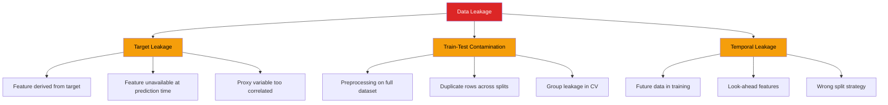
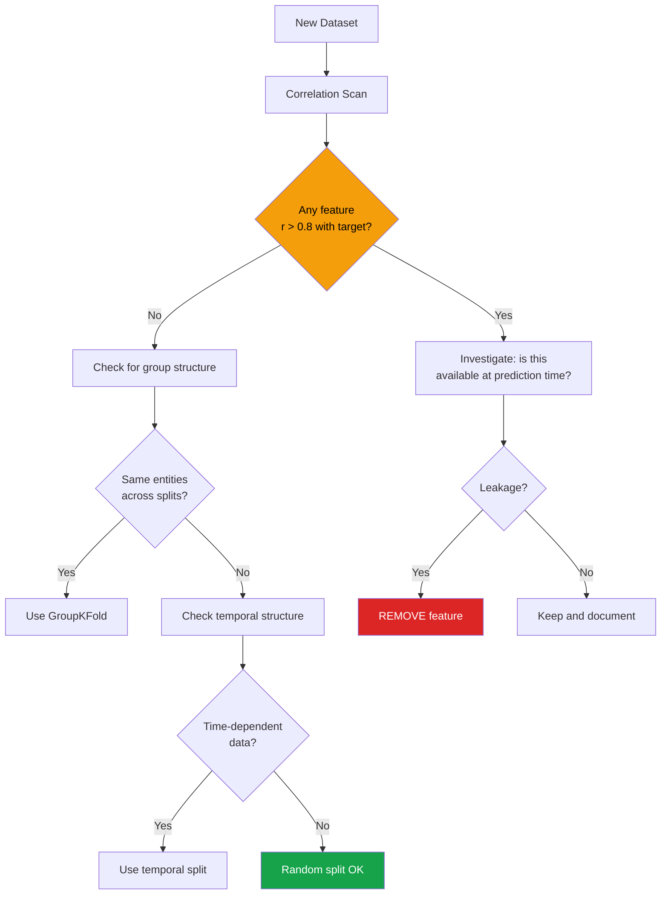

# Data Leakage Detection

Data leakage is the single most dangerous pitfall in data science. It occurs when information from outside the training dataset leaks into the model, creating unrealistically good performance that evaporates in production. EDA is your first line of defense.

---

## Types of Leakage



---

## Target Leakage

Target leakage occurs when a feature contains information about the target that would not be available at prediction time.

```python
import pandas as pd
import numpy as np
from scipy import stats

np.random.seed(42)
n = 10000

# Simulated credit default dataset with leakage
df = pd.DataFrame({
    'customer_id': range(n),
    'income': np.random.lognormal(10.5, 0.8, n).round(0),
    'credit_score': np.random.normal(700, 60, n).clip(300, 850).astype(int),
    'loan_amount': np.random.lognormal(10, 0.5, n).round(0),
    'employment_years': np.random.exponential(5, n).clip(0, 40).round(1),

    # LEAKY: these features depend on the target
    'collection_calls': np.random.poisson(0.5, n),       # made AFTER default
    'late_fees_charged': np.random.lognormal(3, 2, n).round(2),  # charged AFTER late
    'account_status_code': np.random.choice(['current', 'delinquent', 'default', 'closed'], n),

    'defaulted': np.random.choice([0, 1], n, p=[0.85, 0.15]),
})

# Make leaky features actually correlate with target
df.loc[df['defaulted'] == 1, 'collection_calls'] = np.random.poisson(5, (df['defaulted'] == 1).sum())
df.loc[df['defaulted'] == 1, 'late_fees_charged'] = np.random.lognormal(5, 1, (df['defaulted'] == 1).sum()).round(2)
df.loc[df['defaulted'] == 1, 'account_status_code'] = np.random.choice(['delinquent', 'default'], (df['defaulted'] == 1).sum())
```

### Detecting Target Leakage

```python
def detect_target_leakage(df, target, threshold=0.8):
    """Detect features suspiciously correlated with the target."""
    print(f"TARGET LEAKAGE DETECTION (target: {target})")
    print("=" * 60)

    numeric = df.select_dtypes(include='number').drop(columns=[target], errors='ignore')

    # 1. Suspiciously high correlations
    print("\n[1] Correlation with target:")
    correlations = numeric.corrwith(df[target]).abs().sort_values(ascending=False)
    for col, r in correlations.items():
        flag = "*** LIKELY LEAKAGE" if r > threshold else "** suspicious" if r > 0.5 else ""
        print(f"  {col:<30} r={r:.4f} {flag}")

    # 2. Near-perfect predictive power
    print(f"\n[2] AUC-like score (point-biserial for binary target):")
    for col in numeric.columns:
        try:
            r, p = stats.pointbiserialr(df[target], df[col].fillna(0))
            flag = "*** LIKELY LEAKAGE" if abs(r) > threshold else ""
            print(f"  {col:<30} rpb={abs(r):.4f} {flag}")
        except Exception:
            pass

    # 3. Categorical features — check for target encoding
    categorical = df.select_dtypes(include=['object', 'category']).columns
    for col in categorical:
        ct = pd.crosstab(df[col], df[target], normalize='index')
        max_diff = ct.max(axis=1).max() - ct.min(axis=1).min()
        if max_diff > 0.8:
            print(f"\n  ALERT: '{col}' has near-deterministic relationship with target")
            print(ct.round(3))

    # 4. Features with zero variance in one target class
    print(f"\n[3] Features with near-zero variance in one class:")
    for col in numeric.columns:
        for cls in df[target].unique():
            subset = df[df[target] == cls][col].dropna()
            if len(subset) > 10 and subset.std() < 0.01 * df[col].std():
                print(f"  {col}: near-zero variance when {target}={cls}")

detect_target_leakage(df, 'defaulted')
```

---

## Train-Test Contamination

```python
def detect_train_test_contamination(train, test, id_cols=None):
    """Detect overlap between train and test sets."""
    print("TRAIN-TEST CONTAMINATION CHECK")
    print("=" * 60)

    # 1. Check for duplicate rows
    combined = pd.concat([train.assign(_split='train'), test.assign(_split='test')])
    dupes = combined.duplicated(keep=False)
    n_dupes = dupes.sum()
    if n_dupes > 0:
        print(f"\n[1] ALERT: {n_dupes} duplicate rows found across splits!")
        dupe_splits = combined[dupes].groupby('_split').size()
        print(f"    Train: {dupe_splits.get('train', 0)}, Test: {dupe_splits.get('test', 0)}")
    else:
        print("\n[1] OK: No duplicate rows across splits")

    # 2. Check for ID overlap
    if id_cols:
        for col in id_cols:
            if col in train.columns and col in test.columns:
                overlap = set(train[col]) & set(test[col])
                pct = len(overlap) / len(set(test[col])) * 100
                flag = "ALERT!" if pct > 0 else "OK"
                print(f"\n[2] ID column '{col}': {len(overlap)} overlapping values ({pct:.1f}%) [{flag}]")

    # 3. Distribution comparison (KS test)
    print(f"\n[3] Distribution comparison (KS test):")
    numeric = train.select_dtypes(include='number').columns
    for col in numeric[:10]:
        if col in test.columns:
            stat, p = stats.ks_2samp(train[col].dropna(), test[col].dropna())
            flag = "DRIFT!" if p < 0.001 else ""
            print(f"  {col:<30} KS={stat:.4f}, p={p:.4f} {flag}")

# Example
train = df.sample(frac=0.7, random_state=42)
test = df.drop(train.index)
detect_train_test_contamination(train, test, id_cols=['customer_id'])
```

### Preprocessing Leakage

```python
# BAD: fitting scaler on full dataset before split
from sklearn.preprocessing import StandardScaler

# WRONG
scaler_wrong = StandardScaler()
df_scaled = pd.DataFrame(scaler_wrong.fit_transform(df[['income', 'credit_score']]),
                          columns=['income', 'credit_score'])
# The test set statistics leaked into training!

# RIGHT: fit only on training data
scaler_right = StandardScaler()
train_scaled = scaler_right.fit_transform(train[['income', 'credit_score']])
test_scaled = scaler_right.transform(test[['income', 'credit_score']])  # only transform

# Common preprocessing leakage patterns:
preprocessing_leakage = {
    'Imputation':     'Fit imputer on train only, transform test',
    'Scaling':        'Fit scaler on train only, transform test',
    'Encoding':       'Fit encoder on train only, handle unseen categories',
    'Feature selection': 'Select features using train only',
    'Oversampling':   'SMOTE only on train, never on test',
    'Outlier removal': 'Define thresholds from train only',
}

print("\nPreprocessing Leakage Prevention:")
for step, rule in preprocessing_leakage.items():
    print(f"  {step:<20} {rule}")
```

---

## Temporal Leakage

```python
# Time series: future data leaking into past predictions
np.random.seed(42)
n = 5000
ts = pd.DataFrame({
    'date': pd.date_range('2022-01-01', periods=n, freq='D'),
    'value': np.cumsum(np.random.randn(n)) + 100,
    'target': np.random.choice([0, 1], n, p=[0.85, 0.15]),
})

# WRONG: random split ignores time
# train, test = train_test_split(ts, test_size=0.2)  # BAD!

# RIGHT: temporal split
cutoff = ts['date'].quantile(0.8)
train_ts = ts[ts['date'] <= cutoff]
test_ts = ts[ts['date'] > cutoff]

print(f"Temporal Split:")
print(f"  Train: {train_ts['date'].min()} to {train_ts['date'].max()} ({len(train_ts)} rows)")
print(f"  Test:  {test_ts['date'].min()} to {test_ts['date'].max()} ({len(test_ts)} rows)")

# Common temporal leakage patterns
def detect_temporal_leakage(df, date_col, feature_cols, target_col):
    """Check for features that use future information."""
    print(f"\nTEMPORAL LEAKAGE CHECK")
    print("=" * 60)

    # Check if any feature correlates with future target values
    for col in feature_cols:
        # Compute correlation between feature at time t and target at time t
        r_current, _ = stats.pearsonr(df[col].fillna(0), df[target_col])

        # Compute correlation between feature at time t and target at time t-1
        r_lagged, _ = stats.pearsonr(df[col].fillna(0).iloc[1:], df[target_col].iloc[:-1])

        if abs(r_current) > 2 * abs(r_lagged) and abs(r_current) > 0.3:
            print(f"  ALERT: '{col}' may contain future info!")
            print(f"    Corr with current target: {r_current:.4f}")
            print(f"    Corr with lagged target:  {r_lagged:.4f}")

# Look-ahead features
print("\nCommon look-ahead features to check:")
lookhead_examples = [
    "Running averages that include future data",
    "Features computed from the entire time series",
    "Target-encoded features using future labels",
    "Lag features with negative lag (future values)",
    "Rolling statistics with center=True",
]
for ex in lookhead_examples:
    print(f"  - {ex}")
```

---

## Group Leakage

```python
def detect_group_leakage(df, group_col, target, features):
    """Detect when group membership leaks target information."""
    print(f"\nGROUP LEAKAGE CHECK (group: {group_col})")
    print("=" * 60)

    # Check if same group appears in both splits
    group_target = df.groupby(group_col)[target].agg(['mean', 'count', 'std'])

    # Groups with zero variance in target (all same label)
    zero_var = group_target[group_target['std'] == 0]
    if len(zero_var) > 0:
        pct = len(zero_var) / len(group_target) * 100
        print(f"  {len(zero_var)} groups ({pct:.1f}%) have identical target values")
        print(f"  -> These MUST be kept together in train or test, not split!")

    # Feature variance within groups vs between groups
    for feat in features[:5]:
        between_var = df.groupby(group_col)[feat].mean().var()
        within_var = df.groupby(group_col)[feat].var().mean()
        ratio = between_var / (within_var + 1e-10)
        if ratio > 10:
            print(f"  '{feat}': between/within variance ratio = {ratio:.1f} (group-dependent)")

    print(f"\n  Recommendation: Use GroupKFold or GroupShuffleSplit for CV")

# Example: patients from same hospital
df['hospital_id'] = np.random.randint(1, 20, len(df))
detect_group_leakage(df, 'hospital_id', 'defaulted', ['income', 'credit_score', 'loan_amount'])
```

---

## Prevention Checklist

```python
leakage_checklist = """
DATA LEAKAGE PREVENTION CHECKLIST
==================================

TARGET LEAKAGE:
[ ] Can every feature be known BEFORE the target is determined?
[ ] Are there any features derived from the target (even indirectly)?
[ ] Would this feature be available in real-time production inference?
[ ] Are there proxy variables with suspiciously high correlation (>0.8)?

TRAIN-TEST CONTAMINATION:
[ ] Was the split done BEFORE any preprocessing?
[ ] Are scalers/encoders fit ONLY on training data?
[ ] Is oversampling (SMOTE) applied ONLY to training data?
[ ] Are there no duplicate rows across train and test?
[ ] Are group members kept together (GroupKFold)?

TEMPORAL LEAKAGE:
[ ] Is the split temporal (not random) for time-dependent data?
[ ] Are rolling/window features computed without future data?
[ ] Are lag features using only past values (positive lags)?
[ ] Is feature selection done within the CV fold?

GENERAL:
[ ] Are feature importance scores sanity-checked (too-good features)?
[ ] Is cross-validation performance close to holdout performance?
[ ] Does a simple baseline achieve reasonable performance?
[ ] Are features documented with their temporal availability?
"""
print(leakage_checklist)
```

---

## Leakage Detection Pipeline



---

## Real-World Case Studies

### Case 1: Hospital Readmission Prediction

```python
# A model predicting 30-day readmission achieved 0.99 AUC
# Investigation revealed the feature "discharge_disposition" included
# values like "readmitted to same hospital" — a direct leak from the target.

def check_for_target_encoding(df, target, categorical_cols):
    """Check if categorical columns essentially encode the target."""
    for col in categorical_cols:
        ct = pd.crosstab(df[col], df[target], normalize='index')
        max_concentration = ct.max(axis=1).max()
        if max_concentration > 0.95:
            print(f"  CASE STUDY ALERT: '{col}' has a category with {max_concentration:.0%} "
                  f"concentration of one target class")
            print(f"  This is likely target leakage — investigate the data pipeline")
```

### Case 2: Credit Card Fraud Detection

```python
# A fraud model had a feature "transaction_status" with values
# [approved, declined, flagged_fraud]. The "flagged_fraud" value
# was assigned AFTER human review — using future knowledge.
#
# Fix: only use features available at the moment the transaction occurs.
# Create a "feature availability timeline" for every column.

feature_timeline = """
Feature Availability Timeline:
  transaction_amount     -> available at transaction time (OK)
  merchant_category      -> available at transaction time (OK)
  transaction_status     -> assigned AFTER review (LEAKAGE!)
  chargeback_filed       -> happens weeks later (LEAKAGE!)
  customer_lifetime_value -> uses future transactions (LEAKAGE!)
"""
print(feature_timeline)
```

---

## Key Takeaways

- **Target leakage** is the most common and most damaging form — always ask "would I have this feature at prediction time?"
- A feature with **correlation > 0.8** with the target is almost always leaking
- **Train-test contamination** happens when preprocessing (scaling, imputation, encoding) uses the full dataset
- For **time series**, always use temporal splits — random splits guarantee leakage
- **Group leakage** occurs when related observations (same patient, same user) appear in both train and test
- If your model has **suspiciously high performance**, the first thing to investigate is leakage
- The **leakage checklist** should be reviewed before every model training, not just during EDA
- Document every feature's **temporal availability** -- when is this information available relative to the prediction target?

## Try It Yourself

**Exercise 1:** A credit default model achieves 0.99 AUC on the test set. The dataset has columns `[income, credit_score, loan_amount, employment_years, collection_calls, late_fees_charged, account_status_code, defaulted]`. Write code to detect which features are likely leaking target information. Identify the leaky features and explain why.

::: details Solution
```python
import pandas as pd
import numpy as np
from scipy import stats

target = 'defaulted'
features = ['income', 'credit_score', 'loan_amount', 'employment_years',
            'collection_calls', 'late_fees_charged', 'account_status_code']

print("TARGET LEAKAGE SCAN")
print("=" * 60)

# Check numeric features: correlation with target
numeric_feats = df.select_dtypes(include='number').columns.drop(target)
for col in numeric_feats:
    r, p = stats.pointbiserialr(df[target], df[col].fillna(0))
    flag = "*** LEAKAGE" if abs(r) > 0.5 else ""
    print(f"  {col:<25} r={abs(r):.4f}  p={p:.2e}  {flag}")

# Check categorical features
for col in df.select_dtypes(include='object').columns:
    ct = pd.crosstab(df[col], df[target], normalize='index')
    max_concentration = ct.max(axis=1).max()
    if max_concentration > 0.85:
        print(f"  {col:<25} max concentration = {max_concentration:.0%} *** LEAKAGE")

print("\n--- LEAKY FEATURES ---")
print("collection_calls:    Made AFTER default. Not available at prediction time.")
print("late_fees_charged:   Charged AFTER late payment. Post-outcome variable.")
print("account_status_code: Contains 'default' value. Directly encodes the target.")
print("\n--- SAFE FEATURES ---")
print("income, credit_score, loan_amount, employment_years:")
print("  All known BEFORE the loan is issued. Available at prediction time.")
```
:::

**Exercise 2:** You have a time series dataset of daily stock predictions with columns `[date, price, volume, moving_avg_30d, target_next_day_up]`. The `moving_avg_30d` was computed using the full dataset (including future dates). Write code to detect this temporal leakage, fix it using a proper rolling window, and show the performance difference between the leaky and correct versions.

::: details Solution
```python
import pandas as pd
import numpy as np
from sklearn.linear_model import LogisticRegression
from sklearn.metrics import roc_auc_score

df = df.sort_values('date').reset_index(drop=True)

# LEAKY: moving average computed on ALL data (includes future)
df['ma30_leaky'] = df['price'].rolling(30, center=True).mean()  # center=True uses future!

# CORRECT: rolling average using ONLY past data
df['ma30_correct'] = df['price'].rolling(30, min_periods=1).mean()  # default: backward-looking

# Detect the leak: compare correlation with target
from scipy import stats
r_leaky, _ = stats.pointbiserialr(df['target_next_day_up'].dropna(),
                                    df['ma30_leaky'].dropna()[:len(df['target_next_day_up'].dropna())])
r_correct, _ = stats.pointbiserialr(df['target_next_day_up'].dropna(),
                                     df['ma30_correct'].dropna()[:len(df['target_next_day_up'].dropna())])
print(f"Leaky MA30 correlation with target:  r={abs(r_leaky):.4f}")
print(f"Correct MA30 correlation with target: r={abs(r_correct):.4f}")
if abs(r_leaky) > 2 * abs(r_correct):
    print("ALERT: Leaky feature is suspiciously more predictive!")

# Temporal split (not random!)
cutoff = int(len(df) * 0.8)
train = df.iloc[:cutoff].dropna()
test = df.iloc[cutoff:].dropna()

# Compare model performance
for name, feature in [('Leaky MA30', 'ma30_leaky'), ('Correct MA30', 'ma30_correct')]:
    lr = LogisticRegression()
    lr.fit(train[[feature, 'volume']], train['target_next_day_up'])
    auc = roc_auc_score(test['target_next_day_up'],
                         lr.predict_proba(test[[feature, 'volume']])[:, 1])
    print(f"{name}: Test AUC = {auc:.4f}")

print("\nThe leaky version has inflated AUC because it 'saw' future prices.")
```
:::

**Exercise 3:** You have medical data where the same patient can appear multiple times (repeated visits). The dataset has columns `[patient_id, visit_date, blood_pressure, heart_rate, diagnosis]`. Write code to detect group leakage (same patient in both train and test), then implement GroupKFold to prevent it.

::: details Solution
```python
import pandas as pd
import numpy as np
from sklearn.model_selection import train_test_split, GroupKFold, cross_val_score
from sklearn.ensemble import RandomForestClassifier

# Step 1: Detect group leakage with naive random split
X_train, X_test, y_train, y_test = train_test_split(
    df[['blood_pressure', 'heart_rate']], df['diagnosis'],
    test_size=0.2, random_state=42
)

train_patients = set(df.iloc[X_train.index]['patient_id'])
test_patients = set(df.iloc[X_test.index]['patient_id'])
overlap = train_patients & test_patients
print(f"RANDOM SPLIT:")
print(f"  Train patients: {len(train_patients)}")
print(f"  Test patients: {len(test_patients)}")
print(f"  Overlapping patients: {len(overlap)} ({len(overlap)/len(test_patients)*100:.1f}%)")
print(f"  LEAKAGE! Same patients in train and test.\n")

# Step 2: Use GroupKFold to keep all visits from one patient together
features = ['blood_pressure', 'heart_rate']
groups = df['patient_id']

gkf = GroupKFold(n_splits=5)
rf = RandomForestClassifier(n_estimators=100, random_state=42)

# Verify no overlap in GroupKFold
for fold, (train_idx, test_idx) in enumerate(gkf.split(df[features], df['diagnosis'], groups)):
    train_groups = set(groups.iloc[train_idx])
    test_groups = set(groups.iloc[test_idx])
    overlap = train_groups & test_groups
    print(f"  Fold {fold}: overlap = {len(overlap)} patients (should be 0)")

# Compare scores
naive_scores = cross_val_score(rf, df[features], df['diagnosis'], cv=5, scoring='roc_auc')
group_scores = cross_val_score(rf, df[features], df['diagnosis'], cv=gkf,
                                groups=groups, scoring='roc_auc')

print(f"\nNaive CV AUC:     {naive_scores.mean():.4f} (inflated by leakage)")
print(f"GroupKFold CV AUC: {group_scores.mean():.4f} (honest estimate)")
```
:::

## Quick Quiz

**1. What is target leakage?**
- a) When the target variable has missing values
- b) When a feature contains information derived from or dependent on the target that would not be available at prediction time
- c) When the model overfits the training data

::: details Answer
**b) When a feature contains information derived from or dependent on the target that would not be available at prediction time.** For example, including "collection_calls" to predict loan default is leakage because collection calls happen AFTER the default. The feature perfectly predicts the target but would be unknown when you actually need to make the prediction.
:::

**2. A feature has correlation r = 0.95 with the target. Is this always leakage?**
- a) Yes, any correlation above 0.8 is guaranteed leakage
- b) Not necessarily, but it is a strong red flag that requires investigation -- ask "would I have this feature at prediction time?"
- c) No, high correlation just means the feature is useful

::: details Answer
**b) Not necessarily, but it is a strong red flag that requires investigation -- ask "would I have this feature at prediction time?"** A credit score correlating 0.95 with default risk might be legitimate if the score is computed before the loan decision. But "number of missed payments" correlating 0.95 with default is leakage because missed payments happen after the loan is issued. The key test is temporal: is this information available BEFORE the prediction is needed?
:::

**3. Why should you always use temporal splits (not random splits) for time series data?**
- a) Random splits are slower for time series
- b) Random splits allow future data into the training set, which the model could never access in production
- c) Temporal splits produce more balanced classes

::: details Answer
**b) Random splits allow future data into the training set, which the model could never access in production.** If you randomly split time series data, the training set will contain rows from 2025 while the test set contains rows from 2023. The model trains on future data to predict the past, producing artificially inflated metrics. In production, the model only has access to historical data, so the split must respect this temporal ordering.
:::

**4. What is group leakage, and when does it occur?**
- a) When too many features are grouped together
- b) When related observations (same patient, same user) appear in both train and test sets, allowing the model to memorize group patterns
- c) When the dataset is grouped by date

::: details Answer
**b) When related observations (same patient, same user) appear in both train and test sets, allowing the model to memorize group patterns.** If a patient has 10 visits and 8 are in training while 2 are in testing, the model can learn patient-specific patterns (their baseline vitals, history) from the training visits and use them to predict the test visits. This inflates performance because in production, new patients have no prior visits to learn from. Fix: use GroupKFold.
:::

**5. Your model has 0.99 AUC on cross-validation but 0.62 AUC in production. What is the most likely cause?**
- a) The production server is too slow
- b) Data leakage -- the cross-validation performance was inflated by information that is not available in real-time prediction
- c) The production data has more features

::: details Answer
**b) Data leakage -- the cross-validation performance was inflated by information that is not available in real-time prediction.** A dramatic gap between CV and production performance is the classic symptom of leakage. Common causes: (1) preprocessing fitted on full data before splitting, (2) target-derived features in training, (3) future information in time series features, (4) group leakage across folds. Investigate feature importance -- suspiciously dominant features are usually the leaking ones.
:::
