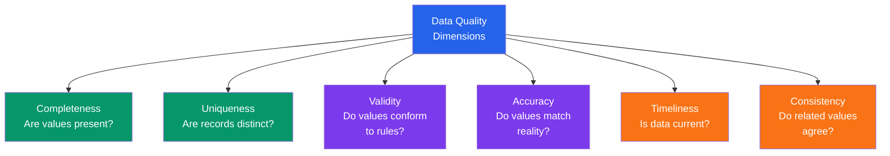

# Data Profiling

Data profiling is the first thing you do with any dataset. It takes 15 minutes and prevents 15 hours of debugging later. Profiling is not analysis — it is reconnaissance. You are not looking for insights yet. You are looking for land mines: wrong types, missing data, duplicates, impossible values, and unexpected distributions.

This page covers a systematic 15-minute profiling protocol, the data quality dimensions you must check, and automated profiling tools that do most of the work for you.

---

## The 15-Minute Profiling Protocol


```python
# profiling_protocol.py — Complete 15-minute profiling
import pandas as pd
import numpy as np
import sys

# Load dataset
df = pd.read_csv(
    "https://raw.githubusercontent.com/datasciencedojo/datasets/master/titanic.csv"
)

# ==================================================================
# MINUTE 0-2: Shape & Size
# ==================================================================
print("=" * 60)
print("STEP 1: Shape & Size (Minute 0-2)")
print("=" * 60)
print(f"Rows: {len(df):,}")
print(f"Columns: {df.shape[1]}")
print(f"Total cells: {df.size:,}")
print(f"Memory usage: {df.memory_usage(deep=True).sum() / 1024**2:.2f} MB")
print(f"\nColumn names:\n  {df.columns.tolist()}")

# ==================================================================
# MINUTE 2-4: Types & Memory
# ==================================================================
print(f"\n{'=' * 60}")
print("STEP 2: Types & Memory (Minute 2-4)")
print("=" * 60)
type_summary = pd.DataFrame({
    'dtype': df.dtypes,
    'memory_KB': df.memory_usage(deep=True)[1:] / 1024,
    'non_null': df.notna().sum(),
    'null': df.isnull().sum(),
})
print(type_summary.round(1))
print(f"\nType distribution:")
print(f"  Numeric: {len(df.select_dtypes(include='number').columns)}")
print(f"  Object:  {len(df.select_dtypes(include='object').columns)}")
print(f"  Bool:    {len(df.select_dtypes(include='bool').columns)}")

# ==================================================================
# MINUTE 4-6: Missing Data
# ==================================================================
print(f"\n{'=' * 60}")
print("STEP 3: Missing Data (Minute 4-6)")
print("=" * 60)
missing = df.isnull().sum()
missing_pct = (missing / len(df) * 100).round(1)
missing_report = pd.DataFrame({
    'missing_count': missing,
    'missing_pct': missing_pct,
}).sort_values('missing_pct', ascending=False)
missing_report = missing_report[missing_report['missing_count'] > 0]
print(missing_report)

if len(missing_report) > 0:
    print(f"\nTotal missing cells: {df.isnull().sum().sum()} "
          f"({df.isnull().sum().sum() / df.size * 100:.1f}%)")
    print(f"Columns with missing: {len(missing_report)} of {df.shape[1]}")
    print(f"Rows with ANY missing: {df.isnull().any(axis=1).sum()} "
          f"({df.isnull().any(axis=1).mean():.1%})")
else:
    print("No missing data!")

# ==================================================================
# MINUTE 6-8: Unique Values
# ==================================================================
print(f"\n{'=' * 60}")
print("STEP 4: Unique Values (Minute 6-8)")
print("=" * 60)
for col in df.columns:
    n_unique = df[col].nunique()
    pct_unique = n_unique / len(df) * 100
    likely_type = "ID/Key" if pct_unique > 90 else \
                  "Categorical" if n_unique <= 20 else \
                  "High-cardinality" if n_unique <= 100 else "Continuous"
    print(f"  {col:>15}: {n_unique:5d} unique ({pct_unique:5.1f}%) -> {likely_type}")

# ==================================================================
# MINUTE 8-11: Descriptive Statistics
# ==================================================================
print(f"\n{'=' * 60}")
print("STEP 5: Descriptive Statistics (Minute 8-11)")
print("=" * 60)

# Numeric columns
print("\nNumeric columns:")
numeric_desc = df.describe().round(2)
print(numeric_desc)

# Check for suspicious numeric values
print("\nSuspicious values check:")
for col in df.select_dtypes(include='number').columns:
    s = df[col]
    issues = []
    if s.min() == s.max():
        issues.append("CONSTANT column")
    if (s == 0).sum() / len(s) > 0.5:
        issues.append(f"{(s==0).mean():.0%} zeros")
    if s.skew() > 2:
        issues.append(f"highly right-skewed ({s.skew():.1f})")
    if s.skew() < -2:
        issues.append(f"highly left-skewed ({s.skew():.1f})")
    if len(issues) > 0:
        print(f"  {col}: {', '.join(issues)}")

# Categorical columns
print(f"\nCategorical columns:")
for col in df.select_dtypes(include='object').columns:
    vc = df[col].value_counts()
    print(f"\n  {col} ({vc.shape[0]} unique):")
    for val, count in vc.head(5).items():
        print(f"    {val}: {count} ({count/len(df)*100:.1f}%)")
    if vc.shape[0] > 5:
        print(f"    ... and {vc.shape[0] - 5} more")

# ==================================================================
# MINUTE 11-13: Samples & Outliers
# ==================================================================
print(f"\n{'=' * 60}")
print("STEP 6: Samples & Outliers (Minute 11-13)")
print("=" * 60)

# Head and tail
print("First 3 rows:")
print(df.head(3).to_string())
print(f"\nLast 3 rows:")
print(df.tail(3).to_string())

# Random sample
print(f"\nRandom sample of 3 rows:")
print(df.sample(3, random_state=42).to_string())

# Quick outlier scan
print(f"\nOutlier scan (IQR method):")
for col in df.select_dtypes(include='number').columns:
    q1, q3 = df[col].quantile([0.25, 0.75])
    iqr = q3 - q1
    lower, upper = q1 - 1.5 * iqr, q3 + 1.5 * iqr
    n_outliers = ((df[col] < lower) | (df[col] > upper)).sum()
    if n_outliers > 0:
        pct = n_outliers / len(df) * 100
        print(f"  {col}: {n_outliers} outliers ({pct:.1f}%)")

# ==================================================================
# MINUTE 13-15: Duplicates & Quality Score
# ==================================================================
print(f"\n{'=' * 60}")
print("STEP 7: Duplicates & Quality Score (Minute 13-15)")
print("=" * 60)

# Duplicates
n_exact_dupes = df.duplicated().sum()
print(f"Exact duplicate rows: {n_exact_dupes}")
if 'PassengerId' in df.columns:
    n_key_dupes = df.duplicated(subset=['PassengerId']).sum()
    print(f"Duplicate PassengerIds: {n_key_dupes}")

# Data quality score
completeness = 1 - df.isnull().sum().sum() / df.size
uniqueness = 1 - n_exact_dupes / len(df)
validity = 1  # Would need domain-specific rules

print(f"\nData Quality Score:")
print(f"  Completeness: {completeness:.1%}")
print(f"  Uniqueness:   {uniqueness:.1%}")
print(f"  Validity:     (requires domain rules)")
print(f"  Overall:      {(completeness + uniqueness) / 2:.1%}")
```

---

## Data Quality Dimensions

The six dimensions of data quality from the DAMA framework:



```python
# quality_dimensions.py — Measuring all six dimensions
import pandas as pd
import numpy as np

df = pd.read_csv(
    "https://raw.githubusercontent.com/datasciencedojo/datasets/master/titanic.csv"
)

def measure_quality(df, rules=None):
    """Compute data quality scores across all six dimensions."""
    report = {}

    # 1. Completeness: % of non-null values
    report['completeness'] = df.notna().sum().sum() / df.size

    # Per-column completeness
    col_completeness = df.notna().mean()
    report['completeness_by_col'] = col_completeness[col_completeness < 1.0]

    # 2. Uniqueness: % of distinct rows
    report['uniqueness'] = 1 - df.duplicated().sum() / len(df)

    # 3. Validity: % of values conforming to rules
    validity_checks = {}
    if rules:
        for col, rule in rules.items():
            if col in df.columns:
                valid = rule(df[col])
                validity_checks[col] = valid.mean()
    report['validity'] = validity_checks

    # 4. Consistency: cross-column checks
    consistency_checks = {}
    # Example: SibSp + Parch should not be negative
    if 'SibSp' in df.columns and 'Parch' in df.columns:
        family = df['SibSp'] + df['Parch']
        consistency_checks['family_size_non_negative'] = (family >= 0).mean()
    report['consistency'] = consistency_checks

    # 5. Timeliness: metadata check (no auto-check possible)
    report['timeliness'] = "Manual check required — when was data collected?"

    # 6. Accuracy: can only be checked against ground truth
    report['accuracy'] = "Requires external validation source"

    return report

# Define validity rules
validity_rules = {
    'Age': lambda s: s.between(0, 120) | s.isna(),
    'Fare': lambda s: s >= 0,
    'Survived': lambda s: s.isin([0, 1]),
    'Pclass': lambda s: s.isin([1, 2, 3]),
    'Sex': lambda s: s.isin(['male', 'female']),
}

quality = measure_quality(df, rules=validity_rules)

print("=== DATA QUALITY REPORT ===\n")
print(f"Completeness: {quality['completeness']:.1%}")
if len(quality['completeness_by_col']) > 0:
    print(f"  Incomplete columns:")
    for col, pct in quality['completeness_by_col'].items():
        print(f"    {col}: {pct:.1%} complete")

print(f"\nUniqueness: {quality['uniqueness']:.1%}")

print(f"\nValidity:")
for col, pct in quality['validity'].items():
    status = "PASS" if pct >= 0.99 else "WARN" if pct >= 0.95 else "FAIL"
    print(f"  [{status}] {col}: {pct:.1%} valid")

print(f"\nConsistency:")
for check, pct in quality['consistency'].items():
    status = "PASS" if pct >= 0.99 else "WARN" if pct >= 0.95 else "FAIL"
    print(f"  [{status}] {check}: {pct:.1%}")
```

---

## Automated Profiling with ydata-profiling

```python
# ydata_profiling_demo.py — Auto-generate a complete EDA report
# pip install ydata-profiling

import pandas as pd

df = pd.read_csv(
    "https://raw.githubusercontent.com/datasciencedojo/datasets/master/titanic.csv"
)

# Generate a full profiling report in one line
from ydata_profiling import ProfileReport

profile = ProfileReport(
    df,
    title="Titanic Dataset Profiling Report",
    explorative=True,
    correlations={
        "pearson": {"calculate": True},
        "spearman": {"calculate": True},
        "phi_k": {"calculate": True},     # Works for categorical too
    },
    missing_diagrams={
        "bar": True,
        "matrix": True,
        "heatmap": True,
    },
)

# Save as HTML (interactive report)
profile.to_file("titanic_profile_report.html")

# Or get key stats as a dict
description = profile.get_description()

print("=== YDATA-PROFILING OUTPUT SECTIONS ===")
sections = [
    "Overview: dataset stats, variable types, warnings",
    "Variables: per-column distributions, stats, histograms",
    "Interactions: scatter matrix, correlation heatmaps",
    "Correlations: Pearson, Spearman, Phi_k, Cramér's V",
    "Missing values: bar chart, matrix, heatmap",
    "Sample: first/last rows",
    "Duplicates: exact duplicate rows",
]
for s in sections:
    print(f"  - {s}")

print("\nReport saved to: titanic_profile_report.html")
```

::: tip When to Use ydata-profiling vs Manual EDA
Use ydata-profiling for datasets under 100K rows as a first-pass overview. It takes seconds and catches obvious issues. But always follow up with manual EDA for domain-specific checks, feature engineering ideas, and questions that require human judgment.
:::

### ydata-profiling for Large Datasets

```python
# ydata_large_datasets.py — Handling large datasets
import pandas as pd
# from ydata_profiling import ProfileReport

# For large datasets, use minimal mode
# profile = ProfileReport(
#     large_df,
#     minimal=True,         # Skip expensive computations
#     samples=None,         # Skip sample display
#     correlations=None,    # Skip correlation matrix
#     explorative=False,    # Skip advanced analysis
#     progress_bar=True,
# )

# Or sample first, profile the sample
# sample = large_df.sample(10000, random_state=42)
# profile = ProfileReport(sample, title="Sample Profile (n=10000)")

# Scale guide
print("=== YDATA-PROFILING SCALE GUIDE ===")
scale = pd.DataFrame({
    'Dataset Size': ['< 10K rows', '10K - 100K rows', '100K - 1M rows', '> 1M rows'],
    'Mode': ['Full', 'Full', 'Minimal', 'Sample first'],
    'Time': ['< 30 sec', '1-5 min', '5-15 min', 'Sample to 100K'],
    'Recommendation': [
        'Full report with all features',
        'Full report, maybe skip interactions',
        'Minimal mode, skip correlations',
        'Sample 100K rows, then minimal mode',
    ],
})
print(scale.to_string(index=False))
```

---

## Automated Profiling with Sweetviz

```python
# sweetviz_demo.py — Sweetviz for dataset comparison
# pip install sweetviz

import pandas as pd
import sweetviz as sv

df = pd.read_csv(
    "https://raw.githubusercontent.com/datasciencedojo/datasets/master/titanic.csv"
)

# Basic analysis
report = sv.analyze(df, target_feat='Survived')
report.show_html('titanic_sweetviz.html')

# Compare two datasets (e.g., train vs test)
from sklearn.model_selection import train_test_split
train, test = train_test_split(df, test_size=0.2, random_state=42)

comparison = sv.compare(train, test, target_feat='Survived')
comparison.show_html('train_vs_test_comparison.html')

# Compare subgroups
survived = df[df['Survived'] == 1]
died = df[df['Survived'] == 0]

group_compare = sv.compare(survived, died)
group_compare.show_html('survived_vs_died.html')

print("=== SWEETVIZ vs YDATA-PROFILING ===")
comparison_table = pd.DataFrame({
    'Feature': ['Auto-report', 'Dataset comparison', 'Target analysis',
                'Speed', 'Customization', 'Large datasets'],
    'ydata-profiling': ['Full HTML report', 'Manual comparison',
                         'Correlation with target', 'Slower (more thorough)',
                         'Many config options', 'Minimal mode'],
    'sweetviz': ['Full HTML report', 'Side-by-side comparison',
                  'Built-in target feature', 'Faster (lighter)',
                  'Fewer options', 'Better performance'],
})
print(comparison_table.to_string(index=False))
```

---

## Custom Profiling Function

For repeated use, build your own profiling function tailored to your domain:

```python
# custom_profiler.py — Reusable profiling function
import pandas as pd
import numpy as np
from datetime import datetime

def profile_dataset(df, name="Dataset", key_column=None, date_column=None):
    """
    Comprehensive dataset profiling in a single function call.

    Parameters:
    -----------
    df : pd.DataFrame
    name : str — dataset name for the report header
    key_column : str — expected unique identifier column
    date_column : str — datetime column for temporal checks
    """
    report = []
    report.append(f"{'=' * 60}")
    report.append(f"PROFILING REPORT: {name}")
    report.append(f"Generated: {datetime.now().strftime('%Y-%m-%d %H:%M')}")
    report.append(f"{'=' * 60}")

    # Section 1: Overview
    report.append(f"\n--- OVERVIEW ---")
    report.append(f"Rows: {len(df):,}")
    report.append(f"Columns: {df.shape[1]}")
    report.append(f"Memory: {df.memory_usage(deep=True).sum() / 1024**2:.2f} MB")

    # Section 2: Column Types
    report.append(f"\n--- COLUMN TYPES ---")
    for dtype, cols in df.columns.to_series().groupby(df.dtypes):
        report.append(f"  {dtype}: {len(cols)} columns — {cols.tolist()}")

    # Section 3: Missing Data
    report.append(f"\n--- MISSING DATA ---")
    missing = df.isnull().sum()
    if missing.sum() == 0:
        report.append("  No missing values!")
    else:
        for col in missing[missing > 0].sort_values(ascending=False).index:
            pct = missing[col] / len(df) * 100
            severity = "LOW" if pct < 5 else "MEDIUM" if pct < 30 else "HIGH"
            report.append(f"  [{severity:>6}] {col}: {missing[col]:,} ({pct:.1f}%)")

    # Section 4: Uniqueness
    report.append(f"\n--- UNIQUENESS ---")
    n_dupes = df.duplicated().sum()
    report.append(f"Exact duplicate rows: {n_dupes}")
    if key_column and key_column in df.columns:
        key_dupes = df.duplicated(subset=[key_column]).sum()
        report.append(f"Duplicate {key_column}: {key_dupes}")

    # Section 5: Numeric Summary
    numeric_cols = df.select_dtypes(include='number').columns
    if len(numeric_cols) > 0:
        report.append(f"\n--- NUMERIC SUMMARY ---")
        for col in numeric_cols:
            s = df[col].dropna()
            skew = s.skew()
            report.append(f"  {col}: range=[{s.min():.2f}, {s.max():.2f}], "
                         f"mean={s.mean():.2f}, median={s.median():.2f}, "
                         f"skew={skew:.2f}")

    # Section 6: Categorical Summary
    cat_cols = df.select_dtypes(include=['object', 'category']).columns
    if len(cat_cols) > 0:
        report.append(f"\n--- CATEGORICAL SUMMARY ---")
        for col in cat_cols:
            n_unique = df[col].nunique()
            top = df[col].value_counts().head(3)
            top_str = ', '.join([f"{v}({c})" for v, c in top.items()])
            report.append(f"  {col}: {n_unique} unique, top: {top_str}")

    # Section 7: Temporal Check
    if date_column and date_column in df.columns:
        report.append(f"\n--- TEMPORAL CHECK ---")
        dates = pd.to_datetime(df[date_column], errors='coerce')
        report.append(f"  Range: {dates.min()} to {dates.max()}")
        report.append(f"  Span: {dates.max() - dates.min()}")
        report.append(f"  Parse errors: {dates.isnull().sum() - df[date_column].isnull().sum()}")

    # Section 8: Warnings
    report.append(f"\n--- WARNINGS ---")
    warnings = []
    for col in df.columns:
        if df[col].nunique() == 1:
            warnings.append(f"  CONSTANT: {col} has only one value")
        if df[col].nunique() == len(df) and df[col].dtype == 'object':
            warnings.append(f"  UNIQUE: {col} is 100% unique (possible ID)")
        if df[col].dtype in ['float64', 'int64'] and df[col].nunique() <= 5:
            warnings.append(f"  LOW-CARDINALITY NUMERIC: {col} ({df[col].nunique()} values) — maybe categorical?")
    if not warnings:
        report.append("  No warnings.")
    for w in warnings:
        report.append(w)

    # Print report
    full_report = '\n'.join(report)
    print(full_report)
    return full_report

# Demo
df = pd.read_csv(
    "https://raw.githubusercontent.com/datasciencedojo/datasets/master/titanic.csv"
)
profile_dataset(df, name="Titanic", key_column="PassengerId")
```

---

## Profiling Quick Reference

| Check | Command | What to Look For |
|-------|---------|-----------------|
| Shape | `df.shape` | Expected row/column count |
| Types | `df.dtypes` | Numbers as objects, objects that should be numeric |
| Info | `df.info()` | Non-null counts, dtypes, memory |
| Missing | `df.isnull().sum()` | Columns with > 5% missing |
| Describe | `df.describe()` | Min/max outliers, zero std (constant) |
| Unique | `df.nunique()` | 1 unique (constant), all unique (ID) |
| Value counts | `df['col'].value_counts()` | Rare categories, unexpected values |
| Memory | `df.memory_usage(deep=True)` | Object columns consuming too much memory |
| Duplicates | `df.duplicated().sum()` | Any exact duplicate rows |
| Sample | `df.sample(5)` | "Does this look reasonable?" |

---

## Summary

| Concept | Key Takeaway |
|---------|-------------|
| 15-minute protocol | Shape, types, missing, uniques, stats, samples, duplicates — in that order |
| Quality dimensions | Completeness, uniqueness, validity, accuracy, timeliness, consistency |
| ydata-profiling | Full auto-generated HTML report; use minimal mode for > 100K rows |
| sweetviz | Best for comparing two datasets side by side |
| Custom profiler | Build a reusable function for your domain's specific checks |
| Common warnings | Constant columns, numeric IDs, low-cardinality numerics |

---

## What's Next

| Page | What You'll Learn |
|------|------------------|
| [Understanding Distributions](/eda/understanding-distributions) | Normal, log-normal, exponential, and how to test them |
| [Missing Data](/eda/missing-data) | MCAR/MAR/MNAR, imputation strategies |
| [Data Quality Validation](/eda/data-quality-validation) | Pandera, Great Expectations for systematic validation |
