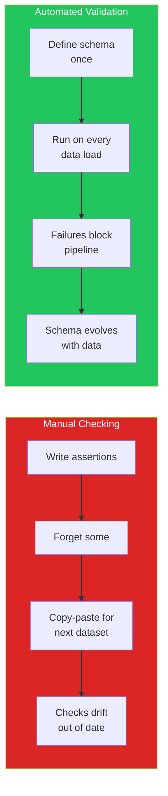
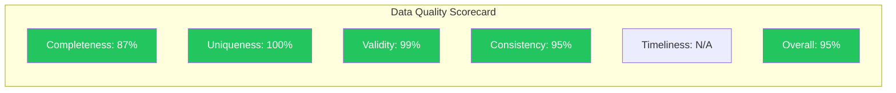

# Data Quality Validation

Manual data quality checks do not scale. The first time you validate a dataset, you write ad-hoc assertions. The second time, you copy-paste them. By the fifth time, you have missed half the checks because you forgot which ones you wrote. Data quality validation frameworks solve this by letting you define your expectations as reusable, testable schemas. If the data changes — new column, new range, new distribution — the validation fails before bad data corrupts your analysis.

This page covers two major validation frameworks (Pandera and Great Expectations), how to build data quality scorecards, and how to integrate validation into data pipelines.

---

## Why Automated Validation Matters



---

## Pandera: Schema-Based Validation

Pandera integrates tightly with pandas and uses a declarative schema approach.

```python
# pandera_validation.py — Complete Pandera example
# pip install pandera
import pandas as pd
import numpy as np
import pandera as pa
from pandera import Column, Check, DataFrameSchema

# Define the expected schema for a customer dataset
customer_schema = DataFrameSchema(
    columns={
        "customer_id": Column(
            int,
            Check.gt(0),                    # Must be positive
            Check.is_unique(),               # Must be unique (primary key)
            nullable=False,
        ),
        "name": Column(
            str,
            Check.str_length(min_value=2, max_value=100),
            nullable=False,
        ),
        "email": Column(
            str,
            Check.str_matches(r'^[a-zA-Z0-9._%+-]+@[a-zA-Z0-9.-]+\.[a-zA-Z]{2,}$'),
            nullable=False,
        ),
        "age": Column(
            int,
            Check.in_range(18, 120),         # Valid age range
            nullable=True,                    # Age can be missing
        ),
        "revenue": Column(
            float,
            Check.ge(0),                      # Non-negative
            nullable=False,
        ),
        "signup_date": Column(
            "datetime64[ns]",
            Check.less_than_or_equal_to(pd.Timestamp.now()),  # Not in future
            nullable=False,
        ),
        "status": Column(
            str,
            Check.isin(["active", "inactive", "pending", "suspended"]),
            nullable=False,
        ),
        "country": Column(
            str,
            Check.str_length(min_value=2),
            nullable=True,
        ),
    },
    coerce=True,  # Attempt type coercion before validation
    strict=False,  # Allow extra columns
)

# Create test data (some valid, some invalid)
np.random.seed(42)
n = 100
valid_data = pd.DataFrame({
    "customer_id": range(1, n + 1),
    "name": [f"Customer_{i}" for i in range(1, n + 1)],
    "email": [f"customer{i}@example.com" for i in range(1, n + 1)],
    "age": np.random.randint(20, 80, n),
    "revenue": np.random.lognormal(5, 1, n),
    "signup_date": pd.date_range("2023-01-01", periods=n, freq="D"),
    "status": np.random.choice(["active", "inactive", "pending"], n),
    "country": np.random.choice(["US", "UK", "DE", "FR", None], n),
})

# Validate good data
print("=== PANDERA VALIDATION: GOOD DATA ===")
try:
    validated = customer_schema.validate(valid_data)
    print(f"Validation PASSED! {len(validated)} rows validated.")
except pa.errors.SchemaError as e:
    print(f"Validation FAILED: {e}")

# Create invalid data
bad_data = valid_data.copy()
bad_data.loc[5, 'age'] = 150           # Age out of range
bad_data.loc[10, 'email'] = 'not_an_email'  # Invalid email
bad_data.loc[15, 'revenue'] = -100     # Negative revenue
bad_data.loc[20, 'status'] = 'deleted' # Invalid status
bad_data.loc[25, 'customer_id'] = 1    # Duplicate ID

print(f"\n=== PANDERA VALIDATION: BAD DATA ===")
try:
    validated = customer_schema.validate(bad_data, lazy=True)
except pa.errors.SchemaErrors as e:
    print(f"Validation FAILED with {len(e.failure_cases)} errors:\n")
    print(e.failure_cases.to_string())
```

### Pandera Custom Checks

```python
# pandera_custom.py — Advanced validation patterns
import pandas as pd
import numpy as np
import pandera as pa
from pandera import Column, Check, DataFrameSchema

# Custom check: column A + column B must equal column C
def sum_check(df):
    return (df['quantity'] * df['unit_price'] - df['total']).abs() < 0.01

# Custom check: date ordering
def date_order_check(df):
    return df['ship_date'] >= df['order_date']

order_schema = DataFrameSchema(
    columns={
        "order_id": Column(int, Check.gt(0), Check.is_unique()),
        "order_date": Column("datetime64[ns]"),
        "ship_date": Column("datetime64[ns]", nullable=True),
        "quantity": Column(int, Check.gt(0)),
        "unit_price": Column(float, Check.gt(0)),
        "total": Column(float, Check.gt(0)),
    },
    checks=[
        Check(sum_check, error="quantity * unit_price != total"),
        Check(
            lambda df: df[df['ship_date'].notna()].pipe(date_order_check),
            error="ship_date before order_date"
        ),
    ]
)

# Test data
orders = pd.DataFrame({
    "order_id": [1, 2, 3, 4],
    "order_date": pd.to_datetime(["2024-01-01", "2024-01-02", "2024-01-03", "2024-01-04"]),
    "ship_date": pd.to_datetime(["2024-01-05", "2024-01-03", None, "2024-01-02"]),
    "quantity": [2, 3, 1, 5],
    "unit_price": [10.0, 20.0, 15.0, 8.0],
    "total": [20.0, 60.0, 15.0, 40.0],
})

print("=== CUSTOM PANDERA CHECKS ===")
try:
    validated = order_schema.validate(orders, lazy=True)
    print("All checks passed!")
except pa.errors.SchemaErrors as e:
    print(f"Errors found:\n{e.failure_cases.to_string()}")
```

---

## Great Expectations: Suite-Based Validation

Great Expectations is more heavyweight but provides rich reporting and data docs.

```python
# great_expectations_demo.py — Core concepts
# pip install great-expectations
# Note: This demonstrates the API patterns without requiring full GE setup

import pandas as pd
import numpy as np

# Simulate Great Expectations-style validation
# (Using plain Python to show the concepts)

class SimpleExpectation:
    """Simplified Great Expectations-style validator."""

    def __init__(self, df):
        self.df = df
        self.results = []

    def expect_column_to_exist(self, column):
        success = column in self.df.columns
        self.results.append({
            'expectation': f'Column "{column}" exists',
            'success': success,
        })
        return self

    def expect_column_values_to_not_be_null(self, column, mostly=1.0):
        if column not in self.df.columns:
            self.results.append({
                'expectation': f'"{column}" not null',
                'success': False,
                'detail': 'Column missing',
            })
            return self

        non_null_pct = self.df[column].notna().mean()
        success = non_null_pct >= mostly
        self.results.append({
            'expectation': f'"{column}" not null (>= {mostly:.0%})',
            'success': success,
            'detail': f'Actual: {non_null_pct:.1%}',
        })
        return self

    def expect_column_values_to_be_between(self, column, min_val, max_val):
        values = self.df[column].dropna()
        success = values.between(min_val, max_val).all()
        violations = (~values.between(min_val, max_val)).sum()
        self.results.append({
            'expectation': f'"{column}" in [{min_val}, {max_val}]',
            'success': success,
            'detail': f'{violations} violations',
        })
        return self

    def expect_column_values_to_be_unique(self, column):
        n_dupes = self.df[column].duplicated().sum()
        self.results.append({
            'expectation': f'"{column}" is unique',
            'success': n_dupes == 0,
            'detail': f'{n_dupes} duplicates',
        })
        return self

    def expect_column_values_to_be_in_set(self, column, value_set):
        values = self.df[column].dropna()
        invalid = ~values.isin(value_set)
        self.results.append({
            'expectation': f'"{column}" in {value_set}',
            'success': invalid.sum() == 0,
            'detail': f'{invalid.sum()} invalid values',
        })
        return self

    def expect_table_row_count_to_be_between(self, min_val, max_val):
        n = len(self.df)
        self.results.append({
            'expectation': f'Row count in [{min_val}, {max_val}]',
            'success': min_val <= n <= max_val,
            'detail': f'Actual: {n}',
        })
        return self

    def report(self):
        passed = sum(1 for r in self.results if r['success'])
        failed = sum(1 for r in self.results if not r['success'])
        print(f"\n=== VALIDATION REPORT ===")
        print(f"Passed: {passed}, Failed: {failed}, Total: {len(self.results)}")
        print(f"Success rate: {passed/len(self.results):.0%}\n")

        for r in self.results:
            status = "PASS" if r['success'] else "FAIL"
            detail = r.get('detail', '')
            print(f"  [{status}] {r['expectation']}: {detail}")

        return passed == len(self.results)

# Build an expectation suite
np.random.seed(42)
df = pd.DataFrame({
    'user_id': range(1, 1001),
    'age': np.random.randint(16, 90, 1000),
    'email': [f'user{i}@example.com' for i in range(1000)],
    'plan': np.random.choice(['free', 'basic', 'pro', 'enterprise'], 1000),
    'revenue': np.random.lognormal(3, 1, 1000),
})
# Inject some issues
df.loc[500, 'age'] = 150  # Invalid age
df.loc[501, 'plan'] = 'premium'  # Invalid plan

print("=== GREAT EXPECTATIONS-STYLE VALIDATION ===")
suite = SimpleExpectation(df)
(suite
    .expect_table_row_count_to_be_between(500, 5000)
    .expect_column_to_exist('user_id')
    .expect_column_to_exist('age')
    .expect_column_to_exist('email')
    .expect_column_values_to_be_unique('user_id')
    .expect_column_values_to_not_be_null('age', mostly=0.99)
    .expect_column_values_to_be_between('age', 18, 120)
    .expect_column_values_to_be_in_set('plan', ['free', 'basic', 'pro', 'enterprise'])
    .expect_column_values_to_not_be_null('revenue')
    .expect_column_values_to_be_between('revenue', 0, 100000)
)
all_passed = suite.report()
```

---

## Data Quality Scorecards

```python
# quality_scorecard.py — Comprehensive quality measurement
import pandas as pd
import numpy as np
from datetime import datetime

def build_quality_scorecard(df, rules=None):
    """
    Build a data quality scorecard across all dimensions.
    Returns a score from 0-100 for each dimension and overall.
    """
    scores = {}

    # 1. Completeness (0-100): % of non-null values
    completeness = df.notna().sum().sum() / df.size * 100
    scores['Completeness'] = round(completeness, 1)

    # 2. Uniqueness (0-100): % non-duplicate rows
    uniqueness = (1 - df.duplicated().sum() / len(df)) * 100
    scores['Uniqueness'] = round(uniqueness, 1)

    # 3. Validity (0-100): % passing validity rules
    if rules:
        validity_scores = []
        for col, rule_fn in rules.items():
            if col in df.columns:
                valid = rule_fn(df[col]).mean() * 100
                validity_scores.append(valid)
        scores['Validity'] = round(np.mean(validity_scores), 1) if validity_scores else 100.0
    else:
        scores['Validity'] = None

    # 4. Consistency (0-100): cross-column consistency checks
    consistency_checks = []
    # Check: numeric columns do not have impossible values
    for col in df.select_dtypes(include='number').columns:
        # Not all NaN
        if df[col].notna().any():
            consistency_checks.append(df[col].notna().mean())
    scores['Consistency'] = round(np.mean(consistency_checks) * 100, 1) if consistency_checks else 100.0

    # 5. Timeliness: check if dates are recent
    date_cols = df.select_dtypes(include='datetime64').columns
    if len(date_cols) > 0:
        latest = df[date_cols].max().max()
        days_old = (pd.Timestamp.now() - latest).days if pd.notna(latest) else 999
        timeliness = max(0, 100 - days_old)  # Lose 1 point per day old
        scores['Timeliness'] = round(min(timeliness, 100), 1)
    else:
        scores['Timeliness'] = None

    # Overall score (weighted average of available dimensions)
    available = {k: v for k, v in scores.items() if v is not None}
    scores['Overall'] = round(np.mean(list(available.values())), 1)

    return scores

# Example usage
np.random.seed(42)
df = pd.read_csv(
    "https://raw.githubusercontent.com/datasciencedojo/datasets/master/titanic.csv"
)

validity_rules = {
    'Age': lambda s: s.between(0, 120) | s.isna(),
    'Fare': lambda s: s >= 0,
    'Survived': lambda s: s.isin([0, 1]),
    'Pclass': lambda s: s.isin([1, 2, 3]),
}

scorecard = build_quality_scorecard(df, rules=validity_rules)

print("=== DATA QUALITY SCORECARD ===\n")
print(f"Dataset: Titanic ({len(df)} rows, {df.shape[1]} columns)")
print(f"Assessment date: {datetime.now().strftime('%Y-%m-%d')}\n")

for dimension, score in scorecard.items():
    if score is None:
        bar = "N/A"
        grade = "-"
    else:
        grade = 'A' if score >= 90 else 'B' if score >= 80 else 'C' if score >= 70 else 'D' if score >= 60 else 'F'
        bar_len = int(score / 5)
        bar = '#' * bar_len + '.' * (20 - bar_len)

    score_str = f"{score:.1f}" if score is not None else "N/A"
    print(f"  {dimension:>15}: [{bar}] {score_str:>6} ({grade})")
```

### Quality Scorecard Dashboard



---

## Validation in Data Pipelines

```python
# pipeline_validation.py — Integrating validation into ETL
import pandas as pd
import numpy as np
from datetime import datetime

class DataValidationPipeline:
    """Validate data at each stage of an ETL pipeline."""

    def __init__(self, name):
        self.name = name
        self.stage_results = []

    def validate_stage(self, df, stage_name, checks):
        """Run checks for a pipeline stage."""
        results = {'stage': stage_name, 'timestamp': datetime.now(),
                   'rows': len(df), 'checks': []}

        all_passed = True
        for check_name, check_fn in checks.items():
            try:
                passed = check_fn(df)
                results['checks'].append({
                    'name': check_name,
                    'passed': passed,
                })
                if not passed:
                    all_passed = False
            except Exception as e:
                results['checks'].append({
                    'name': check_name,
                    'passed': False,
                    'error': str(e),
                })
                all_passed = False

        results['all_passed'] = all_passed
        self.stage_results.append(results)

        # Print results
        status = "PASSED" if all_passed else "FAILED"
        print(f"\n[{status}] Stage: {stage_name} ({len(df)} rows)")
        for check in results['checks']:
            icon = "PASS" if check['passed'] else "FAIL"
            print(f"  [{icon}] {check['name']}")

        return all_passed

    def report(self):
        print(f"\n{'=' * 50}")
        print(f"Pipeline: {self.name}")
        print(f"{'=' * 50}")
        for result in self.stage_results:
            status = "PASS" if result['all_passed'] else "FAIL"
            print(f"  [{status}] {result['stage']}: {result['rows']} rows, "
                  f"{sum(1 for c in result['checks'] if c['passed'])}/"
                  f"{len(result['checks'])} checks passed")

# Example pipeline
np.random.seed(42)

# Simulate raw data
raw_data = pd.DataFrame({
    'id': range(1, 1001),
    'value': np.random.normal(100, 25, 1000),
    'category': np.random.choice(['A', 'B', 'C', None], 1000, p=[0.4, 0.3, 0.25, 0.05]),
    'date': pd.date_range('2024-01-01', periods=1000, freq='h'),
})

pipeline = DataValidationPipeline("Customer Data ETL")

# Stage 1: Raw data validation
pipeline.validate_stage(raw_data, "Raw Data Ingestion", {
    "row count >= 100": lambda df: len(df) >= 100,
    "id is unique": lambda df: not df['id'].duplicated().any(),
    "value is numeric": lambda df: pd.api.types.is_numeric_dtype(df['value']),
    "category completeness > 90%": lambda df: df['category'].notna().mean() > 0.9,
})

# Stage 2: After cleaning
cleaned = raw_data.copy()
cleaned['category'].fillna('Unknown', inplace=True)
cleaned['value'] = cleaned['value'].clip(0, 200)

pipeline.validate_stage(cleaned, "After Cleaning", {
    "no nulls in category": lambda df: df['category'].notna().all(),
    "value in [0, 200]": lambda df: df['value'].between(0, 200).all(),
    "row count unchanged": lambda df: len(df) == len(raw_data),
    "id still unique": lambda df: not df['id'].duplicated().any(),
})

# Stage 3: After transformation
transformed = cleaned.groupby('category').agg(
    count=('id', 'count'),
    mean_value=('value', 'mean'),
    min_date=('date', 'min'),
    max_date=('date', 'max'),
).reset_index()

pipeline.validate_stage(transformed, "After Aggregation", {
    "categories complete": lambda df: set(df['category']) >= {'A', 'B', 'C'},
    "counts sum to original": lambda df: df['count'].sum() == len(cleaned),
    "mean values reasonable": lambda df: df['mean_value'].between(50, 150).all(),
})

pipeline.report()
```

---

## Pandera vs Great Expectations

| Feature | Pandera | Great Expectations |
|---------|---------|-------------------|
| Learning curve | Low (pandas-native) | High (full framework) |
| Schema definition | Python decorators/classes | YAML/JSON + Python |
| DataFrame support | pandas, polars, Spark (partial) | pandas, Spark, SQL |
| CI/CD integration | Simple (pytest) | Rich (data docs, stores) |
| Data docs | None (use pytest output) | Beautiful HTML reports |
| Best for | Single-team validation | Multi-team data contracts |
| Install size | Small | Large |

::: tip Start with Pandera, Graduate to Great Expectations
For a single analyst or small team, Pandera gives you 80% of the value at 20% of the complexity. Move to Great Expectations when you need shared data documentation, multi-team data contracts, or enterprise data governance features.
:::

---

## Summary

| Concept | Key Takeaway |
|---------|-------------|
| Automated validation | Define expectations once, run on every data load |
| Pandera | Lightweight, pandas-native schema validation |
| Great Expectations | Full-featured framework with data docs and pipeline integration |
| Quality scorecards | Quantify data quality across 6 dimensions (completeness, uniqueness, validity, accuracy, timeliness, consistency) |
| Pipeline validation | Validate at ingestion, after cleaning, and after transformation |
| Data contracts | Shared schemas between data producers and consumers |

---

## What's Next

| Page | What You'll Learn |
|------|------------------|
| [Data Cleaning — Edge Cases](/eda/data-cleaning-edge-cases) | The 20 hardest data cleaning problems |
| [Missing Data](/eda/missing-data) | MCAR/MAR/MNAR and imputation |
| [Data Profiling](/eda/data-profiling) | First 15 minutes with any dataset |
