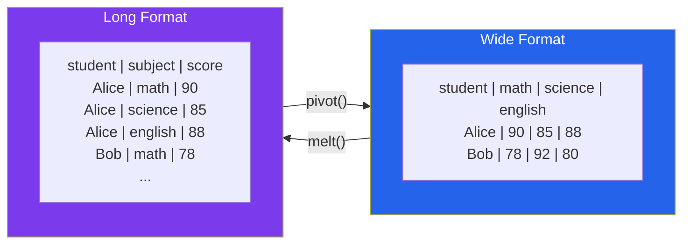
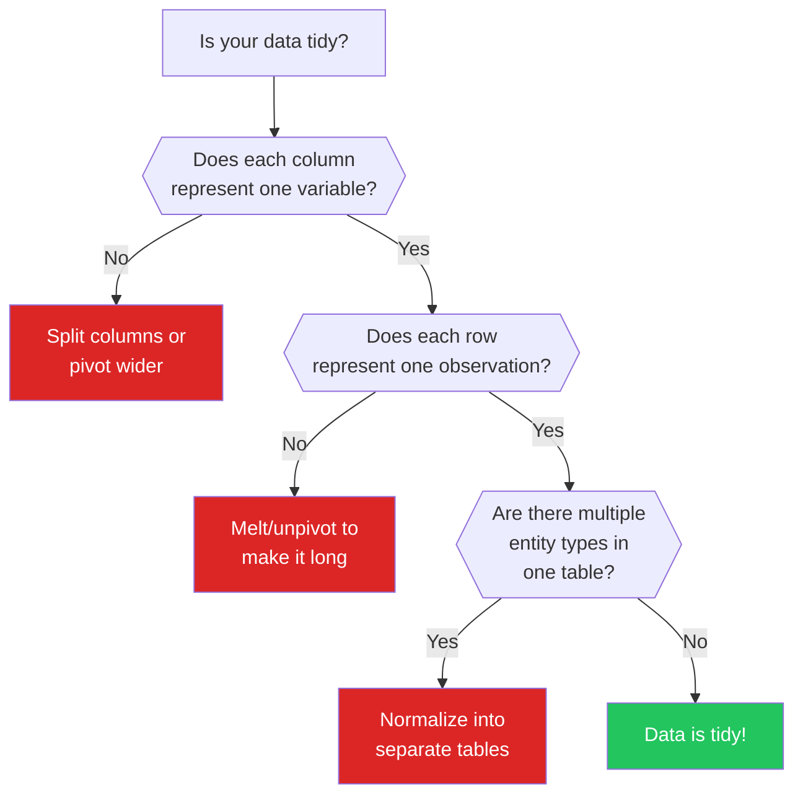

# Data Shapes & Structures

The shape of your data determines what questions you can easily answer. Wide data is great for human reading but terrible for plotting. Long data is perfect for `seaborn` but confusing for spreadsheet users. Nested JSON is how APIs deliver data but impossible to analyze without flattening. Understanding these shapes — and how to convert between them — is a core EDA skill.

---

## Wide vs Long Format



```python
# wide_vs_long.py — Converting between formats
import pandas as pd

# Wide format: one row per student, one column per subject
wide = pd.DataFrame({
    'student': ['Alice', 'Bob', 'Carol', 'David'],
    'math': [90, 78, 95, 82],
    'science': [85, 92, 88, 76],
    'english': [88, 80, 91, 85],
    'history': [92, 75, 87, 90],
})

print("=== WIDE FORMAT ===")
print(wide)
print(f"Shape: {wide.shape} (4 students x 5 columns)")

# Convert to long format
long = wide.melt(
    id_vars=['student'],
    value_vars=['math', 'science', 'english', 'history'],
    var_name='subject',
    value_name='score',
)
print(f"\n=== LONG FORMAT ===")
print(long)
print(f"Shape: {long.shape} (16 rows x 3 columns)")

# Convert back to wide
back_to_wide = long.pivot(
    index='student',
    columns='subject',
    values='score',
).reset_index()
print(f"\n=== BACK TO WIDE ===")
print(back_to_wide)

# When to use which format
print("\n=== WHEN TO USE EACH FORMAT ===")
guidelines = [
    ("Wide", "Human reading, Excel, summary tables"),
    ("Wide", "Each column is a different measurement type"),
    ("Wide", "Features for ML models (one row per observation)"),
    ("Long", "Plotting with seaborn/ggplot (faceting, hue)"),
    ("Long", "Repeated measures / time series per subject"),
    ("Long", "Statistical tests (ANOVA, mixed models)"),
    ("Long", "Database storage (normalized tables)"),
]
for fmt, use_case in guidelines:
    print(f"  {fmt:>5}: {use_case}")
```

::: tip The Plotting Rule
If you need to pass `hue`, `col`, or `style` in seaborn, you need long format. If your plot has one line/bar per column, wide format works. When in doubt, go long — it is easier to aggregate long data than to unpivot wide data.
:::

---

## Tidy Data Principles

Hadley Wickham's tidy data principles (2014) give a formal definition of "well-structured" data:

```python
# tidy_data.py — The three rules of tidy data
import pandas as pd

# RULE 1: Each variable forms a column
# RULE 2: Each observation forms a row
# RULE 3: Each type of observational unit forms a table

# MESSY: Variables stored in rows
messy1 = pd.DataFrame({
    'country': ['USA', 'USA', 'Canada', 'Canada'],
    'metric': ['population', 'gdp', 'population', 'gdp'],
    'value': [331_000_000, 21_400_000_000, 38_000_000, 1_600_000_000],
})
print("=== MESSY: Variables in Rows ===")
print(messy1)

# TIDY: Each variable is a column
tidy1 = messy1.pivot(index='country', columns='metric', values='value').reset_index()
print(f"\n=== TIDY: Each Variable is a Column ===")
print(tidy1)

# MESSY: Multiple variables in one column
messy2 = pd.DataFrame({
    'patient': ['P001', 'P002', 'P003'],
    'bp_reading': ['120/80', '140/90', '110/70'],
})
print(f"\n=== MESSY: Multiple Variables in One Column ===")
print(messy2)

# TIDY: Split into separate columns
tidy2 = messy2.copy()
tidy2[['systolic', 'diastolic']] = tidy2['bp_reading'].str.split('/', expand=True).astype(int)
tidy2 = tidy2.drop(columns='bp_reading')
print(f"\n=== TIDY: Separate Columns ===")
print(tidy2)

# MESSY: Multiple observational units in one table
messy3 = pd.DataFrame({
    'order_id': [1, 1, 2, 2],
    'product': ['Widget', 'Gadget', 'Widget', 'Doohickey'],
    'quantity': [2, 1, 5, 3],
    'customer_name': ['Alice', 'Alice', 'Bob', 'Bob'],
    'customer_email': ['alice@ex.com', 'alice@ex.com', 'bob@ex.com', 'bob@ex.com'],
})
print(f"\n=== MESSY: Mixed Observational Units ===")
print(messy3)

# TIDY: Separate into two tables
orders = messy3[['order_id', 'product', 'quantity']].copy()
customers = messy3[['order_id', 'customer_name', 'customer_email']].drop_duplicates(
    subset='order_id'
)
print(f"\n=== TIDY: Separate Tables ===")
print("Orders:")
print(orders)
print("\nCustomers:")
print(customers)
```

### The Tidy Data Decision Flowchart



---

## Reshaping Operations

```python
# reshaping.py — Complete guide to pandas reshaping
import pandas as pd
import numpy as np

# Sample data: quarterly revenue by region
df = pd.DataFrame({
    'region': ['North', 'North', 'North', 'North',
               'South', 'South', 'South', 'South'],
    'quarter': ['Q1', 'Q2', 'Q3', 'Q4'] * 2,
    'revenue': [100, 120, 115, 140, 80, 95, 90, 110],
    'costs': [60, 70, 65, 80, 50, 55, 52, 65],
})

print("=== ORIGINAL DATA (Long) ===")
print(df)

# 1. PIVOT: Long -> Wide (single value column)
pivoted = df.pivot(index='region', columns='quarter', values='revenue')
print(f"\n=== PIVOT (Revenue Only) ===")
print(pivoted)

# 2. PIVOT_TABLE: Long -> Wide with aggregation
# Handles duplicates by aggregating
df_dupes = pd.concat([df, df.iloc[:2]])  # Add duplicates
pivoted_agg = df_dupes.pivot_table(
    index='region', columns='quarter', values='revenue',
    aggfunc='mean'
)
print(f"\n=== PIVOT_TABLE (with aggregation) ===")
print(pivoted_agg)

# 3. MELT: Wide -> Long
wide_df = pd.DataFrame({
    'city': ['NYC', 'LA', 'Chicago'],
    'jan_temp': [33, 58, 25],
    'feb_temp': [35, 60, 28],
    'mar_temp': [42, 62, 38],
})
melted = wide_df.melt(
    id_vars='city',
    var_name='month',
    value_name='temperature'
)
print(f"\n=== MELT: Wide -> Long ===")
print(f"Wide shape: {wide_df.shape}")
print(melted)
print(f"Long shape: {melted.shape}")

# 4. STACK / UNSTACK: For MultiIndex manipulation
multi = df.set_index(['region', 'quarter'])
stacked = multi.stack()
print(f"\n=== STACK (columns -> rows in MultiIndex) ===")
print(stacked.head(8))

unstacked = stacked.unstack(level='quarter')
print(f"\n=== UNSTACK (rows -> columns) ===")
print(unstacked)

# 5. CROSSTAB: Frequency table
np.random.seed(42)
survey = pd.DataFrame({
    'gender': np.random.choice(['M', 'F'], 100),
    'product': np.random.choice(['A', 'B', 'C'], 100),
})
ct = pd.crosstab(survey['gender'], survey['product'], margins=True)
print(f"\n=== CROSSTAB ===")
print(ct)
```

---

## Hierarchical & Nested Data

```python
# hierarchical_data.py — Working with nested structures
import pandas as pd
import json

# Nested JSON from an API (common in web data)
api_response = {
    "users": [
        {
            "id": 1,
            "name": "Alice",
            "address": {
                "street": "123 Main St",
                "city": "New York",
                "state": "NY",
                "coordinates": {"lat": 40.7128, "lon": -74.0060}
            },
            "orders": [
                {"order_id": 101, "total": 59.99, "items": ["Widget", "Gadget"]},
                {"order_id": 102, "total": 129.99, "items": ["Doohickey"]},
            ]
        },
        {
            "id": 2,
            "name": "Bob",
            "address": {
                "street": "456 Oak Ave",
                "city": "Los Angeles",
                "state": "CA",
                "coordinates": {"lat": 34.0522, "lon": -118.2437}
            },
            "orders": [
                {"order_id": 201, "total": 24.99, "items": ["Widget"]},
            ]
        },
    ]
}

# Flatten nested JSON
print("=== FLATTENING NESTED JSON ===")

# Level 1: Basic normalization
df_flat = pd.json_normalize(api_response['users'])
print(f"\nBasic json_normalize:")
print(df_flat.columns.tolist())

# Level 2: Flatten including nested lists
df_orders = pd.json_normalize(
    api_response['users'],
    record_path='orders',
    meta=['id', 'name', ['address', 'city']],
    meta_prefix='user_',
)
print(f"\nFlattened with orders:")
print(df_orders)

# Level 3: Explode lists within columns
df_items = df_orders.explode('items')
print(f"\nExploded items:")
print(df_items)

# Reconstruct hierarchy for analysis
print(f"\n=== AGGREGATING BACK UP ===")
user_summary = df_orders.groupby('user_name').agg(
    total_orders=('order_id', 'count'),
    total_spent=('total', 'sum'),
    avg_order=('total', 'mean'),
).round(2)
print(user_summary)
```

---

## Time-Indexed Data

```python
# time_indexed.py — Time-series specific structures
import pandas as pd
import numpy as np

np.random.seed(42)

# Panel data: multiple entities over time
entities = ['Store_A', 'Store_B', 'Store_C']
dates = pd.date_range('2025-01-01', periods=365, freq='D')

panels = []
for store in entities:
    base = np.random.uniform(500, 2000)
    trend = np.linspace(0, 200, 365)
    noise = np.random.normal(0, 100, 365)
    seasonality = 300 * np.sin(2 * np.pi * np.arange(365) / 365)
    revenue = base + trend + seasonality + noise
    panels.append(pd.DataFrame({
        'store': store,
        'date': dates,
        'revenue': revenue.clip(0),
        'customers': (revenue / 20 + np.random.normal(0, 5, 365)).clip(0).astype(int),
    }))

df = pd.concat(panels, ignore_index=True)

print("=== PANEL DATA (Multiple Entities x Time) ===")
print(f"Shape: {df.shape}")
print(f"Entities: {df['store'].nunique()}")
print(f"Time range: {df['date'].min()} to {df['date'].max()}")

# Set proper time index
df_indexed = df.set_index(['store', 'date'])
print(f"\nMultiIndex structure:")
print(df_indexed.head(10))

# Access patterns for panel data
print(f"\n--- Access Single Entity ---")
store_a = df[df['store'] == 'Store_A'].set_index('date')
print(f"Store A shape: {store_a.shape}")
print(f"Store A monthly revenue:\n{store_a['revenue'].resample('MS').sum().head()}")

# Resampling
print(f"\n--- Resampling ---")
monthly = df.groupby('store').resample('MS', on='date')['revenue'].sum().reset_index()
print(monthly.head(9))

# Rolling statistics per entity
print(f"\n--- Rolling Statistics ---")
for store in entities:
    mask = df['store'] == store
    df.loc[mask, 'revenue_7d_avg'] = (
        df.loc[mask, 'revenue'].rolling(7).mean()
    )
print(df[['store', 'date', 'revenue', 'revenue_7d_avg']].head(10))
```

---

## Sparse Data

```python
# sparse_data.py — Working with mostly-zero data
import pandas as pd
import numpy as np
from scipy import sparse

np.random.seed(42)

# User-item interaction matrix (e-commerce/recommendations)
n_users = 10000
n_items = 5000
n_interactions = 50000  # Only 0.1% of cells are filled!

user_ids = np.random.randint(0, n_users, n_interactions)
item_ids = np.random.randint(0, n_items, n_interactions)
ratings = np.random.randint(1, 6, n_interactions)

# Dense representation (BAD for sparse data)
print("=== SPARSE DATA ANALYSIS ===")
print(f"Matrix dimensions: {n_users} x {n_items} = {n_users * n_items:,} cells")
print(f"Non-zero entries: {n_interactions:,}")
print(f"Sparsity: {(1 - n_interactions / (n_users * n_items)) * 100:.2f}%")

dense_memory = n_users * n_items * 8  # float64
sparse_memory = n_interactions * (8 + 4 + 4)  # value + row_idx + col_idx
print(f"\nDense memory: {dense_memory / 1024**2:.1f} MB")
print(f"Sparse memory: {sparse_memory / 1024**2:.1f} MB")
print(f"Savings: {(1 - sparse_memory / dense_memory) * 100:.1f}%")

# Create sparse matrix
sparse_matrix = sparse.csr_matrix(
    (ratings, (user_ids, item_ids)),
    shape=(n_users, n_items)
)

# EDA on sparse data
print(f"\n--- Per-User Statistics ---")
items_per_user = np.diff(sparse_matrix.indptr)
print(f"Items rated per user: mean={items_per_user.mean():.1f}, "
      f"median={np.median(items_per_user):.0f}, max={items_per_user.max()}")

users_per_item = sparse_matrix.getnnz(axis=0)
print(f"Users per item: mean={users_per_item.mean():.1f}, "
      f"median={np.median(users_per_item):.0f}, max={users_per_item.max()}")

# Distribution of ratings
print(f"\n--- Rating Distribution ---")
from collections import Counter
rating_dist = Counter(sparse_matrix.data)
for rating in sorted(rating_dist):
    count = rating_dist[rating]
    pct = count / len(sparse_matrix.data) * 100
    bar = '#' * int(pct)
    print(f"  {rating}: {count:6d} ({pct:5.1f}%) {bar}")
```

---

## Graph / Network Data

```python
# graph_data.py — Network data EDA
import numpy as np
import pandas as pd

np.random.seed(42)

# Social network as edge list
n_users = 100
n_edges = 300

edges = pd.DataFrame({
    'source': np.random.randint(0, n_users, n_edges),
    'target': np.random.randint(0, n_users, n_edges),
    'weight': np.random.exponential(1, n_edges),
})
# Remove self-loops
edges = edges[edges['source'] != edges['target']].reset_index(drop=True)

print("=== GRAPH/NETWORK DATA EDA ===")
print(f"Nodes: {n_users}")
print(f"Edges: {len(edges)}")
print(f"Possible edges: {n_users * (n_users - 1)}")
print(f"Density: {len(edges) / (n_users * (n_users - 1)):.3f}")

# Degree distribution
all_nodes = pd.concat([edges['source'], edges['target']])
degree = all_nodes.value_counts()
print(f"\n--- Degree Distribution ---")
print(f"Mean degree: {degree.mean():.1f}")
print(f"Median degree: {degree.median():.1f}")
print(f"Max degree: {degree.max()} (hub node)")
print(f"Min degree: {degree.min()}")
print(f"Isolated nodes: {n_users - degree.index.nunique()}")

# Top connected nodes
print(f"\nTop 5 most connected nodes:")
for node, deg in degree.head(5).items():
    print(f"  Node {node}: {deg} connections")

# Edge weight statistics
print(f"\n--- Edge Weights ---")
print(f"Mean weight: {edges['weight'].mean():.2f}")
print(f"Median weight: {edges['weight'].median():.2f}")
print(f"Std: {edges['weight'].std():.2f}")
```

---

## Data Shape Comparison Table

| Structure | When to Use | pandas Representation | Key Operations |
|-----------|-------------|----------------------|----------------|
| Wide | Human reading, ML features | Regular DataFrame | `pivot()` |
| Long | Plotting, statistical tests | Melted DataFrame | `melt()` |
| Tidy | All analysis (gold standard) | Each variable = column | Wickham's 3 rules |
| Hierarchical | API data, configs | `json_normalize()` | `explode()` |
| Time-indexed | Time series | `DatetimeIndex` | `resample()`, `rolling()` |
| Panel | Entity x Time | `MultiIndex` | `groupby().resample()` |
| Sparse | Recommendations, text | `scipy.sparse` | `csr_matrix` |
| Graph/Network | Social, knowledge graphs | Edge list DataFrame | Degree analysis |

---

## Summary

| Concept | Key Takeaway |
|---------|-------------|
| Wide vs Long | Wide for reading, long for plotting and stats |
| Tidy data | Each variable = column, each observation = row, each entity = table |
| Reshaping | `melt()` widens-to-long, `pivot()` longs-to-wide, `pivot_table()` handles duplicates |
| Nested data | `json_normalize()` + `explode()` flatten any JSON structure |
| Panel data | MultiIndex with entity + time, use `groupby().resample()` |
| Sparse data | Use `scipy.sparse` when > 90% zeros — 100x memory savings |
| Graph data | Edge list is the standard format; compute degree distributions first |

---

## What's Next

| Page | What You'll Learn |
|------|------------------|
| [Data Collection](/eda/data-collection) | Web scraping, APIs, DB connections, file formats |
| [Data Profiling](/eda/data-profiling) | First 15 minutes with any dataset |
| [Data Cleaning — Categories](/eda/data-cleaning-categories) | Standardizing messy categorical data |
