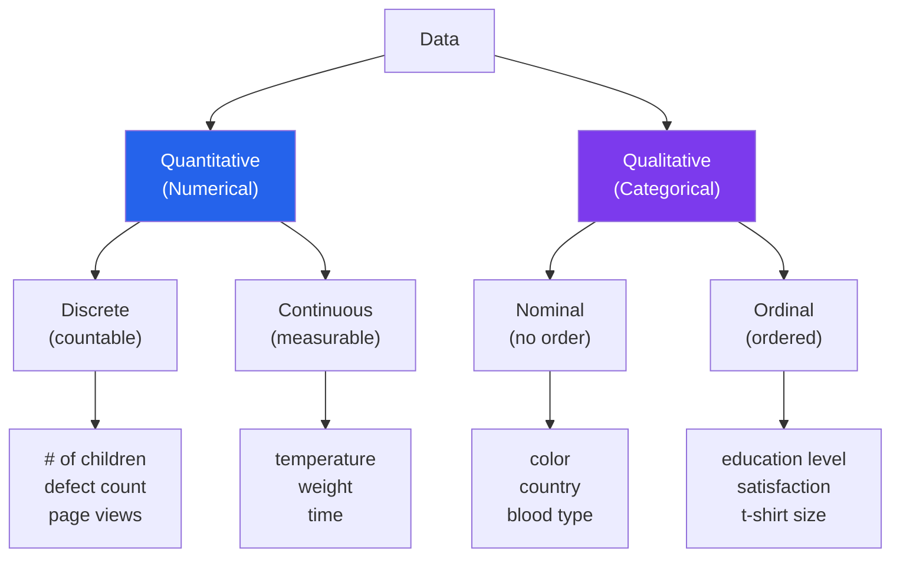
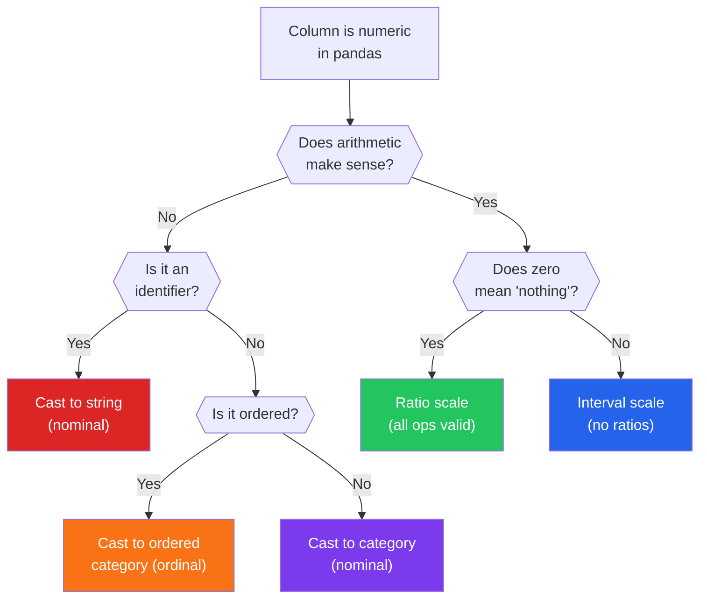

# Data Types Deep Dive

Getting data types wrong is the silent killer of data analysis. A ZIP code stored as an integer. An ordinal variable treated as nominal. A datetime parsed as a string. These type mismatches do not throw errors — they silently produce wrong results. Models train on them. Dashboards display them. Decisions are made on them. And nobody realizes the foundation was rotten.

This page covers the full taxonomy of data types, the measurement scales that determine which operations are valid, common misclassifications that corrupt analyses, and how to detect and fix type issues in Python.

---

## The Data Type Taxonomy



---

## Scales of Measurement

Stevens (1946) defined four measurement scales. Each permits different mathematical operations:

```python
# measurement_scales.py — The four scales with examples
import pandas as pd
import numpy as np

scales = pd.DataFrame({
    'Scale': ['Nominal', 'Ordinal', 'Interval', 'Ratio'],
    'Definition': [
        'Categories with no order',
        'Categories with meaningful order',
        'Ordered with equal intervals, no true zero',
        'Ordered with equal intervals and true zero',
    ],
    'Valid_Operations': [
        'Mode, frequency, chi-square',
        'Mode, median, rank correlation, Mann-Whitney',
        'Mode, median, mean, +/-, Pearson correlation',
        'All operations including *, /, geometric mean',
    ],
    'Examples': [
        'Blood type, country, eye color, email domain',
        'Education (HS/BS/MS/PhD), Likert scale, medal (Gold/Silver/Bronze)',
        'Temperature (C/F), calendar year, IQ score',
        'Height, weight, income, age, distance, duration',
    ],
    'Key_Property': [
        'Equality only (A == B?)',
        'Equality + Order (A > B?)',
        'Equality + Order + Distance (A - B = C - D?)',
        'Equality + Order + Distance + Ratios (A/B = 2?)',
    ],
})

print(scales.to_string(index=False))
```

### Why Scale Matters

```python
# scale_matters.py — Wrong operations on wrong scales
import numpy as np

# NOMINAL: Eye color coded as 1=Brown, 2=Blue, 3=Green
eye_colors = [1, 1, 2, 3, 1, 2, 2, 3, 1, 1]
print("=== NOMINAL: Eye Color (1=Brown, 2=Blue, 3=Green) ===")
print(f"Mean eye color: {np.mean(eye_colors):.1f}")
print("This is MEANINGLESS. Mean of 1.7 is not 'brownish-blue'.")
print(f"Mode: {max(set(eye_colors), key=eye_colors.count)} (Brown) - THIS is valid\n")

# ORDINAL: Satisfaction 1-5
satisfaction = [4, 5, 3, 4, 5, 2, 4, 3, 5, 4]
print("=== ORDINAL: Satisfaction (1-5) ===")
print(f"Mean satisfaction: {np.mean(satisfaction):.1f}")
print("Technically dubious — gaps between levels may not be equal.")
print(f"Median satisfaction: {np.median(satisfaction):.1f} - PREFERRED for ordinal")
print(f"'Difference between 1->2 is not necessarily same as 4->5'\n")

# INTERVAL: Temperature in Celsius
temps_c = [0, 10, 20, 30, 40]
print("=== INTERVAL: Temperature (Celsius) ===")
print(f"Mean: {np.mean(temps_c):.0f}°C - Valid")
print(f"Difference: 30°C - 10°C = 20°C - Valid")
print(f"Ratio: 40°C / 20°C = 2x - INVALID! 40°C is not 'twice as hot' as 20°C")
print(f"  (Because 0°C is arbitrary, not 'no temperature')\n")

# RATIO: Height in cm
heights = [150, 160, 170, 180, 190]
print("=== RATIO: Height (cm) ===")
print(f"Mean: {np.mean(heights):.0f} cm - Valid")
print(f"Ratio: 180/90 = 2x - Valid! (180cm IS twice as tall as 90cm)")
print(f"Geometric mean: {np.exp(np.mean(np.log(heights))):.1f} cm - Valid")
print(f"  (Because 0 cm = no height, a true zero point)")
```

::: tip The Practical Rule
If you can compute a meaningful RATIO (X is twice as much as Y), it is a ratio scale. If you can compute a meaningful DIFFERENCE but not a ratio, it is interval. If you can only RANK, it is ordinal. If you can only COUNT, it is nominal.
:::

---

## Common Misclassifications

These are the data types that look like one thing but are actually another.

```python
# misclassifications.py — The most dangerous type mismatches
import pandas as pd
import numpy as np

# Create a dataset with common misclassifications
df = pd.DataFrame({
    'zip_code': [10001, 90210, 60601, 33101, 98101],
    'phone': [5551234567, 5559876543, 5555551234, 5551112222, 5553334444],
    'year': [2020, 2021, 2022, 2023, 2024],
    'satisfaction': [4, 5, 3, 4, 2],
    'employee_id': [1001, 1002, 1003, 1004, 1005],
    'binary_flag': [1, 0, 1, 1, 0],
    'revenue': [50000, 75000, 120000, 45000, 98000],
    'product_code': ['A100', 'B200', 'A100', 'C300', 'B200'],
})

print("=== COMMON MISCLASSIFICATIONS ===\n")

misclassifications = [
    {
        'column': 'zip_code',
        'looks_like': 'Integer (continuous numeric)',
        'actually': 'Nominal categorical',
        'danger': f"Mean ZIP: {df['zip_code'].mean():.0f} — meaningless!",
        'fix': "df['zip_code'] = df['zip_code'].astype(str)",
    },
    {
        'column': 'phone',
        'looks_like': 'Integer',
        'actually': 'Nominal categorical (identifier)',
        'danger': "Arithmetic on phone numbers is absurd. Also, leading zeros get dropped!",
        'fix': "df['phone'] = df['phone'].astype(str).str.zfill(10)",
    },
    {
        'column': 'year',
        'looks_like': 'Integer (ratio)',
        'actually': 'Interval (or ordinal if used as groups)',
        'danger': f"Mean year: {df['year'].mean():.1f} — ok for trend, but 2024/2012 ≠ '1.01x'",
        'fix': "Depends on use: datetime for time ops, category for grouping",
    },
    {
        'column': 'satisfaction',
        'looks_like': 'Integer (ratio)',
        'actually': 'Ordinal categorical',
        'danger': "Mean satisfaction = 3.6 assumes equal intervals between levels",
        'fix': "df['satisfaction'] = pd.Categorical(df['satisfaction'], ordered=True)",
    },
    {
        'column': 'employee_id',
        'looks_like': 'Integer',
        'actually': 'Nominal categorical (identifier)',
        'danger': f"Mean employee ID: {df['employee_id'].mean():.0f} — completely meaningless",
        'fix': "df['employee_id'] = df['employee_id'].astype(str)",
    },
    {
        'column': 'binary_flag',
        'looks_like': 'Integer',
        'actually': 'Nominal categorical (binary)',
        'danger': "Correlation with binary_flag can be misleading if interpreted as numeric",
        'fix': "df['binary_flag'] = df['binary_flag'].astype('category')",
    },
]

for m in misclassifications:
    print(f"Column: {m['column']}")
    print(f"  Looks like: {m['looks_like']}")
    print(f"  Actually:   {m['actually']}")
    print(f"  Danger:     {m['danger']}")
    print(f"  Fix:        {m['fix']}\n")
```

### The Misclassification Decision Tree



---

## Mixed Types in a Single Column

One of the hardest problems in real-world data: columns containing multiple types.

```python
# mixed_types.py — Detecting and handling mixed-type columns
import pandas as pd
import numpy as np

# Simulate real-world messy data
df = pd.DataFrame({
    'age': ['25', '30', 'unknown', '45', 'N/A', '33', 'thirty', '28', '', '42'],
    'price': ['19.99', '$24.99', '29.99', 'free', '14.99', 'N/A', '39.99',
              'contact us', '9.99', '49.99'],
    'weight_kg': ['70.5', '80', '65.2', '90kg', '75', 'NULL', '68.1',
                   '85.3 kg', '72', '88.5'],
    'date': ['2024-01-15', '01/15/2024', 'Jan 15, 2024', '2024/01/15',
             '15-01-2024', 'yesterday', '2024-01-15', 'TBD', '', '2024-01-15'],
})

print("=== MIXED TYPE DETECTION ===")
print(f"\nRaw dtypes:\n{df.dtypes}\n")

# Function to detect mixed types
def detect_mixed_types(series):
    """Classify each value in a series by its apparent type."""
    type_counts = {'numeric': 0, 'string': 0, 'empty': 0, 'null_like': 0}
    null_strings = {'', 'N/A', 'NA', 'null', 'NULL', 'none', 'None', 'unknown',
                    'TBD', 'tbd', '#N/A'}

    for val in series:
        val_str = str(val).strip()
        if val_str in null_strings:
            type_counts['null_like'] += 1
        elif val_str == '':
            type_counts['empty'] += 1
        else:
            try:
                # Remove common non-numeric prefixes/suffixes
                cleaned = val_str.replace('$', '').replace('kg', '').strip()
                float(cleaned)
                type_counts['numeric'] += 1
            except ValueError:
                type_counts['string'] += 1

    return type_counts

for col in df.columns:
    types = detect_mixed_types(df[col])
    total = sum(types.values())
    print(f"{col}:")
    for t, count in types.items():
        if count > 0:
            print(f"  {t}: {count}/{total} ({count/total:.0%})")
    is_mixed = sum(1 for v in types.values() if v > 0) > 2
    if is_mixed:
        print(f"  WARNING: Mixed types detected!")
    print()

# Cleaning mixed types
print("=== CLEANING MIXED TYPES ===\n")

# Age: coerce to numeric, handle text numbers
def clean_age(val):
    val = str(val).strip().lower()
    # Map text numbers
    text_to_num = {'thirty': 30, 'twenty': 20, 'forty': 40}
    if val in text_to_num:
        return text_to_num[val]
    try:
        return float(val)
    except ValueError:
        return np.nan

df['age_clean'] = df['age'].apply(clean_age)
print(f"Age: {df['age_clean'].notna().sum()}/{len(df)} successfully parsed")

# Price: remove $ and handle text values
def clean_price(val):
    val = str(val).strip().lower()
    if val == 'free':
        return 0.0
    val = val.replace('$', '').replace(',', '')
    try:
        return float(val)
    except ValueError:
        return np.nan

df['price_clean'] = df['price'].apply(clean_price)
print(f"Price: {df['price_clean'].notna().sum()}/{len(df)} successfully parsed")

# Weight: strip units
def clean_weight(val):
    val = str(val).strip().lower()
    val = val.replace('kg', '').strip()
    try:
        return float(val)
    except ValueError:
        return np.nan

df['weight_clean'] = df['weight_kg'].apply(clean_weight)
print(f"Weight: {df['weight_clean'].notna().sum()}/{len(df)} successfully parsed")
```

---

## Pandas Type System

```python
# pandas_types.py — Understanding pandas types vs Python types vs numpy types
import pandas as pd
import numpy as np

# Create a DataFrame with various types
df = pd.DataFrame({
    'int_col': [1, 2, 3, 4, 5],
    'float_col': [1.1, 2.2, 3.3, 4.4, 5.5],
    'str_col': ['a', 'b', 'c', 'd', 'e'],
    'bool_col': [True, False, True, False, True],
    'date_col': pd.to_datetime(['2024-01-01', '2024-02-01', '2024-03-01',
                                 '2024-04-01', '2024-05-01']),
    'cat_col': pd.Categorical(['low', 'med', 'high', 'low', 'med'],
                               categories=['low', 'med', 'high'], ordered=True),
    'nullable_int': pd.array([1, 2, None, 4, 5], dtype=pd.Int64Dtype()),
})

print("=== PANDAS TYPE SYSTEM ===\n")
for col in df.columns:
    print(f"{col:>15}: pandas dtype = {df[col].dtype}, "
          f"Python type of first element = {type(df[col].iloc[0]).__name__}")

# Memory comparison: object vs category
print("\n=== MEMORY IMPACT OF TYPES ===")
n = 100_000
df_mem = pd.DataFrame({
    'status_object': np.random.choice(['active', 'inactive', 'pending'], n),
})
df_mem['status_category'] = df_mem['status_object'].astype('category')
df_mem['status_int8'] = df_mem['status_object'].map(
    {'active': 0, 'inactive': 1, 'pending': 2}
).astype('int8')

for col in df_mem.columns:
    mem = df_mem[col].memory_usage(deep=True) / 1024
    print(f"{col:>20}: {mem:>8.1f} KB")

# Type conversion guide
print("\n=== TYPE CONVERSION GUIDE ===")
conversions = [
    ("object -> category", "df['col'].astype('category')", "Low-cardinality strings"),
    ("object -> datetime", "pd.to_datetime(df['col'])", "Date/time strings"),
    ("int64 -> int8", "df['col'].astype('int8')", "Small integers (-128 to 127)"),
    ("float64 -> float32", "df['col'].astype('float32')", "When precision is sufficient"),
    ("int -> nullable Int64", "df['col'].astype('Int64')", "Integers with NaN support"),
    ("object -> string", "df['col'].astype('string')", "String operations"),
    ("int -> bool", "df['col'].astype(bool)", "Binary flags (0/1)"),
]

for target, code, when in conversions:
    print(f"  {target:>25}: {code:<40} When: {when}")
```

### Nullable Types in Pandas

```python
# nullable_types.py — The NaN problem with integers
import pandas as pd
import numpy as np

# The classic problem: integers with missing values
data = {'user_id': [1, 2, 3, None, 5],
        'score': [100, None, 85, 90, None]}

# Default behavior: int becomes float because NaN is a float
df_default = pd.DataFrame(data)
print("=== DEFAULT BEHAVIOR ===")
print(df_default.dtypes)
print(df_default)
print(f"user_id is now float64 because of the NaN!")
print(f"User 1's ID: {df_default['user_id'].iloc[0]} (now 1.0, not 1)\n")

# Solution: nullable integer types (capital I)
df_nullable = pd.DataFrame({
    'user_id': pd.array([1, 2, 3, None, 5], dtype=pd.Int64Dtype()),
    'score': pd.array([100, None, 85, 90, None], dtype=pd.Int64Dtype()),
})
print("=== NULLABLE INTEGER TYPES ===")
print(df_nullable.dtypes)
print(df_nullable)
print(f"user_id stays as integer! User 1's ID: {df_nullable['user_id'].iloc[0]}")
```

---

## Type-Aware EDA Functions

```python
# type_aware_eda.py — EDA that adapts to data types
import pandas as pd
import numpy as np
import seaborn as sns

def eda_by_type(df):
    """Run appropriate EDA for each column based on its type."""
    for col in df.columns:
        dtype = df[col].dtype
        n_unique = df[col].nunique()
        n_missing = df[col].isnull().sum()

        print(f"\n{'=' * 50}")
        print(f"Column: {col}")
        print(f"Type: {dtype}, Unique: {n_unique}, Missing: {n_missing}")

        # Detect likely categorical even if stored as numeric
        is_likely_categorical = (
            dtype in ['object', 'category', 'bool'] or
            (n_unique <= 20 and dtype in ['int64', 'int32', 'int8', 'float64'])
        )

        if is_likely_categorical:
            print(f">>> Treating as CATEGORICAL (n_unique={n_unique})")
            vc = df[col].value_counts()
            for val, count in vc.head(10).items():
                pct = count / len(df) * 100
                print(f"  {val}: {count} ({pct:.1f}%)")
            if n_unique > 10:
                print(f"  ... and {n_unique - 10} more categories")

        elif pd.api.types.is_numeric_dtype(df[col]):
            print(f">>> Treating as NUMERIC")
            s = df[col].dropna()
            print(f"  Mean:     {s.mean():.2f}")
            print(f"  Median:   {s.median():.2f}")
            print(f"  Std:      {s.std():.2f}")
            print(f"  Skewness: {s.skew():.2f}")
            print(f"  Range:    [{s.min():.2f}, {s.max():.2f}]")
            # Check if it might be misclassified
            if n_unique <= 20:
                print(f"  NOTE: Only {n_unique} unique values — consider treating as categorical")

        elif pd.api.types.is_datetime64_any_dtype(df[col]):
            print(f">>> Treating as DATETIME")
            print(f"  Range: {df[col].min()} to {df[col].max()}")
            print(f"  Span: {df[col].max() - df[col].min()}")

# Demo with Titanic
titanic = pd.read_csv(
    "https://raw.githubusercontent.com/datasciencedojo/datasets/master/titanic.csv"
)
eda_by_type(titanic[['Survived', 'Pclass', 'Sex', 'Age', 'Fare', 'Embarked']])
```

---

## Encoding Categorical Variables

```python
# encoding_strategies.py — Different encoding for different types
import pandas as pd
import numpy as np

np.random.seed(42)

df = pd.DataFrame({
    'color': ['red', 'blue', 'green', 'red', 'blue'],        # Nominal
    'size': ['S', 'M', 'L', 'XL', 'M'],                      # Ordinal
    'city': ['NYC', 'LA', 'Chicago', 'NYC', 'Houston'],       # Nominal (high card)
    'score': [85, 92, 78, 88, 95],                             # Numeric
})

print("=== ENCODING STRATEGIES BY TYPE ===\n")

# 1. One-Hot Encoding: For NOMINAL with low cardinality
print("--- One-Hot (Nominal, low cardinality) ---")
print(pd.get_dummies(df['color'], prefix='color'))

# 2. Ordinal Encoding: For ORDINAL variables
print("\n--- Ordinal Encoding ---")
size_order = {'S': 1, 'M': 2, 'L': 3, 'XL': 4}
df['size_encoded'] = df['size'].map(size_order)
print(df[['size', 'size_encoded']])

# 3. Target Encoding: For NOMINAL with high cardinality
print("\n--- Target Encoding (for high cardinality) ---")
# With a real target variable:
df['target'] = [1, 0, 1, 1, 0]
city_means = df.groupby('city')['target'].mean()
df['city_target_encoded'] = df['city'].map(city_means)
print(df[['city', 'target', 'city_target_encoded']])
print("WARNING: Target encoding can leak information. Use only on training data!")

# 4. Frequency Encoding: Safe alternative for high cardinality
print("\n--- Frequency Encoding (safe for high cardinality) ---")
city_freq = df['city'].value_counts(normalize=True)
df['city_freq_encoded'] = df['city'].map(city_freq)
print(df[['city', 'city_freq_encoded']])

# Encoding decision guide
print("\n=== ENCODING DECISION GUIDE ===")
guide = pd.DataFrame({
    'Type': ['Nominal (2-5 categories)', 'Nominal (5-20 categories)',
             'Nominal (20+ categories)', 'Ordinal', 'Binary'],
    'Recommended': ['One-Hot', 'One-Hot or Target', 'Target or Frequency',
                    'Ordinal integer map', 'Single binary column'],
    'Avoid': ['Label encoding (implies order)', 'One-Hot (too many columns)',
              'One-Hot (curse of dimensionality)', 'One-Hot (loses order)',
              'One-Hot (unnecessary 2 columns)'],
})
print(guide.to_string(index=False))
```

| Variable Type | Valid Operations | Invalid Operations |
|--------------|------------------|-------------------|
| Nominal | Mode, frequency, chi-square | Mean, median, correlation |
| Ordinal | Mode, median, rank tests | Mean, standard deviation |
| Interval | Mean, std, +, -, correlation | Ratios, geometric mean |
| Ratio | All arithmetic operations | None (most permissive) |

---

## Summary

| Concept | Key Takeaway |
|---------|-------------|
| Measurement scales | Nominal < Ordinal < Interval < Ratio in terms of valid operations |
| Common misclassifications | ZIP codes, phone numbers, and IDs are categorical despite being numeric |
| Mixed types | Real data has "25", "unknown", and "N/A" in the same column |
| Pandas types | Use `category` for low-cardinality strings, nullable `Int64` for integers with NaN |
| Encoding | Match encoding to the type: one-hot for nominal, ordinal mapping for ordinal |
| Type checking | Always check `nunique()` — a numeric column with 3 values is probably categorical |

---

## What's Next

| Page | What You'll Learn |
|------|------------------|
| [Data Shapes & Structures](/eda/data-shapes-structures) | Wide vs long, tidy data, reshaping |
| [Understanding Distributions](/eda/understanding-distributions) | How to identify and transform distributions |
| [Data Profiling](/eda/data-profiling) | First 15 minutes with any dataset |
