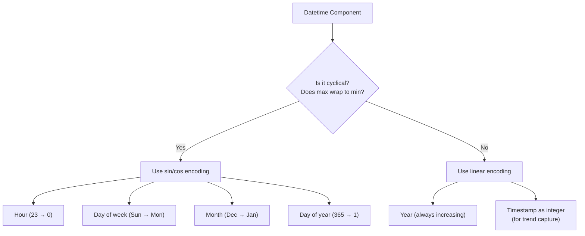
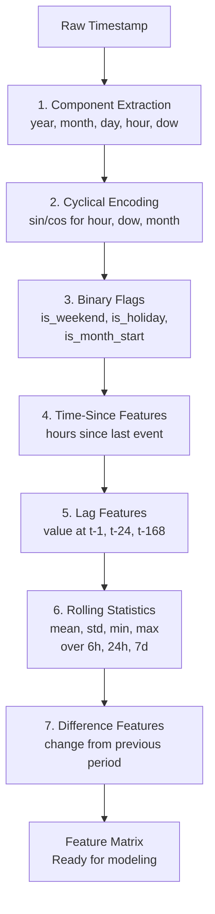

# Datetime Feature Engineering

A single datetime column contains an extraordinary amount of information — hour of day, day of week, month, quarter, year, whether it is a holiday, how long since the last event, seasonal patterns, and trends. Raw timestamps are useless to models. Engineered datetime features are often the highest-importance features in production systems.

This page covers every major technique: component extraction, cyclical encoding, time-since-event, lag features, rolling windows, and holiday indicators.

## The Dataset

We will use two years of hourly e-commerce order data with realistic temporal patterns.

```python
import numpy as np
import pandas as pd
import matplotlib.pyplot as plt
import seaborn as sns
from datetime import datetime, timedelta

np.random.seed(42)

# Generate 2 years of hourly timestamps
dates = pd.date_range(start="2024-01-01", end="2025-12-31 23:00:00", freq="H")
n = len(dates)

# Base demand varies by:
# 1. Hour of day (peaks at lunch and evening)
hour = dates.hour
hour_effect = 5 * np.sin(2 * np.pi * (hour - 6) / 24) + 3 * np.sin(2 * np.pi * (hour - 12) / 12)

# 2. Day of week (lower on weekends)
dow = dates.dayofweek
dow_effect = np.where(dow >= 5, -8, 3)

# 3. Month (holiday season boost)
month = dates.month
month_effect = 5 * np.sin(2 * np.pi * (month - 1) / 12 + np.pi / 4)

# 4. Linear trend
trend = np.arange(n) / n * 20

# 5. Holiday spikes
is_holiday_date = dates.normalize().isin(pd.to_datetime([
    "2024-01-01", "2024-07-04", "2024-11-28", "2024-12-25",
    "2025-01-01", "2025-07-04", "2025-11-27", "2025-12-25",
]))
holiday_effect = np.where(is_holiday_date, 15, 0)

orders = 50 + hour_effect + dow_effect + month_effect + trend + holiday_effect
orders += np.random.normal(0, 5, n)
orders = np.clip(orders, 0, None).astype(int)

df = pd.DataFrame({"timestamp": dates, "orders": orders})
df = df.set_index("timestamp")

print(f"Shape: {df.shape}")
print(f"Date range: {df.index.min()} to {df.index.max()}")
print(df.describe().round(1))
```

## Component Extraction

The simplest and most effective datetime features: extract components directly.

```python
# Extract all useful components
df["year"] = df.index.year
df["month"] = df.index.month
df["day"] = df.index.day
df["hour"] = df.index.hour
df["minute"] = df.index.minute
df["day_of_week"] = df.index.dayofweek        # 0=Mon, 6=Sun
df["day_of_year"] = df.index.dayofyear         # 1-366
df["week_of_year"] = df.index.isocalendar().week.values.astype(int)
df["quarter"] = df.index.quarter
df["is_weekend"] = (df.index.dayofweek >= 5).astype(int)
df["is_month_start"] = df.index.is_month_start.astype(int)
df["is_month_end"] = df.index.is_month_end.astype(int)

# Period-of-day buckets
def get_period(hour):
    if 6 <= hour < 12:
        return "morning"
    elif 12 <= hour < 17:
        return "afternoon"
    elif 17 <= hour < 21:
        return "evening"
    else:
        return "night"

df["period_of_day"] = df["hour"].apply(get_period)

print("Extracted components:")
print(df[["year", "month", "day", "hour", "day_of_week", "is_weekend",
          "quarter", "period_of_day"]].head(10))
```

## Cyclical Encoding (Sin/Cos)

Hour 23 and hour 0 are adjacent in time but maximally distant as integers (23 vs 0). Cyclical encoding with sin/cos preserves this circular relationship.

```python
def cyclical_encode(df, col, max_val):
    """Encode a cyclical feature using sin and cos."""
    df[f"{col}_sin"] = np.sin(2 * np.pi * df[col] / max_val)
    df[f"{col}_cos"] = np.cos(2 * np.pi * df[col] / max_val)
    return df

# Encode cyclical features
df = cyclical_encode(df, "hour", 24)
df = cyclical_encode(df, "day_of_week", 7)
df = cyclical_encode(df, "month", 12)
df = cyclical_encode(df, "day_of_year", 365)

# Visualization: why cyclical encoding matters
fig, axes = plt.subplots(2, 2, figsize=(14, 10))

# Hour — linear vs cyclical
hours = np.arange(24)
axes[0, 0].plot(hours, hours, "bo-", label="Linear (0-23)")
axes[0, 0].set_xlabel("Hour")
axes[0, 0].set_ylabel("Encoded Value")
axes[0, 0].set_title("Linear Encoding: 23 and 0 are far apart", fontsize=12)
axes[0, 0].legend()

# Sin/cos for hour
axes[0, 1].scatter(np.sin(2 * np.pi * hours / 24),
                    np.cos(2 * np.pi * hours / 24),
                    c=hours, cmap="hsv", s=100, zorder=5)
for h in hours:
    axes[0, 1].annotate(str(h),
                         (np.sin(2 * np.pi * h / 24), np.cos(2 * np.pi * h / 24)),
                         fontsize=8, ha="center", va="center")
axes[0, 1].set_xlabel("sin(hour)")
axes[0, 1].set_ylabel("cos(hour)")
axes[0, 1].set_title("Cyclical Encoding: 23 and 0 are neighbors", fontsize=12)
axes[0, 1].set_aspect("equal")

# Day of week
days = np.arange(7)
day_names = ["Mon", "Tue", "Wed", "Thu", "Fri", "Sat", "Sun"]
axes[1, 0].scatter(np.sin(2 * np.pi * days / 7),
                    np.cos(2 * np.pi * days / 7),
                    c=days, cmap="Set1", s=200, zorder=5)
for d, name in zip(days, day_names):
    axes[1, 0].annotate(name,
                         (np.sin(2 * np.pi * d / 7) * 1.15,
                          np.cos(2 * np.pi * d / 7) * 1.15),
                         ha="center", va="center", fontsize=10)
axes[1, 0].set_xlabel("sin(day)")
axes[1, 0].set_ylabel("cos(day)")
axes[1, 0].set_title("Day of Week (Cyclical)", fontsize=12)
axes[1, 0].set_aspect("equal")

# Month
months = np.arange(1, 13)
month_names = ["Jan", "Feb", "Mar", "Apr", "May", "Jun",
               "Jul", "Aug", "Sep", "Oct", "Nov", "Dec"]
axes[1, 1].scatter(np.sin(2 * np.pi * months / 12),
                    np.cos(2 * np.pi * months / 12),
                    c=months, cmap="coolwarm", s=200, zorder=5)
for m, name in zip(months, month_names):
    axes[1, 1].annotate(name,
                         (np.sin(2 * np.pi * m / 12) * 1.15,
                          np.cos(2 * np.pi * m / 12) * 1.15),
                         ha="center", va="center", fontsize=10)
axes[1, 1].set_xlabel("sin(month)")
axes[1, 1].set_ylabel("cos(month)")
axes[1, 1].set_title("Month (Cyclical)", fontsize=12)
axes[1, 1].set_aspect("equal")

plt.suptitle("Cyclical Encoding: Preserving Circular Relationships", fontsize=16, fontweight="bold")
plt.tight_layout()
plt.savefig("cyclical_encoding.png", dpi=150, bbox_inches="tight")
plt.show()
```

### When to Use Cyclical vs Linear



## Time-Since-Event Features

How long since something happened? These features capture recency effects.

```python
# Simulate event timestamps
events = pd.DataFrame({
    "timestamp": pd.date_range("2024-01-01", "2025-12-31", freq="H"),
})

# Mark some events
events["is_sale"] = 0
sale_dates = pd.to_datetime([
    "2024-03-15", "2024-06-20", "2024-09-01", "2024-11-29",
    "2025-03-10", "2025-06-15", "2025-09-05", "2025-11-28",
])
for sd in sale_dates:
    mask = (events["timestamp"] >= sd) & (events["timestamp"] < sd + timedelta(days=3))
    events.loc[mask, "is_sale"] = 1

# Time since last sale
def time_since_event(timestamps, event_mask, unit="hours"):
    """Compute time elapsed since the last occurrence of an event."""
    result = pd.Series(np.nan, index=timestamps.index)
    last_event_time = None

    for idx, (ts, is_event) in enumerate(zip(timestamps, event_mask)):
        if is_event:
            last_event_time = ts
        if last_event_time is not None:
            delta = ts - last_event_time
            if unit == "hours":
                result.iloc[idx] = delta.total_seconds() / 3600
            elif unit == "days":
                result.iloc[idx] = delta.total_seconds() / 86400

    return result

events["hours_since_sale"] = time_since_event(events["timestamp"], events["is_sale"], "hours")

# Time UNTIL next sale
events["hours_until_sale"] = time_since_event(
    events["timestamp"][::-1].reset_index(drop=True),
    events["is_sale"][::-1].reset_index(drop=True),
    "hours"
)[::-1].values

print("Time-since-event features:")
print(events[events["is_sale"] == 1].head())
print(events.describe().round(1))
```

## Lag Features

Lag features use past values to predict the present. They are essential for time series forecasting.

```python
# Create lag features for orders
for lag in [1, 2, 3, 6, 12, 24, 168]:  # 168 = 1 week in hours
    df[f"orders_lag_{lag}h"] = df["orders"].shift(lag)

# Rolling window features
for window in [6, 12, 24, 168]:
    df[f"orders_rolling_mean_{window}h"] = df["orders"].rolling(window=window).mean()
    df[f"orders_rolling_std_{window}h"] = df["orders"].rolling(window=window).std()
    df[f"orders_rolling_min_{window}h"] = df["orders"].rolling(window=window).min()
    df[f"orders_rolling_max_{window}h"] = df["orders"].rolling(window=window).max()

# Expanding features (cumulative)
df["orders_expanding_mean"] = df["orders"].expanding().mean()

# Difference features (change from previous period)
df["orders_diff_1h"] = df["orders"].diff(1)
df["orders_diff_24h"] = df["orders"].diff(24)
df["orders_diff_168h"] = df["orders"].diff(168)

# Percentage change
df["orders_pct_change_24h"] = df["orders"].pct_change(24)

print(f"Total features after lag engineering: {df.shape[1]}")
lag_features = [c for c in df.columns if "lag" in c or "rolling" in c or "diff" in c or "pct" in c]
print(f"Lag/rolling features: {len(lag_features)}")
print(df[lag_features].describe().round(2))
```

```python
# Visualize lag features
fig, axes = plt.subplots(2, 2, figsize=(16, 10))

# Sample 2 weeks of data
sample = df.loc["2024-06-01":"2024-06-14"].copy()

# Original vs lags
axes[0, 0].plot(sample.index, sample["orders"], label="Current", linewidth=1.5)
axes[0, 0].plot(sample.index, sample["orders_lag_24h"], label="Lag 24h", alpha=0.7)
axes[0, 0].plot(sample.index, sample["orders_lag_168h"], label="Lag 168h (1 week)", alpha=0.7)
axes[0, 0].set_title("Orders: Current vs Lags", fontsize=12)
axes[0, 0].legend()

# Rolling means
axes[0, 1].plot(sample.index, sample["orders"], label="Actual", alpha=0.4, linewidth=1)
axes[0, 1].plot(sample.index, sample["orders_rolling_mean_6h"], label="6h MA", linewidth=2)
axes[0, 1].plot(sample.index, sample["orders_rolling_mean_24h"], label="24h MA", linewidth=2)
axes[0, 1].plot(sample.index, sample["orders_rolling_mean_168h"], label="168h MA", linewidth=2)
axes[0, 1].set_title("Rolling Means (Moving Averages)", fontsize=12)
axes[0, 1].legend()

# Differences
axes[1, 0].plot(sample.index, sample["orders_diff_1h"], label="1h diff", alpha=0.5)
axes[1, 0].plot(sample.index, sample["orders_diff_24h"], label="24h diff", linewidth=1.5)
axes[1, 0].axhline(0, color="black", linewidth=0.5)
axes[1, 0].set_title("Difference Features", fontsize=12)
axes[1, 0].legend()

# Rolling std (volatility)
axes[1, 1].plot(sample.index, sample["orders_rolling_std_24h"], label="24h rolling std", color="crimson")
axes[1, 1].set_title("Rolling Volatility (24h std)", fontsize=12)
axes[1, 1].legend()

plt.suptitle("Lag and Rolling Features Visualization", fontsize=16, fontweight="bold")
plt.tight_layout()
plt.savefig("lag_features.png", dpi=150, bbox_inches="tight")
plt.show()
```

## Holiday and Special Event Features

```python
# Holiday indicator features
us_holidays_2024_2025 = pd.to_datetime([
    # 2024
    "2024-01-01", "2024-01-15", "2024-02-19", "2024-05-27",
    "2024-07-04", "2024-09-02", "2024-11-28", "2024-12-25",
    # 2025
    "2025-01-01", "2025-01-20", "2025-02-17", "2025-05-26",
    "2025-07-04", "2025-09-01", "2025-11-27", "2025-12-25",
])

df["is_holiday"] = df.index.normalize().isin(us_holidays_2024_2025).astype(int)
df["is_day_before_holiday"] = df.index.normalize().isin(us_holidays_2024_2025 - timedelta(days=1)).astype(int)
df["is_day_after_holiday"] = df.index.normalize().isin(us_holidays_2024_2025 + timedelta(days=1)).astype(int)

# Days until next holiday
def days_until_next(timestamps, event_dates):
    """Compute days until the next event date."""
    result = []
    event_dates_sorted = sorted(event_dates)
    for ts in timestamps:
        date = ts.normalize()
        future = [e for e in event_dates_sorted if e >= date]
        if future:
            result.append((future[0] - date).days)
        else:
            result.append(365)  # default large value
    return result

df["days_until_holiday"] = days_until_next(df.index, us_holidays_2024_2025)

print("Holiday features:")
print(df[["is_holiday", "is_day_before_holiday", "is_day_after_holiday",
          "days_until_holiday"]].describe().round(2))
```

## Feature Engineering Pipeline



## Impact Benchmark

```python
from sklearn.ensemble import GradientBoostingRegressor
from sklearn.model_selection import TimeSeriesSplit

# Prepare data (drop NaN from lags)
df_clean = df.dropna()
y = df_clean["orders"]

# Feature sets
basic_features = ["year", "month", "day", "hour", "day_of_week", "is_weekend"]
cyclical_features = ["hour_sin", "hour_cos", "day_of_week_sin", "day_of_week_cos",
                      "month_sin", "month_cos"]
lag_features_sel = ["orders_lag_1h", "orders_lag_24h", "orders_lag_168h"]
rolling_features_sel = ["orders_rolling_mean_24h", "orders_rolling_std_24h",
                         "orders_rolling_mean_168h"]
holiday_features = ["is_holiday", "is_weekend", "days_until_holiday"]

feature_sets = {
    "Basic components": basic_features,
    "+ Cyclical": basic_features + cyclical_features,
    "+ Lags": basic_features + cyclical_features + lag_features_sel,
    "+ Rolling": basic_features + cyclical_features + lag_features_sel + rolling_features_sel,
    "+ Holidays": basic_features + cyclical_features + lag_features_sel + rolling_features_sel + holiday_features,
}

tscv = TimeSeriesSplit(n_splits=5)

print(f"{'Feature Set':<25s} {'R² (mean)':>10s} {'R² (std)':>10s} {'n_features':>12s}")
print("-" * 60)

for name, features in feature_sets.items():
    available = [f for f in features if f in df_clean.columns]
    X = df_clean[available]
    gbm = GradientBoostingRegressor(n_estimators=100, max_depth=4, random_state=42)
    scores = cross_val_score(gbm, X, y, cv=tscv, scoring="r2")
    print(f"{name:<25s} {scores.mean():>10.4f} {scores.std():>10.4f} {len(available):>12d}")
```

## Key Takeaways

- Extract all meaningful datetime components. Even seemingly redundant ones (day_of_year, week_of_year) capture different seasonal patterns.
- Always use cyclical encoding (sin/cos) for hour, day-of-week, and month. Linear encoding creates artificial discontinuities.
- Lag features are the most powerful datetime features for time series forecasting. The right lag depends on your data's periodicity.
- Rolling statistics (mean, std) smooth noise and capture local trends.
- Holiday indicators often have outsized importance. Include day-before and day-after effects.
- Use TimeSeriesSplit for validation, never random shuffle, to prevent future data leaking into training.
- Combine component extraction, cyclical encoding, lags, rolling stats, and event features for maximum predictive power.
