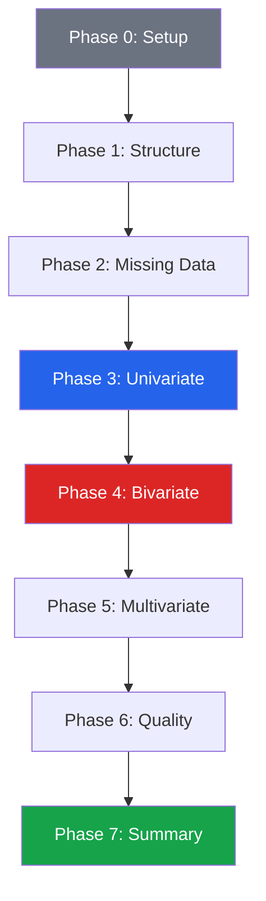

# EDA Checklist

A systematic, 60-item checklist covering every phase of exploratory data analysis. Use this as a template for every new dataset. Not every item applies to every dataset, but scanning the full list ensures you never miss a critical step.

---

## Phase 0: Before You Start

```python
# Template: paste into your notebook header
"""
EDA SESSION LOG
===============
Dataset:     [name]
Source:       [origin, date acquired]
Goal:        [what question are you trying to answer?]
Analyst:     [your name]
Date:        [today]
Environment: Python 3.x, pandas x.x
"""
```

### Checklist Items 1-8: Setup

| # | Item | Status | Notes |
|---|------|--------|-------|
| 1 | Define the analysis goal/question | [ ] | What decision does this EDA support? |
| 2 | Confirm data source and collection method | [ ] | How was data collected? Any known biases? |
| 3 | Verify data access permissions | [ ] | Do you have authorization? |
| 4 | Set up reproducible environment | [ ] | requirements.txt, random seed, Git |
| 5 | Set random seed globally | [ ] | `np.random.seed(42)` |
| 6 | Check data documentation/data dictionary | [ ] | Column definitions, units, codes |
| 7 | Note the data freshness/time range | [ ] | When was data extracted? |
| 8 | Identify the unit of observation | [ ] | What does one row represent? |

```python
import pandas as pd
import numpy as np
import matplotlib.pyplot as plt
import seaborn as sns
from scipy import stats

np.random.seed(42)
sns.set_theme(style='whitegrid')

# Item 7: Data freshness
# df = pd.read_csv('data.csv', parse_dates=['date_col'])
# print(f"Date range: {df['date_col'].min()} to {df['date_col'].max()}")
```

---

## Phase 1: Data Loading and First Look

### Checklist Items 9-18: Structure

| # | Item | Status | Notes |
|---|------|--------|-------|
| 9 | Load data with explicit dtypes | [ ] | `pd.read_csv(dtype=...)` |
| 10 | Check shape (rows x columns) | [ ] | `df.shape` |
| 11 | View first/last rows | [ ] | `df.head()`, `df.tail()` |
| 12 | Review column names | [ ] | Standardize: lowercase, no spaces |
| 13 | Check data types per column | [ ] | `df.dtypes`, `df.info()` |
| 14 | Verify correct parsing (dates, categories) | [ ] | Are dates strings? Are IDs numeric? |
| 15 | Check memory usage | [ ] | `df.memory_usage(deep=True).sum()` |
| 16 | Count duplicate rows | [ ] | `df.duplicated().sum()` |
| 17 | Identify the primary key/ID column | [ ] | Is it unique? |
| 18 | Check for constant columns | [ ] | `df.nunique() == 1` |

```python
def phase1_checklist(df):
    """Run Phase 1 checks automatically."""
    print("PHASE 1: DATA STRUCTURE")
    print("=" * 50)
    print(f"[10] Shape: {df.shape}")
    print(f"[15] Memory: {df.memory_usage(deep=True).sum() / 1024**2:.2f} MB")
    print(f"[16] Duplicate rows: {df.duplicated().sum()}")

    # [13] Data types
    print(f"\n[13] Data types:")
    for dtype, count in df.dtypes.value_counts().items():
        print(f"  {dtype}: {count}")

    # [18] Constant columns
    constant = df.columns[df.nunique() <= 1].tolist()
    if constant:
        print(f"\n[18] ALERT: Constant columns: {constant}")

    # [12] Column name issues
    bad_names = [c for c in df.columns if ' ' in c or c != c.lower()]
    if bad_names:
        print(f"\n[12] ALERT: Non-standard column names: {bad_names}")

    # [17] Potential primary keys (all unique)
    potential_pks = [c for c in df.columns if df[c].nunique() == len(df)]
    print(f"\n[17] Potential primary keys: {potential_pks or 'None found'}")

# Usage: phase1_checklist(df)
```

---

## Phase 2: Missing Data

### Checklist Items 19-26: Nulls

| # | Item | Status | Notes |
|---|------|--------|-------|
| 19 | Count missing values per column | [ ] | `df.isna().sum()` |
| 20 | Calculate missing percentages | [ ] | Drop columns > 80% missing? |
| 21 | Visualize missing pattern | [ ] | Nullity matrix, bar chart |
| 22 | Check if missing is MCAR/MAR/MNAR | [ ] | Does missingness correlate with other columns? |
| 23 | Test if missing correlates with target | [ ] | Critical for modeling |
| 24 | Document imputation strategy | [ ] | Median? Group median? Drop? |
| 25 | Verify no NaN-like strings | [ ] | 'N/A', 'null', '', '-', '?' |
| 26 | Check for sentinel values | [ ] | -999, 9999, 0 where 0 is impossible |

```python
def phase2_checklist(df, target=None):
    """Run Phase 2 missing data checks."""
    print("PHASE 2: MISSING DATA")
    print("=" * 50)

    # [19-20] Missing counts and percentages
    missing = df.isna().sum()
    missing_pct = (df.isna().mean() * 100).round(2)
    missing_df = pd.DataFrame({'count': missing, 'pct': missing_pct})
    missing_df = missing_df[missing_df['count'] > 0].sort_values('pct', ascending=False)

    if len(missing_df) == 0:
        print("[19] No missing values found")
    else:
        print(f"[19] Columns with missing values: {len(missing_df)}")
        print(missing_df)

    # [25] Check for NaN-like strings
    for col in df.select_dtypes(include='object').columns:
        nan_like = df[col].isin(['', 'N/A', 'NA', 'null', 'NULL', 'None', '-', '?', 'n/a']).sum()
        if nan_like > 0:
            print(f"\n[25] ALERT: '{col}' has {nan_like} NaN-like strings")

    # [26] Sentinel values in numeric columns
    for col in df.select_dtypes(include='number').columns:
        for sentinel in [-999, -1, 9999, 99999]:
            count = (df[col] == sentinel).sum()
            if count > 0:
                print(f"[26] ALERT: '{col}' has {count} values equal to {sentinel}")

    # [23] Missing vs target
    if target and target in df.columns:
        print(f"\n[23] Missing value correlation with target '{target}':")
        for col in missing_df.index:
            has_val = df[df[col].notna()][target].mean()
            no_val = df[df[col].isna()][target].mean()
            diff = abs(has_val - no_val)
            flag = "***" if diff > 0.1 else ""
            print(f"  {col}: present={has_val:.3f}, missing={no_val:.3f}, diff={diff:.3f} {flag}")

# Usage: phase2_checklist(df, target='survived')
```

---

## Phase 3: Univariate Analysis

### Checklist Items 27-36: Single Variables

| # | Item | Status | Notes |
|---|------|--------|-------|
| 27 | Describe all numeric columns | [ ] | `df.describe()` |
| 28 | Check skewness of each numeric column | [ ] | abs(skew) > 1 needs attention |
| 29 | Check kurtosis (heavy tails?) | [ ] | Excess kurtosis > 3 = heavy tails |
| 30 | Identify outliers (IQR and z-score) | [ ] | How many? Real or errors? |
| 31 | Plot histograms for all numerics | [ ] | Bin size matters |
| 32 | Plot box plots for all numerics | [ ] | See outliers |
| 33 | Count value frequencies for categoricals | [ ] | `value_counts()` |
| 34 | Check cardinality of categoricals | [ ] | High-cardinality = potential ID |
| 35 | Check for rare categories | [ ] | Categories with < 1% frequency |
| 36 | Test normality where needed | [ ] | Shapiro-Wilk, QQ plot |

```python
def phase3_checklist(df):
    """Run Phase 3 univariate checks."""
    print("PHASE 3: UNIVARIATE ANALYSIS")
    print("=" * 50)

    numeric = df.select_dtypes(include='number')

    # [28] Skewness alerts
    skew = numeric.skew()
    skewed = skew[abs(skew) > 1]
    if len(skewed) > 0:
        print("[28] Highly skewed columns (|skew| > 1):")
        for col, s in skewed.items():
            print(f"  {col}: skew={s:.2f}")

    # [30] Outlier counts (IQR method)
    print("\n[30] Outlier counts (IQR method):")
    for col in numeric.columns:
        q1, q3 = numeric[col].quantile([0.25, 0.75])
        iqr = q3 - q1
        n_outliers = ((numeric[col] < q1 - 1.5 * iqr) | (numeric[col] > q3 + 1.5 * iqr)).sum()
        pct = n_outliers / len(numeric) * 100
        flag = "***" if pct > 5 else ""
        print(f"  {col:<25} {n_outliers:>6} ({pct:.1f}%) {flag}")

    # [34] Cardinality of categoricals
    categorical = df.select_dtypes(include=['object', 'category'])
    if len(categorical.columns) > 0:
        print("\n[34] Categorical cardinality:")
        for col in categorical.columns:
            n_unique = df[col].nunique()
            ratio = n_unique / len(df)
            flag = "HIGH-CARD" if ratio > 0.5 else ""
            print(f"  {col:<25} {n_unique:>6} unique ({ratio:.1%}) {flag}")

    # [35] Rare categories
    print("\n[35] Rare categories (< 1%):")
    for col in categorical.columns:
        vc = df[col].value_counts(normalize=True)
        rare = vc[vc < 0.01]
        if len(rare) > 0:
            print(f"  {col}: {len(rare)} rare categories")

# Usage: phase3_checklist(df)
```

---

## Phase 4: Bivariate Analysis

### Checklist Items 37-44: Relationships

| # | Item | Status | Notes |
|---|------|--------|-------|
| 37 | Compute correlation matrix | [ ] | Pearson and Spearman |
| 38 | Identify highly correlated pairs | [ ] | abs(r) > 0.7 |
| 39 | Check target correlations | [ ] | Which features predict the target? |
| 40 | Scatter plots for top correlations | [ ] | Confirm linearity |
| 41 | Box plots: numeric vs categorical | [ ] | Compare distributions |
| 42 | Chi-squared for categorical pairs | [ ] | Independence test |
| 43 | Cross-tabulation for key pairs | [ ] | `pd.crosstab()` |
| 44 | Check for nonlinear relationships | [ ] | Spearman vs Pearson difference |

```python
def phase4_checklist(df, target=None):
    """Run Phase 4 bivariate checks."""
    print("PHASE 4: BIVARIATE ANALYSIS")
    print("=" * 50)

    numeric = df.select_dtypes(include='number')

    # [37-38] Correlation
    if len(numeric.columns) >= 2:
        corr = numeric.corr()
        print("[38] Highly correlated pairs (|r| > 0.7):")
        for i in range(len(corr)):
            for j in range(i+1, len(corr)):
                r = corr.iloc[i, j]
                if abs(r) > 0.7:
                    print(f"  {corr.columns[i]} x {corr.columns[j]}: r={r:+.3f}")

    # [39] Target correlations
    if target and target in numeric.columns:
        target_corr = corr[target].drop(target).sort_values(key=abs, ascending=False)
        print(f"\n[39] Correlation with '{target}':")
        for col, r in target_corr.head(10).items():
            print(f"  {col:<25} r={r:+.3f}")

    # [44] Nonlinear relationships
    if len(numeric.columns) >= 2:
        pearson = numeric.corr(method='pearson')
        spearman = numeric.corr(method='spearman')
        diff = (spearman - pearson).abs()
        print("\n[44] Potential nonlinear relationships (|Spearman - Pearson| > 0.1):")
        for i in range(len(diff)):
            for j in range(i+1, len(diff)):
                if diff.iloc[i, j] > 0.1:
                    print(f"  {diff.columns[i]} x {diff.columns[j]}: "
                          f"Pearson={pearson.iloc[i,j]:.3f}, Spearman={spearman.iloc[i,j]:.3f}")

# Usage: phase4_checklist(df, target='target_column')
```

---

## Phase 5: Multivariate and Feature Engineering

### Checklist Items 45-52: Deeper Analysis

| # | Item | Status | Notes |
|---|------|--------|-------|
| 45 | Check for multicollinearity (VIF) | [ ] | VIF > 5 is concerning |
| 46 | Create interaction features | [ ] | Product of correlated predictors |
| 47 | Bin continuous variables | [ ] | pd.cut(), pd.qcut() |
| 48 | Encode categorical variables | [ ] | One-hot, ordinal, target encoding |
| 49 | Create time-based features | [ ] | Day of week, month, lag features |
| 50 | PCA / dimensionality analysis | [ ] | How many components explain 95%? |
| 51 | Cluster analysis (exploratory) | [ ] | Natural groupings? |
| 52 | Cross-tabulation with target | [ ] | Interactions between features |

```python
def phase5_checklist(df):
    """Run Phase 5 multivariate checks."""
    print("PHASE 5: MULTIVARIATE")
    print("=" * 50)

    numeric = df.select_dtypes(include='number')

    # [45] VIF (Variance Inflation Factor)
    if len(numeric.columns) >= 2:
        from numpy.linalg import inv
        clean = numeric.dropna()
        if len(clean) > 0:
            try:
                X = clean.values
                X_std = (X - X.mean(axis=0)) / X.std(axis=0)
                corr_matrix = np.corrcoef(X_std, rowvar=False)
                inv_corr = inv(corr_matrix)
                vif = pd.Series(np.diag(inv_corr), index=numeric.columns)
                high_vif = vif[vif > 5]
                if len(high_vif) > 0:
                    print("[45] High VIF columns (VIF > 5):")
                    for col, v in high_vif.items():
                        print(f"  {col}: VIF={v:.1f}")
                else:
                    print("[45] No multicollinearity issues (all VIF < 5)")
            except Exception:
                print("[45] Could not compute VIF (singular matrix)")

    # [50] PCA dimensionality
    if len(numeric.columns) >= 3:
        clean = numeric.dropna()
        if len(clean) > 10:
            from numpy.linalg import svd
            centered = clean.values - clean.values.mean(axis=0)
            _, s, _ = svd(centered, full_matrices=False)
            explained = (s ** 2) / (s ** 2).sum()
            cumulative = np.cumsum(explained)
            n_95 = (cumulative < 0.95).sum() + 1
            print(f"\n[50] PCA: {n_95}/{len(numeric.columns)} components explain 95% variance")

# Usage: phase5_checklist(df)
```

---

## Phase 6: Data Quality and Integrity

### Checklist Items 53-58: Quality Assurance

| # | Item | Status | Notes |
|---|------|--------|-------|
| 53 | Verify value ranges make sense | [ ] | Age: 0-120, percentages: 0-100 |
| 54 | Check referential integrity (joins) | [ ] | All FKs have matching PKs? |
| 55 | Look for data entry errors | [ ] | Typos in categoricals |
| 56 | Check temporal consistency | [ ] | End date > start date? |
| 57 | Validate business rules | [ ] | Total = qty x price? |
| 58 | Check for data leakage features | [ ] | Future info in training data? |

---

## Phase 7: Summary and Communication

### Checklist Items 59-60: Deliverables

| # | Item | Status | Notes |
|---|------|--------|-------|
| 59 | Write findings summary (top 5-10 insights) | [ ] | Plain language, actionable |
| 60 | Document next steps and recommendations | [ ] | What further analysis is needed? |

---

## Full Automated Checklist Runner

```python
def run_full_eda_checklist(df, target=None):
    """Run all automated checklist items."""
    print("=" * 60)
    print("FULL EDA CHECKLIST REPORT")
    print("=" * 60)
    print(f"Dataset: {df.shape[0]:,} rows x {df.shape[1]} columns")
    print(f"Target: {target or 'Not specified'}")
    print()

    phase1_checklist(df)
    print()
    phase2_checklist(df, target)
    print()
    phase3_checklist(df)
    print()
    phase4_checklist(df, target)
    print()
    phase5_checklist(df)

    print("\n" + "=" * 60)
    print("MANUAL ITEMS REMAINING")
    print("=" * 60)
    manual_items = [
        "[1] Define analysis goal",
        "[2] Confirm data source",
        "[6] Review data dictionary",
        "[22] Classify missing mechanism (MCAR/MAR/MNAR)",
        "[40] Create scatter plots for top correlations",
        "[51] Run cluster analysis if appropriate",
        "[53] Validate value ranges with domain expert",
        "[57] Check business rule consistency",
        "[58] Check for data leakage",
        "[59] Write findings summary",
        "[60] Document next steps",
    ]
    for item in manual_items:
        print(f"  [ ] {item}")

# Usage:
# run_full_eda_checklist(df, target='survived')
```

---

## EDA Workflow



---

## Key Takeaways

- This checklist is a **template, not a rigid procedure** — skip items that do not apply to your dataset
- The **automated runner** catches 70% of issues; the remaining 30% require domain knowledge and judgment
- **Items 22, 30, and 58** (missing mechanism, outlier investigation, leakage detection) are the most commonly skipped and most impactful
- Run the checklist **iteratively** — insights from Phase 4 often send you back to Phase 2 for re-imputation
- Always end with **written findings** (Item 59) — code without a summary is incomplete EDA
- Keep the checklist in your notebook template so it becomes automatic
