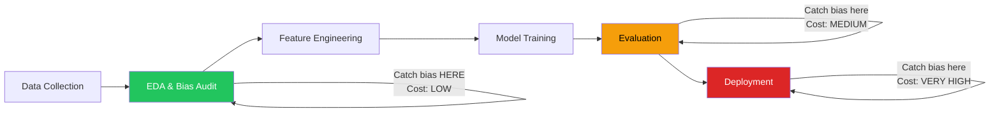
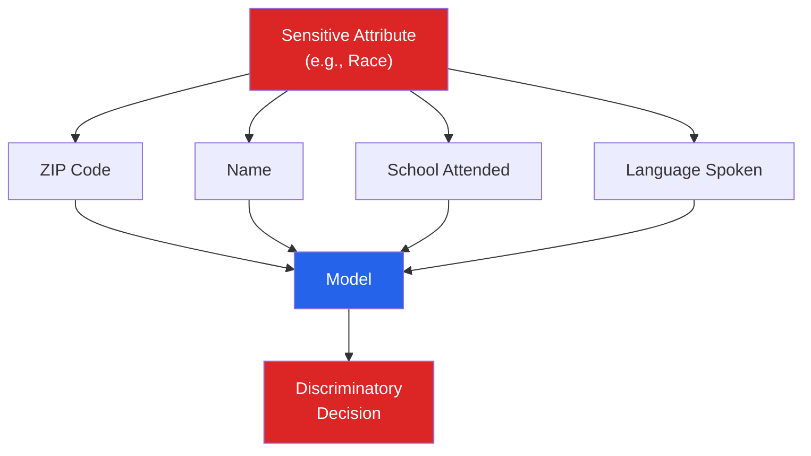
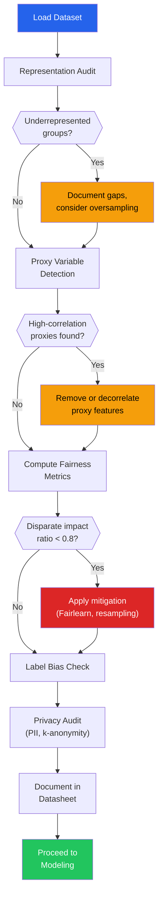

# EDA Ethics & Bias Detection

Every dataset encodes the world that produced it — including its inequities. If you train a model on biased data, you do not get an objective model. You get an automated system that scales those biases to millions of decisions per second. EDA is your first and best opportunity to catch bias before it hardens into production code. This page covers representation audits, proxy variable detection, fairness metrics, label bias analysis, privacy protection, and the tooling to do it all in Python.

---

## Why EDA Is the Right Place for Bias Detection



The cost of fixing bias increases exponentially as it moves through the pipeline. Catching a skewed gender distribution during EDA costs an afternoon. Catching it after deployment costs lawsuits, regulatory fines, and reputational damage.

---

## Representation Analysis: Who Is in Your Data?

The first question is not "What patterns exist?" but "Who exists in this data, and who is missing?"

### Demographic Audit

```python
import numpy as np
import pandas as pd
import matplotlib.pyplot as plt

np.random.seed(42)
n = 10000

# Simulating a hiring dataset with known representation issues
df = pd.DataFrame({
    "gender": np.random.choice(
        ["Male", "Female", "Non-binary"],
        n, p=[0.65, 0.30, 0.05],
    ),
    "race": np.random.choice(
        ["White", "Black", "Hispanic", "Asian", "Other"],
        n, p=[0.60, 0.12, 0.10, 0.15, 0.03],
    ),
    "age": np.random.normal(35, 10, n).astype(int).clip(18, 70),
    "disability_status": np.random.choice(
        ["None", "Physical", "Cognitive", "Sensory"],
        n, p=[0.88, 0.06, 0.04, 0.02],
    ),
    "education": np.random.choice(
        ["High School", "Bachelor", "Master", "PhD"],
        n, p=[0.20, 0.45, 0.25, 0.10],
    ),
    "hired": np.random.binomial(1, 0.30, n),
})

# Skew the hiring outcome by gender and race (simulating historical bias)
bias_mask_female = df["gender"] == "Female"
bias_mask_black = df["race"] == "Black"
bias_mask_hispanic = df["race"] == "Hispanic"

df.loc[bias_mask_female, "hired"] = np.random.binomial(1, 0.22, bias_mask_female.sum())
df.loc[bias_mask_black, "hired"] = np.random.binomial(1, 0.18, bias_mask_black.sum())
df.loc[bias_mask_hispanic, "hired"] = np.random.binomial(1, 0.20, bias_mask_hispanic.sum())


def representation_audit(
    data: pd.DataFrame,
    sensitive_cols: list[str],
    target_col: str,
    population_benchmarks: dict[str, dict[str, float]] = None,
) -> pd.DataFrame:
    """
    Audit representation and outcome rates for sensitive attributes.

    Parameters
    ----------
    data : DataFrame
    sensitive_cols : columns containing sensitive attributes
    target_col : binary outcome column
    population_benchmarks : optional dict of expected proportions
        e.g. {"race": {"White": 0.58, "Black": 0.13, ...}}
    """
    results = []

    for col in sensitive_cols:
        value_counts = data[col].value_counts()
        total = len(data)

        for group, count in value_counts.items():
            proportion = count / total
            group_data = data[data[col] == group]
            positive_rate = group_data[target_col].mean()

            row = {
                "attribute": col,
                "group": group,
                "count": count,
                "proportion": round(proportion, 4),
                "positive_rate": round(positive_rate, 4),
            }

            # Compare to population benchmark if provided
            if population_benchmarks and col in population_benchmarks:
                expected = population_benchmarks[col].get(group)
                if expected:
                    row["expected_proportion"] = expected
                    row["representation_ratio"] = round(proportion / expected, 3)

            results.append(row)

    return pd.DataFrame(results)


# US population benchmarks (approximate)
benchmarks = {
    "race": {
        "White": 0.58, "Black": 0.13,
        "Hispanic": 0.19, "Asian": 0.06, "Other": 0.04,
    },
    "gender": {
        "Male": 0.50, "Female": 0.50, "Non-binary": None,
    },
}

audit = representation_audit(
    df,
    sensitive_cols=["gender", "race"],
    target_col="hired",
    population_benchmarks=benchmarks,
)

print(audit.to_string(index=False))
```

### Intersectional Analysis

Single-axis analysis hides compounded disadvantage. A dataset might look balanced on gender AND race individually, but severely underrepresent Black women.

```python
def intersectional_audit(
    data: pd.DataFrame,
    attr_cols: list[str],
    target_col: str,
    min_group_size: int = 30,
) -> pd.DataFrame:
    """
    Cross-tabulate multiple sensitive attributes and compute
    outcome rates for intersectional groups.
    """
    grouped = data.groupby(attr_cols).agg(
        count=(target_col, "size"),
        positive_rate=(target_col, "mean"),
    ).reset_index()

    grouped["proportion"] = grouped["count"] / len(data)
    grouped = grouped[grouped["count"] >= min_group_size]
    grouped = grouped.sort_values("positive_rate")

    # Overall positive rate for comparison
    overall_rate = data[target_col].mean()
    grouped["rate_vs_overall"] = (
        grouped["positive_rate"] / overall_rate
    ).round(3)

    return grouped.round(4)


intersectional = intersectional_audit(df, ["gender", "race"], "hired")
print("Intersectional hiring rates (sorted by positive rate):")
print(intersectional.to_string(index=False))
print(f"\nOverall hiring rate: {df['hired'].mean():.4f}")

# Flag groups with hiring rate < 80% of the best group (four-fifths rule)
best_rate = intersectional["positive_rate"].max()
intersectional["four_fifths_flag"] = intersectional["positive_rate"] < (0.8 * best_rate)
flagged = intersectional[intersectional["four_fifths_flag"]]
print(f"\nGroups failing four-fifths rule ({len(flagged)}):")
print(flagged[["gender", "race", "positive_rate", "count"]].to_string(index=False))
```

::: warning The Four-Fifths Rule
Under US EEOC guidelines, a selection rate for any group that is less than 80% of the rate for the group with the highest rate is considered evidence of adverse impact. This is a legal threshold, not just a statistical one.
:::

---

## Proxy Variable Detection

Even if you remove sensitive attributes (gender, race, age), other features can act as proxies that leak the same information back into the model.



### Correlation-Based Proxy Detection

```python
import numpy as np
import pandas as pd
from scipy.stats import pointbiserialr, chi2_contingency, spearmanr
import warnings
warnings.filterwarnings("ignore")

np.random.seed(42)
n = 10000

# Features that are proxies for race/gender
zip_code = np.random.choice(
    ["10001", "10002", "10003", "10004", "10005"],
    n, p=[0.30, 0.25, 0.20, 0.15, 0.10],
)
# ZIP code correlates with race
race = np.where(
    np.isin(zip_code, ["10001", "10002"]),
    np.random.choice(["White", "Black", "Hispanic"], n, p=[0.70, 0.15, 0.15]),
    np.random.choice(["White", "Black", "Hispanic"], n, p=[0.30, 0.35, 0.35]),
)

# Income correlates with both gender and race (systemic inequality)
gender_numeric = np.random.binomial(1, 0.5, n)  # 0=Male, 1=Female
income = (
    50000
    + 20000 * (race == "White").astype(int)
    - 8000 * gender_numeric
    + np.random.normal(0, 15000, n)
).clip(20000, 200000)

proxy_df = pd.DataFrame({
    "zip_code": zip_code,
    "race": race,
    "gender": np.where(gender_numeric == 1, "Female", "Male"),
    "income": income,
    "credit_score": np.random.normal(700, 50, n).astype(int),
    "years_at_address": np.abs(np.random.normal(5, 3, n)).round(1),
})


def detect_proxy_variables(
    data: pd.DataFrame,
    sensitive_cols: list[str],
    feature_cols: list[str],
    correlation_threshold: float = 0.15,
) -> pd.DataFrame:
    """
    Detect features that may serve as proxies for sensitive attributes.

    Uses:
    - Point-biserial correlation for numeric vs binary sensitive
    - Cramer's V for categorical vs categorical
    - Spearman correlation for numeric vs numeric
    """
    results = []

    for sens_col in sensitive_cols:
        for feat_col in feature_cols:
            if sens_col == feat_col:
                continue

            sens_is_numeric = pd.api.types.is_numeric_dtype(data[sens_col])
            feat_is_numeric = pd.api.types.is_numeric_dtype(data[feat_col])

            if feat_is_numeric and not sens_is_numeric:
                # Encode sensitive as numeric for correlation
                encoded = data[sens_col].astype("category").cat.codes
                corr, p_value = spearmanr(data[feat_col], encoded)
                method = "Spearman"

            elif not feat_is_numeric and not sens_is_numeric:
                # Cramer's V for two categoricals
                contingency = pd.crosstab(data[feat_col], data[sens_col])
                chi2, p_value, _, _ = chi2_contingency(contingency)
                n_obs = contingency.sum().sum()
                min_dim = min(contingency.shape) - 1
                corr = np.sqrt(chi2 / (n_obs * max(min_dim, 1)))
                method = "Cramer's V"

            elif feat_is_numeric and sens_is_numeric:
                corr, p_value = spearmanr(data[feat_col], data[sens_col])
                method = "Spearman"

            else:
                # Numeric sensitive, categorical feature
                encoded = data[feat_col].astype("category").cat.codes
                corr, p_value = spearmanr(encoded, data[sens_col])
                method = "Spearman"

            is_proxy = abs(corr) >= correlation_threshold
            results.append({
                "sensitive_attr": sens_col,
                "feature": feat_col,
                "method": method,
                "correlation": round(abs(corr), 4),
                "p_value": round(p_value, 8) if p_value is not None else None,
                "is_proxy": is_proxy,
                "risk_level": (
                    "HIGH" if abs(corr) > 0.30
                    else "MEDIUM" if abs(corr) > 0.15
                    else "LOW"
                ),
            })

    return pd.DataFrame(results).sort_values("correlation", ascending=False)


proxy_report = detect_proxy_variables(
    proxy_df,
    sensitive_cols=["race", "gender"],
    feature_cols=["zip_code", "income", "credit_score", "years_at_address"],
)

print("Proxy Variable Detection Report")
print("=" * 70)
print(proxy_report.to_string(index=False))
print(f"\nHigh-risk proxies: {list(proxy_report[proxy_report['risk_level'] == 'HIGH']['feature'].unique())}")
```

::: danger Removing Sensitive Attributes Is Not Enough
Simply dropping `race` or `gender` from your feature set does not prevent discrimination. If `zip_code` carries 80% of the racial information, your model will learn the same biased patterns through the proxy. You must detect AND mitigate proxies.
:::

---

## Fairness Metrics

### Core Definitions

| Metric | Definition | Intuition |
|--------|-----------|-----------|
| **Demographic Parity** | P(Y_hat=1 \| A=a) = P(Y_hat=1 \| A=b) | Equal selection rates across groups |
| **Equalized Odds** | P(Y_hat=1 \| Y=y, A=a) = P(Y_hat=1 \| Y=y, A=b) for y in {0,1} | Equal TPR and FPR across groups |
| **Equal Opportunity** | P(Y_hat=1 \| Y=1, A=a) = P(Y_hat=1 \| Y=1, A=b) | Equal TPR across groups |
| **Disparate Impact** | min(P(Y_hat=1 \| A=a) / P(Y_hat=1 \| A=b)) | Ratio of selection rates (legal standard: > 0.8) |
| **Predictive Parity** | P(Y=1 \| Y_hat=1, A=a) = P(Y=1 \| Y_hat=1, A=b) | Equal precision across groups |
| **Calibration** | P(Y=1 \| score=s, A=a) = P(Y=1 \| score=s, A=b) | Equal calibration across groups |

::: tip You Cannot Satisfy All Fairness Metrics Simultaneously
Choquet, Kleinberg, and Mullainathan (2016) proved that except in trivial cases, it is mathematically impossible to satisfy demographic parity, equalized odds, and predictive parity at the same time. You must choose which fairness criterion matters most for your specific use case.
:::

### Computing Fairness Metrics From Scratch

```python
import numpy as np
import pandas as pd
from sklearn.metrics import confusion_matrix

np.random.seed(42)
n = 5000

# Simulate a loan approval model with biased predictions
group = np.random.choice(["Group_A", "Group_B"], n, p=[0.6, 0.4])
y_true = np.random.binomial(1, 0.40, n)
# Model is biased: lower approval rate for Group_B
y_pred = np.where(
    group == "Group_A",
    np.random.binomial(1, 0.45, n),
    np.random.binomial(1, 0.28, n),
)

fairness_df = pd.DataFrame({
    "group": group,
    "y_true": y_true,
    "y_pred": y_pred,
})


def compute_fairness_metrics(
    data: pd.DataFrame,
    group_col: str,
    y_true_col: str,
    y_pred_col: str,
) -> pd.DataFrame:
    """
    Compute a comprehensive suite of fairness metrics for each group.
    """
    groups = data[group_col].unique()
    group_metrics = {}

    for g in groups:
        mask = data[group_col] == g
        yt = data.loc[mask, y_true_col].values
        yp = data.loc[mask, y_pred_col].values

        tn, fp, fn, tp = confusion_matrix(yt, yp, labels=[0, 1]).ravel()
        total = len(yt)

        tpr = tp / (tp + fn) if (tp + fn) > 0 else 0  # sensitivity / recall
        fpr = fp / (fp + tn) if (fp + tn) > 0 else 0
        precision = tp / (tp + fp) if (tp + fp) > 0 else 0
        selection_rate = yp.mean()  # P(Y_hat=1 | A=g)

        group_metrics[g] = {
            "count": total,
            "base_rate": round(yt.mean(), 4),
            "selection_rate": round(selection_rate, 4),
            "tpr": round(tpr, 4),
            "fpr": round(fpr, 4),
            "precision": round(precision, 4),
            "tp": tp, "fp": fp, "fn": fn, "tn": tn,
        }

    metrics_df = pd.DataFrame(group_metrics).T
    metrics_df.index.name = "group"

    # Compute pairwise fairness metrics
    groups_list = list(groups)
    pairwise = {}
    for i, g1 in enumerate(groups_list):
        for g2 in groups_list[i+1:]:
            m1, m2 = group_metrics[g1], group_metrics[g2]

            # Demographic Parity Difference
            dp_diff = abs(m1["selection_rate"] - m2["selection_rate"])

            # Disparate Impact Ratio
            sr1, sr2 = m1["selection_rate"], m2["selection_rate"]
            di_ratio = min(sr1, sr2) / max(sr1, sr2) if max(sr1, sr2) > 0 else 0

            # Equalized Odds Difference (max of TPR diff and FPR diff)
            tpr_diff = abs(m1["tpr"] - m2["tpr"])
            fpr_diff = abs(m1["fpr"] - m2["fpr"])
            eo_diff = max(tpr_diff, fpr_diff)

            # Equal Opportunity Difference (TPR diff only)
            eop_diff = tpr_diff

            # Predictive Parity Difference
            pp_diff = abs(m1["precision"] - m2["precision"])

            pairwise[f"{g1} vs {g2}"] = {
                "demographic_parity_diff": round(dp_diff, 4),
                "disparate_impact_ratio": round(di_ratio, 4),
                "equalized_odds_diff": round(eo_diff, 4),
                "equal_opportunity_diff": round(eop_diff, 4),
                "predictive_parity_diff": round(pp_diff, 4),
                "di_passes_4/5_rule": di_ratio >= 0.80,
            }

    return metrics_df, pd.DataFrame(pairwise).T


group_metrics, pairwise_metrics = compute_fairness_metrics(
    fairness_df, "group", "y_true", "y_pred"
)

print("Per-Group Metrics:")
print(group_metrics.to_string())
print("\nPairwise Fairness Metrics:")
print(pairwise_metrics.to_string())
```

---

## Historical Bias: Cautionary Examples

| Domain | What Happened | Root Cause in Data |
|--------|--------------|-------------------|
| **Hiring** | Amazon's recruiting tool penalized resumes with the word "women's" | Training data was 10 years of resumes from a male-dominated applicant pool |
| **Lending** | Mortgage algorithms charged higher rates to Black and Hispanic borrowers | Historical redlining encoded into ZIP-code-based features |
| **Criminal Justice** | COMPAS recidivism scores had 2x false positive rate for Black defendants | Arrest data reflects policing patterns, not crime rates |
| **Healthcare** | Algorithm used healthcare spending as proxy for illness severity, systematically deprioritizing Black patients | Black patients had less access to healthcare, so spent less, appearing "healthier" |
| **Facial Recognition** | Error rates 10-100x higher for dark-skinned women vs light-skinned men | Training sets were overwhelmingly light-skinned male faces |

::: danger Bias Is Not a Bug — It Is a Feature of the Data
These systems did not malfunction. They worked exactly as designed — learning patterns from historical data that encoded decades of systemic inequality. The fix is never "more data" alone. It requires auditing the data generation process itself.
:::

---

## Label Bias: Inter-Annotator Agreement

Labels are not ground truth. They are human opinions, and those opinions carry bias. Measuring agreement between annotators reveals where labels are subjective, inconsistent, or systematically skewed.

```python
import numpy as np
import pandas as pd

np.random.seed(42)
n_items = 500
n_annotators = 4

# Simulating annotation data for sentiment (0=negative, 1=neutral, 2=positive)
# Annotator 3 has a systematic bias toward positive labels
annotations = np.random.choice([0, 1, 2], size=(n_items, n_annotators), p=[0.3, 0.4, 0.3])
annotations[:, 3] = np.where(
    annotations[:, 3] == 0,
    np.random.choice([0, 1, 2], n_items, p=[0.10, 0.30, 0.60]),
    annotations[:, 3],
)

ann_df = pd.DataFrame(
    annotations,
    columns=[f"annotator_{i}" for i in range(n_annotators)],
)


def cohens_kappa(rater1: np.ndarray, rater2: np.ndarray) -> float:
    """Cohen's kappa for two raters."""
    categories = sorted(set(rater1) | set(rater2))
    n = len(rater1)

    # Observed agreement
    p_o = np.mean(rater1 == rater2)

    # Expected agreement by chance
    p_e = sum(
        (np.sum(rater1 == c) / n) * (np.sum(rater2 == c) / n)
        for c in categories
    )

    kappa = (p_o - p_e) / (1 - p_e) if (1 - p_e) > 0 else 0
    return round(kappa, 4)


def fleiss_kappa(annotations_matrix: np.ndarray) -> float:
    """Fleiss' kappa for multiple raters."""
    n_items, n_raters = annotations_matrix.shape
    categories = sorted(set(annotations_matrix.flatten()))
    n_categories = len(categories)

    # Count how many raters assigned each category to each item
    cat_map = {c: i for i, c in enumerate(categories)}
    counts = np.zeros((n_items, n_categories))
    for i in range(n_items):
        for j in range(n_raters):
            counts[i, cat_map[annotations_matrix[i, j]]] += 1

    # Pi for each item: proportion of agreeing pairs
    pi = (np.sum(counts ** 2, axis=1) - n_raters) / (n_raters * (n_raters - 1))
    p_bar = np.mean(pi)

    # Pj for each category: overall proportion
    pj = np.sum(counts, axis=0) / (n_items * n_raters)
    pe = np.sum(pj ** 2)

    kappa = (p_bar - pe) / (1 - pe) if (1 - pe) > 0 else 0
    return round(kappa, 4)


# Pairwise Cohen's Kappa
print("Pairwise Cohen's Kappa:")
print("-" * 45)
for i in range(n_annotators):
    for j in range(i + 1, n_annotators):
        kappa = cohens_kappa(annotations[:, i], annotations[:, j])
        flag = " ← LOW" if kappa < 0.40 else ""
        print(f"  Annotator {i} vs {j}: kappa = {kappa:.4f}{flag}")

# Fleiss' Kappa (all raters)
fk = fleiss_kappa(annotations)
print(f"\nFleiss' Kappa (all raters): {fk}")

# Per-annotator bias detection
print("\nPer-Annotator Label Distribution:")
for i in range(n_annotators):
    dist = pd.Series(annotations[:, i]).value_counts(normalize=True).sort_index()
    print(f"  Annotator {i}: " + "  ".join(f"{k}:{v:.2%}" for k, v in dist.items()))
```

| Kappa Value | Interpretation |
|-------------|---------------|
| < 0.20 | Poor agreement — labels are essentially random |
| 0.21 - 0.40 | Fair — significant disagreement |
| 0.41 - 0.60 | Moderate — usable with caution |
| 0.61 - 0.80 | Substantial — good quality |
| 0.81 - 1.00 | Almost perfect — high reliability |

::: tip Disagreement Is Signal, Not Noise
High disagreement on certain items often reveals genuinely ambiguous cases. Instead of forcing agreement, flag these items. They may need richer annotation guidelines, additional context, or should be excluded from training entirely.
:::

---

## Privacy: PII Detection and Anonymization

### PII Detection with Presidio

Microsoft Presidio is an open-source framework for detecting and anonymizing personally identifiable information in text and structured data.

```python
# pip install presidio-analyzer presidio-anonymizer spacy
# python -m spacy download en_core_web_lg

from presidio_analyzer import AnalyzerEngine, RecognizerResult
from presidio_anonymizer import AnonymizerEngine
from presidio_anonymizer.entities import OperatorConfig
import pandas as pd

# Initialize engines
analyzer = AnalyzerEngine()
anonymizer = AnonymizerEngine()

# --- Detect PII in free-text columns ---
sample_texts = [
    "Contact John Smith at john.smith@example.com or call 555-123-4567",
    "Patient SSN is 123-45-6789, DOB 03/15/1985",
    "Send payment to account 4532-1234-5678-9012, routing 021000021",
    "Meeting with Dr. Sarah Johnson at 123 Main St, Boston MA 02101",
    "No PII in this completely clean text about machine learning.",
]


def detect_pii_in_series(
    texts: list[str],
    language: str = "en",
    score_threshold: float = 0.5,
) -> pd.DataFrame:
    """Scan a list of texts for PII entities."""
    results = []

    for i, text in enumerate(texts):
        entities = analyzer.analyze(
            text=text,
            language=language,
            score_threshold=score_threshold,
        )

        for entity in entities:
            results.append({
                "row_index": i,
                "entity_type": entity.entity_type,
                "start": entity.start,
                "end": entity.end,
                "score": round(entity.score, 3),
                "text_found": text[entity.start:entity.end],
            })

    return pd.DataFrame(results)


pii_report = detect_pii_in_series(sample_texts)
print("PII Detection Report:")
print(pii_report.to_string(index=False))

# Count PII types found
print("\nPII Summary:")
print(pii_report["entity_type"].value_counts().to_string())


# --- Anonymize detected PII ---
def anonymize_text(
    text: str,
    operators: dict = None,
) -> str:
    """Detect and anonymize PII in a single text."""
    entities = analyzer.analyze(text=text, language="en")

    if operators is None:
        operators = {
            "PERSON": OperatorConfig("replace", {"new_value": "<PERSON>"}),
            "EMAIL_ADDRESS": OperatorConfig("replace", {"new_value": "<EMAIL>"}),
            "PHONE_NUMBER": OperatorConfig("replace", {"new_value": "<PHONE>"}),
            "US_SSN": OperatorConfig("replace", {"new_value": "<SSN>"}),
            "CREDIT_CARD": OperatorConfig("replace", {"new_value": "<CREDIT_CARD>"}),
            "LOCATION": OperatorConfig("replace", {"new_value": "<LOCATION>"}),
            "DEFAULT": OperatorConfig("replace", {"new_value": "<REDACTED>"}),
        }

    anonymized = anonymizer.anonymize(
        text=text,
        analyzer_results=entities,
        operators=operators,
    )

    return anonymized.text


print("\nAnonymized texts:")
for i, text in enumerate(sample_texts):
    anon = anonymize_text(text)
    print(f"  [{i}] {anon}")
```

### K-Anonymity

K-anonymity ensures that every record in a dataset is indistinguishable from at least k-1 other records with respect to a set of quasi-identifiers.

```python
import pandas as pd
import numpy as np

np.random.seed(42)
n = 1000

# Dataset with quasi-identifiers that could re-identify individuals
records = pd.DataFrame({
    "age": np.random.randint(18, 80, n),
    "zip_code": np.random.choice(
        ["10001", "10002", "10003", "10004", "10005", "10006", "10007"],
        n,
    ),
    "gender": np.random.choice(["M", "F"], n),
    "diagnosis": np.random.choice(
        ["Diabetes", "Hypertension", "Healthy", "Asthma", "Depression"],
        n,
    ),
    "income": np.random.lognormal(10.5, 0.5, n).astype(int),
})


def check_k_anonymity(
    data: pd.DataFrame,
    quasi_identifiers: list[str],
    k: int = 5,
) -> dict:
    """
    Check if a dataset satisfies k-anonymity for given
    quasi-identifiers.
    """
    group_sizes = data.groupby(quasi_identifiers).size()

    violating_groups = group_sizes[group_sizes < k]
    violating_records = violating_groups.sum()

    return {
        "k_target": k,
        "total_groups": len(group_sizes),
        "min_group_size": group_sizes.min(),
        "max_group_size": group_sizes.max(),
        "mean_group_size": round(group_sizes.mean(), 2),
        "violating_groups": len(violating_groups),
        "violating_records": violating_records,
        "is_k_anonymous": group_sizes.min() >= k,
        "pct_records_exposed": round(violating_records / len(data) * 100, 2),
    }


def generalize_for_k_anonymity(
    data: pd.DataFrame,
    quasi_identifiers: list[str],
    k: int = 5,
    age_bin_size: int = 5,
    zip_truncate: int = 3,
) -> pd.DataFrame:
    """
    Apply generalization to achieve k-anonymity.
    - Ages: binned into ranges
    - ZIP codes: truncated
    """
    anon = data.copy()

    if "age" in quasi_identifiers:
        anon["age"] = (anon["age"] // age_bin_size) * age_bin_size
        anon["age"] = anon["age"].astype(str) + "-" + (anon["age"] + age_bin_size - 1).astype(str)

    if "zip_code" in quasi_identifiers:
        anon["zip_code"] = anon["zip_code"].str[:zip_truncate] + "**"

    return anon


# Check original data
qi = ["age", "zip_code", "gender"]
original_result = check_k_anonymity(records, qi, k=5)
print("Original data k-anonymity check:")
for key, val in original_result.items():
    print(f"  {key}: {val}")

# Apply generalization
generalized = generalize_for_k_anonymity(records, qi, k=5)
gen_result = check_k_anonymity(generalized, qi, k=5)
print("\nAfter generalization:")
for key, val in gen_result.items():
    print(f"  {key}: {val}")

print("\nSample of generalized data:")
print(generalized.head(10).to_string(index=False))
```

---

## Documentation: Datasheets for Datasets

Gebru et al. (2021) proposed standardized documentation for datasets, analogous to datasheets for electronic components. Every dataset you build or use should have one.

```python
from dataclasses import dataclass, field
from datetime import date
from typing import Optional

@dataclass
class DatasheetForDataset:
    """
    Structured documentation following Gebru et al. (2021).
    Fill this out for every dataset used in production.
    """

    # Motivation
    purpose: str = ""
    creators: list[str] = field(default_factory=list)
    funding_source: Optional[str] = None

    # Composition
    n_instances: int = 0
    instance_description: str = ""
    sensitive_attributes: list[str] = field(default_factory=list)
    known_missing_groups: list[str] = field(default_factory=list)
    label_description: str = ""
    contains_pii: bool = False
    pii_types: list[str] = field(default_factory=list)

    # Collection Process
    collection_method: str = ""
    time_period: str = ""
    geographic_scope: str = ""
    sampling_strategy: str = ""
    consent_obtained: bool = False

    # Preprocessing
    preprocessing_steps: list[str] = field(default_factory=list)
    excluded_records_reason: str = ""

    # Uses
    intended_use: str = ""
    prohibited_uses: list[str] = field(default_factory=list)

    # Distribution
    license: str = ""
    access_restrictions: str = ""

    # Maintenance
    maintained_by: str = ""
    last_updated: Optional[date] = None
    update_frequency: str = ""
    known_issues: list[str] = field(default_factory=list)

    def generate_report(self) -> str:
        lines = ["# Datasheet for Dataset", ""]
        lines += ["## Motivation"]
        lines += [f"- **Purpose**: {self.purpose}"]
        lines += [f"- **Creators**: {', '.join(self.creators)}"]
        lines += [f"- **Funding**: {self.funding_source or 'N/A'}", ""]
        lines += ["## Composition"]
        lines += [f"- **Instances**: {self.n_instances:,}"]
        lines += [f"- **Description**: {self.instance_description}"]
        lines += [f"- **Sensitive attributes**: {', '.join(self.sensitive_attributes) or 'None'}"]
        lines += [f"- **Missing groups**: {', '.join(self.known_missing_groups) or 'None identified'}"]
        lines += [f"- **Contains PII**: {'Yes — ' + ', '.join(self.pii_types) if self.contains_pii else 'No'}", ""]
        lines += ["## Collection"]
        lines += [f"- **Method**: {self.collection_method}"]
        lines += [f"- **Period**: {self.time_period}"]
        lines += [f"- **Geography**: {self.geographic_scope}"]
        lines += [f"- **Consent**: {'Yes' if self.consent_obtained else 'No / Unknown'}", ""]
        lines += ["## Known Issues"]
        for issue in self.known_issues:
            lines += [f"- {issue}"]
        return "\n".join(lines)


# Example: document a hiring dataset
hiring_datasheet = DatasheetForDataset(
    purpose="Train automated resume screening model",
    creators=["HR Analytics Team"],
    funding_source="Internal R&D budget",
    n_instances=50000,
    instance_description="One row per job application, 2019-2024",
    sensitive_attributes=["gender", "race", "age", "disability_status"],
    known_missing_groups=[
        "Non-binary gender (< 1% of records)",
        "Indigenous applicants (underrepresented)",
        "Applicants over 60 (very few applications)",
    ],
    label_description="Binary: hired (1) or not hired (0)",
    contains_pii=True,
    pii_types=["name", "email", "phone", "address"],
    collection_method="Extracted from ATS (Applicant Tracking System)",
    time_period="January 2019 — December 2024",
    geographic_scope="United States only",
    sampling_strategy="All applications — no sampling",
    consent_obtained=True,
    preprocessing_steps=[
        "Removed duplicate applications",
        "Standardized job title taxonomy",
        "Anonymized names and emails",
    ],
    intended_use="Internal hiring analytics and bias auditing",
    prohibited_uses=[
        "Automated rejection without human review",
        "Sharing with third parties",
    ],
    known_issues=[
        "Gender field is binary (M/F) before 2022 — non-binary added later",
        "Race/ethnicity is self-reported and optional (15% missing)",
        "Historical bias: hiring rate for women was 22% vs 35% for men",
        "Department-level data missing for 2019 Q1",
    ],
)

print(hiring_datasheet.generate_report())
```

---

## Tools: Aequitas

Aequitas is a bias and fairness audit toolkit from the University of Chicago's Center for Data Science and Public Policy.

```python
# pip install aequitas

import pandas as pd
import numpy as np
from aequitas.group import Group
from aequitas.bias import Bias
from aequitas.fairness import Fairness

np.random.seed(42)
n = 8000

# Prepare data in Aequitas format:
# requires: score, label_value, and at least one sensitive attribute
aequitas_df = pd.DataFrame({
    "score": np.random.binomial(1, 0.35, n),  # model predictions
    "label_value": np.random.binomial(1, 0.40, n),  # ground truth
    "race": np.random.choice(
        ["White", "Black", "Hispanic", "Asian"], n, p=[0.55, 0.15, 0.20, 0.10]
    ),
    "gender": np.random.choice(["Male", "Female"], n, p=[0.55, 0.45]),
})

# Inject bias: lower scores for Black and Hispanic
black_mask = aequitas_df["race"] == "Black"
hisp_mask = aequitas_df["race"] == "Hispanic"
aequitas_df.loc[black_mask, "score"] = np.random.binomial(1, 0.22, black_mask.sum())
aequitas_df.loc[hisp_mask, "score"] = np.random.binomial(1, 0.25, hisp_mask.sum())

# --- Step 1: Group metrics ---
g = Group()
xtab, _ = g.get_crosstabs(aequitas_df)
print("Group Metrics (crosstabs):")
print(xtab[["attribute_name", "attribute_value", "group_label_pos",
            "group_label_neg", "group_size", "prev"]].to_string(index=False))

# --- Step 2: Bias metrics ---
b = Bias()
bdf = b.get_disparity_predefined_groups(
    xtab,
    original_df=aequitas_df,
    ref_groups_dict={
        "race": "White",
        "gender": "Male",
    },
    alpha=0.05,
    check_significance=True,
)

print("\nBias Disparity Metrics (vs reference group):")
cols_to_show = [
    "attribute_name", "attribute_value",
    "ppr_disparity", "pprev_disparity",
    "fdr_disparity", "for_disparity",
]
available_cols = [c for c in cols_to_show if c in bdf.columns]
print(bdf[available_cols].to_string(index=False))

# --- Step 3: Fairness assessment ---
f = Fairness()
fdf = f.get_group_value_fairness(bdf)

print("\nFairness Assessment:")
fairness_cols = [c for c in fdf.columns if "Fairness" in c or "attribute" in c.lower()]
if fairness_cols:
    print(fdf[fairness_cols].to_string(index=False))

# Overall fairness determination
overall = f.get_overall_fairness(fdf)
print(f"\nOverall fairness: {overall}")
```

---

## Tools: Fairlearn

Fairlearn (from Microsoft) provides both assessment and mitigation algorithms for fairness-aware machine learning.

```python
# pip install fairlearn scikit-learn

import numpy as np
import pandas as pd
from sklearn.model_selection import train_test_split
from sklearn.ensemble import GradientBoostingClassifier
from sklearn.metrics import accuracy_score

from fairlearn.metrics import (
    MetricFrame,
    selection_rate,
    demographic_parity_difference,
    demographic_parity_ratio,
    equalized_odds_difference,
)
from fairlearn.reductions import (
    ExponentiatedGradient,
    DemographicParity,
    EqualizedOdds,
)

np.random.seed(42)
n = 10000

# Generate a lending dataset
age = np.random.normal(40, 12, n).clip(21, 75).astype(int)
income = np.random.lognormal(10.8, 0.5, n)
credit_score = np.random.normal(700, 60, n).clip(300, 850).astype(int)
gender = np.random.choice(["Male", "Female"], n, p=[0.55, 0.45])

# Target: loan approval (biased by gender in historical data)
approval_prob = (
    0.1
    + 0.3 * ((credit_score - 300) / 550)
    + 0.2 * ((income - 20000) / 180000)
    - 0.12 * (gender == "Female").astype(float)
    + np.random.normal(0, 0.1, n)
).clip(0, 1)

approved = (np.random.random(n) < approval_prob).astype(int)

df = pd.DataFrame({
    "age": age,
    "income": income,
    "credit_score": credit_score,
    "gender": gender,
    "approved": approved,
})

# Train/test split
X = df[["age", "income", "credit_score"]]
y = df["approved"]
sensitive = df["gender"]

X_train, X_test, y_train, y_test, sens_train, sens_test = train_test_split(
    X, y, sensitive, test_size=0.3, random_state=42
)

# --- Train unconstrained model ---
base_model = GradientBoostingClassifier(n_estimators=100, random_state=42)
base_model.fit(X_train, y_train)
y_pred_base = base_model.predict(X_test)

# --- Fairness Assessment ---
metric_frame = MetricFrame(
    metrics={
        "accuracy": accuracy_score,
        "selection_rate": selection_rate,
    },
    y_true=y_test,
    y_pred=y_pred_base,
    sensitive_features=sens_test,
)

print("=== Unconstrained Model ===")
print(f"Overall accuracy: {accuracy_score(y_test, y_pred_base):.4f}")
print(f"\nPer-group metrics:\n{metric_frame.by_group}")
print(f"\nDemographic parity difference: "
      f"{demographic_parity_difference(y_test, y_pred_base, sensitive_features=sens_test):.4f}")
print(f"Demographic parity ratio: "
      f"{demographic_parity_ratio(y_test, y_pred_base, sensitive_features=sens_test):.4f}")


# --- Mitigate with Exponentiated Gradient ---
constraint = DemographicParity()
mitigator = ExponentiatedGradient(
    estimator=GradientBoostingClassifier(n_estimators=100, random_state=42),
    constraints=constraint,
)
mitigator.fit(X_train, y_train, sensitive_features=sens_train)
y_pred_fair = mitigator.predict(X_test)

# --- Compare ---
metric_frame_fair = MetricFrame(
    metrics={
        "accuracy": accuracy_score,
        "selection_rate": selection_rate,
    },
    y_true=y_test,
    y_pred=y_pred_fair,
    sensitive_features=sens_test,
)

print("\n=== Mitigated Model (Demographic Parity) ===")
print(f"Overall accuracy: {accuracy_score(y_test, y_pred_fair):.4f}")
print(f"\nPer-group metrics:\n{metric_frame_fair.by_group}")
print(f"\nDemographic parity difference: "
      f"{demographic_parity_difference(y_test, y_pred_fair, sensitive_features=sens_test):.4f}")
print(f"Demographic parity ratio: "
      f"{demographic_parity_ratio(y_test, y_pred_fair, sensitive_features=sens_test):.4f}")


# --- Summary comparison ---
print("\n=== Accuracy vs Fairness Tradeoff ===")
print(f"{'Metric':<35s} {'Unconstrained':>15s} {'Mitigated':>15s}")
print("-" * 65)
print(f"{'Overall accuracy':<35s} "
      f"{accuracy_score(y_test, y_pred_base):>15.4f} "
      f"{accuracy_score(y_test, y_pred_fair):>15.4f}")
print(f"{'Demographic parity difference':<35s} "
      f"{demographic_parity_difference(y_test, y_pred_base, sensitive_features=sens_test):>15.4f} "
      f"{demographic_parity_difference(y_test, y_pred_fair, sensitive_features=sens_test):>15.4f}")
print(f"{'Demographic parity ratio':<35s} "
      f"{demographic_parity_ratio(y_test, y_pred_base, sensitive_features=sens_test):>15.4f} "
      f"{demographic_parity_ratio(y_test, y_pred_fair, sensitive_features=sens_test):>15.4f}")
```

::: tip The Fairness-Accuracy Tradeoff
Fairness constraints almost always reduce raw accuracy. This is expected and acceptable — an accurate model that discriminates is worse than a slightly less accurate model that treats people fairly. The question is never "Can we avoid the tradeoff?" but "What tradeoff is acceptable for this use case?"
:::

---

## Bias Detection Workflow



---

## Key Takeaways

| Principle | Details |
|-----------|---------|
| **Representation first** | Before any analysis, ask who is in the data and who is missing. Intersectional analysis reveals compounding disadvantage |
| **Proxies are everywhere** | ZIP code, name, school, language — all can leak sensitive attribute information into "fair" models |
| **Fairness is a choice** | Multiple incompatible definitions exist. You must choose which one applies to your domain and justify it |
| **Labels are not truth** | Inter-annotator agreement, annotator demographics, and guideline clarity all affect label quality |
| **Privacy is non-negotiable** | PII detection and k-anonymity are not optional. Regulatory penalties are severe (GDPR: up to 4% of global revenue) |
| **Document everything** | Datasheets for datasets create accountability and enable downstream users to make informed decisions |

::: danger Ethics Is Not a Checkbox
Running Fairlearn once does not make your system fair. Bias detection must be continuous — data changes, populations shift, and societal standards evolve. Build bias auditing into your monitoring pipeline alongside drift detection and performance tracking.
:::
