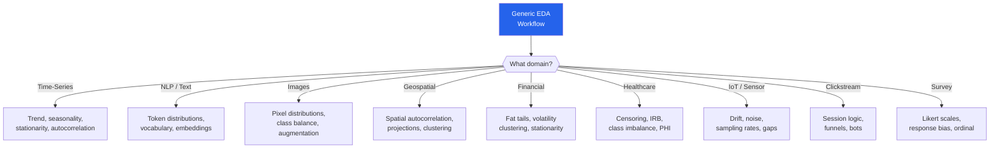

# EDA for Different Domains

The 10-step EDA workflow applies everywhere, but the specific questions, visualizations, and pitfalls change dramatically by domain. Time-series data demands stationarity checks. NLP data requires token distributions. Financial data has fat tails. Healthcare data has censoring. This page covers how to adapt your EDA practice for nine common data domains.

---

## Domain Adaptation Overview



---

## 1. Time-Series Data

Time-series EDA is fundamentally different because **order matters**. You cannot randomly shuffle rows. You cannot do random train/test splits. And the most important patterns — trends, seasonality, autocorrelation — are invisible in standard EDA.

```python
# eda_timeseries.py — Time-series specific EDA
import pandas as pd
import numpy as np
import matplotlib.pyplot as plt
from statsmodels.tsa.seasonal import seasonal_decompose
from statsmodels.tsa.stattools import adfuller, acf, pacf
from statsmodels.graphics.tsaplots import plot_acf, plot_pacf

# Generate synthetic time series with trend + seasonality + noise
np.random.seed(42)
n_days = 730  # 2 years
dates = pd.date_range('2024-01-01', periods=n_days, freq='D')
trend = np.linspace(100, 200, n_days)
seasonality = 30 * np.sin(2 * np.pi * np.arange(n_days) / 365.25)
weekly = 10 * np.sin(2 * np.pi * np.arange(n_days) / 7)
noise = np.random.normal(0, 8, n_days)
values = trend + seasonality + weekly + noise

ts = pd.Series(values, index=dates, name='daily_sales')

# Step 1: Plot the raw time series — always first
print("=== TIME-SERIES EDA ===")
print(f"Period: {ts.index.min()} to {ts.index.max()}")
print(f"Length: {len(ts)} observations")
print(f"Frequency: Daily")

fig, axes = plt.subplots(3, 1, figsize=(14, 10))
ts.plot(ax=axes[0], title='Raw Time Series')
ts.rolling(30).mean().plot(ax=axes[1], title='30-Day Moving Average')
ts.diff().plot(ax=axes[2], title='First Difference (Detrended)')
plt.tight_layout()
plt.savefig("timeseries_eda.png", dpi=150)
plt.show()

# Step 2: Stationarity test — MUST check before modeling
result = adfuller(ts.dropna())
print(f"\nAugmented Dickey-Fuller Test:")
print(f"  Test statistic: {result[0]:.4f}")
print(f"  p-value: {result[1]:.4f}")
print(f"  Stationary: {'Yes' if result[1] < 0.05 else 'No — need differencing'}")

# Step 3: Decomposition
decomposition = seasonal_decompose(ts, period=365, model='additive')
fig = decomposition.plot()
fig.set_size_inches(14, 10)
plt.savefig("timeseries_decomposition.png", dpi=150)
plt.show()

# Step 4: Autocorrelation
fig, axes = plt.subplots(1, 2, figsize=(14, 4))
plot_acf(ts.diff().dropna(), lags=40, ax=axes[0])
plot_pacf(ts.diff().dropna(), lags=40, ax=axes[1])
plt.tight_layout()
plt.savefig("timeseries_acf_pacf.png", dpi=150)
plt.show()

# Step 5: Calendar patterns
print("\nDay-of-Week Pattern:")
dow = ts.groupby(ts.index.dayofweek).mean()
dow.index = ['Mon', 'Tue', 'Wed', 'Thu', 'Fri', 'Sat', 'Sun']
print(dow.round(1))

print("\nMonth Pattern:")
monthly = ts.groupby(ts.index.month).mean()
print(monthly.round(1))
```

### Time-Series EDA Checklist

| Check | Why | Tool |
|-------|-----|------|
| Plot raw series | See trend, seasonality, breaks | `matplotlib` |
| Check stationarity | Non-stationary series need differencing | `adfuller` |
| Decompose | Separate trend, seasonal, residual | `seasonal_decompose` |
| ACF / PACF | Identify AR and MA orders | `statsmodels` |
| Calendar effects | Day-of-week, holidays, month-end | `groupby` |
| Missing timestamps | Gaps in the series | `asfreq` + `isnull` |
| Change points | Structural breaks | `ruptures` |

::: warning Never Random-Split Time Series
`train_test_split(X, y, test_size=0.2)` will leak future data into training. Always use temporal splits: train on data before a date, test on data after.
:::

---

## 2. NLP / Text Data

Text EDA is about understanding the vocabulary, the length distributions, and the linguistic patterns before building any model.

```python
# eda_nlp.py — Text-specific EDA
import pandas as pd
import numpy as np
from collections import Counter
import re

# Synthetic dataset of product reviews
np.random.seed(42)
reviews = [
    "Great product, works perfectly. Fast shipping!",
    "Terrible quality. Broke after one week. DO NOT BUY.",
    "Meh, it's okay. Nothing special for the price.",
    "AMAZING!!! Best purchase I've ever made. 10/10 would recommend!",
    "Product arrived damaged. Customer service was unhelpful.",
    "Good value for money. Does what it says. Recommended.",
    "Waste of money. Complete junk. Returned immediately.",
    "Five stars! My kids love it. Great gift idea.",
    "Not bad. Better than expected for the price point.",
    "Awful awful awful. Seller is a scam artist.",
] * 50  # Repeat for more data

labels = [1, 0, 0, 1, 0, 1, 0, 1, 1, 0] * 50
df = pd.DataFrame({'review': reviews, 'positive': labels})

# Step 1: Basic text statistics
print("=== TEXT EDA ===")
df['n_chars'] = df['review'].str.len()
df['n_words'] = df['review'].str.split().str.len()
df['n_sentences'] = df['review'].str.count(r'[.!?]+')
df['avg_word_len'] = df['review'].apply(
    lambda x: np.mean([len(w) for w in x.split()])
)
df['has_caps'] = df['review'].str.contains(r'[A-Z]{3,}')
df['n_exclamation'] = df['review'].str.count('!')
df['n_question'] = df['review'].str.count(r'\?')

print(df[['n_chars', 'n_words', 'n_sentences', 'avg_word_len']].describe().round(1))

# Step 2: Class-specific text features
print("\n=== TEXT FEATURES BY CLASS ===")
for label_name, label_val in [('Positive', 1), ('Negative', 0)]:
    subset = df[df['positive'] == label_val]
    print(f"\n{label_name} reviews (n={len(subset)}):")
    print(f"  Mean word count: {subset['n_words'].mean():.1f}")
    print(f"  Mean char count: {subset['n_chars'].mean():.1f}")
    print(f"  % with ALL CAPS: {subset['has_caps'].mean():.1%}")
    print(f"  Mean exclamation marks: {subset['n_exclamation'].mean():.1f}")

# Step 3: Vocabulary analysis
all_words = ' '.join(df['review']).lower()
all_words = re.sub(r'[^a-z\s]', '', all_words).split()
vocab = Counter(all_words)
print(f"\n=== VOCABULARY ===")
print(f"Total tokens: {len(all_words)}")
print(f"Unique tokens: {len(vocab)}")
print(f"Type-token ratio: {len(vocab)/len(all_words):.3f}")
print(f"\nTop 15 words: {vocab.most_common(15)}")

# Positive-specific words
pos_words = ' '.join(df[df['positive']==1]['review']).lower()
pos_words = re.sub(r'[^a-z\s]', '', pos_words).split()
pos_vocab = Counter(pos_words)

neg_words = ' '.join(df[df['positive']==0]['review']).lower()
neg_words = re.sub(r'[^a-z\s]', '', neg_words).split()
neg_vocab = Counter(neg_words)

print("\n=== DISTINCTIVE WORDS ===")
# Words that appear disproportionately in positive vs negative
for word, count in pos_vocab.most_common(100):
    pos_rate = count / len(pos_words)
    neg_rate = neg_vocab.get(word, 0) / len(neg_words)
    if pos_rate > 2 * neg_rate and count > 5:
        print(f"  Positive-leaning: '{word}' (pos: {pos_rate:.3f}, neg: {neg_rate:.3f})")
```

---

## 3. Image Data

```python
# eda_images.py — Image dataset EDA patterns
import numpy as np
from collections import Counter

# Simulate image dataset metadata (since we cannot load actual images)
np.random.seed(42)
n_images = 5000

metadata = {
    'filename': [f'img_{i:05d}.jpg' for i in range(n_images)],
    'width': np.random.choice([224, 256, 320, 640, 1024], n_images,
                               p=[0.3, 0.25, 0.2, 0.15, 0.1]),
    'height': np.random.choice([224, 256, 320, 480, 768], n_images,
                                p=[0.3, 0.25, 0.2, 0.15, 0.1]),
    'class': np.random.choice(['cat', 'dog', 'bird', 'fish', 'snake'], n_images,
                               p=[0.35, 0.30, 0.15, 0.12, 0.08]),
    'file_size_kb': np.random.lognormal(5, 0.8, n_images),
    'brightness_mean': np.random.normal(128, 30, n_images),
    'brightness_std': np.random.exponential(40, n_images),
}

import pandas as pd
df = pd.DataFrame(metadata)
df['aspect_ratio'] = df['width'] / df['height']

print("=== IMAGE DATASET EDA ===")
print(f"Total images: {len(df)}")
print(f"\n--- Class Distribution ---")
class_dist = df['class'].value_counts()
for cls, count in class_dist.items():
    pct = count / len(df) * 100
    bar = '#' * int(pct)
    print(f"  {cls:>6}: {count:5d} ({pct:5.1f}%) {bar}")

# Class imbalance ratio
max_class = class_dist.max()
min_class = class_dist.min()
print(f"\nImbalance ratio: {max_class/min_class:.1f}x")
if max_class / min_class > 3:
    print("WARNING: Class imbalance > 3x — consider oversampling or weighted loss")

print(f"\n--- Image Dimensions ---")
print(df[['width', 'height', 'aspect_ratio']].describe().round(1))
print(f"\nUnique sizes: {df.groupby(['width', 'height']).ngroups}")
if df.groupby(['width', 'height']).ngroups > 1:
    print("WARNING: Mixed image sizes — need resizing before training")

print(f"\n--- File Size Distribution ---")
print(f"Mean: {df['file_size_kb'].mean():.0f} KB")
print(f"Median: {df['file_size_kb'].median():.0f} KB")
print(f"Min: {df['file_size_kb'].min():.0f} KB (check for corrupt/empty images)")
print(f"Max: {df['file_size_kb'].max():.0f} KB")

# Potential issues
small_images = df[df['file_size_kb'] < 5]
print(f"\nSuspiciously small images (< 5KB): {len(small_images)}")
print("These may be corrupt, placeholder, or all-black images")
```

### Image EDA Checklist

| Check | Why | What to Look For |
|-------|-----|-----------------|
| Class distribution | Imbalance kills model performance | > 3x ratio needs intervention |
| Image dimensions | Mixed sizes need resizing pipeline | Standard sizes for your architecture |
| Color channels | Grayscale mixed with RGB? | Check `img.shape` for each image |
| Brightness distribution | Dark or washed-out images | Mean pixel value per image |
| Corrupt images | Training will crash | Zero-byte files, unloadable images |
| Duplicate images | Data leakage between train/test | Perceptual hashing (imagehash) |
| Label quality | Mislabeled images propagate errors | Random sample audit (100+ images) |

---

## 4. Geospatial Data

```python
# eda_geospatial.py — Spatial data EDA patterns
import pandas as pd
import numpy as np

np.random.seed(42)

# Simulate store location data
n_stores = 500
df = pd.DataFrame({
    'store_id': range(n_stores),
    'lat': np.random.uniform(25, 48, n_stores),  # US latitude range
    'lon': np.random.uniform(-125, -70, n_stores),  # US longitude range
    'revenue': np.random.lognormal(12, 1, n_stores),
    'sqft': np.random.normal(5000, 1500, n_stores),
    'year_opened': np.random.randint(1990, 2026, n_stores),
})

# Step 1: Coordinate validation
print("=== GEOSPATIAL EDA ===")
print(f"\n--- Coordinate Validation ---")
print(f"Latitude range: {df['lat'].min():.2f} to {df['lat'].max():.2f}")
print(f"Longitude range: {df['lon'].min():.2f} to {df['lon'].max():.2f}")

# Check for impossible coordinates
invalid_lat = df[(df['lat'] < -90) | (df['lat'] > 90)]
invalid_lon = df[(df['lon'] < -180) | (df['lon'] > 180)]
print(f"Invalid latitudes: {len(invalid_lat)}")
print(f"Invalid longitudes: {len(invalid_lon)}")

# Check for swapped lat/lon (common mistake!)
# US longitudes should be negative; if lon is positive, it is in Asia
swapped = df[df['lon'] > 0]
print(f"Possibly swapped lat/lon (positive longitude in US data): {len(swapped)}")

# Step 2: Spatial distribution
print(f"\n--- Spatial Distribution ---")
# Divide into grid cells
df['lat_bin'] = pd.cut(df['lat'], bins=5)
df['lon_bin'] = pd.cut(df['lon'], bins=5)
spatial_density = df.groupby(['lat_bin', 'lon_bin']).size().unstack(fill_value=0)
print("Store density by region:")
print(spatial_density)

# Step 3: Nearest neighbor distances
from scipy.spatial.distance import pdist, squareform

coords = df[['lat', 'lon']].values
# Approximate distances in km using Haversine-like scaling
lat_km = 111  # 1 degree latitude ≈ 111 km
lon_km = 85   # varies by latitude, ~85 km at 40°N
scaled_coords = coords * [lat_km, lon_km]
dists = squareform(pdist(scaled_coords))
np.fill_diagonal(dists, np.inf)
nearest = dists.min(axis=1)

print(f"\n--- Nearest Neighbor Distances ---")
print(f"Mean nearest store: {nearest.mean():.1f} km")
print(f"Median nearest store: {np.median(nearest):.1f} km")
print(f"Min nearest store: {nearest.min():.1f} km (possible duplicate locations)")
print(f"Max nearest store: {nearest.max():.1f} km (isolated store)")

# Step 4: Revenue by region
print(f"\n--- Revenue by Region ---")
df['region'] = pd.cut(df['lat'], bins=[25, 35, 40, 48],
                       labels=['South', 'Middle', 'North'])
print(df.groupby('region')['revenue'].agg(['mean', 'median', 'count']).round(0))
```

::: tip Common Geospatial Data Issues
1. **Swapped lat/lon** — latitudes in the US should be 25-49, longitudes -67 to -125
2. **Wrong projection** — coordinates in Web Mercator vs WGS84 look similar but are not interchangeable for distance calculations
3. **Geocoding errors** — addresses geocoded to city centroid instead of actual location
4. **Timezone mismatches** — timestamps without timezone info when spanning multiple zones
:::

---

## 5. Financial Data

```python
# eda_financial.py — Financial data EDA patterns
import pandas as pd
import numpy as np
from scipy import stats

np.random.seed(42)

# Simulate daily stock returns
n_days = 1000
returns = np.random.standard_t(df=5, size=n_days) * 0.01  # Fat-tailed returns
# Add volatility clustering (GARCH-like effect)
for i in range(1, n_days):
    if abs(returns[i-1]) > 0.02:
        returns[i] *= 1.5  # Higher volatility follows large moves

dates = pd.date_range('2022-01-01', periods=n_days, freq='B')
prices = 100 * np.exp(np.cumsum(returns))

df = pd.DataFrame({
    'date': dates,
    'price': prices,
    'return': returns,
    'volume': np.random.lognormal(15, 0.5, n_days),
})

print("=== FINANCIAL DATA EDA ===")

# Step 1: Return distribution — test for normality (it will NOT be normal)
print("\n--- Return Distribution ---")
print(f"Mean daily return: {df['return'].mean():.4f}")
print(f"Std daily return: {df['return'].std():.4f}")
print(f"Skewness: {df['return'].skew():.3f}")
print(f"Kurtosis: {df['return'].kurtosis():.3f} (normal = 3)")
print(f"  Excess kurtosis indicates FAT TAILS")

# Normality test
stat, p_val = stats.jarque_bera(df['return'])
print(f"\nJarque-Bera normality test: stat={stat:.1f}, p={p_val:.6f}")
print(f"Normal? {'Yes' if p_val > 0.05 else 'NO — returns are NOT normal'}")

# Step 2: Tail risk analysis
print("\n--- Tail Risk ---")
for threshold in [0.02, 0.03, 0.05]:
    actual = (np.abs(df['return']) > threshold).mean()
    normal_expected = 2 * (1 - stats.norm.cdf(threshold / df['return'].std()))
    ratio = actual / normal_expected if normal_expected > 0 else float('inf')
    print(f"  |return| > {threshold:.0%}: actual={actual:.3%}, "
          f"normal expects={normal_expected:.3%}, ratio={ratio:.1f}x")
print("Financial returns have FAR more extreme events than a normal distribution")

# Step 3: Volatility clustering
print("\n--- Volatility Clustering ---")
df['abs_return'] = np.abs(df['return'])
autocorr_1 = df['abs_return'].autocorrelation()
print(f"Autocorrelation of |returns| at lag 1: {autocorr_1:.3f}")
print("Positive autocorrelation = volatility clusters (big moves follow big moves)")

# Step 4: Calendar effects
df['dayofweek'] = df['date'].dt.dayofweek
print("\n--- Day-of-Week Returns ---")
dow_returns = df.groupby('dayofweek')['return'].agg(['mean', 'std'])
dow_returns.index = ['Mon', 'Tue', 'Wed', 'Thu', 'Fri']
print(dow_returns.round(5))
```

::: danger Never Assume Normality in Finance
Financial returns are fat-tailed. Events that a normal distribution says should happen once in 10,000 years happen every few years. Using normal-distribution assumptions for risk management is how Long-Term Capital Management and many banks blew up.
:::

---

## 6. Healthcare Data

```python
# eda_healthcare.py — Healthcare-specific EDA patterns
import pandas as pd
import numpy as np

np.random.seed(42)

# Simulate patient data
n_patients = 2000
df = pd.DataFrame({
    'patient_id': range(n_patients),
    'age': np.random.normal(55, 18, n_patients).clip(0, 100).astype(int),
    'sex': np.random.choice(['M', 'F'], n_patients),
    'bmi': np.random.normal(28, 6, n_patients).clip(15, 60),
    'systolic_bp': np.random.normal(130, 20, n_patients).clip(80, 220),
    'cholesterol': np.random.normal(200, 40, n_patients).clip(100, 400),
    'diabetes': np.random.binomial(1, 0.15, n_patients),
    'readmitted_30d': np.random.binomial(1, 0.12, n_patients),
    'length_of_stay': np.random.exponential(5, n_patients).clip(1, 60),
    'time_to_event': np.random.exponential(365, n_patients),
    'censored': np.random.binomial(1, 0.4, n_patients),  # Lost to follow-up
})

print("=== HEALTHCARE DATA EDA ===")

# Step 1: Demographics — check for bias
print("\n--- Demographics ---")
print(f"Age: mean={df['age'].mean():.0f}, std={df['age'].std():.0f}")
print(f"Sex distribution:\n{df['sex'].value_counts()}")
print(f"BMI: mean={df['bmi'].mean():.1f}, std={df['bmi'].std():.1f}")

# Step 2: Target distribution and class imbalance
print(f"\n--- Target: 30-day Readmission ---")
print(f"Readmission rate: {df['readmitted_30d'].mean():.1%}")
print(f"Class ratio: {(1-df['readmitted_30d'].mean())/df['readmitted_30d'].mean():.1f}:1")
if df['readmitted_30d'].mean() < 0.15:
    print("WARNING: Severe class imbalance. Need SMOTE, weighted loss, or threshold tuning.")

# Step 3: Clinical range validation
print(f"\n--- Clinical Range Validation ---")
clinical_ranges = {
    'age': (0, 120), 'bmi': (10, 70),
    'systolic_bp': (60, 250), 'cholesterol': (50, 500),
}
for col, (lo, hi) in clinical_ranges.items():
    out = df[(df[col] < lo) | (df[col] > hi)]
    status = "PASS" if len(out) == 0 else f"FAIL ({len(out)} out of range)"
    print(f"  {col:>15}: [{lo}, {hi}] — {status}")

# Step 4: Censoring analysis (critical for survival data)
print(f"\n--- Censoring Analysis ---")
print(f"Censored observations: {df['censored'].sum()} ({df['censored'].mean():.1%})")
print(f"Uncensored (event observed): {(1-df['censored']).sum()}")
print(f"\nTime-to-event by censoring status:")
for c in [0, 1]:
    subset = df[df['censored'] == c]
    label = 'Uncensored' if c == 0 else 'Censored'
    print(f"  {label}: mean={subset['time_to_event'].mean():.0f} days, "
          f"median={subset['time_to_event'].median():.0f} days")

# Step 5: Disparities analysis
print(f"\n--- Health Disparities ---")
print("Readmission rate by sex:")
print(df.groupby('sex')['readmitted_30d'].mean().round(3))
print("\nReadmission rate by age group:")
df['age_group'] = pd.cut(df['age'], bins=[0, 40, 60, 80, 100])
print(df.groupby('age_group')['readmitted_30d'].mean().round(3))
```

### Healthcare EDA Concerns

| Concern | Impact | Mitigation |
|---------|--------|------------|
| **PHI exposure** | Legal liability (HIPAA) | De-identify before EDA; use safe data enclaves |
| **Class imbalance** | Model learns "predict healthy for everyone" | Stratified sampling, SMOTE, weighted loss |
| **Censoring** | Naive survival analysis is biased | Use Kaplan-Meier, Cox regression |
| **Missing not at random** | Sickest patients have most missing labs | MNAR-aware imputation |
| **Temporal confounding** | Treatment changes over time | Include time/era as a covariate |

---

## 7. IoT / Sensor Data

```python
# eda_iot.py — Sensor data EDA
import pandas as pd
import numpy as np

np.random.seed(42)

# Simulate sensor readings (temperature, humidity) every 5 minutes
n_readings = 288 * 30  # 30 days at 5-min intervals
timestamps = pd.date_range('2026-01-01', periods=n_readings, freq='5min')

temp = 20 + 5 * np.sin(2 * np.pi * np.arange(n_readings) / 288) + \
       np.random.normal(0, 0.5, n_readings)
humidity = 50 + 10 * np.sin(2 * np.pi * np.arange(n_readings) / 288 + np.pi) + \
           np.random.normal(0, 2, n_readings)

# Inject realistic issues
# 1. Sensor dropout (gaps)
dropout_mask = np.random.random(n_readings) < 0.02
temp[dropout_mask] = np.nan
humidity[dropout_mask] = np.nan

# 2. Sensor drift (gradual offset)
drift = np.linspace(0, 3, n_readings)
temp += drift

# 3. Stuck sensor (repeated value)
stuck_start = 5000
temp[stuck_start:stuck_start+100] = temp[stuck_start]

df = pd.DataFrame({
    'timestamp': timestamps,
    'temperature': temp,
    'humidity': humidity,
})

print("=== IoT SENSOR DATA EDA ===")
print(f"Readings: {len(df):,}")
print(f"Period: {df['timestamp'].min()} to {df['timestamp'].max()}")
print(f"Frequency: 5 minutes")

# Step 1: Gap detection
print(f"\n--- Data Gaps ---")
print(f"Missing temperature: {df['temperature'].isnull().sum()} ({df['temperature'].isnull().mean():.1%})")
time_diffs = df['timestamp'].diff()
large_gaps = time_diffs[time_diffs > pd.Timedelta(minutes=10)]
print(f"Time gaps > 10 min: {len(large_gaps)}")
if len(large_gaps) > 0:
    print(f"Largest gap: {large_gaps.max()}")

# Step 2: Stuck sensor detection
print(f"\n--- Stuck Sensor Detection ---")
temp_diff = df['temperature'].diff()
consecutive_zero = (temp_diff == 0).astype(int)
max_stuck = consecutive_zero.groupby(
    (consecutive_zero != consecutive_zero.shift()).cumsum()
).sum().max()
print(f"Longest run of identical values: {max_stuck} readings")
if max_stuck > 10:
    print(f"WARNING: Sensor may be stuck for {max_stuck * 5} minutes!")

# Step 3: Drift detection
print(f"\n--- Sensor Drift ---")
first_week = df.iloc[:2016]  # First 7 days
last_week = df.iloc[-2016:]  # Last 7 days
print(f"First week mean temp: {first_week['temperature'].mean():.2f}")
print(f"Last week mean temp: {last_week['temperature'].mean():.2f}")
print(f"Drift: {last_week['temperature'].mean() - first_week['temperature'].mean():.2f} degrees")
```

---

## 8. Clickstream Data

```python
# eda_clickstream.py — Web analytics EDA
import pandas as pd
import numpy as np

np.random.seed(42)
n_events = 50000

df = pd.DataFrame({
    'session_id': np.random.randint(1, 5001, n_events),
    'user_id': np.random.randint(1, 2001, n_events),
    'timestamp': pd.date_range('2026-03-01', periods=n_events, freq='3s'),
    'page': np.random.choice(
        ['home', 'product', 'cart', 'checkout', 'confirmation', 'about', 'blog'],
        n_events, p=[0.25, 0.30, 0.15, 0.10, 0.05, 0.08, 0.07]
    ),
    'user_agent': np.random.choice(
        ['Chrome/Desktop', 'Safari/Mobile', 'Firefox/Desktop', 'Bot/Crawler'],
        n_events, p=[0.45, 0.30, 0.15, 0.10]
    ),
})

print("=== CLICKSTREAM EDA ===")

# Step 1: Bot detection
print("\n--- Bot Detection ---")
ua_dist = df['user_agent'].value_counts()
print(ua_dist)
bot_pct = df[df['user_agent'].str.contains('Bot')].shape[0] / len(df)
print(f"\nBot traffic: {bot_pct:.1%}")
if bot_pct > 0.05:
    print("WARNING: Filter bots before analysis!")
    df_clean = df[~df['user_agent'].str.contains('Bot')]
else:
    df_clean = df.copy()

# Step 2: Session analysis
print(f"\n--- Session Analysis ---")
session_stats = df_clean.groupby('session_id').agg(
    n_events=('page', 'count'),
    n_unique_pages=('page', 'nunique'),
    duration_seconds=('timestamp', lambda x: (x.max() - x.min()).total_seconds()),
)
print(session_stats.describe().round(1))
print(f"\nSingle-page sessions (bounces): "
      f"{(session_stats['n_events'] == 1).mean():.1%}")

# Step 3: Funnel analysis
print(f"\n--- Conversion Funnel ---")
funnel_pages = ['home', 'product', 'cart', 'checkout', 'confirmation']
funnel_users = {}
for page in funnel_pages:
    users_at_step = df_clean[df_clean['page'] == page]['user_id'].nunique()
    funnel_users[page] = users_at_step

total_users = df_clean['user_id'].nunique()
print(f"Total unique users: {total_users}")
for page in funnel_pages:
    users = funnel_users[page]
    pct = users / total_users * 100
    bar = '#' * int(pct / 2)
    print(f"  {page:>15}: {users:5d} ({pct:5.1f}%) {bar}")

# Step-to-step drop-off
print(f"\nStep-to-step conversion:")
for i in range(len(funnel_pages) - 1):
    curr = funnel_users[funnel_pages[i]]
    next_step = funnel_users[funnel_pages[i + 1]]
    conv = next_step / curr * 100 if curr > 0 else 0
    drop = 100 - conv
    print(f"  {funnel_pages[i]:>12} -> {funnel_pages[i+1]:<12}: "
          f"{conv:.1f}% convert, {drop:.1f}% drop off")
```

---

## 9. Survey Data

```python
# eda_survey.py — Survey-specific EDA patterns
import pandas as pd
import numpy as np

np.random.seed(42)
n_respondents = 800

# Simulate survey with Likert scales, open text, and demographics
df = pd.DataFrame({
    'respondent_id': range(n_respondents),
    'age_group': np.random.choice(['18-24', '25-34', '35-44', '45-54', '55+'],
                                   n_respondents, p=[0.15, 0.30, 0.25, 0.18, 0.12]),
    'satisfaction': np.random.choice([1, 2, 3, 4, 5], n_respondents,
                                      p=[0.05, 0.10, 0.25, 0.35, 0.25]),
    'recommend': np.random.choice([1, 2, 3, 4, 5], n_respondents,
                                   p=[0.08, 0.12, 0.20, 0.30, 0.30]),
    'ease_of_use': np.random.choice([1, 2, 3, 4, 5], n_respondents,
                                     p=[0.03, 0.07, 0.20, 0.40, 0.30]),
    'nps_score': np.random.randint(0, 11, n_respondents),
    'completion_time_sec': np.random.lognormal(5, 0.5, n_respondents),
})

print("=== SURVEY DATA EDA ===")
print(f"Respondents: {n_respondents}")

# Step 1: Response quality
print(f"\n--- Response Quality ---")
print(f"Mean completion time: {df['completion_time_sec'].mean():.0f} sec")
print(f"Median completion time: {df['completion_time_sec'].median():.0f} sec")

# Speeders (too fast to have read questions)
speeders = df[df['completion_time_sec'] < 30]
print(f"Speeders (< 30 sec): {len(speeders)} ({len(speeders)/len(df):.1%})")

# Straight-liners (same answer for all Likert questions)
likert_cols = ['satisfaction', 'recommend', 'ease_of_use']
df['all_same'] = df[likert_cols].nunique(axis=1) == 1
print(f"Straight-liners: {df['all_same'].sum()} ({df['all_same'].mean():.1%})")

# Step 2: Likert scale analysis
print(f"\n--- Likert Scale Distributions ---")
for col in likert_cols:
    print(f"\n{col}:")
    vc = df[col].value_counts().sort_index()
    for val, count in vc.items():
        pct = count / len(df) * 100
        bar = '#' * int(pct)
        label = {1: 'Strongly Disagree', 2: 'Disagree', 3: 'Neutral',
                 4: 'Agree', 5: 'Strongly Agree'}[val]
        print(f"  {val} ({label:>20}): {count:4d} ({pct:5.1f}%) {bar}")
    # Top-2-box score (industry standard)
    top2 = (df[col] >= 4).mean() * 100
    print(f"  Top-2-Box: {top2:.1f}%")

# Step 3: NPS calculation
print(f"\n--- Net Promoter Score ---")
promoters = (df['nps_score'] >= 9).mean() * 100
passives = ((df['nps_score'] >= 7) & (df['nps_score'] <= 8)).mean() * 100
detractors = (df['nps_score'] <= 6).mean() * 100
nps = promoters - detractors
print(f"Promoters (9-10): {promoters:.1f}%")
print(f"Passives (7-8):   {passives:.1f}%")
print(f"Detractors (0-6): {detractors:.1f}%")
print(f"NPS: {nps:+.0f}")
```

::: warning Likert Scales Are Ordinal, Not Interval
The difference between "Agree" (4) and "Strongly Agree" (5) is NOT the same as between "Disagree" (2) and "Neutral" (3). Use medians and modes, not means. Use non-parametric tests (Mann-Whitney, Kruskal-Wallis), not t-tests.
:::

---

## Domain Comparison Matrix

| Domain | Key EDA Focus | Biggest Pitfall | Essential Tool |
|--------|--------------|-----------------|----------------|
| Time-Series | Stationarity, seasonality | Random train/test split | `statsmodels` |
| NLP | Vocabulary, length, class words | Ignoring preprocessing effects | `collections.Counter` |
| Images | Class balance, dimensions, corrupt | Duplicate images across splits | `PIL`, `imagehash` |
| Geospatial | Spatial autocorrelation, coordinates | Swapped lat/lon | `geopandas` |
| Financial | Fat tails, volatility clustering | Assuming normal distribution | `scipy.stats` |
| Healthcare | Censoring, disparities, PHI | Ignoring censored observations | `lifelines` |
| IoT/Sensor | Gaps, drift, stuck sensors | Treating gaps as zero values | `pandas` time ops |
| Clickstream | Bots, sessions, funnels | Including bot traffic | Session groupby |
| Survey | Response quality, Likert analysis | Treating ordinal as interval | Non-parametric tests |

---

## What's Next

| Page | What You'll Learn |
|------|------------------|
| [Data Types Deep Dive](/eda/data-types-deep-dive) | Categorical vs numerical, scales of measurement |
| [Data Profiling](/eda/data-profiling) | Your first 15 minutes with any dataset |
| [Understanding Distributions](/eda/understanding-distributions) | Normal, log-normal, exponential, and more |
